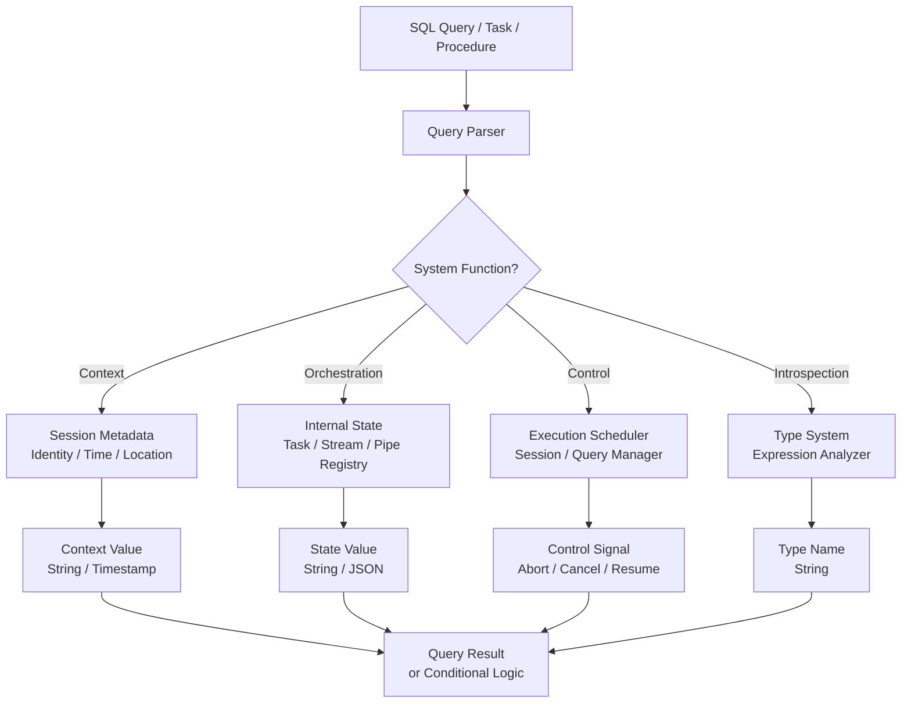

# 1. System Functions in Snowflake

# 2. Overview

System functions in Snowflake provide runtime information about the session, account, and execution environment, and perform administrative or orchestration operations that affect query execution, task graphs, streams, and pipes. They are broadly categorized into **information functions** (identity, timestamp, context), **control functions** (session and query management), and **orchestration functions** (task, stream, and pipe state operations).

System functions differ from scalar and aggregate functions in that they often interact with Snowflake's internal state rather than pure data values. Many return strings rather than booleans (a common exam trap), and several are callable only from stored procedures or specific execution contexts.

Key functions for data ingestion and pipeline automation include:
- `SYSTEM$STREAM_HAS_DATA`: Tests whether a stream contains unconsumed delta rows
- `SYSTEM$TASK_DEPENDENTS_ENABLE`: Resumes a root task and all downstream tasks in a DAG
- `SYSTEM$GET_PREDECESSOR_RETURN_VALUE`: Passes state between tasks in a graph
- `SYSTEM$CURRENT_USER_TASK_NAME`: Identifies the executing task from within its body
- `SYSTEM$ABORT_SESSION` / `SYSTEM$CANCEL_QUERY`: Operational control for runaway queries
- `SYSTEM$TYPEOF`: Runtime type introspection for debugging and dynamic SQL
- `SYSTEM$WAIT`: Procedural delay in stored procedures

The intended consumers are data engineers automating pipelines, platform operators managing warehouse workloads, and SnowPro Advanced exam candidates who must understand return types, privilege requirements, execution contexts, and deterministic behavior.

# 3. SQL Object Summary

| Object/Feature | Type | Purpose | Source Objects or Inputs | Output Object or Observable Behavior | Execution Mode or Invocation Method |
|---|---|---|---|---|---|
| [SYSTEM$STREAM_HAS_DATA](SQL Object Summary/SYSTEM$STREAM_HAS_DATA.md) | System function | Test stream for unconsumed deltas | Stream name | String `'TRUE'` or `'FALSE'` | Query or task `WHEN` clause |
| [SYSTEM$TASK_DEPENDENTS_ENABLE](SQL Object Summary/SYSTEM$TASK_DEPENDENTS_ENABLE.md) | System function | Resume task graph | Root task name | Success/failure indicator | `SELECT` or procedure call |
| [SYSTEM$GET_PREDECESSOR_RETURN_VALUE](SQL Object Summary/SYSTEM$GET_PREDECESSOR_RETURN_VALUE.md) | System function | Retrieve predecessor task output | Task name | Predecessor return value string | Inside child task SQL/procedure |
| [SYSTEM$CURRENT_USER_TASK_NAME](SQL Object Summary/SYSTEM$CURRENT_USER_TASK_NAME.md) | System function | Identify executing task | None (contextual) | Fully qualified task name or NULL | Inside task SQL/procedure |
| [SYSTEM$ABORT_SESSION](SQL Object Summary/SYSTEM$ABORT_SESSION.md) | System function | Terminate a session | Session ID | Success indicator | `CALL` or direct invocation |
| [SYSTEM$CANCEL_QUERY](SQL Object Summary/SYSTEM$CANCEL_QUERY.md) | System function | Cancel a running query | Query ID | Success indicator | `CALL` or direct invocation |
| [SYSTEM$TYPEOF](SQL Object Summary/SYSTEM$TYPEOF.md) | System function | Runtime type introspection | Expression | Type name string | Query-time |
| [SYSTEM$WAIT](SQL Object Summary/SYSTEM$WAIT.md) | System function | Procedural delay | Duration in seconds | Success indicator | Inside stored procedure |
| [CURRENT_USER / CURRENT_ROLE](SQL Object Summary/CURRENT_USER  CURRENT_ROLE.md) | Context function | Identity information | Session context | User/role name string | Query-time |
| [CURRENT_DATABASE / CURRENT_SCHEMA](SQL Object Summary/CURRENT_DATABASE  CURRENT_SCHEMA.md) | Context function | Session context | Session context | Database/schema name string | Query-time |
| [CURRENT_TIMESTAMP / CURRENT_DATE](SQL Object Summary/CURRENT_TIMESTAMP  CURRENT_DATE.md) | Context function | Temporal context | Session timezone | Timestamp/date value | Query-time |
| [CURRENT_VERSION](SQL Object Summary/CURRENT_VERSION.md) | Context function | Snowflake version | Engine state | Version string | Query-time |
| [GET_DDL](SQL Object Summary/GET_DDL.md) | Metadata function | Extract object DDL | Object type and name | DDL statement string | Query-time |

# 4. Architecture

System functions execute in the query engine's system services layer. Context functions read session metadata. Orchestration functions query internal task/stream/pipe state. Control functions send signals to the execution scheduler. Most return strings and execute with the privileges of the current session.

# 5. Data Flow / Process Flow

## Step 1: Function Invocation
- **Input:** SQL statement containing system function call
- **Transformation:** Parser identifies system function category; validates calling context (some functions valid only in procedures or tasks)
- **Output:** Bound system function call
- **Purpose:** Route to correct internal service

## Step 2: Context/State Retrieval
- **Input:** Function-specific parameters (stream name, task name, session ID)
- **Transformation:** Engine queries session metadata, task registry, stream offsets, or execution state
- **Output:** Raw internal state value
- **Purpose:** Gather system information

## Step 3: Type Conversion and Formatting
- **Input:** Internal state value
- **Transformation:** System functions often cast internal booleans or states to strings (e.g., `'TRUE'`/`'FALSE'`)
- **Output:** Formatted return value
- **Purpose:** Ensure consistent SQL-compatible output

## Step 4: Result Consumption
- **Input:** System function return value
- **Transformation:** Value used in conditional logic, assignment, or result projection
- **Output:** Executed query behavior or returned data
- **Purpose:** Drive automation or provide observability

# 6. Logical Breakdown

## Component: Stream State Inspector
- **Responsibility:** Determine if a stream has unconsumed changes
- **Inputs:** Stream name string
- **Outputs:** String `'TRUE'` or `'FALSE'`
- **Dependencies:** Stream must exist; caller must have `SELECT` on stream source
- **Failure Modes:** Returns `'FALSE'` for non-existent stream (may raise error depending on context); does not advance stream offset

## Component: Task Graph Controller
- **Responsibility:** Resume suspended task DAGs
- **Inputs:** Root task name
- **Outputs:** Success indicator
- **Dependencies:** Caller must have `OPERATE` on task or `EXECUTE TASK` account privilege
- **Failure Modes:** Fails if task does not exist or caller lacks privileges; does not validate task SQL

## Component: Task Inter-Process Communicator
- **Responsibility:** Pass return values between predecessor and child tasks
- **Inputs:** Predecessor task name
- **Outputs:** String return value from predecessor's last execution
- **Dependencies:** Predecessor must have completed successfully; child task must reference correct predecessor name
- **Failure Modes:** Returns `NULL` if predecessor failed or returned nothing; task name must be exact

## Component: Task Context Identifier
- **Responsibility:** Identify the currently executing task
- **Inputs:** None (reads execution context)
- **Outputs:** Fully qualified task name or `NULL` if not inside a task
- **Dependencies:** Must be called from within a task execution context
- **Failure Modes:** Returns `NULL` when called outside task context; not useful in ad hoc SQL

## Component: Session/Query Controller
- **Responsibility:** Abort sessions or cancel queries
- **Inputs:** Session ID or query ID
- **Outputs:** Success indicator
- **Dependencies:** `ACCOUNTADMIN` or `MONITOR` privileges typically required
- **Failure Modes:** Fails if ID invalid or caller lacks privileges; cannot cancel already-completed queries

## Component: Type Introspector
- **Responsibility:** Reveal runtime data type of an expression
- **Inputs:** Any SQL expression
- **Outputs:** Type name string (e.g., `'NUMBER(38,0)'`, `'VARCHAR(16777216)'`)
- **Dependencies:** Expression must be valid
- **Failure Modes:** Fails on invalid expression syntax

## Component: Procedural Delayer
- **Responsibility:** Pause execution in stored procedures
- **Inputs:** Duration in seconds
- **Outputs:** Success indicator
- **Dependencies:** Must be called inside a stored procedure
- **Failure Modes:** Fails if called outside procedure; long waits may hit procedure timeout

## Component: Session Context Provider
- **Responsibility:** Expose session metadata
- **Inputs:** Session state
- **Outputs:** User name, role name, database, schema, timestamp, version
- **Dependencies:** Active session
- **Failure Modes:** None for standard context functions

# 7. Data Model

## System Function Return Types (Selected)

| Function | Return Type | Context | Exam Trap |
|---|---|---|---|
| [`SYSTEM$STREAM_HAS_DATA`](System Function Return Types (Selected)/SYSTEM$STREAM_HAS_DATA.md) | VARCHAR | Stream monitoring | Returns string `'TRUE'`, not boolean |
| [`SYSTEM$TASK_DEPENDENTS_ENABLE`](System Function Return Types (Selected)/SYSTEM$TASK_DEPENDENTS_ENABLE.md) | VARCHAR | Task orchestration | Resumes entire graph, not single task |
| [`SYSTEM$GET_PREDECESSOR_RETURN_VALUE`](System Function Return Types (Selected)/SYSTEM$GET_PREDECESSOR_RETURN_VALUE.md) | VARCHAR | Task graph | Returns `NULL` if predecessor failed |
| [`SYSTEM$CURRENT_USER_TASK_NAME`](System Function Return Types (Selected)/SYSTEM$CURRENT_USER_TASK_NAME.md) | VARCHAR | Task introspection | Returns `NULL` outside task context |
| [`SYSTEM$ABORT_SESSION`](System Function Return Types (Selected)/SYSTEM$ABORT_SESSION.md) | VARCHAR | Operational control | Requires elevated privileges |
| [`SYSTEM$CANCEL_QUERY`](System Function Return Types (Selected)/SYSTEM$CANCEL_QUERY.md) | VARCHAR | Operational control | Query ID must be active |
| [`SYSTEM$TYPEOF`](System Function Return Types (Selected)/SYSTEM$TYPEOF.md) | VARCHAR | Debugging | Returns full type spec including precision |
| [`SYSTEM$WAIT`](System Function Return Types (Selected)/SYSTEM$WAIT.md) | VARCHAR | Procedural | Valid only in stored procedures |
| [`CURRENT_USER`](System Function Return Types (Selected)/CURRENT_USER.md) | VARCHAR | Identity | Returns current user, not role |
| [`CURRENT_ROLE`](System Function Return Types (Selected)/CURRENT_ROLE.md) | VARCHAR | Identity | Returns active role |
| [`CURRENT_TIMESTAMP`](System Function Return Types (Selected)/CURRENT_TIMESTAMP.md) | TIMESTAMP_LTZ | Temporal | Returns LTZ by default |
| [`GET_DDL`](System Function Return Types (Selected)/GET_DDL.md) | VARCHAR | Metadata | Secure objects return obscured DDL |

## Task Graph State Communication

| Component | Source | Target | Data Type |
|---|---|---|---|
| [Predecessor task return value](Task Graph State Communication/Predecessor task return value.md) | Predecessor task SQL/procedure | `SYSTEM$GET_PREDECESSOR_RETURN_VALUE` in child | String |
| [Task identity](Task Graph State Communication/Task identity.md) | Execution context | `SYSTEM$CURRENT_USER_TASK_NAME` | String |

# 8. Business Logic

## SYSTEM$STREAM_HAS_DATA
- Returns string `'TRUE'` if the stream has unconsumed delta rows
- Returns string `'FALSE'` if the stream is empty or does not exist
- **Exam trap:** The return type is `VARCHAR`, not `BOOLEAN`. In task `WHEN` clauses, must compare to string literal: `WHEN SYSTEM$STREAM_HAS_DATA('my_stream') = 'TRUE'`
- Does not advance the stream offset; purely a read-only check
- Stream must exist in the current database context or be fully qualified

## SYSTEM$TASK_DEPENDENTS_ENABLE
- Accepts a root task name and resumes that task plus all tasks in its dependency graph
- Equivalent to executing `ALTER TASK ... RESUME` on the root and all children
- Returns a success string or raises error on failure
- Requires `OPERATE` on the task or `EXECUTE TASK` account privilege
- Does not execute the task; only changes state from `SUSPENDED` to `STARTED`

## SYSTEM$GET_PREDECESSOR_RETURN_VALUE
- Called from within a child task to retrieve the return value of a predecessor task
- The predecessor task must have completed successfully on the current graph run
- Return value is passed as a string; cast or parse in child task as needed
- If the predecessor failed, skipped, or did not return a value, the result is `NULL`
- Predecessor name must match the task name referenced in the `AFTER` clause

## SYSTEM$CURRENT_USER_TASK_NAME
- Returns the fully qualified name (`database.schema.task`) of the task currently executing
- Returns `NULL` when called outside a task execution context (e.g., ad hoc worksheet)
- Useful for logging, dynamic SQL, and conditional logic within generic procedures called by multiple tasks

## SYSTEM$ABORT_SESSION
- Terminates a session by session ID
- Requires `ACCOUNTADMIN` or `MONITOR` privilege typically
- All active queries in the session are cancelled
- Used for runaway session termination or security incident response

## SYSTEM$CANCEL_QUERY
- Cancels a specific query by query ID
- Requires `ACCOUNTADMIN`, `MONITOR`, or ownership of the query
- Query must be actively running; cancelling a completed query is a no-op or error
- Used for operational intervention on long-running or blocking queries

## SYSTEM$TYPEOF
- Returns the runtime data type of an expression as a string
- Includes precision and scale (e.g., `'NUMBER(10,2)'`)
- Useful for debugging dynamic SQL, `VARIANT` parsing, and implicit coercion issues
- Expression is not evaluated for side effects; only type is resolved

## SYSTEM$WAIT
- Pauses execution for a specified number of seconds
- Valid only inside stored procedures; calling from ad hoc SQL raises error
- Used for polling loops, rate limiting, or sequencing in procedural logic
- Long waits may exceed procedure or task timeout limits

## Context Function Semantics
- `CURRENT_USER`: Returns the authenticated user name; independent of current role
- `CURRENT_ROLE`: Returns the active primary role
- `CURRENT_DATABASE` / `CURRENT_SCHEMA`: Return current session context; `NULL` if none set
- `CURRENT_TIMESTAMP`: Returns `TIMESTAMP_LTZ` by default; affected by session `TIMEZONE`
- `CURRENT_VERSION`: Returns Snowflake engine version string

## GET_DDL Semantics
- Returns the `CREATE` statement for a specified object
- For secure objects (secure views, secure UDFs), returns an obscured definition
- Requires appropriate privileges on the object
- Useful for documentation, migration, and version control

# 9. Transformations

## Stream State to Boolean String
- **Source:** Stream internal offset metadata
- **Output:** String `'TRUE'` or `'FALSE'`
- **Logic:** `SYSTEM$STREAM_HAS_DATA` checks if unconsumed deltas exist
- **Meaning:** Conditional trigger for task execution
- **Impact:** Drives event-driven pipeline scheduling

## Task Graph State to Resumed Graph
- **Source:** Suspended task DAG
- **Output:** Active task DAG
- **Logic:** `SYSTEM$TASK_DEPENDENTS_ENABLE` transitions state
- **Meaning:** Automation recovery after maintenance or failure
- **Impact:** Restores pipeline execution without individual task manipulation

## Predecessor Output to Child Input
- **Source:** Predecessor task return value
- **Output:** String parameter consumed by child task
- **Logic:** `SYSTEM$GET_PREDECESSOR_RETURN_VALUE` retrieves value
- **Meaning:** Inter-task communication channel
- **Impact:** Enables dynamic pipeline behavior based on upstream results

## Execution Context to Identity String
- **Source:** Internal task execution context
- **Output:** Task name string
- **Logic:** `SYSTEM$CURRENT_USER_TASK_NAME` reads context
- **Meaning:** Self-identification for logging and routing
- **Impact:** Enables generic procedures to behave task-specifically

## Expression to Type Name
- **Source:** SQL expression
- **Output:** Type specification string
- **Logic:** `SYSTEM$TYPEOF` resolves expression type
- **Meaning:** Runtime type introspection
- **Impact:** Debugging and dynamic SQL generation

## Session/Query ID to Termination Signal
- **Source:** Session or query identifier
- **Output:** Control signal
- **Logic:** `SYSTEM$ABORT_SESSION` or `SYSTEM$CANCEL_QUERY` sends signal
- **Meaning**: Operational intervention
- **Impact:** Resource recovery and incident response

# 10. Parameters / Variables / Configuration

| Name | Type | Purpose | Allowed Values | Default | Where Used | Effect |
|---|---|---|---|---|---|---|
| [Stream name](Parameters  Variables  Configuration/Stream name.md) | `SYSTEM$STREAM_HAS_DATA` arg | Target stream | Valid stream name | Required | Task `WHEN`, queries | Determines stream to check |
| [Task name](Parameters  Variables  Configuration/Task name.md) | `SYSTEM$TASK_DEPENDENTS_ENABLE` arg | Root task | Valid task name | Required | Orchestration queries | Graph to resume |
| [Predecessor name](Parameters  Variables  Configuration/Predecessor name.md) | `SYSTEM$GET_PREDECESSOR_RETURN_VALUE` arg | Source task | Valid predecessor name | Required | Child task body | Task to read return from |
| [Session ID](Parameters  Variables  Configuration/Session ID.md) | `SYSTEM$ABORT_SESSION` arg | Target session | Valid session ID | Required | Operational queries | Session to terminate |
| [Query ID](Parameters  Variables  Configuration/Query ID.md) | `SYSTEM$CANCEL_QUERY` arg | Target query | Valid query ID | Required | Operational queries | Query to cancel |
| [Expression](Parameters  Variables  Configuration/Expression.md) | `SYSTEM$TYPEOF` arg | Type target | Any valid expression | Required | Debugging queries | Expression to analyze |
| [Duration](Parameters  Variables  Configuration/Duration.md) | `SYSTEM$WAIT` arg | Delay length | Number >= 0 | Required | Stored procedures | Seconds to pause |
| [`TIMEZONE`](Parameters  Variables  Configuration/TIMEZONE.md) | Session parameter | Temporal context | IANA timezone | `UTC` | Session | Affects `CURRENT_TIMESTAMP` |
| [`TIMESTAMP_TYPE_MAPPING`](Parameters  Variables  Configuration/TIMESTAMP_TYPE_MAPPING.md) | Session parameter | Timestamp type | `TIMESTAMP_LTZ`, `TIMESTAMP_NTZ` | `TIMESTAMP_NTZ` | Session | Affects implicit timestamps |

# 11. APIs / Interfaces

## Interface: SYSTEM$STREAM_HAS_DATA
- **Invocation:** `SELECT SYSTEM$STREAM_HAS_DATA('my_stream')`
- **Input:** Stream name
- **Output:** String `'TRUE'` or `'FALSE'`
- **Error Behavior:** May fail if stream does not exist
- **Consumers:** Task `WHEN` clauses, conditional pipeline logic

## Interface: SYSTEM$TASK_DEPENDENTS_ENABLE
- **Invocation:** `SELECT SYSTEM$TASK_DEPENDENTS_ENABLE('my_db.my_schema.root_task')`
- **Input:** Root task name
- **Output:** Success indicator string
- **Error Behavior:** Fails if task missing or insufficient privileges
- **Consumers:** Deployment scripts, recovery runbooks

## Interface: SYSTEM$GET_PREDECESSOR_RETURN_VALUE
- **Invocation:** `SELECT SYSTEM$GET_PREDECESSOR_RETURN_VALUE('predecessor_task_name')`
- **Input:** Predecessor task name
- **Output:** String return value or `NULL`
- **Error Behavior:** Returns `NULL` if no value or predecessor failed
- **Consumers:** Task graph data passing, conditional child logic

## Interface: SYSTEM$CURRENT_USER_TASK_NAME
- **Invocation:** `SELECT SYSTEM$CURRENT_USER_TASK_NAME()`
- **Input:** None
- **Output:** Fully qualified task name or `NULL`
- **Error Behavior:** None; returns `NULL` outside task context
- **Consumers:** Logging, dynamic SQL in generic procedures

## Interface: SYSTEM$ABORT_SESSION
- **Invocation:** `SELECT SYSTEM$ABORT_SESSION(session_id)`
- **Input:** Session ID
- **Output:** Success indicator
- **Error Behavior:** Fails on invalid ID or insufficient privileges
- **Consumers:** Operational DBA scripts, security automation

## Interface: SYSTEM$CANCEL_QUERY
- **Invocation:** `SELECT SYSTEM$CANCEL_QUERY(query_id)`
- **Input:** Query ID
- **Output:** Success indicator
- **Error Behavior:** Fails on invalid ID, completed query, or insufficient privileges
- **Consumers:** Query monitoring, resource management

## Interface: SYSTEM$TYPEOF
- **Invocation:** `SELECT SYSTEM$TYPEOF(expression)`
- **Input:** SQL expression
- **Output:** Type name string
- **Error Behavior:** Fails on invalid expression
- **Consumers:** Debugging, dynamic SQL builders

## Interface: SYSTEM$WAIT
- **Invocation:** `SELECT SYSTEM$WAIT(10)` inside a stored procedure
- **Input:** Seconds to wait
- **Output:** Success indicator
- **Error Behavior:** Fails if called outside stored procedure
- **Consumers:** Polling procedures, rate limiting

## Interface: GET_DDL
- **Invocation:** `SELECT GET_DDL('TABLE', 'schema.table_name')`
- **Input:** Object type and name
- **Output:** DDL statement string
- **Error Behavior:** Fails if object missing or insufficient privileges
- **Consumers:** Schema documentation, migration scripts

# 12. Execution / Deployment

## Task Conditional Execution
- Use `WHEN SYSTEM$STREAM_HAS_DATA('my_stream') = 'TRUE'` to skip task execution when no data exists
- Always compare to string `'TRUE'`; do not rely on implicit boolean conversion
- Test stream condition independently before deploying task

## Task Graph Recovery
- After fixing a failed pipeline, use `SYSTEM$TASK_DEPENDENTS_ENABLE('root_task')` to resume the entire graph
- Verify task state with `SHOW TASKS` before and after
- Do not use for individual task resume; use `ALTER TASK` for single tasks

## Inter-Task Communication
- In predecessor task, use `RETURN` in a stored procedure or set a session variable to pass state
- In child task, call `SYSTEM$GET_PREDECESSOR_RETURN_VALUE('predecessor_name')` and parse the string
- Handle `NULL` returns for failed or skipped predecessors

## Operational Query Management
- Use `SYSTEM$CANCEL_QUERY` in monitoring procedures to abort long-running queries exceeding thresholds
- Use `SYSTEM$ABORT_SESSION` for runaway connections or compromised sessions
- Log all control operations for audit

## Debugging and Development
- Use `SYSTEM$TYPEOF` to verify `VARIANT` extraction types and implicit coercion results
- Use `GET_DDL` to capture object definitions for version control
- Use `CURRENT_USER`, `CURRENT_ROLE` to verify session context in multi-role environments

## Environment Behavior
- Development: Frequent `SYSTEM$TYPEOF` and `GET_DDL` for debugging; manual `SYSTEM$TASK_DEPENDENTS_ENABLE` for testing
- Production: Automated `SYSTEM$STREAM_HAS_DATA` in task graphs; `SYSTEM$CANCEL_QUERY` in monitoring tasks; `SYSTEM$CURRENT_USER_TASK_NAME` in logging

# 13. Observability

## Stream State Monitoring
- Poll `SYSTEM$STREAM_HAS_DATA` in monitoring tasks to detect pipeline stalls
- Track duration that streams remain in `'TRUE'` state (indicates unconsumed data)
- Correlate with `TASK_HISTORY` to identify failed consumers

## Task Graph Health
- Monitor `SYSTEM$TASK_DEPENDENTS_ENABLE` usage in deployment logs
- Track predecessor return value patterns for task graph data flow validation
- Use `SYSTEM$CURRENT_USER_TASK_NAME` in audit tables to trace which task loaded data

## Query and Session Control
- Log all `SYSTEM$ABORT_SESSION` and `SYSTEM$CANCEL_QUERY` invocations
- Correlate cancelled query IDs with `QUERY_HISTORY` for root cause analysis
- Monitor who executes control functions for security compliance

## Type Debugging
- Use `SYSTEM$TYPEOF` in data quality checks to detect schema drift in `VARIANT` columns
- Compare `SYSTEM$TYPEOF` results against expected types in validation procedures

## Key Metrics
- Stream data pending duration (time `SYSTEM$STREAM_HAS_DATA` remains `'TRUE'`)
- Task graph resume success rate
- Predecessor return value null rate
- Control function execution frequency by user
- Type mismatch detection rate via `SYSTEM$TYPEOF`

# 14. Failure Handling & Recovery

## Stream Has Data String Comparison Error
- **What breaks:** `WHEN SYSTEM$STREAM_HAS_DATA('stream') = TRUE` fails because return is string, not boolean
- **Detection:** Task compilation error or unexpected behavior
- **Fallback:** Compare to string literal: `= 'TRUE'`
- **Recovery:** Fix all task `WHEN` clauses to use string comparison

## Task Dependents Enable Privilege Failure
- **What breaks:** Non-owner attempts to resume task graph
- **Detection:** Authorization error
- **Fallback:** Use `ALTER TASK ... RESUME` on individual tasks if graph-wide resume is not permitted
- **Recovery:** Grant `EXECUTE TASK` or `OPERATE` on task to service role

## Predecessor Return Value is NULL
- **What breaks:** Child task expects predecessor output but receives `NULL`
- **Detection:** Unexpected null in child task logic
- **Fallback:** Add `IFNULL` or default handling in child task
- **Recovery:** Verify predecessor completed successfully; check predecessor name spelling matches `AFTER` clause exactly

## Current User Task Name Returns NULL
- **What breaks:** Procedure using `SYSTEM$CURRENT_USER_TASK_NAME` behaves differently when tested ad hoc vs. in task
- **Detection:** NULL values in logs or routing logic
- **Fallback:** Add conditional logic for non-task context
- **Recovery:** Test procedures only within task execution context; or add `IFNULL` fallback

## Cancel Query on Completed Query
- **What breaks:** `SYSTEM$CANCEL_QUERY` called on already-finished query
- **Detection:** Error or no-op
- **Fallback:** Verify query state in `QUERY_HISTORY` before cancelling
- **Recovery:** Check `EXECUTION_STATUS` is `RUNNING` before issuing cancel

## Wait Outside Procedure
- **What breaks:** `SYSTEM$WAIT` called in ad hoc SQL raises error
- **Detection:** `Invalid usage of SYSTEM$WAIT outside stored procedure`
- **Fallback:** Use `CALL` to a procedure containing the wait
- **Recovery:** Encapsulate wait logic in stored procedures only

## GET_DDL on Secure Object
- **What breaks:** `GET_DDL` returns obscured definition for secure objects
- **Detection:** DDL shows placeholder instead of actual logic
- **Fallback:** Query source from version control
- **Recovery:** Temporarily make object non-secure for DDL capture, or maintain external documentation

# 15. Security & Access Control

## Privilege Requirements

| Action | Required Privilege | Object |
|---|---|---|
| [Call `SYSTEM$STREAM_HAS_DATA`](Privilege Requirements/Call SYSTEM$STREAM_HAS_DATA.md) | `SELECT` on stream source | Stream |
| [Call `SYSTEM$TASK_DEPENDENTS_ENABLE`](Privilege Requirements/Call SYSTEM$TASK_DEPENDENTS_ENABLE.md) | `EXECUTE TASK` or `OPERATE` on task | Task |
| [Call `SYSTEM$GET_PREDECESSOR_RETURN_VALUE`](Privilege Requirements/Call SYSTEM$GET_PREDECESSOR_RETURN_VALUE.md) | Implicit via task execution | Task graph |
| [Call `SYSTEM$ABORT_SESSION`](Privilege Requirements/Call SYSTEM$ABORT_SESSION.md) | `ACCOUNTADMIN` or `MONITOR` | Account |
| [Call `SYSTEM$CANCEL_QUERY`](Privilege Requirements/Call SYSTEM$CANCEL_QUERY.md) | `ACCOUNTADMIN`, `MONITOR`, or query owner | Query |
| [Call `SYSTEM$TYPEOF`](Privilege Requirements/Call SYSTEM$TYPEOF.md) | None | N/A |
| [Call `SYSTEM$WAIT`](Privilege Requirements/Call SYSTEM$WAIT.md) | None (procedure context) | N/A |
| [Call `GET_DDL`](Privilege Requirements/Call GET_DDL.md) | `USAGE` + `SELECT` or ownership | Target object |

## Control Function Governance
- `SYSTEM$ABORT_SESSION` and `SYSTEM$CANCEL_QUERY` are destructive operations
- Restrict to `ACCOUNTADMIN` and authorized SRE roles
- Log all invocations via `QUERY_HISTORY` for audit

## Task Graph Security
- `SYSTEM$GET_PREDECESSOR_RETURN_VALUE` can expose upstream state to downstream tasks
- Ensure return values do not contain sensitive data unless downstream tasks are authorized
- Task names may reveal pipeline structure; consider if this is sensitive

## Context Function Exposure
- `CURRENT_USER`, `CURRENT_ROLE`, `CURRENT_DATABASE` expose session context
- Do not rely on these for security decisions in client applications
- Use Snowflake's native RBAC for access control, not client-side context checks

# 16. Performance / Scalability Considerations

## SYSTEM$STREAM_HAS_DATA
- Lightweight metadata query; negligible overhead
- Safe to use in task `WHEN` clauses evaluated every schedule tick
- Does not scan table data; only checks stream offset metadata

## SYSTEM$TASK_DEPENDENTS_ENABLE
- Metadata operation; updates task states in catalog
- Does not execute tasks; minimal compute cost
- May take longer for very large task graphs (hundreds of tasks)

## SYSTEM$GET_PREDECESSOR_RETURN_VALUE
- Reads task history metadata
- Latency minimal; no table scanning
- Called once per child task execution

## SYSTEM$ABORT_SESSION / SYSTEM$CANCEL_QUERY
- Control operations are fast but may leave transactions in inconsistent states
- Cancelled queries roll back uncommitted work
- Aborting a session cascades to all its queries

## SYSTEM$TYPEOF
- Expression type resolution is compile-time operation
- Negligible overhead; expression not executed
- Safe for frequent use in debugging

## SYSTEM$WAIT
- Consumes procedure execution time but no warehouse compute
- Long waits may hit procedure timeout limits
- Use for short polling intervals (seconds to minutes), not long delays

## Context Functions
- `CURRENT_TIMESTAMP` is non-deterministic; disables result cache for queries using it
- `CURRENT_USER` and `CURRENT_ROLE` are deterministic per session
- Frequent context switching between roles adds session overhead

# 17. Assumptions & Constraints

## Explicit Assumptions
- The reader is automating pipelines or operating Snowflake infrastructure
- System functions are used within tasks, procedures, or operational queries
- The reader understands the distinction between string returns and boolean values

## Engine Boundaries
- `SYSTEM$STREAM_HAS_DATA` returns `VARCHAR`, not `BOOLEAN`
- `SYSTEM$WAIT` is valid only inside stored procedures
- `SYSTEM$CURRENT_USER_TASK_NAME` returns `NULL` outside task context
- `SYSTEM$GET_PREDECESSOR_RETURN_VALUE` works only within a task graph; returns `NULL` if predecessor failed
- `SYSTEM$ABORT_SESSION` and `SYSTEM$CANCEL_QUERY` require elevated privileges
- `GET_DDL` on secure objects returns obscured definitions
- Context functions reflect current session state; may change mid-transaction if role or context is altered

## Exam-Relevant Defaults
- `SYSTEM$STREAM_HAS_DATA` returns string `'TRUE'` or `'FALSE'`
- `CURRENT_TIMESTAMP` returns `TIMESTAMP_LTZ` by default
- `CURRENT_DATABASE` / `CURRENT_SCHEMA` return `NULL` if not set
- Tasks are created `SUSPENDED`; `SYSTEM$TASK_DEPENDENTS_ENABLE` is required to resume entire graphs
- `SYSTEM$TYPEOF` returns full type specification including precision and scale

## Ambiguities
- Exact behavior of `SYSTEM$GET_PREDECESSOR_RETURN_VALUE` when multiple predecessors exist is not fully specified; returns value from named predecessor only
- `SYSTEM$STREAM_HAS_DATA` behavior on stale streams is not explicitly documented as raising an error vs. returning `'FALSE'`
- Timeout behavior of `SYSTEM$WAIT` relative to task timeout is not precisely documented

# 18. Future Enhancements

- Implement centralized task graph validation procedures that verify all `WHEN` clauses use string comparison `= 'TRUE'` for `SYSTEM$STREAM_HAS_DATA`
- Add automated monitoring tasks that poll `SYSTEM$STREAM_HAS_DATA` for critical streams and alert when stale or perpetually true
- Use `SYSTEM$CURRENT_USER_TASK_NAME` in all generic pipeline procedures to inject task identity into audit tables without hardcoding
- Replace manual task graph resume scripts with `SYSTEM$TASK_DEPENDENTS_ENABLE` calls in deployment automation
- Implement query monitoring procedures using `SYSTEM$CANCEL_QUERY` with configurable thresholds for aborting runaway queries
- Add `SYSTEM$TYPEOF` checks in dynamic SQL builders to validate `VARIANT` extraction types before casting
- Use `GET_DDL` in schema drift detection tasks that compare production object definitions to version-controlled baselines
- Encapsulate all `SYSTEM$WAIT` calls in reusable polling procedures with timeout guards and exponential backoff
- Log all `SYSTEM$ABORT_SESSION` and `SYSTEM$CANCEL_QUERY` executions to a dedicated audit table for compliance review
- Standardize predecessor return value schemas using JSON strings to enable structured inter-task communication via `SYSTEM$GET_PREDECESSOR_RETURN_VALUE`
