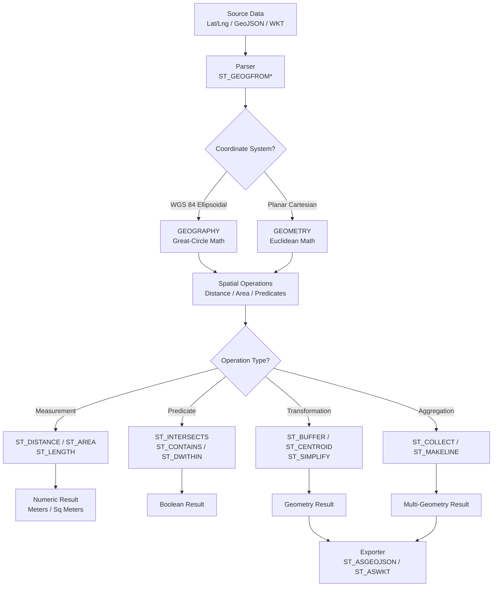

# 1. Geospatial Functions in Snowflake

# 2. Overview

Snowflake geospatial functions operate on **GEOGRAPHY** and **GEOMETRY** data types to represent, parse, transform, and analyze spatial data. GEOGRAPHY models ellipsoidal coordinates on the WGS 84 datum (latitude/longitude), while GEOMETRY models planar (Cartesian) coordinates. The function library supports point, line, and polygon construction; distance and area calculation; spatial relationship predicates (intersection, containment, within-distance); aggregation; and format conversion (WKT, GeoJSON, WKB).

Geospatial functions enable location-based analytics, territory mapping, route proximity analysis, and spatial joins between datasets. They execute per row or per group using great-circle (GEOGRAPHY) or Euclidean (GEOMETRY) mathematics.

This feature exists to:
- Store and query latitude/longitude coordinates natively without external GIS systems
- Perform proximity searches, boundary containment checks, and intersection tests
- Aggregate point collections into lines, polygons, or multi-geometries
- Integrate GeoJSON and WKT data from APIs, IoT devices, and mapping platforms

The intended consumers are data engineers ingesting location data, analytics engineers building geo-analytics models, and SnowPro Advanced exam candidates who must understand the WGS 84 datum, return units (meters for GEOGRAPHY), the absence of native spatial indexes, and the computational cost of spatial predicates.

# 3. SQL Object Summary

| Object/Feature | Type | Purpose | Source Objects or Inputs | Output Object or Observable Behavior | Execution Mode or Invocation Method |
|---|---|---|---|---|---|
| [GEOGRAPHY](SQL Object Summary/GEOGRAPHY.md) | Data type | Ellipsoidal coordinate storage | Latitude/longitude or WKT/GeoJSON | Binary-encoded geospatial object | Column definition, CAST, constructor |
| [GEOMETRY](SQL Object Summary/GEOMETRY.md) | Data type | Planar coordinate storage | X/Y coordinates or WKT/GeoJSON | Binary-encoded geospatial object | Column definition, CAST, constructor |
| [ST_MAKEPOINT](SQL Object Summary/ST_MAKEPOINT.md) | Constructor | Create point from coordinates | Longitude, latitude (GEOGRAPHY) or X, Y (GEOMETRY) | Point geometry | Scalar function |
| [ST_MAKELINE](SQL Object Summary/ST_MAKELINE.md) | Constructor | Create line from points | Array of points or point columns | Line geometry | Aggregate or scalar function |
| [ST_MAKEPOLYGON](SQL Object Summary/ST_MAKEPOLYGON.md) | Constructor | Create polygon from ring | Line ring or array of points | Polygon geometry | Scalar function |
| [ST_DISTANCE](SQL Object Summary/ST_DISTANCE.md) | Measurement | Distance between two geometries | Two geospatial objects | Distance in meters (GEOGRAPHY) or units (GEOMETRY) | Scalar function |
| [ST_DWITHIN](SQL Object Summary/ST_DWITHIN.md) | Predicate | Within-distance test | Two geospatial objects, distance threshold | Boolean | Scalar function |
| [ST_LENGTH](SQL Object Summary/ST_LENGTH.md) | Measurement | Length of line geometry | Line geometry | Length in meters (GEOGRAPHY) | Scalar function |
| [ST_AREA](SQL Object Summary/ST_AREA.md) | Measurement | Area of polygon | Polygon geometry | Area in square meters (GEOGRAPHY) | Scalar function |
| [ST_INTERSECTS](SQL Object Summary/ST_INTERSECTS.md) | Predicate | Intersection test | Two geospatial objects | Boolean | Scalar function |
| [ST_CONTAINS](SQL Object Summary/ST_CONTAINS.md) | Predicate | Containment test | Outer geometry, inner geometry | Boolean | Scalar function |
| [ST_WITHIN](SQL Object Summary/ST_WITHIN.md) | Predicate | Within test | Inner geometry, outer geometry | Boolean | Scalar function |
| [ST_CENTROID](SQL Object Summary/ST_CENTROID.md) | Transformation | Compute centroid | Polygon or multipolygon | Point geometry | Scalar function |
| [ST_BUFFER](SQL Object Summary/ST_BUFFER.md) | Transformation | Expand geometry by radius | Geometry, radius distance | Expanded polygon | Scalar function |
| [ST_COLLECT](SQL Object Summary/ST_COLLECT.md) | Aggregate | Collect geometries into multi-geometry | Set of geometries | Multi-point/line/polygon | Aggregate function |
| [ST_ASGEOJSON](SQL Object Summary/ST_ASGEOJSON.md) | Conversion | Export to GeoJSON | GEOGRAPHY/GEOMETRY | GeoJSON string | Scalar function |
| [ST_ASWKT](SQL Object Summary/ST_ASWKT.md) | Conversion | Export to WKT | GEOGRAPHY/GEOMETRY | WKT string | Scalar function |
| [ST_GEOGFROMWKT](SQL Object Summary/ST_GEOGFROMWKT.md) | Conversion | Parse WKT to GEOGRAPHY | WKT string | GEOGRAPHY object | Scalar function |
| [ST_GEOGFROMGEOJSON](SQL Object Summary/ST_GEOGFROMGEOJSON.md) | Conversion | Parse GeoJSON to GEOGRAPHY | GeoJSON string | GEOGRAPHY object | Scalar function |
| [ST_X / ST_Y](SQL Object Summary/ST_X  ST_Y.md) | Accessor | Extract coordinates | Point geometry | Coordinate number | Scalar function |
| [ST_SIMPLIFY](SQL Object Summary/ST_SIMPLIFY.md) | Transformation | Reduce vertex count | Geometry, tolerance | Simplified geometry | Scalar function |
| [ST_TRANSFORM](SQL Object Summary/ST_TRANSFORM.md) | Transformation | Reproject coordinates | Geometry, source SRID, target SRID | Reprojected geometry | Scalar function |

# 4. Architecture

Geospatial data is stored as compressed binary objects (WKB-like internal encoding). GEOGRAPHY uses geodetic calculations on the WGS 84 ellipsoid. GEOMETRY uses planar Cartesian calculations. Functions are evaluated by a dedicated geospatial engine within the query processor. Spatial relationships rely on brute-force geometry comparison unless limited by additional predicates or clustering.

# 5. Data Flow / Process Flow

## Step 1: Data Ingestion and Parsing
- **Input:** Raw geospatial strings (GeoJSON, WKT, CSV lat/lng pairs) or binary data
- **Transformation:** `ST_GEOGFROMGEOJSON`, `ST_GEOGFROMWKT`, or `ST_MAKEPOINT` parse and validate coordinates
- **Output:** `GEOGRAPHY` or `GEOMETRY` binary objects stored in table columns
- **Purpose:** Convert external geospatial formats to native binary storage

## Step 2: Validation and Construction
- **Input:** Coordinate values or parsed geometries
- **Transformation:** Constructors validate ring closure (polygons), coordinate ranges, and GeoJSON structure
- **Output:** Valid geometry objects or parse errors
- **Purpose:** Ensure geometric integrity before analysis

## Step 3: Spatial Measurement
- **Input:** Two point geometries or a single line/polygon geometry
- **Transformation:** `ST_DISTANCE` computes great-circle distance (GEOGRAPHY) or Euclidean distance (GEOMETRY); `ST_AREA` and `ST_LENGTH` compute surface and path measurements
- **Output:** Numeric values in meters or square meters (GEOGRAPHY)
- **Purpose:** Quantify spatial relationships

## Step 4: Spatial Predicate Evaluation
- **Input:** Two geometries (point-point, point-polygon, polygon-polygon)
- **Transformation:** `ST_INTERSECTS`, `ST_CONTAINS`, `ST_WITHIN`, `ST_DWITHIN` evaluate topological relationships
- **Output:** Boolean values per row
- **Purpose:** Filter and classify spatial relationships

## Step 5: Spatial Transformation
- **Input:** Source geometry and transformation parameters
- **Transformation:** `ST_BUFFER` generates a radius polygon; `ST_CENTROID` computes a center point; `ST_SIMPLIFY` reduces vertices
- **Output:** New geometry objects
- **Purpose:** Derive geometries for downstream analysis

## Step 6: Aggregation
- **Input:** Set of geometries in a group
- **Transformation:** `ST_COLLECT` aggregates into multi-geometries; `ST_MAKELINE` connects ordered points
- **Output:** Composite geometry objects
- **Purpose:** Summarize spatial collections

## Step 7: Export
- **Input:** Native geometry objects
- **Transformation:** `ST_ASGEOJSON` or `ST_ASWKT` serializes to standard formats
- **Output:** String representations for external systems
- **Purpose:** Interoperability with GIS tools and APIs

# 6. Logical Breakdown

## Component: GEOGRAPHY Type
- **Responsibility:** Store and compute ellipsoidal coordinates on WGS 84
- **Inputs:** Longitude (-180 to 180), latitude (-90 to 90)
- **Outputs:** Binary-encoded geodetic geometry
- **Dependencies:** Valid WGS 84 coordinates
- **Failure Modes:** Coordinates outside valid range raise errors; antimeridian crossings (longitude 180/-180) may produce unexpected polygon behavior unless vertices are ordered correctly

## Component: GEOMETRY Type
- **Responsibility:** Store and compute planar Cartesian coordinates
- **Inputs:** X, Y coordinates; optional SRID for projection
- **Outputs:** Binary-encoded planar geometry
- **Dependencies:** Valid coordinate pairs
- **Failure Modes:** GEOMETRY is not the default for most geospatial functions; explicit casting or function selection required

## Component: WKT/GeoJSON Parser
- **Responsibility:** Deserialize standard formats to native types
- **Inputs:** WKT string or GeoJSON string
- **Outputs:** GEOGRAPHY or GEOMETRY object
- **Dependencies:** Well-formed input strings
- **Failure Modes:** Malformed GeoJSON raises parse error; invalid WKT syntax raises error; unsupported geometry types raise error

## Component: Distance Calculator
- **Responsibility:** Compute distance between geometries
- **Inputs:** Two geometries
- **Outputs:** Distance in meters (GEOGRAPHY) or coordinate units (GEOMETRY)
- **Dependencies:** Valid geometries
- **Failure Modes:** Cross-type operations (GEOGRAPHY vs GEOMETRY) raise errors; mixed SRIDs in GEOMETRY raise errors

## Component: Spatial Predicate Engine
- **Responsibility:** Evaluate topological relationships
- **Inputs:** Two geometries
- **Outputs:** Boolean result
- **Dependencies:** Valid geometries
- **Failure Modes:** Complex polygons with self-intersections may produce indeterminate results; empty geometries return false

## Component: Transformation Engine
- **Responsibility:** Derive new geometries from existing ones
- **Inputs:** Source geometry, parameters (radius, tolerance)
- **Outputs:** Transformed geometry
- **Dependencies:** Valid geometries; sufficient precision
- **Failure Modes:** Very large buffers may wrap the globe; simplification tolerance too high may collapse polygons

## Component: Aggregation Engine
- **Responsibility:** Combine multiple geometries
- **Inputs:** Set of geometries
- **Outputs:** Multi-geometry or line
- **Dependencies:** Compatible geometry types
- **Failure Modes:** Collecting incompatible types may produce heterogeneous multi-geometries; null inputs are skipped

## Component: Export Serializer
- **Responsibility:** Convert native geometries to standard formats
- **Inputs:** GEOGRAPHY or GEOMETRY object
- **Outputs:** GeoJSON or WKT string
- **Dependencies:** Valid geometry
- **Failure Modes:** None for valid geometries; very large geometries may exceed string output limits

# 7. Data Model

## GEOGRAPHY Column Storage

| Attribute | Role | Notes |
|---|---|---|
| [Internal format](GEOMETRY Column Storage/Internal format.md) | Binary | Compressed WKB-like encoding |
| [Coordinate system](GEOMETRY Column Storage/Coordinate system.md) | WGS 84 | EPSG:4326 |
| [Units](GEOMETRY Column Storage/Units.md) | Degrees input, meters output | Distance/area return meters/sq meters |
| [Precision](GEOGRAPHY Column Storage/Precision.md) | Double-precision floating point | ~15 decimal digits |
| [Validity](GEOGRAPHY Column Storage/Validity.md) | Enforced at construction | Invalid coordinates rejected |

## GEOMETRY Column Storage

| Attribute | Role | Notes |
|---|---|---|
| [Internal format](GEOMETRY Column Storage/Internal format.md) | Binary | Compressed planar encoding |
| [Coordinate system](GEOMETRY Column Storage/Coordinate system.md) | Cartesian | Defined by SRID |
| [Units](GEOMETRY Column Storage/Units.md) | Coordinate units | Input and output in same units |
| [SRID](GEOMETRY Column Storage/SRID.md) | Spatial reference | Default 0; use ST_TRANSFORM to reproject |

## Point Table (Example)

| Column | Role | Type | Grain | Notes |
|---|---|---|---|---|
| [`LOCATION_ID`](Point Table (Example)/LOCATION_ID.md) | Identifier | VARCHAR | One per location | Business key |
| [`GEO`](Point Table (Example)/GEO.md) | Geospatial | GEOGRAPHY | One per location | `ST_MAKEPOINT(lng, lat)` |
| [`LATITUDE`](Point Table (Example)/LATITUDE.md) | Raw coordinate | NUMBER | One per location | Source latitude |
| [`LONGITUDE`](Point Table (Example)/LONGITUDE.md) | Raw coordinate | NUMBER | One per location | Source longitude |
| [`CATEGORY`](Point Table (Example)/CATEGORY.md) | Dimension | VARCHAR | One per location | Classification |

## Grain
One row per spatial entity.

## Polygon Table (Example)

| Column | Role | Type | Grain | Notes |
|---|---|---|---|---|
| [`REGION_ID`](Polygon Table (Example)/REGION_ID.md) | Identifier | VARCHAR | One per region | Business key |
| [`BOUNDARY`](Polygon Table (Example)/BOUNDARY.md) | Geospatial | GEOGRAPHY | One per region | `ST_MAKEPOLYGON(ring)` |
| [`AREA_SQ_M`](Polygon Table (Example)/AREA_SQ_M.md) | Cached metric | NUMBER | One per region | `ST_AREA(BOUNDARY)` |
| [`CENTER`](Polygon Table (Example)/CENTER.md) | Cached centroid | GEOGRAPHY | One per region | `ST_CENTROID(BOUNDARY)` |

## Grain
One row per region.

# 8. Business Logic

## Coordinate Order Convention
- **GEOGRAPHY:** `ST_MAKEPOINT(longitude, latitude)` — longitude first, latitude second
- **GEOMETRY:** `ST_MAKEPOINT(x, y)` — X first, Y second
- **Exam trap:** Reversing latitude and longitude places points in wrong hemispheres

## WGS 84 and Great-Circle Calculations
- GEOGRAPHY uses the WGS 84 ellipsoid for all calculations
- `ST_DISTANCE` returns the shortest path (geodesic) distance in meters
- `ST_AREA` returns the surface area on the ellipsoid in square meters
- Calculations account for Earth curvature; not planar approximations

## GEOMETRY and Planar Calculations
- GEOMETRY uses Euclidean (Cartesian) distance
- `ST_DISTANCE` returns distance in the coordinate units of the data
- Appropriate for small-scale, local projections where Earth curvature is negligible
- Must use `ST_TRANSFORM` to reproject between coordinate systems

## Polygon Ring Orientation
- Polygon exterior rings should be oriented counter-clockwise
- Interior rings (holes) should be oriented clockwise
- Snowflake may automatically correct orientation, but inconsistent ordering can cause unexpected containment results

## Antimeridian and Pole Handling
- Polygons crossing the antimeridian (longitude 180/-180) must have vertices ordered to avoid wrapping around the globe the long way
- Points at the poles (latitude ±90) have undefined longitude; use with caution
- `ST_BUFFER` around a point near the antimeridian may produce a polygon that crosses it

## Empty Geometry
- `ST_GEOGFROMGEOJSON('{"type":"Point","coordinates":[]}')` produces an empty geometry
- Empty geometries return `NULL` from most measurement functions
- Spatial predicates with empty geometries return `FALSE`

## NULL Handling
- `NULL` input to geospatial functions generally returns `NULL`
- `ST_DISTANCE(NULL, geom)` returns `NULL`
- Aggregate functions (`ST_COLLECT`) skip `NULL` inputs

## ST_DWITHIN Semantics
- `ST_DWITHIN(geom1, geom2, distance)` returns `TRUE` if the minimum distance between boundaries is <= distance
- Distance is in meters for GEOGRAPHY
- More efficient than `ST_DISTANCE(geom1, geom2) <= distance` because it can short-circuit without computing exact distance

## ST_CONTAINS vs ST_WITHIN
- `ST_CONTAINS(outer, inner)` returns true if outer completely contains inner
- `ST_WITHIN(inner, outer)` is the inverse: true if inner is inside outer
- Boundaries are included; a point on the edge is considered contained

## ST_INTERSECTS Semantics
- Returns `TRUE` if geometries share any portion of space
- Includes boundary touching; adjacent polygons with shared edge intersect
- Use `ST_DWITHIN` with small tolerance for near-miss matching

## ST_COLLECT Behavior
- Aggregates geometries into a multi-geometry
- `ST_COLLECT(point1, point2)` returns a `MULTIPOINT`
- `ST_COLLECT(line1, line2)` returns a `MULTILINESTRING`
- Mixed types return a `GEOMETRYCOLLECTION`

## ST_BUFFER on GEOGRAPHY
- Creates a polygon approximating a circle around a point at given radius in meters
- Buffer polygon follows geodesic curves
- Very large buffers (thousands of kilometers) may distort significantly near poles

## ST_SIMPLIFY
- Reduces vertex count using Douglas-Peucker algorithm
- Tolerance is in meters for GEOGRAPHY, coordinate units for GEOMETRY
- Excessive tolerance may collapse polygons to lines or points

# 9. Transformations

## Raw Coordinates to GEOGRAPHY Point
- **Source:** Numeric longitude and latitude
- **Output:** GEOGRAPHY point object
- **Logic:** `ST_MAKEPOINT(longitude, latitude)`
- **Meaning:** Native geospatial point storage
- **Impact:** Enables spatial querying and measurement

## GeoJSON String to GEOGRAPHY
- **Source:** GeoJSON string from API or file
- **Output:** GEOGRAPHY object
- **Logic:** `ST_GEOGFROMGEOJSON(json_string)`
- **Meaning:** Standard format ingestion
- **Impact:** Enables integration with external GIS systems

## WKT String to GEOGRAPHY
- **Source:** WKT string from spatial database export
- **Output:** GEOGRAPHY object
- **Logic:** `ST_GEOGFROMWKT(wkt_string)`
- **Meaning:** Industry-standard format ingestion
- **Impact:** Migration from PostGIS, SQL Server Spatial, etc.

## Two Points to Distance
- **Source:** Two GEOGRAPHY points
- **Output:** Distance in meters
- **Logic:** `ST_DISTANCE(point1, point2)`
- **Meaning:** Great-circle distance calculation
- **Impact:** Proximity analysis and radius filtering

## Point and Radius to Search Polygon
- **Source:** Center point and radius in meters
- **Output:** Buffer polygon
- **Logic:** `ST_BUFFER(point, radius)`
- **Meaning:** Search area definition
- **Impact:** Enables radius-based spatial joins

## Polygon to Centroid
- **Source:** Polygon geometry
- **Output:** Center point
- **Logic:** `ST_CENTROID(polygon)`
- **Meaning:** Representative point for region
- **Impact:** Label placement, map markers, distance approximations

## Points to Line
- **Source:** Ordered set of points
- **Output:** Line geometry
- **Logic:** `ST_MAKELINE(point_array)` or aggregate `ST_MAKELINE(geo ORDER BY seq)`
- **Meaning:** Route or boundary line construction
- **Impact:** Path analysis and visualization

## Points to Collection
- **Source:** Set of points in a group
- **Output:** Multi-point geometry
- **Logic:** `ST_COLLECT(geo)`
- **Meaning:** Spatial aggregation
- **Impact:** Cluster representation and density analysis

## GEOGRAPHY to GeoJSON
- **Source:** Native geometry
- **Output:** GeoJSON string
- **Logic:** `ST_ASGEOJSON(geo)`
- **Meaning:** Standard format export
- **Impact:** API response construction, external tool integration

## Complex Polygon to Simplified Polygon
- **Source:** High-vertex-count polygon
- **Output:** Simplified polygon
- **Logic:** `ST_SIMPLIFY(geo, tolerance_meters)`
- **Meaning:** Vertex reduction for performance
- **Impact:** Faster rendering and reduced storage

# 10. Parameters / Variables / Configuration

| Name | Type | Purpose | Allowed Values | Default | Where Used | Effect |
|---|---|---|---|---|---|---|
| [`GEOGRAPHY`](Parameters  Variables  Configuration/GEOGRAPHY.md) | Data type | Ellipsoidal storage | Binary | N/A | Column definition | WGS 84 geodetic geometry |
| [`GEOMETRY`](Parameters  Variables  Configuration/GEOMETRY.md) | Data type | Planar storage | Binary | N/A | Column definition | Cartesian geometry |
| [`ST_MAKEPOINT`](Parameters  Variables  Configuration/ST_MAKEPOINT.md) | Function args | Point construction | Two numbers | Required | Constructor | Longitude/X first, latitude/Y second |
| [`ST_BUFFER` radius](Parameters  Variables  Configuration/ST_BUFFER radius.md) | Function arg | Buffer distance | Number >= 0 | Required | Transformation | Meters for GEOGRAPHY |
| [`ST_DWITHIN` distance](Parameters  Variables  Configuration/ST_DWITHIN distance.md) | Function arg | Distance threshold | Number >= 0 | Required | Predicate | Meters for GEOGRAPHY |
| [`ST_SIMPLIFY` tolerance](Parameters  Variables  Configuration/ST_SIMPLIFY tolerance.md) | Function arg | Simplification threshold | Number >= 0 | Required | Transformation | Meters for GEOGRAPHY |
| [`ST_TRANSFORM` SRID](Parameters  Variables  Configuration/ST_TRANSFORM SRID.md) | Function args | Reprojection | Source SRID, target SRID | Required | Transformation | Coordinate system conversion |
| [`ST_GEOGFROMGEOJSON`](Parameters  Variables  Configuration/ST_GEOGFROMGEOJSON.md) | Function arg | Parse GeoJSON | Valid GeoJSON string | Required | Conversion | Returns GEOGRAPHY |
| [`ST_GEOGFROMWKT`](Parameters  Variables  Configuration/ST_GEOGFROMWKT.md) | Function arg | Parse WKT | Valid WKT string | Required | Conversion | Returns GEOGRAPHY |
| [`ST_ASGEOJSON`](Parameters  Variables  Configuration/ST_ASGEOJSON.md) | Function arg | Export GeoJSON | GEOGRAPHY/GEOMETRY | Required | Conversion | Returns GeoJSON string |
| [`ST_ASWKT`](Parameters  Variables  Configuration/ST_ASWKT.md) | Function arg | Export WKT | GEOGRAPHY/GEOMETRY | Required | Conversion | Returns WKT string |
| [`TIMEZONE`](Parameters  Variables  Configuration/TIMEZONE.md) | Session parameter | Temporal context | IANA timezone | `UTC` | Session | Affects timestamp context |

# 11. APIs / Interfaces

## Interface: ST_MAKEPOINT
- **Invocation:** `ST_MAKEPOINT(longitude, latitude)` for GEOGRAPHY; `ST_MAKEPOINT(x, y)` for GEOMETRY
- **Input:** Two numeric coordinates
- **Output:** Point geometry
- **Error Behavior:** Invalid ranges raise error
- **Consumers:** Point construction from raw coordinates

## Interface: ST_GEOGFROMGEOJSON
- **Invocation:** `ST_GEOGFROMGEOJSON('{"type":"Point","coordinates":[-122.3,47.6]}')`
- **Input:** GeoJSON string
- **Output:** GEOGRAPHY object
- **Error Behavior:** Malformed JSON or unsupported types raise error
- **Consumers:** API data ingestion, JSON parsing

## Interface: ST_DISTANCE
- **Invocation:** `ST_DISTANCE(geo1, geo2)`
- **Input:** Two GEOGRAPHY or two GEOMETRY objects
- **Output:** Distance (meters for GEOGRAPHY)
- **Error Behavior:** Mixed types raise error
- **Consumers:** Proximity calculation, nearest-neighbor analysis

## Interface: ST_DWITHIN
- **Invocation:** `ST_DWITHIN(geo1, geo2, 1000)`
- **Input:** Two geometries, distance in meters
- **Output:** Boolean
- **Error Behavior:** Mixed types raise error
- **Consumers:** Radius filtering, spatial index replacement

## Interface: ST_INTERSECTS / ST_CONTAINS / ST_WITHIN
- **Invocation:** `ST_INTERSECTS(geo1, geo2)`, `ST_CONTAINS(outer, inner)`, `ST_WITHIN(inner, outer)`
- **Input:** Two geometries
- **Output:** Boolean
- **Error Behavior:** Mixed types raise error
- **Consumers:** Spatial filtering, territory assignment

## Interface: ST_BUFFER
- **Invocation:** `ST_BUFFER(point, 5000)`
- **Input:** Geometry, radius in meters
- **Output:** Polygon geometry
- **Error Behavior:** Negative radius raises error
- **Consumers:** Radius search areas, coverage zones

## Interface: ST_COLLECT
- **Invocation:** `SELECT ST_COLLECT(geo) FROM points GROUP BY region`
- **Input:** Set of geometries
- **Output:** Multi-geometry
- **Error Behavior:** None
- **Consumers:** Spatial aggregation, clustering

## Interface: ST_ASGEOJSON / ST_ASWKT
- **Invocation:** `ST_ASGEOJSON(geo)`, `ST_ASWKT(geo)`
- **Input:** Geometry
- **Output:** GeoJSON or WKT string
- **Error Behavior:** None for valid geometries
- **Consumers:** Export to external systems

## Interface: ST_SIMPLIFY
- **Invocation:** `ST_SIMPLIFY(geo, 100)`
- **Input:** Geometry, tolerance
- **Output:** Simplified geometry
- **Error Behavior:** None
- **Consumers:** Geometry optimization, rendering performance

# 12. Execution / Deployment

## Point Data Ingestion
- Parse raw lat/lng from CSV/JSON using `ST_MAKEPOINT(longitude, latitude)`
- Store in `GEOGRAPHY` column alongside raw coordinates for debugging
- Validate ranges: longitude [-180, 180], latitude [-90, 90]

## GeoJSON Ingestion
- Load raw GeoJSON strings into `VARIANT` or `VARCHAR` staging column
- Parse with `ST_GEOGFROMGEOJSON` into `GEOGRAPHY` production column
- Handle parse errors with `TRY_TO_GEOGRAPHY` (if available) or staging validation

## Spatial Join Pattern
- Join point table to polygon table on `ST_CONTAINS(polygon.boundary, point.geo)`
- Add additional equality predicates (e.g., `country_code`) to reduce join scope before spatial predicate
- Consider pre-filtering with `ST_DWITHIN` or bounding-box approximations

## Proximity Search Pattern
- Use `ST_DWITHIN(point, center, radius_meters)` instead of `ST_DISTANCE(...) <= radius` for efficiency
- Buffer the search center once if querying repeatedly: `ST_BUFFER(center, radius)` then `ST_INTERSECTS`
- Cache buffer polygons for frequently used search areas

## Aggregation Pattern
- Use `ST_COLLECT` to aggregate points per region into multi-points for visualization
- Use `ST_MAKELINE` with `WITHIN GROUP (ORDER BY sequence)` to build routes from GPS traces
- Cache aggregated geometries if queried frequently

## Simplification for Export
- Use `ST_SIMPLIFY` before exporting large polygons to mapping APIs
- Tolerance tuned to acceptable visual fidelity loss
- Store simplified versions alongside original for different use cases

## Environment Behavior
- Development: Small datasets, frequent `ST_ASWKT` inspection, validation of coordinate order
- Production: Pre-computed buffer polygons, cached centroids and areas, simplified geometries for API export

# 13. Observability

## Parse Error Monitoring
- Track `ST_GEOGFROMGEOJSON` and `ST_GEOGFROMWKT` failure rates during ingestion
- Categorize errors: invalid JSON, unsupported types, out-of-range coordinates
- Validate source data quality before parsing

## Spatial Query Performance
- Monitor query profile for spatial predicate execution time
- Spatial joins without pre-filtering show high bytes scanned
- Track rows filtered by spatial predicate vs. rows scanned

## Geometry Complexity
- Monitor vertex counts of stored polygons using `ST_NPOINTS` where available
- Track simplification ratios (original vertices vs. simplified vertices)
- Alert on excessively complex geometries affecting performance

## Distance Distribution
- Track `ST_DISTANCE` result distributions to detect coordinate order errors (unexpectedly large distances)
- Validate that distances cluster within expected ranges for the domain

## Key Metrics
- Geospatial parse success rate
- Average polygon vertex count
- Spatial join duration and rows scanned
- Buffer polygon creation count
- Simplification tolerance vs. vertex reduction ratio
- Export serialization volume (GeoJSON/WKT bytes)

# 14. Failure Handling & Recovery

## Coordinate Order Reversal
- **What breaks:** `ST_MAKEPOINT(latitude, longitude)` places points in wrong locations
- **Detection:** Distances to known landmarks are impossibly large; points appear in wrong hemispheres
- **Fallback:** Swap argument order
- **Recovery:** Reconstruct points with correct order; validate against reference dataset

## Invalid GeoJSON
- **What breaks:** Malformed GeoJSON strings fail parsing
- **Detection:** `ST_GEOGFROMGEOJSON` raises parse error
- **Fallback:** Load invalid records to quarantine table
- **Recovery:** Fix source data; use `TRY_PARSE_JSON` validation before geospatial parsing

## Antimeridian Polygon Wrap
- **What breaks:** Polygon crossing longitude 180 wraps the long way around Earth
- **Detection:** Polygon area is impossibly large; containment tests fail
- **Fallback:** Split polygon into two parts at antimeridian
- **Recovery:** Ensure vertices are ordered to take the short path; or use multi-polygon representation

## Mixed Type Operations
- **What breaks:** `ST_DISTANCE(geography, geometry)` raises type mismatch
- **Detection:** `Function ST_DISTANCE does not support GEOMETRY and GEOGRAPHY` error
- **Fallback:** Cast both to same type
- **Recovery:** Convert GEOMETRY to GEOGRAPHY via `TO_GEOGRAPHY` or parse consistently

## Empty Geometry Results
- **What breaks:** Spatial predicates return false or measurements return null unexpectedly
- **Detection:** `ST_ASWKT` shows `GEOMETRYCOLLECTION EMPTY`
- **Fallback:** Filter empty geometries before spatial operations
- **Recovery:** Validate source data; handle empty results in query logic

## ST_BUFFER Distortion Near Poles
- **What breaks:** Buffer circles near poles become highly distorted polygons
- **Detection:** Buffer shape is not circular; area is anomalous
- **Fallback:** Use smaller buffer sizes; or switch to local planar projection with GEOMETRY
- **Recovery:** Reproject to local coordinate system for high-latitude analysis

## Spatial Join Performance Degradation
- **What breaks:** Joining large point table to large polygon table without pre-filtering causes timeout
- **Detection:** Query profile shows massive bytes scanned; long execution time
- **Fallback:** Add equality filters (region code, country) before spatial predicate
- **Recovery:** Pre-compute bounding boxes; cluster tables on spatial keys; or partition data geographically

## Simplification Collapse
- **What breaks:** `ST_SIMPLIFY` with excessive tolerance collapses polygon to line or point
- **Detection:** `ST_AREA` returns 0 or `ST_NPOINTS` returns < 3
- **Fallback:** Reduce tolerance; or skip simplification for small polygons
- **Recovery:** Validate simplified geometry validity before storage

# 15. Security & Access Control

## Privilege Requirements

| Action | Required Privilege | Object |
|---|---|---|
| [Create tables with geospatial columns](Privilege Requirements/Create tables with geospatial columns.md) | `CREATE TABLE` on schema | Schema |
| [Insert geospatial data](Privilege Requirements/Insert geospatial data.md) | `INSERT` on table | Table |
| [Query geospatial columns](Privilege Requirements/Query geospatial columns.md) | `SELECT` on table | Table |
| [Use geospatial functions](Privilege Requirements/Use geospatial functions.md) | None (built-in) | N/A |
| [Create UDFs with geospatial logic](Privilege Requirements/Create UDFs with geospatial logic.md) | `CREATE FUNCTION` on schema | Schema |

## Data Exposure
- `ST_ASGEOJSON` and `ST_ASWKT` expose precise coordinates
- Restrict `SELECT` on geospatial columns to authorized users
- Coordinate data may reveal sensitive locations (home addresses, facility locations)

## Geofencing and Row Access
- Use `ST_CONTAINS` in views or row access policies to implement geofenced data access
- Example: `ST_CONTAINS(authorized_region, user_location)` as policy predicate
- Ensure policy performance by limiting spatial complexity

## External API Integration
- Geospatial data exported via `ST_ASGEOJSON` may be sent to external mapping APIs
- Validate that external services comply with data residency and privacy requirements

# 16. Performance / Scalability Considerations

## Absence of Spatial Index
- Snowflake does not provide native spatial indexes (R-tree, quadtree, etc.)
- Spatial predicates rely on brute-force comparison unless pre-filtered
- **Critical exam trap:** There is no spatial index; performance depends on clustering and pre-filtering

## Pre-Filtering Strategy
- Add non-spatial equality predicates (country, state, zip) before spatial predicates to reduce candidate set
- Pre-compute bounding boxes or grid cells as separate columns for approximate filtering
- Use `ST_DWITHIN` instead of `ST_DISTANCE` for early short-circuiting

## Clustering for Spatial Data
- Cluster tables on non-spatial attributes that correlate with geography (region code, postal code)
- Spatial clustering keys are not directly supported; use derived attributes
- Re-clustering may be needed after bulk geospatial loads

## Computation Cost
- GEOGRAPHY calculations (geodesic) are more CPU-intensive than GEOMETRY (planar)
- `ST_DISTANCE`, `ST_AREA`, and `ST_LENGTH` on GEOGRAPHY involve complex trigonometry
- Very large spatial joins may require larger warehouses

## Buffer Polygon Complexity
- `ST_BUFFER` generates polygons with many vertices for smooth circles
- High-vertex buffers slow down subsequent spatial predicates
- Simplify buffers if approximate circles are acceptable

## Aggregation Cost
- `ST_COLLECT` on large groups builds large multi-geometries
- Result may exceed variant size limits for very large collections
- Consider hierarchical aggregation (collect per sub-region, then collect regions)

## Serialization Overhead
- `ST_ASGEOJSON` and `ST_ASWKT` convert binary to text; expensive for large geometries
- Cache serialized outputs if queried repeatedly
- Very large GeoJSON strings may exceed 16MB VARCHAR limit

## Parallelization
- Spatial predicates parallelize across micro-partitions
- Cross-partition spatial joins require shuffle; minimize via co-location or pre-filtering

## Materialized Views
- Materialized views can cache spatial join results or pre-computed measurements
- Refresh frequency must balance staleness with compute cost

# 17. Assumptions & Constraints

## Explicit Assumptions
- The reader is storing and analyzing latitude/longitude or planar coordinate data
- Source data is in WGS 84 for GEOGRAPHY operations
- Spatial queries are filtered by non-spatial predicates where possible

## Engine Boundaries
- GEOGRAPHY uses WGS 84 (EPSG:4326) exclusively; no other ellipsoids supported
- GEOMETRY uses planar Cartesian math; no built-in projection engine except `ST_TRANSFORM` between SRIDs
- No native spatial index exists; spatial predicates are compute-intensive
- Maximum geometry complexity is bounded by internal representation limits
- `ST_DISTANCE` on GEOGRAPHY returns meters; on GEOMETRY returns coordinate units
- Polygons must be valid (no self-intersecting rings); invalid polygons may raise errors or produce undefined results
- Empty geometries are supported but return NULL from most measurements

## Exam-Relevant Defaults
- Default geospatial type for parsing functions: GEOGRAPHY (functions prefixed `ST_GEOG*` default to GEOGRAPHY)
- `ST_MAKEPOINT` for GEOGRAPHY takes `(longitude, latitude)`
- `ST_DISTANCE` on GEOGRAPHY returns meters
- `ST_AREA` on GEOGRAPHY returns square meters
- `ST_BUFFER` radius is in meters for GEOGRAPHY
- There is no spatial index in Snowflake
- `ST_DWITHIN` is generally more efficient than `ST_DISTANCE(...) <= value`

## Ambiguities
- Exact vertex limit for complex geometries is not documented as a fixed number
- Behavior of invalid polygon orientation (clockwise vs. counter-clockwise) is automatically corrected in some cases but not guaranteed for all operations
- `ST_TRANSFORM` SRID support list is not fully enumerated in public documentation

# 18. Future Enhancements

- Implement pre-computed bounding box columns (min_lat, max_lat, min_lng, max_lng) to enable fast pre-filtering before expensive spatial predicates
- Replace `ST_DISTANCE(...) <= radius` with `ST_DWITHIN` in all proximity queries for better short-circuit performance
- Cache `ST_BUFFER` results in dedicated columns for frequently used search radii rather than computing buffers at query time
- Add coordinate order validation procedures that flag points outside plausible domain ranges (e.g., latitude > 90) during ingestion
- Use `ST_SIMPLIFY` on high-vertex polygons before storage to reduce query and serialization overhead
- Implement hierarchical spatial aggregation using grid cell assignments (H3, S2, or geohash) as clustering keys to replace brute-force spatial joins
- Store both `GEOGRAPHY` and raw `LATITUDE`/`LONGITUDE` columns to enable non-spatial filtering and debugging
- Add `ST_AREA` and `ST_CENTROID` as persisted computed columns or materialized view columns for frequently accessed region metrics
- Validate GeoJSON structure with `TRY_PARSE_JSON` before `ST_GEOGFROMGEOJSON` to prevent parse failures from aborting bulk loads
- Use `ST_ASGEOJSON` with `ST_SIMPLIFY` for API export to reduce payload size and improve downstream rendering performance
