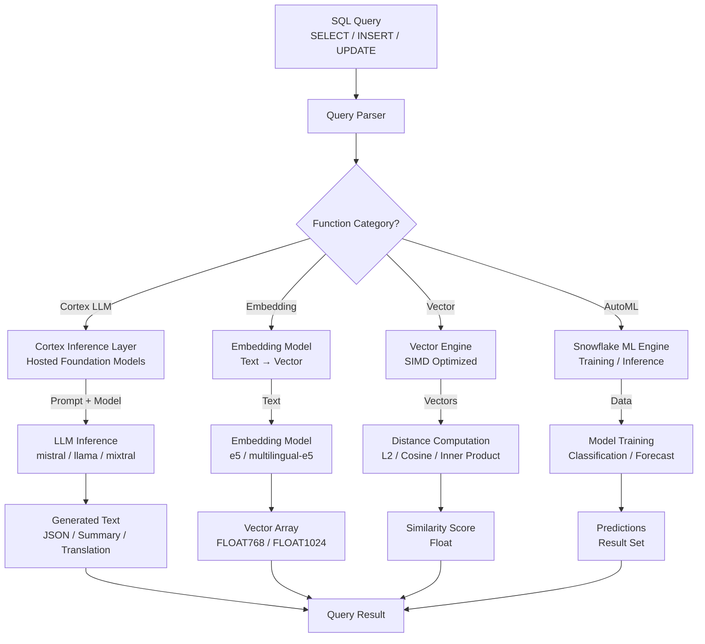

# 1. AI Functions in Snowflake

# 2. Overview

Snowflake AI functions provide native large language model (LLM) inference, text embedding generation, and vector similarity computation within the SQL engine. They are implemented through **Cortex LLM functions** (text generation, summarization, translation, sentiment analysis, classification), **embedding functions** (text-to-vector conversion), and **vector functions** (distance and similarity metrics on `VECTOR` data types). These capabilities eliminate the need to export data to external AI services, enabling in-database inference on structured and semi-structured data.

Cortex LLM functions execute against hosted foundation models (e.g., `mistral-large`, `llama3.1-70b`, `mixtral-8x7b`) or Snowflake's own models. Vector functions operate on fixed-dimension floating-point arrays stored in the `VECTOR` type, supporting inner product, L2 distance, and cosine distance for retrieval-augmented generation (RAG) and semantic search patterns.

This feature exists to:
- Generate, summarize, translate, and classify text using SQL without external API calls
- Build semantic search and RAG pipelines using native vector storage and similarity functions
- Embed text into dense vectors for similarity matching and clustering
- Maintain data locality by keeping sensitive data within Snowflake's security boundary during inference

The intended consumers are data engineers building AI-augmented pipelines, ML engineers implementing RAG architectures, and SnowPro Advanced exam candidates who must understand model availability, token limits, privilege requirements, vector type constraints, and the deterministic vs. non-deterministic behavior of LLM inference.

# 3. SQL Object Summary

| Object/Feature | Type | Purpose | Source Objects or Inputs | Output Object or Observable Behavior | Execution Mode or Invocation Method |
|---|---|---|---|---|---|
| SNOWFLAKE.CORTEX.COMPLETE | LLM function | Text generation/completion | Prompt string, model name, optional parameters | Generated text string | Per-row SQL invocation |
| SNOWFLAKE.CORTEX.COMPLETE_JSON | LLM function | Structured JSON generation | Prompt string, model name | Valid JSON string | Per-row SQL invocation |
| SNOWFLAKE.CORTEX.SUMMARIZE | LLM function | Text summarization | Input text, model name | Summary string | Per-row SQL invocation |
| SNOWFLAKE.CORTEX.TRANSLATE | LLM function | Text translation | Input text, source language, target language, model name | Translated text string | Per-row SQL invocation |
| SNOWFLAKE.CORTEX.SENTIMENT | LLM function | Sentiment analysis | Input text | Sentiment score float (-1 to 1) | Per-row SQL invocation |
| SNOWFLAKE.CORTEX.CLASSIFY_TEXT | LLM function | Zero-shot classification | Input text, candidate labels | Label and score | Per-row SQL invocation |
| SNOWFLAKE.CORTEX.EXTRACT_ANSWER | LLM function | Extractive QA | Input text, question | Answer string or NULL | Per-row SQL invocation |
| SNOWFLAKE.CORTEX.EMBED_TEXT_768 | Embedding function | Text embedding (768-dim) | Input text, model name | VECTOR(FLOAT, 768) | Per-row SQL invocation |
| SNOWFLAKE.CORTEX.EMBED_TEXT_1024 | Embedding function | Text embedding (1024-dim) | Input text, model name | VECTOR(FLOAT, 1024) | Per-row SQL invocation |
| VECTOR_INNER_PRODUCT | Vector function | Dot product similarity | Two VECTOR columns | Float scalar | Per-row SQL invocation |
| VECTOR_L2_DISTANCE | Vector function | Euclidean distance | Two VECTOR columns | Float scalar | Per-row SQL invocation |
| VECTOR_COSINE_DISTANCE | Vector function | Cosine distance | Two VECTOR columns | Float scalar (0 to 2) | Per-row SQL invocation |
| VECTOR | Data type | Fixed-dimension float array | Dimension and element type | Binary-encoded vector | Column definition |
| SNOWFLAKE.ML.FORECAST | ML function | Time-series forecasting | Historical data, target column, timestamp | Forecast result set | Table function |
| SNOWFLAKE.ML.CLASSIFICATION | ML function | AutoML classification | Training data, feature columns, target | Model and predictions | Table function |

# 4. Architecture

AI functions execute through Snowflake's Cortex inference layer and vector computation engine. LLM functions route prompts to hosted foundation models, returning generated text. Embedding functions convert text to dense vectors via embedding models. Vector functions compute similarity metrics natively on the `VECTOR` type using optimized linear algebra primitives.

# 5. Data Flow / Process Flow

## Step 1: Input Preparation
- **Input:** Source text, prompt template, or vector data
- **Transformation:** SQL expressions construct prompts, extract text fields, or retrieve vectors
- **Output:** Formatted function arguments
- **Purpose:** Prepare data for AI inference

## Step 2: Model Routing (LLM/Embedding)
- **Input:** Function call with model specification
- **Transformation:** Cortex layer routes to specified foundation model or embedding model
- **Output:** Model context established
- **Purpose:** Select appropriate model for task

## Step 3: Inference Execution
- **Input:** Prompt or text
- **Transformation:** LLM generates text token-by-token; embedding model encodes text to dense vector
- **Output:** Generated text string or vector array
- **Purpose:** Execute AI computation

## Step 4: Vector Computation (if applicable)
- **Input:** Two vectors or vector and query vector
- **Transformation:** Vector engine computes distance/similarity using optimized primitives
- **Output:** Scalar similarity score
- **Purpose:** Measure semantic similarity

## Step 5: Result Integration
- **Input:** AI function output
- **Transformation:** Result feeds into outer SQL expression, filter, or result set
- **Output:** Final query result with AI-augmented columns
- **Purpose:** Deliver enriched data

# 6. Logical Breakdown

## Component: Cortex LLM Inference Engine
- **Responsibility:** Execute text generation against hosted models
- **Inputs:** Prompt string, model name, optional temperature/max_tokens/top_p
- **Outputs:** Generated text string
- **Dependencies:** Model availability in region; Cortex privileges
- **Failure Modes:** Model unavailable in region; prompt exceeds token limit; rate limit exceeded; timeout on long generation

## Component: Embedding Generator
- **Responsibility:** Convert text to dense vector representations
- **Inputs:** Text string, embedding model name
- **Outputs:** `VECTOR(FLOAT, 768)` or `VECTOR(FLOAT, 1024)`
- **Dependencies:** Model availability; text length within model limit
- **Failure Modes:** Text too long; model unavailable; dimension mismatch with target column

## Component: Vector Similarity Engine
- **Responsibility:** Compute distance metrics between vectors
- **Inputs:** Two vectors of identical dimension and type
- **Outputs:** Float distance or similarity score
- **Dependencies:** `VECTOR` type columns; matching dimensions
- **Failure Modes:** Dimension mismatch raises error; type mismatch raises error

## Component: Prompt Assembler
- **Responsibility:** Construct effective prompts from table data
- **Inputs:** Column values, template strings
- **Outputs:** Formatted prompt strings
- **Dependencies:** SQL string concatenation or formatting
- **Failure Modes:** Prompt injection if user data is not sanitized; context window exceeded

## Component: AutoML Engine
- **Responsibility:** Train and infer ML models on Snowflake data
- **Inputs:** Training data, feature columns, target column
- **Outputs:** Predictions, model metrics, feature importance
- **Dependencies:** Sufficient data volume; `SNOWFLAKE.ML` privileges
- **Failure Modes:** Insufficient training data; invalid feature types; model training timeout

# 7. Data Model

## Vector Storage Table (RAG Pattern)

| Column | Role | Type | Grain | Notes |
|---|---|---|---|---|
| `DOCUMENT_ID` | Identifier | VARCHAR | One per chunk | Business key |
| `CHUNK_TEXT` | Source text | VARCHAR | One per chunk | Raw text segment |
| `EMBEDDING` | Vector | VECTOR(FLOAT, 768) | One per chunk | `EMBED_TEXT_768` output |
| `METADATA` | Context | VARIANT | One per chunk | Source document metadata |

## Grain
One row per text chunk.

## LLM Output Table

| Column | Role | Type | Grain | Notes |
|---|---|---|---|---|
| `INPUT_ID` | Identifier | VARCHAR | One per row | Source record |
| `PROMPT` | Input | VARCHAR | One per row | Constructed prompt |
| `GENERATED_TEXT` | LLM output | VARCHAR | One per row | `COMPLETE` output |
| `MODEL_USED` | Traceability | VARCHAR | One per row | Model name |
| `TOKENS_USED` | Cost metric | NUMBER | One per row | Estimated tokens |

## Grain
One row per inference call.

# 8. Business Logic

## Model Selection Rules
- `mistral-large`: High-quality generation; higher latency and cost
- `llama3.1-70b`: Strong performance; good balance of quality and speed
- `mixtral-8x7b`: Fast, efficient; good for high-volume batch inference
- `snowflake-arctic`: Snowflake's own model; cost-effective for many tasks
- `claude-3-5-sonnet`: Available in some regions via Cortex
- Model availability varies by region and account edition

## Token and Length Limits
- LLM functions have context window limits (typically 8K-128K tokens depending on model)
- Prompt + max_tokens must fit within model context window
- `SUMMARIZE` has internal token limits for input text
- Embedding models have text length limits (typically 512 tokens for e5 models)

## Temperature and Sampling
- `temperature`: Controls randomness (0.0 = deterministic, 1.0 = creative)
- `top_p`: Nucleus sampling threshold
- `max_tokens`: Maximum output length
- Lower temperature recommended for structured extraction; higher for creative generation

## Vector Type Semantics
- `VECTOR(FLOAT, N)` stores N-dimensional float arrays
- Dimension is part of the type; mismatch raises error
- Vectors are binary-encoded; efficient storage and computation
- Maximum dimension varies by function; common: 768, 1024, 1536

## Similarity Metrics
- `VECTOR_INNER_PRODUCT`: Higher is more similar (unbounded negative to positive)
- `VECTOR_L2_DISTANCE`: Lower is more similar (0 = identical, unbounded positive)
- `VECTOR_COSINE_DISTANCE`: Lower is more similar (0 = identical, 2 = opposite; 1 = orthogonal)
- For semantic search, cosine distance or inner product are most common

## Sentiment Scoring
- `SENTIMENT` returns float between -1 (negative) and 1 (positive)
- 0 indicates neutral sentiment
- Operates on English text primarily; multilingual support varies

## Classification Behavior
- `CLASSIFY_TEXT` performs zero-shot classification
- Candidate labels provided as array; returns best label and confidence score
- No training required; model generalizes from labels

## Extractive QA
- `EXTRACT_ANSWER` extracts answer from provided context text
- Returns NULL if answer not found in context
- Context must contain the answer; does not hallucinate outside context

## JSON Mode
- `COMPLETE_JSON` constrains output to valid JSON
- Useful for structured data extraction
- May still require schema validation; JSON validity guaranteed but structure may vary

## Non-Determinism
- LLM functions are non-deterministic (unless temperature=0.0)
- Results vary between executions; disable result cache
- Embedding functions are deterministic for same input and model

## Privilege Requirements
- `CORTEX_USER` database role or equivalent privileges required for Cortex functions
- `SNOWFLAKE.ML` functions require `USAGE` on `SNOWFLAKE` database and `ML` schema
- Vector functions require no special privileges beyond table access

# 9. Transformations

## Raw Text to Generated Text
- **Source:** Table text columns + prompt template
- **Output:** LLM-generated text per row
- **Logic:** `SNOWFLAKE.CORTEX.COMPLETE(prompt, 'mistral-large')`
- **Meaning:** AI-augmented content generation
- **Impact:** Enables automated description, code generation, and analysis

## Text to Semantic Vector
- **Source:** Document text or query text
- **Output:** Dense vector embedding
- **Logic:** `SNOWFLAKE.CORTEX.EMBED_TEXT_768(text, 'e5-base-v2')`
- **Meaning:** Semantic representation for similarity search
- **Impact:** Enables RAG and semantic retrieval

## Vector to Similarity Score
- **Source:** Document vector and query vector
- **Output:** Distance or similarity scalar
- **Logic:** `VECTOR_COSINE_DISTANCE(doc_vector, query_vector)`
- **Meaning:** Semantic proximity measurement
- **Impact:** Enables ranking and filtering by meaning

## Text to Summary
- **Source:** Long-form text
- **Output:** Condensed summary
- **Logic:** `SNOWFLAKE.CORTEX.SUMMARIZE(text)`
- **Meaning:** Information condensation
- **Impact:** Reduces reading volume; enables abstract generation

## Text to Sentiment Score
- **Source:** Customer feedback, reviews
- **Output:** Numeric sentiment score
- **Logic:** `SNOWFLAKE.CORTEX.SENTIMENT(text)`
- **Meaning:** Emotional polarity quantification
- **Impact:** Enables trend analysis and alerting

## Text to Translation
- **Source:** Text in source language
- **Output:** Text in target language
- **Logic:** `SNOWFLAKE.CORTEX.TRANSLATE(text, 'en', 'fr')`
- **Meaning:** Cross-lingual transformation
- **Impact:** Enables multilingual analytics

## Historical Data to Forecast
- **Source:** Time-series data
- **Output:** Future predictions
- **Logic:** `SNOWFLAKE.ML.FORECAST(...)`
- **Meaning:** Predictive analytics
- **Impact:** Enables demand planning and anomaly detection

# 10. Parameters / Variables / Configuration

| Name | Type | Purpose | Allowed Values | Default | Where Used | Effect |
|---|---|---|---|---|---|---|
| `model` | LLM arg | Model selection | `'mistral-large'`, `'llama3.1-70b'`, `'mixtral-8x7b'`, `'snowflake-arctic'`, etc. | Varies by function | Cortex LLM functions | Determines model capability and cost |
| `temperature` | LLM arg | Randomness | 0.0 to 1.0 | 0.7 | `COMPLETE` | Controls creativity |
| `max_tokens` | LLM arg | Output limit | Integer > 0 | Model default | `COMPLETE` | Limits generation length |
| `top_p` | LLM arg | Nucleus sampling | 0.0 to 1.0 | 0.9 | `COMPLETE` | Sampling threshold |
| `source_language` | TRANSLATE arg | Input language | ISO 639-1 code | Required | `TRANSLATE` | Source language |
| `target_language` | TRANSLATE arg | Output language | ISO 639-1 code | Required | `TRANSLATE` | Target language |
| `labels` | CLASSIFY_TEXT arg | Candidate classes | ARRAY of strings | Required | `CLASSIFY_TEXT` | Classification categories |
| `embedding_model` | Embedding arg | Embedding model | `'e5-base-v2'`, `'multilingual-e5-large'`, etc. | Required | `EMBED_TEXT_*` | Determines vector semantics |
| `dimension` | VECTOR type | Vector size | 768, 1024, etc. | Required | Column definition | Fixed array length |
| `element_type` | VECTOR type | Data type | `FLOAT`, `INT` | `FLOAT` | Column definition | Element data type |

# 11. APIs / Interfaces

## Interface: SNOWFLAKE.CORTEX.COMPLETE
- **Invocation:** `SELECT SNOWFLAKE.CORTEX.COMPLETE('mistral-large', prompt, {'temperature': 0.7, 'max_tokens': 512})`
- **Input:** Model name, prompt string, optional JSON parameters
- **Output:** Generated text string
- **Error Behavior:** Model unavailable; token limit exceeded; rate limit; timeout
- **Consumers:** Text generation, code generation, data enrichment

## Interface: SNOWFLAKE.CORTEX.SUMMARIZE
- **Invocation:** `SELECT SNOWFLAKE.CORTEX.SUMMARIZE(text_col) FROM table`
- **Input:** Text to summarize
- **Output:** Summary string
- **Error Behavior:** Text too long; model unavailable
- **Consumers:** Document abstraction, report generation

## Interface: SNOWFLAKE.CORTEX.EMBED_TEXT_768
- **Invocation:** `SELECT SNOWFLAKE.CORTEX.EMBED_TEXT_768(text_col, 'e5-base-v2') FROM table`
- **Input:** Text, embedding model name
- **Output:** `VECTOR(FLOAT, 768)`
- **Error Behavior:** Text too long; model unavailable
- **Consumers:** RAG pipelines, semantic search, clustering

## Interface: VECTOR_COSINE_DISTANCE
- **Invocation:** `SELECT VECTOR_COSINE_DISTANCE(doc.embedding, query_vec) FROM docs`
- **Input:** Two vectors of matching dimension
- **Output:** Float distance (0 = identical, 2 = opposite)
- **Error Behavior:** Dimension mismatch; type mismatch
- **Consumers:** Semantic search ranking, similarity matching

## Interface: SNOWFLAKE.CORTEX.SENTIMENT
- **Invocation:** `SELECT SNOWFLAKE.CORTEX.SENTIMENT(text_col) FROM feedback`
- **Input:** Text string
- **Output:** Float score (-1 to 1)
- **Error Behavior:** None for valid text
- **Consumers:** Feedback analysis, brand monitoring

## Interface: SNOWFLAKE.ML.FORECAST
- **Invocation:** `CALL SNOWFLAKE.ML.FORECAST(...)` or `SELECT * FROM TABLE(SNOWFLAKE.ML.FORECAST(...))`
- **Input:** Time-series data, parameters
- **Output:** Forecast result set
- **Error Behavior:** Insufficient data; invalid parameters
- **Consumers:** Demand forecasting, capacity planning

# 12. Execution / Deployment

## Batch Inference Pattern
- Apply LLM functions to large tables using `UPDATE` or `INSERT ... SELECT`
- Process in batches to manage cost and avoid timeouts
- Use smaller/faster models (`mixtral-8x7b`) for high-volume batch jobs
- Use `QUERY_TAG` to attribute AI compute costs

## RAG Pipeline Pattern
1. Chunk documents and store in table with `CHUNK_TEXT` and `METADATA`
2. Generate embeddings: `UPDATE chunks SET embedding = SNOWFLAKE.CORTEX.EMBED_TEXT_768(chunk_text, 'e5-base-v2')`
3. Embed user query to vector
4. Retrieve top-K similar chunks: `ORDER BY VECTOR_COSINE_DISTANCE(embedding, query_vec) LIMIT K`
5. Construct context from retrieved chunks
6. Generate answer: `SNOWFLAKE.CORTEX.COMPLETE(model, context + question)`

## Real-Time Inference
- Use LLM functions in views for on-demand generation
- Be aware of latency (hundreds of milliseconds to seconds per call)
- Not suitable for sub-second transactional workloads
- Cache generated results in tables if acceptable

## Vector Indexing
- Snowflake does not have native vector indexes (as of current releases)
- Use approximate nearest neighbor via vector search features or brute-force scan with `LIMIT`
- Pre-filter with metadata columns to reduce vector comparison set

## Model Selection Strategy
- Use `mistral-large` or `claude-3-5-sonnet` for complex reasoning and high-quality generation
- Use `llama3.1-70b` for balanced quality and throughput
- Use `mixtral-8x7b` or `snowflake-arctic` for high-volume, cost-sensitive batch inference
- Use `COMPLETE_JSON` for structured extraction tasks

## Environment Behavior
- Development: Small test prompts, temperature=0.7 for exploration, validate output schemas
- Production: temperature=0.0 for deterministic extraction, batch processing, result caching, cost monitoring via `QUERY_HISTORY`

# 13. Observability

## LLM Cost Tracking
- Monitor `QUERY_HISTORY` for Cortex function execution time and frequency
- Use `QUERY_TAG` to attribute AI costs to specific pipelines
- Track tokens consumed (estimated from input/output length)
- Compare model costs: larger models cost more per token

## Vector Operation Performance
- Monitor bytes scanned in vector similarity queries
- Track query duration scaling with vector table size
- Brute-force vector scan is O(N); monitor for performance degradation at scale

## Model Availability
- Verify model availability in your Snowflake region
- Monitor for model deprecation or new model releases
- Test failover to alternative models if primary is unavailable

## Data Quality
- Track parse errors on `COMPLETE_JSON` outputs
- Monitor sentiment score distributions for anomalies
- Validate classification accuracy against labeled samples

## Key Metrics
- LLM inference latency (p50, p95, p99)
- Tokens processed per hour
- Vector similarity query duration
- Embedding generation throughput
- Model error rate (timeouts, rate limits)
- RAG retrieval precision@K

# 14. Failure Handling & Recovery

## Model Unavailable in Region
- **What breaks:** Specified model not deployed in current Snowflake region
- **Detection:** `Model not available` error
- **Fallback:** Switch to alternative model available in region
- **Recovery:** Query `SHOW CORTEX MODELS` or documentation for regional availability; update pipeline to use available model

## Token Limit Exceeded
- **What breaks:** Prompt + max_tokens exceeds model context window
- **Detection:** `Input is too long` or token limit error
- **Fallback:** Truncate prompt; split into chunks; use summarization first
- **Recovery:** Implement prompt length checks; chunk long documents before embedding or generation

## Rate Limiting
- **What breaks:** Too many concurrent LLM calls trigger throttling
- **Detection:** `Rate limit exceeded` error; increased latency
- **Fallback:** Reduce concurrency; implement retry with backoff
- **Recovery:** Batch process serially; or use smaller model with higher rate limits

## Vector Dimension Mismatch
- **What breaks:** `VECTOR_COSINE_DISTANCE` called on vectors of different dimensions
- **Detection:** `Vector dimension mismatch` error
- **Fallback:** Ensure all embeddings use same model and dimension
- **Recovery:** Regenerate embeddings with consistent model; validate column types match

## Non-Deterministic Output Variation
- **What breaks:** `COMPLETE` produces different results on each run, breaking reproducibility
- **Detection:** Result cache misses; test assertion failures
- **Fallback:** Set `temperature = 0.0` for deterministic output
- **Recovery:** Fix temperature parameter; or store results after first generation

## JSON Parse Failure from COMPLETE_JSON
- **What breaks:** Output claims to be JSON but downstream parser fails
- **Detection:** `PARSE_JSON` error on LLM output
- **Fallback:** Validate JSON before parsing; wrap in `TRY_PARSE_JSON`
- **Recovery:** Add schema validation layer; or use stricter prompt engineering

## Embedding Text Too Long
- **What breaks:** Input text exceeds embedding model token limit
- **Detection:** Truncation warning or error from embedding function
- **Fallback:** Chunk text before embedding; average chunk vectors
- **Recovery:** Implement text chunking pipeline with overlap

## PII in Prompts
- **What breaks:** Sensitive data sent to LLM prompts violates compliance
- **Detection:** Audit of prompt content
- **Fallback:** Mask or redact PII before constructing prompts
- **Recovery:** Implement prompt sanitization procedures; use Cortex's data privacy guarantees

# 15. Security & Access Control

## Privilege Requirements

| Action | Required Privilege | Object |
|---|---|---|
| Use Cortex LLM functions | `CORTEX_USER` role or `USAGE` on `SNOWFLAKE.CORTEX` | Database/Schema |
| Use embedding functions | `CORTEX_USER` role or equivalent | Database/Schema |
| Use vector functions | `SELECT` on table | Table |
| Use SNOWFLAKE.ML functions | `USAGE` on `SNOWFLAKE.ML` | Schema |
| Create VECTOR columns | `CREATE TABLE` on schema | Schema |

## Data Privacy
- Cortex LLM functions process data within Snowflake's security boundary
- Data is not sent to external APIs outside Snowflake's trust domain
- However, review Snowflake's AI data processing terms for compliance requirements
- Do not send PII or regulated data to LLM functions without organizational approval

## Prompt Injection
- User-generated content in prompts may contain injection attacks
- Sanitize or escape user inputs before concatenating into prompts
- Use parameterized prompts where possible

## Model Access Control
- Model availability controlled by account edition and region
- Some models require additional opt-in or agreements
- Monitor for unauthorized model usage via `QUERY_HISTORY`

## Secure UDFs with AI
- Secure UDFs can encapsulate prompt templates and model selection
- Prevents prompt inspection via `GET_DDL`
- Useful for standardizing AI interactions across teams

# 16. Performance / Scalability Considerations

## LLM Inference Latency
- Per-row LLM calls introduce significant latency (100ms to several seconds)
- Batch processing preferred over row-by-row real-time inference
- Consider materializing LLM outputs to tables rather than computing in views

## Embedding Generation Throughput
- Embedding functions are faster than generation but still have per-row overhead
- Bulk embedding of large document corpora should be batched
- Reuse embeddings; do not regenerate for static documents on every query

## Vector Scan Performance
- Brute-force vector similarity scan is O(N * D) where N = rows, D = dimensions
- No native vector index exists; performance degrades linearly with table size
- Pre-filter with metadata columns to reduce N before vector comparison
- Consider using Cortex Search or external vector databases for massive scale

## Warehouse Sizing
- AI functions benefit from larger warehouses for parallel batch inference
- However, LLM inference is often API-bound rather than compute-bound
- Start with MEDIUM; scale up if CPU is saturated during batch embedding

## Result Cache
- LLM functions with temperature > 0 are non-deterministic and disable result cache
- Embedding functions are deterministic and cacheable
- Store LLM outputs in tables if repeated access is needed

## Cost Management
- LLM functions incur compute costs based on tokens processed
- Larger models cost more per token
- Monitor costs via `WAREHOUSE_METERING_HISTORY` and `QUERY_HISTORY`
- Set `max_tokens` to prevent runaway generation costs

## Memory for Vector Operations
- Vector comparisons are memory-efficient
- Large vector tables scan quickly if well-clustered on filter columns
- Vector storage is compact (768 floats = ~3KB per row)

# 17. Assumptions & Constraints

## Explicit Assumptions
- The reader is implementing AI-augmented data pipelines within Snowflake
- Cortex functions are available in the account region and edition
- Vector dimensions are consistent across embedding model and storage

## Engine Boundaries
- Cortex LLM functions require specific account editions and regional availability
- No native vector index for approximate nearest neighbor; brute-force scan or Cortex Search required
- LLM context windows vary by model (typically 8K-128K tokens)
- Embedding models have input length limits (typically 512 tokens for e5)
- `VECTOR` type dimension is fixed at column creation; cannot store variable-length vectors
- Snowflake does not support user-defined embedding models; only hosted models available
- AutoML functions (`SNOWFLAKE.ML.*`) have separate training data volume limits
- Some AI functions are non-deterministic and disable result cache

## Exam-Relevant Defaults
- `temperature` default for `COMPLETE`: typically 0.7 (verify per model)
- `max_tokens` default varies by model
- `VECTOR` type defaults to `FLOAT` element type
- `SENTIMENT` returns float range: -1.0 to 1.0
- `VECTOR_COSINE_DISTANCE` range: 0.0 (identical) to 2.0 (opposite)
- Cortex functions require `CORTEX_USER` role or equivalent privileges
- Data remains within Snowflake boundary for Cortex inference

## Ambiguities
- Exact token counting methodology may vary slightly from standard tokenizer implementations
- Model availability and pricing change over time and by region
- Behavior of `COMPLETE_JSON` schema adherence is best-effort, not guaranteed by strict JSON schema validation
- Exact performance characteristics of vector scans at billion-row scale depend on warehouse size and data clustering

# 18. Future Enhancements

- Implement prompt templating UDFs that sanitize user inputs and standardize model parameters across pipelines
- Replace brute-force vector similarity scans with Cortex Search for large-scale RAG when approximate nearest neighbor is acceptable
- Materialize LLM-generated outputs to tables with versioning rather than computing on-demand to reduce cost and latency
- Use `COMPLETE_JSON` with strict output parsing and `TRY_PARSE_JSON` for robust structured extraction pipelines
- Standardize on a single embedding model and dimension (e.g., `e5-base-v2` at 768d) across all tables to prevent dimension mismatch
- Add prompt length validation procedures that truncate or chunk inputs before LLM calls to prevent token limit errors
- Implement A/B testing frameworks using `QUERY_TAG` to compare model performance and cost across different Cortex models
- Cache embedding vectors in dedicated tables with clustering on metadata filters to improve RAG retrieval performance
- Use `temperature = 0.0` for all extraction and classification tasks to ensure deterministic, reproducible outputs
- Monitor `QUERY_HISTORY` for Cortex function costs and set up alerts for unexpected spikes in AI compute consumption
