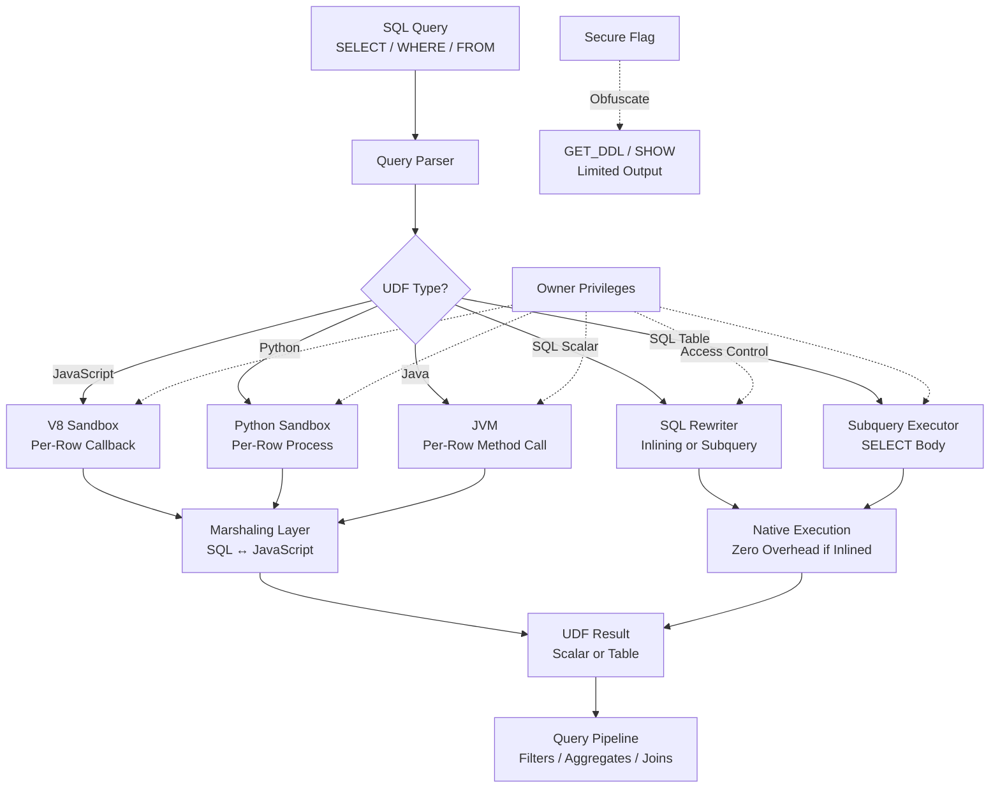

# 1. User-Defined Functions (UDFs) in Snowflake

# 2. Overview

User-Defined Functions (UDFs) in Snowflake encapsulate custom logic into reusable database objects that can be invoked from SQL. UDFs are categorized by **return type** (scalar vs. table) and **runtime language** (SQL, JavaScript, Python, Java, Scala). They enable business rule centralization, complex transformations, API integration, and custom analytics without leaving the Snowflake security boundary.

- **Scalar UDFs** return a single value per invocation and can be used in `SELECT`, `WHERE`, `JOIN`, and `CASE` expressions.
- **Table UDFs (UDTFs)** return a result set and are referenced in the `FROM` clause, often with `LATERAL` correlation.
- **SQL UDFs** execute natively within the query engine and may be inlined by the optimizer.
- **JavaScript UDFs** run in a V8 sandbox with per-row marshaling.
- **Python UDFs** run in a sandboxed Python interpreter with package allowlist restrictions.
- **Java UDFs** run in a JVM with JAR dependencies.
- **Secure UDFs** obscure their definition from `GET_DDL` and `SHOW` output.

UDFs execute with the **privileges of the owner**, not the caller. This feature exists to standardize logic, enforce data contracts, and extend Snowflake's function library. The intended consumers are data engineers building reusable transformation libraries, platform teams implementing custom business rules, and SnowPro Advanced exam candidates who must understand owner semantics, inlining behavior, sandbox limits, overloading rules, and the `IMMUTABLE`/`VOLATILE` distinction.

# 3. SQL Object Summary

| Object/Feature | Type | Purpose | Source Objects or Inputs | Output Object or Observable Behavior | Execution Mode or Invocation Method |
|---|---|---|---|---|---|
| [SQL Scalar UDF](SQL Object Summary/SQL Scalar UDF.md) | UDF | Custom single-value logic in SQL | Input arguments | Single value per row | `CREATE FUNCTION` with SQL expression |
| [SQL Table UDF](SQL Object Summary/SQL Table UDF.md) | UDTF | Custom row-set logic in SQL | Input arguments | Result set | `CREATE FUNCTION ... RETURNS TABLE` with SELECT |
| [JavaScript Scalar UDF](SQL Object Summary/JavaScript Scalar UDF.md) | UDF | Custom logic in JavaScript | Input arguments | Single value per row | `CREATE FUNCTION ... LANGUAGE JAVASCRIPT` |
| [JavaScript Table UDF](SQL Object Summary/JavaScript Table UDF.md) | UDTF | Custom row-set logic in JavaScript | Input arguments | Result set | `CREATE FUNCTION ... RETURNS TABLE ... LANGUAGE JAVASCRIPT` |
| [Python Scalar UDF](SQL Object Summary/Python Scalar UDF.md) | UDF | Custom logic in Python | Input arguments | Single value per row | `CREATE FUNCTION ... LANGUAGE PYTHON` |
| [Python Table UDF](SQL Object Summary/Python Table UDF.md) | UDTF | Custom row-set logic in Python | Input arguments | Result set | `CREATE FUNCTION ... RETURNS TABLE ... LANGUAGE PYTHON` |
| [Java Scalar UDF](SQL Object Summary/Java Scalar UDF.md) | UDF | Custom logic in Java | Input arguments | Single value per row | `CREATE FUNCTION ... LANGUAGE JAVA` |
| [Java Table UDF](SQL Object Summary/Java Table UDF.md) | UDTF | Custom row-set logic in Java | Input arguments | Result set | `CREATE FUNCTION ... RETURNS TABLE ... LANGUAGE JAVA` |
| [Secure UDF](SQL Object Summary/Secure UDF.md) | UDF modifier | Obscures definition | Same as base UDF | Same as base UDF | `CREATE SECURE FUNCTION` |
| [Immutable UDF](SQL Object Summary/Immutable UDF.md) | UDF property | Deterministic result | Input values only | Consistent output for same input | `IMMUTABLE` keyword |
| [Volatile UDF](SQL Object Summary/Volatile UDF.md) | UDF property | Non-deterministic result | Input values + system state | Variable output | `VOLATILE` keyword |
| [Overloaded UDF](SQL Object Summary/Overloaded UDF.md) | UDF variant | Multiple signatures | Distinct argument types | Type-specific behavior | Multiple `CREATE FUNCTION` with same name |

# 4. Architecture

UDFs integrate into the query engine through language-specific runtimes. SQL UDFs are parsed and potentially inlined. Guest runtimes (JavaScript, Python, Java) execute in sandboxed processes with data marshaling between SQL and the guest environment. The optimizer decides whether to inline SQL UDFs or execute them as subqueries.

# 5. Data Flow / Process Flow

## Step 1: UDF Resolution
- **Input:** SQL query containing function call
- **Transformation:** Parser resolves function name against catalog; selects matching overload based on argument type signature; validates return type compatibility
- **Output:** Bound UDF reference with resolved signature
- **Purpose:** Ensure correct function implementation is selected

## Step 2: Privilege Check
- **Input:** Caller identity and UDF owner context
- **Transformation:** Engine verifies caller has `USAGE` on the UDF; execution proceeds with owner privileges on referenced objects
- **Output:** Authorized execution context
- **Purpose:** Enforce access control while preserving owner semantics

## Step 3: Argument Evaluation
- **Input:** Row values or constants passed as arguments
- **Transformation:** SQL expressions are evaluated; values are type-checked against UDF signature
- **Output:** Typed argument values
- **Purpose:** Prepare inputs for UDF logic

## Step 4: UDF Execution
- **Input:** Evaluated arguments
- **Transformation:** SQL UDF body is executed (inlined or as subquery); guest runtime UDFs marshal arguments, execute logic, marshal results
- **Output:** Return value (scalar) or result set (table)
- **Purpose:** Compute custom logic

## Step 5: Result Integration
- **Input:** UDF output
- **Transformation:** Scalar results feed into outer SQL expressions; table results join with outer query via `LATERAL` or Cartesian product
- **Output:** Enriched query row set
- **Purpose:** Complete query computation

# 6. Logical Breakdown

## Component: SQL Scalar UDF Engine
- **Responsibility:** Execute SQL expressions returning single values
- **Inputs:** Arguments bound to parameters; referenced tables/views
- **Outputs:** Single typed value per invocation
- **Dependencies:** Referenced objects must exist and be accessible to owner
- **Failure Modes:** Body cannot contain DDL or DML; recursive references may hit stack limits; complex bodies may not inline, causing subquery overhead

## Component: SQL Table UDF Engine
- **Responsibility:** Execute SQL SELECT statements returning row sets
- **Inputs:** Arguments; referenced tables/views
- **Outputs:** Result set matching `RETURNS TABLE` schema
- **Dependencies:** Body must be a SELECT; column types must match declared return types
- **Failure Modes:** Schema mismatch raises error; DML/DDL in body not allowed

## Component: JavaScript UDF Runtime
- **Responsibility:** Execute JavaScript logic per row
- **Inputs:** Marshaled SQL values (mapped to JavaScript types)
- **Outputs:** Marshaled JavaScript return value
- **Dependencies:** V8 sandbox; 30-second execution timeout; memory limits
- **Failure Modes:** Timeout; memory exhaustion; type marshaling mismatch; uncaught exceptions; `NaN` or `undefined` may map to NULL

## Component: Python UDF Runtime
- **Responsibility:** Execute Python logic per row
- **Inputs:** Marshaled SQL values
- **Outputs:** Marshaled Python return value or yielded rows (UDTF)
- **Dependencies:** Python sandbox; package allowlist; `RUNTIME_VERSION`; memory limits
- **Failure Modes:** Import errors (package not in allowlist); timeout; memory limits; serialization failures

## Component: Java UDF Runtime
- **Responsibility:** Execute Java logic per row
- **Inputs:** Marshaled SQL values
- **Outputs:** Marshaled Java return value
- **Dependencies:** JVM; JAR files via IMPORTS; class loading
- **Failure Modes:** Class not found; memory/GC pressure; cold-start latency on first invocation

## Component: UDF Overload Resolver
- **Responsibility:** Select correct implementation based on argument types
- **Inputs:** Function name, argument type signature
- **Outputs:** Resolved UDF reference
- **Dependencies:** Distinct overloads must have different argument type signatures
- **Failure Modes:** Ambiguous overload raises error at call time; no matching overload raises error

## Component: Secure UDF Wrapper
- **Responsibility:** Obfuscate UDF definition from metadata queries
- **Inputs:** UDF DDL
- **Outputs:** Opaque metadata; obscured body in `GET_DDL`
- **Dependencies:** `CREATE SECURE FUNCTION`
- **Failure Modes:** Debugging requires ownership; `SHOW FUNCTIONS` displays limited info

## Component: Owner Privilege Evaluator
- **Responsibility:** Execute UDF with owner privileges, not caller privileges
- **Inputs:** UDF owner role, referenced objects
- **Outputs:** Access granted or denied based on owner grants
- **Dependencies:** Owner must retain privileges on all referenced objects
- **Failure Modes:** Owner privilege revocation breaks UDF for all callers

# 7. Data Model

## UDF Catalog (INFORMATION_SCHEMA.FUNCTIONS)

| Column | Role | Notes |
|---|---|---|
| [`FUNCTION_NAME`](UDF Catalog (INFORMATION_SCHEMA.FUNCTIONS)/FUNCTION_NAME.md) | Identifier | May be overloaded |
| [`FUNCTION_SCHEMA`](UDF Catalog (INFORMATION_SCHEMA.FUNCTIONS)/FUNCTION_SCHEMA.md) | Context | |
| [`FUNCTION_CATALOG`](UDF Catalog (INFORMATION_SCHEMA.FUNCTIONS)/FUNCTION_CATALOG.md) | Context | |
| [`FUNCTION_OWNER`](UDF Catalog (INFORMATION_SCHEMA.FUNCTIONS)/FUNCTION_OWNER.md) | Privilege context | Determines execution privileges |
| [`ARGUMENT_SIGNATURE`](UDF Catalog (INFORMATION_SCHEMA.FUNCTIONS)/ARGUMENT_SIGNATURE.md) | Overload key | JSON array of argument types |
| [`DATA_TYPE`](UDF Catalog (INFORMATION_SCHEMA.FUNCTIONS)/DATA_TYPE.md) | Return type | Scalar type or `TABLE` |
| [`FUNCTION_LANGUAGE`](UDF Catalog (INFORMATION_SCHEMA.FUNCTIONS)/FUNCTION_LANGUAGE.md) | Runtime | `SQL`, `JAVASCRIPT`, `PYTHON`, `JAVA`, `SCALA` |
| [`IS_SECURE`](Parameters  Variables  Configuration/IS_SECURE.md) | Visibility | `YES` or `NO` |
| [`IS_VOLATILE`](UDF Catalog (INFORMATION_SCHEMA.FUNCTIONS)/IS_VOLATILE.md) | Determinism | `YES` (volatile) or `NO` (immutable) |

## UDTF Return Schema (Declared)

| Column | Role | Notes |
|---|---|---|
| [`COL1`](UDTF Return Schema (Declared)/COL1.md) | Output column | As declared in `RETURNS TABLE (col1 TYPE1, ...)` |
| [`COL2`](UDTF Return Schema (Declared)/COL2.md) | Output column | |
| [...](UDTF Return Schema (Declared)/unnamed.md) | | |

## Grain
One row per UDF definition per overload.

# 8. Business Logic

## SQL Scalar UDF Semantics
- Body is a single SQL expression enclosed in quotes or `$$`
- Can reference tables, views, other UDFs, and system functions
- Cannot contain DDL or DML statements
- May be inlined by the optimizer if simple; otherwise executed as subquery
- Arguments are positional; names in body must match parameter names

## SQL Table UDF Semantics
- Body is a `SELECT` statement
- Must return columns matching `RETURNS TABLE` declaration in name, order, and type
- Can be used in `FROM` clause with or without `LATERAL`
- Supports correlation to preceding `FROM` items via `LATERAL`

## JavaScript UDF Semantics
- Arguments are referenced by uppercase parameter names in the body
- Return value is the result of the JavaScript expression
- `undefined` or `null` in JavaScript maps to SQL `NULL`
- `NaN` maps to SQL `NULL`
- Maximum execution time: 30 seconds per call
- Memory limit applies per invocation
- Cannot access network, file system, or external resources

## Python UDF Semantics
- `HANDLER` specifies the Python function or class method to invoke
- `RUNTIME_VERSION` specifies Python version (e.g., `3.9`, `3.10`)
- `PACKAGES` lists allowed third-party packages from Snowflake's allowlist
- `IMPORTS` references files in stages (JARs, Python modules, data files)
- For scalar UDFs, handler function returns a single value
- For UDTFs, handler class implements `process` method that yields rows
- Cannot access network unless external access integration is configured

## Java UDF Semantics
- `HANDLER` specifies the class and method (e.g., `MyClass.myMethod`)
- `IMPORTS` references JAR files in stages
- Cold-start latency on first invocation due to JVM startup and class loading
- Suitable for compute-intensive logic where JVM performance amortizes overhead

## Overloading Rules
- Multiple UDFs can share the same name if argument type signatures differ
- Resolution is based on argument types, not count alone
- `NUMBER` and `FLOAT` are distinct for overload resolution
- Return type does not participate in overload resolution
- Ambiguous calls raise compilation errors

## Immutable vs. Volatile
- `IMMUTABLE` (default): Function result depends only on inputs; optimizer may cache or inline
- `VOLATILE`: Result may vary for same inputs (e.g., references `CURRENT_TIMESTAMP`); disables certain optimizations
- Incorrect `IMMUTABLE` declaration on non-deterministic UDF may produce stale or inconsistent results

## Secure UDF Behavior
- `CREATE SECURE FUNCTION` prevents `GET_DDL` from returning the function body
- `SHOW FUNCTIONS` displays limited metadata
- Only owner and `ACCOUNTADMIN` can view full secure UDF definitions
- No runtime performance penalty for secure flag
- Used for proprietary algorithms, API keys in logic, or sensitive business rules

## Owner Privilege Semantics
- UDFs execute with the privileges of the UDF owner at execution time
- Changing a user's personal role grants does not affect existing UDFs
- If owner loses `SELECT` on a referenced table, the UDF fails for all callers
- Use dedicated service roles for UDF ownership to prevent user-driven breakage

## Argument Limits
- Maximum 512 arguments per UDF
- Argument names must be valid identifiers
- Default values for arguments are not supported in UDFs (use stored procedures for defaults)

## Recursion Limits
- Recursive UDF calls (SQL UDF calling itself) may hit stack depth limits
- Deep recursion is not recommended; use iterative approaches or stored procedures

# 9. Transformations

## Input Arguments to Custom Scalar Value
- **Source:** Row values passed as arguments
- **Output:** Single computed value
- **Logic:** SQL expression or guest runtime function body
- **Meaning:** Encapsulated business rule or transformation
- **Impact:** Reusable across queries; centralized logic

## Input Arguments to Custom Row Set
- **Source:** Row values or standalone arguments
- **Output:** Result set with declared schema
- **Logic:** SQL SELECT or guest runtime row generator
- **Meaning:** Tabular transformation or expansion
- **Impact:** Enables custom `FROM` clause sources

## Raw Data to Parsed/Transformed Output
- **Source:** Complex strings, JSON, or encoded values
- **Output:** Structured or computed values
- **Logic:** JavaScript/Python regex, parsing, or calculation
- **Meaning:** Complex transformation not expressible in SQL
- **Impact:** Extends Snowflake's native capabilities

## Caller Context to Owner Context
- **Source:** SQL query with caller privileges
- **Output:** UDF execution with owner privileges
- **Logic:** Ownership-based access control
- **Meaning:** Privilege escalation through controlled interface
- **Impact:** Enables controlled data access without granting base table privileges

## Plain UDF to Secure UDF
- **Source:** UDF definition visible in metadata
- **Output:** Obscured definition
- **Logic:** `CREATE SECURE FUNCTION`
- **Meaning:** Intellectual property protection
- **Impact:** Prevents SQL introspection of business logic

# 10. Parameters / Variables / Configuration

| Name | Type | Purpose | Allowed Values | Default | Where Used | Effect |
|---|---|---|---|---|---|---|
| [`LANGUAGE`](Parameters  Variables  Configuration/LANGUAGE.md) | UDF property | Runtime | `SQL`, `JAVASCRIPT`, `PYTHON`, `JAVA`, `SCALA` | `SQL` | `CREATE FUNCTION` | Execution environment |
| [`RETURNS`](Parameters  Variables  Configuration/RETURNS.md) | UDF property | Scalar return type | Any valid Snowflake type | Required | `CREATE FUNCTION` | Output type for scalar |
| [`RETURNS TABLE`](Parameters  Variables  Configuration/RETURNS TABLE.md) | UDF property | Table return schema | `(col1 TYPE1, ...)` | Required for UDTF | `CREATE FUNCTION` | Output schema for table |
| [`IS_SECURE`](Parameters  Variables  Configuration/IS_SECURE.md) | UDF property | Visibility | `TRUE`, `FALSE` | `FALSE` | `CREATE FUNCTION` | Obscures definition |
| [`IMMUTABLE`](Parameters  Variables  Configuration/IMMUTABLE.md) | UDF property | Determinism | Implicit or explicit | `IMMUTABLE` | `CREATE FUNCTION` | Enables caching/inlining |
| [`VOLATILE`](Parameters  Variables  Configuration/VOLATILE.md) | UDF property | Non-determinism | Explicit | None | `CREATE FUNCTION` | Disables caching |
| [`RUNTIME_VERSION`](Parameters  Variables  Configuration/RUNTIME_VERSION.md) | Python UDF | Python version | `3.8`, `3.9`, `3.10`, `3.11` | `3.8` | `CREATE FUNCTION` | Interpreter version |
| [`HANDLER`](Parameters  Variables  Configuration/HANDLER.md) | Python/Java UDF | Entry point | Function/class.method name | Required | `CREATE FUNCTION` | Callable entry |
| [`PACKAGES`](Parameters  Variables  Configuration/PACKAGES.md) | Python UDF | Dependencies | List of package specs | None | `CREATE FUNCTION` | Third-party libraries |
| [`IMPORTS`](Parameters  Variables  Configuration/IMPORTS.md) | Python/Java UDF | File dependencies | Stage file paths | None | `CREATE FUNCTION` | Additional files |
| [`MAX_BATCH_ROWS`](Parameters  Variables  Configuration/MAX_BATCH_ROWS.md) | Python UDF | Batch size | Integer | Varies | `CREATE FUNCTION` | Rows per batch |
| [`TIMEZONE`](Parameters  Variables  Configuration/TIMEZONE.md) | Session parameter | Temporal context | IANA timezone | `UTC` | Session | Affects time functions in UDF |
| [`QUERY_TAG`](Parameters  Variables  Configuration/QUERY_TAG.md) | Session parameter | Traceability | String | None | Session | Tags UDF queries in history |

# 11. APIs / Interfaces

## Interface: CREATE FUNCTION (SQL Scalar)
- **Invocation:** `CREATE FUNCTION my_udf(n NUMBER) RETURNS NUMBER AS 'n * 2'`
- **Input:** Name, arguments, return type, SQL expression
- **Output:** Scalar UDF object
- **Error Behavior:** Fails on syntax error, type mismatch, invalid references, DDL/DML in body
- **Consumers:** Reusable SQL logic, business rules

## Interface: CREATE FUNCTION (SQL Table)
- **Invocation:** `CREATE FUNCTION my_udtf(id NUMBER) RETURNS TABLE (col1 VARCHAR, col2 NUMBER) AS 'SELECT name, value FROM source WHERE id = id'`
- **Input:** Name, arguments, return table schema, SELECT body
- **Output:** Table UDF object
- **Error Behavior:** Fails on schema mismatch, DML/DDL in body
- **Consumers:** Custom row-set transformations

## Interface: CREATE FUNCTION (JavaScript Scalar)
- **Invocation:** `CREATE FUNCTION js_udf(s VARCHAR) RETURNS VARCHAR LANGUAGE JAVASCRIPT AS 'return S.toUpperCase()'`
- **Input:** Name, arguments, return type, JavaScript body
- **Output:** JavaScript UDF object
- **Error Behavior:** Fails on syntax error, timeout, memory limit
- **Consumers:** String manipulation, regex, JSON processing

## Interface: CREATE FUNCTION (Python Scalar)
- **Invocation:** `CREATE FUNCTION py_udf(n NUMBER) RETURNS NUMBER LANGUAGE PYTHON RUNTIME_VERSION = '3.9' HANDLER = 'double' AS $$ def double(n): return n * 2 $$`
- **Input:** Name, arguments, return type, Python code, runtime, handler
- **Output:** Python UDF object
- **Error Behavior:** Fails on import error, syntax error, execution exception
- **Consumers:** Data science, complex algorithms

## Interface: CREATE FUNCTION (Python UDTF)
- **Invocation:** `CREATE FUNCTION py_udtf(n NUMBER) RETURNS TABLE (seq NUMBER, val VARCHAR) LANGUAGE PYTHON RUNTIME_VERSION = '3.9' HANDLER = 'MyClass' AS $$ class MyClass: def process(self, n): for i in range(n): yield (i, str(i)) $$`
- **Input:** Name, arguments, return schema, Python class with process method
- **Output:** Python UDTF object
- **Error Behavior:** Fails on schema mismatch, yield type error
- **Consumers:** Custom row expansion, data generation

## Interface: CREATE SECURE FUNCTION
- **Invocation:** `CREATE SECURE FUNCTION secure_udf(...) RETURNS ... AS ...`
- **Input:** Same as base UDF type
- **Output:** Secure UDF with obscured definition
- **Error Behavior:** Same as base type
- **Consumers:** Sensitive business logic

## Interface: SHOW FUNCTIONS
- **Invocation:** `SHOW FUNCTIONS [LIKE '...'] [IN ...]`
- **Input:** Optional filter
- **Output:** UDF metadata
- **Error Behavior:** Secure UDFs show limited detail
- **Consumers:** Schema discovery

## Interface: GET_DDL
- **Invocation:** `SELECT GET_DDL('FUNCTION', 'schema.func_name(arg_type)')`
- **Input:** Function type and fully qualified name with signature
- **Output:** CREATE FUNCTION statement
- **Error Behavior:** Returns obscured body for secure functions
- **Consumers:** Documentation, version control

## Interface: DROP FUNCTION
- **Invocation:** `DROP FUNCTION [IF EXISTS] func_name(arg_type [, ...])`
- **Input:** Function name with full argument type signature
- **Output:** UDF removed
- **Error Behavior:** Fails if function in use or signature mismatch
- **Consumers:** Cleanup, deprecation

# 12. Execution / Deployment

## SQL UDF Deployment
- Deploy simple transformations as SQL scalar UDFs for optimal performance
- Use SQL UDTFs for reusable subquery patterns
- Ensure body references only objects accessible to the owner role
- Test with NULL inputs, boundary values, and type edge cases

## JavaScript UDF Deployment
- Use for regex operations, JSON manipulation, or logic not expressible in SQL
- Avoid in high-volume queries due to per-row marshaling overhead
- Be aware of 30-second timeout and memory limits
- Do not rely on JavaScript closures for state persistence across rows

## Python UDF Deployment
- Use for data science integration, statistical functions, or ML inference
- Specify `RUNTIME_VERSION` and `PACKAGES` explicitly
- For UDTFs, ensure `process` method yields tuples matching `RETURNS TABLE` schema
- Test with representative data volumes

## Java UDF Deployment
- Use for compute-intensive logic where JVM performance is beneficial
- Minimize JAR size and dependency count to reduce cold-start latency
- Specify `IMPORTS` with stage paths to JAR files

## Secure UDF Deployment
- Mark UDFs as `SECURE` when containing sensitive logic or credentials
- Document secure UDF behavior for operators
- Maintain source code in version control outside Snowflake

## Overloaded UDF Deployment
- Create overloaded UDFs for type-specific behavior (e.g., one for NUMBER, one for VARCHAR)
- Ensure argument type signatures are unambiguous
- Document overload behavior clearly

## Ownership Management
- Create UDFs under dedicated service roles, not personal user roles
- Grant `USAGE` on UDFs to consumer roles without exposing underlying objects
- Monitor owner privileges to prevent accidental revocation

## Environment Behavior
- Development: Non-secure UDFs for debugging; verbose error handling
- Production: Secure UDFs for sensitive logic; SQL UDFs preferred for performance; guest runtime UDFs isolated to specific use cases

# 13. Observability

## UDF Usage Tracking
- Query `QUERY_HISTORY` for UDF invocations
- Use `QUERY_TAG` to attribute UDF-heavy queries to workloads
- Monitor UDF execution frequency and duration

## Guest Runtime Performance
- JavaScript/Python/Java UDFs appear in query profile with guest runtime overhead
- Compare UDF query duration to built-in or SQL UDF equivalents
- Monitor memory and timeout errors

## Error Tracking
- Track UDF-related errors: type mismatches, timeouts, memory limits, import failures
- Categorize by UDF name, language, and error code
- Correlate error spikes with deployments

## Owner Privilege Monitoring
- Audit `QUERY_HISTORY` for UDF failures due to privilege revocation
- Monitor role grants on objects referenced by UDFs
- Alert when owner role loses critical privileges

## Key Metrics
- UDF invocation count per hour by language
- UDF error rate by type and language
- SQL UDF inline rate (inferred from query profile)
- Guest runtime UDF latency vs. SQL UDF latency
- Secure vs. non-secure UDF ratio
- UDTF row expansion ratio

# 14. Failure Handling & Recovery

## UDF Privilege Revocation
- **What breaks:** Owner loses `SELECT` on referenced table; UDF fails for all callers
- **Detection:** Access control error in `QUERY_HISTORY`
- **Fallback:** Grant privileges back to owner role
- **Recovery:** Audit role grants; implement dedicated service role for UDF ownership

## JavaScript Timeout
- **What breaks:** UDF exceeds 30-second execution limit
- **Detection:** Query fails with timeout error
- **Fallback:** Simplify logic; reduce input size
- **Recovery:** Optimize algorithm; move to stored procedure for batch processing

## Python Import Error
- **What breaks:** UDF references package not in Snowflake allowlist
- **Detection:** `ImportError` at invocation
- **Fallback:** Use standard library only
- **Recovery:** Request package addition; implement logic without external dependencies

## SQL UDF Inlining Failure
- **What breaks:** Complex SQL UDF not inlined, causing subquery overhead
- **Detection:** Query profile shows subquery execution rather than inline expression
- **Fallback:** Simplify UDF body
- **Recovery:** Break complex logic into simpler UDFs; or use CTEs in calling query

## Schema Mismatch in UDTF
- **What breaks:** UDTF yields columns not matching `RETURNS TABLE` declaration
- **Detection:** Type mismatch error at execution
- **Fallback:** Verify yield tuple structure
- **Recovery:** Fix handler to yield correct column count, order, and types

## Overload Ambiguity
- **What breaks:** Call matches multiple overload signatures
- **Detection:** `Ambiguous function call` compilation error
- **Fallback:** Cast arguments to specific types
- **Recovery:** Redesign overloads to have unambiguous signatures; or use explicit casts in calls

## Determinism Mismatch
- **What breaks:** UDF declared `IMMUTABLE` but contains non-deterministic logic
- **Detection:** Stale or inconsistent cached results
- **Fallback:** Declare as `VOLATILE`
- **Recovery:** Alter UDF to correct declaration; or remove non-deterministic logic

## Secure UDF Debugging
- **What breaks:** Secure UDF fails but definition is not visible
- **Detection:** Error message without source context
- **Fallback:** Test with non-secure copy in development
- **Recovery:** Grant temporary ownership for debugging; maintain parallel dev version

## Memory Limit in Guest Runtime
- **What breaks:** Python/JavaScript/Java UDF exceeds memory allocation
- **Detection:** Memory error in query profile
- **Fallback:** Reduce data size per call; avoid large object accumulation
- **Recovery:** Refactor to use less memory; or move to external processing

## Recursive Stack Overflow
- **What breaks:** SQL UDF calls itself too deeply
- **Detection:** Stack depth error
- **Fallback:** Use iterative approach
- **Recovery:** Replace recursion with loops or stored procedures

# 15. Security & Access Control

## Privilege Requirements

| Action | Required Privilege | Object |
|---|---|---|
| [Create UDF](Privilege Requirements/Create UDF.md) | `CREATE FUNCTION` on schema | Schema |
| [Call UDF](Privilege Requirements/Call UDF.md) | `USAGE` on function | Function |
| [View UDF definition](Privilege Requirements/View UDF definition.md) | `OWNERSHIP` or `OPERATE` | Function |
| [Call secure UDF](Privilege Requirements/Call secure UDF.md) | `USAGE` on function | Function |
| [Reference objects in UDF](Privilege Requirements/Reference objects in UDF.md) | Privileges on referenced objects | Tables/Views/Stages |

## Secure UDF Visibility
- `GET_DDL` returns obscured body for secure functions
- `SHOW FUNCTIONS` displays limited metadata
- Only owner and `ACCOUNTADMIN` can view full secure UDF definitions
- Used for API keys, proprietary algorithms, or sensitive business rules

## UDF Owner Context
- UDFs execute with owner privileges on referenced objects
- If owner loses access, UDF fails for all callers
- Use dedicated service roles for UDF ownership to prevent user-driven privilege changes

## Data Exposure in UDFs
- UDF arguments and return values travel through query processing
- Masking policies apply to UDF arguments if the column is masked
- Do not log sensitive data in UDF error messages

## Guest Runtime Security
- JavaScript/Python/Java UDFs run in sandboxed environments
- Network access blocked unless external access integration configured
- File system access restricted to imported files only
- Do not store credentials in UDF body unless secure and necessary

## SQL Injection in UDFs
- SQL UDF bodies are static; dynamic SQL requires stored procedures
- Guest runtime UDFs that construct SQL strings are not subject to SQL injection in the UDF body itself, but injection risks exist if UDFs are used to build dynamic SQL in calling code

# 16. Performance / Scalability Considerations

## SQL UDF Performance
- Simple SQL UDFs may be inlined by optimizer (zero overhead)
- Complex SQL UDFs execute as subqueries; may not push down predicates optimally
- Prefer SQL UDFs over guest runtimes for high-volume queries
- Table UDFs may materialize intermediate results

## JavaScript UDF Performance
- Per-row V8 invocation with data marshaling
- Significantly slower than SQL UDFs for simple operations
- Acceptable for low-frequency complex logic
- Avoid in queries processing millions of rows

## Python UDF Performance
- Per-row Python interpreter invocation
- Slower than JavaScript for simple operations due to interpreter overhead
- Benefits emerge for complex data science computations
- Package import adds latency on first call per session
- UDTFs with `process` method can batch rows for better throughput

## Java UDF Performance
- JVM startup overhead on first invocation
- Faster than Python/JavaScript for compute-intensive logic once warmed
- JAR loading and class initialization add cold-start latency

## UDTF Performance
- Correlated UDTFs execute once per left row; invocation count scales with left source cardinality
- Large expansion ratios (many output rows per input) increase result set size
- Guest runtime UDTFs incur marshaling overhead per invocation

## Function Nesting
- Deep nesting of UDFs complicates query plans
- Break complex expressions into CTEs for readability
- Nesting guest runtime UDFs multiplies overhead

## Non-Deterministic UDFs
- `VOLATILE` UDFs disable result cache eligibility
- Repeated calls in same query may return different values
- Use `IMMUTABLE` only when function is truly deterministic

## Secure UDF Overhead
- No runtime overhead for secure flag
- Metadata queries are slower due to obscured definitions

## Parallelization
- UDFs parallelize across warehouse nodes like standard SQL
- Guest runtime UDFs may have per-node sandbox startup costs
- UDTFs with large output sets may bottleneck on result materialization

# 17. Assumptions & Constraints

## Explicit Assumptions
- The reader is implementing custom logic reusable across SQL queries
- UDFs are owned by service roles rather than individual users
- Performance requirements are understood for language selection

## Engine Boundaries
- Maximum UDF argument count: 512
- JavaScript UDF maximum execution time: 30 seconds per call
- Python UDF memory limit: 1GB per process (varies by warehouse)
- SQL UDF body cannot contain DDL or DML (read-only expressions for scalar; SELECT for table)
- Not all built-in functions support all data types in UDF parameters
- UDF overloading requires distinct argument type signatures
- Recursive UDF calls may hit stack depth limits
- Default argument values are not supported in UDFs
- UDFs cannot be used in DEFAULT column expressions
- Some data types (e.g., `VARIANT` nested structures) have marshaling limitations in guest runtimes

## Exam-Relevant Defaults
- UDFs default to `IMMUTABLE` (deterministic)
- `TIMEZONE` default: `UTC`
- `TIMESTAMP_TYPE_MAPPING` default: `TIMESTAMP_NTZ`
- Maximum arguments: 512
- JavaScript timeout: 30 seconds
- Python default runtime: `3.8`
- Secure UDFs obscure `GET_DDL` output
- UDFs execute with owner privileges

## Ambiguities
- Exact inlining behavior for SQL UDFs is optimizer-dependent and not guaranteed
- JavaScript UDF memory limits may vary based on warehouse size
- Python package allowlist changes over time and is not fully documented as a fixed set
- Exact JVM memory allocation for Java UDFs varies by warehouse configuration

# 18. Future Enhancements

- Replace guest runtime UDFs with SQL UDFs wherever possible to eliminate marshaling overhead and improve performance
- Implement a centralized UDF catalog documenting all functions with purpose, language, performance characteristics, and deprecation policies
- Standardize null handling patterns in UDFs using `COALESCE` and `TRY_CAST` rather than `CASE` expressions
- Use `TRY_CAST` and `TRY_TO_DATE` in UDF bodies to prevent single bad values from aborting queries
- Create overloaded SQL UDFs for common business transformations to ensure type-safe reuse across teams
- Mark sensitive business logic UDFs as `SECURE` and maintain source in version control
- Benchmark UDF alternatives (SQL vs. JavaScript vs. Python vs. Java) before deploying to high-volume queries
- Add `QUERY_TAG` to all queries using custom UDFs to enable performance tracking and cost attribution
- Implement UDF test suites covering null inputs, boundary values, and type edge cases
- Migrate complex row-by-row Python UDFs to vectorized Python UDFs or stored procedures for better throughput on large datasets
- Use dedicated service roles for UDF ownership and document all referenced objects to prevent accidental privilege revocation
- Add pre-execution validation in UDTFs to ensure yielded rows match `RETURNS TABLE` schema before deployment
