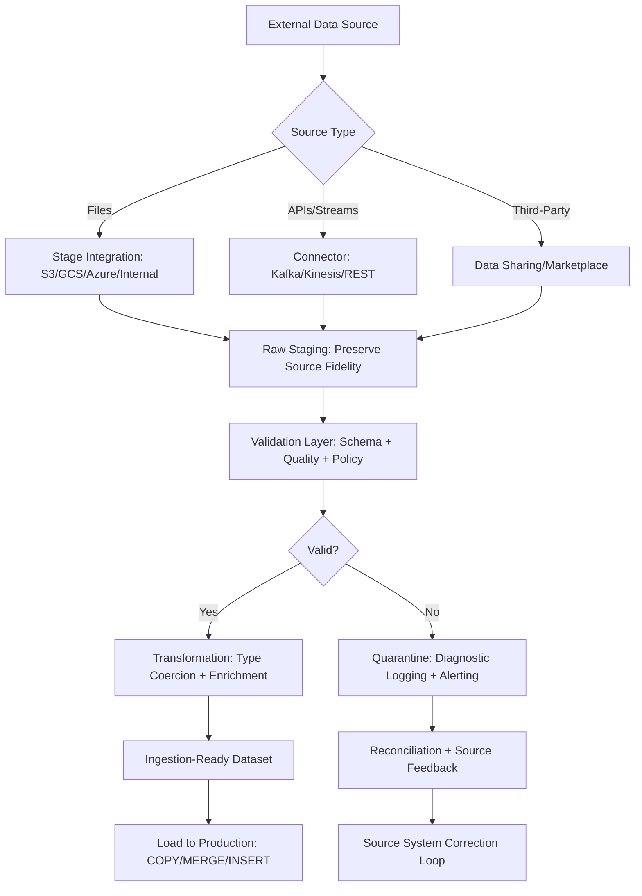

# 1. Title
Data Ingestion Preparation in Snowflake: Architectural Patterns for Sourcing, Staging, and Validation

# 2. Overview
This pattern defines the procedural architecture for preparing external data sources for reliable, governed, and performant ingestion into Snowflake. It exists to ensure data is properly sourced, validated, staged, and transformed before entering production tables, reducing ingestion failures, maintaining data quality, and enforcing security boundaries at the earliest pipeline stage. The pattern operates at the pre-ingestion layer, bridging external systems (files, APIs, streams, third-party sources) with Snowflake's loading mechanisms. It is consumed by data engineers building ELT/ETL pipelines, platform architects designing ingestion frameworks, data stewards enforcing quality gates, and SnowPro Advanced candidates evaluating staging strategies, file format semantics, validation mechanics, and security boundary enforcement during data preparation.

# 3. SQL Object Summary
| Object/Pattern | Type | Purpose | Source Objects/Inputs | Output Objects/Behavior | Execution Mode |
|----------------|------|---------|------------------------|--------------------------|----------------|
| [Ingestion Preparation Pipeline](SQL Object Summary/Ingestion Preparation Pipeline.md) | Orchestration Pattern / Validation Workflow | Source, validate, stage, and pre-transform external data for reliable Snowflake ingestion | External files, APIs, streams, third-party connectors, validation rules | Staged files in internal/external stages, validated datasets, quarantine logs, ingestion-ready schemas | Synchronous validation; asynchronous staging via `COPY INTO <stage>` or connector APIs |

# 4. Architecture
Ingestion preparation operates as a multi-stage gateway before data enters Snowflake tables. External sources are authenticated and accessed via secure connectors or stage integrations. Data is staged in raw form, then validated against schema contracts, quality rules, and governance policies. Valid records proceed to transformation and loading; invalid records are routed to quarantine with diagnostic metadata. The architecture enforces security boundaries (network policies, encryption, RBAC) and performance optimizations (parallel staging, pruning-eligible filters) throughout the preparation workflow.

# 5. Data Flow / Process Flow
1. **Source Authentication & Access Configuration**
   - Input: Source credentials, network policies, stage definitions, connector configs
   - Transformation: Validate connectivity, authenticate via IAM/keys/tokens, establish secure channel
   - Output: Authenticated source handle ready for data retrieval
   - Purpose: Ensure secure, authorized access to external data before any movement

2. **Raw Staging with Source Fidelity Preservation**
   - Input: External data stream, file format specification, stage path
   - Transformation: Copy data to Snowflake stage without transformation; preserve original encoding, structure, and metadata
   - Output: Raw files in internal/external stage with ingestion metadata (timestamp, source ID, checksum)
   - Purpose: Create immutable source-of-truth snapshot for auditability and reprocessing

3. **Schema Validation & Contract Enforcement**
   - Input: Staged files, expected schema definition, data type mappings
   - Transformation: Parse files, validate column presence, data types, nullability, and constraints
   - Output: Validation report with pass/fail status and detailed error diagnostics
   - Purpose: Catch schema drift, type mismatches, or missing fields before transformation

4. **Data Quality Assessment & Policy Evaluation**
   - Input: Validated dataset, quality rules (completeness, uniqueness, validity), governance policies
   - Transformation: Apply rule engine: check null thresholds, duplicate detection, domain validation, Row Access Policy simulation
   - Output: Quality scorecard, quarantined records with error codes, approved records for transformation
   - Purpose: Prevent bad data from entering production; enable source system feedback loops

5. **Pre-Ingestion Transformation & Enrichment**
   - Input: Approved records, transformation logic, enrichment sources (reference tables, UDFs)
   - Transformation: Apply type coercion, standardization, derivations, and business rule logic
   - Output: Ingestion-ready dataset with consistent schema, enriched attributes, and audit metadata
   - Purpose: Ensure downstream tables receive clean, standardized, business-aligned data

6. **Handoff to Loading Layer with Lineage Tracking**
   - Input: Prepared dataset, target table specification, load strategy (append, merge, upsert)
   - Transformation: Generate load command with error handling, idempotency keys, and lineage tags
   - Output: Executable load plan with traceable lineage from source to target
   - Purpose: Enable reliable, auditable ingestion with clear rollback and reconciliation paths

# 6. Logical Breakdown
| Component | Responsibility | Inputs | Outputs | Dependencies | Failure Modes / Risks |
|-----------|----------------|--------|---------|--------------|------------------------|
| [`source_connector`](Logical Breakdown/source_connector.md) | Authenticate and retrieve data from external systems | Credentials, network config, source endpoint, pagination logic | Raw data stream or staged files | Network accessibility; credential validity; source API stability | Connection timeouts, auth failures, or source schema changes break retrieval |
| [`raw_stager`](Logical Breakdown/raw_stager.md) | Preserve source fidelity during initial ingestion | Raw data, file format spec, stage path, encryption config | Immutable staged files with ingestion metadata | Stage write privileges; format compatibility; storage quota | Format parsing errors corrupt staging; quota exhaustion blocks ingestion |
| [`schema_validator`](Logical Breakdown/schema_validator.md) | Enforce structural contracts before transformation | Staged files, expected schema, type mappings, null rules | Validation report + pass/fail flag + error diagnostics | Schema definition availability; parser compatibility | Schema drift causes false negatives; overly strict validation rejects valid edge cases |
| [`quality_engine`](Logical Breakdown/quality_engine.md) | Assess data fitness and enforce business rules | Validated records, quality thresholds, domain lists, policy definitions | Quality scorecard, quarantined records, approved dataset | Rule configuration; reference data availability; policy attachment status | Missing rules allow bad data through; overly aggressive quarantines block valid records |
| [`pre_transformer`](Logical Breakdown/pre_transformer.md) | Apply standardization and enrichment logic | Approved records, transformation specs, enrichment sources | Ingestion-ready dataset with consistent schema and audit fields | Transformation logic correctness; enrichment source accessibility | Incorrect coercion produces silent data corruption; enrichment failures cause partial loads |
| [`lineage_tracker`](Logical Breakdown/lineage_tracker.md) | Record end-to-end provenance for auditability | Source metadata, validation results, transformation log, load plan | Lineage record with source→target mapping and quality metrics | Audit table schema; write privileges; retention policy | Missing lineage breaks compliance; incomplete metadata hinders incident investigation |

# 7. Data Model (State Model)
| Object | Role | Important Fields | Grain | Relationships | Null Handling |
|--------|------|------------------|-------|---------------|---------------|
| [`ingestion_source_definition`](Data Model (State Model)/ingestion_source_definition.md) | External source configuration metadata | `source_id`, `source_type`, `connection_config`, `network_policy_ref`, `refresh_schedule` | Per external source | Referenced by staging jobs; linked to credential vault | `refresh_schedule` is `NULL` for on-demand sources; `network_policy_ref` optional |
| [`staged_file_manifest`](Data Model (State Model)/staged_file_manifest.md) | Raw staging audit and tracking | `manifest_id`, `source_id`, `file_path`, `row_count`, `size_bytes`, `checksum`, `staged_at`, `retention_expiry` | Per staged file | Links to `ingestion_source_definition`; referenced by validation jobs | `checksum` is `NULL` if not computed; `retention_expiry` defaults to account policy |
| [`validation_result_record`](Data Model (State Model)/validation_result_record.md) | Schema and quality assessment output | `validation_id`, `file_manifest_id`, `schema_compliant`, `quality_score`, `error_details`, `validated_at` | Per validation run | Links to `staged_file_manifest`; drives quarantine/approval routing | `error_details` stored as `VARIANT` array; `NULL` if validation passes |
| [`quarantine_log`](Data Model (State Model)/quarantine_log.md) | Diagnostic repository for rejected records | `quarantine_id`, `source_row_id`, `error_code`, `error_message`, `original_payload`, `quarantined_at` | Per rejected record | Traces to `staged_file_manifest`; enables source feedback and reprocessing | `original_payload` stored as `VARIANT`; sensitive fields masked per policy |
| [`ingestion_ready_dataset`](Data Model (State Model)/ingestion_ready_dataset.md) | Pre-transformed data ready for loading | `dataset_id`, `validation_id`, `transformed_schema`, `enrichment_applied`, `lineage_tag`, `ready_at` | Per prepared batch | Links to `validation_result_record`; consumed by load layer | `enrichment_applied` is empty array if no enrichment; `lineage_tag` always populated |

Output Grain: One source definition per external system. One manifest per staged file. One validation record per validation run. One quarantine entry per rejected record. One ready dataset per approved batch.

# 8. Business Logic (Execution Logic)
- **Source Authentication Rules**: Use Snowflake integrations (storage, notification, security) to manage credentials; never embed secrets in query text. Support IAM roles, key-pair auth, OAuth tokens, and managed identities per cloud provider.
- **Staging Strategy Selection**: Internal stages for temporary, Snowflake-managed storage; external stages for cross-cloud, long-term retention, or shared access. Encrypt external stage data at rest; use VPC endpoints for private transfer.
- **Schema Validation Semantics**: Validate column names, data types, nullability, and constraints against expected contract. Use `INFER_SCHEMA` for exploratory ingestion; enforce explicit schema for production pipelines.
- **Quality Rule Types**: Completeness (null thresholds), uniqueness (duplicate detection), validity (domain/range checks), consistency (cross-field logic), timeliness (freshness SLA). Apply rules in order of cost: cheap checks first, expensive validations last.
- **Quarantine Handling**: Route invalid records to dedicated quarantine table with diagnostic metadata. Preserve original payload as `VARIANT` for reprocessing. Implement retention policy to auto-purge after resolution window.
- **Pre-Transformation Standards**: Apply deterministic type coercion (`TRY_CAST`), standardize formats (dates, currencies), derive business keys, and enrich with reference data. Document all transformations for lineage.
- **Exam-Relevant Defaults**: `COPY INTO <stage>` preserves source encoding; `COPY INTO <table>` applies file format parsing. `INFER_SCHEMA` returns nullable types by default; explicit casting required for production. `ON_ERROR = 'CONTINUE'` logs errors but does not populate custom quarantine tables; manual routing required. Result cache TTL is 24h; non-deterministic transformations bypass cache.

# 9. Transformations (State Transitions)
| Source State | Derived State | Rule / Evaluation Logic | Meaning | Impact |
|--------------|---------------|-------------------------|---------|--------|
| [`external_file`](Transformations (State Transitions)/external_file.md) | `staged_raw_file` | `COPY INTO @my_stage FROM 's3://bucket/file.csv'` with `FILE_FORMAT = (TYPE = CSV)` | Preserve source fidelity in Snowflake-managed location | Enables auditability and reprocessing; decouples retrieval from transformation |
| [`staged_file` + `expected_schema`](Transformations (State Transitions)/staged_file + expected_schema.md) | `validation_report` | Parse file; compare columns/types/nulls against contract; flag mismatches | Catch schema drift before transformation | Prevents downstream load failures; enables source system feedback |
| [`validated_records` + `quality_rules`](Transformations (State Transitions)/validated_records + quality_rules.md) | `quality_assessment` | Apply rules: `NULL_COUNT / TOTAL < threshold`, `COUNT(DISTINCT key) = COUNT(*)`, `value IN domain_list` | Quantify data fitness for ingestion | Blocks bad data from production; quantifies source system health |
| [`approved_records` + `transform_logic`](Transformations (State Transitions)/approved_records + transform_logic.md) | `ingestion_ready_dataset` | `TRY_CAST`, `COALESCE`, `UPPER/TRIM`, business derivations, reference joins | Standardize and enrich data for target schema | Ensures downstream tables receive clean, consistent, business-aligned data |
| [`ready_dataset` + `load_strategy`](Transformations (State Transitions)/ready_dataset + load_strategy.md) | `executable_load_plan` | Generate `COPY INTO table` or `MERGE` with error handling, idempotency keys, `QUERY_TAG` | Prepare for reliable, auditable ingestion | Enables idempotent loads, clear rollback paths, and cost attribution |

# 10. Parameters / Variables / Configuration
| Name | Type | Purpose | Allowed Values | Default | Where Used | Effect |
|------|------|---------|----------------|---------|------------|--------|
| [`FILE_FORMAT`](Parameters  Variables  Configuration/FILE_FORMAT.md) | Stage/Copy Option | Define parsing rules for staged files | `TYPE = CSV|JSON|PARQUET|AVRO|ORC|XML`, encoding, delimiters, compression | `TYPE = CSV` | `COPY INTO <stage>` or `<table>` | Determines how source data is parsed; mismatch causes ingestion errors |
| [`ON_ERROR`](Parameters  Variables  Configuration/ON_ERROR.md) | Copy Option | Control behavior on file parsing errors | `ABORT_STATEMENT`, `SKIP_FILE`, `SKIP_FILE_<n>`, `CONTINUE` | `ABORT_STATEMENT` | `COPY INTO <table>` | `CONTINUE` logs errors but requires manual quarantine routing |
| [`VALIDATION_MODE`](Parameters  Variables  Configuration/VALIDATION_MODE.md) | Custom Parameter | Control strictness of schema/quality checks | `STRICT`, `LENIENT`, `REPORT_ONLY` | `STRICT` for production | Validation engine | `STRICT` blocks load on any error; `REPORT_ONLY` logs but proceeds |
| [`QUARANTINE_RETENTION_DAYS`](Parameters  Variables  Configuration/QUARANTINE_RETENTION_DAYS.md) | Policy Parameter | Define how long rejected records are retained | 1–365 days | 30 | Quarantine table DDL | Balances reprocessing window vs storage cost |
| [`RESULT_CACHE_ACTIVE`](Parameters  Variables  Configuration/RESULT_CACHE_ACTIVE.md) | Session Parameter | Enable/disable caching for repeated preparation queries | `TRUE`, `FALSE` | `TRUE` | Query execution | `FALSE` forces re-execution; ensures freshness but increases credits |
| [`ENCRYPTION`](Parameters  Variables  Configuration/ENCRYPTION.md) | Stage Option | Encrypt staged files at rest | `AES_256_GCM`, `NONE` | `AES_256_GCM` for external stages | Stage definition | Protects sensitive data during staging; minimal CPU overhead |
| [`QUERY_TAG`](Parameters  Variables  Configuration/QUERY_TAG.md) | Session Parameter | Tag preparation queries for cost attribution and lineage | JSON-like string: `ingestion:source_sales,env:prod` | None (optional) | Session config | Enables cost allocation, audit trails, and catalog enrichment |

# 11. APIs / Interfaces
| Interface | Invocation Method | Input Structure | Output Structure | Error Behavior | Consumers |
|-----------|-------------------|-----------------|------------------|----------------|-----------|
| [`COPY INTO <stage>`](APIs  Interfaces/COPY INTO stage.md) | SQL Statement | Source location, file format, copy options | Staging confirmation + file metadata | Fails on auth errors, format mismatch, or network issues | Data engineers, pipeline operators |
| [`INFER_SCHEMA`](APIs  Interfaces/INFER_SCHEMA.md) | SQL Function | Stage location, file format | Inferred column names, types, nullability | Returns `NULL` if file unreadable or format unsupported | Exploratory ingestion, schema discovery |
| [`SYSTEM$FILE_TRANSFER`](APIs  Interfaces/SYSTEM$FILE_TRANSFER.md) | SQL Function | Monitor file upload/download status | Transfer progress, bytes transferred, errors | Returns `NULL` if transfer not found or incomplete | Pipeline monitoring, SLA tracking |
| [External Stage Integration](APIs  Interfaces/External Stage Integration.md) | Cloud Provider API | Stage URL, credentials, encryption config | Accessible stage path | Fails on auth errors, network policy blocks, or quota exceeded | Platform architects configuring cross-cloud staging |
| [`ACCOUNT_USAGE.QUERY_HISTORY`](APIs  Interfaces/ACCOUNT_USAGE.QUERY_HISTORY.md) | System View | Filter on `QUERY_TAG`, `WAREHOUSE_NAME` | Query telemetry with ingestion metrics | Requires `ACCOUNTADMIN` or `VIEW SERVER STATE` | Auditors tracking preparation activity and cost |
| [Snowflake Connector APIs](APIs  Interfaces/Snowflake Connector APIs.md) | Python/Java/Spark | Connection config, source query, batch size | Streamed result set or DataFrame | Returns connector-specific errors; retries on transient failures | Data engineers building custom preparation pipelines |

# 12. Execution / Deployment
- Small preparations execute synchronously via SQL; large staging jobs use asynchronous `COPY INTO <stage>` with parallel transfer.
- Validation and transformation execute in Snowflake warehouse; size based on data volume and complexity SLA.
- Upstream dependency: External sources must be accessible via configured network policies; credentials must be valid and rotated per policy.
- Environment behavior: Dev/test may use internal stages and lenient validation; production mandates external stages with encryption, strict validation, and audit logging.
- Runtime assumption: Preparation queries are optimized for pruning; non-sargable predicates cause full scans regardless of warehouse size.

# 13. Observability
- Track staging success rate: Monitor `ACCOUNT_USAGE.QUERY_HISTORY` filtered on `COPY INTO <stage>` to identify auth or format errors.
- Validate schema compliance: Log `schema_compliant` flag from validation jobs; alert on drift exceeding threshold.
- Monitor quality trends: Track `quality_score` over time per source; alert on degradation indicating source system issues.
- Audit quarantine volume: Count rejected records per source/day; spikes indicate upstream data quality incidents.
- Implement cost attribution: Tag preparation queries with `QUERY_TAG = 'ingestion:<source>,env:<env>'` to allocate warehouse credits to specific pipelines.

# 14. Failure Handling & Recovery
- **Stage authentication failure**: `COPY INTO <stage>` fails with "insufficient privileges" or "access denied". Detection: Query execution error code `100096` or cloud provider auth error. Recovery: Validate stage credentials, network policies, and IAM roles; test with `LIST @stage`.
- **Schema drift breaks validation**: Source adds/removes columns not in expected contract. Detection: `schema_compliant = FALSE` with column mismatch details. Recovery: Update expected schema definition; implement schema evolution workflow or versioned contracts.
- **Quality rule violation quarantines valid data**: Overly strict threshold rejects acceptable records. Detection: High quarantine rate with false-positive error codes. Recovery: Adjust rule thresholds; implement tiered validation (warn vs block); add source feedback loop.
- **Transformation logic produces silent corruption**: `TRY_CAST` returns `NULL` for unexpected formats; business derivations misapply logic. Detection: Downstream anomalies or reconciliation mismatches. Recovery: Add transformation validation tests; log coercion failures; implement canary loads.
- **Quarantine retention expires before resolution**: Rejected records purged before source correction. Detection: Inability to reprocess resolved issues. Recovery: Extend `QUARANTINE_RETENTION_DAYS` for critical sources; implement external archive for long-term retention.

# 15. Security & Access Control
- Preparation pipelines inherit standard RBAC: executing role must have `USAGE` on warehouse, `WRITE` on stage, and `SELECT` on reference data.
- Row Access Policies and Dynamic Data Masking evaluate during validation/transformation; prepare logic cannot bypass policy-enforced restrictions.
- External stage credentials stored in Snowflake integration objects; never embed secrets in query text or application code.
- Quarantine tables may contain raw payloads with PII; apply masking policies or row access controls to quarantine outputs.
- Audit preparation activity via `ACCOUNT_USAGE.QUERY_HISTORY` and custom logging; retain for compliance and incident investigation.

# 16. Performance / Scalability Considerations
- Staging performance dominated by network bandwidth and file size: parallel `COPY` scales with warehouse size; compress files to reduce transfer volume.
- Validation cost scales with record count and rule complexity: apply cheap filters first (null checks), expensive validations last (regex, lookups).
- Quarantine routing adds I/O overhead: batch insert rejected records; avoid row-by-row logging for high-volume sources.
- Transformation logic should be set-based, not row-by-row: use SQL expressions over UDFs where possible for parallel execution.
- Result cache reduces redundant preparation: identical validation/transformation queries from same role reuse cached results; cache fragmentation occurs across roles.
- Exam trap: `COPY INTO <stage>` does not parse file content; parsing occurs at `COPY INTO <table>` or explicit `SELECT` from stage. `INFER_SCHEMA` returns nullable types; explicit casting required for production. `ON_ERROR = 'CONTINUE'` logs errors to load history but does not populate custom quarantine tables.

# 17. Assumptions & Constraints
- Assumes external sources are stable and accessible; intermittent connectivity causes staging retries or partial files.
- Assumes schema contracts are maintained and versioned; ad-hoc schema changes break validation without evolution workflow.
- Assumes quality rules are documented and testable; ambiguous rules cause inconsistent quarantine decisions.
- Assumes quarantine retention aligns with source correction SLA; expired records cannot be reprocessed.
- Assumes transformation logic is deterministic and idempotent; non-deterministic functions bypass cache and may produce inconsistent outputs.
- Exam trap: `INFER_SCHEMA` is exploratory; production pipelines should use explicit schema definitions. `COPY INTO <table>` applies file format parsing; `COPY INTO <stage>` does not. `RESULT_CACHE_ACTIVE` defaults to `TRUE`; disabling forces re-execution. `QUERY_TAG` is optional but critical for governance; not enforced by engine.

# 18. Future Enhancements
- Implement automated schema evolution detection: Compare inferred vs expected schema; suggest contract updates or version branching for drift management.
- Add adaptive quality rule tuning: Analyze quarantine patterns to recommend threshold adjustments or rule refinements based on false-positive rates.
- Develop preparation template library: Pre-validated patterns for common sources (CSV exports, API payloads, CDC streams) with embedded validation and transformation logic.
- Integrate preparation monitoring into governance dashboards: Visualize staging success, validation pass rates, quarantine volume, and cost by source or business unit.
- Enable cross-account preparation with Data Sharing: Allow authorized accounts to stage and validate shared data without duplication, reducing latency and storage.
- Add predictive preparation cost modeling: Estimate staging transfer time, validation compute, and transformation credits for candidate sources before execution to guide optimization.
