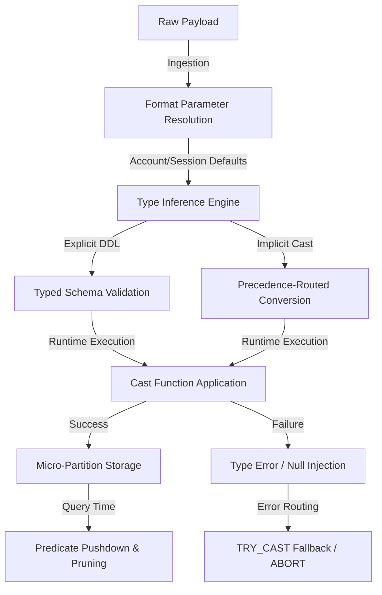

# Data Types Formats

# 1. Title
SnowPro Advanced: Data Types, Formats & Type Casting Architecture

# 2. Overview
- **What it does**: Governs how Snowflake resolves, stores, converts, and evaluates native and semi-structured data types, format parameters, and casting logic during ingestion and transformation.
- **Why it exists**: Type misalignment, implicit casting, and timezone/format defaults cause silent precision loss, storage bloat, query failures, and aggregation skew. Explicit type control ensures deterministic storage, predictable casting behavior, and reliable downstream modeling.
- **Where it fits**: Operates at the boundary between raw ingestion and curated transformation. Enforced during DDL execution, query compilation, runtime casting, and micro-partition storage compression.
- **Intended consumer**: Data engineers, analytics engineers, data modelers, platform architects, and SnowPro Advanced candidates evaluating casting precedence, precision/scale limits, temporal resolution, and semi-structured storage mechanics.

# 3. SQL Object Summary
| Field | Value |
|-------|-------|
| Object Scope | Type System, Format Parameters & Casting Pipeline |
| Type | Session/Account Configuration + DDL Enforcement + CAST/TRY_CAST Execution |
| Purpose | Standardize type resolution, prevent implicit precision loss, govern format parsing, enable deterministic transformations |
| Source Objects | Raw strings, external feeds, semi-structured payloads, legacy database exports |
| Output Object | Typed column schemas, standardized temporal values, parsed VARIANT paths, validated numeric/boolean flags |
| Execution Mode | Compile-time validation, runtime casting, session parameter inheritance, storage compression |

# 4. Architecture
Type resolution follows a layered inheritance model: Account defaults → Session overrides → Query-level explicit casting. Snowflake's query compiler validates type compatibility, resolves implicit casts using precedence rules, and delegates runtime conversion to the execution engine. Semi-structured data bypasses strict schema enforcement at ingest, storing as compressed binary until query-time extraction.

# 5. Data Flow / Process Flow
| Step | Input | Transformation | Output | Purpose |
|------|-------|----------------|--------|---------|
| 1. Format Inheritance | Raw strings/bytes, account/session parameters | `TIMESTAMP_INPUT_FORMAT`, `DATE_OUTPUT_FORMAT`, `BINARY_INPUT_FORMAT` applied | Resolved parsing rules | Establish baseline conversion behavior before execution |
| 2. Type Inference & Validation | Source payload + DDL or implicit context | Precedence matching, precision/scale validation, length checks | Compatible type mapping | Prevent schema mismatch, enforce storage constraints |
| 3. Casting Execution | Validated payload + cast operator (`CAST`, `::`, `TRY_CAST`) | Runtime conversion, timezone adjustment, JSON path extraction | Converted value or error/null | Transform raw data to target type without breaking transaction |
| 4. Storage Compression | Typed values | Type-specific encoding (dictionary, delta, bit-packing) | Micro-partition blocks | Optimize query performance, reduce storage footprint |
| 5. Query-Time Resolution | Stored values + query predicates | Predicate pushdown, implicit coercion, type alignment | Filtered/aggregated results | Enable efficient pruning, prevent full scan on mismatched types |

# 6. Logical Breakdown of the SQL
| Component | Responsibility | Inputs | Outputs | Dependencies | Failure Modes / Risks |
|-----------|----------------|--------|---------|--------------|-----------------------|
| Numeric Handling (`NUMBER`, `FLOAT`) | Precision/scale enforcement, decimal alignment | Source numbers, scale/precision limits | Fixed-point or floating-point values | DDL definition, query casting | Overflow truncates silently if `CAST`, fails on `NUMBER` limit (38 digits) |
| String/VARCHAR Limits | Length enforcement, character encoding | Source strings, max length definition | Truncated or validated strings | `VARCHAR(n)` vs `TEXT`/`STRING` | Implicit truncation on `CAST` if target smaller; Unicode surrogate pair miscount |
| Temporal Resolution (`DATE`, `TIME`, `TIMESTAMP_NTZ/LTZ/TZ`) | Timezone alignment, format parsing | Raw datetime strings, session format params | Standardized temporal values | `TIMESTAMP_INPUT_FORMAT`, timezone session setting | LTZ vs TZ vs NTZ misalignment shifts aggregations; ambiguous dates fail without format |
| Semi-Structured (`VARIANT`, `OBJECT`, `ARRAY`) | Flexible payload storage, path extraction | JSON/XML/Avro strings | Binary-compressed variant tree | Query-time `:` operator, `GET_PATH`, `FLATTEN` | Large JSON inflates storage; untyped paths bypass pruning; schema drift hidden |
| Casting Operators (`CAST`, `::`, `TRY_CAST`, `TO_*`) | Type conversion control | Source value, target type | Converted value or error/null | Precedence rules, null handling | `CAST` aborts on mismatch; `TRY_CAST` returns `NULL`, masking data quality issues |
| Format Parameters | Session/account parsing defaults | `SET` statements, account config | Active format context | Inheritance hierarchy (Account → Session → Query) | Conflicting defaults cause inconsistent parsing across pipelines |

# 7. Data Model
| Entity | Role | Important Fields | Grain | Relationships | Keys | Null Handling |
|--------|------|------------------|-------|---------------|------|---------------|
| `COLUMN_TYPE_SCHEMA` | Typed column definition registry | `TABLE_NAME`, `COLUMN_NAME`, `DATA_TYPE`, `PRECISION`, `SCALE`, `NULLABLE` | 1 row = 1 column type definition | Maps to `INFORMATION_SCHEMA.COLUMNS`, DDL scripts | Composite: `TABLE_NAME` + `COLUMN_NAME` | `NULLABLE=TRUE` allows null insertion; `FALSE` enforces storage constraint |
| `FORMAT_PARAMETER_SET` | Active parsing context | `PARAMETER_NAME`, `LEVEL`, `VALUE`, `INHERITED_FROM` | 1 row = 1 active format setting | Inherited by query execution, overridden by `ALTER SESSION` | `PARAMETER_NAME` | Defaults apply if unset; null propagation follows casting rules |
| `CAST_RESOLUTION_LOG` | Conversion outcome tracking | `QUERY_ID`, `SOURCE_TYPE`, `TARGET_TYPE`, `CAST_FUNCTION`, `SUCCESS_FLAG` | 1 row = 1 cast operation | Links to `QUERY_HISTORY`, `EXECUTION_CONTEXT` | `QUERY_ID` + `CAST_SEQUENCE` | `NULL` on `TRY_CAST` failure; logged for quality auditing |

**Output Grain**: Determined at column definition and query projection. 1:1 mapping between source value and converted output unless row expansion occurs (e.g., `FLATTEN` on `ARRAY`). Grain mismatch during join or aggregation causes precision drift or duplicate counts.

# 8. Business Logic
| Rule | Effect | Implementation Pattern | Edge Case |
|------|--------|------------------------|-----------|
| **Type Precedence** | Determines implicit conversion direction | `NUMBER` → `FLOAT` → `VARCHAR` (promotion rules) | Downcasting `FLOAT` to `NUMBER` loses precision; `VARCHAR` to `DATE` fails without format |
| **Timezone Alignment** | Standardizes temporal reference frames | `TIMESTAMP_TZ` stores offset; `TIMESTAMP_NTZ` ignores; `TIMESTAMP_LTZ` uses session | Cross-region pipelines mix TZ/NTZ, causing aggregation shift by hours |
| **Precision Rounding** | Controls decimal truncation behavior | `ROUND(col, scale)`, `CAST(col AS NUMBER(38,2))` | Half-even rounding vs traditional rounding causes financial variance |
| **Null Propagation** | Defines missing value handling in casts | `TRY_CAST` returns `NULL`; `CAST` fails | Silent null injection masks upstream data quality; downstream `WHERE IS NOT NULL` filters break |
| **Semi-Structured Typing** | Extracts typed values from VARIANT | `col:$.path::NUMBER`, `col:$.path::TIMESTAMP_TZ` | Missing path returns `NULL`; type mismatch at extraction fails query |
| **Format Override Priority** | Resolves parsing conflicts | Query `::` > Session `ALTER` > Account Default > Snowflake Fallback | Pipeline inherits legacy session params, causing inconsistent date parsing across runs |

# 9. Transformations
| Source | Derived | Formula / Rule | Business Meaning | Impact |
|--------|---------|----------------|------------------|--------|
| Raw datetime string | `TIMESTAMP_TZ` | `TRY_TO_TIMESTAMP_TZ(col, 'YYYY-MM-DDTHH24:MI:SSTZH:TZM')` | Global time alignment, audit compliance | Eliminates timezone drift; invalid format routes to `NULL` |
| Unstructured numeric string | `NUMBER(38,2)` | `TRY_CAST(REPLACE(col, ',', '') AS NUMBER(38,2))` | Financial/scientific precision standardization | Prevents implicit float conversion; ensures deterministic rounding |
| JSON string payload | `VARIANT` → Typed Columns | `PARSE_JSON(col)`, then `payload:$.id::VARCHAR`, `payload:$.amount::NUMBER` | Schema-on-read to relational projection | Enables pruning, reduces storage overhead vs raw JSON |
| Boolean flag string | `BOOLEAN` | `UPPER(TRIM(col)) IN ('TRUE','1','YES')` | Standardized state classification | Prevents `VARCHAR` to `BOOLEAN` implicit cast failures on legacy exports |
| Large text blob | Compressed `VARCHAR`/`TEXT` | Direct insertion, Snowflake applies dictionary/bit-packing | Optimized storage, query-compatible | Exceeds 16MB limit per cell; split or stage externally if oversized |

# 10. Parameters / Variables / Macros
| Name | Type | Purpose | Allowed Format | Default | Usage | Effect on Output |
|------|------|---------|----------------|---------|-------|------------------|
| `TIMESTAMP_INPUT_FORMAT` | String | Date/time parsing template | `YYYY-MM-DD`, `DD-MON-YYYY`, `AUTO` | `AUTO` | `ALTER SESSION` | Controls string-to-timestamp conversion; mismatch causes `TRY_CAST` nulls |
| `TIMESTAMP_OUTPUT_FORMAT` | String | Timestamp display standardization | Format string or `ISO8601` | Session default | `ALTER SESSION` | Affects BI export, client display; does not alter storage |
| `DATE_INPUT_FORMAT` | String | Date-only parsing rule | `YYYY-MM-DD`, `MM/DD/YYYY`, `AUTO` | `AUTO` | Session/Account | Ambiguous dates (`01/02/2023`) fail if format not explicit |
| `JSON_INDENT` | Integer | Semi-structured pretty-print spacing | `0–10` | `0` | Session/Query | Visual only; does not affect `VARIANT` storage or extraction |
| `BINARY_INPUT_FORMAT` | Enum | Binary/hex/base64 parsing mode | `HEX`, `BASE64`, `UTF8` | `HEX` | Session | Determines how `BINARY` columns interpret raw payloads |
| `STRICT_JSON_OUTPUT` | Boolean | Enforces valid JSON serialization | `TRUE` / `FALSE` | `FALSE` | Session | `TRUE` fails on unescaped control characters; `FALSE` produces lenient output |
| `AUTOCOMMIT` | Boolean | Transaction scope for DDL/DML | `TRUE` / `FALSE` | `TRUE` | Session | Type-altering DDL (`ALTER TABLE MODIFY COLUMN`) commits immediately |

# 11. APIs / Interfaces
| Interface | Invocation Method | Input Structure | Output Structure | Error Behavior | Consumers |
|-----------|-------------------|-----------------|------------------|----------------|-----------|
| `CAST(expr AS type)` / `::` | SQL | Source expression, target type | Converted value or runtime error | Fails on incompatible type, precision overflow | Inline transformations, DDL, BI layers |
| `TRY_CAST(expr AS type)` | SQL | Source expression, target type | Converted value or `NULL` | Returns `NULL` on failure; never aborts query | Data quality gates, ingestion validation |
| `PARSE_JSON(string)` | SQL | Raw JSON string | `VARIANT` tree | Fails on malformed JSON; use `TRY_PARSE_JSON` for fallback | Semi-structured ingestion, schema-on-read |
| `TO_TIMESTAMP_TZ(string, format)` | SQL | String, explicit format | `TIMESTAMP_TZ` | Fails on mismatch; strict parsing | Temporal standardization, cross-region alignment |
| `INFORMATION_SCHEMA.COLUMNS` | SQL | Schema/table filters | Type definitions, nullability, defaults | Returns empty if no access; requires `USAGE` | Schema auditing, type drift detection, CI/CD validation |

# 12. Execution / Deployment
- **Manual vs Scheduled**: Type definitions set via DDL (`CREATE/ALTER TABLE`). Format parameters applied via `ALTER SESSION` or account policy. Casting executes inline with query compilation.
- **Compile-Time vs Runtime**: Type compatibility checked at parse/compile. Implicit casting resolved before execution. Runtime casting applies `TRY_CAST`/`TO_*` functions during row processing.
- **Orchestration**: CI/CD pipelines enforce strict DDL, validate type contracts via `dbt` tests, and block deployments on implicit cast warnings. Session parameters standardized via connection profiles.
- **Upstream Dependencies**: Account parameter defaults, session inheritance chain, warehouse compute capacity (for large JSON parsing), storage compression algorithms.
- **Environment Behavior**: Dev/test often use `AUTO` formats, lenient casting, and default timezones. Prod enforces explicit formats, strict DDL, `TIMESTAMP_TZ` for cross-region, and `TRY_CAST` for resilience.
- **Runtime Assumptions**: `TIMESTAMP_LTZ` inherits session timezone; `TIMESTAMP_TZ` stores explicit offset; `TIMESTAMP_NTZ` discards timezone. `NUMBER` defaults to `(38,0)`. `VARIANT` stores as compressed binary, not text.

# 13. Observability
| Metric | Implementation | Detection Method | Operational Threshold |
|--------|----------------|------------------|------------------------|
| Implicit cast volume | `COUNT(*) WHERE QUERY_TEXT LIKE '%CAST%' AND QUERY_TEXT NOT LIKE '%TRY_CAST%'` | `QUERY_HISTORY` parsing | High volume = upstream type drift; risks silent precision loss |
| `TRY_CAST` null rate | `COUNT(NULLIF(TRY_CAST(col, type), source_col)) / TOTAL_ROWS` | Validation query per batch | >1% nulls = format mismatch or upstream corruption |
| VARIANT storage bloat | `SUM(ACTIVE_BYTES) / COUNT(*)` for variant columns vs typed | `TABLE_STORAGE_METRICS` | >2x typed equivalent storage = migrate to relational schema |
| Timezone misalignment | `EXTRACT(TIMEZONE_HOUR FROM col)` variance across sources | Temporal audit query | Non-uniform offsets in `TIMESTAMP_TZ` = inconsistent source formats |
| Precision truncation alerts | `ABS(source_float - CAST(source_float AS NUMBER(38,2))) > 0.005` | Reconciliation query | Financial variance > threshold = enforce explicit rounding rules |

# 14. Failure Handling & Recovery
| Failure Scenario | What Breaks | Detection | Fallback Behavior | Recovery Approach |
|------------------|-------------|-----------|-------------------|-------------------|
| Implicit cast precision loss | Decimal truncation, float drift | Reconciliation query variance, `QUERY_HISTORY` warnings | Query succeeds but output inaccurate | Replace implicit with explicit `CAST` + `ROUND`, enforce strict DDL |
| Timezone shift on `LTZ`/`NTZ` | Aggregation misalignment, report skew | `TIMESTAMP_TZ` vs `TIMESTAMP_LTZ` comparison | Data valid but contextually incorrect | Standardize to `TIMESTAMP_TZ` at ingest, document session timezone |
| Invalid JSON parsing | `PARSE_JSON` fails, query aborts | Error log contains `JSON parsing error` | Pipeline halts on `CAST`/`PARSE_JSON` | Switch to `TRY_PARSE_JSON`, quarantine malformed payloads, fix source |
| VARCHAR length truncation | Silent data loss on `CAST` to smaller `VARCHAR` | Row comparison shows missing suffixes | Query succeeds; data corrupted | Use `VARCHAR` without length or `TEXT`, validate length pre-load |
| Null injection via `TRY_CAST` | Downstream aggregations skip missing values | `COUNT(*)` drops unexpectedly after `TRY_CAST` | Pipeline continues with gaps | Add null ratio threshold guard, log failed casts, alert upstream |
| Format parameter inheritance conflict | Inconsistent parsing across tasks | Same input yields different outputs in different sessions | Non-deterministic query results | Lock session params in connection profile, avoid `ALTER SESSION` in scripts |

# 15. Security & Access Control
| Control | Implementation | Effect |
|---------|----------------|--------|
| PII masking on VARIANT paths | `MASKING POLICY` applied to `VARIANT` columns | Masks sensitive JSON paths without altering storage structure |
| Column-level type encryption | Snowflake encryption at rest + column-level access grants | Protects numeric/temporal PII; requires role-based `SELECT` |
| Format parameter restriction | Limit `ALTER SESSION` privileges on production roles | Prevents unauthorized timezone/format overrides that skew audits |
| Semi-structured access control | `GRANT USAGE` on schema, restrict `VARIANT` path extraction to authorized roles | Prevents arbitrary JSON probing, enforces least-privilege querying |
| Audit logging | `ACCESS_HISTORY` + `QUERY_HISTORY` tracking type-altering DDL | Traces who changed column types, when, and query impact |

# 16. Performance / Scalability Considerations
| Bottleneck | Cause | Tradeoff | Mitigation |
|------------|-------|----------|------------|
| Large VARIANT parsing | Query-time JSON extraction on massive payloads | CPU-bound, memory pressure, slow response | Flatten at ingestion, project to typed columns, cluster on extracted keys |
| Implicit cast in joins | `WHERE string_col = number_col` forces full scan | Disables pruning, inflates runtime | Explicitly cast one side pre-join, align DDL types, add clustering |
| Non-sargable temporal filters | `WHERE DATE(timestamp_col) = '2024-01-01'` | Bypasses micro-partition pruning | Filter on native `TIMESTAMP`, use range predicates, add search optimization |
| Float vs NUMBER precision | Repeated `FLOAT` calculations accumulate drift | Inaccurate aggregates, reconciliation failures | Use `NUMBER` for financial/scientific data, avoid `FLOAT` for exact matches |
| String length overhead | `VARCHAR(16777216)` on all text columns | Increased metadata overhead, slower scans | Define precise lengths, use `TEXT` only for unbounded content |
| Session parameter sprawl | Per-query `ALTER SESSION` in scripts | Connection pool fragmentation, inconsistent behavior | Centralize in connection profile, use account defaults, remove inline overrides |

# 17. Assumptions & Constraints
- **No concrete SQL provided**: Documentation reflects canonical type/format mechanics for SnowPro Advanced. Exact behavior depends on session configuration, DDL constraints, and source data characteristics.
- `NUMBER` precision maxes at 38 digits. `FLOAT` follows IEEE 754 double precision. Implicit casts from `VARCHAR` to `NUMBER` fail on non-numeric strings.
- `TIMESTAMP_LTZ` inherits session timezone; `TIMESTAMP_TZ` stores explicit offset; `TIMESTAMP_NTZ` discards timezone entirely. Exam frequently tests LTZ vs TZ behavior in cross-region pipelines.
- `VARIANT` stores data as compressed binary, not text. Path extraction (`:` operator) occurs at query time. Large JSON inflates storage and disables predicate pushdown.
- `TRY_CAST` returns `NULL` on failure and never raises an error. `CAST` aborts the statement on type mismatch or precision overflow.
- Format parameters follow inheritance: Query `::` > Session `ALTER` > Account Default > Snowflake Fallback. Conflicting defaults cause non-deterministic parsing.
- **Exam trap assumptions**: SnowPro Advanced tests implicit casting precedence, `TRY_CAST` vs `CAST` behavior, `TIMESTAMP_LTZ/TZ/NTZ` differences, `VARIANT` storage mechanics, precision/scale limits, format parameter inheritance, and predicate pushdown limitations on untyped data. Memorize defaults and engine constraints.

# 18. Future Enhancements
- **Enforce strict DDL contracts in CI/CD**: Block deployments with implicit casts, undefined lengths, or ambiguous temporal types. Integrate `dbt` type tests for zero tolerance on drift.
- **Migrate high-cardinality VARIANT paths to typed columns**: Flatten frequently queried JSON paths during ingestion. Enables clustering, pruning, and storage compression.
- **Standardize timezone handling globally**: Enforce `TIMESTAMP_TZ` at ingestion boundary. Deprecate `TIMESTAMP_LTZ` in cross-region pipelines. Document session timezone as legacy.
- **Automate `TRY_CAST` null ratio monitoring**: Build validation queries that alert when null injection exceeds threshold. Route failed payloads to quarantine table with source snapshot.
- **Replace inline format overrides with connection profiles**: Remove `ALTER SESSION` from pipeline scripts. Centralize format defaults, reduce execution variance, simplify debugging.
- **Optimize large JSON ingestion**: Pre-parse payloads using Snowpark or external compute. Project to relational schema before loading. Reduces query-time parsing overhead and storage bloat.
