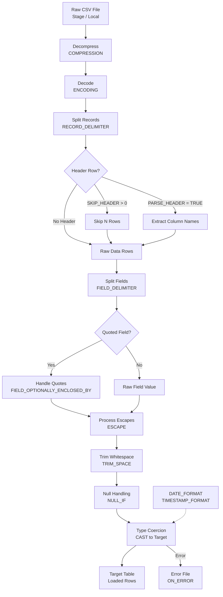

# 1. CSV File Format in Snowflake

# 2. Overview

CSV (Comma-Separated Values) is the most common plaintext format for bulk data ingestion into Snowflake. Snowflake parses CSV files through the `FILE_FORMAT` object with `TYPE = 'CSV'`, which controls delimiter behavior, header handling, quoting rules, escape sequences, null representation, type coercion, and error handling during `COPY INTO`, external table queries, and pipe ingestion.

CSV ingestion is deceptively complex because the format has no formal specification. Snowflake's parser must handle ambiguous cases such as quoted fields containing delimiters, embedded newlines, varying column counts, inconsistent encoding, and header rows that may or may not match target schema. Misconfiguration of any `FILE_FORMAT` parameter can cause parse failures, silent data corruption, or load aborts.

This feature exists to:
- Ingest tabular data from legacy systems, exports, and third-party providers
- Provide fine-grained control over how raw text is tokenized into columns
- Support standard RFC 4180-like behavior while allowing deviation for non-standard producer formats
- Enable schema-on-read ingestion into `VARIANT` columns when structure is irregular

The intended consumers are data engineers configuring production loads, integration developers mapping source exports to Snowflake tables, and SnowPro Advanced exam candidates who must understand default delimiters, null handling, header semantics, column-count mismatch behavior, and the interaction between quoting and escape sequences.

# 3. SQL Object Summary

| Object/Feature | Type | Purpose | Source Objects or Inputs | Output Object or Observable Behavior | Execution Mode or Invocation Method |
|---|---|---|---|---|---|
| [FILE_FORMAT (CSV)](SQL Object Summary/FILE_FORMAT (CSV).md) | Schema object | Parsing configuration for CSV files | CSV parameters | Reusable format definition | `CREATE FILE FORMAT` |
| [COPY INTO](SQL Object Summary/COPY INTO.md) | DML command | Bulk CSV load | Stage files + target table + FILE_FORMAT | Loaded rows, error files, load history | Manual SQL, task, or pipe |
| [VALIDATION_MODE](SQL Object Summary/VALIDATION_MODE.md) | COPY option | Pre-validate CSV without loading | Stage files + FILE_FORMAT | Error report | `COPY INTO` option |
| [ON_ERROR](SQL Object Summary/ON_ERROR.md) | COPY option | CSV error handling | `ABORT_STATEMENT`, `SKIP_FILE`, `CONTINUE` | Load continuation or abort | `COPY INTO` clause |
| [PARSE_HEADER](SQL Object Summary/PARSE_HEADER.md) | FILE_FORMAT option | Infer column names from header | `TRUE`, `FALSE` | `FALSE` | `FILE FORMAT` | Uses first row for metadata |
| [EXTERNAL TABLE](SQL Object Summary/EXTERNAL TABLE.md) | Schema object | Schema-on-read over CSV files | Cloud storage + FILE_FORMAT | Queryable CSV rows | DDL creation |
| [Pipe](SQL Object Summary/Pipe.md) | Schema object | Automated CSV ingestion | Cloud storage events + FILE_FORMAT | Loaded rows | Snowpipe serverless |

# 4. Architecture

CSV parsing operates between the storage layer (stage files) and the query engine. The `FILE_FORMAT` object encapsulates tokenization rules. The parser reads file bytes, applies encoding and decompression, splits records by `RECORD_DELIMITER`, splits fields by `FIELD_DELIMITER`, handles quoting and escaping, applies `NULL_IF` logic, trims whitespace if configured, and finally casts strings to target column types.

# 5. Data Flow / Process Flow

## Step 1: File Discovery and Decompression
- **Input:** Raw CSV files in stage
- **Transformation:** Engine identifies files; applies `COMPRESSION` setting (`AUTO`, `GZIP`, `BZ2`, `DEFLATE`, `NONE`)
- **Output:** Decompressed byte stream
- **Purpose:** Prepare raw bytes for parsing

## Step 2: Character Decoding
- **Input:** Compressed or raw bytes
- **Transformation:** `ENCODING` parameter converts bytes to characters (`UTF8`, `ISO2022JP`, `UTF16`, etc.)
- **Output:** Character stream
- **Purpose:** Ensure correct character interpretation

## Step 3: Record Delimiting
- **Input:** Character stream
- **Transformation:** `RECORD_DELIMITER` splits stream into logical rows; default is newline (`\n`)
- **Output:** Individual record strings
- **Purpose:** Separate rows for field parsing

## Step 4: Header Handling
- **Input:** First N rows of file
- **Transformation:** `SKIP_HEADER` discards N rows; `PARSE_HEADER = TRUE` extracts column names from first row for metadata
- **Output:** Data rows only (if skipped) or column name mapping (if parsed)
- **Purpose:** Remove metadata rows or use them for schema inference

## Step 5: Field Tokenization
- **Input:** Record string
- **Transformation:** `FIELD_DELIMITER` splits record into fields; default is comma (`,`)
- **Output:** Array of field strings
- **Purpose:** Separate columns

## Step 6: Quote and Escape Processing
- **Input:** Field strings
- **Transformation:** `FIELD_OPTIONALLY_ENCLOSED_BY` (typically `"`) strips surrounding quotes; `ESCAPE` handles escaped characters within fields
- **Output:** Unquoted, unescaped field values
- **Purpose:** Handle fields containing delimiters, newlines, or quotes

## Step 7: Whitespace Trimming
- **Input:** Field values
- **Transformation:** `TRIM_SPACE` removes leading/trailing whitespace if enabled
- **Output:** Trimmed field values
- **Purpose:** Clean string data before type coercion

## Step 8: Null Substitution
- **Input:** Field values
- **Transformation:** `NULL_IF` compares values against null indicators (default `['\\N', 'NULL']`); matches become SQL `NULL`
- **Output:** Values or SQL `NULL`
- **Purpose:** Represent missing data correctly

## Step 9: Type Coercion
- **Input:** String field values
- **Transformation:** Values cast to target column types using `DATE_FORMAT`, `TIME_FORMAT`, `TIMESTAMP_FORMAT`, `BINARY_FORMAT`
- **Output:** Typed column values
- **Purpose:** Align strings to table schema

## Step 10: Constraint Validation and Load
- **Input:** Typed row values
- **Transformation:** `NOT NULL` constraints enforced; enabled `UNIQUE`/`PRIMARY KEY` checked; rows inserted into table
- **Output:** Committed rows or rejected rows
- **Purpose:** Persist valid data

# 6. Logical Breakdown

## Component: Decompressor
- **Responsibility:** Handle compressed CSV files
- **Inputs:** File bytes, `COMPRESSION` setting
- **Outputs:** Decompressed byte stream
- **Dependencies:** Correct compression detection or specification
- **Failure Modes:** Misidentified compression causes parse failure; corrupted archives abort load

## Component: Character Decoder
- **Responsibility:** Convert bytes to characters
- **Inputs:** Byte stream, `ENCODING`
- **Outputs:** Character stream
- **Dependencies:** File must be in specified encoding
- **Failure Modes:** Invalid byte sequences cause errors unless `REPLACE_INVALID_CHARACTERS = TRUE`

## Component: Record Splitter
- **Responsibility:** Separate rows
- **Inputs:** Character stream, `RECORD_DELIMITER`
- **Outputs:** Record strings
- **Dependencies:** Delimiter must match file structure
- **Failure Modes:** Embedded newlines inside unquoted fields split records incorrectly; Windows `\r\n` may leave carriage returns if `RECORD_DELIMITER` is `\n` only

## Component: Header Skipper
- **Responsibility:** Remove or parse header rows
- **Inputs:** First rows, `SKIP_HEADER`, `PARSE_HEADER`
- **Outputs:** Data rows; optional column name mapping
- **Dependencies:** Header row count must be accurate
- **Failure Modes:** `SKIP_HEADER = 0` treats header as data; incorrect skip count loses data rows

## Component: Field Tokenizer
- **Responsibility:** Separate columns
- **Inputs:** Record string, `FIELD_DELIMITER`
- **Outputs:** Field strings
- **Dependencies:** Delimiter must not conflict with data content unless quoting is used
- **Failure Modes:** Pipe or tab delimiters misconfigured as comma cause single-column loads

## Component: Quote Handler
- **Responsibility:** Manage quoted fields
- **Inputs:** Field strings, `FIELD_OPTIONALLY_ENCLOSED_BY`
- **Outputs:** Unquoted values
- **Dependencies:** Quotes must be balanced; escape sequences must be valid
- **Failure Modes:** Unbalanced quotes consume record delimiters, causing row misalignment; embedded quotes without doubling or escaping fail

## Component: Escape Processor
- **Responsibility:** Process escape sequences
- **Inputs:** Field strings, `ESCAPE`
- **Outputs:** Unescaped values
- **Dependencies:** Escape character must match producer convention
- **Failure Modes:** Backslash escapes misconfigured; `ESCAPE = 'NONE'` may be needed for literal backslashes

## Component: Null Handler
- **Responsibility:** Identify null indicators
- **Inputs:** Field strings, `NULL_IF`
- **Outputs:** SQL `NULL` or string value
- **Dependencies:** Null indicators must not conflict with legitimate data values
- **Failure Modes:** Literal string `'NULL'` in data becomes SQL `NULL` by default; empty strings become `NULL` if `NULL_IF` includes empty string

## Component: Type Coercer
- **Responsibility:** Cast strings to target types
- **Inputs:** String values, target column types, format parameters
- **Outputs:** Typed values or coercion errors
- **Dependencies:** `DATE_FORMAT`, `TIMESTAMP_FORMAT`, `BINARY_FORMAT` must match data
- **Failure Modes:** Date format mismatch causes nulls or errors; numeric strings with currency symbols fail casting

## Component: Constraint Validator
- **Responsibility:** Enforce table constraints
- **Inputs:** Coerced row values
- **Outputs:** Validated rows or errors
- **Dependencies:** Table constraints defined
- **Failure Modes:** `NOT NULL` violations abort row; enabled unique constraints abort on duplicates

# 7. Data Model

## FILE_FORMAT (CSV) Configuration

| Parameter | Role | Default | Exam Relevance |
|---|---|---|---|
| [`TYPE`](Parameters  Variables  Configuration/TYPE.md) | Format classification | `CSV` | Must be explicit |
| [`FIELD_DELIMITER`](Parameters  Variables  Configuration/FIELD_DELIMITER.md) | Column separator | `,` | Often changed to `\|` or `\t` |
| [`RECORD_DELIMITER`](Parameters  Variables  Configuration/RECORD_DELIMITER.md) | Row separator | `\n` | Windows files may need `\r\n` awareness |
| [`SKIP_HEADER`](Parameters  Variables  Configuration/SKIP_HEADER.md) | Header rows to skip | `0` | Must match actual header count |
| [`FIELD_OPTIONALLY_ENCLOSED_BY`](Parameters  Variables  Configuration/FIELD_OPTIONALLY_ENCLOSED_BY.md) | Quote character | None | Usually `"` for RFC 4180 |
| [`ESCAPE`](Parameters  Variables  Configuration/ESCAPE.md) | Escape character | `\\` | Set to `NONE` for literal backslashes |
| [`NULL_IF`](Parameters  Variables  Configuration/NULL_IF.md) | Null indicators | `['\\N', 'NULL']` | Exam trap: `'NULL'` string becomes NULL |
| [`ERROR_ON_COLUMN_COUNT_MISMATCH`](Parameters  Variables  Configuration/ERROR_ON_COLUMN_COUNT_MISMATCH.md) | Strict columns | `TRUE` | `FALSE` allows ragged rows |
| [`TRIM_SPACE`](Parameters  Variables  Configuration/TRIM_SPACE.md) | Whitespace handling | `FALSE` | `TRUE` trims all string fields |
| [`REPLACE_INVALID_CHARACTERS`](Parameters  Variables  Configuration/REPLACE_INVALID_CHARACTERS.md) | Encoding fix | `FALSE` | `TRUE` replaces bad bytes |
| [`ENCODING`](Parameters  Variables  Configuration/ENCODING.md) | Character set | `UTF8` | Match source encoding |
| [`COMPRESSION`](Parameters  Variables  Configuration/COMPRESSION.md) | Compression | `AUTO` | Detect or specify |
| [`DATE_FORMAT`](Parameters  Variables  Configuration/DATE_FORMAT.md) | Date parsing | `AUTO` | Specify for non-standard dates |
| [`TIME_FORMAT`](Parameters  Variables  Configuration/TIME_FORMAT.md) | Time parsing | `AUTO` | Specify for non-standard times |
| [`TIMESTAMP_FORMAT`](Parameters  Variables  Configuration/TIMESTAMP_FORMAT.md) | Timestamp parsing | `AUTO` | Specify for non-standard timestamps |
| [`BINARY_FORMAT`](Parameters  Variables  Configuration/BINARY_FORMAT.md) | Binary encoding | `HEX` | `BASE64` or `UTF8` alternatives |
| [`PARSE_HEADER`](Parameters  Variables  Configuration/PARSE_HEADER.md) | Schema inference | `FALSE` | `TRUE` for external table column detection |

## Load Result (COPY INTO)

| Column | Role | Grain | Notes |
|---|---|---|---|
| [`FILE_NAME`](Load Result (COPY INTO)/FILE_NAME.md) | Source | One per file | Stage path |
| [`ROW_COUNT`](Load Result (COPY INTO)/ROW_COUNT.md) | Loaded | One per file | Successfully loaded rows |
| [`ROW_PARSED`](Load Result (COPY INTO)/ROW_PARSED.md) | Parsed | One per file | Total rows parsed |
| [`ERROR_COUNT`](Load Result (COPY INTO)/ERROR_COUNT.md) | Rejected | One per file | Rows with errors |
| [`FIRST_ERROR_MESSAGE`](Load Result (COPY INTO)/FIRST_ERROR_MESSAGE.md) | Debug | One per file | First parse/type error |

## Grain
One row per file per load operation.

# 8. Business Logic

## Delimiter Semantics
- `FIELD_DELIMITER` is a single character or multi-character string
- Common alternatives: pipe `|`, tab `\t`, semicolon `;`, caret `^`
- Delimiter cannot be the empty string
- If data contains the delimiter character, fields must be quoted with `FIELD_OPTIONALLY_ENCLOSED_BY`

## Record Delimiter Behavior
- Default `\n` splits on Unix newlines
- Windows CSV files with `\r\n` line endings: `\r` remains at end of last field unless `TRIM_SPACE = TRUE` or field is quoted
- `RECORD_DELIMITER = '\r\n'` can be specified for strict Windows format
- Embedded newlines inside quoted fields are preserved and do not split records

## Quote Handling Rules
- `FIELD_OPTIONALLY_ENCLOSED_BY` (typically `"`) indicates that fields may be surrounded by quotes
- Quotes inside quoted fields must be doubled (`""`) or escaped
- If a field starts with a quote, the parser expects a closing quote before the next delimiter or record end
- Unbalanced quotes cause the parser to consume subsequent delimiters and newlines until a matching quote is found, corrupting row alignment

## Escape Handling Rules
- Default escape character is backslash (`\`)
- `ESCAPE = 'NONE'` disables escape processing; backslashes are treated as literal characters
- Escape character can escape the delimiter, the quote character, itself, or the record delimiter
- `ESCAPE_UNENCLOSED_FIELD` controls escaping for unquoted fields separately

## Null Handling Rules
- `NULL_IF` is an array of strings that should be interpreted as SQL `NULL`
- Default: `['\\N', 'NULL']` — the literal strings `\N` and `NULL` become SQL nulls
- **Exam trap:** A CSV containing the word `NULL` in a text field will load as SQL `NULL` unless `NULL_IF` is changed
- Empty strings (`''`) are not null by default; they load as empty VARCHAR
- To treat empty strings as null: `NULL_IF = ('')`

## Header Skip vs. Parse
- `SKIP_HEADER = 1` discards the first row entirely
- `PARSE_HEADER = TRUE` reads the first row to extract column names for external tables or metadata
- These are independent; `SKIP_HEADER = 1` with `PARSE_HEADER = FALSE` simply skips the header
- `SKIP_HEADER` can be > 1 for multi-line headers or preamble rows

## Column Count Mismatch
- `ERROR_ON_COLUMN_COUNT_MISMATCH = TRUE` (default) rejects rows with more or fewer fields than target columns
- `FALSE` allows ragged rows: extra fields are ignored; missing fields are treated as `NULL`
- When loading into a `VARIANT` column, column count mismatch is irrelevant

## Type Coercion Rules
- After tokenization and null handling, values are cast to target column types
- `DATE_FORMAT`, `TIME_FORMAT`, `TIMESTAMP_FORMAT` control date/time parsing
- `AUTO` attempts to detect common formats but may fail on ambiguous dates (e.g., `01/02/2024` could be Jan 2 or Feb 1)
- Numeric fields with thousand separators or currency symbols fail unless pre-processed

## Trimming Behavior
- `TRIM_SPACE = TRUE` removes leading and trailing whitespace from all fields
- Does not trim internal whitespace
- Applied before `NULL_IF` comparison

## Binary Data in CSV
- Binary data must be encoded as `HEX`, `BASE64`, or `UTF8` strings
- `BINARY_FORMAT` specifies the expected encoding
- Raw binary bytes in CSV will corrupt parsing

## Compression Detection
- `COMPRESSION = AUTO` attempts to detect compression from file extension and magic bytes
- Explicit `GZIP`, `BZ2`, `DEFLATE`, `RAW_DEFLATE`, `NONE` bypasses detection
- Snowpipe auto-detection may behave differently than batch `COPY INTO`

# 9. Transformations

## Raw CSV Bytes to Character Stream
- **Source:** File bytes in stage
- **Output:** Character stream
- **Logic:** Decompression + encoding conversion
- **Meaning:** Human-readable text for parsing
- **Impact:** Foundation for all downstream parsing

## Character Stream to Records
- **Source:** Character stream
- **Output:** Array of record strings
- **Logic:** `RECORD_DELIMITER` splitting
- **Meaning:** Row isolation
- **Impact:** Enables per-row processing

## Record to Fields
- **Source:** Record string
- **Output:** Array of field strings
- **Logic:** `FIELD_DELIMITER` splitting with quote awareness
- **Meaning:** Column isolation
- **Impact:** Enables schema mapping

## Field String to Typed Value
- **Source:** Parsed field string
- **Output:** SQL-typed value
- **Logic:** Null handling + trimming + type casting
- **Meaning:** Semantic alignment to target schema
- **Impact:** Determines data quality and load success

## Ragged CSV to Uniform Row
- **Source:** Rows with varying column counts
- **Output:** Uniform row set
- **Logic:** `ERROR_ON_COLUMN_COUNT_MISMATCH = FALSE` pads/truncates
- **Meaning:** Forgiveness for non-standard exports
- **Impact:** Allows loading of dirty data at risk of misalignment

# 10. Parameters / Variables / Configuration

| Name | Type | Purpose | Allowed Values | Default | Where Used | Effect |
|---|---|---|---|---|---|---|
| [`TYPE`](Parameters  Variables  Configuration/TYPE.md) | FILE_FORMAT | Format type | `CSV` | Required | `CREATE FILE FORMAT` | Selects CSV parser |
| [`FIELD_DELIMITER`](Parameters  Variables  Configuration/FIELD_DELIMITER.md) | FILE_FORMAT | Column separator | Character(s) | `,` | `CREATE FILE FORMAT` | Splits fields |
| [`RECORD_DELIMITER`](Parameters  Variables  Configuration/RECORD_DELIMITER.md) | FILE_FORMAT | Row separator | Character(s) | `\n` | `CREATE FILE FORMAT` | Splits records |
| [`SKIP_HEADER`](Parameters  Variables  Configuration/SKIP_HEADER.md) | FILE_FORMAT | Header rows | Integer >= 0 | `0` | `CREATE FILE FORMAT` | Rows ignored at start |
| [`FIELD_OPTIONALLY_ENCLOSED_BY`](Parameters  Variables  Configuration/FIELD_OPTIONALLY_ENCLOSED_BY.md) | FILE_FORMAT | Quote char | Character | None | `CREATE FILE FORMAT` | Handles quoted fields |
| [`ESCAPE`](Parameters  Variables  Configuration/ESCAPE.md) | FILE_FORMAT | Escape char | Character | `\\` | `CREATE FILE FORMAT` | Escape handling |
| [`ESCAPE_UNENCLOSED_FIELD`](Parameters  Variables  Configuration/ESCAPE_UNENCLOSED_FIELD.md) | FILE_FORMAT | Unquoted escape | Character | `\\` | `CREATE FILE FORMAT` | Escape for unquoted fields |
| [`NULL_IF`](Parameters  Variables  Configuration/NULL_IF.md) | FILE_FORMAT | Null values | List of strings | `['\\N', 'NULL']` | `CREATE FILE FORMAT` | Strings → SQL NULL |
| [`ERROR_ON_COLUMN_COUNT_MISMATCH`](Parameters  Variables  Configuration/ERROR_ON_COLUMN_COUNT_MISMATCH.md) | FILE_FORMAT | Strict columns | `TRUE`, `FALSE` | `TRUE` | `CREATE FILE FORMAT` | Rejects ragged rows |
| [`TRIM_SPACE`](Parameters  Variables  Configuration/TRIM_SPACE.md) | FILE_FORMAT | Whitespace trim | `TRUE`, `FALSE` | `FALSE` | `CREATE FILE FORMAT` | Trims field whitespace |
| [`REPLACE_INVALID_CHARACTERS`](Parameters  Variables  Configuration/REPLACE_INVALID_CHARACTERS.md) | FILE_FORMAT | Encoding fix | `TRUE`, `FALSE` | `FALSE` | `CREATE FILE FORMAT` | Replaces bad bytes |
| [`ENCODING`](Parameters  Variables  Configuration/ENCODING.md) | FILE_FORMAT | Character set | `UTF8`, `ISO2022JP`, `UTF16`, etc. | `UTF8` | `CREATE FILE FORMAT` | Byte-to-char conversion |
| [`COMPRESSION`](Parameters  Variables  Configuration/COMPRESSION.md) | FILE_FORMAT | Compression | `AUTO`, `GZIP`, `BZ2`, `DEFLATE`, `RAW_DEFLATE`, `NONE` | `AUTO` | `CREATE FILE FORMAT` | Decompression method |
| [`DATE_FORMAT`](Parameters  Variables  Configuration/DATE_FORMAT.md) | FILE_FORMAT | Date parsing | Format string | `AUTO` | `CREATE FILE FORMAT` | Date interpretation |
| [`TIME_FORMAT`](Parameters  Variables  Configuration/TIME_FORMAT.md) | FILE_FORMAT | Time parsing | Format string | `AUTO` | `CREATE FILE FORMAT` | Time interpretation |
| [`TIMESTAMP_FORMAT`](Parameters  Variables  Configuration/TIMESTAMP_FORMAT.md) | FILE_FORMAT | Timestamp parsing | Format string | `AUTO` | `CREATE FILE FORMAT` | Timestamp interpretation |
| [`BINARY_FORMAT`](Parameters  Variables  Configuration/BINARY_FORMAT.md) | FILE_FORMAT | Binary encoding | `HEX`, `BASE64`, `UTF8` | `HEX` | `CREATE FILE FORMAT` | Binary data format |
| [`PARSE_HEADER`](Parameters  Variables  Configuration/PARSE_HEADER.md) | FILE_FORMAT | Schema inference | `TRUE`, `FALSE` | `FALSE` | `CREATE FILE FORMAT` | Extracts column names |
| [`ON_ERROR`](Parameters  Variables  Configuration/ON_ERROR.md) | COPY option | Error handling | `ABORT_STATEMENT`, `SKIP_FILE`, `CONTINUE` | `ABORT_STATEMENT` | `COPY INTO` | Load behavior on errors |
| [`VALIDATION_MODE`](Parameters  Variables  Configuration/VALIDATION_MODE.md) | COPY option | Pre-validation | `RETURN_N_ROWS`, `RETURN_ALL_ERRORS` | None | `COPY INTO` | No data persistence |
| [`FORCE`](Parameters  Variables  Configuration/FORCE.md) | COPY option | Override dedup | `TRUE`, `FALSE` | `FALSE` | `COPY INTO` | Reloads loaded files |

# 11. APIs / Interfaces

## Interface: CREATE FILE FORMAT (CSV)
- **Invocation:** `CREATE FILE FORMAT csv_format TYPE = 'CSV' FIELD_DELIMITER = ',' SKIP_HEADER = 1 FIELD_OPTIONALLY_ENCLOSED_BY = '"' NULL_IF = ('\\N', 'NULL', '')`
- **Input:** Format parameters
- **Output:** Reusable FILE_FORMAT object
- **Error Behavior:** Fails on invalid parameter combinations
- **Consumers:** COPY INTO, external tables, pipes

## Interface: COPY INTO with CSV
- **Invocation:** `COPY INTO target FROM @stage FILE_FORMAT = (FORMAT_NAME = csv_format) ON_ERROR = 'CONTINUE'`
- **Input:** Stage files, format, target table
- **Output:** Loaded rows, error files
- **Error Behavior:** Aborts, skips, or continues based on `ON_ERROR`
- **Consumers:** Production ETL, batch loads

## Interface: VALIDATION_MODE
- **Invocation:** `COPY INTO target FROM @stage FILE_FORMAT = csv_format VALIDATION_MODE = 'RETURN_ALL_ERRORS'`
- **Input:** Stage files, format
- **Output:** Error report without loading
- **Error Behavior:** Returns all parse errors
- **Consumers:** Pre-load validation

## Interface: SELECT $1, $2 FROM @stage
- **Invocation:** `SELECT $1, $2 FROM @stage/file.csv FILE_FORMAT = csv_format LIMIT 10`
- **Input:** Stage file, format
- **Output:** Raw parsed rows
- **Error Behavior:** Parse errors visible directly
- **Consumers:** File preview, format debugging

## Interface: CREATE EXTERNAL TABLE (CSV)
- **Invocation:** `CREATE EXTERNAL TABLE ext (col1 VARCHAR, ...) LOCATION = @stage FILE_FORMAT = csv_format`
- **Input:** Column schema, stage, format
- **Output:** External table over CSV files
- **Error Behavior:** Query-time parse errors
- **Consumers:** Schema-on-read, data lake queries

# 12. Execution / Deployment

## Standard CSV Load
- Create named file format with appropriate delimiter, header skip, and quote handling
- Use `VALIDATION_MODE` for new source systems before production load
- Load with `COPY INTO` and monitor `LOAD_HISTORY`

## RFC 4180 Compliant CSV
- `FIELD_DELIMITER = ','`
- `FIELD_OPTIONALLY_ENCLOSED_BY = '"'`
- `ESCAPE = 'NONE'` or `ESCAPE = '"'`
- `RECORD_DELIMITER = '\n'` or `'\r\n'`
- `SKIP_HEADER = 1` if header present

## Pipe-Delimited Load
- `FIELD_DELIMITER = '|'`
- `FIELD_OPTIONALLY_ENCLOSED_BY = NONE` if no quotes
- Common for mainframe exports and Hive outputs

## Tab-Delimited (TSV) Load
- `FIELD_DELIMITER = '\t'`
- `FIELD_OPTIONALLY_ENCLOSED_BY = NONE` typically
- Watch for embedded tabs in data

## Ragged CSV Handling
- Set `ERROR_ON_COLUMN_COUNT_MISMATCH = FALSE` for files with inconsistent columns
- Load to `VARIANT` or `VARCHAR` staging table first
- Clean and transform before inserting to production table

## Multi-Byte Encoding
- Specify `ENCODING` explicitly for non-UTF8 sources
- Use `REPLACE_INVALID_CHARACTERS = TRUE` for dirty encodings
- Prefer re-encoding source files to UTF-8 when possible

## Header-Only Validation
- Use `VALIDATION_MODE = 'RETURN_N_ROWS'` to preview first rows
- Verify column alignment and data types before full load

## Environment Behavior
- Development: Frequent `VALIDATION_MODE`, small samples, verbose format inspection
- Production: Named file formats locked per source system, `ON_ERROR = 'CONTINUE'` with quarantine, error file monitoring

# 13. Observability

## Parse Error Monitoring
- Query `LOAD_HISTORY` for `ERROR_COUNT` and `FIRST_ERROR_MESSAGE`
- Common CSV errors: `Field delimiter ',' found while expecting record delimiter`, `NULL result in a non-nullable column`, `Date 'X' is not recognized`
- Categorize errors by type to identify format drift

## Format Drift Detection
- Monitor row counts per file vs. expected counts
- Sudden drops indicate header misconfiguration or delimiter changes
- Track `ERROR_ON_COLUMN_COUNT_MISMATCH` rejections

## File Encoding Issues
- Track `REPLACE_INVALID_CHARACTERS` usage; high rates indicate upstream encoding problems
- Monitor for mojibake in loaded data

## Column Alignment Verification
- Compare `SELECT $1, $2, $3 FROM @stage` preview to expected schema
- Automated tests for new file arrivals

## Key Metrics
- Parse error rate per file source
- Column count mismatch frequency
- Null rate by column (detect `NULL_IF` conflicts)
- Load duration per file
- Encoding error rate
- Quote/escape failure rate

# 14. Failure Handling & Recovery

## Delimiter Mismatch
- **What breaks:** `FIELD_DELIMITER` does not match actual file
- **Detection:** Single column loaded; `ERROR_ON_COLUMN_COUNT_MISMATCH` rejects all rows
- **Fallback:** Preview with `SELECT $1 FROM @stage` to inspect raw structure
- **Recovery:** Correct delimiter; verify with sample; reload

## Quote Imbalance
- **What breaks:** Unbalanced quotes cause parser to consume record delimiters
- **Detection:** Row counts don't match file lines; fields contain unexpected newlines
- **Fallback:** Set `FIELD_OPTIONALLY_ENCLOSED_BY = NONE` if data has no quotes
- **Recovery:** Fix source file quotes; or disable quote handling if not needed

## Header Treated as Data
- **What breaks:** `SKIP_HEADER = 0` loads column names as row 1
- **Detection:** First row contains strings matching column names
- **Fallback:** Delete header row from target; set `SKIP_HEADER = 1`
- **Recovery:** Truncate table; reload with correct skip

## Null Indicator Conflict
- **What breaks:** Legitimate string `'NULL'` loads as SQL `NULL`
- **Detection:** Unexpected nulls in text columns
- **Fallback:** Change `NULL_IF` to exclude `'NULL'`
- **Recovery:** Reload affected files with corrected format

## Encoding Corruption
- **What breaks:** Non-UTF8 characters cause parse errors or garbled text
- **Detection:** Invalid byte sequence errors; replacement characters
- **Fallback:** Set `ENCODING` to match source; enable `REPLACE_INVALID_CHARACTERS`
- **Recovery:** Re-encode source to UTF-8; or configure correct encoding

## Column Count Mismatch
- **What breaks:** Source adds/removes columns without updating target
- **Detection:** `ERROR_ON_COLUMN_COUNT_MISMATCH` rejects rows
- **Fallback:** Load to `VARIANT` staging column to absorb changes
- **Recovery:** Update target schema; remap columns; or set mismatch to `FALSE` temporarily

## Date Format Ambiguity
- **What breaks:** `AUTO` date parsing misinterprets MM/DD vs DD/MM
- **Detection:** Dates shifted by months; invalid day values
- **Fallback:** Load dates as `VARCHAR`; parse with `TRY_TO_DATE` in SQL
- **Recovery:** Specify explicit `DATE_FORMAT` in file format

## Windows Line Endings
- **What breaks:** `\r` remains in last field of each row
- **Detection:** Trailing carriage returns in string data
- **Fallback:** `TRIM_SPACE = TRUE` or `RECORD_DELIMITER = '\r\n'`
- **Recovery:** Correct record delimiter; or trim in post-processing

## Empty String vs. Null
- **What breaks:** Empty strings needed but treated as null or vice versa
- **Detection:** Empty string column shows nulls, or nulls show as empty strings
- **Fallback:** Adjust `NULL_IF` to include or exclude `''`
- **Recovery:** Reload with corrected null handling

# 15. Security & Access Control

## Privilege Requirements

| Action | Required Privilege | Object |
|---|---|---|
| [Create file format](Privilege Requirements/Create file format.md) | `CREATE FILE FORMAT` on schema | Schema |
| [Use file format](Privilege Requirements/Use file format.md) | `USAGE` on file format | File format |
| [Load CSV](Privilege Requirements/Load CSV.md) | `INSERT` on table, `READ` on stage | Table/Stage |
| [Preview CSV](Privilege Requirements/Preview CSV.md) | `SELECT` on stage | Stage |

## Data Exposure in CSV
- CSV files in stages may contain sensitive data in plaintext
- Restrict stage access and encrypt files at rest in cloud storage
- Error files written to stage contain rejected rows; secure stage access

## Secure File Handling
- Use storage integrations rather than direct credentials for external stages
- Rotate credentials per security policy
- Apply network policies and IP allowlisting

# 16. Performance / Scalability Considerations

## Parsing Cost
- CSV parsing is CPU-intensive due to delimiter scanning, quote handling, and type coercion
- More expensive than Parquet or Avro for equivalent data volume
- Quoted fields with embedded newlines significantly slow parsing

## Header Skip Overhead
- `SKIP_HEADER` requires reading and discarding rows; minimal overhead
- `PARSE_HEADER` adds metadata extraction cost for external tables

## Quote Handling Cost
- `FIELD_OPTIONALLY_ENCLOSED_BY` adds branching logic per field
- Files without quotes should use `FIELD_OPTIONALLY_ENCLOSED_BY = NONE` for faster parsing

## Compression Impact
- `AUTO` detection adds minor overhead vs. explicit specification
- GZIP decompression is CPU-bound; larger warehouses help

## Parallel Loading
- `COPY INTO` parallelizes CSV parsing across warehouse nodes
- Very large single CSV files parse efficiently; many tiny files create overhead
- Optimal CSV file size: 100MB-250MB compressed

## Error File Generation
- `ON_ERROR = 'CONTINUE'` generates error files and significantly slows loading
- Use `SKIP_FILE` for faster failure handling when file quality is binary

## External Table CSV Queries
- External table CSV parsing occurs at query time; repeated queries re-parse files
- Materialized views or native table loads preferred for frequently accessed CSV data

## Variant Loading
- Loading CSV into `VARIANT` skips type coercion, reducing parse cost
- Useful for schema-evolving sources; transform in SQL after load

# 17. Assumptions & Constraints

## Explicit Assumptions
- The reader is configuring CSV ingestion from external sources into Snowflake
- Source CSV structure is mostly consistent but may have edge cases
- Target table schema is known or can be inferred

## Engine Boundaries
- Snowflake CSV parser does not strictly enforce RFC 4180; it is configurable
- Maximum field size is limited by internal representation (approximately 16MB for VARCHAR)
- `RECORD_DELIMITER` cannot be empty
- `FIELD_DELIMITER` and `RECORD_DELIMITER` cannot be the same
- `FIELD_OPTIONALLY_ENCLOSED_BY` must be a single character
- `ESCAPE` must be a single character or `NONE`
- CSV files loaded into `VARIANT` columns are parsed as arrays of strings (`$1`, `$2`, etc.)
- Snowflake does not support multi-character record delimiters beyond explicit string specification

## Exam-Relevant Defaults
- `FIELD_DELIMITER` default: `,`
- `RECORD_DELIMITER` default: `\n`
- `SKIP_HEADER` default: `0`
- `FIELD_OPTIONALLY_ENCLOSED_BY` default: none
- `ESCAPE` default: `\\`
- `NULL_IF` default: `['\\N', 'NULL']`
- `ERROR_ON_COLUMN_COUNT_MISMATCH` default: `TRUE`
- `TRIM_SPACE` default: `FALSE`
- `ENCODING` default: `UTF8`
- `COMPRESSION` default: `AUTO`
- `BINARY_FORMAT` default: `HEX`
- `DATE_FORMAT`/`TIME_FORMAT`/`TIMESTAMP_FORMAT` default: `AUTO`
- `ON_ERROR` default: `ABORT_STATEMENT`

## Ambiguities
- Behavior of `AUTO` date format detection for ambiguous formats (e.g., `01/02/2024`) is locale-independent and may not match producer intent
- Exact maximum single field width is not documented as a hard limit but is bounded by VARCHAR limits
- `RECORD_DELIMITER` behavior with mixed `\r\n` and `\n` in same file is not fully deterministic

# 18. Future Enhancements

- Implement one named `FILE_FORMAT` per source system locked in version control to prevent ad-hoc format parameter changes
- Add `VALIDATION_MODE = 'RETURN_ALL_ERRORS'` gates in CI/CD before deploying new CSV sources to production
- Replace `ERROR_ON_COLUMN_COUNT_MISMATCH = FALSE` with explicit staging tables and validation queries to catch schema drift early
- Standardize on `FIELD_OPTIONALLY_ENCLOSED_BY = '"'` and `ESCAPE = '"'` for RFC 4180 compliance across all modern CSV sources
- Use `NULL_IF = ('\\N')` only and remove `'NULL'` to prevent legitimate text from becoming SQL nulls
- Load all new CSV sources into `VARIANT` staging columns first, then apply `TRY_CAST` transformations to isolate type errors
- Implement automated encoding detection tests that sample files before load to validate UTF-8 vs. source-specific encodings
- Add `TRIM_SPACE = TRUE` for sources with inconsistent whitespace padding, but document the behavior for string fields
- Replace large CSV loads with Parquet conversion upstream when possible to reduce parsing overhead and improve type fidelity
- Create quarantine pipelines for CSV error files with structured parsing to categorize failures by delimiter, quote, type, and constraint errors
