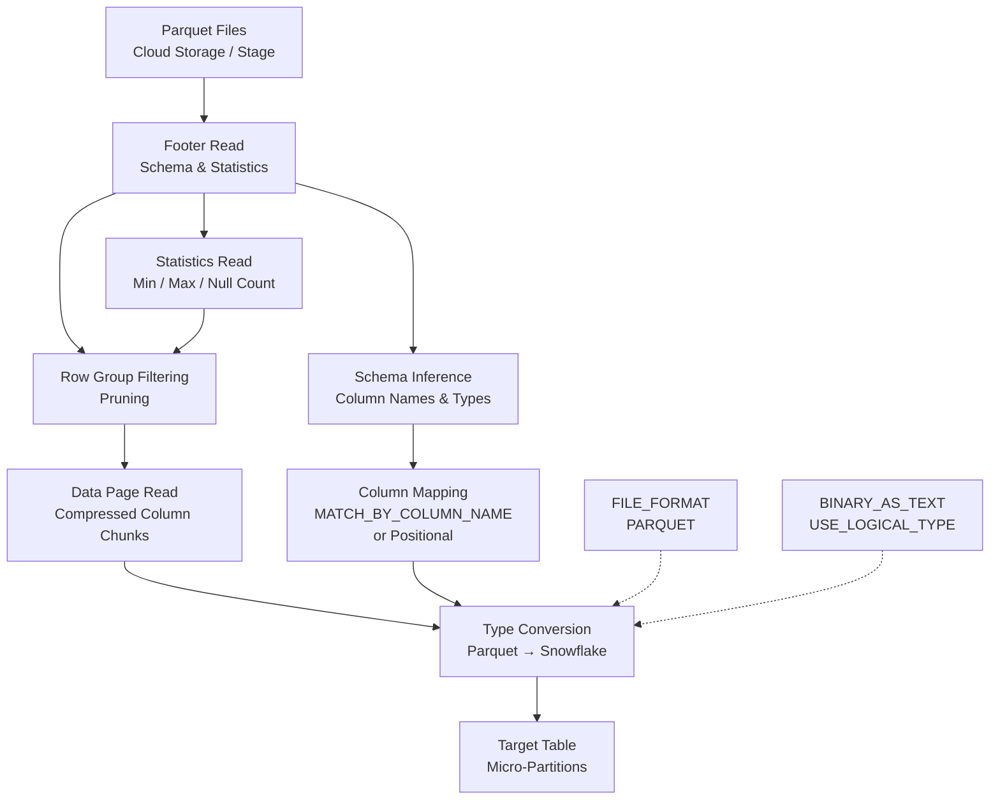

# 1. Parquet File Format in Snowflake

# 2. Overview

Parquet is a columnar storage format optimized for analytics workloads. Snowflake natively reads and writes Parquet files with high performance due to format alignment: both Snowflake and Parquet store data in compressed columnar structures with embedded type metadata and statistics. Parquet ingestion bypasses much of the parsing overhead required for CSV and JSON, delivering faster loads, automatic type inference, and preservation of nested structures via the `VARIANT` type.

Snowflake supports Parquet through:
- **`COPY INTO`** for bulk loading with automatic or explicit column mapping
- **External tables** for schema-on-read over Parquet files in cloud storage
- **Named file formats** with `TYPE = 'PARQUET'` controlling binary encoding, compression, and type mapping behavior
- **Semi-structured loading** where complex nested Parquet types map to `VARIANT`, `ARRAY`, and `OBJECT`

Parquet exists in Snowflake pipelines to:
- Eliminate parse-time type coercion and delimiter handling
- Reduce file size via native compression and columnar encoding
- Preserve rich type information (INT96 timestamps, DECIMAL precision, nested groups)
- Enable partition pruning via Hive-style directory structures and Parquet metadata statistics

The intended consumers are data engineers ingesting from data lakes, platform architects optimizing bulk loads, and SnowPro Advanced exam candidates who must understand Parquet-specific `FILE_FORMAT` parameters, type coercion rules, `MATCH_BY_COLUMN_NAME` semantics, `BINARY_AS_TEXT` behavior, and the interaction between Parquet statistics and micro-partition pruning.

# 3. SQL Object Summary

| Object/Feature | Type | Purpose | Source Objects or Inputs | Output Object or Observable Behavior | Execution Mode or Invocation Method |
|---|---|---|---|---|---|
| FILE_FORMAT (PARQUET) | Schema object | Parquet parsing configuration | Parquet-specific parameters | Reusable format definition | `CREATE FILE FORMAT` |
| COPY INTO | DML command | Bulk Parquet load | Stage files + target table + FILE_FORMAT | Loaded rows, error files, load history | Manual SQL, task, or pipe |
| MATCH_BY_COLUMN_NAME | COPY option | Column mapping by name | Target table columns, Parquet field names | Columns mapped by name rather than position | `COPY INTO` clause |
| EXTERNAL TABLE | Schema object | Schema-on-read over Parquet | Cloud storage + FILE_FORMAT | Queryable Parquet rows | DDL creation |
| Pipe | Schema object | Automated Parquet ingestion | Cloud storage events + FILE_FORMAT | Loaded rows | Snowpipe serverless |
| $1, $2, $3... | Metadata columns | Positional column access | Parquet fields by ordinal | VARIANT or typed values | `COPY INTO` or `SELECT` |
| METADATA$FILENAME | Metadata column | Source file path | Parquet file | File path string | Automatic in COPY |
| METADATA$FILE_ROW_NUMBER | Metadata column | Source row position | Parquet file | Row number integer | Automatic in COPY |
| VALIDATION_MODE | COPY option | Pre-validate without loading | Stage files + FILE_FORMAT | Error report | `COPY INTO` option |

# 4. Architecture

Parquet ingestion leverages the Parquet file footer, which contains row group metadata, column statistics (min/max, null counts), and schema definitions. Snowflake reads the footer to infer types, map columns, and apply partition pruning. Data pages are read in compressed column chunks and converted to Snowflake's internal micro-partition format.

# 5. Data Flow / Process Flow

## Step 1: Footer Inspection
- **Input:** Parquet file from stage
- **Transformation:** Engine reads file footer to extract schema (column names, types, nullability), row group boundaries, and column statistics
- **Output:** Parsed schema metadata; statistics for pruning
- **Purpose:** Understand file structure without reading all data pages

## Step 2: Schema Inference and Mapping
- **Input:** Parquet schema, target table schema, `FILE_FORMAT` parameters
- **Transformation:** Columns mapped by ordinal (`$1`, `$2`) or by name (`MATCH_BY_COLUMN_NAME`); Parquet logical types mapped to Snowflake types
- **Output:** Bound column mapping
- **Purpose:** Align source columns to target schema

## Step 3: Row Group Pruning
- **Input:** Query predicates or load filters, Parquet statistics
- **Transformation:** Row groups with statistics outside filter range are skipped
- **Output:** Reduced set of row groups to read
- **Purpose:** Minimize I/O for external table queries

## Step 4: Data Page Decompression
- **Input:** Compressed column chunks (SNAPPY, GZIP, LZO, ZSTD, BROTLI, LZ4, NONE)
- **Transformation:** Pages decompressed using codec specified in Parquet metadata
- **Output:** Raw column values
- **Purpose:** Prepare encoded data for conversion

## Step 5: Type Conversion
- **Input:** Parquet physical and logical types
- **Transformation:** INT32/INT64 → NUMBER; FLOAT/DOUBLE → FLOAT; BYTE_ARRAY → VARCHAR/BINARY; INT96 → TIMESTAMP_NTZ; DECIMAL → NUMBER with precision/scale; nested groups → VARIANT/ARRAY/OBJECT
- **Output:** Snowflake-native typed values
- **Purpose:** Semantic alignment to target schema

## Step 6: Load and Metadata Injection
- **Input:** Converted rows
- **Transformation:** Rows inserted into target table; `METADATA$FILENAME` and `METADATA$FILE_ROW_NUMBER` available if requested
- **Output:** Committed rows in micro-partitions
- **Purpose:** Persist data

# 6. Logical Breakdown

## Component: Parquet Footer Reader
- **Responsibility:** Extract schema, statistics, and row group metadata
- **Inputs:** Parquet file bytes
- **Outputs:** Column descriptors, statistics objects, compression codecs
- **Dependencies:** Valid Parquet footer; file not truncated
- **Failure Modes:** Corrupted footer aborts file read; schema evolution (renamed columns) breaks name-based mapping

## Component: Schema Mapper
- **Responsibility:** Map Parquet columns to Snowflake columns
- **Inputs:** Parquet schema, target table DDL, `MATCH_BY_COLUMN_NAME` flag
- **Outputs:** Column binding list
- **Dependencies:** Name matching is case-sensitive by default; ordinal mapping uses `$N` notation
- **Failure Modes:** Missing columns raise error unless `ON_ERROR` permits continuation; type mismatches cause coercion errors

## Component: Statistics Evaluator
- **Responsibility:** Use min/max statistics for pruning
- **Inputs:** Query predicates, Parquet column statistics
- **Outputs:** Boolean skip/include per row group
- **Dependencies:** Statistics must be present in file (not all writers emit statistics)
- **Failure Modes:** No statistics disables pruning; reads all row groups

## Component: Type Converter
- **Responsibility:** Convert Parquet types to Snowflake types
- **Inputs:** Parquet physical type, logical type, converted type
- **Outputs:** Snowflake typed values
- **Dependencies:** `USE_LOGICAL_TYPE` setting; `BINARY_AS_TEXT` setting
- **Failure Modes:** Unsupported logical types fall back to physical type representation; INT96 timestamps may have nanosecond precision truncated

## Component: Decompressor
- **Responsibility:** Decompress column chunks
- **Inputs:** Compressed pages, codec identifier from footer
- **Outputs:** Decompressed values
- **Dependencies:** Codec must be supported (SNAPPY, GZIP, LZO, ZSTD, BROTLI, LZ4, NONE)
- **Failure Modes:** Corrupted pages raise decompression errors; unsupported codecs abort load

## Component: Nested Structure Handler
- **Responsibility:** Convert Parquet nested groups to semi-structured types
- **Inputs:** Group types, repeated fields
- **Outputs:** `VARIANT`, `ARRAY`, `OBJECT`
- **Dependencies:** `FILE_FORMAT` settings for semi-structured handling
- **Failure Modes:** Deeply nested structures may exceed `VARIANT` size limits (16MB)

## Component: Metadata Injector
- **Responsibility:** Provide source file metadata
- **Inputs:** Parquet file path, row position
- **Outputs:** `METADATA$FILENAME`, `METADATA$FILE_ROW_NUMBER`
- **Dependencies:** Requested in `COPY INTO` column list
- **Failure Modes:** None

# 7. Data Model

## FILE_FORMAT (PARQUET) Configuration

| Parameter | Role | Default | Exam Relevance |
|---|---|---|---|
| `TYPE` | Format type | `PARQUET` | Required |
| `COMPRESSION` | Decompression hint | `AUTO` | Auto-detects from footer |
| `SNAPPY_COMPRESSION` | Legacy parameter | N/A | Deprecated; use `COMPRESSION` |
| `BINARY_AS_TEXT` | BYTE_ARRAY handling | `TRUE` | `TRUE` = VARCHAR; `FALSE` = BINARY |
| `USE_LOGICAL_TYPE` | Logical type respect | `TRUE` | `TRUE` uses logical types; `FALSE` uses physical only |
| `TRIM_SPACE` | Whitespace trim | `FALSE` | Applied to string fields |
| `NULL_IF` | Null indicators | `['\\N', 'NULL']` | Applied after string extraction |
| `DATE_FORMAT` | Date parsing | `AUTO` | For string-to-date conversions |
| `TIME_FORMAT` | Time parsing | `AUTO` | For string-to-time conversions |
| `TIMESTAMP_FORMAT` | Timestamp parsing | `AUTO` | For string-to-timestamp conversions |

## Parquet-to-Snowflake Type Mapping

| Parquet Physical Type | Parquet Logical Type | Snowflake Type | Notes |
|---|---|---|---|
| `BOOLEAN` | — | `BOOLEAN` | Direct |
| `INT32` | `INT_8`, `INT_16`, `INT_32` | `NUMBER` | |
| `INT32` | `DATE` | `DATE` | Days since epoch |
| `INT32` | `DECIMAL(p,s)` | `NUMBER(p,s)` | |
| `INT64` | `INT_64` | `NUMBER` | |
| `INT64` | `DECIMAL(p,s)` | `NUMBER(p,s)` | |
| `INT64` | `TIMESTAMP_MILLIS` | `TIMESTAMP_NTZ` | |
| `INT64` | `TIMESTAMP_MICROS` | `TIMESTAMP_NTZ` | |
| `INT96` | — | `TIMESTAMP_NTZ` | Nanoseconds; may truncate |
| `FLOAT` | — | `FLOAT` | |
| `DOUBLE` | — | `FLOAT` | |
| `BYTE_ARRAY` | `UTF8` | `VARCHAR` | Text |
| `BYTE_ARRAY` | — | `VARCHAR` or `BINARY` | Depends on `BINARY_AS_TEXT` |
| `BYTE_ARRAY` | `JSON` | `VARIANT` | |
| `FIXED_LEN_BYTE_ARRAY` | `DECIMAL(p,s)` | `NUMBER(p,s)` | |
| `FIXED_LEN_BYTE_ARRAY` | — | `BINARY` | |
| `Group` | `LIST` | `ARRAY` | Nested |
| `Group` | `MAP` | `OBJECT` | Key-value |
| `Group` | — | `VARIANT` | Generic nested |

## Load Result (COPY INTO)

| Column | Role | Grain | Notes |
|---|---|---|---|
| `FILE_NAME` | Source | One per file | Stage path |
| `ROW_COUNT` | Loaded | One per file | Successfully loaded |
| `ROW_PARSED` | Parsed | One per file | Total rows parsed |
| `ERROR_COUNT` | Rejected | One per file | Rows with errors |

## Grain
One row per file per load operation.

# 8. Business Logic

## Automatic Type Inference
- Parquet files embed schema metadata; Snowflake reads types from the footer
- `USE_LOGICAL_TYPE = TRUE` (default) respects logical annotations (e.g., `DATE`, `DECIMAL`, `TIMESTAMP_MILLIS`)
- `USE_LOGICAL_TYPE = FALSE` ignores logical types, using only physical types (all integers become `NUMBER`, strings become `VARCHAR`)
- For external tables, column types are inferred from Parquet schema unless explicitly overridden

## Column Mapping Modes
- **Positional (default):** `COPY INTO t ($1, $2, $3)` maps Parquet columns 1, 2, 3 to target columns by position
- **Name-based:** `COPY INTO t MATCH_BY_COLUMN_NAME` maps Parquet fields to target columns by matching field names
- Name matching is case-sensitive
- `MATCH_BY_COLUMN_NAME` ignores column order; useful when Parquet schema evolves or differs from target DDL

## BINARY_AS_TEXT Semantics
- `BINARY_AS_TEXT = TRUE` (default): Parquet `BYTE_ARRAY` fields without UTF8 annotation load as `VARCHAR`
- `BINARY_AS_TEXT = FALSE`: Parquet `BYTE_ARRAY` fields load as `BINARY`
- **Exam trap:** Binary data (images, protobuf) loaded with `BINARY_AS_TEXT = TRUE` becomes garbled text; set to `FALSE` for true binary payloads

## INT96 Timestamp Handling
- Parquet `INT96` stores nanosecond timestamps (legacy from Impala)
- Snowflake converts to `TIMESTAMP_NTZ`; nanosecond precision may be truncated to microseconds
- Modern Parquet writers should use `TIMESTAMP_MILLIS` or `TIMESTAMP_MICROS` logical types instead

## DECIMAL Precision
- Parquet `DECIMAL` logical type with `INT32`, `INT64`, or `FIXED_LEN_BYTE_ARRAY` physical type maps to Snowflake `NUMBER(p,s)`
- Precision and scale are preserved from Parquet metadata
- Overflow beyond Snowflake's maximum precision (38) may truncate or raise errors

## Nested Type Handling
- Parquet `LIST` logical type maps to Snowflake `ARRAY`
- Parquet `MAP` logical type maps to Snowflake `OBJECT`
- Unannotated nested groups map to `VARIANT`
- Deep nesting is supported but subject to `VARIANT` 16MB size limit per value

## Compression Support
- Supported codecs: SNAPPY, GZIP, LZO, ZSTD, BROTLI, LZ4, NONE
- `COMPRESSION = AUTO` reads codec from Parquet footer
- SNAPPY is most common in Parquet; Snowflake decompresses natively

## Partition Pruning
- External tables over Hive-partitioned Parquet directories benefit from partition pruning on directory path predicates
- Parquet footer statistics enable row group pruning for column predicates
- Pruning effectiveness depends on writer emitting accurate statistics

## Metadata Columns
- `METADATA$FILENAME`: Source file path
- `METADATA$FILE_ROW_NUMBER`: Row position within file
- Available in `COPY INTO` by including in column list
- Useful for audit and lineage

## Semi-Structured Loading
- Parquet with complex nested schemas can be loaded into a single `VARIANT` column
- `COPY INTO t (raw_variant) FROM @stage FILE_FORMAT = (TYPE = 'PARQUET')`
- Each row becomes a `VARIANT` object with field names as keys

## Schema Evolution
- Parquet supports schema evolution (adding columns, changing types)
- Positional mapping breaks when columns are reordered
- `MATCH_BY_COLUMN_NAME` is resilient to column additions and reordering
- Type changes may still cause coercion errors

## Null Handling
- Parquet nulls are encoded via definition levels; Snowflake respects Parquet nullability
- `NULL_IF` is applied after type conversion for string fields
- Parquet statistics track null counts per row group

# 9. Transformations

## Parquet Footer to Schema Metadata
- **Source:** Parquet file footer bytes
- **Output:** Column names, types, nullability, compression codecs
- **Logic:** Footer parser reads Thrift-encoded metadata
- **Meaning:** Self-describing file structure
- **Impact:** Enables automatic schema inference without external DDL

## Parquet Column Chunk to Snowflake Column
- **Source:** Compressed column pages
- **Output:** Typed Snowflake values
- **Logic:** Decompression + decoding + type conversion
- **Meaning:** Format translation
- **Impact:** Eliminates string parsing overhead of CSV/JSON

## Parquet Statistics to Pruning Decision
- **Source:** Column min/max/null counts per row group
- **Output:** Skip/include boolean per row group
- **Logic:** Predicate evaluation against statistics
- **Meaning:** I/O reduction
- **Impact:** Faster external table queries on large Parquet datasets

## Nested Parquet Group to VARIANT
- **Source:** Parquet repeated/optional groups
- **Output:** Snowflake `VARIANT`, `ARRAY`, or `OBJECT`
- **Logic:** Group structure mapped to JSON-like nested representation
- **Meaning:** Schema flexibility preservation
- **Impact:** Enables loading complex nested data without flattening

## Parquet File to Micro-Partition
- **Source:** Row groups from Parquet files
- **Output:** Snowflake micro-partitions in target table
- **Logic:** Columnar data reorganized into Snowflake's storage format
- **Meaning:** Native storage conversion
- **Impact:** Enables Snowflake optimizations (pruning, clustering) on loaded data

# 10. Parameters / Variables / Configuration

| Name | Type | Purpose | Allowed Values | Default | Where Used | Effect |
|---|---|---|---|---|---|---|
| `TYPE` | FILE_FORMAT | Format type | `PARQUET` | Required | `CREATE FILE FORMAT` | Selects Parquet parser |
| `COMPRESSION` | FILE_FORMAT | Decompression | `AUTO`, `SNAPPY`, `GZIP`, `LZO`, `ZSTD`, `BROTLI`, `LZ4`, `NONE` | `AUTO` | `CREATE FILE FORMAT` | Codec selection |
| `BINARY_AS_TEXT` | FILE_FORMAT | BYTE_ARRAY handling | `TRUE`, `FALSE` | `TRUE` | `CREATE FILE FORMAT` | `TRUE` = VARCHAR; `FALSE` = BINARY |
| `USE_LOGICAL_TYPE` | FILE_FORMAT | Type semantics | `TRUE`, `FALSE` | `TRUE` | `CREATE FILE FORMAT` | Respects logical annotations |
| `TRIM_SPACE` | FILE_FORMAT | Whitespace trim | `TRUE`, `FALSE` | `FALSE` | `CREATE FILE FORMAT` | Trims strings |
| `NULL_IF` | FILE_FORMAT | Null values | List of strings | `['\\N', 'NULL']` | `CREATE FILE FORMAT` | Post-conversion null handling |
| `MATCH_BY_COLUMN_NAME` | COPY option | Name mapping | Implicit keyword | None | `COPY INTO` | Maps by field name |
| `ON_ERROR` | COPY option | Error handling | `ABORT_STATEMENT`, `SKIP_FILE`, `CONTINUE` | `ABORT_STATEMENT` | `COPY INTO` | Load behavior |
| `VALIDATION_MODE` | COPY option | Pre-validation | `RETURN_N_ROWS`, `RETURN_ALL_ERRORS` | None | `COPY INTO` | No persistence |
| `FORCE` | COPY option | Override dedup | `TRUE`, `FALSE` | `FALSE` | `COPY INTO` | Reloads loaded files |
| `METADATA$FILENAME` | Metadata column | Audit | String | Auto | `COPY INTO` | Source file path |
| `METADATA$FILE_ROW_NUMBER` | Metadata column | Audit | Number | Auto | `COPY INTO` | Source row position |

# 11. APIs / Interfaces

## Interface: CREATE FILE FORMAT (PARQUET)
- **Invocation:** `CREATE FILE FORMAT parquet_format TYPE = 'PARQUET' USE_LOGICAL_TYPE = TRUE BINARY_AS_TEXT = FALSE`
- **Input:** Format parameters
- **Output:** Reusable FILE_FORMAT object
- **Error Behavior:** Fails on invalid parameter combinations
- **Consumers:** COPY INTO, external tables, pipes

## Interface: COPY INTO with Positional Mapping
- **Invocation:** `COPY INTO target (col1, col2, col3) FROM @stage FILE_FORMAT = parquet_format`
- **Input:** Stage files, format, target columns by position
- **Output:** Loaded rows
- **Error Behavior:** Type mismatch or column count mismatch raises error
- **Consumers:** ETL pipelines with fixed schemas

## Interface: COPY INTO with MATCH_BY_COLUMN_NAME
- **Invocation:** `COPY INTO target FROM @stage FILE_FORMAT = parquet_format MATCH_BY_COLUMN_NAME`
- **Input:** Stage files, format, target table
- **Output:** Loaded rows mapped by field name
- **Error Behavior:** Unmatched columns raise error unless `ON_ERROR` permits
- **Consumers:** Schema-evolving sources, data lake ingestion

## Interface: COPY INTO VARIANT
- **Invocation:** `COPY INTO target (raw_col) FROM @stage FILE_FORMAT = parquet_format`
- **Input:** Stage files
- **Output:** VARIANT rows representing Parquet records
- **Error Behavior:** None for standard Parquet
- **Consumers:** Flexible schema loading, exploration

## Interface: SELECT $1, $2 FROM @stage
- **Invocation:** `SELECT $1, $2 FROM @stage/file.parquet FILE_FORMAT = parquet_format LIMIT 10`
- **Input:** Parquet file, format
- **Output:** Raw parsed rows as VARIANT
- **Error Behavior:** Parse errors visible directly
- **Consumers:** File preview, schema discovery

## Interface: CREATE EXTERNAL TABLE (PARQUET)
- **Invocation:** `CREATE EXTERNAL TABLE ext (col1 VARCHAR, col2 NUMBER) LOCATION = @stage FILE_FORMAT = parquet_format`
- **Input:** Column schema (optional), stage, format
- **Output:** External table over Parquet files
- **Error Behavior:** Query-time type mismatch
- **Consumers:** Data lake querying, schema-on-read

## Interface: VALIDATION_MODE
- **Invocation:** `COPY INTO target FROM @stage FILE_FORMAT = parquet_format VALIDATION_MODE = 'RETURN_ALL_ERRORS'`
- **Input:** Stage files
- **Output:** Error report
- **Error Behavior:** Returns all errors without loading
- **Consumers:** Pre-load validation

# 12. Execution / Deployment

## Standard Parquet Load
- Create named file format with `TYPE = 'PARQUET'`
- Use `MATCH_BY_COLUMN_NAME` for data lake sources where schema may evolve
- Use positional mapping for tightly controlled pipelines
- Monitor `LOAD_HISTORY` for errors

## Binary Data Handling
- Set `BINARY_AS_TEXT = FALSE` when Parquet contains true binary data (images, protobuf, Avro binary)
- Default `TRUE` treats all BYTE_ARRAY as UTF8 text, corrupting binary payloads

## Nested Parquet Loading
- Load complex nested Parquet into `VARIANT` column for flexibility
- Use `FLATTEN` and dot notation to extract nested fields in SQL
- Consider flattening at load time for frequently accessed nested paths

## External Table over Parquet
- Define external tables over Hive-partitioned Parquet directories
- Partition columns derived from directory structure
- Leverage Parquet statistics for row group pruning
- Refresh external table metadata when files change

## Schema Evolution Handling
- Use `MATCH_BY_COLUMN_NAME` to handle added columns gracefully
- New columns in Parquet not in target table are ignored
- Missing columns in Parquet load as NULL in target table
- Type changes require explicit handling (staging table + transformation)

## Compression Optimization
- Prefer SNAPPY-compressed Parquet for balanced compression/decompression speed
- Use ZSTD for higher compression at cost of CPU
- Avoid uncompressed Parquet for large datasets

## Environment Behavior
- Development: Frequent `SELECT $1, $2` previews, `VALIDATION_MODE` testing, schema discovery
- Production: Named formats locked per source, `MATCH_BY_COLUMN_NAME` for flexibility, metadata column tracking for lineage

# 13. Observability

## Load Performance
- Monitor `LOAD_HISTORY` for Parquet load duration vs. CSV/JSON equivalents
- Parquet should show significantly lower parse time and higher throughput
- Track bytes scanned vs. rows loaded ratio

## Type Coercion Tracking
- Monitor for implicit type conversions that lose precision (INT96 truncation, FLOAT to NUMBER)
- Validate DECIMAL precision preservation from Parquet metadata

## Schema Drift Detection
- Compare Parquet footer schema to target table DDL periodically
- Alert on new columns, removed columns, or type changes
- Use `INFORMATION_SCHEMA` and `SHOW COLUMNS` for comparison

## External Table Pruning
- Monitor query profiles for row group pruning effectiveness
- Check if predicates push down to Parquet statistics
- Track full-file scans indicating missing statistics

## Compression Ratio
- Compare Parquet file sizes to loaded table sizes
- Monitor decompression overhead in query profiles

## Key Metrics
- Load duration per GB for Parquet vs. other formats
- Schema evolution events (column additions/removals)
- Row group pruning ratio (skipped / total)
- Type coercion failure rate
- Binary corruption rate (indicator of `BINARY_AS_TEXT` misconfiguration)

# 14. Failure Handling & Recovery

## Schema Mismatch (Positional)
- **What breaks:** Parquet columns reordered; positional mapping loads wrong data
- **Detection:** Data type errors or anomalous values in target columns
- **Fallback:** Switch to `MATCH_BY_COLUMN_NAME`
- **Recovery:** Reload with name-based mapping; validate column alignment

## BINARY_AS_TEXT Corruption
- **What breaks:** Binary BYTE_ARRAY loaded as garbled VARCHAR
- **Detection:** Invalid UTF8 sequences; unexpected characters in string columns
- **Fallback:** Set `BINARY_AS_TEXT = FALSE`
- **Recovery:** Truncate and reload affected files; or reload to BINARY column

## Missing Statistics (Pruning Disabled)
- **What breaks:** External table queries scan all row groups despite predicates
- **Detection:** Query profile shows no row group filtering; high bytes scanned
- **Fallback:** None within Snowflake; rewrite files with statistics
- **Recovery:** Regenerate Parquet files with writer statistics enabled

## INT96 Timestamp Truncation
- **What breaks:** Nanosecond precision lost in INT96 conversion
- **Detection:** Sub-microsecond values rounded or zeroed
- **Fallback:** Accept microsecond precision; or extract raw INT96 as BINARY
- **Recovery:** Rewrite Parquet with TIMESTAMP_MICROS logical type

## Unsupported Logical Type
- **What breaks:** Parquet file uses logical type not recognized by Snowflake
- **Detection:** Values load as physical type (e.g., raw bytes instead of UUID)
- **Fallback:** Load as VARCHAR/BINARY and parse in SQL
- **Recovery:** Transform upstream to standard logical types

## Corrupted Parquet Footer
- **What breaks:** Truncated or invalid footer prevents file reading
- **Detection:** `Invalid Parquet file` error
- **Fallback:** Skip file with `ON_ERROR = 'SKIP_FILE'`
- **Recovery:** Re-generate or re-upload file from source

## Nested Structure Too Deep
- **What breaks:** Deeply nested Parquet exceeds VARIANT size limit
- **Detection:** `VARIANT size exceeds limit` error
- **Fallback:** Extract specific nested paths rather than loading entire structure
- **Recovery:** Flatten nested structure upstream; or load to multiple relational columns

## Decimal Precision Overflow
- **What breaks:** Parquet DECIMAL precision > 38
- **Detection:** Numeric overflow or truncation
- **Fallback:** Load as VARCHAR and handle in SQL
- **Recovery:** Adjust upstream writer precision; or use string representation

# 15. Security & Access Control

## Privilege Requirements

| Action | Required Privilege | Object |
|---|---|---|
| Create file format | `CREATE FILE FORMAT` on schema | Schema |
| Use file format | `USAGE` on file format | File format |
| Load Parquet | `INSERT` on table, `READ` on stage | Table/Stage |
| Query external table | `SELECT` on external table | External table |

## Data Exposure
- Parquet files in stages may contain sensitive data
- Restrict stage access; encrypt at rest in cloud storage
- Parquet footer statistics (min/max) may leak value ranges; consider for sensitive columns

## Secure File Handling
- Use storage integrations for external stages
- Rotate credentials per security policy
- Apply network policies

# 16. Performance / Scalability Considerations

## Columnar Format Advantage
- Parquet is significantly faster than CSV/JSON for equivalent data
- No string parsing, delimiter scanning, or quote handling
- Type metadata eliminates runtime inference

## Compression Efficiency
- Columnar compression (dictionary, RLE, delta) typically achieves better ratios than row-based formats
- SNAPPY balances speed and compression; ZSTD achieves higher compression

## Parallel Loading
- Parquet row groups are independently readable
- Snowflake parallelizes across row groups and files
- Optimal file size: 100MB-250MB uncompressed

## Statistics and Pruning
- Parquet footer statistics enable row group pruning for external tables
- Effectiveness depends on data sort order within files
- Sorted Parquet files (by frequently filtered columns) maximize pruning

## Type Conversion Cost
- Most Parquet-to-Snowflake type mappings are zero-copy or low-cost
- INT96 timestamps and complex nested types incur higher conversion cost
- DECIMAL with high precision requires careful handling

## External Table Performance
- External table queries over Parquet are faster than CSV but slower than native tables
- Repeated queries should materialize to native tables or use materialized views
- Partition pruning on Hive-style directories is critical for large datasets

## Micro-Partition Alignment
- Parquet columnar layout aligns well with Snowflake micro-partitions
- Load performance is optimized; minimal reorganization needed

## VARIANT Loading
- Loading Parquet into `VARIANT` adds serialization overhead
- Prefer direct column mapping when schema is known and stable

# 17. Assumptions & Constraints

## Explicit Assumptions
- The reader is ingesting Parquet from data lakes, Spark outputs, or Hive exports
- Parquet files are well-formed with valid footers
- Schema is either stable or changes in backward-compatible ways

## Engine Boundaries
- Maximum `VARIANT` size: 16MB per value (applies to nested structures)
- `BINARY_AS_TEXT = TRUE` treats all BYTE_ARRAY as UTF8; binary data corrupts
- INT96 timestamps may lose nanosecond precision
- DECIMAL precision limited to 38 in Snowflake
- No native Parquet writer from Snowflake (export via `COPY INTO @stage FILE_FORMAT = PARQUET` is supported)
- `MATCH_BY_COLUMN_NAME` is case-sensitive
- Parquet statistics pruning requires statistics to be written by producer
- Some legacy Parquet logical types may not be fully supported

## Exam-Relevant Defaults
- `BINARY_AS_TEXT` default: `TRUE`
- `USE_LOGICAL_TYPE` default: `TRUE`
- `COMPRESSION` default: `AUTO`
- `TYPE` must be explicitly `PARQUET`
- Column mapping default: positional (`$1`, `$2`)
- `MATCH_BY_COLUMN_NAME` must be explicitly specified for name-based mapping

## Ambiguities
- Exact behavior when Parquet schema contains duplicate column names is not fully deterministic
- INT96 timezone handling assumes UTC if no timezone annotation present
- Parquet files with encrypted column chunks are not supported

# 18. Future Enhancements

- Implement `MATCH_BY_COLUMN_NAME` as the default mapping strategy for all data lake Parquet loads to improve resilience against schema evolution
- Set `BINARY_AS_TEXT = FALSE` explicitly in all file formats handling binary Parquet sources to prevent silent data corruption
- Add pre-load validation tasks that inspect Parquet footers for schema compatibility before executing `COPY INTO`
- Materialize frequently queried external Parquet tables into native tables with clustering keys for improved query performance
- Standardize on TIMESTAMP_MICROS logical type in upstream Parquet writers to eliminate INT96 precision loss
- Implement schema drift detection procedures comparing Parquet footer schemas to target table DDL using `INFORMATION_SCHEMA`
- Use `VALIDATION_MODE = 'RETURN_N_ROWS'` to sample Parquet files from new sources before production load
- Partition Parquet files in Hive-style directories and define external tables with partition columns for optimal pruning
- Monitor Parquet load performance in `LOAD_HISTORY` and compare to CSV baselines to justify upstream format migration
- Extract nested Parquet structures into relational columns at load time rather than loading into `VARIANT` for frequently accessed analytical paths
