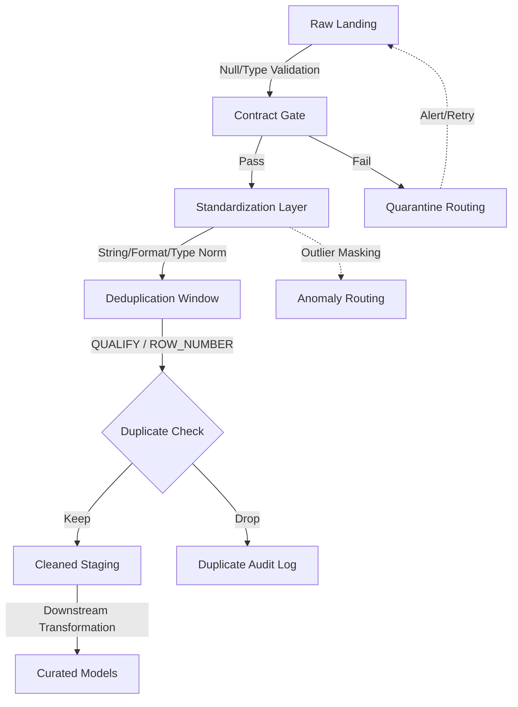

# Data Cleaning

# 1. Title
SnowPro Advanced: Data Cleaning & Standardization Architecture

# 2. Overview
- **What it does**: Defines the deterministic pipeline for resolving nulls, standardizing formats, removing duplicates, masking anomalies, and enforcing data contracts before downstream transformation.
- **Why it exists**: Raw ingestion produces inconsistent casing, malformed types, hidden duplicates, and out-of-bound values. Without explicit cleaning gates, downstream joins explode, aggregations skew, and business logic operates on corrupted inputs. Cleaning isolates variance, enforces idempotency, and creates auditable staging boundaries.
- **Where it fits**: Operates between raw landing tables and curated transformation layers. Acts as a quality gate that standardizes inputs, quarantines failures, and emits deterministic outputs for modeling and analytics.
- **Intended consumer**: Data engineers, analytics engineers, data quality teams, platform architects, and SnowPro Advanced candidates evaluating standardization patterns, deduplication mechanics, regex performance, null propagation, and idempotent transformation design.

# 3. SQL Object Summary
| Field | Value |
|-------|-------|
| Object Scope | Data Cleaning & Standardization Pipeline |
| Type | Validation + Standardization CTEs + Deduplication Windows + Quarantine Routing |
| Purpose | Resolve ambiguity, enforce contracts, remove duplicates, isolate anomalies, produce deterministic staging |
| Source Objects | Raw landing tables, external feeds, semi-structured payloads, provider shares |
| Output Object | Standardized staging tables, quarantine error logs, cleaning audit metrics, curated-ready datasets |
| Execution Mode | Batch (`MERGE`/`INSERT SELECT`), Incremental (`STREAM` + `TASK`), Idempotent (hash-keyed upsert) |

# 4. Architecture
Cleaning is a staged filtering and transformation process. Raw data enters validation gates, passes through standardization logic, resolves duplicates via deterministic ordering, and routes anomalies to quarantine. The output is a contract-aligned staging table ready for transformation.

# 5. Data Flow / Process Flow
| Step | Input | Transformation | Output | Purpose |
|------|-------|----------------|--------|---------|
| 1. Null & Type Validation | Raw columns, expected types | `TRY_CAST`, `NULLIF`, `IS NULL` checks, format alignment | Validated flags, coerced types | Catch schema drift, prevent implicit cast failures downstream |
| 2. String & Format Standardization | Untrimmed strings, inconsistent casing, mixed delimiters | `TRIM`, `UPPER/LOWER`, `REGEXP_REPLACE`, `REPLACE`, `NULLIF` | Normalized text, unified separators | Eliminate join mismatches, enforce dictionary consistency |
| 3. Deduplication & Key Resolution | Validated rows, business keys, load timestamps | `ROW_NUMBER() OVER(PARTITION BY key ORDER BY priority DESC)`, `QUALIFY` | Single surviving record per key | Prevent double-counting, establish deterministic tie-breaking |
| 4. Outlier & Anomaly Handling | Numeric/temporal distributions, business thresholds | `PERCENTILE_CONT`, `Z-SCORE`, `CASE` boundary flags, `GREATEST/LEAST` clamping | Masked values, anomaly flags, routing metadata | Isolate statistical noise, preserve aggregation integrity |
| 5. Final Projection & Contract Enforcement | Cleaned rows, quarantine mappings | Column aliasing, default fallbacks, `COALESCE` chains, audit metadata | Contract-aligned staging table | Emit deterministic, query-ready dataset with traceable lineage |

# 6. Logical Breakdown of the SQL
| Component | Responsibility | Inputs | Outputs | Dependencies | Failure Modes / Risks |
|-----------|----------------|--------|---------|--------------|-----------------------|
| Null Resolution Logic | Handle missing/blank values | Raw columns, `NULLIF`, `COALESCE`, `IFNULL` | Standardized nulls or fallback defaults | Business rule mapping, default value availability | Blank strings treated as valid; `COALESCE` masks upstream data gaps |
| Type Coercion & Validation | Convert strings to target types safely | `TRY_CAST`, `TO_DATE`, `TO_NUMBER`, explicit formats | Casted values or null/error routing | Format parameter alignment, source consistency | `CAST` aborts on mismatch; `TRY_CAST` silently drops precision |
| String Normalization | Standardize text for joins/filters | `TRIM`, `UPPER`, `REGEXP_REPLACE`, `TRANSLATE` | Uniform casing, removed special chars, fixed spacing | Regex complexity, character encoding rules | Regex backtracking causes warehouse timeout; Unicode surrogates miscount |
| Deterministic Deduplication | Resolve duplicate business keys | Window function, priority rules, `QUALIFY` | Single row per key, discard log | Tiebreaker ordering, timezone alignment | Equal timestamps + missing priority = non-deterministic survivor |
| Outlier Detection & Routing | Flag/clamp statistical anomalies | Percentiles, standard deviation, business bounds | Flagged rows, clamped values, quarantine inserts | Historical baseline availability, threshold tuning | Small sample sizes skew percentiles; over-clamping hides real variance |
| Quarantine & Audit Routing | Isolate failed/anomalous records | Validation flags, error messages, source metadata | Quarantine table, audit metrics | Storage retention policy, alerting integration | Quarantine grows unbounded; lack of retention policy inflates storage cost |

# 7. Data Model
| Entity | Role | Important Fields | Grain | Relationships | Keys | Null Handling |
|--------|------|------------------|-------|---------------|------|---------------|
| `CLEANING_RULES` | Contract definition registry | `RULE_ID`, `COLUMN_NAME`, `EXPECTED_TYPE`, `NULL_POLICY`, `OUTLIER_THRESHOLD` | 1 row = 1 cleaning rule | Maps to `INFORMATION_SCHEMA.COLUMNS`, validation queries | `RULE_ID` | `NULL` if rule disabled or deprecated |
| `STAGING_CLEAN` | Standardized, deduplicated output | Business keys, normalized columns, cleaning flags, `LOAD_TS` | 1 row = 1 validated record per business key | Feeds curated models, joins to quarantine via `VALIDATION_STATUS` | Surrogate + business key | Explicit defaults applied; nulls preserved only if contract allows |
| `QUARANTINE_LOG` | Failed/anomalous record storage | `SOURCE_ROW`, `RULE_VIOLATED`, `ERROR_MESSAGE`, `FILENAME`, `INGEST_TS` | 1 row = 1 validation failure | References raw landing, triggers alerting pipelines | `QUARANTINE_ID` (surrogate) | `SOURCE_ROW` stores raw payload; nulls allowed for partial matches |
| `DEDUP_AUDIT` | Duplicate resolution tracking | `KEY_HASH`, `SURVIVOR_ROW_ID`, `DROPPED_ROW_ID`, `REASON`, `LOAD_TS` | 1 row = 1 resolved duplicate pair/group | Links to `STAGING_CLEAN`, supports reconciliation | `KEY_HASH` + `LOAD_TS` | `NULL` if single record (no duplicate) |

**Output Grain**: Explicitly 1:1 with business key at `STAGING_CLEAN`. Cleaning collapses raw N:1 duplicates into deterministic 1:1 records. Grain shifts if outliers are aggregated instead of quarantined.

# 8. Business Logic
| Rule | Effect | Implementation Pattern | Edge Case |
|------|--------|------------------------|-----------|
| **Null Policy Enforcement** | Controls missing value propagation | `NULLIF(TRIM(col), '')`, `COALESCE(col, 'UNKNOWN')` | Empty strings pass as valid; requires explicit `NULLIF` mapping |
| **String Standardization** | Eliminates join mismatches | `UPPER(REGEXP_REPLACE(col, '[^A-Z0-9]', '', 'g'))` | Over-aggressive regex strips valid special chars (e.g., `@`, `#`) |
| **Type Fallback Routing** | Prevents pipeline halts on bad casts | `TRY_CAST(col AS DATE)`, fallback to `NULL` or default | Silent null injection masks source corruption; requires null ratio guard |
| **Deterministic Tiebreaking** | Selects winner in duplicate collisions | `ORDER BY load_ts DESC, source_priority ASC, METADATA$FILE_ROW_NUMBER` | Identical priority + same timestamp = arbitrary survivor |
| **Outlier Clamping vs Quarantine** | Decides whether to cap or reject | `CASE WHEN val > p99 THEN p99 ELSE val END`, else `INSERT INTO quarantine` | Clamping hides real anomalies; quarantine inflates operational overhead |
| **Idempotent Cleaning** | Ensures reruns produce identical state | `MERGE` with `IS DISTINCT FROM`, hash-keyed staging | Missing `IS DISTINCT FROM` triggers unnecessary updates, bloats Time Travel |

# 9. Transformations
| Source | Derived | Formula / Rule | Business Meaning | Impact |
|--------|---------|----------------|------------------|--------|
| Raw mixed-case strings | Normalized identifiers | `UPPER(TRIM(REGEXP_REPLACE(col, '\\s+', ' ')))` | Standardized join keys, search compatibility | Eliminates case/whitespace mismatches; reduces `LIKE` full scans |
| Inconsistent date formats | Unified temporal type | `TRY_TO_DATE(col, 'YYYY-MM-DD')`, fallback to `NULL` | Global time alignment, audit compliance | Prevents `CAST` aborts; requires null ratio threshold monitoring |
| Numeric strings with symbols | Clean decimals | `TRY_CAST(REPLACE(REPLACE(col, ',', ''), '$', '') AS NUMBER(38,2))` | Financial/scientific precision standardization | Enables arithmetic operations; strips currency/formatting noise |
| Multiple duplicate rows | Single survivor record | `ROW_NUMBER() OVER(PARTITION BY key ORDER BY ts DESC) = 1` via `QUALIFY` | Prevents double-counting, establishes single source of truth | Reduces storage, stabilizes aggregations; non-deterministic ordering breaks idempotency |
| Out-of-bound metrics | Clamped/flagged values | `GREATEST(LEAST(val, max_val), min_val)`, `CASE WHEN ... THEN 'OUTLIER' END` | Preserves distribution shape while isolating noise | Protects downstream ML/model training; requires threshold tuning |

# 10. Parameters / Variables / Macros
| Name | Type | Purpose | Allowed Format | Default | Usage | Effect on Output |
|------|------|---------|----------------|---------|-------|------------------|
| `CLEANING_MODE` | Enum | Strictness level for validation | `STRICT`, `WARN`, `LENIENT` | `WARN` | Pipeline configuration | `STRICT` halts on violation, `LENIENT` coerces/defaults, `WARN` logs only |
| `NULL_SUBSTITUTE` | String | Fallback value for missing data | Valid column type value | `UNKNOWN` / `NULL` | `COALESCE` / `IFNULL` logic | Masks data gaps if overused; breaks analytical null semantics |
| `DEDUP_PRIORITY` | String | Tiebreaker column for duplicates | `TIMESTAMP`, `SOURCE_RANK`, `FILE_ORDER` | `LOAD_TS` | `QUALIFY` ordering clause | Determines which record survives collision; misalignment causes bias |
| `OUTLIER_THRESHOLD` | Float | Statistical bound for anomaly detection | Percentile (0.95–0.99), Z-score (2–3) | `0.99` | `PERCENTILE_CONT` / `STDDEV` logic | Low threshold quarantines valid edge cases; high threshold retains noise |
| `REGEXP_TIMEOUT_MS` | Integer | Max execution time for pattern matching | 0–30000 ms | `10000` | Session/Query parameter | Prevents warehouse hang on backtracking regex; aborts query if exceeded |
| `BATCH_SIZE` | Integer | Row chunking for heavy cleaning | 10K–1M rows | `100000` | `STREAM` / Task processing | Controls memory pressure during window dedup; large batches risk spill |

# 11. APIs / Interfaces
| Interface | Invocation Method | Input Structure | Output Structure | Error Behavior | Consumers |
|-----------|-------------------|-----------------|------------------|----------------|-----------|
| `TRY_CAST` / `CAST` / `NULLIF` | SQL | Expression, target type | Converted value or null/error | `TRY_CAST` returns null; `CAST` aborts statement | Type validation, standardization CTEs |
| `QUALIFY` + Window Functions | SQL | Partition/Order clauses, filter condition | Filtered result set pre-join | Syntax error if clause misplaced; memory spill on large partitions | Deterministic deduplication, top-N selection |
| `REGEXP_REPLACE` / `RLIKE` | SQL | String, pattern, replacement/flag | Cleaned string or boolean match | Timeout on catastrophic backtracking; returns original on failure | String normalization, pattern enforcement |
| `PERCENTILE_CONT` / `STDDEV` | SQL | Numeric column, partition/over | Aggregate threshold or distribution metric | Ignores nulls; fails on non-numeric input | Outlier detection, dynamic thresholding |
| `INFORMATION_SCHEMA.COLUMNS` | SQL | Table/schema filters | Type definitions, nullability | Returns empty if no access; requires `USAGE` | Contract validation, type drift detection |

# 12. Execution / Deployment
- **Manual vs Scheduled**: Cleaning runs inline with transformation pipelines. Often triggered by `TASK` schedules, dbt `run`, or manual `MERGE` execution.
- **Batch vs Incremental**: Initial loads use full validation + dedup. Subsequent runs use `STREAM` delta tracking, applying cleaning logic only to new/changed rows.
- **Orchestration**: CI/CD enforces cleaning rules via `dbt` tests (`not_null`, `unique`, `accepted_values`). Airflow/Dagster manage dependency ordering: Ingest -> Clean -> Dedup -> Validate -> Curate.
- **Upstream Dependencies**: Raw data quality, format parameter alignment, warehouse memory capacity, retention policies for quarantine tables.
- **Environment Behavior**: Dev/test use `LENIENT` mode, smaller batches, disabled quarantine routing. Prod enforces `STRICT`/`WARN`, full dedup, quarantines routed to alerting, strict `IS DISTINCT FROM` upserts.
- **Runtime Assumptions**: `QUALIFY` filters rows before projection, reducing memory vs outer `WHERE`. `TRY_CAST` never raises errors. Regex executes per row unless vectorized via Snowpark. Window dedup requires sort key alignment for deterministic results.

# 13. Observability
| Metric | Implementation | Detection Method | Operational Threshold |
|--------|----------------|------------------|------------------------|
| Null injection rate | `COUNT(*) WHERE cleaned_col IS NULL AND source_col IS NOT NULL / TOTAL` | Validation query per batch | >2% = upstream format drift or incorrect `TRY_CAST` usage |
| Duplicate resolution volume | `COUNT(*) FROM DEDUP_AUDIT WHERE LOAD_TS > NOW() - INTERVAL 1 DAY` | Quarantine/audit table query | Sudden spikes = source retry loop or idempotency break |
| Regex timeout frequency | `COUNT(*) WHERE ERROR_MESSAGE LIKE '%regex%' OR '%timeout%'` | `QUERY_HISTORY` parsing | >0 sustained = pattern needs simplification or indexing |
| Outlier quarantine ratio | `COUNT(quarantine.rows) / COUNT(staging.rows)` | Pipeline metrics dashboard | >5% = threshold misaligned or source system degradation |
| Cleaning latency drift | `AVG(TOTAL_ELAPSED_TIME)` for cleaning CTEs | Query profile, task history | >50% baseline increase = partition skew, warehouse contention, or data volume spike |

# 14. Failure Handling & Recovery
| Failure Scenario | What Breaks | Detection | Fallback Behavior | Recovery Approach |
|------------------|-------------|-----------|-------------------|-------------------|
| `CAST` type mismatch | Query aborts, transaction rolls back | Error log shows `Numeric value is not recognized` or similar | Pipeline halts; no partial load | Switch to `TRY_CAST`, add format validation, route failures to quarantine |
| Regex catastrophic backtracking | Warehouse hangs, query times out | `QUERY_HISTORY` shows `Execution timed out` or high `SPILLED_BYTES` | Query killed; stage remains uncleaned | Simplify pattern, add `REGEXP_TIMEOUT_MS`, pre-filter with `LIKE`, migrate to Snowpark |
| Non-deterministic dedup | Different survivor on rerun | Checksum drift, row count variance in `DEDUP_AUDIT` | Downstream aggregations shift | Add `METADATA$FILE_ROW_NUMBER` or secondary tiebreaker to `ORDER BY` |
| Quarantine table bloat | Storage costs spike, scan latency increases | `TABLE_STORAGE_METRICS` growth, long `COUNT(*)` | Cleaning pipeline slows due to metadata overhead | Implement `DELETE FROM quarantine WHERE RETENTION_DATE < CURRENT_DATE()`, archive to external stage |
| Idempotency break on rerun | Duplicate inserts, stale overwrites | `MERGE` update count > expected, row count inflation | Data state inconsistent | Add `IS DISTINCT FROM` to `WHEN MATCHED`, hash-key staging, enforce single-writer pattern |
| Null propagation to keys | Join explosions, orphaned records | `LEFT JOIN` produces `NULL` matches, metric drops | Business logic operates on incomplete sets | Enforce `COALESCE(key, 'UNKNOWN')` pre-join, add `NOT NULL` constraints on staging keys |

# 15. Security & Access Control
| Control | Implementation | Effect |
|---------|----------------|--------|
| PII masking during cleaning | `DYNAMIC DATA MASKING` applied to raw columns before cleaning logic | Prevents sensitive data exposure in transformation logs |
| Quarantine isolation | Separate schema, restricted `SELECT` grants, audit logging | Limits raw error payloads to data quality engineers |
| Role-based rule modification | `ALTER` privileges on `CLEANING_RULES` restricted to `DATA_STEWARDS` | Prevents unauthorized threshold changes that bias outputs |
| Regex/sandbox restrictions | Disable external UDF calls in cleaning functions, enforce Snowpark permissions | Blocks arbitrary network/file access during string parsing |
| Audit trail | `ACCESS_HISTORY` + `DEDUP_AUDIT` join | Tracks who modified cleaning rules, when, and impact on output grain |

# 16. Performance / Scalability Considerations
| Bottleneck | Cause | Tradeoff | Mitigation |
|------------|-------|----------|------------|
| Large window dedup | Unbounded `PARTITION BY` with high cardinality keys | Memory spill, warehouse timeout, long sort times | Push filters before `QUALIFY`, cluster staging on dedup keys, limit batch size |
| Regex overhead on wide tables | Per-row `REGEXP_REPLACE` on millions of strings | CPU-bound, disables predicate pushdown, high credit consumption | Pre-filter with `LIKE`/`ILIKE`, use `TRANSLATE` for simple swaps, vectorize via Snowpark |
| `TRY_CAST` null masking | Silent failures inflate downstream null handling | Additional `COALESCE` chains, query plan bloat | Validate null ratios early, fail pipeline if threshold exceeded, log source patterns |
| Late filtering in cleaning CTEs | Aggregating/outlier checks before narrowing row set | Unnecessary compute on discarded rows | Apply `WHERE` filters before window functions, use `QUALIFY` instead of outer `WHERE` |
| Quarantine scan bloat | `COUNT(*)` or joins on massive error tables | Metadata overhead, slow pipeline restarts | Partition quarantine by `INGEST_DATE`, archive old batches, use approximate counts |
| Non-sargable string functions | `WHERE UPPER(TRIM(col)) = 'VALUE'` | Disables pruning, forces full scan | Create computed column with clustering, normalize at ingest, avoid functions in predicates |

# 17. Assumptions & Constraints
- **No concrete SQL provided**: Documentation reflects canonical cleaning patterns for SnowPro Advanced. Exact behavior depends on source quality, regex complexity, window partitioning, and pipeline idempotency design.
- **Cleaning is not automatic**: Snowflake provides primitives (`TRY_CAST`, `REGEXP_*`, `QUALIFY`) but no built-in data quality engine. All rules, thresholds, and routing must be explicitly defined.
- **`QUALIFY` executes before projection**: Filters rows after window calculation but before final column emission. Reduces memory vs outer `WHERE` but still requires full partition evaluation.
- **`TRY_CAST` never raises errors**: Returns `NULL` on mismatch. Silent null injection is expected behavior; requires explicit null-ratio guarding.
- **Regex executes row-by-row unless vectorized**: Snowflake's SQL engine does not auto-vectorize string functions. Large-scale cleaning requires Snowpark Python/Java or pre-filtering.
- **Idempotency is manual**: Rerunning cleaning logic without `IS DISTINCT FROM` or hash-key staging triggers duplicate inserts and Time Travel bloat.
- **Exam trap assumptions**: SnowPro Advanced tests `TRY_CAST` vs `CAST` behavior, `QUALIFY` execution order, regex performance limits, deterministic dedup ordering, null propagation rules, quarantine isolation, and idempotent `MERGE` design. Memorize engine defaults and failure semantics.

# 18. Future Enhancements
- **Automate null-ratio thresholding**: Replace static `CLEANING_MODE` with dynamic alerts that adjust strictness based on historical source quality trends.
- **Vectorize string normalization via Snowpark**: Replace SQL `REGEXP_REPLACE` with batch-processed Pandas/Polars handlers. Reduces CPU overhead, enables parallel partition execution.
- **Implement hash-keyed staging contracts**: Enforce `MD5` surrogate keys with `IS DISTINCT FROM` upserts. Guarantees idempotency across reruns, eliminates duplicate audit drift.
- **Integrate external data quality engines**: Pipe quarantine logs to Great Expectations or Soda Core for rule management, versioning, and statistical drift detection.
- **Optimize quarantine lifecycle**: Automate archival to external storage after 30 days, apply zero-copy cloning for audit snapshots, enforce tiered retention.
- **Harden regex safety contracts**: Pre-validate patterns against backtracking risk limits, enforce `REGEXP_TIMEOUT_MS` globally, migrate complex parsers to compiled UDFs with explicit fallbacks.
