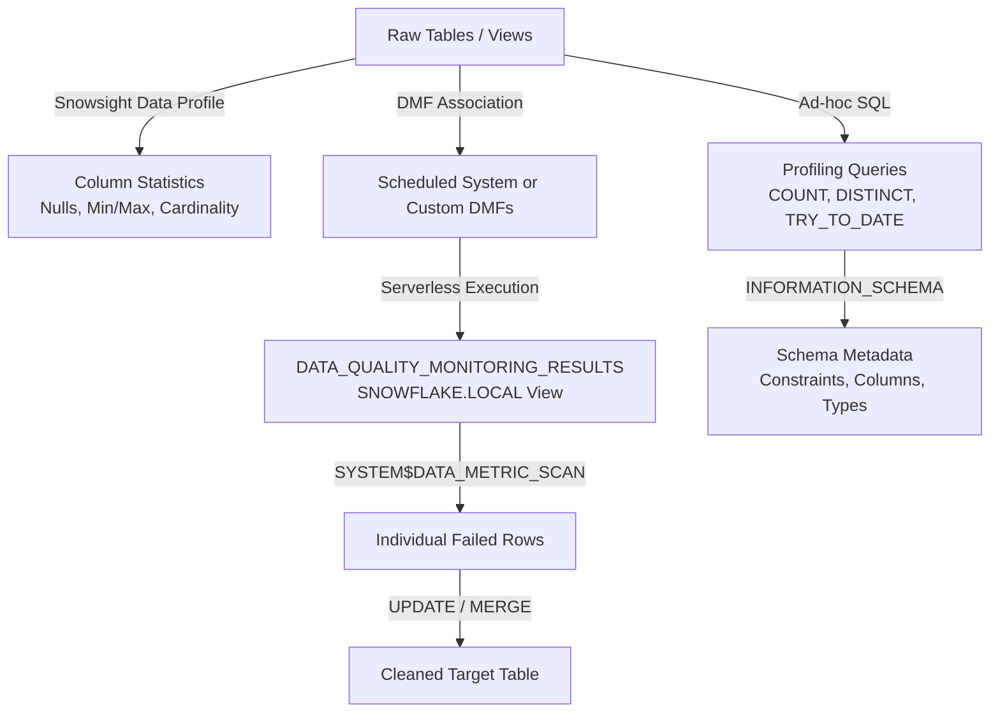

# 1. Identify and Analyze Data Quality Issues in Snowflake

Systematic detection, measurement, and root-cause analysis of data quality problems using native SQL, Data Metric Functions (DMFs), and metadata views.

---

# 2. Overview

Snowflake does not enforce constraints (primary key, foreign key, check constraints) on standard tables. Without engine-level guarantees, data quality issues propagate silently until they break downstream reports, models, or joins. This topic covers the native mechanisms available to identify and analyze those issues: ad-hoc SQL profiling, Data Metric Functions (DMFs) for automated monitoring, `INFORMATION_SCHEMA` metadata inspection, and Snowsight data profiling. The intended consumers are data engineers designing validation layers, analytics engineers debugging source data, and SnowPro Advanced candidates who must understand the limits of native enforcement and the behavior of DMFs.

---

# 3. Feature Summary

| Item | Value |
|---|---|
| **Feature name** | Data Quality Identification and Analysis |
| **Type** | Native monitoring framework (DMFs) + SQL profiling + metadata views |
| **Purpose** | Detect nulls, duplicates, blanks, invalid formats, schema drift, and referential integrity gaps |
| **Source objects / inputs** | Tables, views, staged files, `INFORMATION_SCHEMA`, `SNOWFLAKE.ACCOUNT_USAGE` |
| **Output object / behavior** | Metric values (numbers), flagged row sets, profiling statistics, event table entries |
| **Execution mode** | Scheduled DMFs (serverless), manual SQL queries, Snowsight UI profiling |

---

# 4. Architecture

The data quality analysis pipeline in Snowflake operates across three layers: **Profile** (understand shape), **Measure** (quantify issues), and **Remediate** (isolate bad rows).

---

# 5. Data Flow / Process Flow

| Step | Input | Transformation | Output | Purpose |
|---|---|---|---|---|
| 1. Profile | Target table or view | Snowsight Data Profile or manual `COUNT(*)` / `COUNT(DISTINCT)` queries | Column-level statistics | Establish baseline distributions and identify obvious anomalies |
| 2. Define metric | Business rule or schema expectation | `CREATE DATA METRIC FUNCTION` or select system DMF | DMF object stored in schema | Encode the quality rule as a measurable function |
| 3. Associate | Table or view | `ALTER TABLE ... ADD DATA METRIC FUNCTION` | Scheduled monitoring on the object | Automate recurring evaluation |
| 4. Execute | DMF definition + table data | Serverless compute scans the object | Numeric metric result | Quantify how many rows violate the rule |
| 5. Retrieve results | `DATA_QUALITY_MONITORING_RESULTS` view | Filter by table, metric, time | Row of metric history | Trend analysis and threshold alerting |
| 6. Isolate rows | System DMF name + column | `SYSTEM$DATA_METRIC_SCAN` | Full rows that failed the check | Root-cause analysis and targeted remediation |
| 7. Remediate | Flagged rows | `UPDATE`, `MERGE`, or pipeline fix | Cleaned data or rejected record log | Close the quality loop |

---

# 6. Logical Breakdown

### 6.1 Profiling Layer (Ad-hoc SQL)
- **Responsibility:** Manual discovery of data shape, null rates, cardinality, and format validity.
- **Inputs:** Any table or view.
- **Outputs:** Scalar metrics or row sets.
- **Dependencies:** Warehouse compute.
- **Failure modes:** Full table scans on large tables are expensive; sampling or clustering keys should be used.

### 6.2 Data Metric Function (DMF) Layer
- **Responsibility:** Automated, repeatable quality measurement.
- **Inputs:** Table or view; column arguments; optional schedule.
- **Outputs:** A `NUMBER` representing the count of violating rows.
- **Dependencies:** `EXECUTE DATA METRIC FUNCTION` privilege; `SNOWFLAKE.DATA_METRIC_USER` database role.
- **Failure modes:** Only regular tables, views, materialized views, dynamic tables, event tables, external tables, and Apache Iceberg tables are supported. Hybrid tables and streams are not supported. Maximum 1,000 DMF associations per account.

### 6.3 Result Retrieval Layer
- **Responsibility:** Surface DMF outputs for human or system consumption.
- **Inputs:** `SNOWFLAKE.LOCAL.DATA_QUALITY_MONITORING_RESULTS` view or table function.
- **Outputs:** Historical metric rows with `measurement_time`, `metric_name`, `value`.
- **Dependencies:** `SNOWFLAKE.DATA_QUALITY_MONITORING_VIEWER` application role.
- **Failure modes:** Results have a latency of approximately 5 minutes after scheduled execution.

### 6.4 Row Isolation Layer (`SYSTEM$DATA_METRIC_SCAN`)
- **Responsibility:** Return the actual rows that caused a DMF to report a non-zero value.
- **Inputs:** Table name, system DMF name, column name, optional timestamp.
- **Outputs:** Full rows from the source table.
- **Dependencies:** `SELECT` on the target table.
- **Failure modes:** Does not support custom DMFs. Row access policies may mask or omit rows unexpectedly.

### 6.5 Metadata Inspection Layer (`INFORMATION_SCHEMA`)
- **Responsibility:** Discover schema structure, constraints, and column properties.
- **Inputs:** Database, schema, table names.
- **Outputs:** `COLUMNS`, `TABLE_CONSTRAINTS`, `TABLES` views.
- **Dependencies:** `USAGE` on database and schema.
- **Failure modes:** Only shows objects for which the current role has privileges.

---

# 7. Data Model

### 7.1 DMF Result View (`SNOWFLAKE.LOCAL.DATA_QUALITY_MONITORING_RESULTS`)

| Column | Type | Role |
|---|---|---|
| `scheduled_time` | `TIMESTAMP_LTZ` | When the DMF was scheduled to run |
| `measurement_time` | `TIMESTAMP_LTZ` | When the metric was actually evaluated |
| `table_name` | `VARCHAR` | Target table |
| `metric_name` | `VARCHAR` | DMF name (e.g., `NULL_COUNT`) |
| `arguments_names` | `ARRAY` | Columns evaluated |
| `value` | `VARIANT` | Metric result (typically a number) |

### 7.2 Event Table (`SNOWFLAKE.LOCAL.DATA_QUALITY_MONITORING_RESULTS_RAW`)

| Column | Type | Role |
|---|---|---|
| Raw event fields | `VARIANT` / structured | Unflattened DMF execution logs for audit and custom parsing |

### 7.3 Usage History (`SNOWFLAKE.ACCOUNT_USAGE.DATA_QUALITY_MONITORING_USAGE_HISTORY`)

| Column | Type | Role |
|---|---|---|
| `START_TIME` | `TIMESTAMP_LTZ` | DMF execution window |
| `CREDITS_USED` | `NUMBER` | Serverless compute cost for quality monitoring |

---

# 8. Business Logic

- **Null detection rule:** `NULL_COUNT` and `NULL_PERCENT` system DMFs count rows where the specified column evaluates to `NULL`. This is distinct from blank or empty strings.
- **Blank detection rule:** `BLANK_COUNT` and `BLANK_PERCENT` count zero-length strings or strings containing only whitespace, depending on the DMF implementation.
- **Duplicate detection rule:** `DUPLICATE_COUNT` counts the number of rows that share a value with at least one other row in the same column. It does not return the number of duplicate groups; it returns the total rows involved in duplication.
- **Accepted values rule:** `ACCEPTED_VALUES` requires a Boolean expression at association time. Rows where the expression evaluates to `FALSE` are counted as violations.
- **Referential integrity (custom):** Because Snowflake does not enforce foreign keys, a user-defined DMF must perform a `NOT EXISTS` or `LEFT JOIN` against the dimension table to detect orphan fact rows.
- **Freshness rule:** System DMFs can evaluate `FRESHNESS` based on the maximum timestamp in a column, though this is often implemented as a custom DMF using `DATEDIFF` against `CURRENT_TIMESTAMP`.
- **Format validity rule:** Ad-hoc checks use `TRY_TO_DATE`, `TRY_TO_NUMBER`, or `TRY_TO_TIMESTAMP`. Invalid formats return `NULL`, allowing `COUNT` of failures without raising errors.

---

# 9. Transformations

| Source State | Derived State | Logic | Impact |
|---|---|---|---|
| Raw table rows | Metric count | DMF SQL `SELECT COUNT(*) FROM table WHERE condition` | Reduces table to a single number for monitoring |
| Metric count + threshold | Alert state | Alert object queries `DATA_QUALITY_MONITORING_RESULTS` | Triggers notification if `value` exceeds threshold |
| DMF violation count | Isolated bad rows | `SYSTEM$DATA_METRIC_SCAN` with same DMF and column | Expands from scalar metric back to full rows for inspection |
| String column | Valid/invalid flag | `TRY_TO_DATE(col) IS NULL` | Transforms text into a binary quality indicator |
| Schema metadata | Constraint inventory | `INFORMATION_SCHEMA.TABLE_CONSTRAINTS` | Transforms engine metadata into queryable governance data |

---

# 10. Parameters / Variables / Configuration

### 10.1 System DMFs (in `SNOWFLAKE.CORE`)

| Name | Purpose | Return Type | Exam Relevance |
|---|---|---|---|
| `NULL_COUNT` | Count of `NULL` values in column | `NUMBER` | Most common system DMF |
| `NULL_PERCENT` | Percentage of `NULL` values | `NUMBER` | Use for threshold-based alerting |
| `BLANK_COUNT` | Count of blank/empty strings | `NUMBER` | Distinguishes blanks from NULLs |
| `BLANK_PERCENT` | Percentage of blank strings | `NUMBER` | |
| `DUPLICATE_COUNT` | Count of duplicate values | `NUMBER` | Detects PK violations |
| `ACCEPTED_VALUES` | Count of rows outside allowed set | `NUMBER` | Requires Boolean expression argument |

### 10.2 DMF Schedule Configuration

| Parameter | Type | Purpose | Default | Exam Relevance |
|---|---|---|---|---|
| `DATA_METRIC_SCHEDULE` | `STRING` | Cron expression or `TRIGGER_ON_CHANGES` | Every 5 minutes | Only one schedule per table/view |
| `TRIGGER_ON_CHANGES` | Keyword | Execute on DML commit | N/A | Increases serverless cost |

### 10.3 `SYSTEM$DATA_METRIC_SCAN` Arguments

| Name | Type | Required | Purpose |
|---|---|---|---|
| `REF_ENTITY_NAME` | `STRING` | Yes | Fully qualified table or view |
| `METRIC_NAME` | `STRING` | Yes | System DMF to scan against |
| `ARGUMENT_NAME` | `STRING` | Yes | Column name |
| `ARGUMENT_EXPRESSION` | `STRING` | Conditional | Boolean expression for `ACCEPTED_VALUES` |
| `AT_TIMESTAMP` | `STRING` | No | Time Travel timestamp for historical scan |

### 10.4 Error-Handling Conversion Functions

| Function | Purpose | Return on Failure | Exam Relevance |
|---|---|---|---|
| `TRY_TO_DATE` | Parse string to `DATE` | `NULL` | Safe date validation in ELT |
| `TRY_TO_NUMBER` | Parse string to `NUMBER` | `NULL` | Safe numeric validation |
| `TRY_TO_TIMESTAMP` | Parse string to `TIMESTAMP` | `NULL` | Safe timestamp validation |
| `TRY_CAST` | General type cast | `NULL` | Generic fallback |

---

# 11. APIs / Interfaces

| Interface | Invocation | Input | Output | Error Behavior |
|---|---|---|---|---|
| `DATA_QUALITY_MONITORING_RESULTS` table function | `SELECT * FROM TABLE(SNOWFLAKE.LOCAL.DATA_QUALITY_MONITORING_RESULTS(...))` | `REF_ENTITY_NAME`, `REF_ENTITY_DOMAIN` | One row per DMF per evaluation | Error if object not found or unauthorized |
| `DATA_QUALITY_MONITORING_RESULTS` view | `SELECT * FROM SNOWFLAKE.LOCAL.DATA_QUALITY_MONITORING_RESULTS` | None (account-wide) | Same columns as table function | Filtered by role privileges |
| `SYSTEM$DATA_METRIC_SCAN` | `SELECT * FROM TABLE(SYSTEM$DATA_METRIC_SCAN(...))` | Table, DMF, column | Rows failing the check | Does not support custom DMFs |
| `INFORMATION_SCHEMA.COLUMNS` | `SELECT * FROM INFORMATION_SCHEMA.COLUMNS` | Database context | Column metadata | Returns only visible objects |
| `INFORMATION_SCHEMA.TABLE_CONSTRAINTS` | `SELECT * FROM INFORMATION_SCHEMA.TABLE_CONSTRAINTS` | Database context | PK, FK, UNIQUE constraints | Returns only visible objects |

---

# 12. Execution / Deployment

- **Manual execution:** Analysts run profiling SQL in worksheets or Snowsight.
- **Scheduled execution:** DMFs run on serverless compute according to the table's `DATA_METRIC_SCHEDULE`. No warehouse is required for the DMF itself, but querying results requires one.
- **Trigger-based execution:** `TRIGGER_ON_CHANGES` executes DMFs after DML commits, suitable for near-real-time quality gates.
- **CI/CD integration:** Custom DMFs can be versioned and deployed via schema migration tools. The `ARGUMENT_EXPRESSION` in `ACCEPTED_VALUES` must be managed carefully across environments because it is embedded in the `ALTER TABLE` statement.

---

# 13. Observability

- **Result trending:** Query `DATA_QUALITY_MONITORING_RESULTS` ordered by `measurement_time` to detect degradation over time.
- **Cost tracking:** Query `SNOWFLAKE.ACCOUNT_USAGE.DATA_QUALITY_MONITORING_USAGE_HISTORY` to attribute serverless credit spend to quality monitoring.
- **Event table:** `DATA_QUALITY_MONITORING_RESULTS_RAW` contains the full event payload for custom parsing or export to external observability platforms.
- **Alerting:** Native `ALERT` objects can query the results view and call `SYSTEM$SEND_EMAIL` or `SYSTEM$SEND_SNOWFLAKE_NOTIFICATION` when thresholds are breached.

---

# 14. Failure Handling & Recovery

| Failure Scenario | What Breaks | Detection | Recovery |
|---|---|---|---|
| DMF returns unexpected high count | Source system change or ingestion bug | Trend spike in `DATA_QUALITY_MONITORING_RESULTS` | Use `SYSTEM$DATA_METRIC_SCAN` to isolate rows; fix upstream |
| Custom DMF logic error | DMF fails to execute | Missing entries in results view; error in event table | Debug DMF SQL; re-create and re-associate |
| Row access policy interference | `SYSTEM$DATA_METRIC_SCAN` returns incomplete rows | Row count mismatch between metric and scan | Execute scan with a role that has full `SELECT` privileges |
| Schedule lag | Alerts fire late | `scheduled_time` vs `measurement_time` delta | Account for 5-minute latency in alert thresholds |
| Account association limit reached | New DMFs cannot be added | Error on `ALTER TABLE ... ADD DATA METRIC FUNCTION` | Drop unused DMFs; consolidate logic into fewer custom DMFs |
| TRY_TO_DATE returns NULL for valid dates | Format mismatch | Unexpected null rate in profiling | Explicitly specify format string; do not rely on `AUTO` |

---

# 15. Security & Access Control

- **Privileges required:**
  - `EXECUTE DATA METRIC FUNCTION` on account to create and manage DMFs.
  - `SNOWFLAKE.DATA_METRIC_USER` database role to access system DMFs in `SNOWFLAKE.CORE`.
  - `SNOWFLAKE.DATA_QUALITY_MONITORING_VIEWER` application role to query results.
  - `SELECT` on the target table to run scans and view results.
- **Policy interaction:** Masking policies and row access policies apply to `SYSTEM$DATA_METRIC_SCAN`. The scan result reflects the calling user's visibility, which may differ from the DMF execution context.
- **Audit:** `ACCESS_HISTORY` in `ACCOUNT_USAGE` tracks who queried which tables, supporting stewardship and compliance investigations.

---

# 16. Performance / Scalability Considerations

- **Serverless cost:** DMFs consume serverless credits. High-frequency schedules on large tables generate non-trivial cost. Monitor `DATA_QUALITY_MONITORING_USAGE_HISTORY`.
- **Full table scans:** DMFs without selective predicates scan the entire table. Clustering the table on columns used in DMF `WHERE` clauses can reduce scan cost, but DMFs do not automatically leverage micro-partition pruning on arbitrary expressions.
- **Result cache:** DMF results are not cached in the standard result cache because they are written to the event table. Re-querying the view incurs standard warehouse cost.
- **TRY function performance:** `TRY_TO_DATE` and similar functions are optimized for low error rates. If a large percentage of rows fail conversion, performance degrades significantly compared to strict conversion functions.
- **Multi-column DMFs:** A single custom DMF can accept multiple columns, reducing the number of associations needed. However, the SQL inside the DMF must be efficient; complex joins inside a DMF can be expensive.

---

# 17. Assumptions & Constraints

- **No constraint enforcement:** Snowflake standard tables do not enforce primary keys, foreign keys, or check constraints. Constraints exist only as metadata in `INFORMATION_SCHEMA.TABLE_CONSTRAINTS`. Data quality must be enforced through DMFs, pipeline logic, or external tools.
- **DMF edition requirement:** Data Metric Functions require Enterprise Edition or higher and are not available in trial accounts.
- **One schedule per object:** A table or view can have only one `DATA_METRIC_SCHEDULE`. All DMFs on that object share the same schedule.
- **Custom DMF return type:** User-defined DMFs must return `NUMBER`. No other return types are supported.
- **Association limit:** 1,000 total DMF associations per account.
- **Clone behavior:** `CLONE` and `CREATE TABLE ... LIKE` do not copy DMF associations to the target object.
- **TRY function input restriction:** `TRY_TO_DATE`, `TRY_TO_NUMBER`, etc., accept only string expressions. Passing a non-string type requires explicit casting.
- **Snowsight profiling warehouse:** Data profiling in Snowsight runs background queries. It uses the user's default warehouse unless changed, and larger warehouses consume more credits.

---

# 18. Future Enhancements

- **Consolidate schedules:** Where multiple tables share the same quality rules and refresh cadence, consider a single task that runs a stored procedure to evaluate DMFs across tables, bypassing the per-object schedule limitation.
- **Custom DMF parameterization:** Externalize threshold values (e.g., max allowed null percent) into a configuration table rather than hardcoding them in DMF SQL, enabling environment-specific tuning without DDL changes.
- **Row-level quality flags:** Instead of only counting violations, use `SYSTEM$DATA_METRIC_SCAN` to populate a reject table with bad rows, timestamps, and rule names for audit trails.
- **Format validation standardization:** Create reusable SQL UDFs wrapping `TRY_TO_DATE` with explicit format models to ensure consistent date parsing across all pipelines.
- **Cost governance:** Build a dashboard on `DATA_QUALITY_MONITORING_USAGE_HISTORY` to attribute quality monitoring spend by domain or team and right-size schedules accordingly.
