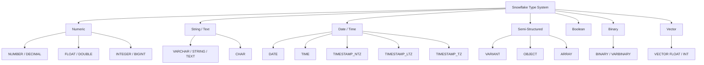
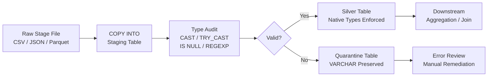

# 2.2.11 Use Native Data Types in Snowflake Data Cleaning

---

## 1. Overview

Native data typing in Snowflake is the practice of aligning stored column types to the actual domain of the data they represent. It is a prerequisite for reliable data cleaning because type-correct storage eliminates an entire class of bugs caused by implicit coercion, silent truncation, and ambiguous comparisons.

This document covers:

- The complete Snowflake type system and how each type class behaves
- Why type selection affects pruning, compression, join correctness, and caching
- How to audit, coerce, and enforce types in a cleaning pipeline
- SQL patterns for safe casting, validation, and rejection of type-invalid records
- SnowPro Advanced exam traps related to types, coercion, and precision

**Where it fits in the data cleaning pipeline:**

Type enforcement is applied at stage ingestion (COPY INTO), at the bronze-to-silver promotion boundary, and during deduplication or enrichment joins. Type mismatches caught early reduce downstream aggregate errors and incorrect partitioning.

**Intended consumers:** data engineers building ingestion pipelines, analytics engineers modeling silver/gold layers, and SnowPro Advanced exam candidates.

---

## 2. SQL Object Summary

| Attribute          | Detail                                                                 |
|--------------------|------------------------------------------------------------------------|
| Feature name       | Native Data Types                                                      |
| Type               | Engine feature / DDL constraint / storage behavior                    |
| Purpose            | Enforce domain-correct storage, enable pruning, optimize compression  |
| Source objects     | Raw staging tables, external stage files, VARIANT columns             |
| Output behavior    | Type-safe tables, prunable micropartitions, correct aggregations      |
| Invocation method  | DDL (CREATE TABLE, ALTER COLUMN), CAST, TRY_CAST, TO_* functions      |
| Exam relevance     | High — type defaults, coercion rules, precision limits, NULL behavior |

---

## 3. Architecture

### 3.1 Type System Hierarchy



### 3.2 Data Cleaning Pipeline With Type Enforcement



---

## 4. Snowflake Type Reference

### 4.1 Numeric Types

| Type              | Alias(es)                         | Precision      | Scale       | Storage    | Notes                                               |
|-------------------|-----------------------------------|----------------|-------------|------------|-----------------------------------------------------|
| NUMBER(p, s)      | DECIMAL, NUMERIC                  | 1–38 digits    | 0 to p      | Fixed      | Default: NUMBER(38, 0)                              |
| INT               | INTEGER, BIGINT, SMALLINT, TINYINT| 38 digits max  | 0           | Fixed      | All map to NUMBER(38,0) internally                  |
| FLOAT             | FLOAT4, FLOAT8, DOUBLE, REAL      | ~15–17 sig dig | N/A         | IEEE 754   | Approximate; do not use for financial calculations  |

**Exam trap — INTEGER alias:**  
`SMALLINT`, `TINYINT`, `BIGINT`, and `INT` are all stored as `NUMBER(38, 0)` in Snowflake. There is no byte-width enforcement. Snowflake does not truncate values at 127 for TINYINT.

**Exam trap — FLOAT precision:**  
FLOAT is IEEE 754 double-precision. `0.1 + 0.2 = 0.30000000000000004` is possible. For monetary amounts, always use `NUMBER(p, s)` with explicit scale.

```sql
-- Correct: financial amount column
amount NUMBER(18, 4)

-- Incorrect for money: FLOAT introduces rounding errors
amount FLOAT

-- Audit: find rows where float rounding creates discrepancy vs stored value
SELECT
    id,
    amount_float,
    amount_decimal,
    ABS(amount_float - amount_decimal) AS rounding_gap
FROM staging.payments
WHERE ABS(amount_float - amount_decimal) > 0.0001;
```

---

### 4.2 String Types

| Type       | Alias(es)               | Max Length      | Default Length | Padding     | Notes                                           |
|------------|-------------------------|-----------------|----------------|-------------|-------------------------------------------------|
| VARCHAR(n) | STRING, TEXT, NVARCHAR  | 16,777,216 bytes| 16,777,216     | No          | Unicode (UTF-8). n is characters, not bytes.    |
| CHAR(n)    | CHARACTER               | 16,777,216 bytes| 1              | Space-padded| Trailing spaces stripped in comparisons         |

**Exam trap — VARCHAR default:**  
`VARCHAR` without a length argument defaults to `VARCHAR(16777216)`. This does not affect storage efficiency because Snowflake uses actual-length columnar compression, but it removes semantic intent from the DDL.

**Exam trap — CHAR padding:**  
`CHAR(10)` pads values with trailing spaces. When comparing `CHAR` to `VARCHAR`, Snowflake strips trailing spaces before comparison. The stored value retains the padding.

```sql
-- DDL: always specify intentional max lengths for domain documentation
CREATE OR REPLACE TABLE silver.customer (
    customer_id     VARCHAR(36),     -- UUID format
    email           VARCHAR(254),    -- RFC 5321 max
    country_code    CHAR(2),         -- ISO 3166-1 alpha-2
    phone_e164      VARCHAR(20),     -- E.164 international format
    full_name       VARCHAR(200),
    status_code     VARCHAR(10)      -- bounded categorical
);

-- Audit: flag values that exceed intended domain max
SELECT
    customer_id,
    LENGTH(email) AS email_len,
    LENGTH(phone_e164) AS phone_len
FROM staging.customer
WHERE LENGTH(email) > 254
   OR LENGTH(phone_e164) > 20;
```

---

### 4.3 Date and Time Types

| Type              | Format / Behavior                                       | Timezone       | Precision       | Default              |
|-------------------|---------------------------------------------------------|----------------|-----------------|----------------------|
| DATE              | YYYY-MM-DD                                              | None           | Day             | —                    |
| TIME              | HH:MI:SS.FFFFFFFFF                                      | None           | 0–9 nanoseconds | TIME(9)              |
| TIMESTAMP_NTZ     | No timezone. Wall clock only.                           | None           | 0–9 nanoseconds | TIMESTAMP_NTZ(9)     |
| TIMESTAMP_LTZ     | Stored as UTC, displayed in session timezone.           | Session TZ     | 0–9 nanoseconds | TIMESTAMP_LTZ(9)     |
| TIMESTAMP_TZ      | Stores value AND offset. Displayed as-is.               | Embedded offset| 0–9 nanoseconds | TIMESTAMP_TZ(9)      |
| TIMESTAMP         | Alias, resolved by TIMESTAMP_TYPE_MAPPING parameter     | Depends        | —               | NTZ (default param)  |

**Exam trap — TIMESTAMP alias:**  
`TIMESTAMP` is an alias. The actual type it resolves to is controlled by the session or account parameter `TIMESTAMP_TYPE_MAPPING`. Default is `TIMESTAMP_NTZ`. This means `TIMESTAMP` columns can behave differently across sessions if that parameter is changed.

**Exam trap — TIMESTAMP_LTZ display:**  
`TIMESTAMP_LTZ` stores values in UTC internally. The displayed value shifts based on the `TIMEZONE` session parameter. Two sessions with different `TIMEZONE` settings will display the same stored value differently. This is a data correctness trap in BI tools.

**Exam trap — TIMESTAMP_TZ offset:**  
`TIMESTAMP_TZ` stores the value and the UTC offset together. The stored offset does not change with session timezone. This is the safest type when preserving the originating timezone is a business requirement.

```sql
-- Correct type selection by use case
CREATE OR REPLACE TABLE silver.event_log (
    event_id        VARCHAR(36),
    -- Use NTZ when all sources are in UTC and no TZ conversion is needed
    occurred_at     TIMESTAMP_NTZ,
    -- Use LTZ when the pipeline must respect session/user timezone
    reported_at     TIMESTAMP_LTZ,
    -- Use TZ when source timezone must be preserved (e.g. multi-region logs)
    source_ts       TIMESTAMP_TZ,
    -- Use DATE when time of day is irrelevant (partitioning, reporting)
    event_date      DATE,
    -- Use TIME when only the intraday clock matters (e.g. SLA window tracking)
    event_time      TIME
);

-- Show session TIMESTAMP_TYPE_MAPPING
SHOW PARAMETERS LIKE 'TIMESTAMP_TYPE_MAPPING';

-- Set explicitly in session before running ingestion
ALTER SESSION SET TIMESTAMP_TYPE_MAPPING = 'TIMESTAMP_NTZ';
ALTER SESSION SET TIMEZONE = 'UTC';
```

---

### 4.4 Boolean

| Type    | Values accepted for TRUE            | Values accepted for FALSE           | Storage |
|---------|--------------------------------------|--------------------------------------|---------|
| BOOLEAN | TRUE, 'TRUE', 'YES', 'ON', '1', 1   | FALSE, 'FALSE', 'NO', 'OFF', '0', 0 | 1 bit   |

**Exam trap — implicit string coercion:**  
`'true'` (lowercase string) is accepted and coerced to `TRUE` during INSERT. `'T'` alone is **not** accepted and will throw an error. `NULL` is preserved as NULL.

```sql
-- DDL: use BOOLEAN not TINYINT or VARCHAR for flag fields
CREATE OR REPLACE TABLE silver.subscription (
    subscription_id VARCHAR(36),
    is_active       BOOLEAN,
    is_trial        BOOLEAN,
    is_cancelled    BOOLEAN
);

-- Coerce from VARCHAR source
SELECT
    id,
    CASE UPPER(TRIM(is_active_raw))
        WHEN 'TRUE'  THEN TRUE
        WHEN 'YES'   THEN TRUE
        WHEN '1'     THEN TRUE
        WHEN 'FALSE' THEN FALSE
        WHEN 'NO'    THEN FALSE
        WHEN '0'     THEN FALSE
        ELSE NULL
    END AS is_active
FROM staging.subscription_raw;

-- Audit: find non-standard boolean representations in source
SELECT DISTINCT is_active_raw
FROM staging.subscription_raw
WHERE TRY_CAST(is_active_raw AS BOOLEAN) IS NULL
  AND is_active_raw IS NOT NULL;
```

---

### 4.5 Semi-Structured Types

| Type    | Purpose                                            | Max size per value | Indexing    |
|---------|----------------------------------------------------|--------------------|-------------|
| VARIANT | Stores any JSON, XML, Avro, or Parquet nested data | 16 MB              | Automatic   |
| OBJECT  | Map of key-value pairs (string keys)               | 16 MB              | Automatic   |
| ARRAY   | Ordered list of VARIANT elements                   | 16 MB              | Automatic   |

**Exam trap — VARIANT auto-casting:**  
When Snowflake reads a VARIANT column using dot notation or bracket notation, it returns the value as a VARIANT, not as a typed scalar. You must explicitly cast when using in a typed context. `src:price::NUMBER` casts the extracted value to NUMBER.

**Exam trap — VARIANT NULL vs SQL NULL:**  
A JSON `null` value stored in VARIANT is a JSON null, not a SQL NULL. `IS NULL` will return FALSE for a VARIANT column containing JSON null. Use `IS NULL` for SQL-level nulls and check `src:field = 'null'::VARIANT` for JSON-level nulls.

```sql
-- Extract and type-cast from VARIANT source
SELECT
    src:event_id::VARCHAR(36)            AS event_id,
    src:occurred_at::TIMESTAMP_NTZ       AS occurred_at,
    src:amount::NUMBER(18, 4)            AS amount,
    src:user.id::VARCHAR(36)             AS user_id,
    src:metadata:tags::ARRAY             AS tags,
    src:is_active::BOOLEAN               AS is_active
FROM raw.events_variant;

-- Safe extraction: handle JSON nulls and missing keys
SELECT
    src:event_id::VARCHAR(36)                                AS event_id,
    NULLIF(src:amount::VARCHAR, 'null')::NUMBER(18,4)        AS amount,
    IFF(src:is_active IS NULL OR src:is_active = 'null'::VARIANT,
        NULL,
        src:is_active::BOOLEAN)                              AS is_active
FROM raw.events_variant;

-- Audit: identify VARIANT keys not present in expected schema
SELECT
    f.key                  AS json_key,
    COUNT(*)               AS occurrence_count,
    COUNT(*) * 100.0 
        / SUM(COUNT(*)) OVER() AS pct_of_records
FROM raw.events_variant,
LATERAL FLATTEN(input => src) f
GROUP BY f.key
ORDER BY occurrence_count DESC;
```

---

### 4.6 Binary

| Type             | Alias     | Max size        | Notes                                              |
|------------------|-----------|-----------------|----------------------------------------------------|
| BINARY(n)        | VARBINARY | 8,388,608 bytes | Stores raw bytes. Default n = 8388608.             |

```sql
-- Store hashed identifiers as BINARY instead of hex strings
CREATE OR REPLACE TABLE silver.user_identity (
    user_id         VARCHAR(36),
    password_hash   BINARY         -- store bcrypt/sha256 raw bytes
);

-- Cast hex string to BINARY
SELECT TO_BINARY(password_hash_hex, 'HEX') AS password_hash
FROM staging.user_raw;

-- Cast back to hex for display
SELECT TO_VARCHAR(password_hash, 'HEX') AS password_hash_hex
FROM silver.user_identity;
```

---

### 4.7 Vector (Preview / GA depending on account)

| Type               | Element type   | Max dimensions | Use case                      |
|--------------------|----------------|----------------|-------------------------------|
| VECTOR(FLOAT, n)   | 32-bit float   | 4096           | ML embeddings, similarity     |
| VECTOR(INT, n)     | 8-bit int      | 4096           | Quantized embeddings          |

```sql
-- Store embedding vector
CREATE OR REPLACE TABLE silver.product_embeddings (
    product_id  VARCHAR(36),
    embedding   VECTOR(FLOAT, 768)   -- 768-dim from BERT-style model
);

-- Cosine similarity search
SELECT
    a.product_id                    AS source_product,
    b.product_id                    AS candidate_product,
    VECTOR_COSINE_SIMILARITY(a.embedding, b.embedding) AS similarity
FROM silver.product_embeddings a
JOIN silver.product_embeddings b
    ON a.product_id <> b.product_id
ORDER BY similarity DESC
LIMIT 10;
```

---

## 5. Data Flow: Type Enforcement in a Cleaning Pipeline

### 5.1 Stage: Raw Ingestion (Bronze)

**Input:** CSV, JSON, Parquet, or Avro file in an external or internal stage.  
**Goal:** Land data with minimum interpretation. Preserve source fidelity.  
**Type strategy:** Use VARCHAR for all columns in CSV staging tables. Use VARIANT for JSON.

```sql
-- Bronze table: all VARCHAR to preserve raw source
CREATE OR REPLACE TABLE bronze.order_raw (
    order_id_raw        VARCHAR,
    customer_id_raw     VARCHAR,
    order_date_raw      VARCHAR,
    amount_raw          VARCHAR,
    currency_raw        VARCHAR,
    status_raw          VARCHAR,
    is_paid_raw         VARCHAR,
    _loaded_at          TIMESTAMP_NTZ   DEFAULT CURRENT_TIMESTAMP(),
    _source_file        VARCHAR,
    _row_number         NUMBER
);

-- COPY INTO with minimal type assumption
COPY INTO bronze.order_raw (
    order_id_raw,
    customer_id_raw,
    order_date_raw,
    amount_raw,
    currency_raw,
    status_raw,
    is_paid_raw,
    _source_file,
    _row_number
)
FROM (
    SELECT
        $1, $2, $3, $4, $5, $6, $7,
        METADATA$FILENAME,
        METADATA$FILE_ROW_NUMBER
    FROM @raw_stage/orders/
)
FILE_FORMAT = (TYPE = CSV FIELD_OPTIONALLY_ENCLOSED_BY = '"' SKIP_HEADER = 1)
ON_ERROR = CONTINUE;
```

---

### 5.2 Stage: Type Audit (Validation Layer)

**Input:** Bronze VARCHAR table.  
**Goal:** Classify each row as type-valid, type-invalid, or NULL for each domain column.  
**Output:** Audit summary report and quarantine dataset.

```sql
-- Type audit CTE pattern
WITH type_checks AS (
    SELECT
        order_id_raw,
        customer_id_raw,
        order_date_raw,
        amount_raw,
        is_paid_raw,

        -- Attempt typed coercions; NULL indicates failure
        TRY_CAST(order_id_raw     AS VARCHAR(36))       AS order_id_check,
        TRY_CAST(customer_id_raw  AS VARCHAR(36))       AS customer_id_check,
        TRY_TO_DATE(order_date_raw, 'YYYY-MM-DD')       AS order_date_check,
        TRY_TO_DECIMAL(amount_raw, 18, 4)               AS amount_check,
        TRY_CAST(is_paid_raw      AS BOOLEAN)           AS is_paid_check,

        -- Flag per-column failures
        (order_id_raw IS NOT NULL
            AND TRY_CAST(order_id_raw AS VARCHAR(36)) IS NULL)       AS order_id_invalid,
        (order_date_raw IS NOT NULL
            AND TRY_TO_DATE(order_date_raw, 'YYYY-MM-DD') IS NULL)   AS order_date_invalid,
        (amount_raw IS NOT NULL
            AND TRY_TO_DECIMAL(amount_raw, 18, 4) IS NULL)           AS amount_invalid,
        (is_paid_raw IS NOT NULL
            AND TRY_CAST(is_paid_raw AS BOOLEAN) IS NULL)            AS is_paid_invalid

    FROM bronze.order_raw
),

audit_summary AS (
    SELECT
        COUNT(*)                                                            AS total_rows,
        SUM(IFF(order_date_invalid, 1, 0))                                 AS order_date_failures,
        SUM(IFF(amount_invalid, 1, 0))                                     AS amount_failures,
        SUM(IFF(is_paid_invalid, 1, 0))                                    AS is_paid_failures,
        SUM(IFF(order_date_invalid OR amount_invalid OR is_paid_invalid, 1, 0)) AS total_invalid_rows
    FROM type_checks
)

SELECT * FROM audit_summary;
```

---

### 5.3 Stage: Quarantine

**Input:** Rows with one or more type failures.  
**Goal:** Preserve raw values and failure metadata for remediation.  
**Output:** Quarantine table with error reason column.

```sql
CREATE OR REPLACE TABLE bronze.order_quarantine (
    order_id_raw        VARCHAR,
    customer_id_raw     VARCHAR,
    order_date_raw      VARCHAR,
    amount_raw          VARCHAR,
    is_paid_raw         VARCHAR,
    failure_reason      VARCHAR,
    _loaded_at          TIMESTAMP_NTZ DEFAULT CURRENT_TIMESTAMP()
);

INSERT INTO bronze.order_quarantine
WITH type_checks AS (
    SELECT
        *,
        TRY_TO_DATE(order_date_raw, 'YYYY-MM-DD')       AS order_date_check,
        TRY_TO_DECIMAL(amount_raw, 18, 4)               AS amount_check,
        TRY_CAST(is_paid_raw AS BOOLEAN)                AS is_paid_check
    FROM bronze.order_raw
)
SELECT
    order_id_raw,
    customer_id_raw,
    order_date_raw,
    amount_raw,
    is_paid_raw,
    ARRAY_TO_STRING(
        ARRAY_CONSTRUCT_COMPACT(
            IFF(order_date_raw IS NOT NULL AND order_date_check IS NULL, 'invalid_order_date', NULL),
            IFF(amount_raw IS NOT NULL AND amount_check IS NULL,         'invalid_amount', NULL),
            IFF(is_paid_raw IS NOT NULL AND is_paid_check IS NULL,       'invalid_is_paid', NULL)
        ), ', '
    ) AS failure_reason
FROM type_checks
WHERE order_date_check IS NULL
   OR amount_check IS NULL
   OR is_paid_check IS NULL;
```

---

### 5.4 Stage: Silver Promotion (Type-Enforced)

**Input:** Valid rows from bronze.  
**Goal:** Persist in type-correct columns in silver layer.  
**Output:** Silver table with native types, audit metadata.

```sql
CREATE OR REPLACE TABLE silver.order (
    order_id        VARCHAR(36)         NOT NULL,
    customer_id     VARCHAR(36)         NOT NULL,
    order_date      DATE                NOT NULL,
    amount          NUMBER(18, 4)       NOT NULL,
    currency        CHAR(3)             NOT NULL,
    status          VARCHAR(20)         NOT NULL,
    is_paid         BOOLEAN             NOT NULL,
    _loaded_at      TIMESTAMP_NTZ       NOT NULL,
    _source_file    VARCHAR             NOT NULL,
    _row_number     NUMBER              NOT NULL
);

INSERT INTO silver.order
WITH valid_rows AS (
    SELECT
        TRY_CAST(order_id_raw    AS VARCHAR(36))    AS order_id,
        TRY_CAST(customer_id_raw AS VARCHAR(36))    AS customer_id,
        TRY_TO_DATE(order_date_raw, 'YYYY-MM-DD')   AS order_date,
        TRY_TO_DECIMAL(amount_raw, 18, 4)           AS amount,
        UPPER(TRIM(currency_raw))                   AS currency,
        TRIM(status_raw)                            AS status,
        TRY_CAST(is_paid_raw AS BOOLEAN)            AS is_paid,
        _loaded_at,
        _source_file,
        _row_number
    FROM bronze.order_raw
)
SELECT *
FROM valid_rows
WHERE order_id   IS NOT NULL
  AND customer_id IS NOT NULL
  AND order_date  IS NOT NULL
  AND amount      IS NOT NULL
  AND is_paid     IS NOT NULL;
```

---

## 6. Logical Breakdown

### 6.1 TRY_CAST and TRY_TO_* Functions

**Responsibility:** Attempt a type conversion and return NULL on failure instead of raising an error.

| Function              | Input              | Output type        | Error behavior    |
|-----------------------|--------------------|--------------------|-------------------|
| TRY_CAST(x AS T)      | Any scalar         | T or NULL          | Returns NULL      |
| TRY_TO_DATE(x, fmt)   | VARCHAR            | DATE or NULL       | Returns NULL      |
| TRY_TO_TIMESTAMP(x)   | VARCHAR            | TIMESTAMP or NULL  | Returns NULL      |
| TRY_TO_DECIMAL(x,p,s) | VARCHAR            | NUMBER(p,s) or NULL| Returns NULL      |
| TRY_TO_DOUBLE(x)      | VARCHAR            | FLOAT or NULL      | Returns NULL      |
| TRY_TO_BOOLEAN(x)     | VARCHAR            | BOOLEAN or NULL    | Returns NULL      |
| TRY_TO_BINARY(x, fmt) | VARCHAR            | BINARY or NULL     | Returns NULL      |
| TRY_TO_TIME(x)        | VARCHAR            | TIME or NULL       | Returns NULL      |

```sql
-- TRY_CAST: safe coercion pattern
SELECT
    raw_value,
    TRY_CAST(raw_value AS NUMBER(10, 2))  AS numeric_value,
    TRY_CAST(raw_value AS DATE)           AS date_value,
    TRY_CAST(raw_value AS BOOLEAN)        AS bool_value
FROM (VALUES
    ('123.45'),
    ('not_a_number'),
    ('2024-01-15'),
    ('not_a_date'),
    ('true'),
    ('maybe')
) t(raw_value);

-- CAST: hard failure version — use only when source is guaranteed clean
SELECT CAST(amount_raw AS NUMBER(18, 4)) AS amount
FROM bronze.order_raw;

-- :: operator: syntactic sugar for CAST
SELECT amount_raw::NUMBER(18, 4) AS amount
FROM bronze.order_raw;
```

---

### 6.2 Type Coercion Order in Expressions

When two different types appear in an expression (e.g., a join condition or arithmetic), Snowflake resolves the type by implicit coercion. The coercion order is:

```
VARIANT → OBJECT / ARRAY → VARCHAR → NUMBER → FLOAT → BOOLEAN → DATE → TIME → TIMESTAMP
```

Rules:
- **VARCHAR arithmetic with NUMBER:** The VARCHAR is coerced to NUMBER if the string is numeric. Fails at runtime (not parse time) if non-numeric.
- **DATE + NUMBER:** Adds days. `DATE '2024-01-01' + 7` = `2024-01-08`.
- **TIMESTAMP - TIMESTAMP:** Returns an INTERVAL (day-time). Cannot be directly cast to NUMBER without `DATEDIFF`.
- **NULL propagation:** Any arithmetic or comparison involving NULL returns NULL. `1 + NULL = NULL`.

```sql
-- Implicit coercion example: VARCHAR to NUMBER in arithmetic
-- This succeeds if source is numeric, fails at runtime if not
SELECT '100'::VARCHAR + 50;  -- returns 150

-- This fails at runtime (no TRY_ protection)
SELECT 'abc'::VARCHAR + 50;  -- Error: cannot convert string 'abc' to NUMBER

-- Use TRY_TO_DOUBLE for safe arithmetic
SELECT TRY_TO_DOUBLE('abc') + 50;  -- returns NULL safely

-- DATE + INTEGER: adds days
SELECT CURRENT_DATE() + 30;  -- returns date 30 days from now

-- DATEDIFF vs subtraction
SELECT DATEDIFF('day', '2024-01-01'::DATE, '2024-01-31'::DATE);  -- returns 30
-- TIMESTAMP_NTZ subtraction returns an interval, not a number
SELECT TIMESTAMPDIFF(SECOND, '2024-01-01 00:00:00'::TIMESTAMP_NTZ,
                              '2024-01-01 01:30:00'::TIMESTAMP_NTZ); -- 5400
```

---

### 6.3 NULL Handling by Type

| Scenario                            | Behavior                                                    |
|-------------------------------------|-------------------------------------------------------------|
| CAST(NULL AS T)                     | Returns NULL of type T                                      |
| TRY_CAST('bad' AS NUMBER)           | Returns NULL                                                |
| NULL in GROUP BY                    | All NULLs grouped together as one group                     |
| NULL in ORDER BY (default)          | NULLs sort last in ASC, first in DESC (Snowflake default)   |
| NULL in COUNT(col)                  | NULLs excluded                                              |
| NULL in COUNT(*)                    | NULLs included                                              |
| NULL in UNIQUE constraint           | Not supported (Snowflake constraints are informational only) |
| NULL = NULL                         | Returns NULL, not TRUE                                      |
| NULL IS NULL                        | Returns TRUE                                                |
| COALESCE(NULL, NULL, x)             | Returns x                                                   |
| NVL(NULL, default_val)              | Returns default_val                                         |

```sql
-- NULL in aggregate: COUNT vs COUNT(*)
SELECT
    COUNT(*)            AS total_rows,
    COUNT(amount)       AS non_null_amounts,
    COUNT(*) - COUNT(amount) AS null_amount_rows,
    AVG(amount)         AS avg_excluding_nulls,     -- NULLs excluded by AVG
    SUM(amount)         AS sum_excluding_nulls      -- NULLs excluded by SUM
FROM silver.order;

-- NULL equality trap
SELECT *
FROM silver.order
WHERE amount = NULL;    -- Returns 0 rows. Use IS NULL instead.

SELECT *
FROM silver.order
WHERE amount IS NULL;   -- Correct pattern

-- COALESCE for default substitution
SELECT
    order_id,
    COALESCE(discount_pct, 0)        AS discount_pct,     -- replace NULL with 0
    COALESCE(notes, 'no notes')      AS notes,            -- replace NULL with default
    COALESCE(closed_at, CURRENT_TIMESTAMP()) AS closed_at -- fallback to now
FROM silver.order;

-- NULLIF: convert sentinel values to NULL
SELECT
    order_id,
    NULLIF(amount, -1)          AS amount,          -- -1 sentinel to NULL
    NULLIF(status_code, 'N/A')  AS status_code,     -- 'N/A' to NULL
    NULLIF(country_code, '')    AS country_code     -- empty string to NULL
FROM bronze.order_raw;
```

---

### 6.4 Date and Timestamp Handling Patterns

#### 6.4.1 Format-Aware Parsing

```sql
-- TO_DATE with explicit format string
SELECT TO_DATE('15/01/2024', 'DD/MM/YYYY')    AS parsed_date;
SELECT TO_DATE('January 15 2024', 'MMMM DD YYYY') AS parsed_date;

-- TRY_TO_DATE for safe parsing
SELECT
    raw_date_col,
    TRY_TO_DATE(raw_date_col, 'YYYY-MM-DD')          AS iso_format,
    TRY_TO_DATE(raw_date_col, 'MM/DD/YYYY')          AS us_format,
    TRY_TO_DATE(raw_date_col, 'DD-MON-YYYY')         AS oracle_format,
    COALESCE(
        TRY_TO_DATE(raw_date_col, 'YYYY-MM-DD'),
        TRY_TO_DATE(raw_date_col, 'MM/DD/YYYY'),
        TRY_TO_DATE(raw_date_col, 'DD/MM/YYYY'),
        TRY_TO_DATE(raw_date_col, 'YYYYMMDD')
    ) AS best_effort_date
FROM bronze.event_raw;
```

#### 6.4.2 Epoch Conversion

```sql
-- Convert Unix epoch (seconds) to TIMESTAMP_NTZ
SELECT TO_TIMESTAMP(1705276800)::TIMESTAMP_NTZ AS ts_from_epoch;

-- Convert Unix epoch (milliseconds) to TIMESTAMP_NTZ
SELECT TO_TIMESTAMP(1705276800000, 3)::TIMESTAMP_NTZ AS ts_from_ms_epoch;

-- Convert TIMESTAMP to epoch
SELECT DATE_PART(EPOCH_SECOND, CURRENT_TIMESTAMP())   AS epoch_seconds;
SELECT DATE_PART(EPOCH_MILLISECOND, CURRENT_TIMESTAMP()) AS epoch_ms;

-- Validate epoch range: reject implausible values
WITH epoch_check AS (
    SELECT
        id,
        event_ts_raw,
        TRY_TO_NUMBER(event_ts_raw)    AS epoch_candidate,
        TO_TIMESTAMP(
            TRY_TO_NUMBER(event_ts_raw)
        )::TIMESTAMP_NTZ               AS parsed_ts
    FROM bronze.event_raw
    WHERE TRY_TO_NUMBER(event_ts_raw) IS NOT NULL
)
SELECT *
FROM epoch_check
WHERE parsed_ts < '2000-01-01'::TIMESTAMP_NTZ
   OR parsed_ts > '2100-01-01'::TIMESTAMP_NTZ;
```

#### 6.4.3 Timezone Normalization

```sql
-- Convert all TIMESTAMP_LTZ to UTC TIMESTAMP_NTZ for silver layer
ALTER SESSION SET TIMEZONE = 'UTC';

SELECT
    event_id,
    -- Convert LTZ (stored as UTC, displayed per session) to explicit NTZ
    CONVERT_TIMEZONE('UTC', occurred_ltz)::TIMESTAMP_NTZ   AS occurred_utc,
    -- Convert from a known source timezone to UTC NTZ
    CONVERT_TIMEZONE('America/New_York', 'UTC', occurred_et)::TIMESTAMP_NTZ AS occurred_utc_from_et,
    -- Extract parts
    DATE_TRUNC('hour', occurred_utc)                        AS occurred_hour_utc,
    DATE_PART('dow', occurred_utc)                          AS day_of_week   -- 0=Sun, 6=Sat
FROM bronze.event_raw;
```

---

### 6.5 Numeric Precision and Scale Enforcement

```sql
-- Validate amount precision before insert
-- Reject amounts with more than 4 decimal places
SELECT
    id,
    amount_raw,
    -- Check decimal places in source
    LENGTH(SPLIT_PART(amount_raw, '.', 2)) AS decimal_places
FROM bronze.payment_raw
WHERE LENGTH(SPLIT_PART(amount_raw, '.', 2)) > 4;

-- Detect numeric overflow before casting
-- NUMBER(10, 2) max = 99999999.99
SELECT
    id,
    amount_raw,
    TRY_TO_DECIMAL(amount_raw, 10, 2)   AS amount_check
FROM bronze.payment_raw
WHERE TRY_TO_DECIMAL(amount_raw, 18, 4) IS NOT NULL   -- valid number
  AND TRY_TO_DECIMAL(amount_raw, 10, 2) IS NULL;      -- but overflows target precision

-- Rounding comparison: identify rounding loss on insert
SELECT
    id,
    TRY_TO_DECIMAL(amount_raw, 18, 6)   AS amount_high_scale,
    TRY_TO_DECIMAL(amount_raw, 18, 2)   AS amount_low_scale,
    ABS(
        TRY_TO_DECIMAL(amount_raw, 18, 6) -
        TRY_TO_DECIMAL(amount_raw, 18, 2)
    )                                   AS rounding_loss
FROM bronze.payment_raw
WHERE TRY_TO_DECIMAL(amount_raw, 18, 6) IS NOT NULL;
```

---

### 6.6 String Normalization Before Type Enforcement

```sql
-- Clean before casting: trim, normalize casing, remove formatting characters
SELECT
    id,
    -- Remove currency symbols and commas from formatted amounts
    TRY_TO_DECIMAL(
        REGEXP_REPLACE(amount_raw, '[^0-9.]', ''),
        18, 4
    )                                           AS amount_cleaned,

    -- Normalize date separators
    TRY_TO_DATE(
        REGEXP_REPLACE(TRIM(order_date_raw), '[^0-9]', '-'),
        'YYYY-MM-DD'
    )                                           AS order_date_cleaned,

    -- Normalize boolean representations
    CASE UPPER(TRIM(is_active_raw))
        WHEN 'TRUE'  THEN TRUE
        WHEN 'YES'   THEN TRUE
        WHEN 'Y'     THEN TRUE
        WHEN '1'     THEN TRUE
        WHEN 'FALSE' THEN FALSE
        WHEN 'NO'    THEN FALSE
        WHEN 'N'     THEN FALSE
        WHEN '0'     THEN FALSE
        ELSE NULL
    END                                         AS is_active_cleaned,

    -- Normalize country code
    UPPER(TRIM(country_code_raw))               AS country_code_cleaned,

    -- Remove phone formatting characters
    REGEXP_REPLACE(phone_raw, '[^0-9+]', '')    AS phone_cleaned

FROM bronze.customer_raw;
```

---

## 7. Data Model

### 7.1 Bronze Layer (Raw/Untyped)

| Column             | Type     | Purpose                                           |
|--------------------|----------|---------------------------------------------------|
| All domain columns | VARCHAR  | Preserve source fidelity; no coercion             |
| _loaded_at         | TIMESTAMP_NTZ | Pipeline execution timestamp               |
| _source_file       | VARCHAR  | Stage file path for lineage                       |
| _row_number        | NUMBER   | Source row position for deduplication/debugging   |

**Grain:** One row per source record as-loaded. May contain duplicates.

---

### 7.2 Quarantine Layer

| Column         | Type          | Purpose                                           |
|----------------|---------------|---------------------------------------------------|
| All raw columns| VARCHAR       | Raw values preserved for remediation              |
| failure_reason | VARCHAR       | Comma-separated list of failed type checks        |
| _loaded_at     | TIMESTAMP_NTZ | Quarantine timestamp                              |

**Grain:** One row per invalid source record. Row may appear here and not in silver.

---

### 7.3 Silver Layer (Type-Enforced)

| Column         | Type              | Purpose                                           |
|----------------|-------------------|---------------------------------------------------|
| order_id       | VARCHAR(36)       | Business key (UUID)                               |
| customer_id    | VARCHAR(36)       | FK to customer dimension                          |
| order_date     | DATE              | Business date for partitioning and reporting      |
| amount         | NUMBER(18, 4)     | Financial precision                               |
| currency       | CHAR(3)           | ISO 4217 currency code                            |
| status         | VARCHAR(20)       | Bounded categorical                               |
| is_paid        | BOOLEAN           | Payment flag                                      |
| _loaded_at     | TIMESTAMP_NTZ     | Pipeline metadata                                 |

**Grain:** One row per valid order. Duplicates resolved before or during insert.

---

## 8. Business Logic and Type Selection Rules

### 8.1 Type Selection Decision Matrix

| Data domain              | Recommended type           | Avoid                | Reason                                                     |
|--------------------------|----------------------------|----------------------|------------------------------------------------------------|
| UUID / surrogate key     | VARCHAR(36)                | NUMBER               | UUIDs contain hyphens; numbers lose leading zeros          |
| Integer count or ID      | NUMBER(38, 0) or INT       | VARCHAR              | Enables arithmetic and range comparisons                   |
| Financial amount         | NUMBER(p, s) (e.g. 18, 4)  | FLOAT                | FLOAT introduces IEEE 754 rounding on accumulation         |
| Percentage               | NUMBER(5, 4)               | FLOAT                | Percentages often sum to 100; rounding errors accumulate   |
| Boolean flag             | BOOLEAN                    | NUMBER(1) or CHAR(1) | Semantic clarity; native optimizer support                 |
| Business date            | DATE                       | TIMESTAMP, VARCHAR   | DATE enables date arithmetic and pruning without TZ issues |
| Event timestamp (UTC)    | TIMESTAMP_NTZ              | TIMESTAMP (alias)    | Avoids session TZ dependency                               |
| Event timestamp (multi-TZ)| TIMESTAMP_TZ              | TIMESTAMP_LTZ        | Preserves originating offset                               |
| ISO country code         | CHAR(2) or CHAR(3)         | VARCHAR              | Fixed-length; enforces format constraint                   |
| Currency code            | CHAR(3)                    | VARCHAR              | ISO 4217 is always 3 characters                           |
| Email address            | VARCHAR(254)               | TEXT without limit   | RFC 5321 max; documents intent                            |
| Phone number (E.164)     | VARCHAR(20)                | NUMBER               | Numbers lose leading + sign and leading zeros             |
| Free text / description  | VARCHAR                    | TEXT (same thing)    | No length constraint needed; compression handles it        |
| JSON document            | VARIANT                    | VARCHAR              | Enables path extraction and FLATTEN; searchable            |
| Binary hash              | BINARY                     | VARCHAR (hex)        | Storage-efficient; correct comparison semantics            |
| Enumeration (< 50 vals)  | VARCHAR with CHECK inform. | NUMBER code          | Human-readable; easier downstream joins                    |

---

### 8.2 Precision and Scale Selection Rules

**NUMBER(precision, scale):**

- `precision` = total number of significant digits (1–38)
- `scale` = digits to the right of the decimal point (0 to precision)
- Maximum storable value = 10^(precision - scale) - 10^(-scale)

```sql
-- Determine appropriate precision and scale for a source column
SELECT
    MAX(LENGTH(SPLIT_PART(amount_raw, '.', 1)))  AS max_integer_digits,
    MAX(LENGTH(SPLIT_PART(amount_raw, '.', 2)))  AS max_decimal_digits,
    MAX(ABS(TRY_TO_DECIMAL(amount_raw, 38, 10))) AS max_absolute_value
FROM bronze.payment_raw
WHERE TRY_TO_DECIMAL(amount_raw, 38, 10) IS NOT NULL;

-- Derive safe precision: add headroom to observed max
-- e.g. max_integer_digits = 8, max_decimal_digits = 4
-- Use NUMBER(8+4+2, 4) = NUMBER(14, 4) for 2 digits of headroom
```

---

### 8.3 Temporal Logic Rules

| Rule                                                         | Implementation                                          |
|--------------------------------------------------------------|---------------------------------------------------------|
| All timestamp columns in silver use UTC                      | CONVERT_TIMEZONE to UTC; store as TIMESTAMP_NTZ         |
| DATE columns must not carry time-of-day component            | Use DATE_TRUNC or CAST to DATE                          |
| Event timestamps from user-facing systems include TZ offset  | Store original as TIMESTAMP_TZ; derive UTC_NTZ column   |
| Batch load date columns used for partitioning                | Derive from _loaded_at, not from event timestamp        |
| SLA and aging calculations use DATEDIFF, not subtraction     | DATEDIFF returns integer days; subtraction returns INTERVAL |

```sql
-- Enforce no time-of-day in DATE columns
SELECT
    order_id,
    order_date::DATE             AS order_date_clean,
    -- Detect if source has a time component (hour > 0 or minute > 0)
    CASE WHEN order_date_raw LIKE '%T%' OR order_date_raw LIKE '% %'
         THEN 'has_time_component'
         ELSE 'date_only'
    END                          AS date_check
FROM bronze.order_raw;

-- Derive partition date from load timestamp, not event timestamp
-- This prevents late-arriving events from shifting partition boundaries
SELECT
    order_id,
    occurred_at,
    _loaded_at::DATE             AS partition_date   -- stable; use for clustering
FROM silver.event;
```

---

## 9. Transformations

### 9.1 Type Promotion Transformation

| Source type   | Source value example | Target type       | Transformation function        | Output example         |
|---------------|----------------------|-------------------|--------------------------------|------------------------|
| VARCHAR       | '2024-01-15'         | DATE              | TRY_TO_DATE(x, 'YYYY-MM-DD')  | 2024-01-15             |
| VARCHAR       | '2024-01-15T10:30:00'| TIMESTAMP_NTZ     | TRY_TO_TIMESTAMP_NTZ(x)       | 2024-01-15 10:30:00.000|
| VARCHAR       | '1705276800'         | TIMESTAMP_NTZ     | TO_TIMESTAMP(x::NUMBER)       | 2024-01-15 00:00:00    |
| VARCHAR       | '$1,234.56'          | NUMBER(18,4)      | TRY_TO_DECIMAL(REGEXP_REPLACE)| 1234.5600              |
| VARCHAR       | 'true'               | BOOLEAN           | TRY_TO_BOOLEAN(x)             | TRUE                   |
| VARCHAR       | 'abc123'             | BINARY            | TRY_TO_BINARY(x, 'UTF-8')     | binary representation  |
| FLOAT         | 1234.5678901234      | NUMBER(18,4)      | ROUND(x::NUMBER(18,4), 4)     | 1234.5679              |
| VARIANT path  | src:amount           | NUMBER(18,4)      | src:amount::NUMBER(18,4)       | 1234.5600              |
| TIMESTAMP_LTZ | 2024-01-15 10:30 EST | TIMESTAMP_NTZ UTC | CONVERT_TIMEZONE('UTC', x)    | 2024-01-15 15:30:00    |
| TIMESTAMP_TZ  | 2024-01-15 10:30-05  | TIMESTAMP_NTZ UTC | CONVERT_TIMEZONE('UTC', x)    | 2024-01-15 15:30:00    |

---

### 9.2 Sentinel Value Normalization

Sentinel values are source-system conventions that substitute for NULL (e.g., -1, 0, 'N/A', 'UNKNOWN', '9999-12-31'). These must be converted to SQL NULL in the silver layer.

```sql
-- Sentinel value normalization
SELECT
    id,
    NULLIF(amount, -1)                          AS amount,           -- -1 sentinel
    NULLIF(TRIM(country_code), 'XX')            AS country_code,     -- XX = unknown
    NULLIF(TRIM(status), 'N/A')                 AS status,
    NULLIF(birth_date, '9999-12-31'::DATE)      AS birth_date,       -- max-date sentinel
    NULLIF(TRIM(email), '')                     AS email,            -- empty string
    NULLIF(TRIM(phone), '0000000000')           AS phone,            -- all-zeros sentinel
    CASE WHEN score = -999 THEN NULL ELSE score END AS score         -- explicit CASE form
FROM bronze.customer_raw;

-- Audit: discover sentinel values in source before building pipeline
SELECT
    'amount'             AS column_name,
    amount_raw           AS sentinel_candidate,
    COUNT(*)             AS occurrence_count
FROM bronze.order_raw
WHERE TRY_TO_DECIMAL(amount_raw, 18, 4) < 0
GROUP BY amount_raw
ORDER BY occurrence_count DESC

UNION ALL

SELECT
    'status'             AS column_name,
    status_raw,
    COUNT(*)
FROM bronze.order_raw
WHERE UPPER(TRIM(status_raw)) IN ('N/A', 'NONE', 'NULL', 'UNKNOWN', '-', '')
GROUP BY status_raw
ORDER BY occurrence_count DESC;
```

---

## 10. Parameters and Configuration

### 10.1 Type-Relevant Session Parameters

| Parameter                  | Default        | Purpose                                             | Effect on type behavior                             |
|----------------------------|----------------|-----------------------------------------------------|-----------------------------------------------------|
| TIMESTAMP_TYPE_MAPPING     | TIMESTAMP_NTZ  | Resolves the `TIMESTAMP` alias                      | Changes behavior of TIMESTAMP columns and functions |
| TIMEZONE                   | America/Los_Angeles | Display timezone for TIMESTAMP_LTZ           | Changes displayed value without changing stored UTC |
| DATE_INPUT_FORMAT          | AUTO           | Expected format for string-to-DATE conversion       | Controls what TRY_TO_DATE accepts without format arg|
| DATE_OUTPUT_FORMAT         | YYYY-MM-DD     | Display format for DATE values                      | Affects output of DATE columns in result sets       |
| TIME_INPUT_FORMAT          | AUTO           | Expected format for string-to-TIME conversion       | Controls what TRY_TO_TIME accepts without format arg|
| TIME_OUTPUT_FORMAT         | HH24:MI:SS     | Display format for TIME values                      | Affects output of TIME columns in result sets       |
| TIMESTAMP_INPUT_FORMAT     | AUTO           | Expected format for string-to-TIMESTAMP conversion  | Controls what TRY_TO_TIMESTAMP accepts              |
| TIMESTAMP_OUTPUT_FORMAT    | YYYY-MM-DD HH24:MI:SS.FF3 TZH:TZM | Display format  | Affects output of TIMESTAMP columns          |
| TIMESTAMP_NTZ_OUTPUT_FORMAT| (inherits TIMESTAMP_OUTPUT_FORMAT) | NTZ display format | Overrides for NTZ columns                 |
| TIMESTAMP_LTZ_OUTPUT_FORMAT| (inherits TIMESTAMP_OUTPUT_FORMAT) | LTZ display format | Overrides for LTZ columns                 |
| TIMESTAMP_TZ_OUTPUT_FORMAT | (inherits TIMESTAMP_OUTPUT_FORMAT) | TZ display format  | Overrides for TZ columns                  |
| BINARY_INPUT_FORMAT        | HEX            | Expected encoding for binary input                  | HEX, BASE64, or UTF8                               |
| BINARY_OUTPUT_FORMAT       | HEX            | Output encoding for binary values                   | HEX or BASE64                                      |

```sql
-- Inspect current type-relevant parameters
SHOW PARAMETERS LIKE 'TIMESTAMP%';
SHOW PARAMETERS LIKE 'DATE%';
SHOW PARAMETERS LIKE 'TIMEZONE';
SHOW PARAMETERS LIKE 'BINARY%';

-- Harden pipeline session for deterministic type behavior
ALTER SESSION SET TIMESTAMP_TYPE_MAPPING   = 'TIMESTAMP_NTZ';
ALTER SESSION SET TIMEZONE                 = 'UTC';
ALTER SESSION SET DATE_INPUT_FORMAT        = 'YYYY-MM-DD';
ALTER SESSION SET TIMESTAMP_INPUT_FORMAT   = 'YYYY-MM-DD HH24:MI:SS';
ALTER SESSION SET DATE_OUTPUT_FORMAT       = 'YYYY-MM-DD';
ALTER SESSION SET BINARY_INPUT_FORMAT      = 'HEX';
ALTER SESSION SET BINARY_OUTPUT_FORMAT     = 'HEX';

-- Set at account level for pipeline service accounts
ALTER ACCOUNT SET TIMESTAMP_TYPE_MAPPING   = 'TIMESTAMP_NTZ';
ALTER ACCOUNT SET TIMEZONE                 = 'UTC';
```

---

### 10.2 COPY INTO Type-Related Options

| Option                  | Purpose                                                                 |
|-------------------------|-------------------------------------------------------------------------|
| NULL_IF                 | List of source strings to treat as NULL during COPY                     |
| EMPTY_FIELD_AS_NULL     | Whether empty CSV fields map to NULL or empty string                    |
| DATE_FORMAT             | Source date format for auto-parsing                                     |
| TIME_FORMAT             | Source time format for auto-parsing                                     |
| TIMESTAMP_FORMAT        | Source timestamp format for auto-parsing                                |
| TRIM_SPACE              | Strip leading/trailing whitespace from fields before type parsing       |

```sql
COPY INTO bronze.order_raw
FROM @raw_stage/orders/
FILE_FORMAT = (
    TYPE                    = CSV
    FIELD_OPTIONALLY_ENCLOSED_BY = '"'
    SKIP_HEADER             = 1
    NULL_IF                 = ('NULL', 'null', 'N/A', '', '\\N')
    EMPTY_FIELD_AS_NULL     = TRUE
    TRIM_SPACE              = TRUE
    DATE_FORMAT             = 'YYYY-MM-DD'
    TIMESTAMP_FORMAT        = 'YYYY-MM-DD HH24:MI:SS'
);
```

---

## 11. Performance and Scalability Considerations

### 11.1 Type Choice and Micropartition Pruning

Snowflake stores min/max metadata per column per micropartition. Pruning (skipping micropartitions) is only effective when:

1. The column is used in a WHERE filter or join predicate.
2. The column's type supports meaningful min/max comparison.
3. The filter value is the same type as the column (no implicit coercion needed).

**Date and timestamp columns:** Excellent pruning candidates. DATE columns stored with clustering keys can prune entire micropartitions per query.

**VARCHAR columns:** Pruning uses lexicographic min/max. A VARCHAR column holding dates as strings prunes poorly because '2024-01-31' sorts differently than DATE '2024-01-31' in clustering terms.

**VARIANT columns:** No micropartition-level pruning on extracted paths. Pruning is only on the VARIANT column container metadata, not on nested fields.

```sql
-- Pruning-aware: use DATE column, not VARCHAR, for date range filters
-- BAD: VARCHAR date — pruning unreliable
SELECT *
FROM bronze.order_raw
WHERE order_date_raw >= '2024-01-01'  -- string comparison, unreliable prune
  AND order_date_raw <  '2024-02-01';

-- GOOD: DATE column — full pruning benefit
SELECT *
FROM silver.order
WHERE order_date >= '2024-01-01'::DATE
  AND order_date <  '2024-02-01'::DATE;

-- Check pruning effectiveness via QUERY PROFILE or EXPLAIN
EXPLAIN
SELECT COUNT(*) FROM silver.order WHERE order_date = '2024-01-15'::DATE;
```

---

### 11.2 Type Casting and Function-Wrapping Anti-Patterns

Wrapping a column in a function in a filter predicate disables micropartition pruning because Snowflake cannot resolve the transformed value against stored min/max metadata.

```sql
-- BAD: function on column disables pruning
SELECT *
FROM silver.order
WHERE TO_CHAR(order_date, 'YYYY-MM') = '2024-01';

-- GOOD: rewrite to preserve sargability
SELECT *
FROM silver.order
WHERE order_date >= '2024-01-01'::DATE
  AND order_date <  '2024-02-01'::DATE;

-- BAD: implicit cast from mismatched literal type
-- If order_id is VARCHAR(36) and literal is NUMBER, implicit cast occurs
SELECT * FROM silver.order WHERE order_id = 12345;

-- GOOD: match literal type to column type
SELECT * FROM silver.order WHERE order_id = '12345';

-- BAD: CAST on the column side
SELECT * FROM silver.order WHERE order_date::VARCHAR = '2024-01-15';

-- GOOD: CAST on the literal side
SELECT * FROM silver.order WHERE order_date = '2024-01-15'::DATE;
```

---

### 11.3 VARIANT Extraction Performance

VARIANT path extraction is evaluated at query time (not stored as typed values unless materialized). Repeated extraction of the same VARIANT path in a query does not reuse results unless the query is structured to materialize once.

```sql
-- BAD: repeated VARIANT extraction in multiple places
SELECT
    src:user.id::VARCHAR     AS user_id,
    src:user.email::VARCHAR  AS email,
    src:user.id::VARCHAR     AS user_id_again   -- same path extracted twice
FROM raw.events_variant
WHERE src:user.id::VARCHAR IS NOT NULL;

-- GOOD: materialize VARIANT extraction once in a CTE
WITH extracted AS (
    SELECT
        src:user.id::VARCHAR(36)     AS user_id,
        src:user.email::VARCHAR(254) AS email,
        src:amount::NUMBER(18,4)     AS amount,
        src:occurred_at::TIMESTAMP_NTZ AS occurred_at
    FROM raw.events_variant
)
SELECT *
FROM extracted
WHERE user_id IS NOT NULL;

-- For frequently-queried VARIANT paths: create a typed materialized table
CREATE OR REPLACE TABLE silver.event AS
SELECT
    src:event_id::VARCHAR(36)       AS event_id,
    src:user.id::VARCHAR(36)        AS user_id,
    src:amount::NUMBER(18,4)        AS amount,
    src:occurred_at::TIMESTAMP_NTZ  AS occurred_at,
    src                             AS raw_payload   -- preserve for schema evolution
FROM raw.events_variant;
```

---

### 11.4 String vs. Native Type Join Performance

Joins on VARCHAR keys are generally performant in Snowflake. However, joins on mismatched types (e.g., NUMBER key joined to VARCHAR key) force an implicit cast per row, which:

1. Prevents hash join optimization in some cases.
2. Can fail at runtime if the VARCHAR contains non-numeric values.
3. Bypasses pruning on the join key.

```sql
-- BAD: mismatched type join (NUMBER to VARCHAR)
SELECT o.*, c.full_name
FROM silver.order o
JOIN silver.customer c
    ON o.customer_id = c.id;      -- if c.id is NUMBER and o.customer_id is VARCHAR

-- GOOD: enforce same type on both sides
SELECT o.*, c.full_name
FROM silver.order o
JOIN silver.customer c
    ON o.customer_id = c.id::VARCHAR(36);   -- explicit cast to match

-- Better: ensure DDL types match at silver layer definition
-- order.customer_id VARCHAR(36)
-- customer.id       VARCHAR(36)
-- Both are VARCHAR(36) — no runtime cast needed
```

---

## 12. Observability

### 12.1 Type Failure Monitoring

```sql
-- Monitor type failure rates over time using quarantine table
SELECT
    _loaded_at::DATE            AS load_date,
    failure_reason,
    COUNT(*)                    AS failure_count
FROM bronze.order_quarantine
GROUP BY load_date, failure_reason
ORDER BY load_date DESC, failure_count DESC;

-- Alert threshold: flag if type failure rate exceeds 1%
WITH load_summary AS (
    SELECT
        b._loaded_at::DATE  AS load_date,
        COUNT(*)            AS total_rows
    FROM bronze.order_raw b
    GROUP BY load_date
),
quarantine_summary AS (
    SELECT
        _loaded_at::DATE    AS load_date,
        COUNT(*)            AS quarantine_rows
    FROM bronze.order_quarantine
    GROUP BY load_date
)
SELECT
    l.load_date,
    l.total_rows,
    COALESCE(q.quarantine_rows, 0)                           AS quarantine_rows,
    ROUND(COALESCE(q.quarantine_rows, 0) * 100.0 / l.total_rows, 4) AS failure_rate_pct,
    IFF(COALESCE(q.quarantine_rows, 0) * 100.0 / l.total_rows > 1.0,
        'ALERT', 'OK')                                       AS status
FROM load_summary l
LEFT JOIN quarantine_summary q ON l.load_date = q.load_date
ORDER BY l.load_date DESC;
```

---

### 12.2 INFORMATION_SCHEMA Type Auditing

```sql
-- Inspect column types in a schema
SELECT
    table_schema,
    table_name,
    column_name,
    ordinal_position,
    data_type,
    character_maximum_length,
    numeric_precision,
    numeric_scale,
    is_nullable,
    column_default
FROM information_schema.columns
WHERE table_schema = 'SILVER'
ORDER BY table_name, ordinal_position;

-- Find VARCHAR columns that should be DATE or TIMESTAMP
-- based on column name conventions
SELECT
    table_schema,
    table_name,
    column_name,
    data_type
FROM information_schema.columns
WHERE table_schema = 'SILVER'
  AND data_type = 'TEXT'                         -- VARCHAR in Snowflake INFORMATION_SCHEMA
  AND (column_name ILIKE '%_date'
    OR column_name ILIKE '%_at'
    OR column_name ILIKE '%_ts'
    OR column_name ILIKE '%_time')
ORDER BY table_name, column_name;

-- Find FLOAT columns that may need NUMBER replacement
SELECT
    table_schema,
    table_name,
    column_name,
    data_type
FROM information_schema.columns
WHERE table_schema = 'SILVER'
  AND data_type IN ('FLOAT', 'DOUBLE', 'REAL')
ORDER BY table_name, column_name;
```

---

### 12.3 ACCOUNT_USAGE Type Drift Detection

```sql
-- Detect column type changes over time via ACCOUNT_USAGE DDL history
SELECT
    query_start_time,
    query_text,
    user_name,
    role_name
FROM snowflake.account_usage.query_history
WHERE query_text ILIKE '%ALTER TABLE%COLUMN%'
  AND query_text ILIKE '%silver%'
  AND query_start_time >= DATEADD('day', -30, CURRENT_TIMESTAMP())
ORDER BY query_start_time DESC;
```

---

## 13. Failure Handling and Recovery

### 13.1 Common Type Failure Scenarios

| Failure scenario                         | Detection                                       | Recovery                                                   |
|------------------------------------------|-------------------------------------------------|------------------------------------------------------------|
| DATE field contains timestamp            | TRY_TO_DATE returns non-null, precision lost    | Cast to DATE explicitly; verify no time-of-day business need|
| Amount field contains currency symbol    | TRY_TO_DECIMAL returns NULL on formatted string | REGEXP_REPLACE to strip non-numeric characters before cast  |
| TIMESTAMP field is Unix epoch integer    | TRY_TO_TIMESTAMP of integer string fails        | TO_TIMESTAMP(value::NUMBER) for seconds, add scale for ms  |
| Boolean field uses non-standard values   | TRY_TO_BOOLEAN returns NULL                     | CASE-based normalization; log distinct raw values          |
| VARCHAR overflow: value exceeds target length | INSERT rejected or truncated               | Increase column max length or reject to quarantine         |
| FLOAT accumulation rounding in SUM       | SUM of FLOAT differs from SUM of NUMBER by >0.01| Re-cast to NUMBER before aggregation                       |
| Timezone mismatch: LTZ displayed in wrong TZ | Business date off by N hours             | Enforce TIMEZONE session parameter; store as NTZ           |
| VARIANT JSON null vs SQL NULL            | IS NULL returns FALSE on JSON null              | Use NULLIF(x, 'null'::VARIANT) pattern                     |
| Schema drift: new JSON keys in VARIANT   | Downstream extractions return NULL              | Re-audit FLATTEN output; update silver extraction CTE      |
| NUMBER overflow: value exceeds precision | INSERT rejected silently or rounds              | Validate max value before target precision; use NUMBER(38) |

---

### 13.2 Idempotent Recovery Pattern

```sql
-- Reprocess failed rows from quarantine after source fix
-- Step 1: re-validate quarantined rows against corrected logic
WITH revalidated AS (
    SELECT
        order_id_raw,
        customer_id_raw,
        order_date_raw,
        amount_raw,
        is_paid_raw,
        COALESCE(
            TRY_TO_DATE(order_date_raw, 'YYYY-MM-DD'),
            TRY_TO_DATE(order_date_raw, 'MM/DD/YYYY'),  -- added format
            TRY_TO_DATE(order_date_raw, 'DD/MM/YYYY')
        )                                           AS order_date_check,
        TRY_TO_DECIMAL(
            REGEXP_REPLACE(amount_raw, '[^0-9.]', ''),  -- strip symbols
            18, 4
        )                                           AS amount_check
    FROM bronze.order_quarantine
    WHERE _loaded_at::DATE = CURRENT_DATE() - 1     -- scope to yesterday's load
),
now_valid AS (
    SELECT *
    FROM revalidated
    WHERE order_date_check IS NOT NULL
      AND amount_check IS NOT NULL
)
-- Step 2: insert recovered rows into silver
INSERT INTO silver.order (order_id, customer_id, order_date, amount, is_paid, _loaded_at)
SELECT
    order_id_raw::VARCHAR(36),
    customer_id_raw::VARCHAR(36),
    order_date_check,
    amount_check,
    TRY_TO_BOOLEAN(is_paid_raw),
    CURRENT_TIMESTAMP()
FROM now_valid;

-- Step 3: remove recovered rows from quarantine (optional)
DELETE FROM bronze.order_quarantine
WHERE order_id_raw IN (SELECT order_id_raw FROM now_valid)
  AND _loaded_at::DATE = CURRENT_DATE() - 1;
```

---

## 14. Security and Access Control

### 14.1 Type Enforcement and PII Masking

Data types interact with dynamic data masking policies. Masking policies are type-bound: a policy applied to a `VARCHAR` column cannot be used on a `NUMBER` column.

```sql
-- Create a masking policy for VARCHAR PII columns
CREATE OR REPLACE MASKING POLICY mask_email AS (val VARCHAR)
RETURNS VARCHAR ->
    CASE
        WHEN CURRENT_ROLE() IN ('PII_ADMIN', 'DATA_ENGINEER') THEN val
        ELSE REGEXP_REPLACE(val, '.+@', '****@')
    END;

-- Apply only to VARCHAR columns
ALTER TABLE silver.customer MODIFY COLUMN email
    SET MASKING POLICY mask_email;

-- Create a masking policy for NUMBER columns (different signature)
CREATE OR REPLACE MASKING POLICY mask_amount AS (val NUMBER)
RETURNS NUMBER ->
    CASE
        WHEN CURRENT_ROLE() IN ('FINANCE_ADMIN') THEN val
        ELSE NULL
    END;

ALTER TABLE silver.order MODIFY COLUMN amount
    SET MASKING POLICY mask_amount;
```

**Exam trap:** A masking policy's return type must match the column's data type. You cannot apply a `RETURNS VARCHAR` policy to a `NUMBER` column. Separate policies must be created for each type class.

---

### 14.2 Column-Level Security and Type Alignment

```sql
-- Verify masking policies applied to typed columns
SELECT
    c.table_schema,
    c.table_name,
    c.column_name,
    c.data_type,
    mp.policy_name,
    mp.policy_signature
FROM information_schema.columns c
LEFT JOIN snowflake.account_usage.policy_references pr
    ON pr.ref_column_name = c.column_name
    AND pr.ref_entity_name = c.table_name
LEFT JOIN snowflake.account_usage.masking_policies mp
    ON mp.policy_name = pr.policy_name
WHERE c.table_schema = 'SILVER'
ORDER BY c.table_name, c.column_name;
```

---

## 15. SnowPro Advanced Exam Reference

### 15.1 Type-Related Exam Traps (High-Frequency)

| Trap                                              | Correct answer                                                             |
|---------------------------------------------------|----------------------------------------------------------------------------|
| Default length of VARCHAR                          | 16,777,216 characters (maximum)                                            |
| SMALLINT storage size                              | Same as NUMBER(38, 0) — no byte-width constraint                           |
| TIMESTAMP alias resolution                         | Controlled by TIMESTAMP_TYPE_MAPPING parameter; default TIMESTAMP_NTZ      |
| TIMESTAMP_LTZ storage                              | UTC internally; displayed in session TIMEZONE parameter                    |
| TIMESTAMP_TZ storage                               | Value + UTC offset stored together; does not shift on TIMEZONE change      |
| FLOAT vs NUMBER for financial data                 | Always NUMBER(p, s); FLOAT is IEEE 754 and introduces rounding error       |
| JSON null vs SQL NULL in VARIANT                   | IS NULL returns FALSE for JSON null; use NULLIF(x, 'null'::VARIANT)        |
| CHAR trailing space behavior                       | Stored with padding; stripped in comparisons                               |
| MASKING POLICY return type                         | Must match column data type exactly; not cross-type compatible             |
| Function-wrapped column in WHERE                   | Disables micropartition pruning; always filter on the raw column           |
| TRY_CAST on NULL input                             | Returns NULL (not an error)                                                |
| NULL = NULL                                        | Returns NULL; use IS NULL for null comparison                              |
| COUNT(*) vs COUNT(col) with NULLs                  | COUNT(col) excludes NULLs; COUNT(*) includes all rows                      |
| DATE + INTEGER                                     | Adds days; returns DATE                                                    |
| TIMESTAMP subtraction                              | Returns INTERVAL; use DATEDIFF for integer result                          |
| VARIANT max size                                   | 16 MB per value                                                            |
| NUMBER max precision                               | 38 significant digits                                                      |
| COPY INTO NULL_IF option                           | Converts matching source strings to NULL during load                       |
| BINARY_INPUT_FORMAT default                        | HEX                                                                        |

---

### 15.2 Type Coercion Rules for Exam

```sql
-- Implicit coercion: VARCHAR to NUMBER in arithmetic
SELECT '5' + 5;                     -- returns 10 (implicit coercion)
SELECT '5.5' + 5;                   -- returns 10.5
SELECT '5abc' + 5;                  -- RUNTIME ERROR: cannot convert

-- Implicit coercion: DATE to TIMESTAMP
SELECT CURRENT_DATE() = CURRENT_TIMESTAMP();   -- DATE coerced to TIMESTAMP_NTZ at midnight

-- Implicit coercion: BOOLEAN to NUMBER
SELECT TRUE + 1;     -- returns 2 (TRUE = 1)
SELECT FALSE + 1;    -- returns 1 (FALSE = 0)

-- NULL propagation
SELECT NULL + 1;          -- NULL
SELECT NULL || 'text';    -- NULL (string concat with NULL returns NULL)
SELECT CONCAT(NULL, 'x'); -- returns 'x' (CONCAT ignores NULLs, unlike ||)

-- CONCAT vs || behavior with NULL
SELECT 'a' || NULL || 'b';          -- returns NULL
SELECT CONCAT('a', NULL, 'b');      -- returns 'ab'

-- Type precedence in CASE WHEN
-- The return type of CASE WHEN is determined by the THEN/ELSE expressions
SELECT CASE WHEN 1 = 1 THEN '123' ELSE 456 END;
-- Returns VARCHAR '123' — VARCHAR wins over NUMBER in type resolution

-- TYPEOF: inspect the type of a value or VARIANT path
SELECT TYPEOF(src:amount) FROM raw.events_variant LIMIT 1;
-- Returns: 'REAL', 'INTEGER', 'TEXT', 'BOOLEAN', 'NULL_VALUE', 'OBJECT', 'ARRAY'
```

---

### 15.3 Type Functions Quick Reference

```sql
-- Type inspection
SELECT TYPEOF(123::VARIANT);                -- INTEGER
SELECT TYPEOF('abc'::VARIANT);             -- TEXT
SELECT TYPEOF(NULL::VARIANT);              -- NULL_VALUE
SELECT TYPEOF(PARSE_JSON('[1,2,3]'));       -- ARRAY
SELECT TYPEOF(PARSE_JSON('{"a":1}'));      -- OBJECT
SELECT IS_REAL(123.45::VARIANT);           -- TRUE
SELECT IS_INTEGER(123::VARIANT);           -- TRUE
SELECT IS_VARCHAR('abc'::VARIANT);         -- TRUE
SELECT IS_BOOLEAN(TRUE::VARIANT);          -- TRUE
SELECT IS_ARRAY(PARSE_JSON('[1,2,3]'));     -- TRUE
SELECT IS_OBJECT(PARSE_JSON('{"a":1}'));   -- TRUE
SELECT IS_NULL_VALUE(PARSE_JSON('null'));  -- TRUE (JSON null)

-- Type conversion functions
SELECT TO_CHAR(12345.678, '999,999.99');   -- '12,345.68'
SELECT TO_CHAR(CURRENT_DATE(), 'DD-MON-YYYY');
SELECT TO_NUMBER('$1,234.56', '$999,999.99');  -- 1234.56
SELECT TO_DATE('20240115', 'YYYYMMDD');
SELECT TO_TIMESTAMP('2024-01-15 10:30:00', 'YYYY-MM-DD HH24:MI:SS');
SELECT TO_BINARY('48656C6C6F', 'HEX');    -- binary for 'Hello'
SELECT TO_VARCHAR(TO_BINARY('48656C6C6F', 'HEX'), 'UTF-8'); -- 'Hello'

-- Date part extraction
SELECT DATE_PART('year', CURRENT_DATE());
SELECT DATE_PART('month', CURRENT_DATE());
SELECT DATE_PART('day', CURRENT_DATE());
SELECT DATE_PART('dow', CURRENT_DATE());       -- 0=Sunday, 6=Saturday
SELECT DATE_PART('week', CURRENT_DATE());
SELECT DATE_PART('epoch_second', CURRENT_TIMESTAMP());
SELECT DATE_PART('epoch_millisecond', CURRENT_TIMESTAMP());

-- Date arithmetic
SELECT DATEADD('day', 30, CURRENT_DATE());     -- add 30 days
SELECT DATEADD('month', -3, CURRENT_DATE());   -- subtract 3 months
SELECT DATEDIFF('day', '2024-01-01'::DATE, '2024-12-31'::DATE);   -- 365
SELECT DATEDIFF('month', '2024-01-01'::DATE, '2024-12-31'::DATE); -- 11
SELECT DATEDIFF('year', '2000-01-01'::DATE, CURRENT_DATE());

-- Date truncation
SELECT DATE_TRUNC('month', CURRENT_DATE());        -- first of current month
SELECT DATE_TRUNC('quarter', CURRENT_DATE());      -- first of current quarter
SELECT DATE_TRUNC('year', CURRENT_DATE());         -- Jan 1 of current year
SELECT DATE_TRUNC('week', CURRENT_DATE());         -- Monday of current week
SELECT DATE_TRUNC('hour', CURRENT_TIMESTAMP());    -- top of current hour
```

---

## 16. Full Pipeline Example: End-to-End Type Enforcement

```sql
-- ============================================================
-- FULL PIPELINE: Raw CSV → Bronze → Quarantine / Silver
-- Domain: order transaction data
-- ============================================================

-- -------------------------------------------------------
-- STEP 1: Create bronze (untyped) landing table
-- -------------------------------------------------------
CREATE OR REPLACE TABLE bronze.order_raw (
    order_id_raw        VARCHAR,
    customer_id_raw     VARCHAR,
    order_date_raw      VARCHAR,
    amount_raw          VARCHAR,
    currency_raw        VARCHAR,
    status_raw          VARCHAR,
    is_paid_raw         VARCHAR,
    discount_pct_raw    VARCHAR,
    notes_raw           VARCHAR,
    source_ts_raw       VARCHAR,
    _loaded_at          TIMESTAMP_NTZ   DEFAULT CURRENT_TIMESTAMP(),
    _source_file        VARCHAR,
    _row_number         NUMBER
);

-- -------------------------------------------------------
-- STEP 2: Ingest from stage
-- -------------------------------------------------------
COPY INTO bronze.order_raw (
    order_id_raw, customer_id_raw, order_date_raw,
    amount_raw, currency_raw, status_raw, is_paid_raw,
    discount_pct_raw, notes_raw, source_ts_raw,
    _source_file, _row_number
)
FROM (
    SELECT
        $1, $2, $3, $4, $5, $6, $7, $8, $9, $10,
        METADATA$FILENAME,
        METADATA$FILE_ROW_NUMBER
    FROM @raw_stage/orders/
)
FILE_FORMAT = (
    TYPE                        = CSV
    FIELD_OPTIONALLY_ENCLOSED_BY = '"'
    SKIP_HEADER                 = 1
    NULL_IF                     = ('NULL', 'null', 'N/A', '', '\\N', '-')
    EMPTY_FIELD_AS_NULL         = TRUE
    TRIM_SPACE                  = TRUE
    DATE_FORMAT                 = 'AUTO'
    TIMESTAMP_FORMAT            = 'AUTO'
)
ON_ERROR = CONTINUE;

-- -------------------------------------------------------
-- STEP 3: Create quarantine table
-- -------------------------------------------------------
CREATE OR REPLACE TABLE bronze.order_quarantine (
    order_id_raw        VARCHAR,
    customer_id_raw     VARCHAR,
    order_date_raw      VARCHAR,
    amount_raw          VARCHAR,
    currency_raw        VARCHAR,
    status_raw          VARCHAR,
    is_paid_raw         VARCHAR,
    discount_pct_raw    VARCHAR,
    notes_raw           VARCHAR,
    source_ts_raw       VARCHAR,
    failure_reason      VARCHAR,
    _quarantined_at     TIMESTAMP_NTZ   DEFAULT CURRENT_TIMESTAMP(),
    _source_file        VARCHAR,
    _row_number         NUMBER
);

-- -------------------------------------------------------
-- STEP 4: Create silver (typed) table
-- -------------------------------------------------------
CREATE OR REPLACE TABLE silver.order (
    order_id            VARCHAR(36)         NOT NULL,
    customer_id         VARCHAR(36)         NOT NULL,
    order_date          DATE                NOT NULL,
    amount              NUMBER(18, 4)       NOT NULL,
    currency            CHAR(3)             NOT NULL,
    status              VARCHAR(20)         NOT NULL,
    is_paid             BOOLEAN             NOT NULL,
    discount_pct        NUMBER(5, 4),                   -- nullable
    notes               VARCHAR,                         -- nullable
    source_ts           TIMESTAMP_NTZ,                   -- nullable
    _loaded_at          TIMESTAMP_NTZ       NOT NULL,
    _source_file        VARCHAR             NOT NULL,
    _row_number         NUMBER              NOT NULL,
    CONSTRAINT pk_order PRIMARY KEY (order_id) NOT ENFORCED
);

-- -------------------------------------------------------
-- STEP 5: Type check CTE (reusable pattern)
-- -------------------------------------------------------
-- Used by both quarantine insert and silver insert
-- CTE is declared once and referenced in both INSERT statements

-- Quarantine: insert invalid rows
INSERT INTO bronze.order_quarantine
WITH type_checks AS (
    SELECT
        *,
        TRY_TO_DATE(order_date_raw, 'YYYY-MM-DD')                              AS order_date_check,
        TRY_TO_DECIMAL(
            REGEXP_REPLACE(amount_raw, '[^0-9.-]', ''), 18, 4
        )                                                                       AS amount_check,
        TRY_CAST(UPPER(TRIM(is_paid_raw)) AS BOOLEAN)                          AS is_paid_check,
        CASE
            WHEN LENGTH(UPPER(TRIM(currency_raw))) != 3 THEN NULL
            WHEN REGEXP_LIKE(UPPER(TRIM(currency_raw)), '^[A-Z]{3}$') THEN UPPER(TRIM(currency_raw))
            ELSE NULL
        END                                                                     AS currency_check,
        CASE
            WHEN UPPER(TRIM(status_raw)) IN ('PENDING', 'COMPLETE', 'CANCELLED', 'REFUNDED')
                THEN UPPER(TRIM(status_raw))
            ELSE NULL
        END                                                                     AS status_check,
        TRY_TO_DECIMAL(
            REGEXP_REPLACE(discount_pct_raw, '[^0-9.-]', ''), 5, 4
        )                                                                       AS discount_pct_check,
        TRY_TO_TIMESTAMP_NTZ(source_ts_raw)                                    AS source_ts_check
    FROM bronze.order_raw
    WHERE _loaded_at::DATE = CURRENT_DATE()   -- scope to today's load
),
with_failure_flags AS (
    SELECT
        *,
        (order_id_raw IS NULL)                                                AS order_id_null,
        (customer_id_raw IS NULL)                                             AS customer_id_null,
        (order_date_raw IS NOT NULL AND order_date_check IS NULL)             AS order_date_bad,
        (amount_raw IS NOT NULL AND amount_check IS NULL)                     AS amount_bad,
        (is_paid_raw IS NOT NULL AND is_paid_check IS NULL)                   AS is_paid_bad,
        (currency_raw IS NOT NULL AND currency_check IS NULL)                 AS currency_bad,
        (status_raw IS NOT NULL AND status_check IS NULL)                     AS status_bad
    FROM type_checks
)
SELECT
    order_id_raw,
    customer_id_raw,
    order_date_raw,
    amount_raw,
    currency_raw,
    status_raw,
    is_paid_raw,
    discount_pct_raw,
    notes_raw,
    source_ts_raw,
    ARRAY_TO_STRING(
        ARRAY_CONSTRUCT_COMPACT(
            IFF(order_id_null,    'null_order_id',    NULL),
            IFF(customer_id_null, 'null_customer_id', NULL),
            IFF(order_date_bad,   'invalid_order_date',NULL),
            IFF(amount_bad,       'invalid_amount',   NULL),
            IFF(is_paid_bad,      'invalid_is_paid',  NULL),
            IFF(currency_bad,     'invalid_currency', NULL),
            IFF(status_bad,       'invalid_status',   NULL)
        ), ', '
    )                       AS failure_reason,
    _source_file,
    _row_number
FROM with_failure_flags
WHERE order_id_null
   OR customer_id_null
   OR order_date_bad
   OR amount_bad
   OR is_paid_bad
   OR currency_bad
   OR status_bad;

-- Silver: insert valid rows
INSERT INTO silver.order
WITH type_checks AS (
    SELECT
        TRIM(order_id_raw)::VARCHAR(36)                                        AS order_id,
        TRIM(customer_id_raw)::VARCHAR(36)                                     AS customer_id,
        TRY_TO_DATE(order_date_raw, 'YYYY-MM-DD')                              AS order_date,
        TRY_TO_DECIMAL(
            REGEXP_REPLACE(amount_raw, '[^0-9.-]', ''), 18, 4
        )                                                                       AS amount,
        UPPER(TRIM(currency_raw))::CHAR(3)                                     AS currency,
        UPPER(TRIM(status_raw))::VARCHAR(20)                                   AS status,
        TRY_TO_BOOLEAN(UPPER(TRIM(is_paid_raw)))                               AS is_paid,
        TRY_TO_DECIMAL(
            REGEXP_REPLACE(discount_pct_raw, '[^0-9.-]', ''), 5, 4
        )                                                                       AS discount_pct,
        NULLIF(TRIM(notes_raw), '')                                            AS notes,
        TRY_TO_TIMESTAMP_NTZ(source_ts_raw)                                    AS source_ts,
        _loaded_at,
        _source_file,
        _row_number
    FROM bronze.order_raw
    WHERE _loaded_at::DATE = CURRENT_DATE()
)
SELECT
    order_id,
    customer_id,
    order_date,
    amount,
    currency,
    status,
    is_paid,
    discount_pct,
    notes,
    source_ts,
    _loaded_at,
    _source_file,
    _row_number
FROM type_checks
WHERE order_id      IS NOT NULL
  AND customer_id   IS NOT NULL
  AND order_date    IS NOT NULL
  AND amount        IS NOT NULL
  AND is_paid       IS NOT NULL
  AND currency      IS NOT NULL
  AND status        IS NOT NULL
  AND REGEXP_LIKE(currency, '^[A-Z]{3}$')
  AND status IN ('PENDING', 'COMPLETE', 'CANCELLED', 'REFUNDED');

-- -------------------------------------------------------
-- STEP 6: Validate load
-- -------------------------------------------------------
SELECT
    'bronze_raw'                    AS layer,
    COUNT(*)                        AS row_count
FROM bronze.order_raw
WHERE _loaded_at::DATE = CURRENT_DATE()

UNION ALL

SELECT
    'silver'                        AS layer,
    COUNT(*)
FROM silver.order
WHERE _loaded_at::DATE = CURRENT_DATE()

UNION ALL

SELECT
    'quarantine'                    AS layer,
    COUNT(*)
FROM bronze.order_quarantine
WHERE _quarantined_at::DATE = CURRENT_DATE();
```

---

## 16b. Extended SQL Patterns by Type Class

### 16b.1 Numeric Type Patterns

#### Pattern: Safe Division (Avoid Division by Zero)

```sql
-- Division by zero returns error for NUMBER; returns NaN/Inf for FLOAT
-- Always guard with NULLIF on the denominator
SELECT
    order_id,
    total_revenue,
    total_orders,
    total_revenue / NULLIF(total_orders, 0)     AS avg_order_value,
    -- ZEROIFNULL: convert NULL result back to 0 if desired
    ZEROIFNULL(total_revenue / NULLIF(total_orders, 0)) AS avg_order_value_zero_safe
FROM reporting.order_summary;
```

#### Pattern: Number Formatting for Display

```sql
-- Format NUMBER for display without changing stored type
SELECT
    amount,
    TO_CHAR(amount, '999,999,999.00')        AS amount_formatted,
    TO_CHAR(amount, '$999,999.00')           AS amount_usd,
    TO_CHAR(discount_pct * 100, 'FM99.99%') AS discount_display
FROM silver.order;

-- Detect trailing zeros and precision loss candidates
SELECT
    id,
    amount,
    -- Check if value is a round number (no fractional component)
    IFF(amount = FLOOR(amount), 'whole_number', 'has_fraction')  AS amount_type,
    -- Extract fractional portion
    amount - FLOOR(amount)                                        AS fractional_part
FROM silver.order;
```

#### Pattern: Statistical Bounds for Numeric Validation

```sql
-- Use IQR method to identify numeric outliers during cleaning
WITH stats AS (
    SELECT
        PERCENTILE_CONT(0.25) WITHIN GROUP (ORDER BY amount) AS q1,
        PERCENTILE_CONT(0.75) WITHIN GROUP (ORDER BY amount) AS q3,
        MEDIAN(amount)                                        AS median_amount,
        AVG(amount)                                           AS mean_amount,
        STDDEV(amount)                                        AS stddev_amount
    FROM silver.order
    WHERE order_date >= DATEADD('day', -90, CURRENT_DATE())
),
bounds AS (
    SELECT
        q1,
        q3,
        q3 - q1                                  AS iqr,
        q1 - 1.5 * (q3 - q1)                     AS lower_fence,
        q3 + 1.5 * (q3 - q1)                     AS upper_fence,
        mean_amount,
        stddev_amount,
        mean_amount - 3 * stddev_amount           AS zscore_lower,
        mean_amount + 3 * stddev_amount           AS zscore_upper
    FROM stats
)
SELECT
    o.order_id,
    o.amount,
    b.lower_fence,
    b.upper_fence,
    CASE
        WHEN o.amount < b.lower_fence           THEN 'iqr_low_outlier'
        WHEN o.amount > b.upper_fence           THEN 'iqr_high_outlier'
        WHEN o.amount < b.zscore_lower          THEN 'zscore_low_outlier'
        WHEN o.amount > b.zscore_upper          THEN 'zscore_high_outlier'
        ELSE 'normal'
    END                                         AS outlier_flag
FROM silver.order o
CROSS JOIN bounds b
WHERE o.order_date >= DATEADD('day', -90, CURRENT_DATE());
```

#### Pattern: Accumulation with Correct Numeric Types

```sql
-- Running total using window function on NUMBER column
SELECT
    order_id,
    customer_id,
    order_date,
    amount,
    SUM(amount) OVER (
        PARTITION BY customer_id
        ORDER BY order_date
        ROWS BETWEEN UNBOUNDED PRECEDING AND CURRENT ROW
    )                               AS cumulative_spend,
    -- Rolling 30-day average
    AVG(amount) OVER (
        PARTITION BY customer_id
        ORDER BY order_date
        ROWS BETWEEN 29 PRECEDING AND CURRENT ROW
    )                               AS rolling_30d_avg_amount
FROM silver.order;

-- Exam trap: ROWS vs RANGE semantics with NUMBER
-- RANGE uses value-based framing (requires unique sort key for deterministic results)
-- ROWS uses physical row position (always deterministic)
SELECT
    order_id,
    order_date,
    amount,
    -- ROWS: exactly 6 prior rows + current
    AVG(amount) OVER (
        ORDER BY order_date
        ROWS BETWEEN 6 PRECEDING AND CURRENT ROW
    )                               AS rows_7day_avg,
    -- RANGE: all rows with same order_date value (non-deterministic for ties)
    AVG(amount) OVER (
        ORDER BY order_date
        RANGE BETWEEN INTERVAL '6 days' PRECEDING AND CURRENT ROW
    )                               AS range_7day_avg
FROM silver.order;
```

---

### 16b.2 String Type Patterns

#### Pattern: Consistent String Normalization

```sql
-- Normalize strings before type enforcement and deduplication
SELECT
    id,
    -- Trim and case-normalize categoricals
    UPPER(TRIM(country_code))                           AS country_code,
    LOWER(TRIM(email))                                  AS email,
    INITCAP(TRIM(full_name))                            AS full_name,

    -- Collapse multiple internal spaces
    REGEXP_REPLACE(TRIM(full_name), '\\s+', ' ')        AS full_name_collapsed,

    -- Remove control characters
    REGEXP_REPLACE(TRIM(description), '[\\x00-\\x1F]', '') AS description_clean,

    -- Standardize phone to digits only
    REGEXP_REPLACE(phone_raw, '[^0-9]', '')             AS phone_digits_only,

    -- Standardize UUID format
    LOWER(REGEXP_REPLACE(
        TRIM(uuid_raw),
        '([0-9a-fA-F]{8})([0-9a-fA-F]{4})([0-9a-fA-F]{4})([0-9a-fA-F]{4})([0-9a-fA-F]{12})',
        '\\1-\\2-\\3-\\4-\\5'
    ))                                                   AS uuid_normalized
FROM bronze.customer_raw;
```

#### Pattern: String Format Validation

```sql
-- Validate string formats with REGEXP_LIKE before type enforcement
SELECT
    id,
    email_raw,
    phone_raw,
    uuid_raw,
    postal_code_raw,

    -- Email format validation (simplified RFC 5322)
    REGEXP_LIKE(
        LOWER(TRIM(email_raw)),
        '^[a-z0-9._%+\\-]+@[a-z0-9.\\-]+\\.[a-z]{2,}$'
    )                                                   AS email_valid,

    -- E.164 phone format: +[country][number], 7-15 digits
    REGEXP_LIKE(
        REGEXP_REPLACE(phone_raw, '[^0-9+]', ''),
        '^\\+?[1-9][0-9]{6,14}$'
    )                                                   AS phone_valid,

    -- UUID v4 format
    REGEXP_LIKE(
        LOWER(TRIM(uuid_raw)),
        '^[0-9a-f]{8}-[0-9a-f]{4}-4[0-9a-f]{3}-[89ab][0-9a-f]{3}-[0-9a-f]{12}$'
    )                                                   AS uuid_v4_valid,

    -- US ZIP code: 5 digits or 5+4
    REGEXP_LIKE(
        TRIM(postal_code_raw),
        '^[0-9]{5}(-[0-9]{4})?$'
    )                                                   AS us_zip_valid,

    -- ISO 3166-1 alpha-2 country code: exactly 2 uppercase letters
    REGEXP_LIKE(
        UPPER(TRIM(country_code_raw)),
        '^[A-Z]{2}$'
    )                                                   AS country_code_valid

FROM bronze.customer_raw;

-- Summary: format validation failure rates
SELECT
    COUNT(*)                                                    AS total,
    SUM(IFF(NOT email_valid OR email_raw IS NULL, 1, 0))        AS email_failures,
    SUM(IFF(NOT phone_valid OR phone_raw IS NULL, 1, 0))        AS phone_failures,
    SUM(IFF(NOT uuid_v4_valid OR uuid_raw IS NULL, 1, 0))       AS uuid_failures
FROM (
    -- inline the CTE from above
    SELECT
        REGEXP_LIKE(LOWER(TRIM(email_raw)), '^[a-z0-9._%+\\-]+@[a-z0-9.\\-]+\\.[a-z]{2,}$') AS email_valid,
        REGEXP_LIKE(REGEXP_REPLACE(phone_raw, '[^0-9+]', ''), '^\\+?[1-9][0-9]{6,14}$')      AS phone_valid,
        REGEXP_LIKE(LOWER(TRIM(uuid_raw)), '^[0-9a-f]{8}-[0-9a-f]{4}-4[0-9a-f]{3}-[89ab][0-9a-f]{3}-[0-9a-f]{12}$') AS uuid_v4_valid
    FROM bronze.customer_raw
);
```

#### Pattern: String Deduplication Fingerprinting

```sql
-- Build a canonical fingerprint for deduplication before type promotion
-- Fingerprint = lowercased + whitespace-collapsed key fields
SELECT
    id,
    email_raw,
    phone_raw,
    full_name_raw,
    -- Dedup fingerprint: combine key identity fields
    MD5(
        LOWER(TRIM(COALESCE(email_raw, '')))
        || '|'
        || REGEXP_REPLACE(COALESCE(phone_raw, ''), '[^0-9]', '')
        || '|'
        || LOWER(REGEXP_REPLACE(TRIM(COALESCE(full_name_raw, '')), '\\s+', ' '))
    )                                               AS identity_fingerprint,

    -- Window: detect duplicates
    ROW_NUMBER() OVER (
        PARTITION BY MD5(
            LOWER(TRIM(COALESCE(email_raw, '')))
            || '|'
            || REGEXP_REPLACE(COALESCE(phone_raw, ''), '[^0-9]', '')
        )
        ORDER BY _loaded_at DESC, id ASC
    )                                               AS dedup_rank

FROM bronze.customer_raw;
```

---

### 16b.3 Date and Time Type Patterns

#### Pattern: Business Day Calculation

```sql
-- Calculate business days between two dates
-- (weekdays only, no holiday calendar in this example)
-- Snowflake does not have a native NETWORKDAYS function
-- Use a sequence-based or formula approach

WITH day_seq AS (
    SELECT DATEADD('day', SEQ4(), '2024-01-01'::DATE) AS calendar_date
    FROM TABLE(GENERATOR(ROWCOUNT => 365))
),
business_days AS (
    SELECT
        calendar_date,
        DAYOFWEEK(calendar_date) AS dow   -- 0=Sun, 1=Mon, ..., 6=Sat
    FROM day_seq
    WHERE DAYOFWEEK(calendar_date) NOT IN (0, 6)  -- exclude Sunday and Saturday
)
SELECT
    o.order_id,
    o.order_date,
    o.shipped_date,
    COUNT(b.calendar_date)              AS business_days_to_ship
FROM silver.order o
JOIN business_days b
    ON b.calendar_date >  o.order_date
    AND b.calendar_date <= o.shipped_date
GROUP BY o.order_id, o.order_date, o.shipped_date;
```

#### Pattern: Fiscal Calendar Mapping

```sql
-- Map calendar DATE to fiscal period
-- Assumption: fiscal year starts April 1
CREATE OR REPLACE FUNCTION udf_fiscal_year(d DATE)
RETURNS VARCHAR
LANGUAGE SQL
AS $$
    IFF(MONTH(d) >= 4,
        'FY' || YEAR(d)::VARCHAR || '-' || RIGHT((YEAR(d) + 1)::VARCHAR, 2),
        'FY' || (YEAR(d) - 1)::VARCHAR || '-' || RIGHT(YEAR(d)::VARCHAR, 2)
    )
$$;

CREATE OR REPLACE FUNCTION udf_fiscal_quarter(d DATE)
RETURNS VARCHAR
LANGUAGE SQL
AS $$
    'Q' || CASE
        WHEN MONTH(d) IN (4, 5, 6)    THEN '1'
        WHEN MONTH(d) IN (7, 8, 9)    THEN '2'
        WHEN MONTH(d) IN (10, 11, 12) THEN '3'
        WHEN MONTH(d) IN (1, 2, 3)    THEN '4'
    END
$$;

-- Apply fiscal calendar
SELECT
    order_id,
    order_date,
    udf_fiscal_year(order_date)      AS fiscal_year,
    udf_fiscal_quarter(order_date)   AS fiscal_quarter,
    amount
FROM silver.order;
```

#### Pattern: Late-Arriving Data Detection

```sql
-- Detect records where event timestamp is far behind load timestamp
-- Common with CDC pipelines where upstream latency is a concern
SELECT
    order_id,
    occurred_at,
    _loaded_at,
    DATEDIFF('hour', occurred_at, _loaded_at)   AS latency_hours,
    CASE
        WHEN DATEDIFF('hour', occurred_at, _loaded_at) > 24   THEN 'late_arrival_day'
        WHEN DATEDIFF('hour', occurred_at, _loaded_at) > 168  THEN 'late_arrival_week'
        WHEN occurred_at > _loaded_at                          THEN 'future_event'   -- data quality issue
        ELSE 'on_time'
    END                                         AS arrival_classification
FROM silver.event
WHERE _loaded_at::DATE = CURRENT_DATE();

-- Partition assignment for late-arriving events
-- Some pipelines assign partition_date based on load time (stable)
-- Others use event time (correct semantics but causes partition drift)
SELECT
    order_id,
    occurred_at,
    _loaded_at,
    occurred_at::DATE                           AS event_partition_date,    -- may change late
    _loaded_at::DATE                            AS load_partition_date      -- stable, no drift
FROM silver.event;
```

#### Pattern: Overlapping Interval Detection

```sql
-- Detect overlapping validity periods before SCD2 type promotion
-- Source: subscription with start_date and end_date per customer
-- A customer should have non-overlapping subscription periods
SELECT
    a.customer_id,
    a.subscription_id              AS sub_a,
    b.subscription_id              AS sub_b,
    a.start_date                   AS a_start,
    a.end_date                     AS a_end,
    b.start_date                   AS b_start,
    b.end_date                     AS b_end
FROM silver.subscription a
JOIN silver.subscription b
    ON a.customer_id   = b.customer_id
    AND a.subscription_id <> b.subscription_id
    -- Overlap condition: a starts before b ends AND b starts before a ends
    AND a.start_date   < COALESCE(b.end_date, '9999-12-31'::DATE)
    AND b.start_date   < COALESCE(a.end_date, '9999-12-31'::DATE);
```

---

### 16b.4 Semi-Structured (VARIANT) Type Patterns

#### Pattern: FLATTEN for Multi-Value Extraction

```sql
-- Flatten an ARRAY field in VARIANT to produce one row per array element
SELECT
    e.src:event_id::VARCHAR(36)     AS event_id,
    e.src:user.id::VARCHAR(36)      AS user_id,
    f.value::VARCHAR                AS tag,
    f.index                         AS tag_position
FROM raw.events_variant e,
LATERAL FLATTEN(input => e.src:tags) f;

-- Flatten OBJECT (key-value) to produce one row per key
SELECT
    e.src:event_id::VARCHAR(36)     AS event_id,
    f.key                           AS property_name,
    f.value::VARCHAR                AS property_value
FROM raw.events_variant e,
LATERAL FLATTEN(input => e.src:metadata, recursive => FALSE) f;

-- Recursive flatten: expand all nested nodes
SELECT
    src:event_id::VARCHAR(36)       AS event_id,
    f.path                          AS json_path,
    f.key                           AS key,
    f.value                         AS value,
    f.this                          AS parent_node
FROM raw.events_variant,
LATERAL FLATTEN(input => src, recursive => TRUE) f;
```

#### Pattern: Schema Discovery on VARIANT Source

```sql
-- Discover all top-level keys and their type frequencies
SELECT
    f.key                                       AS json_key,
    f.value::VARIANT,
    TYPEOF(f.value)                             AS value_type,
    COUNT(*)                                    AS occurrence_count,
    COUNT(*) * 100.0 / SUM(COUNT(*)) OVER (
        PARTITION BY f.key
    )                                           AS type_pct_for_key
FROM raw.events_variant,
LATERAL FLATTEN(input => src) f
GROUP BY f.key, TYPEOF(f.value)
ORDER BY f.key, occurrence_count DESC;

-- Find records where a required key is missing
SELECT
    COUNT(*)                                    AS records_missing_user_id
FROM raw.events_variant
WHERE src:user.id IS NULL;

-- Find records where a key holds an unexpected type
SELECT
    src:event_id::VARCHAR,
    TYPEOF(src:amount)                          AS amount_type
FROM raw.events_variant
WHERE TYPEOF(src:amount) NOT IN ('REAL', 'INTEGER', 'DECIMAL');
```

#### Pattern: Promote VARIANT to Typed Table (Materialization)

```sql
-- Full VARIANT to typed silver table with schema guard
CREATE OR REPLACE TABLE silver.event AS
WITH extracted AS (
    SELECT
        src:event_id::VARCHAR(36)                           AS event_id,
        src:user.id::VARCHAR(36)                            AS user_id,
        src:user.email::VARCHAR(254)                        AS user_email,
        src:amount::NUMBER(18,4)                            AS amount,
        src:currency::CHAR(3)                               AS currency,
        src:occurred_at::TIMESTAMP_NTZ                      AS occurred_at,
        src:tags::ARRAY                                     AS tags,
        ARRAY_SIZE(src:tags::ARRAY)                         AS tag_count,
        src:metadata                                        AS metadata_raw,   -- retain VARIANT
        src                                                 AS raw_payload,    -- preserve original
        _loaded_at,
        _source_file
    FROM raw.events_variant
),
validated AS (
    SELECT *
    FROM extracted
    WHERE event_id   IS NOT NULL
      AND user_id    IS NOT NULL
      AND occurred_at IS NOT NULL
      -- Reject future timestamps with > 1 hour tolerance
      AND occurred_at <= DATEADD('hour', 1, CURRENT_TIMESTAMP())
      -- Reject events more than 2 years old
      AND occurred_at >= DATEADD('year', -2, CURRENT_TIMESTAMP())
)
SELECT * FROM validated;

-- Row count reconciliation
SELECT
    'raw_variant'   AS source, COUNT(*) AS rows FROM raw.events_variant
UNION ALL
SELECT
    'silver_event'  AS source, COUNT(*) AS rows FROM silver.event;
```

---

### 16b.5 Boolean Type Patterns

#### Pattern: Boolean Aggregation

```sql
-- Boolean aggregation: any, all, none
SELECT
    customer_id,
    COUNT(*)                                    AS total_orders,
    COUNT_IF(is_paid)                           AS paid_orders,
    SUM(IFF(is_paid, 1, 0))                     AS paid_orders_alt,     -- equivalent
    COUNT_IF(NOT is_paid)                       AS unpaid_orders,
    BOOLOR_AGG(is_paid)                         AS any_paid,            -- TRUE if any row is TRUE
    BOOLAND_AGG(is_paid)                        AS all_paid,            -- TRUE if all rows are TRUE
    BOOLXOR_AGG(is_paid)                        AS odd_count_paid       -- TRUE if odd number of TRUE
FROM silver.order
GROUP BY customer_id;

-- Count-if vs sum-if: both valid for BOOLEAN
SELECT
    COUNT_IF(is_trial = TRUE)       AS trial_count,
    SUM(is_trial::NUMBER)           AS trial_count_alt  -- coerce BOOLEAN to 0/1 NUMBER
FROM silver.subscription;
```

#### Pattern: Boolean to Bitfield for Compact Representation

```sql
-- Combine multiple boolean flags into a single integer bitmask
-- Useful for compact storage or bitwise filtering
SELECT
    order_id,
    is_paid,
    is_refunded,
    is_disputed,
    is_flagged,
    -- Bitmask: bit 0 = is_paid, bit 1 = is_refunded, bit 2 = is_disputed, bit 3 = is_flagged
    (is_paid::NUMBER     * 1)
    + (is_refunded::NUMBER * 2)
    + (is_disputed::NUMBER * 4)
    + (is_flagged::NUMBER  * 8)                         AS status_bitmask
FROM silver.order;

-- Filter by bitmask: find orders that are both paid and refunded
SELECT order_id, status_bitmask
FROM silver.order_with_bitmask
WHERE BITAND(status_bitmask, 3) = 3;   -- bit 0 and bit 1 both set
```

---

### 16b.6 BINARY Type Patterns

#### Pattern: Hashing for Deterministic Row Identity

```sql
-- Create a hash-based row identity for deduplication
-- SHA2 returns VARCHAR hex; TO_BINARY converts to BINARY for storage
SELECT
    order_id,
    customer_id,
    order_date,
    amount,
    -- Row hash as BINARY for compact storage and correct equality comparison
    TO_BINARY(
        SHA2(
            CONCAT_WS('|',
                COALESCE(order_id,    ''),
                COALESCE(customer_id, ''),
                COALESCE(order_date::VARCHAR, ''),
                COALESCE(amount::VARCHAR, '')
            ),
            256
        ),
        'HEX'
    )                                               AS row_hash_binary,

    -- Row hash as VARCHAR hex for readability
    SHA2(
        CONCAT_WS('|',
            COALESCE(order_id,    ''),
            COALESCE(customer_id, ''),
            COALESCE(order_date::VARCHAR, ''),
            COALESCE(amount::VARCHAR, '')
        ),
        256
    )                                               AS row_hash_hex

FROM silver.order;

-- Deduplication using row hash
WITH ranked AS (
    SELECT
        *,
        ROW_NUMBER() OVER (
            PARTITION BY row_hash_hex
            ORDER BY _loaded_at DESC
        ) AS rn
    FROM silver.order_with_hash
)
SELECT * FROM ranked WHERE rn = 1;
```

---

### 16b.7 Type Coercion in JOIN Conditions

```sql
-- Detect type mismatches on join keys using INFORMATION_SCHEMA
WITH col_types AS (
    SELECT
        table_name,
        column_name,
        data_type,
        numeric_precision,
        character_maximum_length
    FROM information_schema.columns
    WHERE table_schema = 'SILVER'
)
SELECT
    a.table_name            AS table_a,
    b.table_name            AS table_b,
    a.column_name           AS join_key,
    a.data_type             AS type_a,
    b.data_type             AS type_b,
    IFF(a.data_type = b.data_type, 'MATCH', 'MISMATCH') AS type_alignment
FROM col_types a
JOIN col_types b
    ON a.column_name = b.column_name
    AND a.table_name <> b.table_name
-- Focus on common join key names
WHERE a.column_name ILIKE '%_id'
ORDER BY type_alignment, a.column_name;

-- Example: fix type mismatch in an active join
-- silver.order.customer_id = VARCHAR(36)
-- silver.customer.id       = NUMBER(38,0)  (incorrectly typed)
SELECT
    o.order_id,
    c.full_name
FROM silver.order o
JOIN silver.customer c
    ON o.customer_id = c.id::VARCHAR(36);   -- cast NUMBER to VARCHAR for join
-- Long-term fix: ALTER TABLE silver.customer MODIFY COLUMN id VARCHAR(36);
```

---

### 16b.8 Type Enforcement in Stored Procedures

```sql
-- Stored procedure: validate and promote a single table with type contract
CREATE OR REPLACE PROCEDURE sp_promote_to_silver(
    p_source_table  VARCHAR,    -- fully qualified source table name
    p_target_table  VARCHAR,    -- fully qualified target table name
    p_load_date     DATE        -- date scope for incremental loads
)
RETURNS VARIANT
LANGUAGE SQL
AS
$$
DECLARE
    v_total_rows        NUMBER;
    v_promoted_rows     NUMBER;
    v_quarantine_rows   NUMBER;
    v_result            VARIANT;
BEGIN
    -- Count source rows for this load date
    SELECT COUNT(*) INTO v_total_rows
    FROM IDENTIFIER(:p_source_table)
    WHERE _loaded_at::DATE = :p_load_date;

    -- Type-checked promotion (inline for generic procedure; real impl uses dynamic SQL)
    INSERT INTO IDENTIFIER(:p_target_table)
    SELECT
        TRY_CAST(order_id_raw    AS VARCHAR(36))    AS order_id,
        TRY_CAST(customer_id_raw AS VARCHAR(36))    AS customer_id,
        TRY_TO_DATE(order_date_raw, 'YYYY-MM-DD')   AS order_date,
        TRY_TO_DECIMAL(amount_raw, 18, 4)            AS amount,
        UPPER(TRIM(currency_raw))::CHAR(3)           AS currency,
        TRIM(status_raw)::VARCHAR(20)                AS status,
        TRY_TO_BOOLEAN(is_paid_raw)                  AS is_paid,
        _loaded_at,
        _source_file,
        _row_number
    FROM IDENTIFIER(:p_source_table)
    WHERE _loaded_at::DATE = :p_load_date
      AND TRY_CAST(order_id_raw AS VARCHAR(36))      IS NOT NULL
      AND TRY_TO_DATE(order_date_raw, 'YYYY-MM-DD')  IS NOT NULL
      AND TRY_TO_DECIMAL(amount_raw, 18, 4)           IS NOT NULL
      AND TRY_TO_BOOLEAN(is_paid_raw)                 IS NOT NULL;

    -- Count what was promoted
    SELECT COUNT(*) INTO v_promoted_rows
    FROM IDENTIFIER(:p_target_table)
    WHERE _loaded_at::DATE = :p_load_date;

    v_quarantine_rows := v_total_rows - v_promoted_rows;

    -- Return summary as VARIANT
    v_result := OBJECT_CONSTRUCT(
        'source_table',     :p_source_table,
        'target_table',     :p_target_table,
        'load_date',        :p_load_date::VARCHAR,
        'total_rows',       v_total_rows,
        'promoted_rows',    v_promoted_rows,
        'quarantine_rows',  v_quarantine_rows,
        'success_rate_pct', ROUND(v_promoted_rows * 100.0 / NULLIF(v_total_rows, 0), 4)
    );

    RETURN v_result;
END;
$$;

-- Invoke the procedure
CALL sp_promote_to_silver(
    'bronze.order_raw',
    'silver.order',
    CURRENT_DATE() - 1
);
```

---

### 16b.9 Type Enforcement via Streams and Tasks

```sql
-- Create a stream on the bronze table to capture new rows
CREATE OR REPLACE STREAM bronze.order_raw_stream
ON TABLE bronze.order_raw
APPEND_ONLY = TRUE;

-- Task: consume stream and promote typed rows to silver
CREATE OR REPLACE TASK task_promote_order_to_silver
WAREHOUSE = 'TRANSFORM_WH'
SCHEDULE  = '5 MINUTE'
WHEN SYSTEM$STREAM_HAS_DATA('bronze.order_raw_stream')
AS
INSERT INTO silver.order
WITH incoming AS (
    SELECT
        TRY_CAST(order_id_raw    AS VARCHAR(36))    AS order_id,
        TRY_CAST(customer_id_raw AS VARCHAR(36))    AS customer_id,
        TRY_TO_DATE(order_date_raw, 'YYYY-MM-DD')   AS order_date,
        TRY_TO_DECIMAL(amount_raw, 18, 4)            AS amount,
        UPPER(TRIM(currency_raw))                    AS currency,
        TRIM(status_raw)                             AS status,
        TRY_TO_BOOLEAN(is_paid_raw)                  AS is_paid,
        _loaded_at,
        _source_file,
        _row_number
    FROM bronze.order_raw_stream
    WHERE METADATA$ACTION = 'INSERT'
)
SELECT *
FROM incoming
WHERE order_id    IS NOT NULL
  AND customer_id IS NOT NULL
  AND order_date  IS NOT NULL
  AND amount      IS NOT NULL
  AND is_paid     IS NOT NULL;

-- Resume the task
ALTER TASK task_promote_order_to_silver RESUME;

-- Exam trap: tasks require a warehouse or serverless compute
-- Exam trap: WHEN clause is only evaluated if stream has data
-- SYSTEM$STREAM_HAS_DATA returns TRUE/FALSE; evaluated before task SQL executes
```

---

### 16b.10 Column Type Alteration Patterns

```sql
-- Changing a column type in Snowflake:
-- Safe widening: VARCHAR(100) → VARCHAR(200): allowed
-- Safe widening: NUMBER(10,2) → NUMBER(18,4): allowed
-- Narrowing: VARCHAR(200) → VARCHAR(100): ALLOWED but may truncate data silently
-- Type change: VARCHAR → DATE: NOT allowed via ALTER TABLE MODIFY COLUMN
--   Must use: ADD new column, UPDATE, DROP old, RENAME new

-- Step 1: Add typed column
ALTER TABLE silver.customer ADD COLUMN birth_date_typed DATE;

-- Step 2: Populate from existing VARCHAR column
UPDATE silver.customer
SET birth_date_typed = TRY_TO_DATE(birth_date_varchar, 'YYYY-MM-DD')
WHERE birth_date_varchar IS NOT NULL;

-- Step 3: Validate conversion completeness
SELECT
    COUNT(*)                                            AS total,
    COUNT(birth_date_typed)                             AS converted,
    COUNT(*) - COUNT(birth_date_typed)                  AS not_converted,
    COUNT(birth_date_varchar) - COUNT(birth_date_typed) AS conversion_failures
FROM silver.customer;

-- Step 4: Drop old column after validation
ALTER TABLE silver.customer DROP COLUMN birth_date_varchar;

-- Step 5: Rename new column to canonical name
ALTER TABLE silver.customer RENAME COLUMN birth_date_typed TO birth_date;

-- VARCHAR widening (safe, no data movement)
ALTER TABLE silver.customer MODIFY COLUMN email VARCHAR(500);

-- NUMBER widening: increase precision or scale
ALTER TABLE silver.order MODIFY COLUMN amount NUMBER(28, 6);

-- Exam trap: MODIFY COLUMN does not validate existing data against new constraints
-- A VARCHAR(10) column with a 15-char value widened to VARCHAR(20) is fine
-- A NUMBER(18,4) column narrowed to NUMBER(10,2) will silently truncate on future INSERTs
--   but does not retroactively alter existing rows
```

---

### 16b.11 Type-Aware Clustering

```sql
-- Cluster by DATE column for time-range query pruning
-- DATE is a better clustering key than TIMESTAMP for most analytics queries
-- because queries typically filter on day-level granularity
ALTER TABLE silver.order CLUSTER BY (order_date);

-- Check clustering effectiveness after DML
SELECT SYSTEM$CLUSTERING_INFORMATION('silver.order', '(order_date)');

-- For multi-column clustering: add high-cardinality categorical second
ALTER TABLE silver.order CLUSTER BY (order_date, status);

-- Exam trap: clustering depth degrades over time with DML
-- Automatic clustering must be explicitly enabled for continuous reclustering
ALTER TABLE silver.order SET AUTOMATIC_CLUSTERING = TRUE;

-- Exam trap: clustering incurs credit costs for the automatic reclustering service
-- Cluster only tables where query pruning benefit justifies the cost

-- Query to check if queries are benefiting from pruning
-- Use QUERY_HISTORY + QUERY_PROFILE output metrics
SELECT
    query_id,
    query_text,
    partitions_scanned,
    partitions_total,
    ROUND(partitions_scanned * 100.0 / NULLIF(partitions_total, 0), 2) AS pct_scanned
FROM snowflake.account_usage.query_history
WHERE query_text ILIKE '%silver.order%'
  AND start_time >= DATEADD('day', -7, CURRENT_TIMESTAMP())
  AND partitions_total > 0
ORDER BY pct_scanned DESC
LIMIT 50;
```

---

### 16b.12 Data Contract Enforcement Using Tags and Comments

```sql
-- Snowflake does not enforce CHECK constraints but supports tags and comments
-- Use object tags to document intended type domain

-- Create tags for type documentation
CREATE OR REPLACE TAG tag_data_type_class
    ALLOWED_VALUES 'PII', 'FINANCIAL', 'CATEGORICAL', 'TEMPORAL', 'IDENTIFIER', 'FREE_TEXT';

CREATE OR REPLACE TAG tag_max_domain_value
    COMMENT = 'Maximum expected value or length for this column';

-- Apply tags to columns
ALTER TABLE silver.customer MODIFY COLUMN email
    SET TAG tag_data_type_class = 'PII';

ALTER TABLE silver.order MODIFY COLUMN amount
    SET TAG tag_data_type_class = 'FINANCIAL';

ALTER TABLE silver.order MODIFY COLUMN amount
    SET TAG tag_max_domain_value = '9999999.9999';

-- Query tag assignments
SELECT
    object_name,
    column_name,
    tag_name,
    tag_value
FROM snowflake.account_usage.tag_references
WHERE object_database = CURRENT_DATABASE()
  AND object_schema = 'SILVER'
  AND tag_name IN ('TAG_DATA_TYPE_CLASS', 'TAG_MAX_DOMAIN_VALUE')
ORDER BY object_name, column_name;

-- Add column comments as lightweight schema documentation
ALTER TABLE silver.order MODIFY COLUMN currency
    COMMENT 'ISO 4217 alpha-3 currency code. CHAR(3). Source: order.currency_raw uppercased.';

ALTER TABLE silver.order MODIFY COLUMN amount
    COMMENT 'Transaction amount in stated currency. NUMBER(18,4). Source: order.amount_raw cleaned of currency symbols.';

ALTER TABLE silver.order MODIFY COLUMN order_date
    COMMENT 'Business date of order placement. DATE (no time component). Source: order.order_date_raw parsed as YYYY-MM-DD.';
```

---

### 16b.13 Handling Mixed-Type Columns in Source

```sql
-- Source columns that sometimes contain integers, sometimes strings, sometimes NULL
-- Common in EAV (entity-attribute-value) patterns or API responses

-- Step 1: Classify the content type of each raw value
SELECT
    entity_id,
    attribute_name,
    attribute_value_raw,
    TYPEOF(TRY_PARSE_JSON(attribute_value_raw))  AS json_type,  -- if JSON
    (TRY_TO_NUMBER(attribute_value_raw) IS NOT NULL)             AS looks_like_number,
    (TRY_TO_DATE(attribute_value_raw, 'YYYY-MM-DD') IS NOT NULL) AS looks_like_date,
    (TRY_TO_BOOLEAN(attribute_value_raw) IS NOT NULL)            AS looks_like_boolean
FROM bronze.eav_raw;

-- Step 2: Pivot to typed columns based on inferred type
SELECT
    entity_id,
    attribute_name,
    attribute_value_raw,
    CASE
        WHEN TRY_TO_NUMBER(attribute_value_raw) IS NOT NULL
            AND attribute_value_raw NOT IN ('true', 'false', '0', '1')
                THEN TRY_TO_NUMBER(attribute_value_raw)
        ELSE NULL
    END                                                 AS value_as_number,
    TRY_TO_DATE(attribute_value_raw, 'YYYY-MM-DD')      AS value_as_date,
    TRY_TO_BOOLEAN(attribute_value_raw)                 AS value_as_boolean,
    -- Always keep raw string
    attribute_value_raw                                 AS value_as_string
FROM bronze.eav_raw;

-- Step 3: Typed pivot for known attributes
SELECT
    entity_id,
    MAX(CASE WHEN attribute_name = 'birth_date'   THEN TRY_TO_DATE(attribute_value_raw, 'YYYY-MM-DD') END) AS birth_date,
    MAX(CASE WHEN attribute_name = 'score'        THEN TRY_TO_NUMBER(attribute_value_raw) END)             AS score,
    MAX(CASE WHEN attribute_name = 'is_active'    THEN TRY_TO_BOOLEAN(attribute_value_raw) END)            AS is_active,
    MAX(CASE WHEN attribute_name = 'email'        THEN attribute_value_raw END)                            AS email
FROM bronze.eav_raw
GROUP BY entity_id;
```

---

### 16b.14 User-Defined Functions for Type Validation

```sql
-- UDF: validate ISO 4217 currency code
CREATE OR REPLACE FUNCTION udf_is_valid_currency(code VARCHAR)
RETURNS BOOLEAN
LANGUAGE SQL
AS $$
    REGEXP_LIKE(UPPER(TRIM(code)), '^[A-Z]{3}$')
    AND UPPER(TRIM(code)) IN (
        'USD', 'EUR', 'GBP', 'JPY', 'CHF', 'CAD', 'AUD', 'NZD',
        'CNY', 'HKD', 'SGD', 'INR', 'BRL', 'MXN', 'ZAR', 'SEK',
        'NOK', 'DKK', 'PLN', 'CZK', 'HUF', 'TRY', 'RUB', 'AED',
        'SAR', 'KRW', 'THB', 'MYR', 'IDR', 'PHP', 'VND', 'EGP'
        -- extend as needed for full ISO 4217 list
    )
$$;

-- UDF: validate UUID v4 format
CREATE OR REPLACE FUNCTION udf_is_valid_uuid_v4(id VARCHAR)
RETURNS BOOLEAN
LANGUAGE SQL
AS $$
    REGEXP_LIKE(
        LOWER(TRIM(id)),
        '^[0-9a-f]{8}-[0-9a-f]{4}-4[0-9a-f]{3}-[89ab][0-9a-f]{3}-[0-9a-f]{12}$'
    )
$$;

-- UDF: safe date parse with ranked format fallback
CREATE OR REPLACE FUNCTION udf_safe_date_parse(raw_date VARCHAR)
RETURNS DATE
LANGUAGE SQL
AS $$
    COALESCE(
        TRY_TO_DATE(raw_date, 'YYYY-MM-DD'),
        TRY_TO_DATE(raw_date, 'MM/DD/YYYY'),
        TRY_TO_DATE(raw_date, 'DD/MM/YYYY'),
        TRY_TO_DATE(raw_date, 'DD-MON-YYYY'),
        TRY_TO_DATE(raw_date, 'YYYYMMDD'),
        TRY_TO_DATE(raw_date, 'DD.MM.YYYY'),
        TRY_TO_DATE(raw_date, 'MON DD YYYY'),
        TRY_TO_DATE(raw_date, 'MMMM DD, YYYY')
    )
$$;

-- UDF: normalize boolean to strict TRUE/FALSE/NULL
CREATE OR REPLACE FUNCTION udf_normalize_boolean(raw_val VARCHAR)
RETURNS BOOLEAN
LANGUAGE SQL
AS $$
    CASE UPPER(TRIM(raw_val))
        WHEN 'TRUE'  THEN TRUE
        WHEN 'YES'   THEN TRUE
        WHEN 'Y'     THEN TRUE
        WHEN '1'     THEN TRUE
        WHEN 'ON'    THEN TRUE
        WHEN 'T'     THEN TRUE
        WHEN 'FALSE' THEN FALSE
        WHEN 'NO'    THEN FALSE
        WHEN 'N'     THEN FALSE
        WHEN '0'     THEN FALSE
        WHEN 'OFF'   THEN FALSE
        WHEN 'F'     THEN FALSE
        ELSE NULL
    END
$$;

-- Use UDFs in pipeline
SELECT
    id,
    udf_safe_date_parse(order_date_raw)     AS order_date,
    udf_is_valid_currency(currency_raw)     AS currency_valid,
    udf_normalize_boolean(is_paid_raw)      AS is_paid,
    udf_is_valid_uuid_v4(order_id_raw)      AS order_id_valid
FROM bronze.order_raw;
```

---

### 16b.15 Column Type Cross-Reference: Source System Mappings

| Source system   | Source type          | Snowflake native type      | Notes                                                   |
|-----------------|----------------------|----------------------------|---------------------------------------------------------|
| MySQL           | INT                  | NUMBER(38, 0)              | MySQL INT = 4 bytes; Snowflake stores as NUMBER         |
| MySQL           | BIGINT               | NUMBER(38, 0)              | Same storage in Snowflake                               |
| MySQL           | DECIMAL(p,s)         | NUMBER(p, s)               | Direct mapping                                          |
| MySQL           | FLOAT                | FLOAT                      | IEEE 754 double                                         |
| MySQL           | DOUBLE               | FLOAT                      | Same as FLOAT in Snowflake                              |
| MySQL           | VARCHAR(n)           | VARCHAR(n)                 | Direct mapping                                          |
| MySQL           | TEXT                 | VARCHAR                    | No length limit needed                                  |
| MySQL           | DATE                 | DATE                       | Direct mapping                                          |
| MySQL           | DATETIME             | TIMESTAMP_NTZ              | No TZ in MySQL DATETIME                                 |
| MySQL           | TIMESTAMP            | TIMESTAMP_LTZ              | MySQL TIMESTAMP is UTC-stored + session TZ displayed    |
| MySQL           | TINYINT(1)           | BOOLEAN                    | MySQL uses TINYINT(1) for boolean                       |
| MySQL           | JSON                 | VARIANT                    | Native JSON in Snowflake is VARIANT                     |
| PostgreSQL      | INTEGER / INT4       | NUMBER(38, 0)              | 4-byte integer in PG; NUMBER(38,0) in Snowflake         |
| PostgreSQL      | BIGINT / INT8        | NUMBER(38, 0)              | 8-byte integer in PG                                    |
| PostgreSQL      | NUMERIC(p,s)         | NUMBER(p, s)               | Direct mapping                                          |
| PostgreSQL      | DOUBLE PRECISION     | FLOAT                      | IEEE 754                                                |
| PostgreSQL      | TEXT                 | VARCHAR                    | Snowflake VARCHAR is unbounded by default               |
| PostgreSQL      | TIMESTAMPTZ          | TIMESTAMP_TZ or TIMESTAMP_LTZ | PG stores UTC + offset; use TIMESTAMP_TZ for fidelity |
| PostgreSQL      | TIMESTAMP            | TIMESTAMP_NTZ              | No TZ in PG TIMESTAMP                                   |
| PostgreSQL      | BOOLEAN              | BOOLEAN                    | Direct mapping                                          |
| PostgreSQL      | UUID                 | VARCHAR(36)                | Snowflake has no native UUID type                       |
| PostgreSQL      | JSONB                | VARIANT                    | Parse at ingest with PARSE_JSON                         |
| PostgreSQL      | ARRAY                | VARIANT or ARRAY           | Use ARRAY type or VARIANT with FLATTEN                  |
| Oracle          | NUMBER(p, s)         | NUMBER(p, s)               | Direct mapping                                          |
| Oracle          | VARCHAR2(n)          | VARCHAR(n)                 | Oracle byte vs char semantics may differ                |
| Oracle          | DATE                 | TIMESTAMP_NTZ              | Oracle DATE includes time component                     |
| Oracle          | TIMESTAMP WITH TZ    | TIMESTAMP_TZ               | Direct mapping                                          |
| Oracle          | CLOB                 | VARCHAR                    | Snowflake VARCHAR handles up to 16MB                    |
| Oracle          | BLOB                 | BINARY                     | Store raw bytes                                         |
| SQL Server      | INT                  | NUMBER(38, 0)              | 4-byte in SQL Server                                    |
| SQL Server      | BIGINT               | NUMBER(38, 0)              | 8-byte in SQL Server                                    |
| SQL Server      | DECIMAL(p,s)         | NUMBER(p, s)               | Direct mapping                                          |
| SQL Server      | FLOAT                | FLOAT                      | SQL Server FLOAT(n) n>24 = 8 bytes                     |
| SQL Server      | NVARCHAR(n)          | VARCHAR(n)                 | Unicode handled natively in Snowflake                   |
| SQL Server      | DATETIME             | TIMESTAMP_NTZ              | No TZ in SQL Server DATETIME                            |
| SQL Server      | DATETIME2            | TIMESTAMP_NTZ              | Higher precision; direct mapping                        |
| SQL Server      | DATETIMEOFFSET       | TIMESTAMP_TZ               | Stores offset; use TIMESTAMP_TZ                         |
| SQL Server      | BIT                  | BOOLEAN                    | 0/1 in SQL Server; cast to BOOLEAN                     |
| SQL Server      | UNIQUEIDENTIFIER     | VARCHAR(36)                | GUID format; store as VARCHAR(36)                       |
| Parquet         | INT32                | NUMBER(38, 0)              |                                                         |
| Parquet         | INT64                | NUMBER(38, 0)              |                                                         |
| Parquet         | FLOAT                | FLOAT                      |                                                         |
| Parquet         | DOUBLE               | FLOAT                      |                                                         |
| Parquet         | BYTE_ARRAY UTF8      | VARCHAR                    |                                                         |
| Parquet         | DECIMAL(p,s)         | NUMBER(p, s)               | Requires metadata annotation in Parquet schema          |
| Parquet         | DATE (INT32)         | DATE                       | Days since Unix epoch                                   |
| Parquet         | TIMESTAMP_MILLIS     | TIMESTAMP_NTZ              | Milliseconds since epoch                                |
| Parquet         | BOOLEAN              | BOOLEAN                    |                                                         |
| Avro            | int                  | NUMBER(38, 0)              |                                                         |
| Avro            | long                 | NUMBER(38, 0)              |                                                         |
| Avro            | float                | FLOAT                      |                                                         |
| Avro            | double               | FLOAT                      |                                                         |
| Avro            | string               | VARCHAR                    |                                                         |
| Avro            | bytes                | BINARY                     |                                                         |
| Avro            | boolean              | BOOLEAN                    |                                                         |
| Avro            | null                 | NULL (within UNION type)   | Avro null maps to SQL NULL                              |
| JSON / CSV      | Any string           | VARCHAR (bronze)           | Always land as VARCHAR; cast in silver                  |

---

## 16c. Type-Specific Anti-Patterns and Corrections

### 16c.1 Anti-Pattern: Storing Dates as VARCHAR

**Problem:** Dates stored as VARCHAR cannot be pruned by micropartition min/max metadata, cannot be used in DATE arithmetic without explicit cast, and sort lexicographically rather than chronologically.

```sql
-- Anti-pattern: date stored as VARCHAR
CREATE TABLE bad.order (
    order_id        VARCHAR,
    order_date      VARCHAR   -- '2024-01-15' stored as string
);

-- Consequence 1: lexicographic sort breaks chronological order
SELECT order_id, order_date
FROM bad.order
ORDER BY order_date;
-- '2024-09-01' sorts AFTER '2024-10-01' for some locales
-- '2024-1-5' vs '2024-01-05' are not equal

-- Consequence 2: no DATE arithmetic
-- This fails or gives wrong results:
SELECT DATEDIFF('day', order_date, CURRENT_DATE())
FROM bad.order;
-- Must cast first: DATEDIFF('day', order_date::DATE, CURRENT_DATE())

-- Consequence 3: micropartition pruning does not benefit
-- This scans all partitions:
SELECT * FROM bad.order WHERE order_date >= '2024-01-01' AND order_date < '2024-02-01';
-- Lexicographic comparison: '2024-01-31' < '2024-02-01' is true lexicographically
-- but '2023-12-31' < '2024-02-01' may not behave as expected for all formats

-- Correction: use DATE type
CREATE TABLE good.order (
    order_id        VARCHAR(36),
    order_date      DATE          -- native DATE
);

-- Migration pattern
INSERT INTO good.order
SELECT
    order_id,
    TRY_TO_DATE(order_date, 'YYYY-MM-DD')   AS order_date
FROM bad.order
WHERE TRY_TO_DATE(order_date, 'YYYY-MM-DD') IS NOT NULL;
```

---

### 16c.2 Anti-Pattern: Storing Money as FLOAT

```sql
-- Anti-pattern: financial amounts as FLOAT
CREATE TABLE bad.payment (
    payment_id      VARCHAR,
    amount          FLOAT         -- IEEE 754 double precision
);

-- Consequence: accumulation errors
INSERT INTO bad.payment VALUES ('P001', 0.1), ('P002', 0.2);

SELECT SUM(amount) FROM bad.payment;
-- May return: 0.30000000000000004 (not 0.30)

-- Consequence: equality comparison fails
SELECT * FROM bad.payment WHERE amount = 0.3;
-- May return 0 rows even if 0.1 + 0.2 was stored

-- Consequence: GROUP BY produces unexpected buckets
SELECT amount, COUNT(*) FROM bad.payment GROUP BY amount;
-- 0.1 and 0.100000000000000005 may appear as separate groups

-- Correction: use NUMBER(p, s)
CREATE TABLE good.payment (
    payment_id      VARCHAR(36),
    amount          NUMBER(18, 4)   -- exact decimal arithmetic
);

-- Migration: cast FLOAT to NUMBER with explicit rounding
INSERT INTO good.payment
SELECT
    payment_id,
    ROUND(amount::NUMBER(38, 10), 4)::NUMBER(18, 4)  AS amount
FROM bad.payment;

-- Verify rounding loss
SELECT
    b.payment_id,
    b.amount                                    AS float_amount,
    ROUND(b.amount::NUMBER(38,10), 4)           AS number_amount,
    ABS(b.amount - ROUND(b.amount::NUMBER(38,10), 4)) AS rounding_delta
FROM bad.payment b
WHERE ABS(b.amount - ROUND(b.amount::NUMBER(38,10), 4)) > 0.00001;
```

---

### 16c.3 Anti-Pattern: Storing Booleans as CHAR(1) or NUMBER(1)

```sql
-- Anti-pattern: boolean flag as CHAR(1)
CREATE TABLE bad.subscription (
    subscription_id VARCHAR,
    is_active       CHAR(1)    -- 'Y' / 'N' convention
);

-- Consequence: no semantic enforcement
INSERT INTO bad.subscription VALUES ('S001', 'X');   -- accepted without error
INSERT INTO bad.subscription VALUES ('S002', 'y');   -- lowercase accepted

-- Consequence: JOIN and filter ambiguity
SELECT * FROM bad.subscription WHERE is_active = TRUE;    -- CHAR to BOOLEAN coercion may fail
SELECT * FROM bad.subscription WHERE is_active = 'Y';     -- works but non-standard

-- Consequence: COUNT_IF and BOOLOR_AGG don't work directly on CHAR
-- COUNT_IF(is_active) fails if CHAR(1) is not coercible to BOOLEAN

-- Correction: use BOOLEAN
CREATE TABLE good.subscription (
    subscription_id VARCHAR(36),
    is_active       BOOLEAN
);

-- Migration: map CHAR values to BOOLEAN
INSERT INTO good.subscription
SELECT
    subscription_id,
    CASE UPPER(TRIM(is_active))
        WHEN 'Y' THEN TRUE
        WHEN '1' THEN TRUE
        WHEN 'T' THEN TRUE
        WHEN 'N' THEN FALSE
        WHEN '0' THEN FALSE
        WHEN 'F' THEN FALSE
        ELSE NULL
    END AS is_active
FROM bad.subscription;
```

---

### 16c.4 Anti-Pattern: Overusing VARIANT Instead of Typed Columns

```sql
-- Anti-pattern: all attributes stored in VARIANT to avoid schema design
CREATE TABLE bad.event (
    event_id    VARCHAR,
    payload     VARIANT   -- everything in here: amount, user_id, date, etc.
);

-- Consequence 1: no pruning on VARIANT-embedded fields
-- This scans ALL micropartitions:
SELECT *
FROM bad.event
WHERE payload:amount::NUMBER > 1000;
-- No micropartition-level metadata for payload:amount

-- Consequence 2: type errors surface at query time, not load time
SELECT payload:amount::NUMBER FROM bad.event;
-- Fails at query time if any row has payload:amount = "n/a"

-- Consequence 3: joins on VARIANT-extracted keys are expensive
-- Every join requires path extraction + cast per row
SELECT e.*, u.full_name
FROM bad.event e
JOIN silver.user u ON e.payload:user.id::VARCHAR = u.user_id;

-- Correction: extract typed columns at silver layer
-- Keep VARIANT as archive column only
CREATE TABLE good.event (
    event_id        VARCHAR(36)         NOT NULL,
    user_id         VARCHAR(36)         NOT NULL,
    amount          NUMBER(18, 4),
    occurred_at     TIMESTAMP_NTZ       NOT NULL,
    event_type      VARCHAR(50),
    raw_payload     VARIANT             -- preserve for schema evolution, not queries
);

INSERT INTO good.event
SELECT
    payload:event_id::VARCHAR(36),
    payload:user.id::VARCHAR(36),
    payload:amount::NUMBER(18,4),
    payload:occurred_at::TIMESTAMP_NTZ,
    payload:event_type::VARCHAR(50),
    payload
FROM bad.event
WHERE payload:event_id IS NOT NULL
  AND payload:user.id IS NOT NULL
  AND payload:occurred_at IS NOT NULL;
```

---

### 16c.5 Anti-Pattern: Using NULL as a Type Surrogate

```sql
-- Anti-pattern: using NULL to represent multiple distinct states
-- A NULL discount could mean: not applicable, not set, unknown, or zero
CREATE TABLE bad.order (
    order_id        VARCHAR,
    discount_pct    NUMBER(5, 4)  -- NULL = "no discount" AND "not specified" AND "error"
);

-- Consequence: cannot distinguish "no discount" from "data missing"
SELECT * FROM bad.order WHERE discount_pct IS NULL;
-- Returns both rows with no discount and rows with missing data

-- Correction: separate the states
CREATE TABLE good.order (
    order_id            VARCHAR(36),
    has_discount        BOOLEAN         NOT NULL DEFAULT FALSE,
    discount_pct        NUMBER(5, 4),                -- NULL only means "has_discount = FALSE"
    discount_unknown    BOOLEAN         NOT NULL DEFAULT FALSE  -- TRUE = data quality issue
);

-- Or use a sentinel-safe flag column:
-- When has_discount = FALSE AND discount_pct IS NULL: no discount applied
-- When has_discount = TRUE AND discount_pct IS NOT NULL: discount known
-- When has_discount = TRUE AND discount_pct IS NULL: discount applied but amount unknown

-- Audit existing ambiguous NULLs
SELECT
    order_id,
    discount_pct,
    -- Try to classify intent from context
    CASE
        WHEN discount_pct IS NULL AND status = 'COMPLETE'   THEN 'likely_no_discount'
        WHEN discount_pct IS NULL AND status = 'PENDING'    THEN 'likely_not_yet_set'
        WHEN discount_pct IS NULL AND status = 'ERROR'      THEN 'likely_data_error'
        ELSE 'known_discount'
    END AS discount_null_intent
FROM bad.order;
```

---

## 16d. Type Enforcement in Common Analytical Patterns

### 16d.1 SCD Type 2 With Correct Temporal Types

```sql
-- SCD2: track historical changes with valid_from / valid_to DATE columns
-- DATE preferred over TIMESTAMP for partition efficiency and clarity
CREATE OR REPLACE TABLE silver.customer_scd2 (
    customer_sk     NUMBER          AUTOINCREMENT PRIMARY KEY NOT ENFORCED,
    customer_id     VARCHAR(36)     NOT NULL,
    full_name       VARCHAR(200),
    email           VARCHAR(254),
    tier            VARCHAR(20),
    valid_from      DATE            NOT NULL,
    valid_to        DATE,                           -- NULL = current record
    is_current      BOOLEAN         NOT NULL DEFAULT TRUE,
    _loaded_at      TIMESTAMP_NTZ   NOT NULL DEFAULT CURRENT_TIMESTAMP()
);

-- SCD2 merge: detect changed records and close/open rows
MERGE INTO silver.customer_scd2 AS tgt
USING (
    -- Source: incoming customer data with typed columns
    SELECT
        customer_id,
        full_name,
        email,
        tier,
        CURRENT_DATE()  AS effective_date
    FROM staging.customer_delta
) AS src
ON tgt.customer_id = src.customer_id AND tgt.is_current = TRUE

-- Close existing current record when any attribute changes
WHEN MATCHED AND (
    tgt.full_name <> src.full_name
    OR tgt.email  <> src.email
    OR tgt.tier   <> src.tier
)
THEN UPDATE SET
    tgt.valid_to   = src.effective_date - 1,   -- DATE - INTEGER = DATE
    tgt.is_current = FALSE

-- New rows are inserted in a subsequent statement
-- (MERGE cannot INSERT and UPDATE the same target row in one pass for SCD2)
;

-- Insert new current records for changed or new customers
INSERT INTO silver.customer_scd2 (customer_id, full_name, email, tier, valid_from, valid_to, is_current)
SELECT
    src.customer_id,
    src.full_name,
    src.email,
    src.tier,
    CURRENT_DATE()  AS valid_from,
    NULL            AS valid_to,
    TRUE            AS is_current
FROM staging.customer_delta src
LEFT JOIN silver.customer_scd2 tgt
    ON tgt.customer_id = src.customer_id
    AND tgt.is_current = TRUE
WHERE tgt.customer_id IS NULL   -- new customers
   OR (tgt.full_name <> src.full_name OR tgt.email <> src.email OR tgt.tier <> src.tier);

-- Query: reconstruct point-in-time state
SELECT *
FROM silver.customer_scd2
WHERE customer_id = 'cust-001'
  AND valid_from <= '2023-06-15'::DATE
  AND (valid_to IS NULL OR valid_to >= '2023-06-15'::DATE);
```

---

### 16d.2 Date Dimension Table With Type-Correct Grain

```sql
-- Generate a date dimension with all type-correct attributes
-- Source: GENERATOR + DATE arithmetic
CREATE OR REPLACE TABLE gold.dim_date AS
WITH date_spine AS (
    SELECT
        DATEADD('day', SEQ4(), '2020-01-01'::DATE) AS calendar_date
    FROM TABLE(GENERATOR(ROWCOUNT => 3653))  -- 10 years
),
attrs AS (
    SELECT
        calendar_date                                       AS date_key,         -- DATE
        TO_CHAR(calendar_date, 'YYYYMMDD')::NUMBER         AS date_id,          -- NUMBER surrogate
        YEAR(calendar_date)::NUMBER(4, 0)                   AS year,
        QUARTER(calendar_date)::NUMBER(1, 0)                AS quarter,
        MONTH(calendar_date)::NUMBER(2, 0)                  AS month,
        DAY(calendar_date)::NUMBER(2, 0)                    AS day,
        DAYOFWEEK(calendar_date)::NUMBER(1, 0)              AS day_of_week,       -- 0=Sun
        DAYOFYEAR(calendar_date)::NUMBER(3, 0)              AS day_of_year,
        WEEKOFYEAR(calendar_date)::NUMBER(2, 0)             AS week_of_year,
        TO_CHAR(calendar_date, 'MMMM')::VARCHAR(20)         AS month_name,
        TO_CHAR(calendar_date, 'MON')::CHAR(3)              AS month_abbr,
        TO_CHAR(calendar_date, 'Day')::VARCHAR(10)          AS day_name,
        TO_CHAR(calendar_date, 'DY')::CHAR(3)               AS day_abbr,
        -- Fiscal year (April start)
        IFF(MONTH(calendar_date) >= 4,
            YEAR(calendar_date),
            YEAR(calendar_date) - 1
        )::NUMBER(4, 0)                                     AS fiscal_year,
        -- Is weekend
        DAYOFWEEK(calendar_date) IN (0, 6)                  AS is_weekend,       -- BOOLEAN
        -- First/last of period flags
        (DAY(calendar_date) = 1)                            AS is_month_start,   -- BOOLEAN
        (calendar_date = LAST_DAY(calendar_date))           AS is_month_end,     -- BOOLEAN
        -- Quarter start date
        DATE_TRUNC('quarter', calendar_date)                AS quarter_start_date -- DATE
    FROM date_spine
)
SELECT * FROM attrs;
```

---

### 16d.3 Aggregate Mart With Type-Correct Metrics

```sql
-- Build a metrics mart with explicit type declarations for every measure
CREATE OR REPLACE TABLE gold.order_daily_metrics AS
SELECT
    order_date                                          AS metric_date,          -- DATE
    currency                                            AS currency,             -- CHAR(3)
    status                                              AS status,               -- VARCHAR(20)

    -- Count measures: NUMBER(38, 0)
    COUNT(*)::NUMBER                                    AS total_orders,
    COUNT_IF(is_paid)::NUMBER                           AS paid_orders,
    COUNT_IF(NOT is_paid)::NUMBER                       AS unpaid_orders,
    COUNT(DISTINCT customer_id)::NUMBER                 AS unique_customers,

    -- Amount measures: NUMBER(18, 4) to preserve precision
    SUM(amount)::NUMBER(38, 4)                          AS gross_revenue,
    SUM(IFF(is_paid, amount, 0))::NUMBER(38, 4)         AS paid_revenue,
    AVG(amount)::NUMBER(18, 4)                          AS avg_order_value,
    MEDIAN(amount)::NUMBER(18, 4)                       AS median_order_value,
    MIN(amount)::NUMBER(18, 4)                          AS min_order_value,
    MAX(amount)::NUMBER(18, 4)                          AS max_order_value,
    STDDEV(amount)::NUMBER(18, 4)                       AS stddev_order_value,

    -- Ratio measures: NUMBER(10, 6) for rate precision
    (COUNT_IF(is_paid) * 1.0 / NULLIF(COUNT(*), 0))
        ::NUMBER(10, 6)                                 AS payment_rate,

    (SUM(IFF(is_paid, amount, 0)) / NULLIF(SUM(amount), 0))
        ::NUMBER(10, 6)                                 AS revenue_collection_rate,

    -- Discount metrics: NUMBER(10, 6)
    AVG(COALESCE(discount_pct, 0))::NUMBER(10, 6)       AS avg_discount_pct,
    COUNT_IF(discount_pct > 0)::NUMBER                  AS discounted_orders,

    -- Metadata
    CURRENT_TIMESTAMP()::TIMESTAMP_NTZ                  AS _calculated_at

FROM silver.order
GROUP BY order_date, currency, status;

-- Verify no precision loss on aggregated amounts
SELECT
    metric_date,
    currency,
    gross_revenue,
    -- Cross-check: recompute from silver directly
    (SELECT SUM(amount) FROM silver.order o2
     WHERE o2.order_date = m.metric_date AND o2.currency = m.currency) AS silver_gross_check,
    gross_revenue - (
        SELECT SUM(amount) FROM silver.order o2
        WHERE o2.order_date = m.metric_date AND o2.currency = m.currency
    )                                                                   AS reconciliation_delta
FROM gold.order_daily_metrics m
WHERE metric_date >= CURRENT_DATE() - 7
  AND ABS(gross_revenue - (
        SELECT SUM(amount) FROM silver.order o2
        WHERE o2.order_date = m.metric_date AND o2.currency = m.currency
  )) > 0.0001;
```

---

### 16d.4 Window Functions With Typed Outputs

```sql
-- Window function results inherit the type of the input column
-- Explicit casting ensures downstream consistency
SELECT
    order_id,
    customer_id,
    order_date,
    amount,

    -- Rank: always NUMBER(38, 0) output
    RANK()        OVER (PARTITION BY customer_id ORDER BY amount DESC)  AS amount_rank,
    DENSE_RANK()  OVER (PARTITION BY customer_id ORDER BY amount DESC)  AS amount_dense_rank,
    ROW_NUMBER()  OVER (PARTITION BY customer_id ORDER BY order_date)   AS order_sequence,
    NTILE(4)      OVER (PARTITION BY currency ORDER BY amount)          AS amount_quartile,

    -- Lag/Lead: same type as input column
    LAG(amount, 1, 0::NUMBER(18,4))
        OVER (PARTITION BY customer_id ORDER BY order_date)             AS prev_amount,
    LEAD(amount, 1, 0::NUMBER(18,4))
        OVER (PARTITION BY customer_id ORDER BY order_date)             AS next_amount,

    -- Difference from previous order
    amount - LAG(amount, 1, NULL)
        OVER (PARTITION BY customer_id ORDER BY order_date)             AS amount_delta,

    -- Percent change from previous: NUMBER(18, 6) for ratio
    (amount - LAG(amount) OVER (PARTITION BY customer_id ORDER BY order_date))
    / NULLIF(LAG(amount) OVER (PARTITION BY customer_id ORDER BY order_date), 0)
        ::NUMBER(18, 6)                                                 AS pct_change,

    -- Cumulative sum: SUM output is same type as input
    SUM(amount) OVER (
        PARTITION BY customer_id
        ORDER BY order_date
        ROWS BETWEEN UNBOUNDED PRECEDING AND CURRENT ROW
    )::NUMBER(38, 4)                                                    AS cumulative_revenue,

    -- First/last value: same type as input
    FIRST_VALUE(amount) OVER (
        PARTITION BY customer_id
        ORDER BY order_date
    )                                                                   AS first_order_amount,

    LAST_VALUE(amount) OVER (
        PARTITION BY customer_id
        ORDER BY order_date
        ROWS BETWEEN UNBOUNDED PRECEDING AND UNBOUNDED FOLLOWING
    )                                                                   AS last_order_amount

FROM silver.order;
```

---

### 16d.5 Type-Safe Pivot

```sql
-- PIVOT: source values become column headers
-- Result column types inherit from the aggregated column type
-- Explicit casting required for consistency

SELECT *
FROM (
    SELECT
        customer_id,
        currency,
        amount
    FROM silver.order
    WHERE order_date >= '2024-01-01'::DATE
)
PIVOT (
    SUM(amount)             -- SUM of NUMBER(18,4) → NUMBER(38,4) in pivot result
    FOR currency IN ('USD', 'EUR', 'GBP', 'JPY')
) AS pvt (
    customer_id,
    amount_usd,
    amount_eur,
    amount_gbp,
    amount_jpy
);

-- UNPIVOT: column headers become values
-- Must ensure source columns are same type before UNPIVOT
-- If USD is NUMBER and EUR is FLOAT, UNPIVOT will coerce to common type

CREATE OR REPLACE TABLE temp.order_pivot AS
SELECT
    customer_id,
    COALESCE(amount_usd, 0)::NUMBER(18,4)   AS amount_usd,
    COALESCE(amount_eur, 0)::NUMBER(18,4)   AS amount_eur,
    COALESCE(amount_gbp, 0)::NUMBER(18,4)   AS amount_gbp
FROM gold.customer_currency_summary;

SELECT customer_id, currency, amount
FROM temp.order_pivot
UNPIVOT (
    amount FOR currency IN (amount_usd, amount_eur, amount_gbp)
);
```

---

### 16d.6 Type Enforcement in MERGE Statements

```sql
-- MERGE: source and target type alignment is critical
-- Type mismatch in ON clause causes implicit cast; may disable index use

MERGE INTO silver.customer AS tgt
USING (
    SELECT
        TRY_CAST(customer_id_raw AS VARCHAR(36))    AS customer_id,   -- match target type
        TRIM(full_name_raw)::VARCHAR(200)           AS full_name,
        LOWER(TRIM(email_raw))::VARCHAR(254)        AS email,
        UPPER(TRIM(tier_raw))::VARCHAR(20)          AS tier,
        CURRENT_TIMESTAMP()::TIMESTAMP_NTZ          AS updated_at
    FROM staging.customer_delta
    WHERE TRY_CAST(customer_id_raw AS VARCHAR(36)) IS NOT NULL
) AS src
ON tgt.customer_id = src.customer_id    -- both VARCHAR(36): no implicit cast

WHEN MATCHED AND (
    tgt.full_name <> src.full_name
    OR tgt.email  <> src.email
    OR tgt.tier   <> src.tier
) THEN UPDATE SET
    tgt.full_name   = src.full_name,
    tgt.email       = src.email,
    tgt.tier        = src.tier,
    tgt.updated_at  = src.updated_at

WHEN NOT MATCHED THEN INSERT (
    customer_id, full_name, email, tier, updated_at
) VALUES (
    src.customer_id, src.full_name, src.email, src.tier, src.updated_at
);

-- Exam trap: MERGE ON clause with mismatched types
-- If tgt.customer_id = VARCHAR(36) and src.customer_id = NUMBER,
-- Snowflake will cast NUMBER to VARCHAR per row — works but disables pruning
-- Always match types in the staging SELECT before MERGE
```

---

## 16e. Exam Scenario Walkthroughs

### Scenario 1: TIMESTAMP_TYPE_MAPPING Trap

**Question:** A pipeline runs with `ALTER SESSION SET TIMESTAMP_TYPE_MAPPING = 'TIMESTAMP_LTZ'`. A column is defined as `TIMESTAMP`. What type is stored, and how does display behavior change?

**Answer:**
- The column stores data as `TIMESTAMP_LTZ`.
- `TIMESTAMP_LTZ` stores values internally as UTC.
- When queried, the displayed value shifts based on the `TIMEZONE` session parameter.
- If the next session runs with `TIMEZONE = 'Asia/Kolkata'`, the same stored UTC value displays 5.5 hours ahead.
- This is the source of the "data looks different in different sessions" bug in pipelines that do not pin `TIMESTAMP_TYPE_MAPPING` and `TIMEZONE`.

```sql
-- Reproduce the trap
ALTER SESSION SET TIMESTAMP_TYPE_MAPPING = 'TIMESTAMP_LTZ';
ALTER SESSION SET TIMEZONE = 'America/New_York';

CREATE OR REPLACE TABLE test.ts_trap (ts TIMESTAMP);
INSERT INTO test.ts_trap VALUES ('2024-01-15 10:00:00');

-- Display in New York (UTC-5): shows 2024-01-15 10:00:00 -05:00
SELECT ts FROM test.ts_trap;

-- Switch session timezone
ALTER SESSION SET TIMEZONE = 'Europe/London';

-- Same row now shows: 2024-01-15 15:00:00 +00:00
SELECT ts FROM test.ts_trap;

-- Fix: pin to NTZ
ALTER SESSION SET TIMESTAMP_TYPE_MAPPING = 'TIMESTAMP_NTZ';
ALTER SESSION SET TIMEZONE = 'UTC';
```

---

### Scenario 2: NUMBER Overflow During Aggregation

**Question:** A column `amount NUMBER(10, 2)` stores values up to 99,999,999.99. What happens when `SUM(amount)` is computed over 10 million rows?

**Answer:**
- Snowflake automatically widens `SUM()` output to prevent overflow. The result type of `SUM(NUMBER(10, 2))` is `NUMBER(38, 2)`.
- No overflow occurs during aggregation. Snowflake always uses `NUMBER(38, s)` for the output of SUM where `s` is the scale of the input.
- `AVG()` follows the same widening rule.
- `COUNT()` always returns `NUMBER(38, 0)`.

```sql
-- Verify aggregate output types
DESCRIBE RESULT $$
SELECT
    SUM(amount)   AS sum_amount,
    AVG(amount)   AS avg_amount,
    COUNT(amount) AS count_amount,
    MIN(amount)   AS min_amount,
    MAX(amount)   AS max_amount
FROM silver.order
$$;
-- sum_amount: FIXED(38, 4) if input is NUMBER(18, 4)
-- avg_amount: FIXED(38, 14) (scale increases for division)
-- count_amount: FIXED(18, 0)
-- min_amount: FIXED(18, 4)
-- max_amount: FIXED(18, 4)
```

---

### Scenario 3: CHAR Trailing Space Trap

**Question:** A column is defined as `CHAR(5)`. The value `'USA'` is inserted. What is stored? What does `WHERE country = 'USA'` return? What does `LENGTH(country)` return?

**Answer:**
- Stored value: `'USA  '` (padded with 2 spaces to reach length 5).
- `WHERE country = 'USA'`: returns the row. Snowflake strips trailing spaces before comparison.
- `WHERE country = 'USA  '`: also returns the row (both are treated as equal after strip).
- `LENGTH(country)`: returns **5**, not 3. `LENGTH` includes padding spaces.
- `TRIM(country)`: returns `'USA'` (3 characters).

```sql
-- Demonstrate CHAR padding behavior
CREATE OR REPLACE TABLE test.char_test (code CHAR(5));
INSERT INTO test.char_test VALUES ('USA'), ('UK'), ('JAPAN');

-- LENGTH includes padding
SELECT code, LENGTH(code) AS len FROM test.char_test;
-- USA   -> 5
-- UK    -> 5
-- JAPAN -> 5

-- Equality comparison: spaces stripped
SELECT * FROM test.char_test WHERE code = 'USA';   -- returns 1 row
SELECT * FROM test.char_test WHERE code = 'USA  '; -- also returns 1 row

-- TRIM to get actual length
SELECT code, TRIM(code), LENGTH(TRIM(code)) AS actual_len FROM test.char_test;
-- USA   -> USA   -> 3
-- UK    -> UK    -> 2
-- JAPAN -> JAPAN -> 5
```

---

### Scenario 4: VARIANT JSON Null vs SQL NULL

**Question:** A VARIANT column contains `{"score": null}`. The query `WHERE src:score IS NULL` is run. Does the row appear in results?

**Answer:**
- `src:score IS NULL` returns **FALSE**. The path `src:score` resolves to the VARIANT value `null` (JSON null), not SQL NULL.
- `src:score` exists and is not missing — it is a JSON null token stored as a VARIANT.
- To detect JSON null: `src:score = 'null'::VARIANT` or `IS_NULL_VALUE(src:score)`.
- To detect SQL NULL (path does not exist): `src:score IS NULL` only works when the key is absent entirely.

```sql
-- Demonstrate JSON null vs SQL null in VARIANT
CREATE OR REPLACE TABLE test.variant_null (src VARIANT);
INSERT INTO test.variant_null
SELECT PARSE_JSON(v)
FROM (VALUES
    ('{"score": null}'),     -- JSON null
    ('{"score": 42}'),       -- real value
    ('{}')                   -- key absent (SQL null when extracted)
) t(v);

SELECT
    src,
    src:score                                               AS score_variant,
    src:score IS NULL                                       AS is_sql_null,
    IS_NULL_VALUE(src:score)                                AS is_json_null,
    src:score = 'null'::VARIANT                             AS equals_json_null,
    TRY_TO_NUMBER(src:score)                                AS score_as_number,
    TYPEOF(src:score)                                       AS score_typeof
FROM test.variant_null;

-- Results:
-- Row 1: {"score":null}  → is_sql_null=FALSE, is_json_null=TRUE,  typeof=NULL_VALUE
-- Row 2: {"score":42}    → is_sql_null=FALSE, is_json_null=FALSE, typeof=INTEGER
-- Row 3: {}              → is_sql_null=TRUE,  is_json_null=FALSE, typeof=NULL_VALUE? (absent)
-- Note: TYPEOF for absent key also returns NULL_VALUE; use IS NULL to distinguish

-- Safe null handling pattern
SELECT
    src,
    CASE
        WHEN src:score IS NULL            THEN 'key_absent'
        WHEN IS_NULL_VALUE(src:score)     THEN 'json_null'
        ELSE src:score::VARCHAR
    END AS score_status
FROM test.variant_null;
```

---

### Scenario 5: TRY_CAST vs CAST Behavior With NULLs

**Question:** What does `TRY_CAST(NULL AS NUMBER)` return? What does `CAST(NULL AS NUMBER)` return? What does `TRY_CAST('abc' AS NUMBER)` return?

**Answer:**
- `TRY_CAST(NULL AS NUMBER)`: returns **NULL**. Not an error. NULL cast to any type returns NULL.
- `CAST(NULL AS NUMBER)`: returns **NULL**. Same behavior. NULL is always NULL regardless of cast.
- `TRY_CAST('abc' AS NUMBER)`: returns **NULL**. Failure returns NULL instead of error.
- `CAST('abc' AS NUMBER)`: throws a **runtime error**. "Numeric value 'abc' is not recognized."

```sql
-- Verify TRY_CAST and CAST behavior
SELECT
    TRY_CAST(NULL AS NUMBER)        AS try_cast_null,      -- NULL
    CAST(NULL AS NUMBER)            AS cast_null,           -- NULL
    TRY_CAST('123' AS NUMBER)       AS try_cast_valid,      -- 123
    TRY_CAST('abc' AS NUMBER)       AS try_cast_invalid,    -- NULL
    TRY_CAST('' AS NUMBER)          AS try_cast_empty,      -- NULL
    TRY_CAST('123.45' AS NUMBER(5,2)) AS try_cast_fits,     -- 123.45
    TRY_CAST('999999' AS NUMBER(5,2)) AS try_cast_overflow; -- NULL (overflow)

-- CAST('abc' AS NUMBER) would fail here — do not run without TRY_
-- SELECT CAST('abc' AS NUMBER);  -- Error: SQL execution error
```

---

## 17. Assumptions and Constraints

- All examples assume Snowflake virtual warehouse compute is active. Type validation occurs at the query engine level, not the storage layer.
- `NOT NULL` constraints, `PRIMARY KEY`, and `UNIQUE` in Snowflake DDL are informational only. The engine does not enforce them at insert time. Duplicate and null enforcement must be implemented in pipeline logic.
- `CHECK` constraints are not supported in Snowflake as of this document. Domain validation (e.g., currency in ISO 4217 set) must be implemented in transformation SQL or task-based validation.
- `TIMESTAMP_TYPE_MAPPING` is session-scoped unless set at account level. Pipelines running under service roles should set this parameter at session start to avoid drift.
- Micropartition pruning effectiveness depends on data distribution. Clustered tables on DATE or TIMESTAMP_NTZ columns prune more predictably than unclustered tables.
- VARIANT column auto-indexing is on by default for all VARIANT columns. Disabling it is possible but not recommended unless storage cost for the index is measurable.
- TRY_CAST functions do not log rejected values. Quarantine patterns must be implemented explicitly in pipeline code.
- Snowflake does not warn on FLOAT-to-NUMBER rounding during implicit coercion. The rounding occurs silently.

---

## 18. Future Enhancements

- **Centralize type validation as a stored procedure:** Extract the `type_checks` CTE pattern into a reusable stored procedure that accepts table name, column name, and target type, and returns a validation summary.
- **Add structured quarantine error codes:** Replace the comma-string `failure_reason` column with a structured ARRAY of OBJECT values including `{column_name, raw_value, error_type}` for easier automated remediation routing.
- **Schema contract enforcement:** Define expected column types as a metadata table and automate DDL drift detection using `INFORMATION_SCHEMA.COLUMNS` against the contract table on each pipeline run.
- **Parameterize date format fallback order:** The `COALESCE(TRY_TO_DATE(x, fmt1), TRY_TO_DATE(x, fmt2), ...)` pattern is repeated across tables. Build a JavaScript UDF or stored procedure that accepts a value and a ranked list of formats and returns the first successful parse result.
- **Add clustering on silver DATE columns:** For tables where partition pruning on date ranges is critical, add `CLUSTER BY (order_date)` to silver tables and monitor clustering depth via `SYSTEM$CLUSTERING_INFORMATION`.
- **VARIANT schema inference automation:** Use `LATERAL FLATTEN` output on a sample of VARIANT rows to auto-generate a typed silver DDL candidate, reducing manual effort when onboarding new JSON sources.
