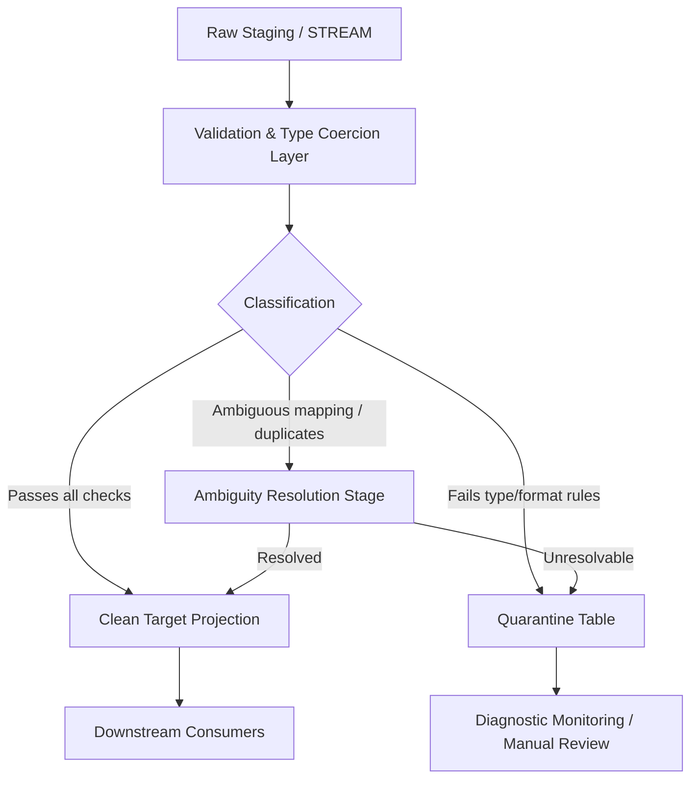

# 1. Title
Handling Erroneous and Ambiguous Data in Snowflake Transformation Pipelines

# 2. Overview
This pattern defines the procedural architecture for detecting, classifying, routing, and resolving malformed, type-mismatched, or semantically ambiguous records during Snowflake ELT/ETL execution. It exists to prevent pipeline termination, enforce data contracts, and maintain auditability when upstream sources violate expected schemas or business rules. The pattern operates in the post-ingestion transformation layer, immediately after raw data is staged. It is consumed by data engineers building resilient pipelines, analytics teams requiring deterministic output, and SnowPro Advanced candidates evaluating error-handling mechanics, engine defaults, and deterministic execution boundaries.

# 3. SQL Object Summary
| Object/Pattern | Type | Purpose | Source Objects/Inputs | Output Objects/Behavior | Execution Mode |
|----------------|------|---------|------------------------|--------------------------|----------------|
| Error/Ambiguity Routing Pipeline | SQL Transformation Pattern | Isolate invalid records, resolve ambiguous mappings, and project clean output | Raw staging tables, semi-structured payloads, inbound streams | `clean_target` (valid records), `quarantine_log` (invalid/ambiguous records with diagnostics) | Batch or incremental via SQL in `TASK` or orchestrator |

# 4. Architecture
The architecture implements a multi-stage validation and routing pipeline. Raw data enters a validation stage where type, format, and business rule checks are applied. Records are classified as valid, erroneous, or ambiguous. Valid records proceed to target projection. Erroneous and ambiguous records are routed to a quarantine table with diagnostic metadata (error type, original payload, evaluation timestamp). The pipeline maintains idempotency by using deterministic keys and upsert patterns for reprocessing quarantined data.

# 5. Data Flow / Process Flow
1. **Ingestion / Staging**
   - Input: Raw records from `COPY INTO`, streams, or external tables
   - Transformation: Schema alignment, semi-structured parsing (`PARSE_JSON`, `FLATTEN`)
   - Output: Uniform staging dataset with raw values preserved
   - Purpose: Preserve source fidelity before validation

2. **Validation & Type Evaluation**
   - Input: Staging dataset
   - Transformation: `TRY_CAST`, regex matching (`REGEXP_LIKE`), domain constraint checks (`BETWEEN`, `IN`, length validation)
   - Output: Validation flags and diagnostic columns per row
   - Purpose: Identify type mismatches, out-of-bounds values, and malformed strings without aborting execution

3. **Ambiguity Resolution**
   - Input: Rows flagged with multiple possible mappings or duplicate business keys
   - Transformation: Window functions (`ROW_NUMBER() OVER (PARTITION BY key ORDER BY load_timestamp DESC)`), `QUALIFY`, priority scoring
   - Output: Single deterministic record per key, with fallback routing for ties
   - Purpose: Resolve non-deterministic joins or duplicate ingestion events

4. **Routing & Projection**
   - Input: Validated and resolved dataset
   - Transformation: Conditional `CASE` routing, `COALESCE` defaulting, final column projection
   - Output: `clean_target` and `quarantine_log`
   - Purpose: Separate deterministic output from diagnostic payloads

# 6. Logical Breakdown
| Component | Responsibility | Inputs | Outputs | Dependencies | Failure Modes / Risks |
|-----------|----------------|--------|---------|--------------|------------------------|
| `staged_raw` CTE | Preserve source state | External table / stage / stream | Untouched raw rows | Upstream ingestion | Schema drift breaks downstream parsing |
| `validation_flags` CTE | Evaluate type/format constraints | `staged_raw` | Boolean flags + error codes | `TRY_CAST`, `REGEXP_LIKE`, domain rules | Overly strict rules reject valid edge cases |
| `ambiguity_resolver` CTE | Deduplicate / resolve ties | `validation_flags` | Ranked rows + `is_ambiguous` flag | `ROW_NUMBER`, `QUALIFY` | Non-deterministic sort order produces unstable results |
| `quarantine_projection` | Route invalid/ambiguous rows | `validation_flags`, `ambiguity_resolver` | `quarantine_log` rows with payload + metadata | `CASE`, `OBJECT_CONSTRUCT` | PII exposure if raw payloads contain sensitive fields |
| `clean_target_projection` | Emit valid dataset | `ambiguity_resolver` (rank = 1, no errors) | Final typed columns | Type casting, default fallbacks | Silent data loss if fallback defaults misalign with business logic |
| `execution_wrapper` | Materialize outputs | All CTEs | `INSERT OVERWRITE` / `MERGE` | Transaction boundaries | Partial writes if transaction aborts mid-execution |

# 7. Data Model
| Object | Role | Important Fields | Grain | Relationships | Null Handling |
|--------|------|------------------|-------|---------------|---------------|
| `raw_staging` | Source ingestion holder | `load_id`, `payload`, `ingest_ts` | Per ingested file/batch row | 1:N to `clean_target` (post-routing) | Preserved as-is from source |
| `clean_target` | Downstream consumer dataset | `business_key`, `typed_col_1`, `status`, `processed_ts` | One row per unique business key | Child of `raw_staging` (filtered) | Rejected rows replaced by `COALESCE` defaults or explicit `NULL` |
| `quarantine_log` | Diagnostic repository | `source_row_id`, `error_type`, `original_payload`, `diagnostic_msg`, `evaluated_ts` | Per invalidated/ambiguous row | Traces back to `raw_staging` via `source_row_id` | `diagnostic_msg` populated on failure; payload stored as `VARIANT` |

Output Grain: One deterministic output row per validated business key in `clean_target`. One diagnostic row per failed or unresolvable record in `quarantine_log`.

# 8. Business Logic
- **Classification Rules**: Records failing `TRY_CAST` or domain constraints are classified as `ERRONEOUS`. Records with duplicate keys or conflicting attribute values are classified as `AMBIGUOUS`.
- **Inclusion Criteria**: `clean_target` includes only rows where all required fields pass validation and ambiguity is resolved deterministically.
- **Exclusion Criteria**: Rows with missing mandatory business keys, structurally broken semi-structured payloads, or unresolvable tie conditions are excluded from `clean_target`.
- **Mapping Logic**: Ambiguous mappings are resolved by deterministic priority: latest ingestion timestamp > highest source confidence score > lexical ordering of source system.
- **Date/Time Logic**: Invalid dates trigger fallback to `NULL` or a configured epoch boundary. Timezone normalization occurs post-validation to prevent parsing conflicts.
- **Prioritization Rules**: `ROW_NUMBER()` partitioning enforces strict ordering. Ties without explicit sort keys are routed to quarantine.
- **Exception Handling**: `COALESCE` applies business-approved defaults for optional nullable fields. Required fields with `NULL` trigger quarantine routing.
- **Exam-Relevant Defaults**: Snowflake enforces strict type coercion unless `TRY_CAST` or `ON_ERROR = 'CONTINUE'` is used. `QUALIFY` filters after window calculation, not during aggregation.

# 9. Transformations
| Source State | Derived State | Rule / Evaluation Logic | Meaning | Impact |
|--------------|---------------|-------------------------|---------|--------|
| `raw_string` | `typed_numeric` | `TRY_CAST(raw_string AS DECIMAL(10,2))` | Safe type conversion without abort | Returns `NULL` on failure; prevents pipeline break |
| `ambiguous_key` | `resolved_key` | `ROW_NUMBER() OVER (PARTITION BY key ORDER BY load_ts DESC)` | Deterministic deduplication | Reduces cardinality; requires explicit `QUALIFY rn = 1` |
| `missing_optional` | `defaulted_value` | `COALESCE(field, 'UNKNOWN')` | Fallback population | Increases null-tolerance; alters downstream aggregations |
| `raw_json` | `extracted_fields` | `payload:customer_id::VARCHAR` | Semi-structured path extraction | May produce `NULL` if path missing; requires `TRY_CAST` for safety |
| `invalid_date` | `flagged_null` | `CASE WHEN TRY_CAST(date_str AS DATE) IS NULL THEN 'INVALID_DATE' ELSE 'VALID' END` | Diagnostic classification | Routes to quarantine; preserves audit trail |

# 10. Parameters / Variables / Configuration
| Name | Type | Purpose | Allowed Values | Default | Where Used | Effect |
|------|------|---------|----------------|---------|------------|--------|
| `COPY INTO ... ON_ERROR` | Load Parameter | Control load failure behavior | `ABORT_STATEMENT`, `SKIP_FILE`, `SKIP_FILE_<num>`, `CONTINUE` | `ABORT_STATEMENT` | Ingestion phase | Determines if bad rows halt load or proceed to staging |
| `ERROR_ON_NONDETERMINISTIC_UPDATE` | Session Parameter | Enforce deterministic DML | `TRUE`, `FALSE` | `TRUE` | `MERGE`/`UPDATE` execution | Prevents silent data skew when target keys match multiple source rows |
| `TIMESTAMP_INPUT_FORMAT` / `DATE_INPUT_FORMAT` | Session Parameter | Define parsing templates | Format strings | Session-level defaults | Date coercion logic | Mismatches cause `TRY_CAST` to return `NULL` |
| `STRICT_JSON_OUTPUT` | Session Parameter | Control semi-structured serialization | `TRUE`, `FALSE` | `TRUE` | Quarantine payload storage | Affects how `VARIANT` is rendered in error logs |

# 11. APIs / Interfaces
| Interface | Invocation Method | Input Structure | Output Structure | Error Behavior | Consumers |
|-----------|-------------------|-----------------|------------------|----------------|-----------|
| `SYSTEM$VALIDATE(stage, pattern)` | SQL Function | Stage name, file pattern | `VALIDATE` output table with parse status, column types, error lines | Returns structured diagnostics; does not halt execution | Data engineers auditing semi-structured loads |
| `ACCOUNT_USAGE.COPY_HISTORY` | System View | Query filter on `LAST_LOAD_TIME`, `TABLE_NAME` | Row-level load status, rejected row count, file metadata | Requires `ACCOUNTADMIN` or `VIEW SERVER STATE` | Pipeline operators monitoring error rates |
| `MERGE INTO ... WHEN MATCHED/NOT MATCHED` | DML Statement | Source/Target join condition | Upserted rows | Fails on deterministic violations if session parameter is `TRUE` | ELT writers implementing idempotent loads |

# 12. Execution / Deployment
- Executed as scheduled SQL via Snowflake `TASK` or external orchestrator (Airflow, dbt, Fivetran).
- Operates in batch or incremental mode. Incremental execution relies on `STREAM` offset tracking or watermark columns (`ingest_ts`).
- Upstream dependency: Successful completion of raw staging load.
- Environment behavior: Dev/test environments may relax quarantine routing thresholds; production enforces strict validation and error logging.
- Runtime assumption: Idempotency is achieved via `MERGE` or `INSERT OVERWRITE` with deterministic keys. Partial execution triggers transaction rollback.

# 13. Observability
- Monitor `quarantine_log` row counts and error type distribution per execution cycle.
- Track `ACCOUNT_USAGE.COPY_HISTORY` for load-stage rejections and `ACCOUNT_USAGE.QUERY_HISTORY` for transformation failures.
- Implement reconciliation query: `SELECT COUNT(*) FROM raw_staging EXCEPT ALL SELECT COUNT(*) FROM clean_target + quarantine_log`. Mismatch indicates dropped rows or unlogged errors.
- Alert on sudden spikes in `ERRONEOUS` or `AMBIGUOUS` classifications, indicating upstream schema drift or source degradation.

# 14. Failure Handling & Recovery
- **Missing source data**: Pipeline skips cycle if staging is empty. Recovery: Trigger backfill from source or replay via `STREAM` offset reset.
- **Duplicate source rows / cardinality skew**: `MERGE` fails if `ERROR_ON_NONDETERMINISTIC_UPDATE = TRUE`. Recovery: Pre-deduplicate using window functions in staging before target load.
- **Invalid types / formats**: `TRY_CAST` returns `NULL`, routing to quarantine. Recovery: Adjust parsing parameters, update validation rules, and reprocess quarantined rows via idempotent replay job.
- **Schema drift**: New columns in raw payload cause extraction errors. Recovery: Extend `FLATTEN` paths or use dynamic semi-structured parsing with fallback `VARIANT` storage.
- **Partial execution / offset drift**: Transaction rollback restores pre-execution state. Recovery: Verify `STREAM` offset integrity and restart pipeline.

# 15. Security & Access Control
- Quarantine tables store raw payloads, which may contain PII or credentials. Apply dynamic data masking (`MASKING POLICY`) or row access policies on `original_payload` and `diagnostic_msg`.
- Role separation: `DATA_ENGINEER` role manages pipeline execution and quarantine review. `ANALYST` role receives read access to `clean_target` only.
- Network restrictions: If using external stages, enforce VPC private links or IP whitelisting. Stage credentials must be stored in named integrations or secrets manager.

# 16. Performance / Scalability Considerations
- `TRY_CAST` and regex validation add CPU overhead on large datasets. Materialize validation results to a transient table before final projection to avoid repeated CTE evaluation.
- Unbounded joins during ambiguity resolution can cause memory spills. Partition by business key and cluster on high-cardinality filter columns.
- Late filtering or non-sargable predicates (e.g., function-wrapped columns in `WHERE`) bypass pruning. Apply validation flags before joins to enable partition elimination.
- `MERGE` operations on large targets with frequent ambiguous matches cause row-by-row evaluation and increased warehouse credits. Pre-deduplicate in staging and use `INSERT OVERWRITE` for batch loads where idempotency permits.

# 17. Assumptions & Constraints
- Assumes deterministic business keys exist in source data or can be derived.
- Assumes upstream systems provide at least one timestamp or sequence for ordering ambiguous records.
- `SYSTEM$VALIDATE` operates only on staged files, not on existing database tables. It cannot be used for post-load validation.
- `COPY INTO ... ON_ERROR = 'CONTINUE'` logs rejected rows to load history but does not automatically populate custom error tables. Manual quarantine routing is required in transformation layer.
- Snowflake engine evaluates `QUALIFY` after window function computation, not during aggregation. Filtering at `QUALIFY` stage does not reduce intermediate memory footprint.
- Exam trap: `ERROR_ON_NONDETERMINISTIC_UPDATE` defaults to `TRUE`. Setting to `FALSE` allows silent data skew but violates deterministic best practices.
- Ambiguity without explicit tie-breaking logic produces non-deterministic output across executions.

# 18. Future Enhancements
- Implement dynamic validation rules stored in metadata tables, evaluated via `EXECUTE IMMEDIATE` or stored procedures to avoid hard-coded `TRY_CAST` chains.
- Add automated quarantine replay tasks that reprocess resolved records after rule updates or source corrections.
- Integrate Snowflake Native Data Quality (data contracts, row-level policies) to enforce schema validation at ingestion boundaries.
- Materialize validation flags into intermediate transient tables with clustering keys on error type to accelerate diagnostic querying.
- Replace manual `CASE` routing with a reusable macro or Python UDF for scalable pattern matching across multiple pipelines.
