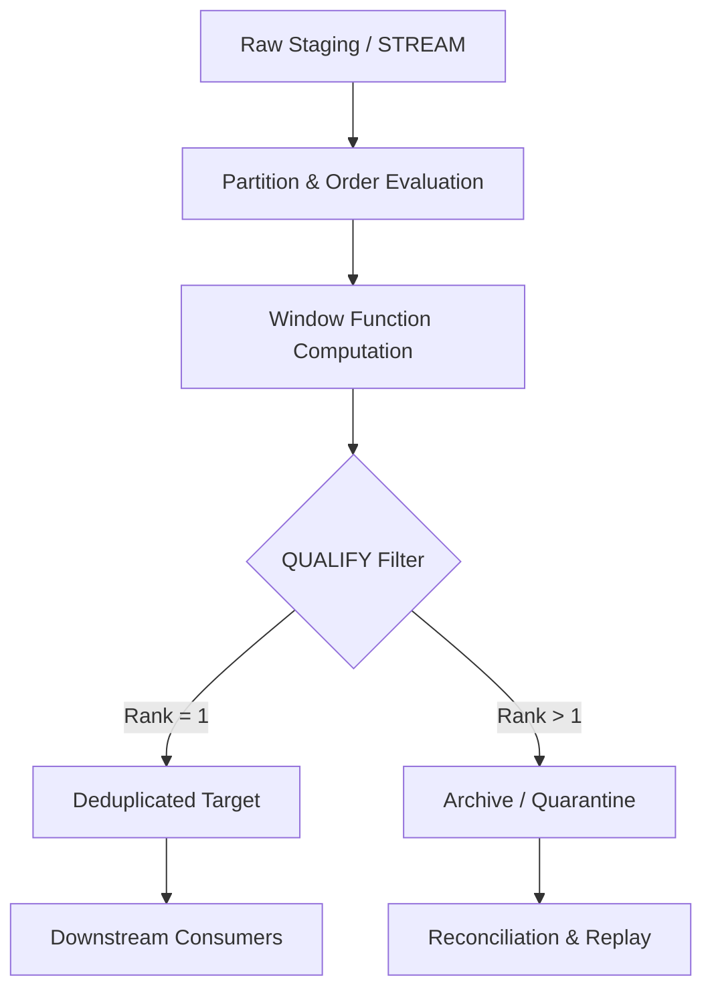

# 1. Title
Deduplication Patterns for Data Cleaning in Snowflake

# 2. Overview
This pattern defines the procedural architecture for identifying, resolving, and removing duplicate records during Snowflake ELT/ETL execution. It exists to enforce primary key uniqueness, prevent aggregation inflation, and maintain idempotent pipeline behavior when upstream sources emit overlapping or replayed events. The pattern operates in the transformation layer, immediately after raw ingestion and before downstream aggregation or reporting. It is consumed by data engineers building resilient pipelines, analytics teams requiring deterministic grain, and SnowPro Advanced candidates evaluating window function mechanics, `QUALIFY` filtering behavior, and `MERGE` constraints.

# 3. SQL Object Summary
| Object/Pattern | Type | Purpose | Source Objects/Inputs | Output Objects/Behavior | Execution Mode |
|----------------|------|---------|------------------------|--------------------------|----------------|
| Deduplication Pipeline | SQL Transformation Pattern | Identify duplicate keys, apply deterministic resolution logic, output unique records | Raw staging tables, incremental `STREAM`s, CDC payloads | `deduplicated_target` (unique grain) | Batch or incremental via `TASK` or orchestrator |

# 4. Architecture
The architecture implements a partition-based evaluation and filtering pipeline. Raw records are grouped by business key, ordered by deterministic precedence criteria, and ranked using window functions. The `QUALIFY` clause filters ranked partitions post-evaluation, emitting exactly one row per key. Discarded duplicates are optionally routed to an audit or archive table for reconciliation.

# 5. Data Flow / Process Flow
1. **Partition & Key Alignment**
   - Input: Raw staging dataset with potential duplicate business keys
   - Transformation: Group rows by composite business key, align metadata columns
   - Output: Logically partitioned dataset ready for ranking
   - Purpose: Establish the deduplication boundary

2. **Order & Window Evaluation**
   - Input: Partitioned dataset
   - Transformation: `ROW_NUMBER() OVER (PARTITION BY key ORDER BY precedence_col DESC)`
   - Output: Integer rank assigned per row within each key partition
   - Purpose: Assign deterministic priority to competing records

3. **Qualification & Routing**
   - Input: Ranked dataset
   - Transformation: `QUALIFY row_num = 1`
   - Output: Single surviving row per key, discarded rows isolated
   - Purpose: Enforce uniqueness without subquery nesting or intermediate materialization

4. **Projection & Materialization**
   - Input: Filtered dataset
   - Transformation: Final column projection, type casting, `MERGE` or `INSERT OVERWRITE`
   - Output: `deduplicated_target` table
   - Purpose: Emit stable, query-optimized output with guaranteed grain

# 6. Logical Breakdown
| Component | Responsibility | Inputs | Outputs | Dependencies | Failure Modes / Risks |
|-----------|----------------|--------|---------|--------------|------------------------|
| `source_partition` | Establish dedup boundary | `raw_staging` | Grouped rows by business key | Composite key definition | Missing key columns produce unbounded partitions |
| `rank_evaluation` | Assign deterministic priority | `source_partition` | Rows with `ROW_NUMBER` value | Explicit `ORDER BY` clause | Non-deterministic sort yields unstable survivor selection |
| `qualification_filter` | Enforce uniqueness | `rank_evaluation` | Surviving rows (`rank = 1`) | `QUALIFY` syntax | Overly broad filters retain duplicates; overly strict drop valid edges |
| `target_materialization` | Persist output | `qualification_filter` | `deduplicated_target` rows | `MERGE` or `INSERT` strategy | Partial transaction rollback if warehouse aborts mid-write |

# 7. Data Model
| Object | Role | Important Fields | Grain | Relationships | Null Handling |
|--------|------|------------------|-------|---------------|---------------|
| `raw_staging` | Ingestion holder | `business_key`, `load_timestamp`, `source_priority`, `payload` | Per ingested event/row | Parent to `deduplicated_target` | Null keys bypass dedup; routed to quarantine or rejected |
| `deduplicated_target` | Downstream dataset | `business_key`, `resolved_attribute_1`, `processed_ts` | One row per unique business key | Child of `raw_staging` (post-filter) | Nullable attributes preserved; keys enforced `NOT NULL` |

Output Grain: Exactly one row per distinct business key in `deduplicated_target`. Grain stability depends on deterministic `ORDER BY` clauses and consistent key definitions across executions.

# 8. Business Logic
- **Classification Rules**: Duplicates are defined as rows sharing identical composite business keys. Near-duplicates (partial key matches) require fuzzy matching or secondary resolution logic outside this pattern.
- **Inclusion Criteria**: `deduplicated_target` includes only the highest-ranked row per key partition, where rank is derived from explicit precedence rules.
- **Exclusion Criteria**: Rows with `NULL` business keys, or rows falling outside the `QUALIFY rank = 1` filter, are excluded from the target.
- **Prioritization Rules**: Precedence is evaluated as: latest `load_timestamp` > highest `source_priority` > lexical tie-breaker. Explicit ordering prevents engine-driven random assignment.
- **Window Frame Semantics**: `ROW_NUMBER()` operates with an implicit frame of `ROWS BETWEEN UNBOUNDED PRECEDING AND UNBOUNDED FOLLOWING` per partition. It does not use sliding frames; full partition evaluation occurs before filtering.
- **Exception Handling**: Ties on all `ORDER BY` columns trigger non-deterministic survivor selection. Engine does not guarantee stability across reruns without unique tie-breakers.
- **Exam-Relevant Defaults**: `QUALIFY` executes after window calculation, not during aggregation. `MERGE INTO` fails with error if a target row matches multiple source rows when `ERROR_ON_NONDETERMINISTIC_UPDATE = TRUE` (default). `GROUP BY` with `ANY_VALUE()` is not a substitute for deterministic deduplication.

# 9. Transformations
| Source State | Derived State | Rule / Evaluation Logic | Meaning | Impact |
|--------------|---------------|-------------------------|---------|--------|
| `duplicate_key_set` | `ranked_partition` | `ROW_NUMBER() OVER (PARTITION BY key ORDER BY ts DESC)` | Assigns 1..N sequence per key | Reduces cardinality; requires explicit sort for determinism |
| `ranked_partition` | `survivor_set` | `QUALIFY row_num = 1` | Filters post-window calculation | Eliminates duplicates without CTE nesting; preserves engine optimization |
| `ambiguous_tie` | `unresolved_set` | `ORDER BY` columns produce identical values | Tie-breaking fails | Non-deterministic output; requires audit logging or secondary key |
| `raw_payload` | `resolved_attributes` | `COALESCE(resolved_val, default_val)` | Fallback for missing survivor attributes | Ensures schema stability; alters downstream aggregation totals |

# 10. Parameters / Variables / Configuration
| Name | Type | Purpose | Allowed Values | Default | Where Used | Effect |
|------|------|---------|----------------|---------|------------|--------|
| `ERROR_ON_NONDETERMINISTIC_UPDATE` | Session Parameter | Enforce deterministic DML | `TRUE`, `FALSE` | `TRUE` | `MERGE INTO` execution | Prevents silent data skew; fails if target key matches multiple source rows |
| `USE_CACHED_RESULT` | Session Parameter | Control result reuse | `TRUE`, `FALSE` | `TRUE` | Query execution | Bypasses cache if transformation logic includes non-deterministic functions |
| `WAREHOUSE_SIZE` | Object Setting | Allocate compute for window evaluation | X-Small to 6X-Large | X-Small | Pipeline execution | Insufficient sizing causes disk spill during large partition scans |
| `STREAM` Offset Tracking | Object State | Track consumed rows | `INSERT_ONLY` or `APPEND_ONLY` | `APPEND_ONLY` | Incremental loads | `INSERT_ONLY` marks duplicates as consumed; `APPEND_ONLY` replays them |

# 11. APIs / Interfaces
| Interface | Invocation Method | Input Structure | Output Structure | Error Behavior | Consumers |
|-----------|-------------------|-----------------|------------------|----------------|-----------|
| `QUALIFY` Clause | SQL Syntax Extension | Window function expression | Filtered row set | Fails if window function missing or malformed | Transformation engineers, exam candidates |
| `MERGE INTO ... WHEN MATCHED/NOT MATCHED` | DML Statement | Source/Target join on business key | Upserted rows | Fails on non-deterministic match if session param `TRUE` | ELT developers implementing idempotent loads |
| `SYSTEM$STREAM_HAS_DATA` | SQL Function | Stream name | `TRUE`/`FALSE` | Returns `FALSE` if stream exhausted | Orchestrators scheduling incremental dedup jobs |

# 12. Execution / Deployment
- Executed via scheduled `TASK` or external orchestrator. Incremental execution leverages `STREAM` offset tracking or watermark columns.
- Batch execution uses `INSERT OVERWRITE` or `TRUNCATE` + `INSERT` for full rebuilds. Incremental execution uses `MERGE` with `ROW_NUMBER()` applied to new stream data joined against target.
- Upstream dependency: Successful raw load completion and stream offset commitment.
- Environment behavior: Dev/test may disable strict non-deterministic checks; production enforces `ERROR_ON_NONDETERMINISTIC_UPDATE = TRUE` and mandates explicit tie-breakers.
- Runtime assumption: Idempotency is guaranteed when partition keys, ordering columns, and window logic remain static across executions.

# 13. Observability
- Track pre-deduplication vs post-deduplication row counts per execution: `SELECT COUNT(*) FROM staging; SELECT COUNT(*) FROM target;`
- Monitor duplicate frequency by querying `SELECT business_key, COUNT(*) FROM staging GROUP BY 1 HAVING COUNT(*) > 1`.
- Use `ACCOUNT_USAGE.QUERY_HISTORY` to identify execution spikes or disk spill events during window evaluation.
- Alert on sudden increases in duplicate ratios, indicating upstream replay, CDC configuration drift, or failed stream offset commits.

# 14. Failure Handling & Recovery
- **Non-deterministic sort / missing tie-breaker**: `ROW_NUMBER()` assigns arbitrary survivors across reruns. Detection: Compare target checksums across executions. Recovery: Add unique column (e.g., `ingest_seq` or `microsecond_timestamp`) to `ORDER BY`.
- **Stream offset reset / replay**: Duplicate rows re-enter pipeline. Detection: `STREAM` offset drift or manual `ALTER STREAM ... REFRESH`. Recovery: Rerun dedup logic; `MERGE` handles duplicates gracefully if `QUALIFY` is applied before join.
- **Join explosion in incremental MERGE**: Multiple source rows match single target row. Detection: `MERGE` fails with non-deterministic error. Recovery: Pre-deduplicate source using `QUALIFY` before `MERGE` join.
- **Schema drift / missing key columns**: Partition boundary collapses. Detection: Query fails with `invalid identifier`. Recovery: Validate staging schema before execution; route malformed rows to quarantine.

# 15. Security & Access Control
- Archived duplicate rows may contain historical PII. Apply `MASKING POLICY` or `ROW ACCESS POLICY` to quarantine tables.
- Role separation: `DATA_ENGINEER` role manages dedup pipeline execution and archive review. `ANALYST` role receives read-only access to `deduplicated_target`.
- Audit compliance: Retain quarantine records per data governance SLA. Implement time travel or archival table cloning for long-term retention.

# 16. Performance / Scalability Considerations
- Large partitions without clustering cause full partition scans during window evaluation, triggering disk spill. Cluster staging tables on `business_key` to align micro-partitions with dedup boundaries.
- Late filtering or non-sargable predicates in `ORDER BY` bypass partition pruning. Apply lightweight filters before window evaluation to reduce intermediate memory footprint.
- `QUALIFY` does not reduce intermediate computation cost; it filters after full partition ranking. Materialize heavy window results to transient tables if reused across multiple downstream queries.
- `MERGE` on large targets with high duplicate volume causes row-by-row evaluation and increased warehouse credits. Pre-aggregate or pre-deduplicate in staging, and use `INSERT OVERWRITE` for batch loads where idempotency permits.

# 17. Assumptions & Constraints
- Assumes composite business keys are stable and consistently populated. Null keys bypass dedup and require separate handling.
- Assumes upstream sources provide at least one monotonic or timestamp column for deterministic ordering. Without it, survivor selection is non-deterministic.
- `QUALIFY` is evaluated after window function computation. It cannot reference aliased columns from the `SELECT` list unless defined in the same query block.
- `ERROR_ON_NONDETERMINISTIC_UPDATE` defaults to `TRUE`. Setting to `FALSE` allows silent data skew but violates deterministic pipeline contracts.
- `STREAM` offset tracking does not automatically deduplicate. It marks rows as consumed based on transaction boundaries, not logical keys.
- Exam trap: `ROW_NUMBER()` is non-deterministic when `ORDER BY` columns produce ties. `RANK()` and `DENSE_RANK()` share the same rank on ties, making them unsuitable for strict deduplication without secondary tie-breakers.
- Window functions cannot push down to storage pruning. Filtering must occur before `OVER()` to reduce scanned micro-partitions.

# 18. Future Enhancements
- Implement dynamic tie-breaking logic stored in metadata tables, evaluated via parameterized CTEs to avoid hard-coded `ORDER BY` chains.
- Introduce configurable duplicate thresholds (e.g., allow 2 rows for specific sources) via policy-driven `QUALIFY` conditions.
- Leverage Snowflake dynamic tables with `REFRESH` scheduling to automate deduplication without manual task orchestration.
- Replace manual archive routing with Snowflake data contracts to enforce schema validation and duplicate rejection at ingestion boundaries.
- Add automated reconciliation tasks that compare `staging` and `target` checksums, triggering alerts on unexpected grain divergence.
