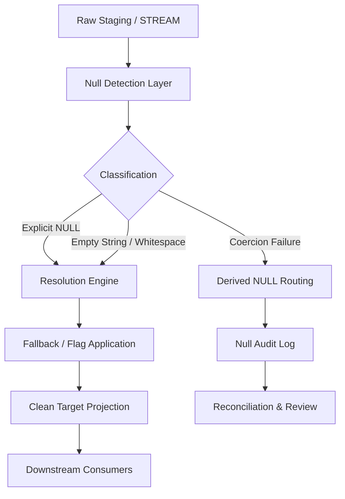

# 1. Title
Null Handling and Resolution Patterns in Snowflake Transformation Pipelines

# 2. Overview
This pattern defines the procedural architecture for detecting, classifying, routing, and resolving `NULL` values during Snowflake ELT/ETL execution. It exists to prevent aggregation distortion, join mismatches, type coercion failures, and silent data loss when upstream sources emit missing, explicitly null, or semantically empty values. The pattern operates in the transformation layer, immediately after raw ingestion and before downstream reporting or modeling. It is consumed by data engineers building deterministic pipelines, analytics teams requiring accurate aggregations, and SnowPro Advanced candidates evaluating `NULL` semantics, aggregation behavior, and engine execution boundaries.

# 3. SQL Object Summary
| Object/Pattern | Type | Purpose | Source Objects/Inputs | Output Objects/Behavior | Execution Mode |
|----------------|------|---------|------------------------|--------------------------|----------------|
| Null Resolution Pipeline | SQL Transformation Pattern | Identify missing/explicit/derived nulls, apply deterministic fallbacks, route unresolved cases | Raw staging tables, semi-structured payloads, inbound streams | `null_resolved_target` (cleaned rows), `null_audit_log` (diagnostic routing) | Batch or incremental via `TASK` or orchestrator |

# 4. Architecture
The architecture implements a three-stage evaluation pipeline. Raw data enters a detection phase where structural and semantic null conditions are evaluated. Records are classified by null origin (missing, explicit, empty-string, or coercion-derived). A resolution stage applies deterministic fallbacks, flags, or quarantine routing based on business contracts. The pipeline outputs a clean dataset with explicit null state metadata and an audit log for reconciliation.

# 5. Data Flow / Process Flow
1. **Null Detection & Type Evaluation**
   - Input: Staging dataset with raw values
   - Transformation: `IS NULL` checks, empty-string regex (`REGEXP_LIKE(col, '^\s*$')`), `TRY_CAST` evaluation
   - Output: Boolean flags per column indicating null state origin
   - Purpose: Distinguish between structurally missing values and semantically empty placeholders

2. **Classification & Routing**
   - Input: Flagged dataset
   - Transformation: `CASE` evaluation mapping flags to `EXPLICIT`, `EMPTY_STRING`, `COERCION_FAILURE`, or `VALID`
   - Output: Classification column + diagnostic payload
   - Purpose: Enable deterministic resolution policies per null origin

3. **Resolution & Fallback Application**
   - Input: Classified dataset
   - Transformation: `COALESCE`, `NULLIF`, conditional `CASE`, type-safe defaults
   - Output: Resolved columns + resolution metadata
   - Purpose: Replace or flag nulls according to business contracts without altering valid data

4. **Projection & Materialization**
   - Input: Resolved dataset
   - Transformation: Final column projection, `NOT NULL` constraint enforcement where applicable, `MERGE` or `INSERT`
   - Output: `null_resolved_target`, `null_audit_log`
   - Purpose: Emit stable output with explicit null state tracking

# 6. Logical Breakdown
| Component | Responsibility | Inputs | Outputs | Dependencies | Failure Modes / Risks |
|-----------|----------------|--------|---------|--------------|------------------------|
| `null_detection` | Identify structural & semantic nulls | `raw_staging` | Boolean null flags per column | `IS NULL`, `TRY_CAST`, regex | Overly broad empty-string checks mask valid whitespace |
| `classification_router` | Map null origin to business category | Null flags | `null_origin` enum column | `CASE` logic | Missing categories route to incorrect fallback |
| `resolution_engine` | Apply deterministic fallbacks | Classified rows | Resolved values + resolution flags | `COALESCE`, `NULLIF`, defaults | Default values misalign with downstream business logic |
| `audit_projection` | Capture unresolved or flagged nulls | Classified rows | `null_audit_log` rows | `INSERT` into audit table | Audit table growth without retention policy |
| `target_materialization` | Persist clean output | Resolved rows | `null_resolved_target` | `MERGE`/`INSERT`, constraints | Partial transaction rollback on constraint violation |

# 7. Data Model
| Object | Role | Important Fields | Grain | Relationships | Null Handling |
|--------|------|------------------|-------|---------------|---------------|
| `raw_staging` | Ingestion holder | `business_key`, `col_1`, `col_2`, `payload`, `ingest_ts` | Per ingested row | Parent to target | Preserved as-is from source |
| `null_resolved_target` | Downstream dataset | `business_key`, `resolved_col_1`, `null_resolution_flag`, `processed_ts` | One row per business key | Child of staging | `resolved_col_1` enforces business defaults; flags track resolution path |
| `null_audit_log` | Diagnostic repository | `source_row_id`, `column_name`, `null_origin`, `original_value`, `resolution_applied`, `evaluated_ts` | Per resolved/flagged column | Traces to staging via `source_row_id` | Stores raw payload for replay; no nulls in diagnostic metadata |

Output Grain: One deterministic row per business key in `null_resolved_target`. Each column carries an explicit resolution state. One audit row per flagged column in `null_audit_log`.

# 8. Business Logic
- **Classification Rules**: `NULL` literals are `EXPLICIT`. Empty strings/whitespace are `SEMANTIC_NULL`. Failed `TRY_CAST` evaluations are `COERCION_NULL`.
- **Inclusion Criteria**: `null_resolved_target` includes all rows. Missing mandatory values receive business-approved defaults. Optional values receive `NULL` or `UNKNOWN` placeholders based on domain rules.
- **Exclusion Criteria**: Rows with unresolvable nulls in mandatory business keys are routed to quarantine or audit. They are excluded from clean target projection.
- **Mapping Logic**: `COALESCE` applies fallback hierarchy: source value > system default > domain placeholder. `NULLIF` suppresses placeholder values that must be treated as null.
- **Aggregation & Join Semantics**: `COUNT(col)` excludes nulls; `COUNT(*)` includes all rows. `JOIN` on null keys never matches (`NULL = NULL` evaluates to `UNKNOWN`). `GROUP BY` treats nulls as a single grouping bucket.
- **Exception Handling**: Unresolvable nulls trigger `NULL` propagation or explicit `ERROR_FLAG`. Downstream queries must handle `UNKNOWN` in boolean predicates using `IS [NOT] DISTINCT FROM`.
- **Exam-Relevant Defaults**: `COALESCE` short-circuits on first non-null. `IFNULL` and `NVL` are functionally identical to `COALESCE` for two arguments. `NULLIF(a, b)` returns `NULL` if `a = b`, else `a`; both arguments are fully evaluated before comparison.

# 9. Transformations
| Source State | Derived State | Rule / Evaluation Logic | Meaning | Impact |
|--------------|---------------|-------------------------|---------|--------|
| `explicit_null` | `defaulted_value` | `COALESCE(col, 'UNKNOWN')` | Fallback population for missing data | Prevents `COUNT` distortion; alters downstream joins if not flagged |
| `empty_string` | `null_literal` | `NULLIF(TRIM(col), '')` | Semantic normalization | Aligns string empties with relational null semantics |
| `coercion_failure` | `null_with_flag` | `TRY_CAST(col AS INT)` + `CASE WHEN IS NULL THEN 'TYPE_FAIL' END` | Safe type conversion | Prevents query abort; requires audit routing |
| `ambiguous_null` | `flagged_null` | `CASE WHEN col IS NULL AND source IS NOT NULL THEN 'MISSING' END` | Origin tracking | Enables reconciliation; increases storage by flag column |
| `join_key_null` | `unmatched_routing` | `LEFT JOIN ... ON IS NOT DISTINCT FROM key` or `NULL` filter | Controlled join behavior | Prevents silent row drops or cartesian matches |

# 10. Parameters / Variables / Configuration
| Name | Type | Purpose | Allowed Values | Default | Where Used | Effect |
|------|------|---------|----------------|---------|------------|--------|
| `NULL_IF` | COPY Parameter | Map source strings to `NULL` during load | String literals (comma-separated) | None | `COPY INTO` | Converts specified tokens to `NULL` before staging |
| `NULL_DISPLAY` | Session Parameter | Control UI/console null rendering | String token | `[NULL]` | Query output | Cosmetic only; does not affect execution or storage |
| `STRICT_JSON_OUTPUT` | Session Parameter | Control `VARIANT` null serialization | `TRUE`, `FALSE` | `TRUE` | Semi-structured parsing | Affects how `NULL` vs missing keys appear in `FLATTEN` |
| `ERROR_ON_NONDETERMINISTIC_UPDATE` | Session Parameter | Enforce deterministic DML | `TRUE`, `FALSE` | `TRUE` | `MERGE` execution | Prevents silent skew when null keys cause ambiguous matches |

# 11. APIs / Interfaces
| Interface | Invocation Method | Input Structure | Output Structure | Error Behavior | Consumers |
|-----------|-------------------|-----------------|------------------|----------------|-----------|
| `COALESCE` / `IFNULL` / `NVL` | SQL Function | Variable number of expressions | First non-null expression | Short-circuits evaluation; stops at first match | Transformation engineers |
| `NULLIF` | SQL Function | Two expressions | `NULL` if equal, else first arg | Both args fully evaluated; returns `NULL` on equality | Placeholder suppression logic |
| `IS [NOT] DISTINCT FROM` | SQL Operator | Two operands | `TRUE`/`FALSE` | Treats `NULL = NULL` as `TRUE` | Null-safe joins & filters |
| `ACCOUNT_USAGE.COPY_HISTORY` | System View | Query filter | Load metrics, rejected rows, null counts | Requires appropriate privileges | Pipeline operators monitoring null influx |

# 12. Execution / Deployment
- Executed via scheduled `TASK` or external orchestrator. Incremental execution leverages `STREAM` offsets or watermark columns.
- Batch execution uses `INSERT OVERWRITE` for full rebuilds. Incremental execution applies null resolution to new data before `MERGE` into target.
- Upstream dependency: Successful raw load completion. Null detection requires stable staging schema.
- Environment behavior: Dev/test may use relaxed defaults; production enforces strict null contracts and mandatory audit routing for critical keys.
- Runtime assumption: Idempotency requires deterministic fallback logic and consistent `COALESCE` ordering across executions.

# 13. Observability
- Track null ratios per column: `SELECT COUNT(*) - COUNT(col) AS null_count FROM staging;`
- Monitor resolution distribution: `SELECT null_origin, COUNT(*) FROM null_audit_log GROUP BY 1;`
- Use `ACCOUNT_USAGE.QUERY_HISTORY` to identify queries with excessive `IS NULL` scans or late filtering.
- Alert on sudden spikes in `COERCION_NULL` or `EXPLICIT` ratios, indicating upstream schema changes or ingestion degradation.
- Implement reconciliation: Compare pre-resolution and post-resolution row counts. Mismatches indicate unintended filtering or join drops.

# 14. Failure Handling & Recovery
- **Missing columns / schema drift**: `IS NULL` checks fail with `invalid identifier`. Detection: Pre-execution schema validation. Recovery: Add dynamic column detection or fallback to `VARIANT` parsing.
- **Null keys breaking joins**: `JOIN` on null keys produces zero matches. Detection: Post-join row count mismatch. Recovery: Use `IS DISTINCT FROM` for null-safe joins or pre-filter null keys.
- **Silent aggregation drops**: `COUNT(col)` or `SUM(col)` ignores nulls, skewing metrics. Detection: Cross-validate `COUNT(*)` vs `COUNT(col)`. Recovery: Explicitly handle nulls via `COALESCE` before aggregation.
- **Type coercion failures**: `TRY_CAST` returns `NULL`, masking data quality issues. Detection: Audit log spikes. Recovery: Adjust parsing rules, update source contracts, replay validated records.
- **Constraint violations**: `NOT NULL` target columns reject resolved nulls. Detection: `MERGE`/`INSERT` fails. Recovery: Strengthen fallback hierarchy or relax constraints with explicit audit flags.

# 15. Security & Access Control
- Audit logs may contain raw payloads with PII. Apply `MASKING POLICY` or `ROW ACCESS POLICY` to `null_audit_log`.
- Role separation: `DATA_ENGINEER` manages resolution logic and audit review. `ANALYST` receives read access to `null_resolved_target` only.
- Network restrictions: If using external stages, enforce secure data transfer. Stage credentials must use named integrations.
- Compliance: Retain audit logs per governance SLA. Implement time travel or archival cloning for long-term null state tracking.

# 16. Performance / Scalability Considerations
- `COALESCE` short-circuits, but complex nested fallbacks increase CPU evaluation cost. Simplify chains and materialize intermediate results for reuse.
- `IS NULL` predicates are sargable but do not leverage micro-partition pruning on unclustered columns. Cluster on high-cardinality nullable columns to align storage with filter patterns.
- Late null filtering or function-wrapped null checks bypass pruning. Apply null classification before joins or aggregations to reduce intermediate memory footprint.
- `GROUP BY` on nullable columns forces full partition scans when nulls are sparse. Pre-aggregate or partition by null flag to isolate null-heavy buckets.
- `MERGE` with null join keys causes row-by-row evaluation and potential warehouse spill. Pre-filter null keys or use `INSERT OVERWRITE` for batch loads.

# 17. Assumptions & Constraints
- Assumes business contracts define explicit fallbacks for mandatory fields. Without contracts, null handling defaults to arbitrary `COALESCE` ordering.
- Assumes upstream ingestion does not silently drop rows with null keys. Row count integrity requires staging-level audit before transformation.
- `NULL = NULL` evaluates to `UNKNOWN`, not `TRUE`. Standard equality operators cannot match nulls. Use `IS NOT DISTINCT FROM` for null-safe comparisons.
- `COUNT(col)` excludes nulls; `COUNT(*)` includes all rows. Aggregation distortion occurs when nulls are not explicitly handled.
- `GROUP BY` treats all nulls as a single group. Nulls are not scattered across multiple buckets.
- `COALESCE` stops evaluation at the first non-null argument. Subsequent arguments are not executed.
- `NULLIF(a, b)` evaluates both arguments before comparison. Returns `NULL` if equal, else `a`. It does not short-circuit.
- `TRY_CAST` returns `NULL` on failure; it does not raise errors. Coercion nulls require explicit audit routing to prevent silent data loss.
- Exam trap: `NULL` propagates through arithmetic and string concatenation unless explicitly handled. `1 + NULL` = `NULL`. `'A' || NULL` = `'A'` (Snowflake specific string concatenation behavior differs from strict ANSI; verify session setting `CONCAT_NULLS_YIELDS_NULL`).

# 18. Future Enhancements
- Implement dynamic null policies stored in metadata tables, evaluated via parameterized CTEs to avoid hard-coded `COALESCE` chains.
- Integrate Snowflake data contracts to enforce `NOT NULL` constraints at ingestion boundaries, pushing null handling upstream.
- Replace manual audit routing with automated data quality checks using Snowflake Native Data Quality features.
- Materialize null resolution results into clustered transient tables to accelerate downstream query pruning and reduce repeated `IS NULL` scans.
- Add configurable null tolerance thresholds per source system, triggering alerts or fallback routing when null ratios exceed business limits.
