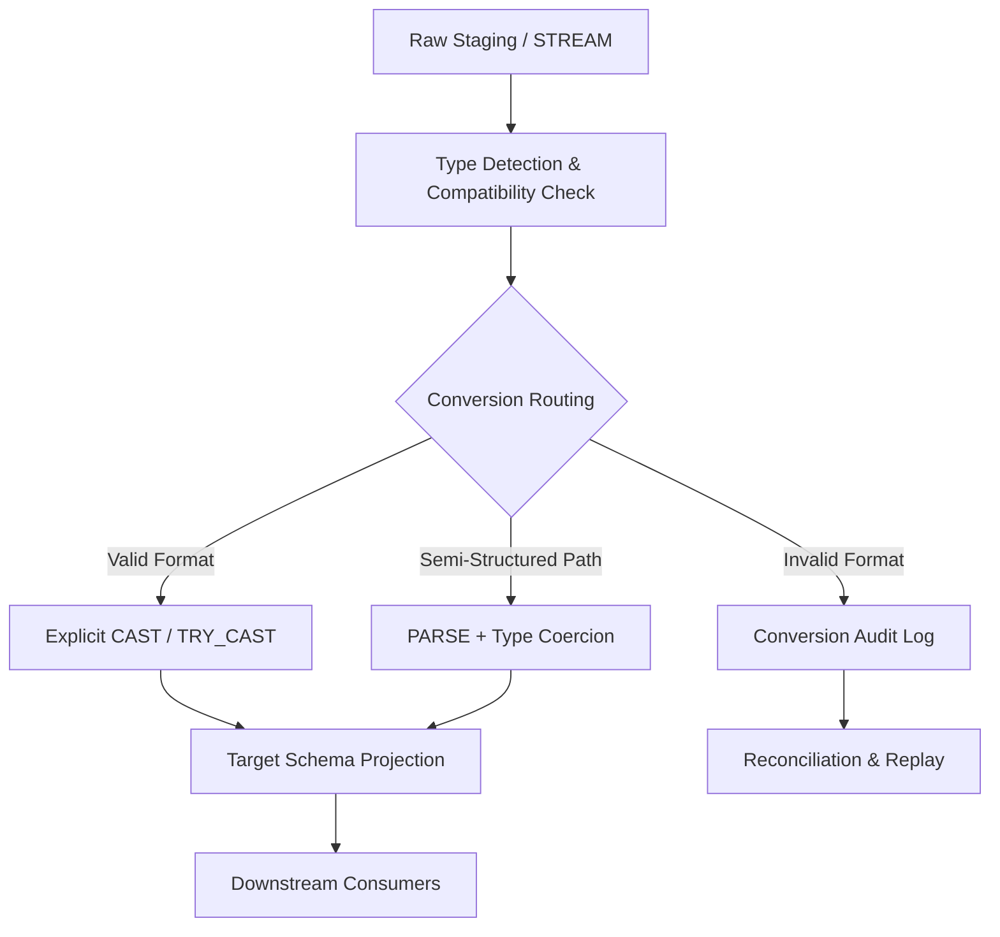

# 1. Title
Data Type Conversion and Coercion Patterns in Snowflake Transformation Pipelines

# 2. Overview
This pattern defines the procedural architecture for explicit and implicit type conversion during Snowflake ELT/ETL execution. It exists to enforce schema contracts, prevent runtime evaluation errors, resolve source heterogeneity, and enable deterministic downstream aggregation or modeling. The pattern operates in the transformation layer, immediately after raw ingestion and before business logic application. It is consumed by data engineers building schema-stable pipelines, analytics teams requiring type-safe joins and aggregations, and SnowPro Advanced candidates evaluating conversion semantics, precision boundaries, and engine execution rules.

# 3. SQL Object Summary
| Object/Pattern | Type | Purpose | Source Objects/Inputs | Output Objects/Behavior | Execution Mode |
|----------------|------|---------|------------------------|--------------------------|----------------|
| Type Conversion Pipeline | SQL Transformation Pattern | Detect mismatched types, apply explicit/implicit casting, route invalid conversions | Raw staging tables, semi-structured payloads, inbound streams | `type_resolved_target` (schema-compliant rows), `conversion_audit_log` (failed/ambiguous conversions) | Batch or incremental via `TASK` or orchestrator |

# 4. Architecture
The architecture implements a staged type evaluation and routing pipeline. Raw data enters a type detection phase where format, length, and semantic compatibility are assessed. Conversion functions are applied based on target schema requirements. Successful conversions proceed to target projection. Failed or ambiguous conversions are isolated with diagnostic metadata for reconciliation. The pipeline maintains deterministic output by prioritizing explicit casting over implicit engine coercion.

# 5. Data Flow / Process Flow
1. **Type Detection & Format Validation**
   - Input: Staging dataset with heterogeneous source types
   - Transformation: `TRY_CAST` evaluation, regex pattern matching, length/precision checks
   - Output: Boolean validity flags per column + format classification
   - Purpose: Identify convertible vs unconvertible values before applying target schema

2. **Explicit Conversion Application**
   - Input: Validated dataset
   - Transformation: `CAST`, `::` operator, or `TO_*` functions applied per column
   - Output: Typed columns aligned to target schema
   - Purpose: Enforce deterministic conversion without relying on implicit engine behavior

3. **Error Routing & Audit Capture**
   - Input: Rows where conversion returns `NULL` or fails validation
   - Transformation: `CASE` routing, `OBJECT_CONSTRUCT` payload capture, error code assignment
   - Output: `conversion_audit_log` entries
   - Purpose: Preserve failed conversions for manual review or automated replay

4. **Projection & Materialization**
   - Input: Successfully converted dataset
   - Transformation: Final `SELECT`, `NOT NULL` constraint enforcement, `MERGE` or `INSERT`
   - Output: `type_resolved_target`
   - Purpose: Emit stable, query-optimized output with guaranteed schema compliance

# 6. Logical Breakdown
| Component | Responsibility | Inputs | Outputs | Dependencies | Failure Modes / Risks |
|-----------|----------------|--------|---------|--------------|------------------------|
| `format_validator` | Detect convertible patterns | `raw_staging` | Validity flags + error codes | `REGEXP_LIKE`, `TRY_CAST`, length checks | Overly permissive regex allows partial matches to pass |
| `explicit_cast_layer` | Apply deterministic type conversion | Validated rows | Typed columns | `CAST`, `TO_DATE`, `TO_NUMBER`, `::` | Implicit fallback causes silent precision loss |
| `semi_structured_parser` | Extract and cast JSON/Array paths | `VARIANT` payloads | Scalar typed fields | `PARSE_JSON`, path extraction (`:field::TYPE`) | Missing paths return `NULL`; array extraction causes row explosion |
| `error_router` | Isolate unconvertible records | Failed conversions | `conversion_audit_log` | `INSERT`, payload capture | Log table growth without retention policy |
| `target_projection` | Materialize clean schema | Converted rows | `type_resolved_target` | `MERGE`/`INSERT`, constraints | Constraint violations abort transaction mid-write |

# 7. Data Model
| Object | Role | Important Fields | Grain | Relationships | Null Handling |
|--------|------|------------------|-------|---------------|---------------|
| `raw_staging` | Ingestion holder | `business_key`, `raw_value`, `source_type`, `ingest_ts` | Per ingested row | Parent to target | Preserved as-is; `VARIANT` for semi-structured |
| `type_resolved_target` | Downstream dataset | `business_key`, `converted_numeric`, `converted_date`, `conversion_flag`, `processed_ts` | One row per business key | Child of staging | Unconvertible mandatory fields route to audit; optional fields default to `NULL` |
| `conversion_audit_log` | Diagnostic repository | `source_row_id`, `column_name`, `original_value`, `attempted_type`, `error_code`, `evaluated_ts` | Per failed conversion | Traces to staging via `source_row_id` | Stores raw payload as `VARIANT`; metadata fields enforced `NOT NULL` |

Output Grain: Exactly one row per business key in `type_resolved_target` with fully resolved types. One audit row per failed or ambiguous conversion in `conversion_audit_log`.

# 8. Business Logic
- **Classification Rules**: Values passing `TRY_CAST` or format validation are `CONVERTIBLE`. Values failing type coercion or precision boundaries are `UNCONVERTIBLE`. Semi-structured paths missing from source are `ABSENT`.
- **Inclusion Criteria**: `type_resolved_target` includes only rows where mandatory target fields pass explicit conversion. Optional fields receive `NULL` or business-approved defaults.
- **Exclusion Criteria**: Rows with unconvertible mandatory keys or precision overflow are excluded from target and routed to audit.
- **Mapping Logic**: `CAST` and `::` enforce explicit conversion. `TO_DATE`, `TO_NUMBER`, and `TO_TIMESTAMP` apply format-specific parsing when string inputs deviate from session defaults.
- **Precision & Scale Rules**: Numeric conversions truncate excess fractional digits by default. Explicit `ROUND` or `TRUNC` is required for deterministic rounding. Overflow triggers conversion failure unless handled by `TRY_CAST`.
- **Date/Time Logic**: String-to-date conversion relies on `TIMESTAMP_INPUT_FORMAT` session parameter. Missing timezone info inherits session timezone. `CONVERT_TIMEZONE` normalizes to UTC or target zone post-cast.
- **Semi-Structured Logic**: `payload:field::TYPE` extracts and casts in a single operation. Missing paths return `NULL` rather than error. Array extraction (`payload:arr[0]`) flattens or indexes before casting.
- **Exam-Relevant Defaults**: `TRY_CAST` returns `NULL` on failure; it does not raise errors. `CAST` throws `numeric value out of range` or `invalid character` errors on mismatch. Implicit conversion is deprecated for production pipelines due to non-deterministic sort order and precision loss. `STRICT_JSON_OUTPUT = TRUE` is default and affects how `VARIANT` nulls serialize.

# 9. Transformations
| Source State | Derived State | Rule / Evaluation Logic | Meaning | Impact |
|--------------|---------------|-------------------------|---------|--------|
| `raw_string_numeric` | `typed_decimal` | `TRY_CAST(raw_string AS DECIMAL(10,2))` | Safe numeric conversion | Returns `NULL` on format mismatch; prevents query abort |
| `iso_date_string` | `typed_date` | `TO_DATE(raw_date, 'YYYY-MM-DD')` | Explicit format parsing | Overrides session default; ensures timezone consistency |
| `variant_path` | `typed_scalar` | `payload:customer_id::VARCHAR` | Semi-structured extraction | Fails gracefully if path missing; returns `NULL` |
| `high_precision_string` | `truncated_numeric` | `CAST(raw_val AS NUMBER(10,2))` | Precision enforcement | Truncates fractional digits; may alter aggregation totals |
| `invalid_cast` | `flagged_null` | `CASE WHEN TRY_CAST(val AS INT) IS NULL THEN 'FORMAT_FAIL' END` | Diagnostic routing | Preserves audit trail; increases storage by flag column |

# 10. Parameters / Variables / Configuration
| Name | Type | Purpose | Allowed Values | Default | Where Used | Effect |
|------|------|---------|----------------|---------|------------|--------|
| `TIMESTAMP_INPUT_FORMAT` | Session Parameter | Define default date/time parsing pattern | Format strings (e.g., `YYYY-MM-DD HH24:MI:SS`) | Auto-detect or session default | `TO_TIMESTAMP`, implicit date casts | Mismatch causes `TRY_CAST` to return `NULL` |
| `STRICT_JSON_OUTPUT` | Session Parameter | Control `VARIANT` serialization behavior | `TRUE`, `FALSE` | `TRUE` | Semi-structured parsing & logging | Affects `NULL` vs missing key representation |
| `DATE_OUTPUT_FORMAT` / `TIME_OUTPUT_FORMAT` | Session Parameter | Define display format for typed results | Format strings | `YYYY-MM-DD`, `HH24:MI:SS` | Query output, BI export | Cosmetic only; does not affect storage or execution |
| `CLIENT_TIMESTAMP_TYPE_MAPPING` | Session Parameter | Control client-side timestamp resolution | `TIMESTAMP_NTZ`, `TIMESTAMP_LTZ`, `TIMESTAMP_TZ` | `TIMESTAMP_NTZ` | Client applications, drivers | Alters timezone interpretation during ingestion |
| `ERROR_ON_NONDETERMINISTIC_UPDATE` | Session Parameter | Enforce deterministic DML | `TRUE`, `FALSE` | `TRUE` | `MERGE` execution | Prevents silent skew when conversion failures cause ambiguous matches |

# 11. APIs / Interfaces
| Interface | Invocation Method | Input Structure | Output Structure | Error Behavior | Consumers |
|-----------|-------------------|-----------------|------------------|----------------|-----------|
| `CAST(expr AS type)` | SQL Function | Expression + target type | Converted value | Throws error on mismatch/overflow | Explicit schema enforcement |
| `TRY_CAST(expr AS type)` | SQL Function | Expression + target type | Converted value or `NULL` | Returns `NULL` on failure; never aborts | Safe conversion in transformation layer |
| `::type` Operator | SQL Syntax | Expression | Converted value | Same as `CAST` | Shorthand explicit conversion |
| `PARSE_JSON(str)` | SQL Function | String containing JSON | `VARIANT` object | Returns `NULL` on invalid JSON | Semi-structured ingestion prep |
| `SYSTEM$TYPE_CONVERSION_CHECK` | Not Available | N/A | N/A | N/A | N/A |

# 12. Execution / Deployment
- Executed via scheduled `TASK` or external orchestrator. Incremental execution leverages `STREAM` offsets or watermark columns.
- Batch execution uses `INSERT OVERWRITE` for full schema rebuilds. Incremental execution applies type resolution to new data before `MERGE` into target.
- Upstream dependency: Successful raw load completion and stable staging schema.
- Environment behavior: Dev/test may use implicit conversion for rapid iteration; production mandates explicit `CAST`/`TRY_CAST` and enforces conversion audit routing.
- Runtime assumption: Idempotency requires deterministic conversion logic and consistent `CAST` ordering across executions. Partial transaction rollback restores pre-execution state.

# 13. Observability
- Track conversion success/failure ratios: `SELECT COUNT(*) - COUNT(converted_col) AS failed_casts FROM staging;`
- Monitor audit log distribution by `error_code` and `attempted_type`.
- Use `ACCOUNT_USAGE.QUERY_HISTORY` to identify queries with frequent type mismatch errors or late filtering.
- Implement reconciliation: Compare `raw_staging` row counts vs `type_resolved_target` + `conversion_audit_log`. Mismatch indicates dropped rows or unlogged failures.
- Alert on sudden spikes in `FORMAT_FAIL` or `PRECISION_OVERFLOW`, indicating upstream schema drift or ingestion degradation.

# 14. Failure Handling & Recovery
- **Invalid format / character mismatch**: `CAST` throws error; pipeline halts. Detection: Query execution failure. Recovery: Switch to `TRY_CAST`, route failures to audit, adjust source format contracts.
- **Precision/scale overflow**: Numeric conversion exceeds target bounds. Detection: `TRY_CAST` returns `NULL`; audit log records `PRECISION_OVERFLOW`. Recovery: Increase target precision, apply `ROUND`/`TRUNC`, or split high-precision values into separate columns.
- **Semi-structured path missing**: Extraction returns `NULL`. Detection: Audit log shows `ABSENT_PATH`. Recovery: Validate source JSON schema, update extraction paths, or apply fallback defaults via `COALESCE`.
- **Implicit conversion drift**: Engine applies unpredictable casting during joins or sorts. Detection: Non-deterministic result sets across reruns. Recovery: Replace implicit behavior with explicit `CAST`/`TRY_CAST` in all transformation layers.
- **Constraint violation on target load**: Converted value violates `NOT NULL` or `CHECK` constraint. Detection: `MERGE`/`INSERT` fails. Recovery: Strengthen validation stage, adjust fallback hierarchy, or relax constraints with explicit audit flags.

# 15. Security & Access Control
- Audit logs store raw payloads and original values, which may contain PII or credentials. Apply `MASKING POLICY` or `ROW ACCESS POLICY` to `original_value` and `conversion_audit_log`.
- Role separation: `DATA_ENGINEER` manages conversion logic and audit review. `ANALYST` receives read access to `type_resolved_target` only.
- Network restrictions: If using external stages, enforce secure data transfer. Stage credentials must use named integrations.
- Compliance: Retain audit logs per governance SLA. Implement time travel or archival cloning for long-term conversion state tracking.

# 16. Performance / Scalability Considerations
- `TRY_CAST` adds CPU evaluation overhead on large datasets. Materialize conversion results to transient tables before downstream joins to avoid repeated evaluation.
- Function-wrapped predicates (e.g., `WHERE CAST(col AS DATE) = '2023-01-01'`) bypass micro-partition pruning. Apply conversion in `SELECT` or pre-materialized CTEs, then filter on the converted column.
- Implicit conversion forces optimizer to evaluate type compatibility at runtime, increasing planning time and memory footprint. Explicit `CAST` eliminates runtime negotiation.
- Semi-structured extraction with array flattening (`FLATTEN`) causes row multiplication. Extract scalar paths before casting to control cardinality.
- `MERGE` on large targets with frequent conversion failures causes row-by-row evaluation. Pre-filter valid conversions in staging and use `INSERT OVERWRITE` for batch loads where idempotency permits.

# 17. Assumptions & Constraints
- Assumes target schema precision/scale boundaries are documented and enforced. Exceeding boundaries without explicit handling causes truncation or failure.
- Assumes upstream sources provide at least one consistent format for date/time and numeric strings. Format heterogeneity requires regex validation before casting.
- `TRY_CAST` does not support all type pairs (e.g., direct `VARIANT` to `GEOGRAPHY` requires intermediate parsing). Unsupported conversions return `NULL` immediately.
- Implicit conversion behavior is subject to change and should not be relied upon in production pipelines. Explicit casting is mandatory for deterministic execution.
- `STRICT_JSON_OUTPUT = TRUE` is default. Changing to `FALSE` alters how missing vs explicit `NULL` keys serialize in semi-structured payloads.
- Exam trap: `TRY_CAST` short-circuits evaluation but still consumes compute for format validation. `CAST` fails fast and aborts the statement. Precision truncation occurs by default on numeric down-casting; `ROUND` must be explicit for deterministic rounding.
- `TIMESTAMP_INPUT_FORMAT` session parameter overrides auto-detection only when explicitly set. Auto-detect attempts multiple patterns but is non-deterministic across timezones.

# 18. Future Enhancements
- Implement dynamic type mapping stored in metadata tables, evaluated via parameterized CTEs to avoid hard-coded `CAST` chains across pipelines.
- Integrate Snowflake data contracts to enforce type validation at ingestion boundaries, pushing conversion requirements upstream.
- Replace manual audit routing with automated schema drift detection using `INFORMATION_SCHEMA.COLUMNS` and `ACCOUNT_USAGE.QUERY_HISTORY` comparison jobs.
- Materialize conversion results into clustered transient tables aligned to downstream filter patterns to accelerate pruning and reduce repeated `TRY_CAST` scans.
- Add configurable precision/scale tolerance thresholds per source system, triggering alerts or fallback routing when overflow ratios exceed business limits.
