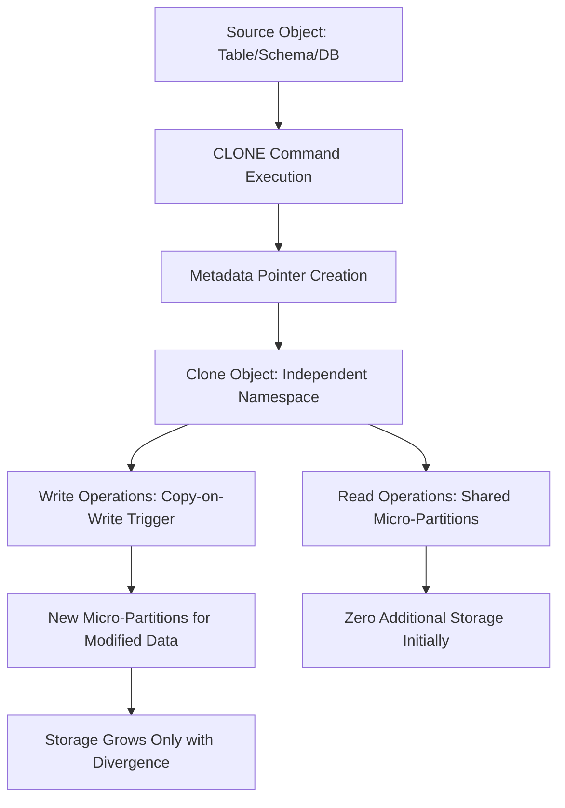

# 1. Title
Zero-Copy Cloning for Data Cleaning and Transformation Use-Cases in Snowflake

# 2. Overview
This pattern defines the procedural architecture for leveraging Snowflake's zero-copy cloning capability to support safe experimentation, pipeline validation, rollback recovery, and environment provisioning during data cleaning workflows. It exists to eliminate data duplication overhead, enable point-in-time recovery, and isolate transformation logic without impacting production state. The pattern operates at the database, schema, or table level, immediately before or after transformation execution. It is consumed by data engineers building resilient pipelines, analytics teams requiring isolated test environments, and SnowPro Advanced candidates evaluating cloning mechanics, Time Travel integration, and storage billing boundaries.

# 3. SQL Object Summary
| Object/Pattern | Type | Purpose | Source Objects/Inputs | Output Objects/Behavior | Execution Mode |
|----------------|------|---------|------------------------|--------------------------|----------------|
| Zero-Copy Clone Pattern | DDL / Architecture Pattern | Create metadata-referenced copies of databases, schemas, or tables for isolated execution | Source database/schema/table at current or historical timestamp | Clone object with independent DML capability, shared underlying micro-partitions | Manual or orchestrated via `CREATE ... CLONE` statement |

# 4. Architecture
The architecture implements a copy-on-write (COW) storage model. Clones are created as metadata pointers to source micro-partitions at a specific Time Travel offset. No physical data is copied at creation. Subsequent DML on either source or clone triggers COW: modified micro-partitions are physically duplicated, while unchanged partitions remain shared. This enables isolated transformation testing, safe rollback, and environment branching with minimal storage overhead.

# 5. Data Flow / Process Flow
1. **Clone Specification & Time Travel Resolution**
   - Input: Source object identifier + optional `AT`/`BEFORE` timestamp or offset
   - Transformation: Snowflake resolves source state at specified point via Time Travel metadata
   - Output: Logical clone definition referencing source micro-partition IDs
   - Purpose: Enable point-in-time isolation without data movement

2. **Metadata Pointer Creation**
   - Input: Resolved micro-partition list
   - Transformation: Clone object registered in account metadata with pointer map
   - Output: New database/schema/table object with independent namespace
   - Purpose: Provide isolated execution context with zero initial storage cost

3. **Isolated Transformation Execution**
   - Input: Clone object as transformation target
   - Transformation: Data cleaning logic applied via `MERGE`, `UPDATE`, or `INSERT`
   - Output: Modified micro-partitions in clone namespace only
   - Purpose: Validate pipeline logic without impacting production state

4. **Promotion or Discard Decision**
   - Input: Validated clone state
   - Transformation: `SWAP WITH` for promotion, or `DROP` for discard
   - Output: Production updated or clone removed
   - Purpose: Enable safe rollback or controlled deployment

# 6. Logical Breakdown
| Component | Responsibility | Inputs | Outputs | Dependencies | Failure Modes / Risks |
|-----------|----------------|--------|---------|--------------|------------------------|
| `clone_specifier` | Resolve source state at point-in-time | Source object ID + `AT`/`BEFORE` clause | Time Travel snapshot reference | Time Travel retention window | Source object dropped or expired beyond retention |
| `metadata_pointer_engine` | Register clone without data copy | Micro-partition ID list | New object metadata entry | Account metadata service | Metadata corruption rare but blocks clone access |
| `cow_storage_manager` | Handle write divergence | DML on clone or source | New physical micro-partitions for modified data | Storage layer COW logic | Unexpected storage growth if clone diverges heavily |
| `namespace_isolator` | Enforce independent object access | Clone object name | Isolated query context | Role-based access control | Privilege misconfiguration exposes clone to unintended roles |
| `promotion_orchestrator` | Manage clone lifecycle | Validated clone state | Production swap or clone drop | `SWAP WITH` DDL, `DROP` permissions | Partial promotion if transaction aborts mid-swap |

# 7. Data Model
| Object | Role | Important Fields | Grain | Relationships | Null Handling |
|--------|------|------------------|-------|---------------|---------------|
| `source_table` | Original production dataset | `business_key`, `cleaned_value`, `load_ts` | Per business entity | Parent to clone via metadata pointers | Unchanged; clone references same micro-partitions |
| `clone_table` | Isolated transformation target | Same schema as source | Per business entity | Independent namespace; shares source micro-partitions until COW | Null handling identical to source; modifications isolated |
| `clone_metadata` (internal) | Account-level pointer registry | `clone_id`, `source_object_id`, `snapshot_timestamp`, `partition_pointer_map` | Per clone object | Links clone to source micro-partitions | Internal system object; not user-queryable directly |

Output Grain: Clone object maintains identical grain to source at creation timestamp. Subsequent DML on clone produces independent grain evolution.

# 8. Business Logic
- **Clone Scope Rules**: `CREATE DATABASE ... CLONE` clones all contained schemas and tables. `CREATE SCHEMA ... CLONE` clones contained tables. `CREATE TABLE ... CLONE` clones single table only.
- **Time Travel Integration**: `AT (OFFSET => -3600)` or `BEFORE (STATEMENT => 'query_id')` enables historical cloning. Source must be within account's Time Travel retention (1–90 days).
- **Copy-on-Write Semantics**: Reads from clone or source share unchanged micro-partitions. Writes to either object trigger physical duplication only for modified partitions.
- **Privilege Inheritance**: Clones do not inherit grants by default. Explicit `GRANT` statements required for clone access. Future grants on source do not apply to existing clones.
- **Object Limitations**: External tables, secure views, and some system objects cannot be cloned. Materialized views clone as regular views.
- **Promotion Logic**: `ALTER TABLE source SWAP WITH clone` atomically exchanges metadata pointers. Both objects must share identical schema.
- **Exam-Relevant Defaults**: Standard Edition: 1-day Time Travel. Enterprise+: 1–90 days configurable. Clone storage billed only for diverged micro-partitions. `SWAP WITH` requires both objects in same schema.

# 9. Transformations
| Source State | Derived State | Rule / Evaluation Logic | Meaning | Impact |
|--------------|---------------|-------------------------|---------|--------|
| `source_micro_partitions` | `clone_metadata_pointers` | `CREATE TABLE clone CLONE source AT (OFFSET => -N)` | Metadata-only clone creation | Zero initial storage; immediate isolation |
| `shared_partition_read` | `identical_query_result` | Query clone or source pre-COW | Shared storage returns identical data | No performance penalty for read isolation |
| `clone_dml_modification` | `diverged_micro_partition` | `UPDATE clone SET col = val WHERE ...` | COW triggers physical copy of modified partition | Storage grows only for changed data |
| `production_swap` | `atomic_promotion` | `ALTER TABLE prod SWAP WITH clone` | Metadata pointer exchange | Instant promotion without data movement |
| `clone_discard` | `storage_reclaim` | `DROP TABLE clone` | Pointer map removed; unreferenced partitions eligible for GC | Storage freed if no other references exist |

# 10. Parameters / Variables / Configuration
| Name | Type | Purpose | Allowed Values | Default | Where Used | Effect |
|------|------|---------|----------------|---------|------------|--------|
| `DATA_RETENTION_TIME_IN_DAYS` | Object Parameter | Define Time Travel retention window | 0–1 (Standard), 0–90 (Enterprise+) | 1 (Standard), 90 (Enterprise+) | Database/Table level | Determines max historical clone offset |
| `MAX_DATA_EXTENSION_TIME_IN_DAYS` | Account Parameter | Allow temporary retention extension | 0–90 | 0 | Account level | Enables short-term extension for recovery scenarios |
| `CLONE` keyword | DDL Syntax | Specify zero-copy clone operation | N/A | N/A | `CREATE ... CLONE` statement | Triggers metadata pointer creation vs physical copy |
| `AT` / `BEFORE` clause | DDL Syntax | Specify point-in-time for clone | Timestamp, offset, query ID, stream offset | Current state | Clone specification | Enables historical state isolation |
| `SWAP WITH` | DDL Syntax | Atomically exchange object metadata | N/A | N/A | Promotion workflow | Enables zero-downtime deployment or rollback |

# 11. APIs / Interfaces
| Interface | Invocation Method | Input Structure | Output Structure | Error Behavior | Consumers |
|-----------|-------------------|-----------------|------------------|----------------|-----------|
| `CREATE ... CLONE` | DDL Statement | Source object + optional time clause | New clone object | Fails if source expired, insufficient privileges, or invalid syntax | Data engineers, DevOps, exam candidates |
| `SYSTEM$CLONE_INFO` | Not Available | N/A | N/A | N/A | N/A |
| `SHOW CLONES` | Not Available | N/A | N/A | N/A | N/A |
| `SWAP WITH` | DDL Statement | Two compatible objects | Atomic metadata exchange | Fails if schema mismatch, cross-schema, or insufficient privileges | Release engineers, pipeline operators |
| `ACCOUNT_USAGE.CLONES` | System View | Query filter on `CLONED_OBJECT_NAME` | Clone metadata, creation time, source reference | Requires `ACCOUNTADMIN` or `VIEW SERVER STATE` | Auditors, cost analysts tracking clone proliferation |

# 12. Execution / Deployment
- Executed manually via SQL client or orchestrated via `TASK`/external scheduler for automated environment provisioning.
- Clone creation is instantaneous regardless of source size; only metadata operations occur.
- Upstream dependency: Source object must exist and be within Time Travel retention window.
- Environment behavior: Dev/test environments frequently use clones for isolated pipeline validation. Production clones reserved for emergency rollback or A/B testing.
- Runtime assumption: Clone and source share storage until divergence. Heavy DML on clone increases storage cost proportionally to modified data volume.

# 13. Observability
- Monitor clone storage consumption via `SNOWFLAKE.ACCOUNT_USAGE.STORAGE_USAGE` filtered on `CLONE` object types.
- Track clone creation frequency and retention duration via `ACCOUNT_USAGE.CLONES` (if available) or custom audit logging.
- Use `SHOW TABLES HISTORY` or `INFORMATION_SCHEMA.TABLES` to identify clone objects and their source references.
- Alert on unexpected storage growth in clone-heavy schemas, indicating excessive divergence or forgotten test clones.
- Implement reconciliation: Compare row counts between source and clone pre-COW to validate clone integrity.

# 14. Failure Handling & Recovery
- **Source object dropped or expired**: Clone becomes invalid if source micro-partitions are purged beyond retention. Detection: Query fails with `object does not exist`. Recovery: Restore source via Time Travel before retention expiry, or recreate from backup.
- **Insufficient privileges**: Clone creation or `SWAP WITH` fails with `insufficient privileges`. Detection: DDL execution error. Recovery: Grant required roles (`OWNERSHIP`, `CREATE TABLE`, `USAGE` on schema).
- **Schema mismatch on swap**: `SWAP WITH` requires identical column definitions. Detection: DDL fails with `schema mismatch`. Recovery: Align schemas via `ALTER TABLE` or recreate clone with correct structure.
- **Unexpected storage growth**: Heavy divergence causes clone storage to approach source size. Detection: `STORAGE_USAGE` metrics spike. Recovery: Drop unused clones, consolidate test environments, or implement clone retention policies.
- **Partial transaction during swap**: Atomic `SWAP WITH` either completes fully or rolls back. Detection: Query object state post-failure. Recovery: Retry operation after resolving lock conflicts or resource constraints.

# 15. Security & Access Control
- Clones do not inherit grants from source. Explicit `GRANT` statements required for each clone object.
- Role separation: `DATA_ENGINEER` role manages clone creation and transformation testing. `ANALYST` role receives read access to validated clones only.
- Sensitive data: Clones contain identical data to source at creation time. Apply dynamic data masking or row access policies to clones if source contains PII.
- Network restrictions: Clone access governed by same network policies as source. Private link or IP whitelist settings apply independently per object.
- Audit compliance: Track clone creation and access via `ACCOUNT_USAGE.QUERY_HISTORY` and custom audit tables. Retain clone metadata per governance SLA.

# 16. Performance / Scalability Considerations
- Clone creation is metadata-only and scales independently of source size. No performance penalty for large datasets.
- Read queries on clone or source share the same micro-partition cache. No duplicate I/O for unchanged data.
- Write operations on clone trigger COW: only modified micro-partitions are physically duplicated. Performance impact proportional to divergence volume.
- Heavy concurrent DML on both source and clone increases storage I/O and may cause warehouse queueing. Isolate heavy transformation workloads to separate warehouses.
- `SWAP WITH` is atomic and metadata-only. No data movement occurs. Execution time independent of object size.
- Exam trap: Clones do not reduce Time Travel storage billing. Both source and clone retain independent Time Travel history, billed separately.

# 17. Assumptions & Constraints
- Assumes source object is within configured Time Travel retention window. Cloning beyond retention is impossible without backup restoration.
- Assumes clone and source remain in same account and region. Cross-account or cross-region cloning requires data sharing or replication, not zero-copy clone.
- External tables, secure views, and some system objects cannot be cloned. Attempting to clone unsupported objects fails with `feature not supported`.
- `SWAP WITH` requires both objects in same schema and with identical column definitions. Cross-schema swaps require additional DDL.
- Clone storage is billed only for diverged micro-partitions. However, Time Travel history for clone and source are billed independently.
- Exam trap: Standard Edition accounts have fixed 1-day Time Travel. Cloning historical state beyond 24 hours requires Enterprise or higher.
- Clone metadata pointers are invalidated if source micro-partitions are purged. Always validate clone accessibility before relying on historical state.

# 18. Future Enhancements
- Implement automated clone retention policies via scheduled `TASK` jobs that drop clones older than N days unless tagged for preservation.
- Integrate clone provisioning into CI/CD pipelines: automatically create test clones for each pull request, run transformation validation, and promote via `SWAP WITH` on merge.
- Leverage Snowflake Native Data Quality contracts to enforce schema compatibility before `SWAP WITH` operations, preventing promotion of invalid states.
- Add clone divergence monitoring: alert when clone storage exceeds threshold percentage of source, indicating excessive test data accumulation.
- Replace manual clone management with environment-as-code patterns: define clone specifications in version-controlled YAML, applied via Terraform or Snowflake CLI.
