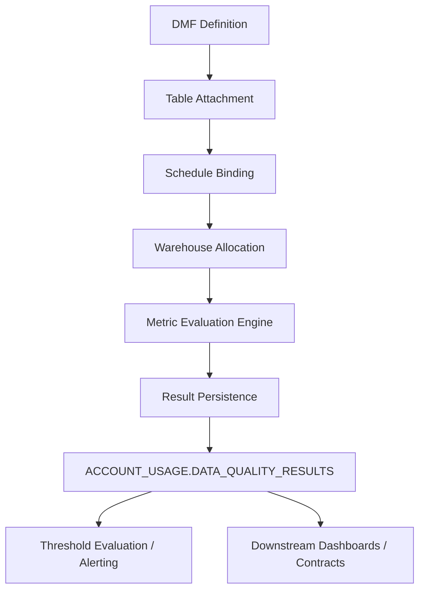

# 1. Title
Data Metric Functions (DMFs) for Automated Data Quality in Snowflake

# 2. Overview
This pattern defines the procedural architecture for defining, scheduling, and executing Data Metric Functions (DMFs) to automate data quality validation within Snowflake. DMFs exist to decouple quality evaluation from transformation pipelines, enable asynchronous metric computation, and centralize quality telemetry in system-managed storage. The pattern operates at the table or schema level, executing independently of user queries or ETL jobs. It is consumed by data engineers building observable pipelines, analytics teams requiring auditable quality baselines, and SnowPro Advanced candidates evaluating scheduling mechanics, result storage boundaries, and warehouse billing separation.

# 3. SQL Object Summary
| Object/Pattern | Type | Purpose | Source Objects/Inputs | Output Objects/Behavior | Execution Mode |
|----------------|------|---------|------------------------|--------------------------|----------------|
| Data Metric Function (DMF) | SQL Object / DQL Function | Evaluate predefined or custom quality metrics against table context | Target table attached to DMF | Metric value (scalar or structured), persisted to system quality views | Asynchronous, scheduled, warehouse-isolated |

# 4. Architecture
The architecture implements a definition-to-evaluation pipeline. DMFs are registered as reusable metric expressions and attached to tables. A scheduler binds execution to cron intervals and a dedicated warehouse. At runtime, Snowflake evaluates the metric against the table's current state, captures the result, and writes an immutable record to the data quality result store. Downstream consumers query system views or trigger alerting based on threshold evaluation.

# 5. Data Flow / Process Flow
1. **Metric Definition & Registration**
   - Input: SQL expression, return type, function name
   - Transformation: Metadata registration in account catalog
   - Output: Reusable DMF object
   - Purpose: Centralize quality logic without embedding in transformation code

2. **Table Attachment & Context Binding**
   - Input: Target table, DMF name
   - Transformation: Metadata link between table and DMF
   - Output: Attached DMF with implicit table context
   - Purpose: Scope metric evaluation to specific object

3. **Schedule Creation & Warehouse Routing**
   - Input: Cron expression, warehouse name, timezone
   - Transformation: Schedule registration with execution routing
   - Output: `DATA_METRIC_SCHEDULE` object
   - Purpose: Decouple quality runs from user query load

4. **Asynchronous Evaluation & Result Storage**
   - Input: Scheduled trigger, attached table state
   - Transformation: Metric computation in isolated warehouse context
   - Output: Immutable result row in system quality view
   - Purpose: Preserve historical quality baseline for auditing and alerting

# 6. Logical Breakdown
| Component | Responsibility | Inputs | Outputs | Dependencies | Failure Modes / Risks |
|-----------|----------------|--------|---------|--------------|------------------------|
| `dmf_registry` | Store metric expressions | Function name, return type, SQL body | Cataloged DMF object | Account metadata service | Invalid SQL syntax blocks registration |
| `table_attachment` | Bind metric to target | Table name, DMF reference, schedule | Attachment metadata | Table ownership, schedule existence | Attachment fails if table or schedule is dropped |
| `schedule_executor` | Trigger evaluation cycles | Cron, timezone, warehouse assignment | Execution requests | Warehouse availability, queue state | Missed runs if warehouse is suspended or out of credits |
| `evaluation_engine` | Compute metric value | Table state, DMF expression | Scalar/structured result | Table accessibility, privilege context | Long-running scans timeout or spill to disk |
| `result_persister` | Write immutable quality record | Computed metric, timestamp, context | System view row | Result storage layer, retention policy | Storage growth if retention is unbounded |

# 7. Data Model
| Object | Role | Important Fields | Grain | Relationships | Null Handling |
|--------|------|------------------|-------|---------------|---------------|
| `SNOWFLAKE.CORE.*` DMFs | Built-in metric providers | `ROW_COUNT`, `NULL_COUNT`, `UNIQUE_COUNT`, `FRESHNESS`, `REFERENTIAL_INTEGRITY` | Per evaluation run | Attached to user tables via metadata | Returns 0 or `NULL` based on metric semantics |
| `SNOWFLAKE.LOCAL.DATA_QUALITY_RESULTS` | Local result store | `TABLE_NAME`, `METRIC_NAME`, `METRIC_VALUE`, `COMPUTED_AT`, `STATUS` | One row per table+metric+schedule run | Traces to attached table and schedule | `STATUS` populated on success/failure |
| `ACCOUNT_USAGE.DATA_QUALITY_RESULTS` | Account-wide audit view | Same as local + `ACCOUNT_NAME`, `DATABASE_NAME`, `SCHEMA_NAME` | Per evaluation run across account | Replicated from local store | Retention governed by account configuration |

Output Grain: Exactly one result row per table, DMF, and scheduled execution. Grain is deterministic and append-only.

# 8. Business Logic
- **Metric Classification Rules**: Built-in DMFs evaluate structural quality (row counts, null distributions, uniqueness, freshness, referential integrity). Custom DMFs evaluate domain-specific logic via SQL expressions.
- **Evaluation Context**: DMFs execute against the table's committed state at schedule time. Uncommitted transactions are not evaluated.
- **Threshold & Alert Logic**: DMFs compute raw metrics only. Threshold evaluation and alerting require downstream logic (e.g., `WHERE METRIC_VALUE < threshold` queries, Snowflake Alerts, or external integrations).
- **Scheduling Semantics**: Cron syntax follows standard Quartz format. Timezone defaults to session or account setting. Missed runs are not backfilled unless explicitly scheduled.
- **Result Immutability**: Quality results are append-only. Historical records are not updated or corrected. Re-runs produce new rows.
- **Exam-Relevant Defaults**: Built-in DMFs reside in `SNOWFLAKE.CORE`. Custom DMFs require `CREATE DATA METRIC FUNCTION` privileges. Results default to 14-day retention in `LOCAL` view, configurable at account level. DMFs do not share result cache with ad-hoc queries. Execution is fully asynchronous and non-blocking to DML.

# 9. Transformations
| Source State | Derived State | Rule / Evaluation Logic | Meaning | Impact |
|--------------|---------------|-------------------------|---------|--------|
| `table_snapshot` | `metric_computation` | Built-in or custom SQL evaluated against table | Quality baseline at point-in-time | Enables trend analysis without query cache reliance |
| `computed_value` | `result_row` | `INSERT` into system view with metadata | Persistent quality record | Append-only; historical comparisons require time-range filters |
| `failed_execution` | `error_status` | Exception capture during evaluation | Execution failure logged | Does not halt schedule; next cycle runs independently |
| `threshold_check` | `alert_trigger` | Downstream query or alert rule on `METRIC_VALUE` | Quality deviation notification | Decoupled from DMF engine; requires external logic |

# 10. Parameters / Variables / Configuration
| Name | Type | Purpose | Allowed Values | Default | Where Used | Effect |
|------|------|---------|----------------|---------|------------|--------|
| `WAREHOUSE` | Object Reference | Assign compute for DMF execution | Existing warehouse name | None (mandatory) | Schedule definition | Islates quality compute from user queries |
| `SCHEDULE` | String (Cron) | Define execution cadence | Valid cron expression | None (mandatory) | Schedule definition | Drives async evaluation cycles |
| `TIMEZONE` | String | Control schedule interpretation | IANA timezone | Account/session default | Schedule definition | Affects evaluation timestamp alignment |
| `DATA_QUALITY_RETENTION_DAYS` | Account Parameter | Define result storage retention | 1–365 | 14 | Account-level configuration | Controls `ACCOUNT_USAGE` result history size |
| `CUSTOM_SQL_EXPRESSION` | String | Define domain-specific metric | Valid SELECT returning single value | N/A | Custom DMF definition | Determines evaluation scope and return type |

# 11. APIs / Interfaces
| Interface | Invocation Method | Input Structure | Output Structure | Error Behavior | Consumers |
|-----------|-------------------|-----------------|------------------|----------------|-----------|
| `CREATE DATA METRIC FUNCTION` | DDL Statement | Name, return type, SQL body | Registered DMF | Fails on invalid SQL or duplicate name | Data engineers, DQ architects |
| `ALTER TABLE ... ADD DATA METRIC FUNCTION` | DDL Statement | Table name, DMF reference, schedule | Attachment metadata | Fails if table or schedule missing | Pipeline operators |
| `CREATE DATA METRIC SCHEDULE` | DDL Statement | Name, cron, warehouse | Schedule object | Fails on invalid cron or missing warehouse | DevOps, DQ engineers |
| `SNOWFLAKE.LOCAL.DATA_QUALITY_RESULTS` | System View | Query filter on `TABLE_NAME`, `COMPUTED_AT` | Result rows | Requires `USAGE` on `SNOWFLAKE` schema | Analysts, monitoring tools |
| `ACCOUNT_USAGE.DATA_QUALITY_RESULTS` | System View | Cross-account quality audit | Aggregated result rows | Requires `ACCOUNTADMIN` or `VIEW SERVER STATE` | Auditors, compliance teams |

# 12. Execution / Deployment
- Executed asynchronously via Snowflake scheduler. No manual invocation required after attachment.
- Runs in isolated warehouse context defined in schedule. Does not consume user query credits or share cache with ad-hoc workloads.
- Upstream dependency: Target table must exist, be queryable by schedule warehouse, and have no active blocking locks.
- Environment behavior: Dev/test may use smaller warehouses and shorter retention. Production mandates dedicated warehouse, aligned cron windows, and extended retention.
- Runtime assumption: Idempotent by design. Each schedule run produces a new result row regardless of table state changes. Missed runs do not auto-backfill.

# 13. Observability
- Query result history: `SELECT TABLE_NAME, METRIC_NAME, METRIC_VALUE, COMPUTED_AT FROM SNOWFLAKE.LOCAL.DATA_QUALITY_RESULTS ORDER BY COMPUTED_AT DESC;`
- Track execution status: Filter `STATUS` column for `SUCCESS` or `ERROR`. Error rows include diagnostic metadata.
- Monitor warehouse utilization: Cross-reference `ACCOUNT_USAGE.WAREHOUSE_METERING_HISTORY` with schedule execution windows.
- Alert on metric deviation: Build scheduled queries or Snowflake Alerts on `ACCOUNT_USAGE.DATA_QUALITY_RESULTS` where `METRIC_VALUE` exceeds business thresholds.
- Implement reconciliation: Compare expected metric baselines (e.g., row count deltas from upstream loads) against DMF results. Mismatch indicates schedule drift or evaluation failure.

# 14. Failure Handling & Recovery
- **Warehouse suspended or out of credits**: Schedule skips execution. Detection: `STATUS = 'ERROR'` with compute unavailable message. Recovery: Resume warehouse, adjust credit monitoring, verify schedule alignment.
- **Invalid SQL or schema drift in custom DMF**: Evaluation fails. Detection: `STATUS = 'ERROR'`, `METRIC_VALUE` null. Recovery: Update DMF definition to match current table schema, reattach.
- **Table dropped or renamed**: Attachment breaks, schedule continues with errors. Detection: Repeated execution failures for missing object. Recovery: Remove broken attachment, recreate on new table, or archive schedule.
- **Missed schedule window**: No backfill occurs. Detection: Gap in `COMPUTED_AT` timestamps. Recovery: Manually adjust cron frequency or implement catch-up schedule during off-peak hours.
- **Result storage retention expiry**: Historical rows purged. Detection: `ACCOUNT_USAGE` queries return incomplete history. Recovery: Adjust `DATA_QUALITY_RETENTION_DAYS` before purge, or export critical results to persistent tables.

# 15. Security & Access Control
- DMF creation requires `CREATE DATA METRIC FUNCTION` privilege. Attachment requires `OWNERSHIP` or `ALTER` on target table.
- Schedule execution runs under the role that created the schedule, or explicitly assigned role. Privilege context must have `SELECT` on target table.
- Result views reside in `SNOWFLAKE` database. `USAGE` on `SNOWFLAKE.LOCAL` required for local results. `ACCOUNT_USAGE` requires elevated privileges.
- PII handling: DMF results contain only aggregated metrics or scalar values. Raw row data is not persisted in result views. Custom SQL must not expose sensitive payloads in return values.
- Role separation: `DATA_ENGINEER` manages DMF definition and attachment. `ANALYST` receives read-only access to result views. `ACCOUNTADMIN` oversees retention and cross-account auditing.

# 16. Performance / Scalability Considerations
- DMFs execute full table scans unless metric logic includes filter predicates that align with clustering keys. Cluster tables on evaluation dimensions (e.g., `COMPUTED_AT`, `STATUS`) to enable partition pruning.
- Large tables with frequent custom DMF evaluations increase warehouse credit consumption. Use built-in DMFs where possible; they leverage optimized engine paths.
- Result view queries do not benefit from standard query cache isolation. Materialize frequent threshold checks to transient tables to avoid repeated scans of `DATA_QUALITY_RESULTS`.
- High-frequency schedules (sub-hourly) cause warehouse cold starts or queueing. Align schedule windows with pipeline completion offsets to reduce resource contention.
- Exam trap: DMFs do not block concurrent DML. They evaluate committed state only. Long-running evaluations may return stale metrics if heavy inserts occur during execution window.

# 17. Assumptions & Constraints
- Assumes target tables remain within the attached database/schema namespace. Cross-database attachment is not supported.
- Assumes schedule warehouse has sufficient compute and credits for full table scans during evaluation windows.
- `SNOWFLAKE.CORE` built-in DMFs are read-only and cannot be modified. Custom DMFs must return single scalar or structured values; multi-row results are invalid.
- Result retention defaults to 14 days. Extending beyond 14 days requires Enterprise edition and explicit account configuration.
- DMFs execute asynchronously. Execution completion time is not exposed in real-time; results appear only after successful persistence.
- Exam trap: `DATA_QUALITY_RESULTS` is append-only. Historical corrections are impossible. Threshold evaluation requires external logic; DMFs do not natively trigger alerts or halt pipelines.
- `ALTER TABLE ... DROP DATA METRIC FUNCTION` removes attachment but does not delete historical results. Results persist until retention expiry.

# 18. Future Enhancements
- Implement automated threshold evaluation within Snowflake by chaining DMF results to `SNOWFLAKE.ALERTS` for real-time notification.
- Introduce parameterized DMFs that accept dynamic filter predicates to evaluate data quality on specific partitions or time windows.
- Replace manual schedule management with CI/CD pipelines that deploy DMF attachments alongside table DDL changes, ensuring quality coverage parity.
- Add adaptive scheduling that adjusts execution frequency based on table mutation rate, reducing credit waste on static datasets.
- Integrate DMF results directly into Snowflake Data Contracts to enforce quality gates at ingestion boundaries without external orchestration.
