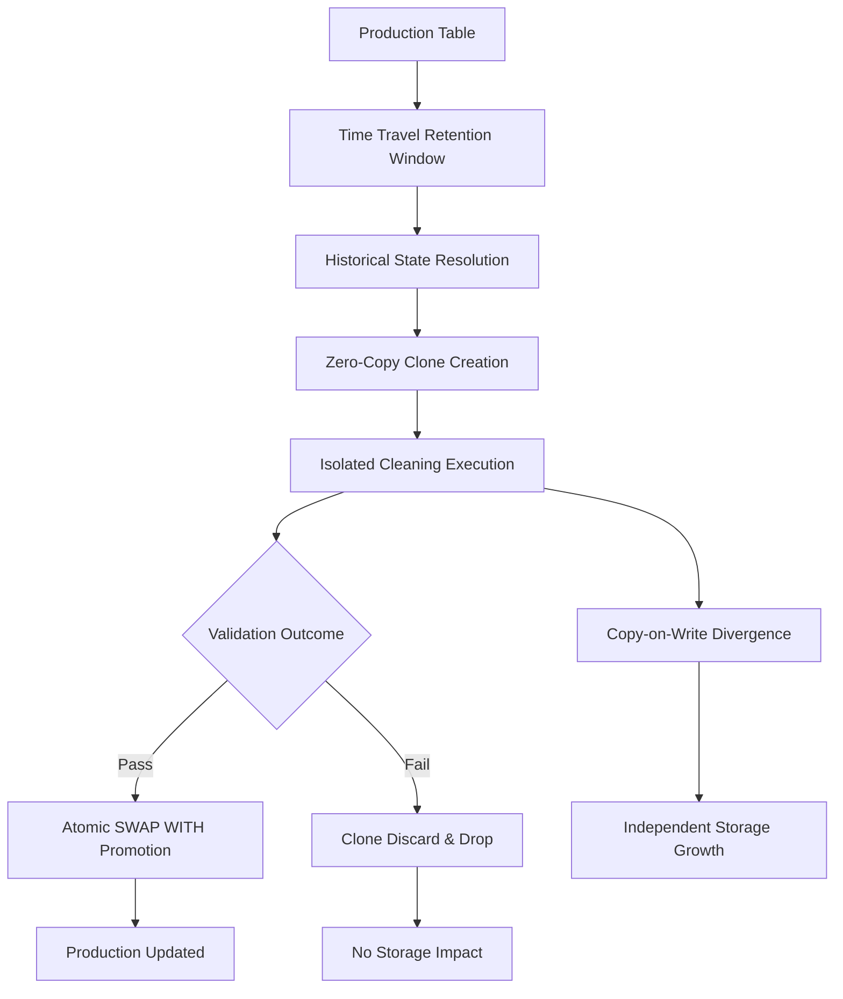

# 1. Title
Time Travel and Zero-Copy Cloning for Data Cleaning Workflows in Snowflake

# 2. Overview
This pattern defines the procedural architecture for leveraging Snowflake's Time Travel and zero-copy cloning capabilities to isolate, validate, and recover data cleaning operations. It exists to prevent irreversible data loss during destructive transformations (`UPDATE`, `DELETE`, `MERGE`), enable safe experimentation of cleaning logic, and provide deterministic rollback without physical data duplication. The pattern operates at the database, schema, or table level, integrated into pre- and post-transformation validation phases. It is consumed by data engineers building resilient pipelines, pipeline operators managing recovery workflows, and SnowPro Advanced candidates evaluating retention boundaries, copy-on-write storage mechanics, and atomic promotion patterns.

# 3. SQL Object Summary
| Object/Pattern | Type | Purpose | Source Objects/Inputs | Output Objects/Behavior | Execution Mode |
|----------------|------|---------|------------------------|--------------------------|----------------|
| Time Travel Query Pattern | SQL Syntax / DML Extension | Retrieve historical table state within retention window | Base table, timestamp/offset/query ID | Snapshot result set matching historical state | Synchronous, inline query execution |
| Zero-Copy Clone Pattern | DDL / Architecture Pattern | Create metadata-referenced copies for isolated testing | Source object, optional `AT`/`BEFORE` clause | Independent object sharing source micro-partitions until divergence | Manual or orchestrated via `CREATE ... CLONE` |
| Atomic Promotion Pattern | DDL Syntax | Swap validated clone into production namespace | Two objects with identical schema | Metadata pointer exchange; zero data movement | Synchronous, transactional DDL |

# 4. Architecture
The architecture implements a metadata-driven state management system. Time Travel maintains a rolling window of historical micro-partition states. Cloning creates a new namespace that points to existing micro-partitions without physical duplication. Subsequent DML on either object triggers Copy-on-Write (COW), physically duplicating only modified partitions. This enables isolated data cleaning experimentation, point-in-time recovery, and atomic promotion with minimal storage and compute overhead.

# 5. Data Flow / Process Flow
1. **Retention Configuration & Baseline Capture**
   - Input: Target table with configured `DATA_RETENTION_TIME_IN_DAYS`
   - Transformation: Snowflake maintains immutable micro-partition history within retention window
   - Output: Historical state registry accessible via `AT`/`BEFORE` clauses
   - Purpose: Enable point-in-time recovery and safe branch creation

2. **Clone Instantiation & Namespace Isolation**
   - Input: Source table identifier + optional historical offset
   - Transformation: Metadata pointer map created; new object registered in account catalog
   - Output: Clone object with independent namespace and zero initial storage cost
   - Purpose: Isolate transformation logic without impacting production state

3. **Isolated Cleaning Execution & Divergence**
   - Input: Clone object as transformation target
   - Transformation: Data cleaning logic applied (`MERGE`, `UPDATE`, `DELETE`)
   - Output: Modified micro-partitions physically duplicated in clone namespace
   - Purpose: Validate logic, observe row-level impact, and measure storage divergence

4. **Validation & Promotion or Discard**
   - Input: Validated clone state or failed experiment
   - Transformation: `ALTER TABLE ... SWAP WITH` for promotion, or `DROP` for discard
   - Output: Production updated atomically or clone removed with storage reclaimed
   - Purpose: Enable controlled deployment or safe rollback without downtime

# 6. Logical Breakdown
| Component | Responsibility | Inputs | Outputs | Dependencies | Failure Modes / Risks |
|-----------|----------------|--------|---------|--------------|------------------------|
| `retention_manager` | Maintain historical micro-partition states | Committed transactions, retention config | Time Travel window | Object DDL, storage layer | Expired states permanently purged; no recovery possible |
| `clone_metadata_engine` | Register zero-copy pointers | Source micro-partition map | New object metadata entry | Account catalog, privilege context | Privilege misconfiguration blocks clone access |
| `cow_storage_handler` | Manage write divergence | DML on clone or source | New physical partitions for modified data | Storage engine, transaction log | Unexpected storage growth if divergence is uncontrolled |
| `namespace_isolator` | Enforce independent query context | Clone object name | Isolated execution scope | Role-based access control | Unintended cross-namespace queries if grants misconfigured |
| `promotion_orchestrator` | Execute atomic swap | Two compatible objects | Metadata pointer exchange | Identical schema, same database/schema | Swap fails on schema mismatch or cross-schema execution |

# 7. Data Model (State Model)
| Object | Role | Important Fields/Attributes | Grain | Relationships | State Handling |
|--------|------|-----------------------------|-------|---------------|----------------|
| `source_table` | Production baseline | `TABLE_ID`, `RETENTION_DAYS`, `MICRO_PARTITION_MAP` | Per micro-partition snapshot | Parent to clone via metadata pointers | Immutable within Time Travel window; modified via standard DML |
| `clone_table` | Isolated validation target | Same schema as source, independent `TABLE_ID` | Per micro-partition | Shares source pointers until COW trigger | Independent DML state; drops do not affect source |
| `time_travel_metadata` (internal) | Historical state registry | `SNAPSHOT_TIMESTAMP`, `QUERY_ID`, `OFFSET_SECONDS`, `STATEMENT_HASH` | Per committed transaction | Maps historical queries to micro-partition versions | Retention window governed by object parameter; purged automatically |

Output Grain: One deterministic state snapshot per historical offset or query ID. Clone grain matches source at creation timestamp, then diverges independently based on applied DML.

# 8. Business Logic (Execution Logic)
- **Retention Scope Rules**: `DATA_RETENTION_TIME_IN_DAYS` applies at database or table level. Table-level setting overrides database-level. Standard Edition: 1 day fixed. Enterprise+: 1–90 days configurable.
- **Historical Resolution Semantics**: `AT` specifies inclusive point-in-time. `BEFORE` specifies exclusive point-in-time. Both accept timestamps, offsets (seconds), or `STATEMENT => 'query_id'`.
- **Clone Scope & Inheritance**: `CREATE DATABASE/SCHEMA/TABLE ... CLONE` copies metadata and structure. Grants, tags, and row access policies do not inherit automatically. Must be explicitly re-applied.
- **Copy-on-Write Triggers**: Reads share micro-partitions. Any `INSERT`, `UPDATE`, `DELETE`, or `MERGE` on clone or source triggers physical duplication of affected partitions only.
- **Promotion Constraints**: `SWAP WITH` requires both objects in the same database and schema. Column names, order, and data types must match exactly. Foreign keys and constraints are swapped atomically.
- **Storage Billing Boundaries**: Time Travel and Fail-Safe storage are billed separately. Clone storage is billed only for diverged partitions. Dropped objects enter 7-day Fail-Safe (non-configurable, non-recoverable after expiry).
- **Exam-Relevant Defaults**: `AT` includes the specified timestamp; `BEFORE` excludes it. `UNDROP` restores metadata but not DML performed after drop. `SWAP WITH` is metadata-only; no data movement occurs. Clones do not reset Time Travel retention windows.

# 9. Transformations (State Transitions)
| Source State | Derived State | Rule / Evaluation Logic | Meaning | Impact |
|--------------|---------------|-------------------------|---------|--------|
| `current_micro_partitions` | `historical_snapshot` | `SELECT ... AT (OFFSET => -3600)` | Resolves committed state at exact offset | Enables point-in-time validation without clone creation |
| `source_pointer_map` | `clone_namespace` | `CREATE TABLE clone CLONE source` | Metadata-only object registration | Zero storage cost; immediate isolation |
| `clone_dml_execution` | `diverged_partitions` | `UPDATE clone SET ...` | COW duplicates modified micro-partitions | Storage grows proportionally to changed data |
| `validated_clone` | `promoted_production` | `ALTER TABLE prod SWAP WITH clone` | Atomic metadata exchange | Instant promotion; zero downtime |
| `discarded_clone` | `storage_reclaim` | `DROP TABLE clone` | Pointer map removed; unreferenced partitions eligible for GC | Storage freed; Time Travel history remains for source |

# 10. Parameters / Variables / Configuration
| Name | Type | Purpose | Allowed Values | Default | Where Used | Effect |
|------|------|---------|----------------|---------|------------|--------|
| `DATA_RETENTION_TIME_IN_DAYS` | Object Parameter | Define Time Travel retention window | 0–1 (Standard), 0–90 (Enterprise+) | 1 (Standard), 1 (Enterprise) | Database/Table level | Determines max historical offset for cloning/recovery |
| `MAX_DATA_EXTENSION_TIME_IN_DAYS` | Account Parameter | Allow temporary retention extension | 0–90 | 0 | Account level | Enables short-term extension for emergency recovery |
| `AT` / `BEFORE` Clause | SQL Syntax | Specify point-in-time for queries/clones | Timestamp, offset, query ID | Current state | `SELECT`, `CREATE ... CLONE` | Controls historical state resolution boundary |
| `SWAP WITH` | DDL Syntax | Atomically exchange object metadata | N/A | N/A | Promotion workflow | Requires identical schema; metadata-only swap |
| `UNDROP` | DDL Syntax | Restore dropped object metadata | N/A | N/A | Recovery workflow | Restores object; does not recover DML performed post-drop |

# 11. APIs / Interfaces
| Interface | Invocation Method | Input Structure | Output Structure | Error Behavior | Consumers |
|-----------|-------------------|-----------------|------------------|----------------|-----------|
| `CREATE ... CLONE` | DDL Statement | Source object + optional time clause | New object with shared storage | Fails if source expired, insufficient privileges, or invalid syntax | Data engineers, DevOps |
| `SELECT ... AT / BEFORE` | DQL Statement | Table name + time specification | Historical result set | Fails if offset outside retention window | Pipeline validators, auditors |
| `ALTER TABLE ... SWAP WITH` | DDL Statement | Two compatible objects | Atomic metadata exchange | Fails on schema mismatch, cross-schema, or privilege violation | Release engineers, operators |
| `UNDROP` | DDL Statement | Dropped object name | Restored object metadata | Fails if object purged from Fail-Safe | Recovery workflows |
| `ACCOUNT_USAGE.TABLES` | System View | Query filter on `DELETED_ON`, `RETENTION_TIME` | Object lifecycle metadata | Requires `ACCOUNTADMIN` or `VIEW SERVER STATE` | Cost analysts, compliance auditors |

# 12. Execution / Deployment
- Clone creation is instantaneous and independent of source size; only metadata operations occur.
- Time Travel queries execute synchronously and consume compute proportional to scanned micro-partitions.
- Upstream dependency: Source object must exist and be within configured retention window.
- Environment behavior: Dev/test environments use clones for isolated pipeline validation. Production clones reserved for emergency rollback or A/B testing.
- Runtime assumption: Clone and source share storage until divergence. Heavy DML on clone increases storage cost proportionally. `SWAP WITH` requires identical column order and types; mismatched DDL blocks promotion.

# 13. Observability
- Monitor clone storage consumption via `ACCOUNT_USAGE.STORAGE_USAGE` filtered on `CLONE` object types.
- Track Time Travel expiration via `ACCOUNT_USAGE.TABLES` where `DELETED_ON` is null and `RETENTION_TIME` approaches zero.
- Use `QUERY_HISTORY` to identify historical queries executed with `AT`/`BEFORE` clauses and their compute consumption.
- Alert on unexpected storage growth in clone-heavy schemas, indicating excessive divergence or forgotten test clones.
- Implement reconciliation: Compare row counts and checksums between source and clone pre-COW to validate clone integrity before promotion.

# 14. Failure Handling & Recovery
- **Retention expiry / source dropped beyond Fail-Safe**: Historical state permanently lost. Detection: `object does not exist` or `out of retention` error. Recovery: Impossible without external backup; enforce proactive retention policies.
- **Schema mismatch on swap**: `SWAP WITH` fails with `incompatible schema`. Detection: DDL execution error. Recovery: Align columns via `ALTER TABLE` or recreate clone with correct structure.
- **Privilege isolation**: Clones do not inherit grants. Detection: Query fails with `insufficient privileges`. Recovery: Explicitly grant required roles to clone namespace.
- **Unexpected divergence**: Heavy DML on clone causes storage to approach source size. Detection: `STORAGE_USAGE` metrics spike. Recovery: Drop unused clones, consolidate environments, or implement automated retention policies.
- **Partial DML during clone creation**: Clones capture committed state only; uncommitted transactions are excluded. Detection: Row count mismatch vs expected. Recovery: Retry after transaction commit; verify stream/watermark alignment.

# 15. Security & Access Control
- Clones do not inherit grants, masking policies, or row access policies from source. Explicit `GRANT` and policy reattachment required.
- Role separation: `DATA_ENGINEER` manages clone creation and transformation testing. `ANALYST` receives read access to validated clones only.
- Sensitive data: Clones contain identical data to source at creation time. Apply dynamic data masking or row access policies to clones if source contains PII.
- Audit compliance: Track clone creation, swap operations, and historical queries via `ACCOUNT_USAGE.QUERY_HISTORY` and custom audit tables. Retain clone metadata per governance SLA.
- Network restrictions: Clone access governed by same network policies as source. Private link or IP whitelist settings apply independently per object.

# 16. Performance / Scalability Considerations
- Clone creation is metadata-only and scales independently of source size. No performance penalty for large datasets.
- Time Travel queries scan historical micro-partitions. Lack of clustering on evaluation dimensions increases compute cost. Cluster on high-cardinality filter columns to enable partition pruning.
- COW divergence triggers physical storage allocation only for modified partitions. Performance impact proportional to DML volume, not total table size.
- `SWAP WITH` is atomic and metadata-only. Execution time independent of object size. Does not block concurrent queries; reads route to new pointer map instantly.
- Exam trap: Time Travel and Fail-Safe storage are billed separately from active storage. Clones do not reduce Time Travel billing. Historical queries do not benefit from standard query cache isolation if `AT`/`BEFORE` is used.

# 17. Assumptions & Constraints
- Assumes source object is within configured Time Travel retention window. Cloning historical state beyond retention is impossible without external backup.
- Assumes clone and source remain in same account and region. Cross-account or cross-region cloning requires data sharing or replication, not zero-copy clone.
- External tables, secure views, and some system objects cannot be cloned. Attempting to clone unsupported objects fails with `feature not supported`.
- `SWAP WITH` requires both objects in same schema with identical column definitions. Cross-schema swaps require additional DDL and manual privilege migration.
- Time Travel retention defaults: Standard = 1 day (fixed), Enterprise = 1 day (configurable to 90). Fail-Safe is 7 days for all editions and is non-configurable, non-recoverable after expiry.
- Exam trap: `AT` is inclusive, `BEFORE` is exclusive. `UNDROP` restores object structure and data up to drop time but does not recover DML performed after the drop. Clone grants are never inherited.
- Historical queries consume compute proportional to scanned micro-partitions. They do not leverage result cache if time clauses are present.

# 18. Future Enhancements
- Implement automated clone retention policies via scheduled `TASK` jobs that drop clones older than N days unless tagged for preservation.
- Integrate clone provisioning into CI/CD pipelines: automatically create test clones for each pull request, run transformation validation, and promote via `SWAP WITH` on merge.
- Leverage Snowflake Native Data Quality contracts to enforce schema compatibility before `SWAP WITH` operations, preventing promotion of invalid states.
- Add clone divergence monitoring: alert when clone storage exceeds threshold percentage of source, indicating excessive test data accumulation.
- Replace manual clone management with environment-as-code patterns: define clone specifications in version-controlled YAML, applied via Terraform or Snowflake CLI with automatic policy inheritance.
