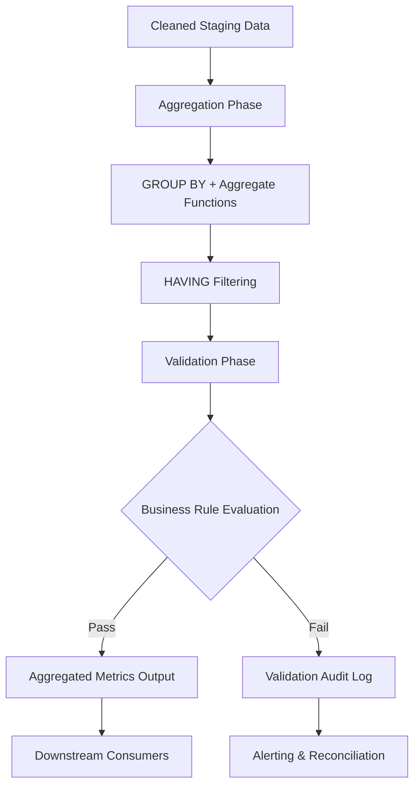

# 1. Title
Aggregation and Validation Patterns for Data Transformation in Snowflake

# 2. Overview
This pattern defines the procedural architecture for computing summary statistics, enforcing data quality constraints, and validating transformation outputs using Snowflake's aggregation engine. It exists to produce deterministic rollups, detect anomalies before downstream consumption, and ensure business rule compliance at scale. The pattern operates in the post-transformation validation layer, after cleaning and type resolution but before final reporting or modeling. It is consumed by data engineers building auditable pipelines, analytics teams requiring trusted metrics, and SnowPro Advanced candidates evaluating aggregation semantics, NULL handling, and optimizer behavior.

# 3. SQL Object Summary
| Object/Pattern | Type | Purpose | Source Objects/Inputs | Output Objects/Behavior | Execution Mode |
|----------------|------|---------|------------------------|--------------------------|----------------|
| Aggregation & Validation Pipeline | SQL Transformation Pattern | Compute rollups, enforce quality thresholds, emit validated metrics | Cleaned staging tables, type-resolved datasets | `aggregated_metrics` (summary grain), `validation_audit` (rule violations) | Batch or incremental via `TASK` or orchestrator |

# 4. Architecture
The architecture implements a two-phase aggregation and validation pipeline. Raw cleaned data enters an aggregation phase where grouping keys, aggregate functions, and filtering predicates are applied. Results proceed to a validation phase where business rules, threshold comparisons, and referential checks are evaluated. Failed validations are routed to an audit log; passed results are projected to the final metrics table.

# 5. Data Flow / Process Flow
1. **Grouping Key Definition & Partitioning**
   - Input: Cleaned dataset with business keys and measurable columns
   - Transformation: `GROUP BY` clause defines aggregation boundaries; clustering keys enable pruning
   - Output: Logically partitioned dataset ready for aggregate computation
   - Purpose: Establish the grain of summary output

2. **Aggregate Function Evaluation**
   - Input: Partitioned dataset
   - Transformation: `COUNT`, `SUM`, `AVG`, `MIN`, `MAX`, `LISTAGG`, `ANY_VALUE` applied per group
   - Output: Scalar metric values per grouping key
   - Purpose: Compute business-relevant summaries without row-level detail

3. **Post-Aggregation Filtering**
   - Input: Aggregated result set
   - Transformation: `HAVING` clause filters groups based on aggregate conditions
   - Output: Filtered metric rows meeting business thresholds
   - Purpose: Exclude incomplete or anomalous groups before validation

4. **Validation Rule Application**
   - Input: Filtered aggregates
   - Transformation: `CASE`, `IFF`, or explicit comparison logic evaluates business rules
   - Output: Pass/fail flags + diagnostic metadata
   - Purpose: Enforce data contracts and detect quality deviations

5. **Routing & Materialization**
   - Input: Validated result set
   - Transformation: Conditional routing to `aggregated_metrics` or `validation_audit`; `MERGE` or `INSERT`
   - Output: Final metrics table + audit log
   - Purpose: Emit trusted outputs while preserving failure diagnostics

# 6. Logical Breakdown
| Component | Responsibility | Inputs | Outputs | Dependencies | Failure Modes / Risks |
|-----------|----------------|--------|---------|--------------|------------------------|
| `grouping_engine` | Define aggregation boundaries | Cleaned rows, `GROUP BY` keys | Partitioned groups | Stable key definitions; clustering for pruning | Missing keys produce unbounded groups; skewed keys cause memory spill |
| `aggregate_evaluator` | Compute summary metrics | Partitioned groups, aggregate functions | Scalar values per group | Correct function selection; NULL handling awareness | `COUNT(*)` vs `COUNT(col)` divergence; implicit type coercion errors |
| `having_filter` | Exclude anomalous groups | Aggregated rows, threshold logic | Filtered metric set | Business-defined thresholds | Overly strict filters drop valid edge cases; late filtering bypasses pruning |
| `validation_router` | Apply business rule checks | Filtered aggregates, rule definitions | Pass/fail flags + diagnostics | Explicit rule catalog; tolerance thresholds | Missing rules allow invalid data through; circular dependencies in rule logic |
| `output_materializer` | Persist validated results | Validated rows, audit entries | `aggregated_metrics`, `validation_audit` | Transaction boundaries; constraint enforcement | Partial writes on constraint violation; audit log growth without retention |

# 7. Data Model
| Object | Role | Important Fields | Grain | Relationships | Null Handling |
|--------|------|------------------|-------|---------------|---------------|
| `cleaned_staging` | Source for aggregation | `business_key`, `metric_col`, `dimension_cols`, `processed_ts` | Per transactional row | Parent to aggregated output | NULLs in `metric_col` excluded from `SUM`/`AVG`; included in `COUNT(*)` |
| `aggregated_metrics` | Downstream trusted output | `group_key`, `metric_sum`, `metric_count`, `validation_status`, `computed_ts` | One row per `GROUP BY` combination | Child of staging; referenced by validation audit | Aggregated NULLs become explicit `0` or `NULL` per business rule |
| `validation_audit` | Diagnostic repository | `group_key`, `rule_name`, `expected_value`, `actual_value`, `deviation_pct`, `evaluated_ts` | One row per failed rule evaluation | Traces to `aggregated_metrics` via `group_key` | Diagnostic fields enforced `NOT NULL`; raw values stored as `VARIANT` if needed |

Output Grain: Exactly one row per unique `GROUP BY` key combination in `aggregated_metrics`. One audit row per violated business rule in `validation_audit`.

# 8. Business Logic
- **Grouping Rules**: `GROUP BY` defines the output grain. All non-aggregated columns must appear in `GROUP BY` or be wrapped in aggregate functions. `ROLLUP`, `CUBE`, and `GROUPING SETS` enable hierarchical or multi-dimensional rollups.
- **Aggregate Function Semantics**: `COUNT(*)` includes all rows; `COUNT(col)` excludes NULLs. `SUM` and `AVG` ignore NULLs; result is NULL if all inputs are NULL. `LISTAGG` concatenates non-NULL values; order controlled via `WITHIN GROUP`.
- **NULL Handling in Aggregations**: `GROUP BY` treats all NULLs as a single grouping bucket. `COALESCE` or `IFF` required to substitute defaults before aggregation if business logic demands it.
- **Filtering Logic**: `WHERE` filters rows before aggregation; `HAVING` filters groups after aggregation. Use `WHERE` for row-level pruning to enable micro-partition elimination; use `HAVING` for aggregate-level thresholds.
- **Validation Rule Types**: Threshold checks (`metric_sum >= min_value`), referential integrity (`COUNT(DISTINCT fk) = COUNT(*)`), distribution checks (`AVG` within ±2σ), completeness checks (`NULL_COUNT / TOTAL_COUNT <= tolerance`).
- **Approximate Aggregations**: `APPROX_COUNT_DISTINCT`, `APPROX_PERCENTILE` trade precision for performance on large datasets. Use only when business tolerance allows; document error bounds.
- **Exam-Relevant Defaults**: `GROUP BY` is case-sensitive for string columns unless collation is applied. `HAVING` cannot reference column aliases from `SELECT` in same query block in all contexts; use subquery or CTE for portability. `ANY_VALUE` returns non-deterministic result if multiple values exist; use only when any value is acceptable.

# 9. Transformations
| Source State | Derived State | Rule / Evaluation Logic | Meaning | Impact |
|--------------|---------------|-------------------------|---------|--------|
| `transactional_rows` | `grouped_partitions` | `GROUP BY dimension_cols` | Establishes summary grain | Reduces cardinality; enables downstream rollup queries |
| `partitioned_data` | `scalar_metrics` | `SUM(metric_col)`, `COUNT(*)`, `AVG(value)` | Computes business KPIs | NULLs excluded from numeric aggregates; document behavior |
| `raw_aggregates` | `filtered_groups` | `HAVING COUNT(*) >= min_threshold` | Excludes sparse or incomplete groups | Prevents misleading metrics from low-sample groups |
| `validated_metrics` | `audit_flagged` | `CASE WHEN metric_sum < expected THEN 'UNDER_THRESHOLD' END` | Captures rule violations | Enables reconciliation; increases storage by audit columns |
| `distinct_values` | `approximate_count` | `APPROX_COUNT_DISTINCT(user_id)` | Trade precision for scale | ±1–2% error typical; unsuitable for financial reconciliation |

# 10. Parameters / Variables / Configuration
| Name | Type | Purpose | Allowed Values | Default | Where Used | Effect |
|------|------|---------|----------------|---------|------------|--------|
| `GROUPING_ID` | SQL Function | Identify subtotal/total rows in `ROLLUP`/`CUBE` | N/A | N/A | Hierarchical aggregation | Enables programmatic detection of aggregation level |
| `APPROXIMATE` keyword | Function Modifier | Enable approximate computation | `APPROX_COUNT_DISTINCT`, `APPROX_PERCENTILE` | N/A | Large-scale aggregations | Reduces compute; introduces bounded error |
| `LISTAGG` delimiter / `ON_OVERFLOW` | Function Parameter | Control string concatenation behavior | Delimiter string; `TRUNCATE` or `ERROR` | Comma; `ERROR` | Multi-value aggregation | Prevents query failure on large concatenations |
| `ENABLE_UNSAFE_GROUP_BY` | Session Parameter | Allow non-standard `GROUP BY` behavior | `TRUE`, `FALSE` | `FALSE` | Legacy query compatibility | May produce non-deterministic results if misused |
| `VALIDATION_THRESHOLD_*` | Custom Parameter | Define business rule tolerances | Numeric or string values | N/A | Validation logic (injected via binding) | Centralizes rule configuration; avoids hard-coded literals |

# 11. APIs / Interfaces
| Interface | Invocation Method | Input Structure | Output Structure | Error Behavior | Consumers |
|-----------|-------------------|-----------------|------------------|----------------|-----------|
| `GROUP BY` / `ROLLUP` / `CUBE` | SQL Clause | Grouping columns + optional grouping sets | Aggregated rows | Fails if non-aggregated columns omitted from `GROUP BY` | Aggregation engineers, exam candidates |
| `HAVING` | SQL Clause | Aggregate condition expression | Filtered aggregated rows | Fails if references non-aggregate columns incorrectly | Pipeline validators |
| `SYSTEM$AGGREGATE_STATS` | Not Available | N/A | N/A | N/A | N/A |
| `ACCOUNT_USAGE.QUERY_HISTORY` | System View | Filter on `QUERY_TEXT` containing `GROUP BY` | Aggregation query metrics | Requires `ACCOUNTADMIN` or `VIEW SERVER STATE` | Performance analysts tracking heavy rollups |

# 12. Execution / Deployment
- Executed via scheduled `TASK` or external orchestrator. Incremental aggregation leverages `STREAM` offsets or watermark columns to process only new/changed data.
- Batch execution uses `INSERT OVERWRITE` for full rebuilds. Incremental execution uses `MERGE` with aggregate deltas computed from stream data.
- Upstream dependency: Successful completion of cleaning and type resolution pipelines. Aggregation assumes stable schema and validated input types.
- Environment behavior: Dev/test may use `APPROXIMATE` functions for rapid iteration; production mandates exact aggregates for financial or compliance metrics.
- Runtime assumption: Idempotency requires deterministic `GROUP BY` keys and consistent aggregate function ordering. Partial transaction rollback restores pre-execution state.

# 13. Observability
- Track aggregation cardinality: `SELECT COUNT(DISTINCT group_key) FROM aggregated_metrics;` vs source row count to measure compression ratio.
- Monitor validation failure rates: `SELECT rule_name, COUNT(*) FROM validation_audit GROUP BY 1 ORDER BY 2 DESC;`
- Use `ACCOUNT_USAGE.QUERY_HISTORY` to identify aggregation queries with high `BYTES_SCANNED` or `PARTITIONS_SCANNED`, indicating missing pruning.
- Alert on sudden drops in `metric_count` or spikes in `validation_audit` volume, indicating upstream data quality degradation.
- Implement reconciliation: Compare `SUM(metric_col)` in staging vs `metric_sum` in aggregated output. Mismatch indicates aggregation logic error or dropped rows.

# 14. Failure Handling & Recovery
- **Missing grouping keys / schema drift**: `GROUP BY` references invalid column. Detection: Query fails with `invalid identifier`. Recovery: Validate staging schema before execution; route malformed rows to quarantine.
- **Aggregate function type mismatch**: `SUM(string_col)` fails. Detection: Query aborts with `numeric value expected`. Recovery: Ensure type resolution pipeline runs before aggregation; use `TRY_CAST` for safe conversion.
- **HAVING references non-aggregate**: `HAVING dimension_col = 'X'` fails. Detection: Compilation error. Recovery: Move row-level filters to `WHERE`; use subquery or CTE for complex logic.
- **Approximate aggregate precision drift**: `APPROX_COUNT_DISTINCT` deviates beyond tolerance. Detection: Reconciliation query vs exact count. Recovery: Switch to exact aggregate for critical metrics; document acceptable error bounds.
- **Validation rule circularity**: Rule A depends on metric B, which depends on rule A. Detection: Infinite loop or deadlock in evaluation. Recovery: Enforce acyclic rule dependency graph; document evaluation order.

# 15. Security & Access Control
- Aggregated outputs may still contain sensitive combinations. Apply `ROW ACCESS POLICY` if group-level data could expose PII via small-cell suppression.
- Role separation: `DATA_ENGINEER` manages aggregation logic and validation rules. `ANALYST` receives read access to `aggregated_metrics` only; `validation_audit` restricted to quality teams.
- Audit compliance: Retain `validation_audit` records per governance SLA. Implement time travel or archival cloning for long-term rule evaluation history.
- Network restrictions: Aggregation queries on large tables consume significant warehouse credits. Enforce warehouse sizing policies and resource monitors per role.

# 16. Performance / Scalability Considerations
- Large `GROUP BY` cardinality causes memory spill and disk I/O. Cluster source tables on high-frequency grouping keys to align micro-partitions with aggregation boundaries.
- `COUNT(DISTINCT col)` on high-cardinality columns is expensive. Use `APPROX_COUNT_DISTINCT` when business tolerance allows; otherwise pre-aggregate in staging.
- Late filtering with `HAVING` does not reduce scanned data. Apply row-level `WHERE` predicates first to enable micro-partition pruning before aggregation.
- `LISTAGG` with large input sets risks hitting string length limits. Use `ON_OVERFLOW = 'TRUNCATE'` or pre-filter input rows to control output size.
- `ROLLUP`/`CUBE` generate exponential group combinations. Use `GROUPING SETS` to explicitly define required rollup levels and avoid unnecessary computation.
- Exam trap: `GROUP BY` does not guarantee output order. Use `ORDER BY` explicitly if deterministic row sequence is required downstream.

# 17. Assumptions & Constraints
- Assumes grouping keys are stable and consistently populated. NULL grouping keys are treated as a single bucket; document this behavior for downstream consumers.
- Assumes aggregate functions are applied to type-resolved columns. Implicit coercion during aggregation is non-deterministic and should be avoided.
- `COUNT(*)` includes all rows; `COUNT(col)` excludes NULLs. This distinction is critical for completeness validation; document which is used per metric.
- `HAVING` executes after aggregation; it cannot reference column aliases from the same `SELECT` clause in all SQL dialects. Use subquery or CTE for portability.
- `APPROXIMATE` functions introduce bounded error. They are unsuitable for financial reconciliation, legal reporting, or any context requiring exactitude.
- Exam trap: `GROUPING_ID` returns bitmap values indicating subtotal/total rows in `ROLLUP`/`CUBE`. Interpret via `BITAND` or compare to `GROUPING()` function outputs.
- Aggregation does not preserve source row order. If order matters for downstream logic (e.g., `LISTAGG`), use `WITHIN GROUP (ORDER BY ...)` explicitly.

# 18. Future Enhancements
- Implement dynamic aggregation templates stored in metadata tables, evaluated via parameterized CTEs to avoid hard-coded `GROUP BY` chains across pipelines.
- Integrate Snowflake Data Metrics Functions (DMFs) to automate validation rule evaluation asynchronously, decoupling quality checks from transformation execution.
- Replace manual reconciliation queries with automated drift detection jobs comparing staging and aggregated checksums, triggering alerts on deviation.
- Materialize frequent aggregation patterns into dynamic tables with automatic refresh, reducing repeated compute for common rollup queries.
- Add configurable aggregation tolerance thresholds per metric type, enabling adaptive validation that scales with data volume and business criticality.
