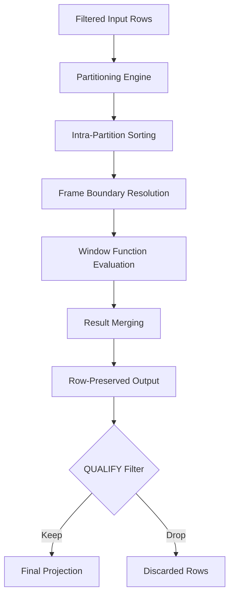

# 1. Title
Analytic Window Functions and Frame Evaluation in Snowflake

# 2. Overview
This pattern defines the procedural architecture for computing row-level metrics without collapsing the result set. It exists to enable running totals, ranking, period-over-period comparisons, and deduplication within a single query execution. The pattern operates in the query optimization and execution layer, evaluated after `FROM`, `WHERE`, `GROUP BY`, and `HAVING`, but before `ORDER BY` and `QUALIFY`. It is consumed by data engineers building stateless transformations, analysts requiring inline calculations, and SnowPro Advanced candidates evaluating frame semantics, memory allocation, and evaluation order boundaries.

# 3. SQL Object Summary
| Object/Pattern | Type | Purpose | Source Objects/Inputs | Output Objects/Behavior | Execution Mode |
|----------------|------|---------|------------------------|--------------------------|----------------|
| Analytic Window Functions | SQL Syntax / Execution Engine | Compute partitioned or ordered metrics per row | Base tables, CTEs, joined result sets | Row-preserved output with computed window columns | Synchronous, inline query evaluation |

# 4. Architecture
The engine processes window functions as a distinct logical stage. It first partitions the dataset by `PARTITION BY` keys, then sorts each partition per `ORDER BY`, establishes a moving frame boundary, and applies the aggregate or ranking function across the frame. Results are merged back into the original row stream without collapsing cardinality.

# 5. Data Flow / Process Flow
1. **Partitioning**
   - Input: Post-`WHERE`/`GROUP BY` result set
   - Transformation: Rows grouped by `PARTITION BY` keys
   - Output: Logically isolated partitions
   - Purpose: Define evaluation boundaries without physical data movement

2. **Ordering**
   - Input: Partitioned rows
   - Transformation: Rows sorted per `ORDER BY` specification within each partition
   - Output: Deterministically ordered row sequence per partition
   - Purpose: Establish calculation sequence for running/relative metrics

3. **Frame Definition**
   - Input: Ordered partition
   - Transformation: `ROWS`, `RANGE`, or `GROUPS` frame boundaries applied
   - Output: Sliding window scope per row
   - Purpose: Limit function evaluation to relevant neighboring rows

4. **Function Evaluation**
   - Input: Frame scope + window function (`SUM`, `LAG`, `RANK`, etc.)
   - Transformation: Calculation applied across frame
   - Output: Scalar metric appended to current row
   - Purpose: Compute inline analytics without aggregation collapse

5. **Qualification & Projection**
   - Input: Full result set with window columns
   - Transformation: `QUALIFY` filters rows post-calculation
   - Output: Filtered or unfiltered row stream
   - Purpose: Reduce cardinality after window evaluation completes

# 6. Logical Breakdown
| Component | Responsibility | Inputs | Outputs | Dependencies | Failure Modes / Risks |
|-----------|----------------|--------|---------|--------------|------------------------|
| `partition_resolver` | Isolate evaluation groups | `PARTITION BY` expressions | Logical partitions | Stable key definitions | Skewed partitions cause memory spills |
| `sort_engine` | Order rows within partitions | `ORDER BY` expressions | Sorted partition streams | Deterministic sort keys | Non-deterministic ordering yields unstable frames |
| `frame_calculator` | Define sliding window scope | Frame specification (`ROWS`/`RANGE`/`GROUPS`) | Row-relative boundaries | Sort order completion | `RANGE` requires numeric/datetime ordering; fails otherwise |
| `function_executor` | Compute metric across frame | Frame data, function type | Scalar value per row | Frame boundaries | `LAST_VALUE` ignores default frame; requires explicit boundary |
| `qualify_filter` | Apply post-window row filtering | Window columns, boolean condition | Filtered row set | Completed window evaluation | Filtering before evaluation produces incorrect results |

# 7. Data Model (State Model)
| Object | Role | Important Fields | Grain | Relationships | Null Handling |
|--------|------|------------------|-------|---------------|---------------|
| `input_result_set` | Pre-window data stream | Source columns, join outputs | Original transactional row | Parent to window output | NULLs participate in partitions; sorted last by default |
| `window_frame_state` | In-memory evaluation context | `partition_key`, `current_row_index`, `frame_start`, `frame_end` | Per row during execution | Transient; not persisted | NULLs in `ORDER BY` break frame boundaries; must be handled |
| `window_output` | Post-calculation result | Original columns + computed window values | Unchanged from input (pre-`QUALIFY`) | Appended metrics | Functions return `NULL` if frame is empty or all inputs `NULL` |

Output Grain: Matches input row count exactly, unless `QUALIFY` is applied. Window functions never reduce cardinality.

# 8. Business Logic (Execution Logic)
- **Evaluation Order**: Executed after `WHERE`, `GROUP BY`, `HAVING`, and window aliases in `SELECT`, but before `ORDER BY`. `QUALIFY` executes strictly after all window calculations.
- **Frame Semantics**: `ROWS` operates on physical row offsets. `RANGE` operates on logical value boundaries (all tied values share the same frame). `GROUPS` operates on peer groups defined by `ORDER BY` ties.
- **Default Frame**: If `ORDER BY` is present without explicit frame, defaults to `RANGE BETWEEN UNBOUNDED PRECEDING AND CURRENT ROW`. If no `ORDER BY`, defaults to `ROWS BETWEEN UNBOUNDED PRECEDING AND UNBOUNDED FOLLOWING`.
- **Ranking Functions**: `ROW_NUMBER()` assigns unique sequential integers. `RANK()` skips numbers on ties. `DENSE_RANK()` increments sequentially on ties. All reset per `PARTITION BY`.
- **Offset Functions**: `LAG`/`LEAD` retrieve preceding/following row values. `default` parameter specifies fallback for boundary rows. `IGNORE NULLS` skips null values in the offset search.
- **Exam-Relevant Defaults**: `QUALIFY` cannot reference `SELECT` aliases in the same query block in all contexts; use CTE for safety. `RANGE` frame requires single `ORDER BY` column of numeric or datetime type. `WINDOW` clause enables frame reuse but does not reduce compute cost.

# 9. Transformations (State Transitions)
| Source State | Derived State | Rule / Evaluation Logic | Meaning | Impact |
|--------------|---------------|-------------------------|---------|--------|
| `unpartitioned_stream` | `logical_partitions` | `OVER (PARTITION BY dept_id)` | Groups rows for isolated calculation | Enables department-level running totals |
| `sorted_partition` | `frame_boundary` | `ROWS BETWEEN 1 PRECEDING AND 1 FOLLOWING` | Sliding window scope | Computes 3-row moving average |
| `frame_scope` | `computed_metric` | `SUM(sales) OVER (...)` | Aggregates values within frame | Preserves row granularity while computing totals |
| `window_output` | `qualified_rows` | `QUALIFY ROW_NUMBER() = 1` | Post-evaluation filtering | Deduplicates without subqueries; reduces final cardinality |

# 10. Parameters / Variables / Configuration
| Name | Type | Purpose | Allowed Values | Default | Where Used | Effect |
|------|------|---------|----------------|---------|------------|--------|
| `ROWS` / `RANGE` / `GROUPS` | Frame Modifier | Define window scope logic | Physical offset, value range, peer group | `RANGE` (if `ORDER BY` present) | `OVER()` clause | Determines how ties and boundaries are handled |
| `UNBOUNDED PRECEDING/FOLLOWING` | Frame Boundary | Set infinite window start/end | N/A | N/A | Frame specification | Expands frame to partition limits |
| `IGNORE NULLS` | Function Modifier | Skip NULLs in offset/first/last functions | `TRUE` implied by keyword | Honors `NULLs` by default | `LAG`, `LEAD`, `FIRST_VALUE`, `LAST_VALUE` | Alters offset traversal; unsupported in `SUM`/`AVG` |
| `QUALIFY` | SQL Clause | Filter rows post-window evaluation | Boolean condition | N/A | Query execution | Replaces `WHERE` on window aliases; executes last |
| `WINDOW` | Clause Alias | Reuse frame definitions | Named frame specs | N/A | `OVER()` reference | Improves readability; no performance gain |

# 11. APIs / Interfaces
| Interface | Invocation Method | Input Structure | Output Structure | Error Behavior | Consumers |
|-----------|-------------------|-----------------|------------------|----------------|-----------|
| `OVER()` | SQL Clause | `PARTITION BY`, `ORDER BY`, frame spec | Window context | Fails on invalid frame syntax or unsupported function combo | Query writers, exam candidates |
| `QUALIFY` | SQL Clause | Window column reference, boolean expr | Filtered rows | Fails if references uncomputed window alias | Pipeline engineers deduplicating inline |
| `LAG`/`LEAD` | SQL Function | Column, offset, default, `IGNORE NULLS` | Offset value | Returns `default` or `NULL` at boundaries | Time-series analysts |
| `ROW_NUMBER`/`RANK` | SQL Function | Implicit frame or explicit `ORDER BY` | Integer sequence | Fails without `ORDER BY` unless `PARTITION BY` only | Deduplication logic |

# 12. Execution / Deployment
- Executed synchronously within query runtime. No background scheduling or asynchronous triggers.
- Compute scales with partition size and sort complexity. Large partitions may spill to remote storage if memory limits are exceeded.
- Upstream dependency: Stable input schema from CTEs or base tables. Window functions require deterministic column references.
- Environment behavior: Identical execution across dev/prod. Performance varies with warehouse size and data skew.
- Runtime assumption: Idempotent when sort keys are unique. Non-deterministic `ORDER BY` produces unstable frame boundaries across reruns.

# 13. Observability
- Monitor partition skew via query profile: inspect `PARTITION BY` cardinality vs row distribution.
- Track memory spill events in `ACCOUNT_USAGE.QUERY_HISTORY` (`SPILLED_BYTES` column). High spill indicates undersized warehouse or excessive frame scope.
- Alert on queries with large `ROWS` frames on high-cardinality partitions, indicating potential compute runaway.
- Validate output grain: `COUNT(*)` before and after `QUALIFY` should match expected deduplication ratio.

# 14. Failure Handling & Recovery
- **Non-deterministic sort order**: Ties in `ORDER BY` produce arbitrary frame boundaries. Detection: Inconsistent results across executions. Recovery: Add unique tie-breaker (e.g., primary key) to `ORDER BY`.
- **Memory spill on large partitions**: Warehouse exceeds memory for partition sort/frame evaluation. Detection: Query profile shows disk spill, execution time spikes. Recovery: Increase warehouse size, add `CLUSTER BY` keys, or pre-aggregate data.
- **Invalid `RANGE` frame on non-numeric/datetime column**: Engine throws syntax error. Detection: Query compilation failure. Recovery: Switch to `ROWS` frame or convert column to numeric/timestamp.
- **`QUALIFY` references uncomputed alias**: Fails with `invalid identifier`. Detection: Query execution error. Recovery: Wrap window calculation in CTE or use full expression in `QUALIFY`.
- **Default `RANGE` frame causes unintended running totals**: `ORDER BY` without explicit frame applies `RANGE BETWEEN UNBOUNDED PRECEDING AND CURRENT ROW`. Detection: Running sum instead of partition total. Recovery: Add explicit `ROWS BETWEEN UNBOUNDED PRECEDING AND UNBOUNDED FOLLOWING`.

# 15. Security & Access Control
- Standard role-based access applies. Window functions inherit `SELECT` privileges on referenced columns.
- Dynamic masking and row access policies evaluate before window computation. Masked columns participate in `ORDER BY` and frame calculations using underlying values, not masked display values.
- No additional security boundaries or isolation required for window execution context.

# 16. Performance / Scalability Considerations
- `PARTITION BY` on high-cardinality columns creates small, fragmented partitions. Low overhead but increases metadata management.
- `PARTITION BY` on low-cardinality columns creates massive partitions, forcing full sort and frame evaluation. High memory and CPU cost. Cluster data on partition keys to reduce sort overhead.
- `RANGE` frames require full sort and tie resolution. Significantly slower than `ROWS` on large datasets. Prefer `ROWS` when tie semantics are irrelevant.
- `QUALIFY` does not reduce compute cost. It filters after full window evaluation. Push row-level filters to `WHERE` clause before window calculation.
- Repeated window definitions on same frame do not share compute state unless explicitly optimized by the query compiler. Materialize heavy window results to temporary tables if reused across multiple queries.
- Exam trap: `LAST_VALUE()` ignores the default `CURRENT ROW` frame boundary, returning only the current row's value. Explicit `ROWS BETWEEN UNBOUNDED PRECEDING AND UNBOUNDED FOLLOWING` is mandatory for correct behavior.

# 17. Assumptions & Constraints
- Assumes `ORDER BY` keys are deterministic when frame boundaries matter. Ties produce non-deterministic frame assignment without unique tie-breakers.
- Assumes `QUALIFY` is supported in the target Snowflake account. Standard edition supports it; legacy clients may require subquery workarounds.
- `IGNORE NULLS` is supported for `LAG`, `LEAD`, `FIRST_VALUE`, `LAST_VALUE`, but not for aggregate window functions like `SUM` or `AVG`.
- `RANGE` frame requires exactly one `ORDER BY` column of numeric or datetime type. Multiple `ORDER BY` columns force `ROWS` or `GROUPS`.
- Window functions cannot be nested directly. Computed window columns cannot serve as inputs to another window function in the same query block. Use CTEs.
- Exam trap: `QUALIFY` evaluates after window functions. Filtering window results in `WHERE` is syntactically invalid. `HAVING` cannot reference window aliases either.
- Default frame for `ORDER BY` without explicit boundary is `RANGE`, not `ROWS`. This causes running calculations instead of partition totals if omitted.

# 18. Future Enhancements
- Replace repetitive `OVER()` clauses with reusable `WINDOW` definitions to standardize frame logic across pipelines.
- Pre-partition and cluster source tables on high-frequency `PARTITION BY` keys to eliminate runtime sort overhead.
- Materialize heavy window outputs (e.g., running totals, complex rank logic) into dynamic tables for downstream consumption.
- Implement explicit tie-breaking columns in all `ORDER BY` clauses to guarantee deterministic frame evaluation across reruns.
- Shift from `QUALIFY`-based deduplication to pre-aggregation patterns when dataset size exceeds warehouse memory thresholds.
