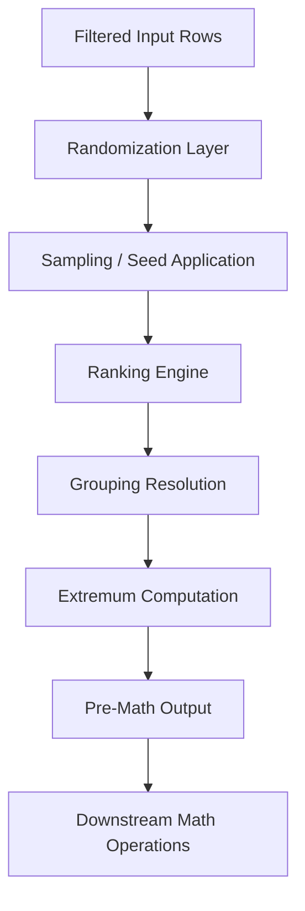

# 1. Title
Pre-Mathematical Calculations: Randomization, Ranking, Grouping, and Extremum Operations in Snowflake

# 2. Overview
This pattern defines the procedural architecture for executing preparatory calculations that establish deterministic state before mathematical or analytical operations in Snowflake. It exists to ensure reproducible sampling, stable ranking assignments, correct aggregation boundaries, and reliable extremum detection prior to downstream computation. The pattern operates in the query preparation and evaluation layer, executed after `FROM`/`WHERE` resolution but before final projection or mathematical derivation. It is consumed by data engineers building reproducible pipelines, analysts requiring stable statistical baselines, and SnowPro Advanced candidates evaluating function determinism, NULL propagation, and optimizer behavior for pre-aggregation logic.

# 3. SQL Object Summary
| Object/Pattern | Type | Purpose | Source Objects/Inputs | Output Objects/Behavior | Execution Mode |
|----------------|------|---------|------------------------|--------------------------|----------------|
| Pre-Math Calculation Pipeline | SQL Transformation Pattern | Generate deterministic random values, assign ranks, establish groups, compute extremum bounds | Base tables, CTEs, filtered result sets | Row-preserved or aggregated output with pre-math columns | Synchronous, inline query evaluation |

# 4. Architecture
The architecture implements a sequential evaluation pipeline where pre-math operations are resolved in logical order: randomization and sampling first (stateless), then ranking and grouping (partition-aware), followed by extremum computation (aggregate-aware). Results feed into downstream mathematical operations with guaranteed deterministic state.

# 5. Data Flow / Process Flow
1. **Random Value Generation**
   - Input: Row stream with unique identifiers
   - Transformation: `RANDOM()` or `RANDOM(seed)` applied per row
   - Output: Float value 0.0–1.0 appended to each row
   - Purpose: Enable reproducible sampling or randomized assignment

2. **Sampling Execution**
   - Input: Randomized or base row stream
   - Transformation: `TABLESAMPLE` with `BERNOULLI` or `SYSTEM` method
   - Output: Reduced row set approximating target percentage
   - Purpose: Create statistically representative subsets for testing or analysis

3. **Rank Assignment**
   - Input: Partitioned and ordered row stream
   - Transformation: `ROW_NUMBER()`, `RANK()`, `DENSE_RANK()`, or `NTILE()` evaluated
   - Output: Integer rank or bucket assigned per row
   - Purpose: Establish ordinal position or quantile membership for downstream logic

4. **Group Boundary Resolution**
   - Input: Rows with grouping keys
   - Transformation: `GROUP BY`, `ROLLUP`, `CUBE`, or `GROUPING SETS` applied
   - Output: Aggregated rows or grouping metadata via `GROUPING_ID`
   - Purpose: Define aggregation scope for summary calculations

5. **Extremum Detection**
   - Input: Grouped or ungrouped numeric/datetime columns
   - Transformation: `MIN()`, `MAX()` evaluated with NULL handling
   - Output: Scalar extremum value per group or global
   - Purpose: Establish bounds for normalization, outlier detection, or range checks

# 6. Logical Breakdown
| Component | Responsibility | Inputs | Outputs | Dependencies | Failure Modes / Risks |
|-----------|----------------|--------|---------|--------------|------------------------|
| `random_generator` | Produce per-row random values | Row context, optional seed | Float 0.0–1.0 per row | Deterministic seed for reproducibility | Unseeded `RANDOM()` produces non-reproducible results across reruns |
| `sampler` | Select representative subset | Row stream, sample percentage, method | Reduced row set | `BERNOULLI` for row-level, `SYSTEM` for block-level | Sample percentage is approximate; exact counts not guaranteed |
| `rank_assigner` | Compute ordinal position or bucket | Partition keys, sort order, rank function | Integer rank or NTILE bucket | Deterministic `ORDER BY` with tie-breakers | Ties without unique sort keys produce non-deterministic ranks |
| `group_resolver` | Establish aggregation boundaries | Grouping keys, rollup/cube specs | Grouped rows or grouping metadata | Stable key definitions; `GROUPING_ID` for subtotal detection | Missing keys in `GROUP BY` cause aggregation errors |
| `extremum_evaluator` | Compute min/max bounds | Numeric/datetime columns, NULL handling rules | Scalar min/max per group | Type-consistent columns; explicit NULL strategy | `MIN`/`MAX` on VARCHAR uses collation, not lexical order |

# 7. Data Model (State Model)
| Object | Role | Important Fields | Grain | Relationships | Null Handling |
|--------|------|------------------|-------|---------------|---------------|
| `input_stream` | Pre-calculation source | Source columns, filter predicates | Original transactional row | Parent to pre-math output | NULLs propagate through ranking; excluded from `MIN`/`MAX` |
| `pre_math_output` | Prepared state for math ops | Original columns + `random_val`, `rank`, `group_id`, `min_val`, `max_val` | Unchanged from input (pre-aggregation) or aggregated grain | Appended pre-math columns | `MIN`/`MAX` return NULL if all inputs NULL; ranking treats NULLs as lowest sort value |
| `grouping_metadata` | Subtotal/total identification | `GROUPING_ID`, `GROUPING()` flags | Per aggregation level | Derived from `ROLLUP`/`CUBE` execution | `GROUPING()` returns 1 for NULL placeholder in subtotal rows |

Output Grain: Matches input row count for randomization, sampling, and ranking operations. Aggregated grain for grouping and extremum operations when `GROUP BY` is applied.

# 8. Business Logic (Execution Logic)
- **Randomization Rules**: `RANDOM()` returns float 0.0–1.0. Without seed, results are non-deterministic across executions. With integer seed, results are deterministic within session but not guaranteed across clusters or versions.
- **Sampling Semantics**: `TABLESAMPLE (n PERCENT)` uses approximate Bernoulli or block sampling. `BERNOULLI` evaluates each row independently; `SYSTEM` samples at micro-partition level (faster, less precise). Exact row counts not guaranteed.
- **Ranking Function Behavior**: `ROW_NUMBER()` assigns unique sequential integers. `RANK()` skips values on ties (1, 2, 2, 4). `DENSE_RANK()` increments sequentially on ties (1, 2, 2, 3). `NTILE(n)` distributes rows as evenly as possible; remainder rows assigned to earlier buckets.
- **Grouping Logic**: `GROUP BY` defines aggregation scope. `ROLLUP` generates hierarchical subtotals. `CUBE` generates all combinations. `GROUPING SETS` explicitly defines required groupings. `GROUPING_ID` returns bitmap for programmatic subtotal detection.
- **Extremum Evaluation**: `MIN()`/`MAX()` ignore NULLs. Result is NULL if all inputs are NULL. On VARCHAR, evaluation follows column collation, not ASCII order. Case-sensitivity depends on collation settings.
- **NULL Propagation**: Ranking functions treat NULLs as lowest sort value by default. Use `NULLS LAST` for explicit control. `MIN`/`MAX` exclude NULLs; use `COALESCE` to substitute defaults if required.
- **Exam-Relevant Defaults**: `RANDOM()` without seed is non-deterministic. `TABLESAMPLE` percentages are approximate. `NTILE` assigns remainder rows to earlier buckets. `GROUPING_ID` bitmap: bit 0 = rightmost `GROUP BY` column. `MIN`/`MAX` on strings use collation, not lexical order.

# 9. Transformations (State Transitions)
| Source State | Derived State | Rule / Evaluation Logic | Meaning | Impact |
|--------------|---------------|-------------------------|---------|--------|
| `raw_rows` | `randomized_rows` | `RANDOM(42) AS rand_val` | Deterministic random assignment | Enables reproducible sampling or A/B bucketing |
| `randomized_rows` | `sampled_subset` | `TABLESAMPLE (10 PERCENT) BERNOULLI` | Approximate row-level sampling | Reduces dataset size for testing; not exact count |
| `ordered_partition` | `ranked_rows` | `ROW_NUMBER() OVER (ORDER BY score DESC, id)` | Deterministic rank assignment | Enables top-N selection or quantile analysis |
| `grouped_data` | `subtotals` | `GROUP BY ROLLUP(region, category)` | Hierarchical aggregation | Generates summary rows with `GROUPING_ID` markers |
| `numeric_column` | `extremum_bounds` | `MIN(val) OVER (PARTITION BY group) AS min_val` | Per-group min/max calculation | Enables normalization or outlier flagging inline |

# 10. Parameters / Variables / Configuration
| Name | Type | Purpose | Allowed Values | Default | Where Used | Effect |
|------|------|---------|----------------|---------|------------|--------|
| `RANDOM(seed)` | SQL Function | Generate deterministic random values | Integer seed | None (non-deterministic) | Randomization logic | Same seed produces same sequence within session |
| `TABLESAMPLE` method | SQL Clause | Control sampling strategy | `BERNOULLI`, `SYSTEM` | `SYSTEM` (implicit) | Sampling queries | `BERNOULLI` more precise; `SYSTEM` faster on large tables |
| `NTILE(n)` | SQL Function | Assign rows to quantile buckets | Integer n ≥ 1 | N/A | Ranking logic | Remainder rows assigned to earlier buckets |
| `GROUPING_ID` | SQL Function | Identify subtotal/total rows | N/A | N/A | `ROLLUP`/`CUBE` queries | Returns bitmap; use `BITAND` to decode |
| `COLLATION` | Object Parameter | Define string comparison behavior | `utf8`, `utf8_ci`, `utf8_ci_ai`, etc. | Table/column default | `MIN`/`MAX` on VARCHAR | Affects extremum evaluation order for strings |
| `NULLS FIRST`/`LAST` | Sort Modifier | Control NULL position in ordering | `FIRST`, `LAST` | `FIRST` (default for ascending) | `ORDER BY` in ranking | Determines rank assignment for NULL values |

# 11. APIs / Interfaces
| Interface | Invocation Method | Input Structure | Output Structure | Error Behavior | Consumers |
|-----------|-------------------|-----------------|------------------|----------------|-----------|
| `RANDOM([seed])` | SQL Function | Optional integer seed | Float 0.0–1.0 | None; always succeeds | Sampling, randomization logic |
| `TABLESAMPLE` | SQL Clause | Percentage, method, optional seed | Reduced row set | Fails on invalid percentage or method | Testing, exploratory analysis |
| `ROW_NUMBER`/`RANK`/`DENSE_RANK`/`NTILE` | SQL Function | Implicit or explicit `OVER()` clause | Integer sequence or bucket | Fails without `ORDER BY` for ranking functions | Deduplication, quantile analysis |
| `GROUPING_ID`/`GROUPING` | SQL Function | Column references from `GROUP BY` | Integer bitmap or 0/1 flag | Fails if column not in `GROUP BY` | Subtotal detection in rollup queries |
| `MIN`/`MAX` | SQL Aggregate | Column expression, optional `FILTER` | Scalar extremum | Fails on type mismatch; returns NULL if all inputs NULL | Bounds calculation, normalization |

# 12. Execution / Deployment
- Executed synchronously within query runtime. No background scheduling or asynchronous triggers.
- Randomization and ranking operations scale with row count and partition size. Large partitions may spill to disk if memory limits exceeded.
- Sampling reduces upstream data volume early in execution, improving downstream performance.
- Upstream dependency: Stable input schema and deterministic sort keys for reproducible ranking.
- Environment behavior: Identical logic across dev/prod. Performance varies with warehouse size and data distribution.
- Runtime assumption: Idempotent when seeds and sort keys are fixed. Non-deterministic operations produce unstable results across reruns.

# 13. Observability
- Monitor randomization reproducibility: Compare `RANDOM(seed)` outputs across executions for identical inputs.
- Track sampling accuracy: `SELECT COUNT(*) FROM sample / COUNT(*) FROM source` vs target percentage.
- Validate ranking determinism: Check for duplicate ranks or unexpected sequences when tie-breakers are missing.
- Use `ACCOUNT_USAGE.QUERY_HISTORY` to identify queries with high `SPILLED_BYTES` during ranking or grouping operations.
- Alert on `MIN`/`MAX` results that deviate from expected ranges, indicating upstream data quality issues or collation mismatches.

# 14. Failure Handling & Recovery
- **Non-deterministic randomization**: `RANDOM()` without seed produces different results per execution. Detection: Inconsistent sampling or assignment across reruns. Recovery: Always specify integer seed for reproducible pipelines.
- **Approximate sampling deviation**: `TABLESAMPLE` returns more or fewer rows than target percentage. Detection: Row count mismatch vs expectation. Recovery: Use `ROW_NUMBER() + QUALIFY` for exact top-N; accept approximation for exploratory work.
- **Non-deterministic ranking**: Ties in `ORDER BY` produce arbitrary rank assignment. Detection: Rank values change across reruns. Recovery: Add unique tie-breaker (e.g., primary key) to `ORDER BY` clause.
- **Incorrect `GROUPING_ID` interpretation**: Bitmap decoding errors cause misclassification of subtotal rows. Detection: Aggregation logic applies wrong business rules to summary rows. Recovery: Use `GROUPING()` function per column for explicit detection.
- **Collation mismatch in `MIN`/`MAX`**: String extremum evaluation follows unexpected order. Detection: Results differ from lexical expectation. Recovery: Explicitly set column collation or use `COLLATE` clause in query.

# 15. Security & Access Control
- Standard role-based access applies. Functions inherit `SELECT` privileges on referenced columns.
- Dynamic masking evaluates before pre-math operations. Masked values participate in ranking and extremum calculations using underlying data, not masked display values.
- Sampling does not bypass row access policies. Policies evaluate before `TABLESAMPLE` reduces row set.
- No additional security boundaries required for pre-math execution context.

# 16. Performance / Scalability Considerations
- `RANDOM()` adds minimal CPU overhead; negligible impact on large datasets.
- `TABLESAMPLE SYSTEM` scans fewer micro-partitions than `BERNOULLI`; prefer for large tables when precision tolerance allows.
- Ranking functions require full partition sort. Large partitions with non-clustered data cause memory spill. Cluster on `PARTITION BY` keys to reduce sort overhead.
- `NTILE` requires full partition sort and row count; cannot stream. Avoid on unbounded partitions.
- `MIN`/`MAX` benefit from micro-partition pruning when used with `WHERE` predicates. Late filtering bypasses pruning.
- `GROUPING SETS` with many combinations generates exponential output rows. Explicitly define required groupings; avoid `CUBE` on high-cardinality dimensions.
- Exam trap: `RANDOM(seed)` is deterministic within session but not guaranteed across cluster resizes or Snowflake versions. Do not rely on cross-version reproducibility.

# 17. Assumptions & Constraints
- Assumes `RANDOM(seed)` reproducibility is session-scoped. Cross-session or cross-cluster reproducibility is not guaranteed.
- Assumes `TABLESAMPLE` approximate behavior is acceptable. For exact row counts, use `ROW_NUMBER() + QUALIFY` or pre-materialized sample tables.
- Assumes ranking `ORDER BY` includes unique tie-breakers. Without them, rank assignment is non-deterministic on tied values.
- Assumes `NTILE(n)` distributes remainder rows to earlier buckets. Document this behavior for downstream quantile logic.
- Assumes `MIN`/`MAX` on VARCHAR follows collation rules. Case-sensitive vs case-insensitive comparison depends on column or session collation.
- `GROUPING_ID` bitmap: rightmost `GROUP BY` column = bit 0. Decode using `BITAND(GROUPING_ID, POWER(2, position))`.
- Exam trap: `RANDOM()` returns 0.0 inclusive to 1.0 exclusive. `TABLESAMPLE` percentage is approximate, not exact. `NTILE` assigns remainder rows to earlier buckets, not randomly distributed.

# 18. Future Enhancements
- Replace unseeded `RANDOM()` calls with explicit seed management via metadata tables to ensure cross-pipeline reproducibility.
- Pre-materialize frequent sampling subsets as transient tables with deterministic `ROW_NUMBER()` filtering to avoid repeated `TABLESAMPLE` approximation.
- Cluster source tables on high-frequency `PARTITION BY` keys for ranking operations to eliminate runtime sort overhead.
- Implement explicit collation declarations on VARCHAR columns used in `MIN`/`MAX` to prevent environment-dependent extremum evaluation.
- Shift from `NTILE`-based quantile assignment to `PERCENT_RANK` or `CUME_DIST` when business logic requires proportional rather than bucketed ranking.
