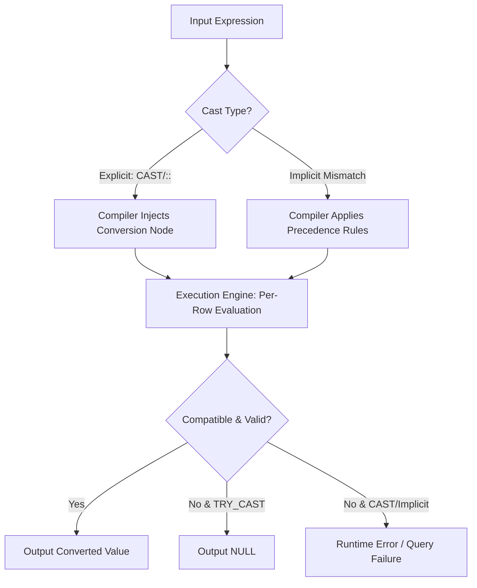

# 1. Perform Casting: Data Type Conversion in Snowflake SQL
Documentation of explicit and implicit type coercion mechanisms used to align data types for evaluation, storage, and presentation.

# 2. Overview
Casting converts values from one Snowflake data type to another to satisfy expression evaluation rules, enforce schema contracts, or standardize output for downstream consumers. It exists to resolve type mismatches during query compilation and execution, prevent join/filter errors, and ensure deterministic results across BI, ETL, and analytical workloads. Within Snowflake architecture, casting operates at the expression evaluation layer, applied per-row during projection or predicate evaluation. The feature is consumed by engineers building transformation pipelines, analysts querying heterogeneous sources, and SnowPro candidates tested on type precedence, error handling, and pruning behavior.

# 3. SQL Object Summary

| Object/Feature | Type | Purpose | Source Objects/Inputs | Output/Behavior | Invocation |
|----------------|------|---------|----------------------|-----------------|------------|
| `CAST(expr AS type)` | SQL Function | Explicit, strict type conversion | Column, literal, or expression | Converted value or runtime error on failure | Query projection, filter, DDL |
| `TRY_CAST(expr AS type)` | SQL Function | Explicit, safe type conversion | Column, literal, or expression | Converted value or NULL on failure | Query projection, filter, conditional logic |
| `::` Operator | Shorthand Syntax | Explicit type conversion (alias for `CAST`) | Column, literal, or expression | Identical to `CAST` behavior | Query projection, filter |
| Implicit Casting | Engine Behavior | Automatic type resolution when types mismatch | Heterogeneous operands in expressions | Coerced value based on precedence matrix | Automatic during compilation |

# 4. Architecture
Casting is handled by the Snowflake SQL compiler and execution engine. The compiler resolves type compatibility during query planning. If explicit casting is present, the engine injects a type conversion node into the execution plan. If implicit casting is required, the compiler applies Snowflake's precedence rules to determine the target type before generating the execution graph.

# 5. Data Flow / Process Flow
1. **Input Evaluation**: Query engine reads source column or literal values.
2. **Type Resolution**: Compiler checks operand types. Applies explicit directive or implicit precedence rules to select target type.
3. **Conversion Execution**: Engine applies conversion logic per row. Format strings are resolved against session parameters for string-to-temporal/numeric conversions.
4. **Validation**: Engine verifies if value fits target type constraints (precision, scale, valid date format, JSON structure).
5. **Output Routing**: Valid converted values proceed to projection, filter evaluation, or join resolution. Invalid values trigger NULL (if `TRY_CAST`) or fail the query (if `CAST`).

Row count remains stable. Cardinality and grain do not change. Only value representation and type metadata are modified.

# 6. Logical Breakdown

| Component | Responsibility | Inputs | Outputs | Dependencies | Failure Modes |
|-----------|----------------|--------|---------|--------------|---------------|
| Explicit Casting (`CAST`/`::`) | Enforces strict type conversion | Expression, target type | Typed value or error | SQL syntax parser | Invalid format, precision loss, type incompatibility |
| Safe Casting (`TRY_CAST`) | Suppresses conversion errors | Expression, target type | Typed value or NULL | Same as CAST | Silent data loss if NULLs are unhandled downstream |
| Implicit Conversion Resolver | Auto-coerces mismatched operands | Two or more differing types | Single resolved type | Precedence matrix | Unexpected rounding, loss of fractional precision |
| Format Parameter Interpreter | Parses strings using session rules | String input, temporal/numeric target | Parsed value or error | `DATE_INPUT_FORMAT`, `TIMESTAMP_INPUT_FORMAT`, session locale | Locale mismatch, non-ISO string rejection |
| Precision/Scale Adjuster | Trims or rounds numeric conversions | High-precision number, target precision | Adjusted number | Target type definition | Silent truncation, rounding divergence |

# 7. Data Model
Casting is a scalar, row-level operation. It does not alter table schema, partitioning, or micro-partition metadata unless applied within a `CREATE` or `ALTER` statement.
- **Input Grain**: Source row level
- **Output Grain**: Source row level (1:1 mapping)
- **Key Behavior**: Null inputs propagate as Null outputs. Data type metadata in result set changes. No column relationships are modified.

# 8. Business Logic (Execution Logic)
- **Precedence Rules**: Snowflake limits implicit casting. When types differ, the engine promotes to the type that preserves maximum information (e.g., `INTEGER` → `DECIMAL` → `FLOAT` → `VARCHAR`). Cross-category implicit casts (e.g., `VARCHAR` → `BOOLEAN`) are restricted and often require explicit syntax.
- **Strict vs. Safe Evaluation**: `CAST` enforces strict evaluation. Any invalid format or out-of-range value aborts the query. `TRY_CAST` returns `NULL` on failure, enabling conditional routing without pipeline interruption.
- **Session Parameter Dependency**: String-to-date/time/numeric conversions rely on session-level format parameters. If unset or mismatched, parsing fails or produces incorrect values.
- **Exam-Relevant Defaults**: `TRY_CAST` is the only safe casting function in Snowflake. Implicit casting does not apply to all type pairs. The `::` shorthand is functionally identical to `CAST`. `FLOAT` to `NUMBER` conversion rounds to nearest even (banker's rounding) by default unless explicitly truncated.

# 9. Transformations
| Source Input | Target Output | Rule/Logic | Execution Meaning | Impact |
|--------------|---------------|------------|-------------------|--------|
| `VARCHAR` (ISO) → `TIMESTAMP_NTZ` | `TIMESTAMP_NTZ` | Parses using `TIMESTAMP_INPUT_FORMAT` or ISO-8601 | Enables temporal filtering/windowing | Enables date math, blocks pruning if predicate wraps clustering key |
| `NUMBER(38,10)` → `NUMBER(18,2)` | `NUMBER(18,2)` | Rounds/truncates to target scale | Reduces precision for presentation/storage | Potential data loss, changes join equality outcomes |
| `VARCHAR` → `NUMBER` | `NUMBER` | Validates numeric pattern, applies decimal parsing | Enables aggregation/filtering on string-sourced metrics | Fails on non-numeric characters unless `TRY_CAST` used |
| `BOOLEAN` → `VARCHAR` | `VARCHAR` | Converts `TRUE`/`FALSE` → `'TRUE'`/`'FALSE'` | Standardizes output for BI/export | Increases storage size, prevents numeric indexing |

# 10. Parameters / Variables / Configuration

| Name | Type | Purpose | Allowed Values/Format | Default | Where Used | Effect |
|------|------|---------|----------------------|---------|------------|--------|
| `CAST()` / `TRY_CAST()` | SQL Function | Explicit type conversion | Any valid Snowflake type | N/A | Projection, filters, DDL | Determines error vs. NULL behavior |
| `::` | Operator | Shorthand explicit conversion | Any valid type | N/A | Expression syntax | Identical to `CAST` |
| `DATE_INPUT_FORMAT` | Session Parameter | Controls string-to-date parsing | Valid Snowflake format strings | Session inherits from account | String → `DATE`/`TIMESTAMP` | Mismatch causes parse failure or incorrect values |
| `TIMESTAMP_LTZ_OUTPUT_FORMAT` | Session Parameter | Controls temporal output formatting | Valid format strings | Auto | `VARCHAR` presentation | Affects downstream string consumption, not internal storage |
| `STRICT_JSON_OUTPUT` | Session Parameter | Controls JSON numeric handling | TRUE/FALSE | TRUE | JSON → numeric casting | FALSE allows lossy numeric casting in JSON contexts |

# 11. APIs / Interfaces
Casting is exposed exclusively through standard SQL interfaces within Snowflake:
- **Invocation**: Embedded in `SELECT`, `WHERE`, `JOIN`, `GROUP BY`, or `CREATE/ALTER` statements.
- **Input Structure**: `expression AS target_type`
- **Output Structure**: Single scalar column per expression evaluation
- **Error Behavior**: `CAST` raises compilation or runtime error. `TRY_CAST` returns NULL.
- **Consumers**: ETL frameworks, BI semantic layers, data validation checks, ad-hoc analysis.

# 12. Execution / Deployment
- **Execution Mode**: Evaluated at query runtime during expression evaluation.
- **Materialization**: Not persisted unless embedded in `CREATE TABLE AS SELECT`, `VIEW`, or `MATERIALIZED VIEW`.
- **Orchestration**: Runs as part of standard query execution plan. No external scheduling required.
- **Environment Consistency**: Behavior is deterministic across DEV/PROD provided session parameters and data distributions match. Differences in source data quality will trigger divergent `TRY_CAST` null rates.

# 13. Observability
- **Query History**: `QUERY_HISTORY` view shows compilation/execution time increases for queries with heavy casting, particularly across wide tables.
- **Error Tracking**: `CAST` failures appear in query error logs with `Invalid input syntax` or `Numeric value is out of range`. `TRY_CAST` failures are silent; must be monitored via `COUNT(CASE WHEN TRY_CAST(...) IS NULL THEN 1 END)`.
- **Data Quality Checks**: Cast rejection rates indicate upstream schema drift or dirty data ingestion. High `TRY_CAST` NULL rates require source validation or format standardization.
- **Plan Inspection**: `EXPLAIN` output reveals `Cast` operator nodes. Placement in the plan indicates when conversion occurs relative to filters or joins.

# 14. Failure Handling & Recovery

| Failure Scenario | Symptom | Detection | Fallback | Recovery |
|------------------|---------|-----------|----------|----------|
| Invalid String Format | `CAST` fails, query aborts | Query error log | `TRY_CAST` | Clean source data, standardize input format, or apply regex filtering pre-cast |
| Precision/Scale Loss | Silent rounding or truncation | Output validation diff | `TRY_CAST` won't help (value is valid but altered) | Increase target precision, or apply explicit rounding logic before casting |
| Implicit Conversion Ambiguity | Unexpected type promotion | `DESCRIBE` output vs expectation | Rewrite with explicit `CAST` | Enforce explicit typing in all expressions |
| Pruning Bypass | Slow query on clustered column | `EXPLAIN` shows full scan, `CAST` wraps clustering key | None | Move `CAST` outside filter, or re-cluster on correctly typed column |
| High `TRY_CAST` NULL Rate | Downstream joins/aggregations lose rows | `NULL` count spike in target table | Filter or default values | Investigate upstream format drift, enforce schema contracts, add validation stage |

# 15. Security & Access Control
- **Privileges**: Standard `SELECT`/`USAGE` permissions apply. Casting does not bypass role-based access controls.
- **Masking Policies**: Dynamic data masking and row access policies evaluate post-cast. Casting a masked column to `VARCHAR` does not expose underlying raw values unless the masking policy is disabled.
- **Sensitive Data**: Casting does not alter PII classification. Ensure format conversions comply with data retention and compliance requirements.

# 16. Performance / Scalability Considerations
- **Partition Pruning**: Applying `CAST()` to a clustering or partition key in a `WHERE` clause prevents micro-partition pruning. The engine must scan and cast before filtering. Rewrite as `WHERE clustering_column = CAST(filter_value AS key_type)` to preserve pruning.
- **Compute Cost**: Casting is CPU-bound per row. Wide tables with multiple heavy conversions (e.g., `VARCHAR` → `TIMESTAMP` → `VARCHAR`) increase virtual warehouse CPU utilization and query duration.
- **Implicit Conversion Overhead**: The compiler resolves implicit casts before execution. Excessive implicit coercion across joins degrades plan optimization and increases compilation time.
- **Caching Impact**: Result reuse depends on exact query text and session parameters. Changing `DATE_INPUT_FORMAT` or swapping `CAST` for `TRY_CAST` invalidates cached results for that query signature.

# 17. Assumptions & Constraints
- Explicit casting is required for most cross-category conversions. Snowflake does not perform aggressive implicit coercion like some legacy RDBMS engines.
- `TRY_CAST` returns `NULL` on failure, never an error. This is a frequent SnowPro trap when candidates expect error suppression to log warnings.
- Session parameters control string parsing behavior. Queries relying on implicit session formats are non-deterministic across different user sessions.
- Casting does not change underlying storage format. `CREATE TABLE` with casted columns stores data in the target type; subsequent queries on that table do not require runtime casting.
- `FLOAT` to `NUMBER` conversion applies rounding. Exact precision preservation requires explicit decimal types.

# 18. Future Enhancements
- Introduce explicit format specifiers directly within casting functions (e.g., `CAST(value AS DATE 'YYYYMMDD')`) to eliminate session parameter dependency.
- Add compile-time static analysis warnings for implicit conversions that risk precision loss or pruning bypass.
- Extend `TRY_CAST` to return error metadata alongside NULL, enabling downstream logging without query failure.
- Implement pushdown optimization for `CAST` in filters when target type matches underlying storage, preserving pruning capability automatically.
