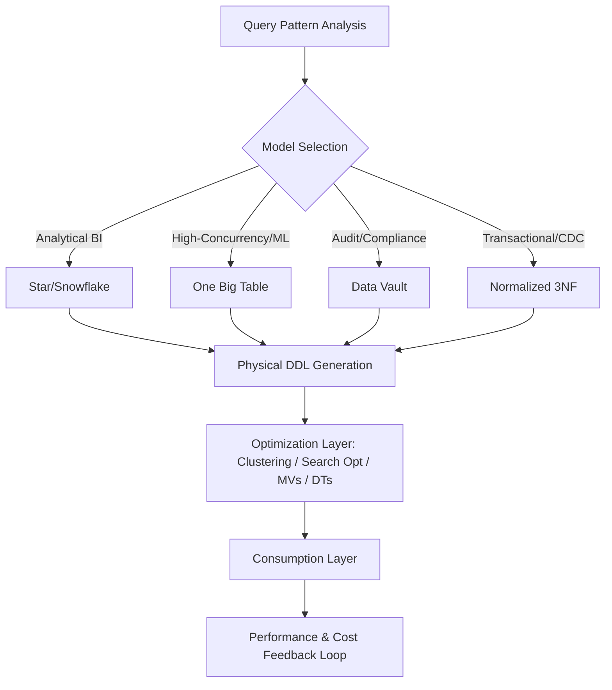

# 1. Title
Selecting and Implementing Effective Data Models in Snowflake

# 2. Overview
This pattern defines the procedural architecture for evaluating, selecting, and physically implementing data models within Snowflake's decoupled storage and compute environment. It exists to align logical data structures with query patterns, cost constraints, and maintenance overhead while leveraging Snowflake's micro-partition pruning, clustering, and materialization capabilities. The pattern operates at the schema design phase, bridging business requirements and physical DDL execution. It is consumed by data architects, transformation engineers, analytics platform owners, and SnowPro Advanced candidates evaluating modeling trade-offs, optimization boundaries, and engine execution behavior.

# 3. SQL Object Summary
| Object/Pattern | Type | Purpose | Source Objects/Inputs | Output Objects/Behavior | Execution Mode |
|----------------|------|---------|------------------------|--------------------------|----------------|
| Star/Snowflake Schema | Logical Model + DDL | Optimize read performance for analytical joins | Curated dimension/fact datasets | `fact_*`, `dim_*` tables with FK relationships (enforced logically) | Batch or incremental via `TASK`/orchestrator |
| One Big Table (OBT) | Logical Model + DDL | Eliminate joins for high-throughput BI/ML queries | Joined dimension/fact datasets | Wide denormalized table | Incremental `MERGE` or dynamic table refresh |
| Data Vault 2.0 | Logical Model + DDL | Preserve auditability, handle source system changes | Raw staging, CDC streams | `hub_*`, `link_*`, `sat_*` tables | Append-only `INSERT` with hash generation |
| Normalized (3NF) | Logical Model + DDL | Support transactional integrity, complex updates | Source OLTP extracts | Highly relational tables with constraints | Row-level `UPDATE`/`DELETE` or `MERGE` |

# 4. Architecture
Snowflake's architecture decouples storage from compute, allowing multiple modeling paradigms to coexist. Logical model selection drives physical implementation: star schemas map to clustered fact/dimension tables; OBTs map to wide tables with selective clustering; Data Vaults map to append-only hash-partitioned tables. Snowflake's micro-partition engine, clustering service, and materialization features (Dynamic Tables, Materialized Views, Search Optimization) abstract traditional RDBMS constraints, shifting optimization from rigid normalization to query-driven physical design.

# 5. Data Flow / Process Flow
1. **Requirement & Pattern Analysis**
   - Input: Query workload profile, SLA requirements, data volume, update frequency
   - Transformation: Map workloads to model suitability matrix
   - Output: Selected logical model archetype
   - Purpose: Align physical design with actual consumption patterns

2. **Schema Definition & DDL Generation**
   - Input: Logical model spec, naming conventions, data types
   - Transformation: `CREATE TABLE`/`VIEW` statements with constraints, retention, change tracking
   - Output: Physical schema objects
   - Purpose: Establish storage structure and metadata contracts

3. **Optimization Configuration**
   - Input: Query profile, high-cardinality filter columns, join patterns
   - Transformation: Apply `CLUSTER BY`, enable Search Optimization, configure Dynamic Tables/Materialized Views
   - Output: Optimized physical objects with pruning/indexing metadata
   - Purpose: Reduce scanned data and compute consumption

4. **Validation & Consumption**
   - Input: Populated model objects, representative query suite
   - Transformation: Query execution, profile analysis, clustering health checks
   - Output: Validated model ready for production traffic
   - Purpose: Confirm performance, cost, and correctness before handoff

# 6. Logical Breakdown
| Component | Responsibility | Inputs | Outputs | Dependencies | Failure Modes / Risks |
|-----------|----------------|--------|---------|--------------|------------------------|
| `pattern_analyzer` | Map queries to model archetype | Workload metrics, join cardinality, filter selectivity | Recommended model type | Stable query profile; representative sample | Misclassification leads to over-engineering or join bottlenecks |
| `schema_generator` | Translate logical spec to DDL | Entity definitions, data types, relationships | `CREATE` statements with metadata flags | Naming standards; type compatibility | Inconsistent types break downstream joins or coercions |
| `optimizer_configurator` | Apply Snowflake-specific tuning | Filter columns, sort patterns, refresh SLA | `CLUSTER BY`, `SEARCH OPTIMIZATION`, `DYNAMIC TABLE` configs | Query profile data; warehouse credits | Over-clustering increases micro-partition reorganization cost |
| `materialization_manager` | Implement caching/refresh logic | Source tables, target lag, consistency requirements | Dynamic tables or MVs | `CHANGE_TRACKING` enabled; compute budget | Staleness or refresh cost exceeds SLA |
| `validation_engine` | Verify model behavior | Production-like queries, clustering metrics | Performance reports, pruning ratios | Query history access; test data | False positives from unrepresentative query samples |

# 7. Data Model (or State Model)
| Object | Role | Important Fields | Grain | Relationships | Null Handling |
|--------|------|------------------|-------|---------------|---------------|
| `fact_table` (Star) | Transactional/behavioral events | `fact_pk`, `dim_fk_*`, `measure_*`, `event_ts` | Per business event | 1:N to dimension tables via FKs (logical only) | Nullable measures allowed; FKs enforced at transformation layer |
| `dim_table` (Star) | Descriptive attributes | `dim_pk`, `attribute_*`, `valid_from`, `valid_to` | Per entity version | 1:1 or 1:N to facts | `NULL` attributes preserved; SCD2 uses `NULL` for open-ended `valid_to` |
| `obt_table` (Denormalized) | Pre-joined analytical dataset | `entity_pk`, `measure_*`, `dimension_attr_*`, `snapshot_ts` | Per analytical row | Self-contained; no joins required | `COALESCE` applied during flattening; missing dims yield `NULL` placeholders |
| `hub/sat/link` (Vault) | Audit-trail oriented storage | `hash_key`, `load_dts`, `record_source`, `payload` | Per source system change | Hash-based joins across hubs/links/sats | `NULL` payloads stored as empty `VARIANT`; hash collisions prevented via concatenation logic |

Output Grain: Deterministic per model archetype. Star/OBT: one row per analytical entity/event. Data Vault: one row per source change. Normalized: one row per transactional record.

# 8. Business Logic (Execution Logic)
- **Selection Rules**: Star/Snowflake for multi-dimensional BI with frequent joins. OBT for high-concurrency dashboards, ML feature stores, or ad-hoc exploration. Data Vault for regulatory compliance, multi-source CDC, or unknown future query patterns. Normalized for write-heavy operational sync or complex constraint enforcement.
- **Implementation Constraints**: Snowflake does not enforce foreign key constraints. Joins rely on transformation logic and optimizer hints. `CLUSTER BY` applies to 1–4 columns maximum; beyond that, pruning degrades.
- **Materialization Strategy**: Use Dynamic Tables for incremental, schema-evolving pipelines. Use Materialized Views for cached, highly selective aggregations with strict consistency requirements. Avoid MVs on wide joins or frequent source mutations.
- **Filter & Join Optimization**: Snowflake's optimizer reorders joins automatically. Provide clustering on high-selectivity filter columns, not join keys alone. Join elimination occurs when MVs or search optimization cover predicates.
- **Exam-Relevant Defaults**: Clustering keys are optional and maintained automatically (auto-clustering). Search Optimization requires explicit `ADD SEARCH OPTIMIZATION ON TABLE` and is most effective for high-selectivity point lookups. Dynamic Tables refresh on `TARGET_LAG` intervals, not instantaneously. Materialized Views block underlying DDL changes and increase storage cost. `CHANGE_TRACKING` must be explicitly enabled at creation.

# 9. Transformations (State Transitions)
| Source State | Derived State | Rule / Evaluation Logic | Meaning | Impact |
|--------------|---------------|-------------------------|---------|--------|
| `normalized_sources` | `star_schema_objects` | `JOIN` dimensions, aggregate measures, partition by grain | Analytical optimization | Reduces join count; increases storage duplication |
| `star_objects` | `obt_projection` | `LEFT JOIN` all dims, flatten arrays, apply `COALESCE` | Denormalization for BI/ML | Eliminates runtime joins; increases table width and update cost |
| `raw_cdc_stream` | `vault_hubs_sats` | `HASH(CONCAT(keys))` as PK, append-only insert, track `load_dts` | Audit-preserving ingestion | High write throughput; complex query patterns require link traversal |
| `base_tables` | `dynamic_table` | `REFRESH_MODE = 'INCREMENTAL'`, `TARGET_LAG = '1 hour'` | Automated incremental materialization | Decouples compute from consumer queries; introduces controlled latency |

# 10. Parameters / Variables / Configuration
| Name | Type | Purpose | Allowed Values | Default | Where Used | Effect |
|------|------|---------|----------------|---------|------------|--------|
| `CLUSTER BY` | DDL Clause | Define micro-partition sort order | 1–4 column expressions | None (unordered) | Table/View creation | Enables partition pruning on filter predicates |
| `TARGET_LAG` | Object Parameter | Control refresh cadence for Dynamic Tables | Time interval or `DOWNSTREAM` | None (mandatory) | Dynamic Table definition | Balances freshness vs compute cost |
| `CHANGE_TRACKING` | DDL Option | Enable row-level change metadata | `TRUE`, `FALSE` | `FALSE` | Table creation | Required for Dynamic Tables and incremental CDC |
| `DATA_RETENTION_TIME_IN_DAYS` | Object Parameter | Define Time Travel window | 0–1 (Standard), 0–90 (Enterprise) | 1 | Table/Schema/DB | Enables historical queries and clone recovery |
| `ENABLE_SEARCH_OPTIMIZATION` | DDL Option | Activate search service index | N/A | Disabled | Table creation | Improves point lookup and high-cardinality filter performance |

# 11. APIs / Interfaces
| Interface | Invocation Method | Input Structure | Output Structure | Error Behavior | Consumers |
|-----------|-------------------|-----------------|------------------|----------------|-----------|
| `CREATE TABLE ... CLUSTER BY` | DDL Statement | Table spec + cluster expression | Optimized table object | Fails on unsupported types or >4 columns | Architects, engineers |
| `CREATE DYNAMIC TABLE` | DDL Statement | Query, `TARGET_LAG`, `REFRESH_MODE` | Auto-managed materialized object | Fails if query non-deterministic or `CHANGE_TRACKING` missing | Pipeline operators |
| `SYSTEM$CLUSTERING_INFORMATION` | SQL Function | Table name, filter columns | Pruning efficiency metrics | Returns `NULL` if table not clustered | Performance analysts |
| `ALTER TABLE ... ADD SEARCH OPTIMIZATION` | DDL Statement | Column list, access pattern | Indexed table metadata | Fails if table exceeds size limits or columns unsupported | Query optimizers |
| `INFORMATION_SCHEMA.TABLES` | System View | Query filter on `CLUSTERING_KEY`, `RETENTION_TIME` | Schema metadata | Requires role privileges | Governance, cost tracking |

# 12. Execution / Deployment
- Executed via CI/CD pipelines (dbt, Terraform, Flyway) with environment promotion (dev → test → prod).
- DDL changes are atomic; schema evolution uses `ALTER TABLE ADD/DROP/RENAME COLUMN`. Breaking changes require recreation or backfill.
- Upstream dependency: Cleaned, type-resolved data in staging. Optimization applied after initial population.
- Environment behavior: Dev/test uses minimal clustering and shorter retention. Production enforces `CLUSTER BY`, Search Optimization, and strict `TARGET_LAG`.
- Runtime assumption: Model performance is query-dependent. Optimization without representative workload analysis yields wasted credits.

# 13. Observability
- Monitor clustering health: `SELECT SYSTEM$CLUSTERING_INFORMATION('table', 'col');` tracks `average_depth`, `partition_depths_histogram`.
- Track Dynamic Table freshness: `QUERY_HISTORY` + `DYNAMIC_TABLE_REFRESH_HISTORY` views show execution duration, rows processed, lag adherence.
- Evaluate pruning efficiency: Compare `BYTES_SCANNED` vs `BYTES_SPILLED` in Query Profile. High scan-to-filter ratio indicates misaligned clustering.
- Alert on Search Optimization staleness: Index rebuilds trigger automatically; monitor `ACCOUNT_USAGE.SEARCH_OPTIMIZATION_HISTORY` for coverage gaps.
- Implement reconciliation: Validate row counts and checksums across source and materialized targets post-refresh.

# 14. Failure Handling & Recovery
- **Clustering key misalignment**: Filter predicates bypass pruning. Detection: High `PARTITIONS_SCANNED` in Query Profile. Recovery: Re-evaluate query patterns, adjust `CLUSTER BY`, recluster via `ALTER TABLE`.
- **Dynamic Table refresh failure**: Non-deterministic query or upstream schema change breaks incremental logic. Detection: Refresh status `FAILED`, lag exceeds `TARGET_LAG`. Recovery: Fix query determinism, enable `FULL` refresh temporarily, reapply `INCREMENTAL`.
- **Search Optimization index corruption/staleness**: Point lookups degrade to full scans. Detection: Latency spikes, `SEARCH_OPTIMIZATION_PROGRESS < 100%`. Recovery: `ALTER TABLE SUSPEND SEARCH OPTIMIZATION`, then `RESUME`; monitor rebuild.
- **Join explosion in OBT**: Wide table mutations cause cartesian-like `MERGE` costs. Detection: Warehouse credits spike during updates. Recovery: Partition update window, switch to incremental `MERGE` with hash diff, or revert to star schema.
- **Schema drift breaking materialized views**: DDL changes on base table invalidate MV. Detection: `INVALID` state. Recovery: Recreate MV with updated schema, or migrate to Dynamic Tables with schema evolution support.

# 15. Security & Access Control
- Model layers enforce RBAC: `RAW` restricted to ingestion roles, `CURATED` to transformation engineers, `CONSUMPTION` to BI/analyst roles.
- Row Access Policies and Dynamic Data Masking apply uniformly across model types. Policies evaluate at query execution, independent of clustering or materialization.
- `CHANGE_TRACKING` and `SYSTEM$CLUSTERING_INFORMATION` require `SELECT` privilege on target objects. `ACCOUNT_USAGE` views require elevated roles.
- PII handling: Apply column-level masking at the `CONSUMPTION` layer. Avoid storing raw PII in `OBT` or `DATA VAULT` without tokenization.

# 16. Performance / Scalability Considerations
- Over-clustering increases auto-clustering credits and micro-partition fragmentation. Cluster only on high-selectivity filters (typically `date`, `tenant_id`, `status`).
- Join-heavy star schemas benefit from Snowflake's join reordering and broadcast joins for small dimensions. Large dimension joins require explicit sort keys or clustering alignment.
- OBTs eliminate join overhead but increase storage and `MERGE` cost. Use when query concurrency > 100/sec or ML workloads require feature flattening.
- Materialized Views cache results but block underlying DDL and increase storage. Prefer Dynamic Tables for incremental, schema-resilient pipelines.
- Search Optimization excels for high-cardinality point lookups (`user_id = ?`) but degrades for range scans or low-selectivity filters. Disable if unused.
- Exam trap: `CLUSTER BY` does not guarantee sort order for `ORDER BY`. It only affects micro-partition pruning. `MATERIALIZED VIEW` cannot reference `EXTERNAL TABLE` or `VIEW`. `DYNAMIC TABLE` requires `CHANGE_TRACKING` on all base tables.

# 17. Assumptions & Constraints
- Assumes query workload is known or representative samples exist. Modeling without consumption patterns leads to over-optimization.
- Assumes Snowflake's auto-clustering is sufficient for most workloads. Manual reclustering rarely required unless filter patterns shift significantly.
- Foreign keys are metadata-only; Snowflake does not enforce referential integrity at storage level. Joins must be validated at transformation.
- `CLUSTER BY` limited to 4 columns. Exceeding this boundary causes optimizer to ignore excess keys.
- Dynamic Tables do not support `WINDOW` functions, `QUALIFY`, or `SAMPLE` in incremental mode. Use `FULL` refresh or refactor.
- Materialized Views cannot be queried directly in all contexts; some BI tools require underlying table access.
- Exam trap: `CLUSTER BY` is evaluated at micro-partition load time, not query time. `TARGET_LAG` accepts `DOWNSTREAM` to chain refreshes. `SEARCH OPTIMIZATION` incurs background compute credits during index build.

# 18. Future Enhancements
- Replace manual clustering tuning with automated query-driven clustering recommendations via `ACCOUNT_USAGE` analysis and AI-assisted schema design.
- Migrate static Materialized Views to Dynamic Tables with incremental refresh to support schema evolution and reduce DDL lock contention.
- Implement unified semantic layer views atop physical models to decouple BI consumption from storage structure, enabling model refactoring without dashboard breakage.
- Add automated clustering health monitoring with self-healing `ALTER TABLE CLUSTER BY` adjustments based on query pattern drift.
- Integrate Data Vault automation tools for hash generation, link traversal, and satellite flattening, reducing manual transformation overhead.
