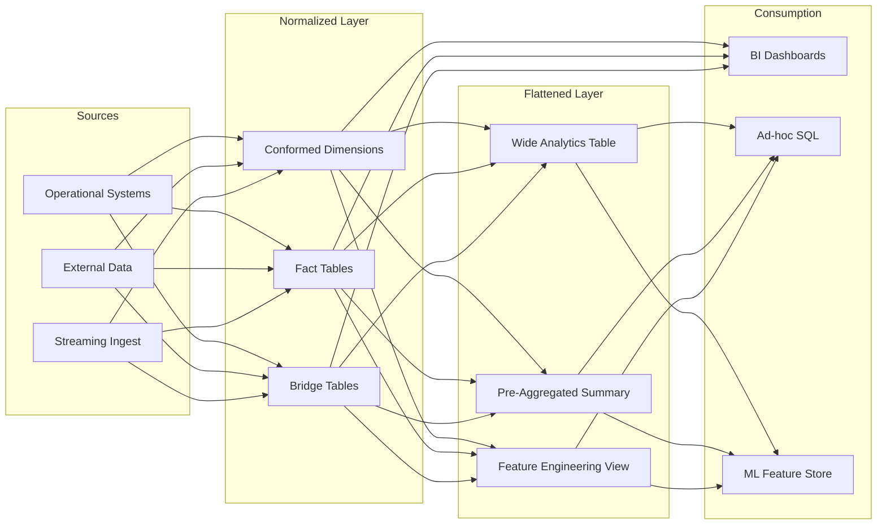

# 1. Data Modeling Strategy: Normalized Models vs Flattened Datasets in Snowflake
Decision framework for selecting between structured dimensional models and denormalized wide tables based on query patterns, maintenance requirements, and Snowflake architectural constraints.

# 2. Overview
This feature documents the architectural decision point between maintaining a structured data model (star schema, normalized entities, conformed dimensions) versus materializing flattened datasets (wide tables, denormalized structures) in Snowflake. The choice exists because Snowflake's columnar storage, micro-partition pruning, and separation of compute/storage create different performance and cost tradeoffs than traditional RDBMS systems. Structured models support governed, reusable analytics with clear lineage. Flattened datasets optimize for specific query patterns, reduce join complexity, and accelerate ad-hoc exploration. The intended consumers are data architects designing warehouse layers, analytics engineers building transformation pipelines, and SnowPro Advanced candidates tested on modeling tradeoffs within Snowflake's execution engine.

# 3. SQL Object Summary

| Object/Feature | Type | Purpose | Source Objects/Inputs | Output/Behavior | Invocation |
|----------------|------|---------|----------------------|-----------------|------------|
| Normalized Data Model | Architectural Pattern | Enforce data integrity, support multiple consumers, enable governed reuse | Multiple source tables, conformed dimensions | Set of related tables/views with defined relationships | `CREATE TABLE`, `CREATE VIEW`, `CREATE MATERIALIZED VIEW` |
| Flattened Dataset | Architectural Pattern | Optimize for specific query patterns, reduce runtime join overhead | Joined/unioned source tables, pre-aggregated metrics | Single wide table or view with denormalized attributes | `CREATE TABLE AS SELECT`, `CREATE DYNAMIC TABLE`, `CREATE VIEW` |
| Hybrid Approach | Architectural Pattern | Balance governance with performance via layered architecture | Normalized core + flattened consumption layers | Curated views or materialized aggregates over normalized base | Combination of above |

# 4. Architecture
Snowflake's columnar storage and micro-partition architecture influence modeling decisions. Normalized models store entities separately, requiring joins at query time. Flattened datasets pre-join data, increasing storage but reducing compute per query. The choice affects pruning efficiency, clustering strategy, and result caching behavior.

# 5. Data Flow / Process Flow

**Normalized Model Flow:**
1. **Ingestion**: Raw data lands in staging tables with minimal transformation.
2. **Conformance**: Dimensions are deduplicated, standardized, and assigned surrogate keys.
3. **Fact Construction**: Transactional data is linked to dimension keys via foreign relationships.
4. **Query Execution**: Consumer queries join fact and dimension tables at runtime.
5. **Result Assembly**: Snowflake's optimizer pushes filters, prunes micro-partitions, and executes joins.

**Flattened Dataset Flow:**
1. **Ingestion**: Same raw sources as normalized approach.
2. **Pre-Join Transformation**: ETL/ELT job executes denormalizing joins and computes derived fields.
3. **Materialization**: Result is written to a single wide table or dynamic table.
4. **Query Execution**: Consumer queries scan single object; no runtime joins required.
5. **Result Assembly**: Direct projection from flattened structure; pruning applies to denormalized columns.

**Key Difference**: Normalized models defer join cost to query time; flattened datasets pay join cost at materialization time. Row count may increase in flattened datasets due to denormalization (one-to-many expansion).

# 6. Logical Breakdown

| Component | Responsibility | Inputs | Outputs | Dependencies | Failure Modes |
|-----------|----------------|--------|---------|--------------|---------------|
| Dimension Conformance Logic | Standardize attribute values, assign surrogate keys | Raw dimension sources | Cleaned dimension table with SK | Business key definition, deduplication rules | Duplicate business keys, late-arriving dimensions |
| Fact Table Construction | Link transactional data to dimension SKs | Raw facts, conformed dimensions | Fact table with foreign keys | Dimension conformance completion | Orphaned facts, referential integrity gaps |
| Denormalization Join Logic | Pre-execute joins across normalized entities | Fact table, dimension tables | Wide table with repeated attributes | Stable dimension data, join cardinality control | Join explosion, storage bloat, stale denormalized attributes |
| Pruning Optimization | Enable micro-partition elimination via clustering | Filter predicates, clustering keys | Reduced scan volume | Proper clustering key selection, predicate pushdown | Clustering on low-cardinality or high-update columns |
| Materialization Strategy | Determine refresh mechanism for flattened data | Source change detection, SLA requirements | Updated flattened table | Source data latency, compute budget | Stale data, over-refreshing cost, under-refreshing accuracy |

# 7. Data Model

**Normalized Model Entities:**
| Entity | Role | Key Fields | Grain | Relationships |
|--------|------|-----------|-------|--------------|
| `DIM_CUSTOMER` | Conformed dimension | `customer_sk`, `customer_bk`, `segment`, `region` | One row per unique customer | One-to-many to fact tables |
| `DIM_PRODUCT` | Conformed dimension | `product_sk`, `product_bk`, `category`, `brand` | One row per unique product | One-to-many to fact tables |
| `FACT_SALES` | Transactional fact | `sale_id`, `customer_sk`, `product_sk`, `amount`, `sale_date` | One row per transactional line item | Many-to-one to dimensions |

**Flattened Dataset Entity:**
| Entity | Role | Key Fields | Grain | Relationships |
|--------|------|-----------|-------|--------------|
| `WIDE_SALES_ANALYTICS` | Denormalized consumption table | `sale_id`, `customer_bk`, `segment`, `product_bk`, `category`, `amount`, `sale_date` | One row per transactional line item with repeated attributes | Self-contained; no foreign keys required |

**Grain Consistency**: Both approaches must preserve the same base grain (e.g., transactional line item) unless aggregation is explicitly part of the flattened design. Denormalization does not change grain; aggregation does.

# 8. Business Logic (Execution Logic)
- **Query Pattern Alignment**: Use normalized models when consumers require flexible, ad-hoc slicing across multiple dimensions. Use flattened datasets when query patterns are predictable and repeatedly access the same attribute combinations.
- **Data Freshness Requirements**: Normalized models support incremental dimension updates without rebuilding facts. Flattened datasets require full or partial rebuild when denormalized attributes change.
- **Governance vs Velocity**: Normalized models enforce conformed definitions and lineage. Flattened datasets enable rapid iteration but risk attribute drift across copies.
- **Snowflake-Specific Defaults**: Micro-partition pruning works best when filter columns are clustered. In normalized models, clustering must be chosen per table. In flattened models, a single clustering key can serve multiple filter patterns but may increase storage.
- **Exam-Relevant Trap**: Flattening does not eliminate join cost; it shifts it to ETL. SnowPro questions may present a scenario where pre-joining seems optimal but ignores dimension update frequency or storage cost constraints.

# 9. Transformations

| Source Input | Target Output | Rule/Logic | Execution Meaning | Impact |
|--------------|---------------|------------|-------------------|--------|
| Normalized: `FACT_SALES` + `DIM_CUSTOMER` | Flattened: `customer_name`, `segment` repeated per fact row | Denormalizing join on `customer_sk` | Eliminates runtime join for customer attributes | Storage increases by ~`DIM_CUSTOMER` size × fact row count; query CPU decreases |
| Normalized: Multiple date dimensions | Flattened: Pre-computed `fiscal_year`, `quarter_label` | Date logic applied during materialization | Shifts calculation from query time to ETL time | Consistent time logic across consumers; requires rebuild if fiscal calendar changes |
| Aggregated Flattened: `FACT_SALES` grouped by `category`, `month` | Summary table with `total_revenue`, `avg_order_value` | `GROUP BY` with aggregations | Changes grain from transactional to periodic summary | Enables fast dashboard queries; loses transactional detail for drill-down |

# 10. Parameters / Variables / Configuration

| Name | Type | Purpose | Allowed Values/Format | Default | Where Used | Effect |
|------|------|---------|----------------------|---------|------------|--------|
| `CLUSTER BY` | Table Option | Define micro-partition sorting for pruning | Column list, expression | None (automatic clustering) | `CREATE TABLE`, `ALTER TABLE` | Affects scan volume; critical for both normalized and flattened designs |
| `TARGET_LAG` | Dynamic Table Option | Control freshness vs compute tradeoff for materialized flattening | Interval string (`'1 hour'`, `'5 minutes'`) | N/A | `CREATE DYNAMIC TABLE` | Determines how quickly flattened data reflects source changes |
| `AUTO_REFRESH` | Pipe/Dynamic Table Option | Enable automatic incremental updates | `TRUE`/`FALSE` | `FALSE` | Streaming ingest, dynamic tables | Affects latency and compute cost for flattened dataset maintenance |
| `MAX_CONCURRENCY_LEVEL` | Warehouse Parameter | Control parallelism for large denormalization jobs | Integer 1-8 | 8 | Warehouse configuration | Impacts ETL runtime for flattening transformations |

# 11. APIs / Interfaces
- **Normalized Model Access**: Accessed via standard `SELECT` with explicit `JOIN` syntax. BI tools generate joins dynamically.
- **Flattened Dataset Access**: Accessed via simple `SELECT` from single object. Reduces SQL complexity for non-technical consumers.
- **Dynamic Tables**: Snowflake-native managed materialization for flattened datasets. Invocation: `CREATE DYNAMIC TABLE ... TARGET_LAG = ... AS SELECT ...`.
- **Streamlit/Notebook Integration**: Flattened datasets reduce query composition overhead for exploratory analysis.

# 12. Execution / Deployment
- **Normalized Models**: Typically deployed as permanent tables with incremental merge patterns. Dimensions may use SCD Type 2 logic. Facts use append-only or upsert patterns.
- **Flattened Datasets**: Deployed as `TABLE`, `VIEW`, or `DYNAMIC TABLE`. `DYNAMIC TABLE` automates refresh based on `TARGET_LAG`. `VIEW` defers computation to query time (no storage cost, no pre-join benefit).
- **Orchestration**: Normalized layers often orchestrated via dbt, Airflow, or Snowflake Tasks. Flattened layers may be triggered downstream of normalized layer completion.
- **Environment Strategy**: Normalized models promote reuse across DEV/TEST/PROD. Flattened datasets may be environment-specific if query patterns differ.

# 13. Observability
- **Query Performance**: Use `QUERY_HISTORY` to compare scan bytes and execution time between normalized (join-heavy) and flattened (scan-heavy) approaches.
- **Storage Monitoring**: `TABLE_STORAGE_METRICS` in `ACCOUNT_USAGE` shows storage growth from denormalization. Track cost per query vs storage cost.
- **Freshness Validation**: For flattened datasets, compare `LAST_DDL_TIME` or use custom watermark tables to verify `TARGET_LAG` compliance.
- **Pruning Efficiency**: `EXPLAIN` output shows `Pruned: X/Y` micro-partitions. Low pruning rates on flattened tables indicate poor clustering key selection.

# 14. Failure Handling & Recovery

| Failure Scenario | Symptom | Detection | Fallback | Recovery |
|------------------|---------|-----------|----------|----------|
| Dimension Update Staleness | Flattened dataset shows outdated attributes | Attribute drift audit, consumer reports | Query normalized model directly | Rebuild flattened dataset or implement incremental attribute update logic |
| Join Explosion During Flattening | ETL job fails or times out | Row count spike in intermediate result | Add pre-aggregation or filter early | Review join cardinality, add qualifying predicates, or denormalize in stages |
| Clustering Inefficiency | High scan bytes despite filtering | `QUERY_HISTORY` shows low pruning ratio | Add/adjust `CLUSTER BY` | Recluster table or redesign clustering key based on actual filter patterns |
| Schema Drift in Source | Flattened dataset build fails on new column | DDL compilation error | Use `TRY_CAST` or flexible schema handling in ETL | Update flattening transformation to accommodate new source fields |
| Over-Flattening | Storage costs exceed compute savings | Cost monitoring alerts | Revert to normalized + materialized view hybrid | Analyze query patterns; flatten only high-value attribute combinations |

# 15. Security & Access Control
- **Normalized Models**: Enable fine-grained access via row-level security on dimension tables (e.g., region-based filters). Policies propagate through joins.
- **Flattened Datasets**: Row-level security must be applied to the wide table directly. Attribute-level masking may need reapplication after denormalization.
- **Dynamic Tables**: Inherit privileges from the target table. Ensure role-based access aligns with consumption patterns.
- **Exam Note**: Security policies evaluate after query compilation. Flattening does not bypass masking; masked columns remain masked in denormalized output.

# 16. Performance / Scalability Considerations
- **Join Cost vs Storage Cost**: Normalized models incur runtime join CPU and shuffle overhead. Flattened datasets increase storage and may reduce pruning efficiency if clustering keys are not aligned with filter patterns.
- **Pruning Behavior**: In normalized models, each table's clustering key affects its scan volume. In flattened models, a single clustering key must serve multiple filter dimensions; choose the most selective or frequently filtered column.
- **Result Caching**: Snowflake's result cache keys on exact query text. Flattened datasets enable simpler, more cacheable queries. Normalized models with complex joins may have lower cache hit rates.
- **Concurrent Query Scaling**: Flattened datasets reduce per-query compute, enabling higher concurrency on fixed warehouse size. Normalized models may require larger warehouses to handle join-heavy concurrent loads.
- **Incremental Maintenance**: Flattened datasets built via `MERGE` or `DYNAMIC TABLE` can incrementally process changes. Full rebuilds scale linearly with source data volume.

# 17. Assumptions & Constraints
- Flattened datasets assume query patterns are stable and known. Unpredictable ad-hoc analysis favors normalized models.
- Denormalization increases storage; Snowflake's compressed columnar storage mitigates but does not eliminate this cost.
- Dynamic Tables require Enterprise edition or higher. This is an exam-relevant licensing constraint.
- Clustering keys incur maintenance overhead. Automatic clustering (default) consumes credits; manual clustering requires explicit `RECLUSTER`.
- Flattening does not improve write performance; it optimizes read patterns. High-velocity ingestion may favor normalized append-only facts.
- SnowPro Advanced exam trap: Candidates may assume flattening always improves performance. The correct answer depends on query pattern frequency, dimension update velocity, and cost constraints.

# 18. Future Enhancements
- Implement hybrid materialization: Keep normalized core, create flattened `MATERIALIZED VIEW` or `DYNAMIC TABLE` for high-traffic query patterns only.
- Add automated clustering recommendation: Use `SYSTEM$CLUSTERING_INFORMATION` to identify optimal clustering keys for flattened tables based on actual filter predicates.
- Introduce incremental denormalization: Only recompute flattened attributes that changed in source dimensions, reducing rebuild scope.
- Embed query pattern telemetry: Track which attribute combinations are most frequently co-accessed to guide flattening decisions programmatically.
- Leverage Snowflake's search optimization service: For flattened tables with high-selectivity filters on non-clustered columns, enable search optimization to improve point-lookup performance without denormalizing further.
