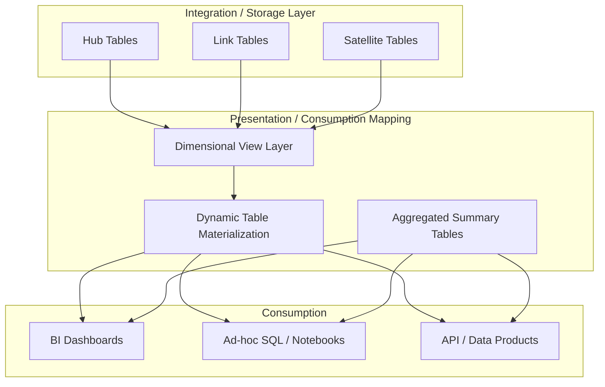

# 1. Consumption Layer Modeling: Dimensional vs Data Vault Techniques in Snowflake
Architectural decision framework and implementation mechanics for structuring presentation-layer datasets using dimensional modeling and Data Vault methodologies within Snowflake.

# 2. Overview
The consumption layer translates raw or integrated data into query-optimized structures for BI, analytics, and data science. Dimensional modeling (star/snowflake schemas) is purpose-built for consumption, prioritizing join simplicity, predictable aggregation, and BI tool compatibility. Data Vault (Hubs, Links, Satellites) is an enterprise integration and historical tracking model that is not natively optimized for direct consumption; it requires a presentation mapping layer to serve end-user queries efficiently. In Snowflake, the choice dictates clustering strategy, materialization approach, and pruning behavior. The feature targets data architects designing warehouse layers, analytics engineers building consumption views, and SnowPro Advanced candidates evaluated on model-to-execution tradeoffs.

# 3. SQL Object Summary

| Object/Feature | Type | Purpose | Source Objects/Inputs | Output/Behavior | Invocation |
|----------------|------|---------|----------------------|-----------------|------------|
| Dimensional Consumption Model | Architectural Pattern | Optimize for BI reporting, enable ad-hoc slicing, standardize aggregation | Conformed dimensions, fact tables, incremental staging | Star schema with explicit relationships | `CREATE TABLE`, `CREATE VIEW`, `CREATE DYNAMIC TABLE` |
| Data Vault Presentation Mapping | Architectural Pattern | Translate vault storage into consumption-ready structure | Hubs, Links, Satellites, temporal validity tables | Denormalized or star-aligned dataset | `CREATE DYNAMIC TABLE`, `CREATE SECURE VIEW`, `MERGE` |
| Hybrid Consumption Layer | Architectural Pattern | Balance historical auditability with query performance | Vault core + dimensional presentation views | Curated consumption endpoints with lineage preservation | Combination of above |

# 4. Architecture
Snowflake's columnar storage and micro-partition architecture alter traditional RDBMS modeling tradeoffs. Dimensional models align naturally with pruning and result caching. Data Vault models require explicit join resolution at the presentation layer to avoid runtime scan penalties. The architecture separates integration storage (Vault) from consumption optimization (Dimensional/Presentation).

# 5. Data Flow / Process Flow

**Dimensional Consumption Flow:**
1. **Input Evaluation**: Query reads fact table and dimension tables via `JOIN`.
2. **Filter Application**: Predicates on date, category, or region columns push down to relevant micro-partitions.
3. **Join Resolution**: Snowflake optimizer selects broadcast or shuffle join based on table sizes and clustering.
4. **Aggregation**: Metrics computed per dimensional grain.
5. **Output Projection**: Result cached if query signature and session parameters match prior execution.

**Data Vault to Consumption Flow:**
1. **Input Evaluation**: Presentation query reads Hub (business keys), Links (relationships), and Satellites (attributes/history).
2. **Temporal Resolution**: `LOAD_DATE` and `END_DATE` logic applied to isolate valid-time records.
3. **Join Expansion**: Multi-table joins reconstruct entity state; cardinality increases if history is not filtered correctly.
4. **Materialization Mapping**: `DYNAMIC TABLE` or view flattens vault structure into consumption-aligned grain.
5. **Output Projection**: Flattened dataset served to BI; joins deferred to refresh cycle instead of query runtime.

Row count remains stable for dimensional models. Vault-to-consumption mapping may temporarily expand cardinality during history resolution before `QUALIFY` or temporal filters collapse to active state.

# 6. Logical Breakdown

| Component | Responsibility | Inputs | Outputs | Dependencies | Failure Modes |
|-----------|----------------|--------|---------|--------------|---------------|
| Surrogate Key Generator | Assign deterministic integer keys to dimension members | Business keys, SCD logic | Integer SK column | Consistent hashing or sequence | Key collision, late-arriving dimension gaps |
| Hash Key Builder (Vault) | Generate cryptographic business key hashes | Source business keys | `VARCHAR(32)/VARCHAR(64)` hash column | `SHA2_256` or `MD5` function | Hash collision (statistically negligible), null key hashing |
| Temporal Validity Resolver | Isolate point-in-time or current records from history | `LOAD_DATE`, `END_DATE`, `LOAD_CYCLE_ID` | Filtered active history | Consistent timestamp insertion | Overlapping validity windows, missing end dates |
| Join Expansion Controller | Prevent cardinality explosion during vault reconstruction | Hub-Link-Sat relationships | Joined entity state | Proper foreign key alignment, temporal filters | Fan-out join errors, duplicate fact rows |
| Presentation Materializer | Flatten vault or dimensional structure for consumption | Normalized or vault tables | Wide table or star-aligned dataset | `TARGET_LAG`, refresh schedule | Stale presentation data, compute over-consumption |

# 7. Data Model

**Dimensional Consumption Entities:**
| Entity | Role | Key Fields | Grain | Relationships | Null Handling |
|--------|------|-----------|-------|--------------|---------------|
| `DIM_ENTITY` | Descriptive lookup | `entity_sk`, `business_key`, `attribute_1`, `start_date`, `end_date` | One row per active entity version | One-to-many to facts | Business keys non-null; nullable attributes allowed |
| `FACT_EVENT` | Transactional measurement | `event_id`, `entity_sk`, `date_sk`, `metric_1` | One row per measurable event | Many-to-one to dimensions | Metrics default to 0; keys enforced via ETL |

**Data Vault Storage + Presentation Mapping:**
| Entity | Role | Key Fields | Grain | Relationships | Null Handling |
|--------|------|-----------|-------|--------------|---------------|
| `HUB_ENTITY` | Business key registry | `entity_hash`, `load_date`, `record_source` | One row per unique business key | One-to-many to Links/Sats | Hash non-null; business key never null |
| `LINK_ENTITY_EVENT` | Relationship tracker | `link_hash`, `entity_hash`, `event_hash`, `load_date` | One row per unique relationship instance | Connects Hubs | Hashes non-null |
| `SAT_ENTITY_ATTR` | Attribute history | `entity_hash`, `load_date`, `attr_1`, `attr_2` | One row per attribute change | Many-to-one to Hub | Nullable attributes; `END_DATE` null for active |

**Grain Consistency**: Consumption layer must resolve to a single analytical grain (e.g., transaction line, daily aggregate). Vault history expansion must be collapsed via temporal filters before consumption projection.

# 8. Business Logic (Execution Logic)
- **Model Selection Rule**: Use dimensional modeling when consumption requires predictable joins, BI tool compatibility, and straightforward aggregation. Use Data Vault when auditability, historical tracking, and agile source onboarding are primary requirements, then map to dimensional presentation for consumption.
- **Temporal Resolution Logic**: Vault satellites store full history. Consumption queries must apply `WHERE END_DATE IS NULL OR END_DATE > CURRENT_DATE()` to isolate current state, or use window functions for point-in-time analysis.
- **Late-Arriving Data Handling**: Dimensional models use SCD Type 0/2 logic or placeholder records. Data Vault natively accommodates late-arriving data by appending new hash-keyed rows without schema alteration.
- **Exam-Relevant Defaults**: Snowflake does not enforce foreign keys. Join correctness depends on ETL logic. Data Vault is an integration model, not a consumption model. Direct BI consumption of raw vault tables results in poor pruning, high join overhead, and failed certification scenarios.
- **Caching Eligibility**: Dimensional queries with stable predicates and explicit joins cache effectively. Vault reconstruction queries vary widely based on temporal windows, reducing cache hit rates unless materialized.

# 9. Transformations

| Source Input | Target Output | Rule/Logic | Execution Meaning | Impact |
|--------------|---------------|------------|-------------------|--------|
| Vault Satellites + Hub | Dimensional Attribute Column | Temporal filter + `JOIN` + `COALESCE` | Reconstructs current entity state | Enables BI consumption; increases compute if unmaterialized |
| Multiple Vault Links | Conformed Fact Table | `INNER JOIN` on hash keys + metric aggregation | Aligns vault relationships to star schema | Changes grain from relationship-centric to transaction-centric |
| Historical SCD Dimension | Current State Dimension | `WHERE end_date IS NULL` filter | Collapses multiple versions to active record | Reduces row count for consumption; breaks historical analysis if used incorrectly |
| Vault Load Cycle | Refresh Watermark | `MAX(load_date)` aggregation | Determines incremental refresh boundary | Enables efficient `DYNAMIC TABLE` updates; prevents full rebuilds |

# 10. Parameters / Variables / Configuration

| Name | Type | Purpose | Allowed Values/Format | Default | Where Used | Effect |
|------|------|---------|----------------------|---------|------------|--------|
| `CLUSTER BY` | Table Option | Align micro-partition sorting with consumption filters | Column list, expression | None | Fact tables, vault satellites | Critical for pruning temporal or dimensional predicates |
| `TARGET_LAG` | Dynamic Table Option | Control presentation freshness vs compute cost | Interval (`'5 minutes'`, `'1 day'`) | N/A | Consumption materialization | Determines vault-to-star sync latency |
| `HASH_AGG` | System Function | Validate hash consistency during ETL | Expression list | N/A | Vault pipeline validation | Detects hash generation drift across environments |
| `ENABLE_QUERY_RESULT_CACHE` | Account Parameter | Allow Snowflake to reuse identical query results | TRUE/FALSE | TRUE | All consumption queries | Affects vault reconstruction query performance; disabled by explicit parameter changes |

# 11. APIs / Interfaces
- **Consumption Access**: `SELECT` against `SECURE VIEW` or `DYNAMIC TABLE`. BI tools connect via JDBC/ODBC, Snowflake Native Connector, or Partner tools.
- **Orchestration Interface**: Snowflake Tasks or external schedulers trigger presentation layer refresh after vault load completion.
- **Lineage Exposure**: `ACCESS_HISTORY` and `OBJECT_DEPENDENCIES` system views map consumption views to underlying vault or dimensional tables.
- **Error Behavior**: Missing temporal filters cause join expansion. Invalid hash inputs generate deterministic errors or null propagation.

# 12. Execution / Deployment
- **Dimensional Deployment**: Typically deployed as permanent tables with incremental `MERGE` for SCD Type 2. Views provide business abstraction without storage overhead.
- **Vault-to-Consumption Deployment**: Implemented via `DYNAMIC TABLE` for automated refresh, or `VIEW` for real-time but compute-intensive reconstruction. `CREATE TABLE AS SELECT` used for static reporting snapshots.
- **Orchestration**: Vault loads execute first. Presentation layer refresh triggers on dependency completion. Environment parity maintained via infrastructure-as-code templates.
- **Runtime Assumptions**: Presentation layer assumes vault load consistency. Concurrent vault updates during presentation refresh may cause watermark drift unless serialized.

# 13. Observability
- **Refresh Tracking**: `DYNAMIC_TABLE_REFRESH_HISTORY` shows lag, duration, and success/failure status for presentation materialization.
- **Query Performance**: `QUERY_HISTORY` reveals join execution time, bytes scanned, and cache usage. High scan volume indicates poor clustering or missing temporal filters on vault tables.
- **Data Validation**: Hash collision checks via `COUNT(DISTINCT business_key) = COUNT(entity_hash)`. Temporal overlap detection: `WHERE start_date < LAG(end_date) OVER (PARTITION BY hash_key ORDER BY load_date)`.
- **Cost Monitoring**: `TABLE_STORAGE_METRICS` tracks vault storage growth vs consumption materialization size. Unmaterialized vault views shift cost to compute.

# 14. Failure Handling & Recovery

| Failure Scenario | Symptom | Detection | Fallback | Recovery |
|------------------|---------|-----------|----------|----------|
| Missing Temporal Filter | Cardinality explosion, query timeout | Row count spike, `QUERY_HISTORY` high spill | Kill query, apply `END_DATE IS NULL` filter | Enforce filter in presentation view definition |
| Late-Arriving Dimension Breaks Join | Fact rows fail to join, metric gaps | Left join null count spike | Insert placeholder dimension record | Implement SCD Type 0 fallback or reprocess affected facts |
| Hash Key Collision | Incorrect entity linking | `COUNT(business_key) != COUNT(hash)` validation alert | Audit source data, regenerate with `SHA2_256` | Migrate to longer hash algorithm; rekey affected entities |
| Presentation Refresh Lag | BI shows stale vault data | `DYNAMIC_TABLE_REFRESH_HISTORY` lag exceeds SLA | Direct query to vault with explicit filters | Scale up warehouse for refresh, optimize incremental logic |
| Schema Drift in Satellite | ETL fails on new attribute | DDL compilation error | Use `TRY_CAST` or flexible JSON column | Update vault ingestion pipeline, rebuild presentation view |

# 15. Security & Access Control
- **Access Granularity**: Grant `SELECT` on consumption views/dynamic tables only. Restrict direct vault table access to engineering roles.
- **Row-Level Security**: Apply to consumption layer. Vault-level RLS is ineffective due to hash key abstraction and multi-table joins.
- **Dynamic Data Masking**: Mask sensitive attributes at the presentation view level. Masking policies evaluate post-join, preventing exposure during vault reconstruction.
- **Secure Views**: Use `CREATE SECURE VIEW` for dimensional abstraction over vault to prevent query rewrite visibility and enforce policy evaluation boundaries.

# 16. Performance / Scalability Considerations
- **Join Optimization**: Snowflake's optimizer handles star schema joins efficiently via automatic broadcast for small dimensions. Vault reconstruction requires 3+ table joins; materialization or dynamic tables are required for scale.
- **Pruning Efficiency**: Clustering fact tables on date or hash keys enables micro-partition elimination. Vault satellites must be clustered on `HASH_KEY` and `LOAD_DATE` to avoid full scans during temporal resolution.
- **Compute vs Storage Tradeoff**: Unmaterialized vault views minimize storage but maximize per-query compute. Materialized consumption tables increase storage but reduce warehouse scaling requirements.
- **Caching Behavior**: Identical dimensional queries reuse result cache. Vault temporal queries vary by `CURRENT_DATE()` or user context, invalidating cache unless anchored to fixed date parameters.
- **Exam Trap**: Candidates may assume Data Vault performs well in direct consumption. Snowflake's architecture favors dimensional or pre-materialized consumption patterns. Raw vault consumption fails pruning and scales compute linearly.

# 17. Assumptions & Constraints
- Data Vault requires a presentation mapping layer for efficient consumption. Direct BI querying of raw vault tables is architecturally misaligned with Snowflake's execution model.
- Snowflake does not enforce referential integrity. Join correctness and cardinality control depend entirely on ETL logic and temporal filtering.
- Hash key generation assumes `SHA2_256` or `MD5` provides sufficient uniqueness. Collisions are statistically improbable but require validation in audit-critical pipelines.
- `DYNAMIC TABLE` refreshes are incremental only when source changes are detected via internal watermarking. Full rebuilds trigger on DDL changes or `TARGET_LAG` expiration without incremental tracking.
- Consumption layer grain must be explicitly defined. Ambiguous grain in vault-to-star mapping causes aggregation errors and metric inflation.

# 18. Future Enhancements
- Implement automated vault-to-star mapping via dbt macros or Snowflake-specific transformation templates to reduce manual join construction.
- Introduce search optimization on vault hash keys to improve point-lookup performance in presentation views without full materialization.
- Add incremental hash validation checks to ETL pipelines to detect and quarantine collision risks before presentation layer deployment.
- Develop dynamic clustering recommendations based on consumption query patterns in `QUERY_HISTORY` to auto-adjust `CLUSTER BY` on satellites and facts.
- Embed temporal validity enforcement in view definitions using `QUALIFY` and window functions to prevent accidental history expansion at query time.
