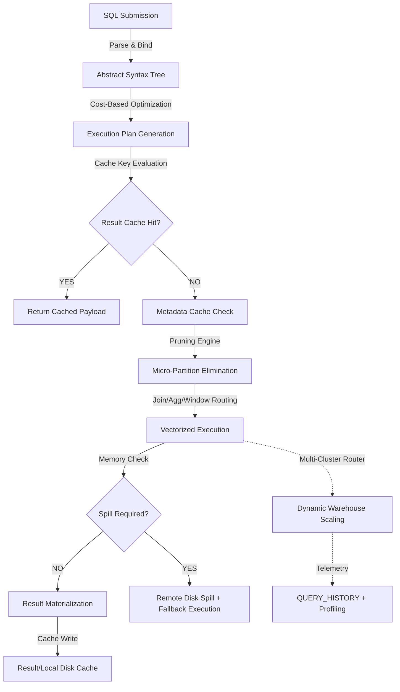

# Query Performance

# 1. Title
SnowPro Advanced: Query Performance Tuning & Execution Optimization Architecture

# 2. Overview
- **What it does**: Defines the deterministic mechanisms for query compilation, optimization, cache utilization, micro-partition pruning, join resolution, and execution resource allocation.
- **Why it exists**: Query performance in Snowflake is not improved through guesswork or generic tuning. It is governed by strict engine rules: metadata-driven pruning, exact-match caching, cost-based join ordering, and warehouse scaling boundaries. Misaligned filters, unbounded windows, or anti-patterns bypass optimization layers, triggering full scans, remote spill, and unbounded credit consumption.
- **Where it fits**: Operates across the entire query lifecycle, from SQL submission through parsing, optimization, execution, and result materialization. Interfaces with transformation pipelines, BI consumption layers, and FinOps cost tracking.
- **Intended consumer**: Data engineers, analytics engineers, platform architects, query tuning specialists, FinOps analysts, and SnowPro Advanced candidates evaluating execution profiling, cache semantics, pruning mechanics, and optimization tradeoffs.

# 3. SQL Object Summary
| Field | Value |
|-------|-------|
| Object Scope | Query Execution Optimization & Performance Tuning Framework |
| Type | Execution Engine Primitives + Caching Layers + Multi-Cluster Routing |
| Purpose | Minimize scanned partitions, maximize cache utilization, enforce deterministic join strategies, and allocate compute efficiently |
| Source Objects | Micro-partition metadata, result cache, local disk cache, warehouse compute nodes, query history telemetry |
| Output Object | Optimized execution plans, cached result payloads, pruning metrics, spill logs, performance profiles |
| Execution Mode | Compiled, Cost-Optimized, Vectorized Batch Execution with Multi-Layer Caching & Dynamic Scaling |

# 4. Architecture
Query performance is governed by a layered execution pipeline. SQL is parsed, bound to metadata, optimized via cost-based heuristics, and routed to compute nodes. Caching operates at three tiers: result, local disk, and metadata. Pruning and join strategies dictate partition scan volume and memory allocation. Multi-cluster warehouses route queries dynamically to prevent queue buildup.

# 5. Data Flow / Process Flow
| Step | Input | Transformation | Output | Purpose |
|------|-------|----------------|--------|---------|
| 1. Parse & Bind | Raw SQL, session context | Syntax validation, identifier resolution, privilege check | Validated AST, bound schema references | Establish execution scope before optimization |
| 2. Optimization | AST, column statistics, partition metadata | Predicate pushdown, join reordering, CTE materialization decision | Execution plan with cost estimates | Select optimal join strategy, minimize scan volume |
| 3. Cache Evaluation | Query hash, session params, timezone, warehouse config | Exact-match comparison against result cache keys | Cache hit (skip execution) or cache miss (proceed) | Eliminate redundant compute for identical queries |
| 4. Pruning & Scan Planning | Optimized plan, clustering/search keys, min/max metadata | Micro-partition elimination based on filter predicates | Reduced partition set, scan range definition | Bypass irrelevant storage reads, reduce I/O |
| 5. Execution & Materialization | Pruned partitions, join/hash structures, memory allocation | Vectorized processing, aggregation, window evaluation, spill fallback | Result set, cache payload, telemetry logs | Compute transformation, return deterministic output, record performance metrics |

# 6. Logical Breakdown of the SQL
| Component | Responsibility | Inputs | Outputs | Dependencies | Failure Modes / Risks |
|-----------|----------------|--------|---------|--------------|-----------------------|
| Cost-Based Optimizer (CBO) | Plan generation & strategy selection | AST, table statistics, row estimates, join predicates | Execution plan, join order, operator sequence | Accurate statistics, consistent data types, stable schema | Stale stats cause suboptimal plans; implicit casts disable join reordering |
| Pruning Engine | Partition elimination | Filter predicates, clustering keys, search optimization, metadata bounds | Pruned micro-partition list | Native type filters, aligned clustering, exact/range predicates | Non-sargable filters, timezone shifts, or function-wrapped columns bypass pruning |
| Join Resolver | Algorithm selection & memory allocation | Join keys, row counts, sort state, warehouse memory limits | Hash table build, merge streams, nested loop execution | Accurate cardinality estimates, sufficient memory, deterministic keys | Skewed keys cause hash spill; missing sort keys force nested loops; cartesian joins timeout |
| Cache Manager | Result/local disk caching | Query text, session params, timezone, warehouse config, plan hash | Cache hit/miss flag, cached payload storage/retrieval | Exact match across all dimensions, no volatile functions, `USE_CACHED_RESULT=TRUE` | Dynamic filters, `CURRENT_TIMESTAMP`, or session variance bypass result cache |
| Multi-Cluster Router | Dynamic compute allocation | Query queue depth, warehouse size, `SCALING_POLICY` | Query routed to active/standby cluster | Cluster availability, scaling policy (`ECONOMY` vs `PERFORMANCE`) | `ECONOMY` policy introduces queue delay; `PERFORMANCE` scales instantly at credit cost |
| Spill Handler | Memory overflow management | Intermediate row sets, hash/window memory limits | Remote disk spill files, degraded execution path | Warehouse storage quota, I/O bandwidth | Excessive spill multiplies runtime, inflates credits, triggers timeouts |

# 7. Data Model
| Entity | Role | Important Fields | Grain | Relationships | Keys | Null Handling |
|--------|------|------------------|-------|---------------|------|---------------|
| `QUERY_EXECUTION_PROFILE` | Performance telemetry | `QUERY_ID`, `WAREHOUSE_NAME`, `EXECUTION_STATUS`, `TOTAL_ELAPSED_TIME`, `PARTITIONS_SCANNED/TOTAL`, `SPILLED_BYTES`, `RESULT_SOURCE` | 1 row = 1 query execution instance | Maps to `ACCOUNT_USAGE.QUERY_HISTORY`, `WAREHOUSE_METERING_HISTORY` | `QUERY_ID` | `NULL` on canceled queries; partial metrics flushed on timeout |
| `CACHE_STATE_REGISTRY` | Cache utilization tracking | `QUERY_HASH`, `CACHE_TYPE`, `HIT_FLAG`, `EXPIRY_TS`, `SESSION_PARAMS_HASH` | 1 row = 1 cache evaluation event | Links to `QUERY_HISTORY`, `RESULT_CACHE` metadata | `QUERY_HASH` + `CACHE_TYPE` | `NULL` if cache disabled or bypassed by session state |
| `WAREHOUSE_QUEUE_METRICS` | Compute allocation monitoring | `WAREHOUSE_NAME`, `QUEUE_LENGTH`, `AVG_QUEUE_TIME`, `CLUSTER_COUNT`, `SCALING_POLICY` | 1 row = 1 warehouse state snapshot per interval | References `WAREHOUSE_METERING_HISTORY`, `QUERY_HISTORY` | `WAREHOUSE_NAME` + `SNAPSHOT_TS` | `NULL` if warehouse suspended or idle |

**Output Grain**: 1 query execution = 1 deterministic result set + 1 telemetry record. Row count scales with join cardinality and filter selectivity. Cache returns identical byte-for-byte payload when hit. Telemetry grain is fixed at execution completion.

# 8. Business Logic
| Rule | Effect | Implementation Pattern | Edge Case |
|------|--------|------------------------|-----------|
| **Predicate Pushdown** | Filters applied before join/scan | `WHERE` on base columns, native types, range operators | `WHERE UPPER(col) = 'X'` or `WHERE CAST(col) = 1` disables pushdown, forces full scan |
| **Join Algorithm Selection** | Determines execution strategy | Hash join (default, unsorted), Merge join (sorted inputs), Nested loop (small datasets) | Skewed join keys cause hash build memory spill; missing sort keys prevent merge join |
| **Cache Invalidation** | Controls result reuse | Exact SQL text match + identical session params, timezone, warehouse config | `USE_CACHED_RESULT=FALSE`, `CURRENT_TIMESTAMP`, or dynamic table UDFs bypass cache |
| **Window Evaluation Order** | Defines computation sequence | `WHERE` -> `GROUP BY` -> `HAVING` -> Window (`QUALIFY` filters post-window) | `QUALIFY` applied after window calculation; cannot push into storage scan |
| **Multi-Cluster Scaling** | Prevents queue buildup | `AUTO_SUSPEND`, `SCALING_POLICY`, `MIN/MAX_CLUSTER_COUNT` | `ECONOMY` queues queries; `PERFORMANCE` scales immediately, increasing credit burn |
| **Query Acceleration Service (QAS)** | Offloads eligible scan-heavy queries | `ENABLE_QUERY_ACCELERATION = TRUE`, large base tables, selective filters | QAS only supports `SELECT`; bypasses result cache, incurs separate credit billing |

# 9. Transformations
| Source | Derived | Formula / Rule | Business Meaning | Impact |
|--------|---------|----------------|------------------|--------|
| Raw filter predicate | Pruned micro-partitions | Min/max metadata comparison + clustering key alignment | Eliminates irrelevant storage reads | Reduces scanned bytes from TB to GB; non-aligned filters trigger full scan |
| Join key mapping | Hash table / sorted streams | Key hashing, bucket distribution, sort merge alignment | Matches rows across datasets without nested iteration | Hash joins scale linearly; skew triggers spill and latency spikes |
| Window frame definition | Ranked/aggregated rows | `ROWS BETWEEN UNBOUNDED PRECEDING AND CURRENT ROW`, partition sort | Computes running totals, ranks, or peer-group aggregates | Large partitions increase sort memory; unbounded frames prevent streaming |
| Aggregation projection | Grouped metrics | `GROUP BY` + `SUM/AVG/COUNT`, `DISTINCT` elimination | Collapses detail rows to business summary | Late `GROUP BY` inflates intermediate row count; early filtering reduces compute |
| Cache payload | Stored result set | Byte-for-byte serialization + metadata hash | Skips execution on identical subsequent query | Cache hit returns <100ms; bypass forces full re-execution cost |

# 10. Parameters / Variables / Macros
| Name | Type | Purpose | Allowed Format | Default | Usage | Effect on Output |
|------|------|---------|----------------|---------|-------|------------------|
| `USE_CACHED_RESULT` | Boolean | Enable/disable result cache | `TRUE` / `FALSE` | `TRUE` | Session/Query | `FALSE` forces execution; disables cache write for session |
| `QUERY_TAG` | String | Execution tracking & profiling | Text label | `NULL` | Session/Query | Groups related queries in `QUERY_HISTORY`; enables cost attribution |
| `ENABLE_QUERY_ACCELERATION` | Boolean | Allow Snowflake auto-allocating compute for eligible queries | `TRUE` / `FALSE` | `FALSE` | Warehouse/Session | Enables QAS; reduces runtime for cache-miss scans, incurs separate credits |
| `WAREHOUSE_SIZE` | Enum | Compute allocation for execution | XSMALL → 6XLARGE | Defined at creation | Warehouse config | Directly impacts parallelism, memory limits, spill threshold, credit consumption |
| `SCALING_POLICY` | Enum | Multi-cluster queue behavior | `STANDARD`, `ECONOMY`, `PERFORMANCE` | `STANDARD` | Warehouse definition | `ECONOMY` queues during scale-up; `PERFORMANCE` scales instantly |
| `OPTIMIZER_USE_EXPRESSION_NAMES` | Boolean | CBO reference behavior | `TRUE` / `FALSE` | `FALSE` | Session | `TRUE` forces optimizer to use column aliases in plan; may alter join ordering |

# 11. APIs / Interfaces
| Interface | Invocation Method | Input Structure | Output Structure | Error Behavior | Consumers |
|-----------|-------------------|-----------------|------------------|----------------|-----------|
| `EXPLAIN` | SQL | Query text | Execution plan tree, cost estimates, partition scan info | Returns plan only; does not execute | Query tuning, plan validation, CI/CD gating |
| `QUERY_HISTORY` / `ACCOUNT_USAGE` | SQL | Date range, warehouse, query ID filters | Execution metrics, status, cache source, spill bytes | 14-day retention in `ACCOUNT_USAGE`; requires `MONITOR` | Performance auditing, cost tracking, alerting |
| Snowsight Query Profile UI | Web | `QUERY_ID` | Visual DAG, operator timings, spill/pruning metrics, join strategy | Requires `MONITOR`/`USAGE`; loads only completed queries | Engineering debugging, join/spill diagnosis |
| `SYSTEM$EXPLAIN_PLAN_JSON` | SQL | Query text | Machine-readable plan structure | Fails on syntax error; returns JSON blob | Automated plan analysis, optimizer regression testing |
| JDBC/ODBC `ResultSet` | Driver API | Query execution | Paginated result set, fetch size control | Network timeout on large fetches; cursor state loss | BI tools, Python/R clients, data apps |

# 12. Execution / Deployment
- **Manual vs Scheduled**: Interactive queries run ad-hoc via client tools. Batch queries execute via `TASK`, dbt, or orchestration layers with explicit warehouse assignment and query tagging.
- **Batch vs Interactive**: Batch favors larger warehouses, result caching disabled for volatile schedules. Interactive leverages result cache, smaller warehouses, and query acceleration for latency-sensitive workloads.
- **Orchestration**: CI/CD pipelines run `EXPLAIN` against staging, block deployments on full-scan regressions, enforce `QUERY_TAG` for cost attribution. Airflow/Dagster manage warehouse scaling and query retries.
- **Upstream Dependencies**: Warehouse availability, metadata freshness, clustering/search optimization state, session parameter consistency, privilege grants.
- **Environment Behavior**: Dev/test use default caches, smaller data volumes, and relaxed pruning validation. Prod enforces strict clustering, search optimization on hot predicates, cache validation, and query tag enforcement.
- **Runtime Assumptions**: Result cache is deterministic only for identical SQL + session state + timezone + warehouse config. Metadata cache persists ~24h per warehouse or until DDL change. Vectorized execution processes rows in batches. Spill occurs when hash/window memory exceeds warehouse limit.

# 13. Observability
| Metric | Implementation | Detection Method | Operational Threshold |
|--------|----------------|------------------|------------------------|
| Pruning efficiency | `PARTITIONS_SCANNED / NULLIF(PARTITIONS_TOTAL, 0)` | `QUERY_HISTORY` or Profile UI | >0.3 scanned = clustering/search optimization ineffective or non-sargable filter |
| Cache utilization | `RESULT_SOURCE IN ('LOCAL_DISK', 'REMOTE_DISK', 'CLIENT')` | `QUERY_HISTORY.RESULT_SOURCE` | <30% cache hits on repeated queries = dynamic filters, parameter variance, or `USE_CACHED_RESULT=FALSE` |
| Spill volume | `BYTES_SPILLED_TO_REMOTE_STORAGE` | Profile UI / `QUERY_HISTORY` | >5GB per query = undersized warehouse, skewed joins, or unbounded window frames |
| Join strategy accuracy | `QUERY_PROFILE` operator type (Hash vs Merge vs Nested Loop) | Visual plan inspection | Hash join on sorted small tables = optimizer misestimation; forces merge join hint or stats refresh |
| Execution latency drift | `TOTAL_ELAPSED_TIME` vs baseline for identical query | Trend analysis, alerting | >50% increase without data volume growth = cache bypass, plan regression, or warehouse contention |

# 14. Failure Handling & Recovery
| Failure Scenario | What Breaks | Detection | Fallback Behavior | Recovery Approach |
|------------------|-------------|-----------|-------------------|-------------------|
| Full scan due to non-sargable filter | Pruning bypassed, warehouse saturates | `PARTITIONS_SCANNED = PARTITIONS_TOTAL` | Query succeeds but incurs high cost/latency | Rewrite filter to native type, remove wrapping functions, add search optimization or clustering |
| Join explosion / memory spill | Hash build exceeds warehouse memory, spills to remote disk | `BYTES_SPILLED` spikes, execution time multiplies | Query may timeout or succeed with degraded performance | Filter before join, pre-aggregate dimensions, validate key cardinality, scale warehouse or use QAS |
| Result cache bypass | Identical query re-executes, credits wasted | `RESULT_SOURCE = 'WAREHOUSE'` despite repetition | No fallback; full compute charged | Remove volatile functions (`CURRENT_TIMESTAMP`), stabilize session params, enable `USE_CACHED_RESULT=TRUE` |
| Window frame memory overflow | Unbounded partition sort exhausts memory | `SPILLED_BYTES` on window operator, query timeout | Query fails or completes slowly | Limit partition size with pre-filter, use `ROWS BETWEEN`, materialize intermediate results, push filters earlier |
| Plan regression after stats change | CBO selects suboptimal join order | `EXPLAIN` shows different strategy vs baseline | Query runs slower or spills | Run `ANALYZE TABLE`, use `MATERIALIZED` CTE hint, validate join predicates, pin query tag for comparison |
| Multi-cluster queue stall | `ECONOMY` policy delays execution during scale-up | `AVG_QUEUE_TIME` spikes in `WAREHOUSE_QUEUE_METRICS` | Query waits until cluster ready | Switch to `PERFORMANCE` policy for SLA-bound workloads, adjust `MAX_CLUSTER_COUNT`, monitor scaling thresholds |

# 15. Security & Access Control
| Control | Implementation | Effect |
|---------|----------------|--------|
| Row-Level Security (RLS) | `ROW ACCESS POLICY` attached to tables/views | Filters rows during scan; pruning applies after policy evaluation, may reduce efficiency |
| Dynamic Data Masking (DDM) | `MASKING POLICY` on sensitive columns | Redacts output at projection stage; does not affect pruning or storage scan |
| Query Text Logging | `ACCESS_HISTORY` + `QUERY_HISTORY` | Stores executed SQL; sensitive payloads visible unless `SECURE` objects used |
| Role-Based Execution | `WAREHOUSE` usage grants, `SELECT` on objects | Prevents unauthorized queries; execution inherits caller role privileges |
| Secure View Inlining | `SECURE VIEW` prevents predicate pushdown leakage | Optimizer cannot rewrite or cache securely; forces full evaluation, may impact pruning |

# 16. Performance / Scalability Considerations
| Bottleneck | Cause | Tradeoff | Mitigation |
|------------|-------|----------|------------|
| Non-sargable predicates | Functions on filtered columns (`WHERE DATE(col) = ...`) | Disables micro-partition pruning, forces full scan | Filter on native type, add computed column with clustering, use search optimization |
| Late filtering | `WHERE` applied after `JOIN` or `GROUP BY` in CTE | Unnecessary compute on discarded rows, cache miss | Push filters to source, use `QUALIFY` post-window, flatten CTEs before aggregation |
| Repeated joins on large CTEs | Inline CTE referenced multiple times without materialization | Re-scans same data, inflates runtime | Add `/*+ MATERIALIZE */` hint, create temp table, or refactor to join-once pattern |
| Skewed join keys | Single value dominates join column | Hash partition imbalance, remote spill, long tail execution | Pre-filter skew, use broadcast hint for small tables, salt keys, or use `MERGE` with sorted inputs |
| Unbounded window frames | `ROWS BETWEEN UNBOUNDED PRECEDING AND CURRENT ROW` on large partitions | Memory pressure, sort overflow, timeout | Limit frame, use `GROUP BY` pre-aggregation, partition by higher cardinality key |
| Cross-region egress | Query joins data across cloud regions | Network latency, egress charges, cache invalidation | Co-locate warehouses with data, replicate to target region, avoid cross-region joins |

# 17. Assumptions & Constraints
- **No concrete SQL provided**: Documentation reflects canonical query execution mechanics for SnowPro Advanced. Exact behavior depends on warehouse configuration, clustering state, session parameters, and data distribution.
- **Result cache requires exact match**: SQL text, whitespace, comments, session parameters, timezone, warehouse config, and role must match. Any deviation forces re-execution.
- **Metadata cache is warehouse-scoped**: Persists ~24h or until DDL change. Invalidated automatically; no manual flush required.
- **Pruning depends on metadata alignment**: Min/max values, clustering keys, and search optimization drive elimination. String comparisons on numeric columns, timezone shifts, or function-wrapped columns bypass pruning.
- **Optimizer is cost-based, not rule-based**: Uses column statistics, partition metadata, and row estimates. Stale stats or implicit casts produce suboptimal plans.
- **Window functions evaluate after `WHERE`/`GROUP BY`**: `QUALIFY` filters results after window calculation. Cannot push window logic into storage scan.
- **QAS eligibility is strict**: Only supports `SELECT` on base tables, selective filters, and large scan volumes. Does not cache results, incurs separate billing, and cannot be forced.
- **Exam trap assumptions**: SnowPro Advanced tests result cache invalidation triggers, pruning bypass conditions, join algorithm defaults, `QUALIFY` execution order, non-sargable filter impact, metadata cache scope, QAS limitations, and `EXPLAIN` vs actual execution divergence. Memorize cache boundaries and pruning requirements.

# 18. Future Enhancements
- **Enforce search optimization on high-frequency predicates**: Replace manual clustering with Search Optimization Service for equality/range filters on wide tables. Reduces pruning latency without maintenance overhead.
- **Automate plan regression detection**: Compare `EXPLAIN` output across deployments, flag join strategy shifts, partition scan increases, or cache bypass rates. Block CI/CD on performance regression.
- **Standardize query tagging & cost attribution**: Require `QUERY_TAG` in all pipelines. Map tags to business units, enforce budget alerts, disable untagged execution in prod.
- **Materialize heavy CTEs strategically**: Replace repeated inline CTE references with `/*+ MATERIALIZE */` hints or staging tables. Reduces redundant scans, stabilizes cache utilization.
- **Harden non-sargable filter prevention**: Lint queries during development, reject `WHERE FUNCTION(col) = value` patterns, enforce computed column clustering or search optimization.
- **Integrate dynamic warehouse routing**: Route latency-sensitive queries to dedicated micro-warehouses with pre-warmed caches. Isolate heavy analytical workloads to scale-out clusters without queue contention.
