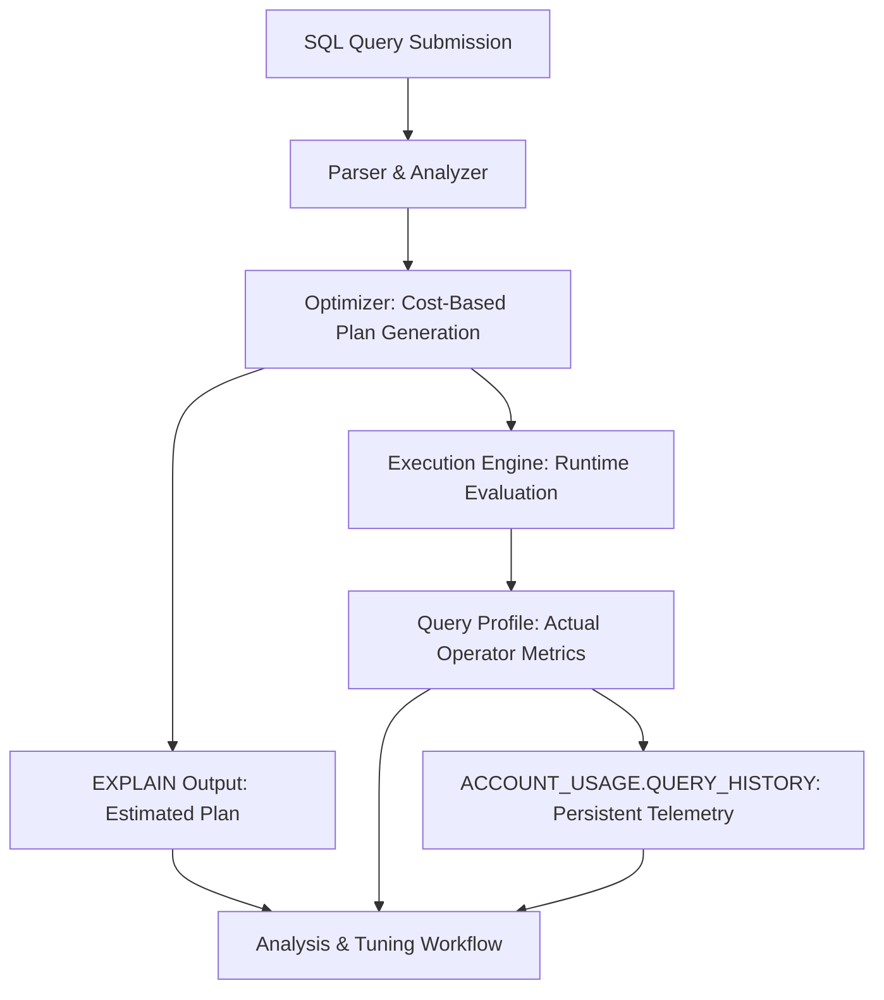

# 1. Title
Viewing and Analyzing Query Execution Plans in Snowflake

# 2. Overview
This pattern defines the procedural architecture for inspecting, interpreting, and optimizing Snowflake query execution plans. It exists to enable deterministic performance tuning, identify resource bottlenecks, validate pruning and join strategies, and prepare for SnowPro Advanced exam scenarios involving optimizer behavior. The pattern operates at the query compilation and runtime profiling layer, accessible via `EXPLAIN`, Snowsight Query Profile, and system views. It is consumed by performance engineers, query authors, platform architects, and exam candidates evaluating cost estimation, operator selection, and execution telemetry.

# 3. SQL Object Summary
| Object/Pattern | Type | Purpose | Source Objects/Inputs | Output Objects/Behavior | Execution Mode |
|----------------|------|---------|------------------------|--------------------------|----------------|
| Query Execution Plan Analysis | Diagnostic Pattern / SQL Interface | Inspect estimated and actual query execution steps, costs, and operator behavior | SQL query text, query ID, warehouse context | Structured plan output (text/JSON), visual profile, metrics tables | Synchronous (`EXPLAIN`) or asynchronous (post-execution profile) |

# 4. Architecture
Snowflake's query planner generates an estimated execution plan during compilation. At runtime, the engine records actual operator behavior, row counts, bytes processed, and resource consumption. The Query Profile UI visualizes this as a directed graph of operators. System views provide programmatic access for historical analysis and automated tuning.

# 5. Data Flow / Process Flow
1. **Query Compilation & Plan Estimation**
   - Input: SQL text, session parameters, table statistics
   - Transformation: Optimizer generates cost-based plan with estimated rows, bytes, operators
   - Output: `EXPLAIN` result (text or JSON)
   - Purpose: Preview execution strategy before resource consumption

2. **Runtime Execution & Metric Collection**
   - Input: Compiled plan, warehouse resources, micro-partition metadata
   - Transformation: Engine executes operators, records actual rows, bytes, spills, timing
   - Output: In-memory query profile with per-operator telemetry
   - Purpose: Capture real-world behavior for bottleneck identification

3. **Profile Visualization & Export**
   - Input: Runtime metrics, operator graph
   - Transformation: Snowsight renders interactive node tree with cost breakdowns
   - Output: Visual Query Profile with expandable operator details
   - Purpose: Enable intuitive exploration of execution bottlenecks

4. **Historical Telemetry Aggregation**
   - Input: Completed query metadata
   - Transformation: Metrics persisted to `ACCOUNT_USAGE.QUERY_HISTORY`
   - Output: Queryable telemetry for trend analysis and automated tuning
   - Purpose: Support programmatic optimization and alerting

# 6. Logical Breakdown
| Component | Responsibility | Inputs | Outputs | Dependencies | Failure Modes / Risks |
|-----------|----------------|--------|---------|--------------|------------------------|
| `plan_estimator` | Generate cost-based execution strategy | Query AST, table statistics, clustering metadata | Estimated plan with operator costs | Up-to-date statistics; accurate cardinality estimates | Stale stats cause misestimated join order or memory allocation |
| `runtime_profiler` | Record actual execution metrics | Compiled plan, warehouse resources, data scans | Per-operator telemetry: rows, bytes, spills, duration | Query completion; sufficient warehouse memory | Partial profiles if query aborts early |
| `profile_renderer` | Visualize operator graph | Runtime metrics, operator hierarchy | Interactive Query Profile UI | Snowsight access; query ID | Large plans may truncate or lag in UI |
| `telemetry_persister` | Store historical query data | Completed query metadata | `ACCOUNT_USAGE.QUERY_HISTORY` rows | Account-level usage tracking enabled | 1-year retention limit; delayed availability (up to 45 min) |
| `clustering_analyzer` | Evaluate pruning efficiency | Table clustering keys, filter predicates | `SYSTEM$CLUSTERING_INFORMATION` output | `CLUSTER BY` defined; recent DML | Metrics reflect last load, not real-time state |

# 7. Data Model (State Model)
| Object | Role | Important Fields | Grain | Relationships | Null Handling |
|--------|------|------------------|-------|---------------|---------------|
| `EXPLAIN_OUTPUT` | Estimated plan representation | `id`, `operation`, `estimated_rows`, `estimated_bytes`, `partitions` | Per operator in plan | Hierarchical parent-child via `id`/`parent_id` | `estimated_rows` may be `NULL` for non-scan operators |
| `QUERY_PROFILE_NODE` | Actual runtime operator | `node_id`, `operator_type`, `actual_rows`, `bytes_scanned`, `spilled_bytes`, `execution_time_ms` | Per operator per query | Tree structure via `parent_node_id` | `spilled_bytes` is `0` if no disk spill occurred |
| `ACCOUNT_USAGE.QUERY_HISTORY` | Persistent query telemetry | `QUERY_ID`, `WAREHOUSE_NAME`, `BYTES_SCANNED`, `PARTITIONS_SCANNED`, `EXECUTION_STATUS` | Per completed query | Links to `QUERY_HISTORY_QUERY_PARAMETERS`, `QUERY_HISTORY_COMPILE_STATS` | `PARTITIONS_SCANNED` is `NULL` for non-table queries |
| `SYSTEM$CLUSTERING_INFORMATION_OUTPUT` | Pruning efficiency metrics | `total_partition_count`, `partition_count_evaluated`, `overlapping_partition_count` | Per table + filter expression | Derived from micro-partition metadata | Returns `NULL` if table not clustered or expression invalid |

Output Grain: One row per operator in `EXPLAIN` or Query Profile. One row per query in `QUERY_HISTORY`. One row per table+filter in clustering analysis.

# 8. Business Logic (Execution Logic)
- **Plan Estimation Rules**: Optimizer uses table statistics (row count, min/max, distinct values) to estimate cardinality. Statistics update after `COPY`, `INSERT`, `MERGE`, or manual `ANALYZE`. Stale stats cause misestimated join order or memory grants.
- **Operator Selection**: `TableScan` applies pruning based on `CLUSTER BY` and filter predicates. `Join` strategies: broadcast (small dimension), shuffle (large-large), none (co-located). `Aggregate` pushes partial aggregation to scan layer when possible.
- **Pruning Evaluation**: Micro-partition pruning occurs when filter predicates match `CLUSTER BY` key min/max ranges. `SYSTEM$CLUSTERING_INFORMATION` reports `partition_count_evaluated` vs `total_partition_count`; low ratio indicates effective pruning.
- **Spill Detection**: `spilled_bytes_local` or `spilled_bytes_remote` > 0 indicates memory exhaustion. Common causes: large `ORDER BY`, unbounded window frames, high-cardinality `GROUP BY`. Mitigate via warehouse resize or query refactoring.
- **Join Strategy Indicators**: Broadcast join shows `broadcast` flag in profile; shuffle join shows `exchange` operator. Unexpected shuffle on small dimension suggests stats staleness or missing `CLUSTER BY`.
- **Exam-Relevant Defaults**: `EXPLAIN` shows estimated costs only; actual costs require Query Profile or `QUERY_HISTORY`. `PARTITIONS_SCANNED` in `QUERY_HISTORY` reflects post-pruning scan count. `BYTES_SCANNED` includes compressed micro-partition size, not uncompressed row size. `EXECUTION_STATUS = 'SUCCESS'` required for complete profile availability.

# 9. Transformations (State Transitions)
| Source State | Derived State | Rule / Evaluation Logic | Meaning | Impact |
|--------------|---------------|-------------------------|---------|--------|
| `sql_text` | `estimated_plan` | Optimizer cost model + statistics | `EXPLAIN` output with operator tree | Enables pre-execution tuning without compute cost |
| `compiled_plan` | `runtime_metrics` | Engine executes operators, records telemetry | Query Profile nodes with actual rows/bytes/spills | Identifies runtime bottlenecks vs estimates |
| `runtime_profile` | `visual_graph` | Snowsight renders node hierarchy + cost breakdown | Interactive UI with expandable operator details | Accelerates human analysis of complex plans |
| `completed_query` | `persistent_telemetry` | Metrics written to `ACCOUNT_USAGE` after completion | Queryable history for trend analysis | Enables automated alerting and regression detection |

# 10. Parameters / Variables / Configuration
| Name | Type | Purpose | Allowed Values | Default | Where Used | Effect |
|------|------|---------|----------------|---------|------------|--------|
| `EXPLAIN [USING TABULAR | JSON | TEXT]` | Control `EXPLAIN` output format | `TABULAR`, `JSON`, `TEXT` | `TEXT` | Query compilation | `JSON` enables programmatic parsing; `TABULAR` for human readability |
| `QUERY_HISTORY` retention | Account Setting | Define telemetry persistence window | 1 day (Standard), up to 1 year (Enterprise) | 1 day | `ACCOUNT_USAGE` views | Longer retention enables historical trend analysis |
| `WAREHOUSE_SIZE` | Object Parameter | Allocate compute memory for execution | X-Small to 6X-Large | X-Small | Query execution | Undersized warehouses increase spill risk |
| `AUTO_CLUSTERING` | Table Setting | Maintain clustering key order | `ON`, `OFF` | `ON` if `CLUSTER BY` specified | Table DDL | Automatic reclustering consumes credits but improves pruning |
| `ENABLE_QUERY_ACCELERATION` | Warehouse Setting | Offload scans to serverless acceleration | `TRUE`, `FALSE` | `FALSE` | Warehouse config | Reduces `BYTES_SCANNED` cost for eligible large scans |

# 11. APIs / Interfaces
| Interface | Invocation Method | Input Structure | Output Structure | Error Behavior | Consumers |
|-----------|-------------------|-----------------|------------------|----------------|-----------|
| `EXPLAIN [query]` | SQL Statement | Valid SELECT/DML query | Text/JSON/Tabular plan | Fails on syntax errors or unsupported statements | Query authors, exam candidates |
| Snowsight Query Profile | UI Navigation | Query ID or active query | Interactive operator graph | Unavailable for queries <1s or aborted early | Performance analysts |
| `ACCOUNT_USAGE.QUERY_HISTORY` | System View | Filter on `QUERY_ID`, `WAREHOUSE_NAME` | Query telemetry rows | Requires `ACCOUNTADMIN` or `VIEW SERVER STATE` | Automated tuning scripts |
| `SYSTEM$CLUSTERING_INFORMATION(table, filter)` | SQL Function | Table name, filter expression | JSON pruning metrics | Returns `NULL` if table not clustered or expression invalid | Clustering optimization workflows |
| `INFORMATION_SCHEMA.QUERY_HISTORY` | System View | Same as `ACCOUNT_USAGE` but shorter retention | Query telemetry rows | Requires `USAGE` on `INFORMATION_SCHEMA` | Role-restricted monitoring |

# 12. Execution / Deployment
- `EXPLAIN` executes synchronously during compilation; no warehouse credits consumed.
- Query Profile available post-execution in Snowsight; requires `MONITOR` privilege on warehouse.
- `ACCOUNT_USAGE.QUERY_HISTORY` data available ~45 minutes after query completion; retention governed by edition.
- Upstream dependency: Query must complete successfully for full profile; aborted queries show partial metrics.
- Environment behavior: Dev/test may disable `QUERY_HISTORY` retention to reduce storage; production mandates full telemetry for SLA tracking.
- Runtime assumption: Estimated plan (`EXPLAIN`) may diverge from actual execution due to runtime data skew or concurrent load.

# 13. Observability
- Monitor pruning efficiency: `SELECT SYSTEM$CLUSTERING_INFORMATION('table', 'date_col');` tracks `partition_count_evaluated / total_partition_count`.
- Track spill frequency: Query `ACCOUNT_USAGE.QUERY_HISTORY` for `SPILLED_BYTES_LOCAL + SPILLED_BYTES_REMOTE > 0`.
- Identify expensive operators: Sort Query Profile nodes by `execution_time_ms` or `bytes_scanned`.
- Alert on plan regression: Compare `BYTES_SCANNED` for identical query patterns across time windows; spike indicates stats staleness or data skew.
- Implement automated tuning: Script analysis of `QUERY_HISTORY` to flag queries with `PARTITIONS_SCANNED / TOTAL_PARTITIONS > 0.8` for clustering review.

# 14. Failure Handling & Recovery
- **Stale statistics cause misestimated plan**: Optimizer selects suboptimal join order or memory grant. Detection: `EXPLAIN` estimated rows differ significantly from `QUERY_HISTORY` actual rows. Recovery: Run `ANALYZE TABLE` or trigger auto-stats update via DML.
- **Missing pruning due to function-wrapped predicates**: `WHERE DATE_TRUNC('day', ts) = '2024-01-01'` bypasses clustering on `ts`. Detection: High `PARTITIONS_SCANNED` in profile. Recovery: Rewrite predicate to sargable form or add derived clustered column.
- **Memory spill on large sort/aggregation**: `spilled_bytes > 0` indicates disk I/O overhead. Detection: Query Profile shows `Sort` or `Aggregate` node with spill metrics. Recovery: Increase warehouse size, add `CLUSTER BY` to pre-sort data, or refactor to incremental aggregation.
- **Broadcast join on large dimension**: Unexpected `exchange` operator indicates stats staleness. Detection: Profile shows shuffle where broadcast expected. Recovery: Update statistics, add `CLUSTER BY` to dimension, or hint via query restructuring.
- **Query Profile unavailable for short/aborted queries**: Profile requires minimum execution time and successful completion. Detection: UI shows "Profile not available". Recovery: Use `EXPLAIN` for pre-execution analysis or `QUERY_HISTORY` for telemetry on completed queries.

# 15. Security & Access Control
- `EXPLAIN` requires `USAGE` on referenced objects and `EXECUTE` on warehouse.
- Query Profile access requires `MONITOR` privilege on the executing warehouse.
- `ACCOUNT_USAGE.QUERY_HISTORY` requires `ACCOUNTADMIN` or `VIEW SERVER STATE`; `INFORMATION_SCHEMA.QUERY_HISTORY` requires `USAGE` on schema.
- `SYSTEM$CLUSTERING_INFORMATION` requires `SELECT` on target table.
- Query text in telemetry may contain sensitive literals; apply row access policies or mask `QUERY_TEXT` in custom audit views if needed.

# 16. Performance / Scalability Considerations
- `EXPLAIN` adds negligible overhead; safe for production query validation.
- Query Profile UI may lag for plans with >500 operators; export to JSON for programmatic analysis.
- `ACCOUNT_USAGE.QUERY_HISTORY` queries on large time windows consume significant compute; filter by `WAREHOUSE_NAME` and `EXECUTION_TIME` to reduce scan volume.
- Clustering analysis via `SYSTEM$CLUSTERING_INFORMATION` scans micro-partition metadata; avoid frequent calls on large tables.
- Exam trap: `EXPLAIN` shows estimated costs only; actual costs require Query Profile. `PARTITIONS_SCANNED` reflects post-pruning count, not total partitions. `BYTES_SCANNED` is compressed size; uncompressed row size is larger.

# 17. Assumptions & Constraints
- Assumes table statistics are reasonably current. Stale stats cause optimizer misestimation; schedule regular `ANALYZE` or rely on auto-stats.
- Assumes `CLUSTER BY` keys align with frequent filter predicates. Misaligned clustering yields poor pruning regardless of plan analysis.
- Query Profile requires query completion; aborted or sub-second queries may not generate full telemetry.
- `ACCOUNT_USAGE.QUERY_HISTORY` has eventual consistency delay (~45 min); not suitable for real-time alerting.
- `EXPLAIN` does not execute the query; it cannot detect runtime errors like type mismatches or permission failures.
- Exam trap: `EXPLAIN USING JSON` output schema is undocumented and subject to change; prefer `TABULAR` for exam scenarios. `SYSTEM$CLUSTERING_INFORMATION` returns `NULL` if table not clustered or filter expression is non-deterministic.

# 18. Future Enhancements
- Implement automated plan regression detection by comparing `EXPLAIN` estimates vs `QUERY_HISTORY` actuals for critical queries, triggering alerts on divergence.
- Integrate clustering recommendations directly into Query Profile UI, suggesting `CLUSTER BY` adjustments based on filter pattern analysis.
- Replace manual `SYSTEM$CLUSTERING_INFORMATION` calls with continuous pruning health monitoring via scheduled tasks that log metrics to custom audit tables.
- Add query plan caching for repeated parameterized queries to avoid repeated optimization overhead in high-concurrency workloads.
- Develop programmatic tuning scripts that parse `EXPLAIN USING JSON` output to auto-generate `CLUSTER BY` or materialization recommendations based on operator cost distribution.
