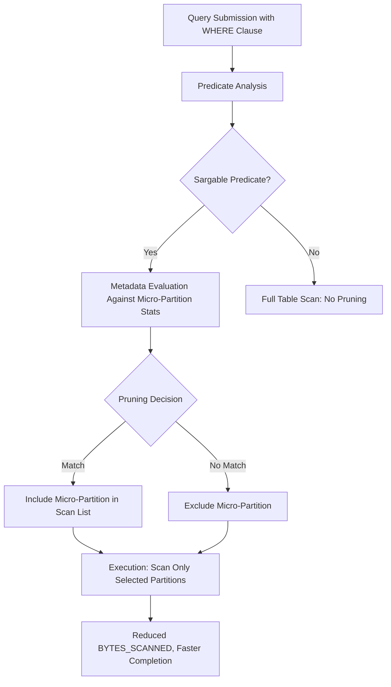

# 1. Title
Leveraging Partition Pruning for Query Performance Optimization in Snowflake

# 2. Overview
This pattern defines the procedural architecture for maximizing micro-partition pruning efficiency during Snowflake query execution. It exists to minimize scanned data volume, reduce warehouse credit consumption, and accelerate query response times by aligning filter predicates with micro-partition metadata boundaries. The pattern operates at the query optimization and storage access layer, leveraging `CLUSTER BY` definitions, column statistics, and sargable predicate evaluation. It is consumed by performance engineers, query authors, platform architects, and SnowPro Advanced candidates evaluating pruning mechanics, clustering strategies, and optimizer behavior boundaries.

# 3. SQL Object Summary
| Object/Pattern | Type | Purpose | Source Objects/Inputs | Output Objects/Behavior | Execution Mode |
|----------------|------|---------|------------------------|--------------------------|----------------|
| Partition Pruning Optimization | Query Optimization Pattern | Reduce scanned micro-partitions via metadata-based predicate evaluation | Filtered queries, `CLUSTER BY` definitions, column statistics | Reduced `PARTITIONS_SCANNED` metric, lower `BYTES_SCANNED`, faster execution | Synchronous, inline with query compilation and execution |

# 4. Architecture
Snowflake stores data in immutable micro-partitions (50–500MB uncompressed). Each micro-partition maintains metadata: min/max values, distinct counts, and null indicators per column. During query compilation, the optimizer evaluates filter predicates against this metadata to eliminate non-matching micro-partitions before scan execution. `CLUSTER BY` definitions physically co-locate rows with similar key values, improving pruning selectivity for range and equality predicates.

# 5. Data Flow / Process Flow
1. **Predicate Parsing & Classification**
   - Input: `WHERE` clause expressions, join conditions
   - Transformation: Optimizer classifies predicates as sargable or non-sargable
   - Output: Predicate eligibility list for pruning evaluation
   - Purpose: Identify which filters can leverage micro-partition metadata

2. **Metadata Lookup & Boundary Evaluation**
   - Input: Eligible predicates, target table micro-partition metadata
   - Transformation: Compare predicate values against min/max ranges per micro-partition
   - Output: Boolean inclusion flag per micro-partition
   - Purpose: Eliminate partitions guaranteed not to contain matching rows

3. **Scan List Generation**
   - Input: Inclusion flags, `CLUSTER BY` alignment status
   - Transformation: Build ordered list of micro-partitions to scan
   - Output: Reduced scan plan with partition count and byte estimates
   - Purpose: Minimize I/O and compute allocation before execution begins

4. **Execution & Telemetry Capture**
   - Input: Scan list, warehouse resources
   - Transformation: Read only selected micro-partitions; record actual vs estimated metrics
   - Output: Query results + `PARTITIONS_SCANNED`, `BYTES_SCANNED` telemetry
   - Purpose: Validate pruning effectiveness and enable future tuning

# 6. Logical Breakdown
| Component | Responsibility | Inputs | Outputs | Dependencies | Failure Modes / Risks |
|-----------|----------------|--------|---------|--------------|------------------------|
| `predicate_classifier` | Identify sargable filters | `WHERE` clause AST, column types | Eligible predicate list | Column statistics availability | Function-wrapped or type-mismatched predicates bypass classification |
| `metadata_evaluator` | Compare predicates to partition stats | Predicate values, micro-partition min/max | Inclusion flags per partition | Up-to-date metadata; `CLUSTER BY` alignment | Stale stats or skewed data cause over-inclusion |
| `scan_planner` | Generate reduced scan list | Inclusion flags, clustering order | Ordered partition scan plan | `CLUSTER BY` definition; storage layer access | Poor clustering yields minimal pruning despite eligible predicates |
| `execution_engine` | Scan only selected partitions | Scan plan, warehouse memory | Query results + telemetry | Warehouse sizing; I/O bandwidth | Undersized warehouse causes spill even with effective pruning |
| `pruning_analyzer` | Measure pruning efficiency | `PARTITIONS_SCANNED`, `TOTAL_PARTITIONS` | Pruning ratio, recommendations | `SYSTEM$CLUSTERING_INFORMATION`; query history | Metrics reflect historical state, not real-time partition layout |

# 7. Data Model (State Model)
| Object | Role | Important Fields | Grain | Relationships | Null Handling |
|--------|------|------------------|-------|---------------|---------------|
| `micro_partition_metadata` | Storage-level statistics | `partition_id`, `column_name`, `min_value`, `max_value`, `distinct_count` | Per column per micro-partition | Aggregated into table-level stats for optimizer | `min_value`/`max_value` exclude NULLs; null presence tracked separately |
| `clustering_key_definition` | Physical co-location spec | `table_name`, `cluster_columns`, `auto_clustering_enabled` | Per table | Drives micro-partition sort order during load | Columns with high null ratios reduce clustering effectiveness |
| `query_pruning_metrics` | Runtime telemetry | `query_id`, `total_partitions`, `partitions_scanned`, `bytes_scanned`, `pruning_ratio` | Per query per table | Derived from execution engine logs | `pruning_ratio` = `partitions_scanned / total_partitions`; NULL if no table scan |

Output Grain: One pruning metric record per table scanned per query. One metadata record per column per micro-partition (internal, not user-queryable directly).

# 8. Business Logic (Execution Logic)
- **Sargable Predicate Rules**: Pruning requires predicates in form `column [operator] literal` or `literal [operator] column`. Supported operators: `=`, `!=`, `<`, `<=`, `>`, `>=`, `IN`, `BETWEEN`, `IS [NOT] NULL`. Compound `AND` conditions improve pruning; `OR` conditions may reduce effectiveness.
- **Non-Sargable Anti-Patterns**: Function-wrapped columns (`DATE_TRUNC('day', ts) = ...`), type mismatches (`string_col = 123`), implicit casts, and expressions on both sides of operator bypass pruning.
- **CLUSTER BY Impact**: Clustering co-locates rows with similar key values, creating tighter min/max ranges per micro-partition. Effective for high-selectivity filters on clustered columns. Ineffective for low-cardinality or highly skewed columns.
- **Metadata Freshness**: Micro-partition stats update after `COPY`, `INSERT`, `MERGE`, or `DELETE`. Auto-clustering maintains sort order but does not refresh stats instantly. Stale stats cause optimizer to over-estimate partition inclusion.
- **Pruning Evaluation Order**: Equality predicates (`=`) evaluated first, then range predicates, then `IN`/`BETWEEN`. Compound conditions use intersection logic; `OR` conditions use union logic (less selective).
- **Exam-Relevant Defaults**: Pruning is automatic; no explicit hint required. `CLUSTER BY` is optional but recommended for large tables with frequent filtered queries. `SYSTEM$CLUSTERING_INFORMATION` returns `NULL` if table not clustered or filter expression non-deterministic. `PARTITIONS_SCANNED` in `QUERY_HISTORY` reflects post-pruning count. `BYTES_SCANNED` is compressed size, not uncompressed row size.

# 9. Transformations (State Transitions)
| Source State | Derived State | Rule / Evaluation Logic | Meaning | Impact |
|--------------|---------------|-------------------------|---------|--------|
| `raw_filter_predicate` | `sargable_classification` | `WHERE col = literal` vs `WHERE FUNC(col) = literal` | Determines pruning eligibility | Non-sargable predicates force full scan regardless of clustering |
| `micro_partition_stats` | `inclusion_decision` | `literal BETWEEN min_val AND max_val` per partition | Metadata-based elimination | Reduces scanned partitions from N to M where M << N |
| `clustered_table_load` | `tightened_ranges` | Rows sorted by `CLUSTER BY` keys during micro-partition creation | Improves min/max selectivity | Increases pruning ratio for future queries on clustered columns |
| `query_execution` | `pruning_telemetry` | `partitions_scanned / total_partitions` computed post-execution | Measures optimization effectiveness | Enables data-driven clustering adjustments |

# 10. Parameters / Variables / Configuration
| Name | Type | Purpose | Allowed Values | Default | Where Used | Effect |
|------|------|---------|----------------|---------|------------|--------|
| `CLUSTER BY` | DDL Clause | Define physical co-location keys | 1–4 column expressions | None (unordered) | Table creation/alteration | Enables tighter min/max ranges for pruning |
| `AUTO_CLUSTERING` | Table Setting | Maintain clustering order post-load | `ON`, `OFF` | `ON` if `CLUSTER BY` specified | Table DDL | Background reclustering consumes credits but preserves pruning efficiency |
| `SEARCH OPTIMIZATION` | DDL Option | Enable secondary access path for point lookups | N/A | Disabled | Table creation/alteration | Improves high-cardinality equality filter performance; complementary to pruning |
| `WAREHOUSE_SIZE` | Object Parameter | Allocate memory for scan execution | X-Small to 6X-Large | X-Small | Query execution | Undersized warehouses cause spill even with effective pruning |
| `ENABLE_QUERY_ACCELERATION` | Warehouse Setting | Offload eligible scans to serverless layer | `TRUE`, `FALSE` | `FALSE` | Warehouse config | Reduces cost for large scans that cannot be fully pruned |

# 11. APIs / Interfaces
| Interface | Invocation Method | Input Structure | Output Structure | Error Behavior | Consumers |
|-----------|-------------------|-----------------|------------------|----------------|-----------|
| `SYSTEM$CLUSTERING_INFORMATION(table, filter_expr)` | SQL Function | Table name, filter predicate as string | JSON: `total_partition_count`, `partition_count_evaluated`, `overlapping_partition_count` | Returns `NULL` if table not clustered or expression invalid | Performance analysts, tuning scripts |
| `ACCOUNT_USAGE.QUERY_HISTORY` | System View | Filter on `QUERY_ID`, `TABLE_NAME` | `PARTITIONS_SCANNED`, `BYTES_SCANNED`, `EXECUTION_TIME` | Requires `ACCOUNTADMIN` or `VIEW SERVER STATE` | Automated monitoring, regression detection |
| `EXPLAIN [query]` | SQL Statement | Valid SELECT query | Estimated plan with `partitions` field per scan operator | Fails on syntax errors | Pre-execution pruning validation |
| Snowsight Query Profile | UI Navigation | Query ID | Visual operator graph with `Partitions scanned` metric | Unavailable for queries <1s or aborted | Interactive bottleneck analysis |

# 12. Execution / Deployment
- Pruning evaluation occurs during query compilation; zero additional compute overhead.
- `CLUSTER BY` maintenance via auto-clustering runs asynchronously; consumes warehouse credits proportional to data churn.
- Upstream dependency: Accurate column statistics. Stale stats cause suboptimal pruning decisions.
- Environment behavior: Dev/test may disable auto-clustering to reduce cost; production mandates clustering on high-selectivity filter columns.
- Runtime assumption: Pruning effectiveness is query-dependent. A table optimized for `date` filters may not prune efficiently on `user_id` without additional clustering or search optimization.

# 13. Observability
- Measure pruning ratio: `SELECT partitions_scanned / total_partitions AS pruning_ratio FROM TABLE(SYSTEM$CLUSTERING_INFORMATION('my_table', 'date_col = ''2024-01-01'''));`
- Track historical efficiency: `SELECT query_id, partitions_scanned, total_partitions FROM ACCOUNT_USAGE.QUERY_HISTORY WHERE table_name = 'MY_TABLE' ORDER BY start_time DESC;`
- Monitor clustering health: `SELECT SYSTEM$CLUSTERING_INFORMATION('my_table', 'date_col');` tracks `average_depth` and `partition_depths_histogram`; high depth indicates fragmentation.
- Alert on regression: Compare `pruning_ratio` for identical query patterns across time windows; drop below threshold triggers clustering review.
- Implement automated tuning: Script analysis of `QUERY_HISTORY` to flag queries with `partitions_scanned / total_partitions > 0.8` for `CLUSTER BY` or predicate refactoring.

# 14. Failure Handling & Recovery
- **Non-sargable predicate bypasses pruning**: `WHERE DATE_TRUNC('day', ts) = '2024-01-01'` scans all partitions. Detection: High `PARTITIONS_SCANNED` in Query Profile. Recovery: Rewrite as `WHERE ts >= '2024-01-01' AND ts < '2024-01-02'` or add derived clustered column.
- **Type mismatch prevents metadata comparison**: `WHERE string_date_col = 20240101` fails to prune. Detection: Full scan despite selective filter. Recovery: Cast literal to match column type: `WHERE string_date_col = '20240101'`.
- **Stale statistics cause over-inclusion**: Optimizer includes partitions that no longer contain matching values. Detection: `EXPLAIN` estimated partitions >> actual matching rows. Recovery: Trigger stats update via `COPY`/`MERGE` or schedule `ANALYZE TABLE`.
- **Clustering key misalignment**: Filter on `user_id` but table clustered on `date`. Detection: Low pruning ratio for `user_id` queries. Recovery: Re-evaluate query patterns; add composite `CLUSTER BY (date, user_id)` or enable Search Optimization for point lookups.
- **Auto-clustering credit exhaustion**: Background maintenance paused due to budget limits. Detection: `CLUSTERING_DEPTH` increases over time. Recovery: Increase warehouse size for clustering tasks or adjust `AUTO_CLUSTERING` schedule to off-peak hours.

# 15. Security & Access Control
- Standard `SELECT` privilege required to benefit from pruning; no additional permissions needed.
- `SYSTEM$CLUSTERING_INFORMATION` requires `SELECT` on target table.
- `ACCOUNT_USAGE.QUERY_HISTORY` requires `ACCOUNTADMIN` or `VIEW SERVER STATE`; `INFORMATION_SCHEMA.QUERY_HISTORY` requires `USAGE` on schema.
- Row Access Policies and Dynamic Data Masking evaluate after pruning; they do not affect partition elimination logic.
- Query text in telemetry may contain sensitive filter values; mask `QUERY_TEXT` in custom audit views if needed.

# 16. Performance / Scalability Considerations
- Pruning reduces `BYTES_SCANNED`, directly lowering warehouse credit consumption. Effective pruning can reduce scan volume by 90%+ for well-clustered tables.
- `CLUSTER BY` on high-cardinality, high-selectivity columns (e.g., `event_date`, `tenant_id`) yields best results. Avoid clustering on low-cardinality or frequently updated columns.
- Composite `CLUSTER BY` keys: Order matters. Leftmost columns dominate pruning effectiveness. `CLUSTER BY (date, region)` prunes well on `date` filters; `region`-only filters see limited benefit.
- Auto-clustering consumes credits proportional to data churn. High-frequency `MERGE`/`UPDATE` workloads may incur significant maintenance cost.
- Search Optimization complements pruning for high-cardinality point lookups (`user_id = 12345`) but adds storage overhead and background index maintenance.
- Exam trap: Pruning does not guarantee sort order. `ORDER BY` still required for deterministic output. `CLUSTER BY` does not replace `ORDER BY`. `SYSTEM$CLUSTERING_INFORMATION` filter expression must be deterministic; non-deterministic functions return `NULL`.

# 17. Assumptions & Constraints
- Assumes filter predicates are sargable and type-consistent. Non-sargable expressions bypass pruning regardless of clustering.
- Assumes micro-partition statistics are reasonably current. Stale stats cause optimizer to over-include partitions.
- `CLUSTER BY` limited to 4 columns. Excess columns ignored by optimizer.
- Pruning effectiveness is query-specific. A table optimized for date-range queries may not prune efficiently for user-ID lookups without additional indexing.
- `SYSTEM$CLUSTERING_INFORMATION` evaluates pruning potential, not actual execution. Actual `PARTITIONS_SCANNED` may differ due to runtime optimizations.
- Auto-clustering maintains physical order but does not refresh column statistics instantly. Stats update after DML completion.
- Exam trap: `PARTITIONS_SCANNED` reflects post-pruning count. `BYTES_SCANNED` is compressed micro-partition size. `CLUSTER BY` does not enforce uniqueness or constraints.

# 18. Future Enhancements
- Implement automated predicate analysis scripts that parse `QUERY_HISTORY` to identify frequently filtered non-clustered columns, recommending `CLUSTER BY` adjustments.
- Integrate pruning efficiency monitoring into CI/CD pipelines: fail deployment if new queries show `pruning_ratio < 0.2` for expected selective filters.
- Replace manual `SYSTEM$CLUSTERING_INFORMATION` calls with continuous health dashboards that track `average_depth` and `overlapping_partition_count` trends per table.
- Develop query rewrite assistants that automatically convert non-sargable predicates (e.g., `DATE_TRUNC`) to sargable equivalents during query submission.
- Leverage Snowflake's query acceleration service for large scans that cannot be fully pruned, reducing cost without requiring schema changes.
