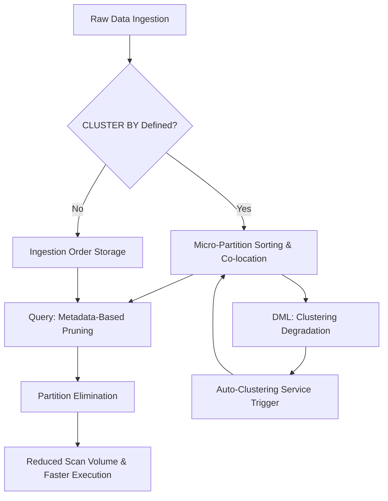

# 1. Title
Leveraging Clustering Keys for Query Performance in Snowflake

# 2. Overview
This pattern defines the procedural architecture for defining, maintaining, and utilizing clustering keys to optimize micro-partition organization and partition pruning efficiency in Snowflake. It exists to co-locate rows with similar values within micro-partitions, enabling the query optimizer to eliminate non-matching partitions early in execution. The pattern operates at the storage organization and query compilation layers, bridging data loading behavior with runtime performance. It is consumed by data architects, performance engineers, query authors, and SnowPro Advanced candidates evaluating physical storage design, auto-clustering mechanics, credit billing boundaries, and optimizer behavior.

# 3. SQL Object Summary
| Object/Pattern | Type | Purpose | Source Objects/Inputs | Output Objects/Behavior | Execution Mode |
|----------------|------|---------|------------------------|--------------------------|----------------|
| Clustering Key Definition & Maintenance | DDL / Background Service | Physically co-locate rows by specified columns to improve pruning selectivity | Base tables, DML operations, `CLUSTER BY` definition | Sorted micro-partition layout, updated metadata, `CLUSTERING_DEPTH` metrics | Asynchronous (auto-clustering) or manual (`RECLUSTER`) |

# 4. Architecture
Snowflake stores table data in immutable, compressed micro-partitions (50–500MB uncompressed). Without a clustering key, data preserves ingestion order, causing values to scatter across partitions. A `CLUSTER BY` definition instructs the storage engine to sort and co-locate rows during load. As DML modifies data, clustering degrades. The auto-clustering service monitors `CLUSTERING_DEPTH` and asynchronously rewrites partitions to restore co-location. Queries leverage partition metadata (min/max per column) to skip irrelevant micro-partitions.

# 5. Data Flow / Process Flow
1. **Key Definition & Load-Time Sorting**
   - Input: DDL `CLUSTER BY` clause, incoming data streams
   - Transformation: Sort engine orders rows by clustering key expressions during micro-partition creation
   - Output: Physically co-located micro-partitions with tight min/max ranges
   - Purpose: Establish optimal pruning baseline

2. **Query Compilation & Pruning**
   - Input: `WHERE`/`JOIN` predicates, micro-partition metadata
   - Transformation: Optimizer compares filter values against partition min/max bounds
   - Output: Reduced scan list of matching partitions
   - Purpose: Skip I/O and compute for non-matching data

3. **DML Execution & Degradation Tracking**
   - Input: `INSERT`, `UPDATE`, `MERGE`, `DELETE` operations
   - Transformation: New or modified micro-partitions appended or rewritten
   - Output: Increased `CLUSTERING_DEPTH`, overlapping value ranges across partitions
   - Purpose: Track physical organization decay

4. **Auto-Clustering Maintenance**
   - Input: Degradation metrics, credit budget, warehouse availability
   - Transformation: Background service re-sorts and co-locates affected partitions
   - Output: Restored `CLUSTERING_DEPTH`, tightened metadata ranges
   - Purpose: Sustain pruning efficiency without manual intervention

# 6. Logical Breakdown
| Component | Responsibility | Inputs | Outputs | Dependencies | Failure Modes / Risks |
|-----------|----------------|--------|---------|--------------|------------------------|
| `key_definition_engine` | Parse and validate `CLUSTER BY` expressions | DDL syntax, column types, expression complexity | Validated clustering specification | Max 4 expressions; deterministic functions only | Non-deterministic or >4 expressions block DDL |
| `co_location_sorter` | Physically arrange rows during load | Incoming rows, clustering key order | Micro-partitions with sorted values | Storage layer write path | Sorting overhead increases initial load time |
| `degradation_tracker` | Monitor clustering health | DML volume, partition overlap, `CLUSTERING_DEPTH` | Health metrics, auto-clustering trigger flags | Metadata service, partition scan counters | High churn without maintenance causes pruning collapse |
| `auto_clustering_service` | Rebuild degraded partitions | Degradation flags, credit budget, cluster keys | Re-sorted micro-partitions, updated metadata | Serverless compute pool, warehouse credits | Credit limits or disabled service halt maintenance |
| `pruning_evaluator` | Eliminate partitions at compile time | Query predicates, partition min/max metadata | Scan list with `PARTITIONS_SCANNED` estimate | Up-to-date statistics, sargable predicates | Function-wrapped filters bypass evaluation entirely |

# 7. Data Model (State Model)
| Object | Role | Important Fields | Grain | Relationships | Null Handling |
|--------|------|------------------|-------|---------------|---------------|
| `table_clustering_def` | Physical organization spec | `table_name`, `cluster_key_expr`, `auto_clustering_state` | Per table | Drives micro-partition layout | Null values in clustering columns are grouped together at partition boundaries |
| `micro_partition_layout` | Storage-level state | `partition_id`, `min_val`, `max_val`, `depth_level` | Per partition per column | Derived from clustering sort order | `min`/`max` exclude NULLs; null presence tracked via separate flag |
| `clustering_health_metrics` | Operational telemetry | `average_depth`, `total_partitions`, `overlapping_partitions`, `last_auto_cluster_time` | Per table | Aggregated from partition metadata | `NULL` returned by `SYSTEM$CLUSTERING_INFORMATION` if table unclustered |

Output Grain: One clustering definition per table. One health metric record per table evaluation. One micro-partition record per physical storage unit.

# 8. Business Logic (Execution Logic)
- **Selection Rules**: Cluster on columns frequently used in `WHERE`, `JOIN`, or `GROUP BY` predicates. Prioritize high-cardinality, high-selectivity columns (e.g., `event_date`, `tenant_id`, `status`). Avoid low-cardinality or static columns.
- **Key Composition**: Supports 1–4 expressions. Composite keys evaluate left-to-right; first column dominates pruning effectiveness. `CLUSTER BY (date, user_id)` optimizes date-range queries; `user_id`-only queries see minimal benefit.
- **Auto-Clustering Triggers**: Activates when `CLUSTERING_DEPTH` exceeds threshold (typically >10–15) or after significant DML. Suspends when depth drops below threshold or credit budget is exhausted.
- **Pruning Interaction**: Clustering tightens min/max ranges per micro-partition. Optimizer eliminates partitions where filter values fall outside ranges. Compound `AND` predicates improve elimination; `OR` predicates reduce it.
- **Credit Billing**: Auto-clustering consumes warehouse credits billed per second of serverless execution. Cost scales with data churn and key complexity.
- **Exam-Relevant Defaults**: `CLUSTER BY` is optional. Auto-clustering is `ON` by default when key is defined. `CLUSTER BY` does not enforce uniqueness, replace `ORDER BY`, or guarantee sort order. `SYSTEM$CLUSTERING_INFORMATION` returns `NULL` if table lacks clustering or expression is non-deterministic.

# 9. Transformations (State Transitions)
| Source State | Derived State | Rule / Evaluation Logic | Meaning | Impact |
|--------------|---------------|-------------------------|---------|--------|
| `unsorted_ingestion` | `sorted_micro_partitions` | Rows co-located by `CLUSTER BY` during load | Initial optimal physical layout | Enables high pruning ratio for filtered queries |
| `active_dml` | `clustering_degradation` | New partitions append; existing ranges overlap | `CLUSTERING_DEPTH` increases | Pruning efficiency drops; `PARTITIONS_SCANNED` rises |
| `high_depth_state` | `auto_cluster_trigger` | Depth > threshold + credit budget available | Background service initiates rewrite | Restores co-location; consumes credits |
| `re-clustered_state` | `tightened_metadata` | Overlapping partitions rewritten; ranges narrowed | `CLUSTERING_DEPTH` decreases | Pruning ratio recovers; query latency drops |

# 10. Parameters / Variables / Configuration
| Name | Type | Purpose | Allowed Values | Default | Where Used | Effect |
|------|------|---------|----------------|---------|------------|--------|
| `CLUSTER BY` | DDL Clause | Define physical sort/co-location columns | 1–4 expressions | None | `CREATE/ALTER TABLE` | Enables micro-partition optimization |
| `AUTO_CLUSTERING` | Table Setting | Control background maintenance | `ON`, `OFF`, `PAUSE`, `RESUME` | `ON` if key defined | Table DDL | Toggles serverless credit consumption for maintenance |
| `CLUSTERING_DEPTH` | Internal Metric | Measure partition overlap severity | Numeric threshold | ~10–15 (trigger point) | Auto-clustering service | Drives automatic maintenance execution |
| `WAREHOUSE_SIZE` | Object Parameter | Size cluster for maintenance tasks | X-Small to 6X-Large | Serverless (auto-managed) | Auto-clustering execution | Larger warehouses speed up maintenance; increase cost |
| `RECLUSTER` | DDL Command | Force immediate manual re-clustering | Target partitions or full table | N/A | `ALTER TABLE ... RECLUSTER` | Bypasses auto-scheduling; consumes explicit compute |

# 11. APIs / Interfaces
| Interface | Invocation Method | Input Structure | Output Structure | Error Behavior | Consumers |
|-----------|-------------------|-----------------|------------------|----------------|-----------|
| `CREATE TABLE ... CLUSTER BY (expr)` | DDL Statement | Table spec + 1–4 column expressions | Clustered table object | Fails on >4 expressions or non-deterministic functions | Architects, engineers |
| `ALTER TABLE ... SUSPEND/RESUME CLUSTERING` | DDL Statement | Table name + action | Updated maintenance state | Fails if insufficient privileges | Cost managers, ops teams |
| `SYSTEM$CLUSTERING_INFORMATION(table, [filter])` | SQL Function | Table name, optional predicate string | JSON: `average_depth`, `partition_count_evaluated`, `overlapping_partition_count` | Returns `NULL` if unclustered or invalid filter | Performance analysts |
| `ALTER TABLE ... RECLUSTER` | DDL Statement | Table name, optional partition filter | Triggered maintenance job | Fails if warehouse unavailable or syntax invalid | DBAs, pipeline operators |
| `ACCOUNT_USAGE.AUTOMATIC_CLUSTERING_HISTORY` | System View | Filter on table, time range | Credit consumption, duration, partitions reclustered | Requires `ACCOUNTADMIN` or `VIEW SERVER STATE` | Cost auditors, platform engineers |

# 12. Execution / Deployment
- Auto-clustering executes asynchronously via serverless compute pool. No manual scheduling required.
- Triggered by DML volume thresholds, `CLUSTERING_DEPTH` limits, or manual `RECLUSTER` command.
- Upstream dependency: Table must have `CLUSTER BY` defined. Auto-clustering remains idle otherwise.
- Environment behavior: Dev/test often disables auto-clustering to control costs. Production enables it with credit monitors.
- Runtime assumption: Maintenance runs only when beneficial. Snowflake suspends service when depth drops below threshold or credits are constrained.

# 13. Observability
- Query clustering health: `SELECT SYSTEM$CLUSTERING_INFORMATION('schema.table');` monitors `average_depth` and `overlapping_partition_count`.
- Track credit consumption: `SELECT * FROM ACCOUNT_USAGE.AUTOMATIC_CLUSTERING_HISTORY WHERE TABLE_NAME = 'MY_TABLE';`
- Validate pruning impact: Compare `PARTITIONS_SCANNED` pre/post maintenance in `ACCOUNT_USAGE.QUERY_HISTORY`.
- Alert on degradation: Notify when `average_depth > 15` for critical tables over 3 consecutive days.
- Implement automated review: Weekly job flags tables with high `overlapping_partition_count` but low query pruning ratio, indicating misaligned keys.

# 14. Failure Handling & Recovery
- **Credit budget exhausted**: Auto-clustering suspends mid-maintenance. Detection: `AUTOMATIC_CLUSTERING_HISTORY` shows `SUSPENDED` or abrupt end. Recovery: Increase resource monitor limits, adjust `PAUSE`/`RESUME` policy, or run `RECLUSTER` during off-peak hours.
- **Key misalignment with query patterns**: High depth but no pruning improvement. Detection: `SYSTEM$CLUSTERING_INFORMATION` shows improvement, but `QUERY_HISTORY` shows full scans. Recovery: Redefine `CLUSTER BY` to match frequent filter predicates; drop unused keys.
- **Non-deterministic clustering expression**: `CLUSTER BY (RANDOM(), col)` fails at DDL. Detection: Compilation error. Recovery: Replace with deterministic columns or derived columns computed during ingestion.
- **Stale statistics post-recluster**: Optimizer uses outdated metadata, skipping newly optimized partitions. Detection: High `PARTITIONS_SCANNED` immediately after maintenance. Recovery: Trigger `ANALYZE TABLE` or wait for automatic stats refresh post-DML.
- **Over-clustering on high-churn table**: Maintenance cost exceeds query savings. Detection: `AUTOMATIC_CLUSTERING_HISTORY` credits > query execution credits. Recovery: Disable auto-clustering, increase table retention to batch recluster, or switch to Search Optimization for point lookups.

# 15. Security & Access Control
- `CLUSTER BY` definition requires `OWNERSHIP` or `ALTER` privilege on table.
- `SYSTEM$CLUSTERING_INFORMATION` and `ACCOUNT_USAGE` views require `SELECT` on table or `ACCOUNTADMIN`/`VIEW SERVER STATE`.
- Row Access Policies and Dynamic Data Masking evaluate after partition pruning; they do not interfere with clustering maintenance or metadata.
- No additional network or encryption boundaries introduced by clustering keys. Data at rest remains encrypted identically.

# 16. Performance / Scalability Considerations
- **Trade-off**: Clustering improves query pruning but increases storage I/O and credit consumption during DML/maintenance. Benefit must outweigh maintenance cost.
- **Key selection limit**: Max 4 expressions. Leftmost column dominates. Adding irrelevant columns increases sort overhead and maintenance cost without pruning gain.
- **Diminishing returns**: `average_depth` < 10 typically yields optimal pruning. Pushing depth to 1–3 consumes disproportionate credits for marginal query improvement.
- **Join alignment**: Clustering fact and dimension tables on join keys enables partition-wise joins, reducing shuffle operations. Mismatched keys force full broadcast or hash joins.
- **Large table scaling**: Auto-clustering processes partitions in parallel. Extremely wide tables (>100TB) may experience longer maintenance windows; schedule during low-concurrency periods.
- **Exam trap**: `CLUSTER BY` does not replace `ORDER BY`. It only affects micro-partition layout and pruning. `AUTO_CLUSTERING` is serverless and billed separately from user query credits. `RECLUSTER` forces immediate execution regardless of depth threshold.

# 17. Assumptions & Constraints
- Assumes query workload is stable and filter patterns are known. Clustering keys optimized for exploratory ad-hoc queries rarely yield sustained ROI.
- Assumes data churn rate is within auto-clustering service capacity. Extremely high-frequency `MERGE`/`UPDATE` workloads may outpace maintenance.
- `CLUSTER BY` expressions must be deterministic. Functions like `RANDOM()`, `UUID_STRING()`, or session-dependent expressions are invalid.
- `SYSTEM$CLUSTERING_INFORMATION` evaluates potential pruning, not guaranteed execution. Actual `PARTITIONS_SCANNED` depends on query predicates and optimizer decisions.
- Auto-clustering service runs only when beneficial. Snowflake internally suspends maintenance when cost-to-benefit ratio degrades.
- Exam trap: Clustering keys do not enforce uniqueness, constraints, or sort order in result sets. `CLUSTER BY` is physical organization only. `AUTO_CLUSTERING` suspends automatically; it does not run continuously. `SYSTEM$CLUSTERING_INFORMATION` returns `NULL` for unclustered tables or non-deterministic filters.

# 18. Future Enhancements
- Implement AI-driven clustering recommendations that analyze `QUERY_HISTORY` and `AUTOMATIC_CLUSTERING_HISTORY` to suggest optimal keys per table.
- Introduce cost-aware auto-suspension policies that pause maintenance when query savings fall below credit threshold for N consecutive days.
- Add incremental key evolution: allow `CLUSTER BY` definitions to adapt dynamically as query patterns shift, without full table recreation.
- Develop partition-aware query rewriting tools that automatically inject sargable predicates aligned with existing clustering keys.
- Integrate clustering health scores directly into CI/CD deployment gates, blocking schema changes that introduce non-deterministic or misaligned keys.
