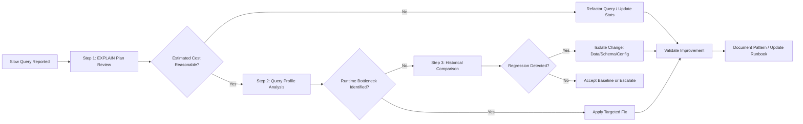

# 1. Title
Troubleshooting Query Performance in Snowflake: A Systematic Diagnostic Framework

# 2. Overview
This pattern defines the procedural architecture for diagnosing, isolating, and resolving query performance degradation in Snowflake. It exists to provide a repeatable methodology for identifying root causes—whether pruning failures, join explosions, memory spills, or resource contention—without relying on trial-and-error tuning. The pattern operates across the query lifecycle: compilation (plan estimation), execution (runtime telemetry), and post-execution (historical analysis). It is consumed by performance engineers, query authors, platform architects, and SnowPro Advanced candidates evaluating optimizer behavior, telemetry interpretation, and remediation trade-offs.

# 3. SQL Object Summary
| Object/Pattern | Type | Purpose | Source Objects/Inputs | Output Objects/Behavior | Execution Mode |
|----------------|------|---------|------------------------|--------------------------|----------------|
| Query Performance Troubleshooting Framework | Diagnostic Methodology / Toolchain | Systematically isolate performance bottlenecks and apply targeted remediation | Query text, Query ID, warehouse metrics, table metadata | Root cause identification, remediation plan, validated performance improvement | Synchronous (interactive analysis) or asynchronous (automated monitoring) |

# 4. Architecture
The framework implements a layered diagnostic pipeline. Queries enter a compilation phase where estimated plans are generated. During execution, the engine records operator-level telemetry. Post-completion, metrics persist to system views for historical analysis. The troubleshooting workflow traverses these layers: plan validation → runtime profile inspection → historical trend comparison → targeted remediation.

# 5. Data Flow / Process Flow
1. **Symptom Intake & Baseline Capture**
   - Input: Query ID, execution time, error message, or user report
   - Transformation: Retrieve `QUERY_HISTORY` entry, capture baseline metrics (`EXECUTION_TIME`, `BYTES_SCANNED`, `PARTITIONS_SCANNED`)
   - Output: Structured incident record with initial metrics
   - Purpose: Establish reproducible context for investigation

2. **Plan-Level Validation**
   - Input: Query text, table statistics, clustering metadata
   - Transformation: Execute `EXPLAIN`, review estimated rows, bytes, operators
   - Output: Estimated plan with cost breakdown
   - Purpose: Identify misestimated cardinality, missing pruning, or suboptimal join order before runtime

3. **Runtime Profile Inspection**
   - Input: Query ID, Snowsight access
   - Transformation: Open Query Profile, inspect operator tree for spills, skew, or unexpected scans
   - Output: Visual bottleneck identification with per-operator metrics
   - Purpose: Pinpoint exact execution stage causing latency or resource exhaustion

4. **Historical Trend Analysis**
   - Input: `ACCOUNT_USAGE.QUERY_HISTORY`, time window
   - Transformation: Compare current metrics against historical baselines for same query pattern
   - Output: Regression detection: data growth, stats staleness, or config drift
   - Purpose: Distinguish one-off anomalies from systemic degradation

5. **Remediation Application & Validation**
   - Input: Identified root cause, available optimization levers
   - Transformation: Apply fix (predicate rewrite, clustering, warehouse resize, stats update)
   - Output: Re-executed query with improved metrics
   - Purpose: Confirm resolution and document pattern for future reuse

# 6. Logical Breakdown
| Component | Responsibility | Inputs | Outputs | Dependencies | Failure Modes / Risks |
|-----------|----------------|--------|---------|--------------|------------------------|
| `symptom_classifier` | Categorize performance issue type | Execution time, error code, user description | Issue taxonomy: pruning, spill, join, contention | Clear symptom reporting | Vague reports lead to misdirected investigation |
| `plan_validator` | Assess estimated vs actual cost divergence | `EXPLAIN` output, `QUERY_HISTORY` actuals | Cardinality mismatch flags, pruning eligibility | Up-to-date table statistics | Stale stats cause false positives in plan analysis |
| `profile_interpreter` | Decode runtime operator telemetry | Query Profile JSON/UI, operator metrics | Bottleneck identification: spill, skew, full scan | Query completion; profile availability | Aborted queries lack complete profile data |
| `trend_analyzer` | Detect regression vs baseline | Historical `QUERY_HISTORY` rows, time-series metrics | Regression flags, change attribution | Retention window; consistent query patterns | Short retention or pattern drift obscures root cause |
| `remediation_applier` | Execute targeted optimization | Root cause, available levers (DDL, query rewrite, config) | Applied fix + validation metrics | Privileges; change management process | Over-optimization increases maintenance cost without query benefit |

# 7. Data Model (State Model)
| Object | Role | Important Fields | Grain | Relationships | Null Handling |
|--------|------|------------------|-------|---------------|---------------|
| `query_incident_record` | Troubleshooting work unit | `incident_id`, `query_id`, `symptom`, `baseline_metrics`, `root_cause`, `remediation` | Per performance investigation | Links to `QUERY_HISTORY`, `EXPLAIN` output, remediation DDL | `root_cause` populated post-analysis; `NULL` during investigation |
| `performance_baseline` | Historical reference metrics | `query_pattern_hash`, `avg_execution_time`, `avg_bytes_scanned`, `avg_partitions_scanned`, `sample_window` | Per query pattern per time bucket | Aggregated from `QUERY_HISTORY` | Metrics exclude outliers (>3σ) to avoid skewing baseline |
| `remediation_playbook` | Documented fix patterns | `root_cause_type`, `symptom_signature`, `remediation_steps`, `validation_query`, `cost_impact` | Per known issue pattern | Referenced by `query_incident_record` | `cost_impact` may be `NULL` if not yet measured |

Output Grain: One incident record per investigation. One baseline record per query pattern per aggregation window. One playbook entry per documented root cause.

# 8. Business Logic (Execution Logic)
- **Issue Taxonomy**: Classify symptoms into categories: (1) Pruning failure (high `PARTITIONS_SCANNED`), (2) Memory spill (`SPILLED_BYTES > 0`), (3) Join explosion (unexpected `EXCHANGE` or broadcast on large table), (4) Resource contention (warehouse queue time > execution time), (5) Stats staleness (`EXPLAIN` estimated rows >> actual).
- **Diagnostic Priority**: Always check pruning first—most high-impact, lowest-cost fix. Then evaluate spills, then join strategy, then resource allocation.
- **Remediation Hierarchy**: Prefer query rewrites (sargable predicates, explicit casts) over DDL changes. Prefer DDL (clustering, search optimization) over warehouse resizing. Reserve resizing for genuine compute-bound workloads.
- **Validation Protocol**: After remediation, re-run query with identical parameters. Compare `EXECUTION_TIME`, `BYTES_SCANNED`, `PARTITIONS_SCANNED`. Require ≥20% improvement to consider fix successful.
- **Documentation Requirement**: Every resolved incident updates the `remediation_playbook`. Pattern reuse reduces mean-time-to-resolution for recurring issues.
- **Exam-Relevant Defaults**: `EXPLAIN` shows estimated costs only; actual costs require Query Profile. `PARTITIONS_SCANNED` reflects post-pruning count. `BYTES_SCANNED` is compressed size. `QUERY_HISTORY` has eventual consistency delay (~45 min). `SYSTEM$CLUSTERING_INFORMATION` returns `NULL` for unclustered tables.

# 9. Transformations (State Transitions)
| Source State | Derived State | Rule / Evaluation Logic | Meaning | Impact |
|--------------|---------------|-------------------------|---------|--------|
| `raw_slow_query` | `classified_incident` | Match symptoms to taxonomy via rule engine | Structured investigation starting point | Enables consistent diagnostic workflow |
| `explain_output` + `query_history` | `cardinality_mismatch_flag` | `ABS(estimated_rows - actual_rows) / actual_rows > threshold` | Detects stats staleness or optimizer misestimate | Triggers stats refresh or query rewrite |
| `query_profile_nodes` | `bottleneck_signature` | Identify operator with highest `execution_time_ms` or `spilled_bytes` | Pinpoints exact execution stage causing issue | Enables targeted remediation, not guesswork |
| `historical_metrics` + `current_metrics` | `regression_flag` | `current_metric > baseline_p95` for same query pattern | Distinguishes one-off anomaly from systemic degradation | Prevents wasted effort on transient issues |
| `remediation_applied` + `validation_run` | `playbook_update` | Document root cause, fix steps, measured improvement | Institutionalizes knowledge for future reuse | Reduces repeat investigation time |

# 10. Parameters / Variables / Configuration
| Name | Type | Purpose | Allowed Values | Default | Where Used | Effect |
|------|------|---------|----------------|---------|------------|--------|
| `QUERY_HISTORY` retention | Account Setting | Define telemetry persistence window | 1 day (Standard), up to 1 year (Enterprise) | 1 day | Historical analysis | Longer retention enables trend detection |
| `WAREHOUSE_MONITOR` thresholds | Resource Monitor | Alert on queue time, credit burn | Numeric thresholds | Account-defined | Contention detection | Triggers investigation before user reports |
| `CLUSTERING_DEPTH` threshold | Internal Metric | Trigger auto-clustering maintenance | ~10–15 | Snowflake-managed | Pruning health | Prevents silent degradation |
| `STATS_AUTO_UPDATE` | Session Parameter | Control post-DML statistics refresh | `ON`, `OFF` | `ON` | Plan accuracy | Stale stats cause misestimated plans |
| `QUERY_ACCELERATION_SCALE_FACTOR` | Warehouse Setting | Control serverless scan offload | 0–8 | 0 | Large scan cost | Reduces `BYTES_SCANNED` cost for eligible queries |

# 11. APIs / Interfaces
| Interface | Invocation Method | Input Structure | Output Structure | Error Behavior | Consumers |
|-----------|-------------------|-----------------|------------------|----------------|-----------|
| `EXPLAIN [query]` | SQL Statement | Valid SELECT/DML | Estimated plan text/JSON | Fails on syntax errors | Plan validation |
| Snowsight Query Profile | UI Navigation | Query ID | Interactive operator graph | Unavailable for <1s or aborted queries | Runtime bottleneck analysis |
| `ACCOUNT_USAGE.QUERY_HISTORY` | System View | Filter on `QUERY_ID`, pattern | Telemetry rows | Requires `ACCOUNTADMIN` or `VIEW SERVER STATE` | Historical trend analysis |
| `SYSTEM$CLUSTERING_INFORMATION(table, filter)` | SQL Function | Table name, predicate string | JSON pruning metrics | Returns `NULL` if unclustered or invalid | Pruning health validation |
| `INFORMATION_SCHEMA.QUERY_HISTORY` | System View | Same as above, shorter retention | Telemetry rows | Requires `USAGE` on schema | Role-restricted monitoring |

# 12. Execution / Deployment
- Troubleshooting workflow executes interactively via SQL client or Snowsight. Automated monitoring runs via scheduled `TASK` jobs querying `ACCOUNT_USAGE`.
- `EXPLAIN` and profile analysis consume negligible credits. Historical analysis queries should filter tightly to avoid scanning full `QUERY_HISTORY`.
- Upstream dependency: Query must complete successfully for full profile. Aborted queries require log analysis or reproduction.
- Environment behavior: Dev/test may have shorter `QUERY_HISTORY` retention; production mandates full telemetry for SLA tracking.
- Runtime assumption: Root cause identification requires representative query parameters. Parameterized queries may exhibit different plans based on literal values.

# 13. Observability
- Monitor incident resolution time: Track `incident_created` to `remediation_validated` duration per issue type.
- Track recurrence rate: Count incidents per `root_cause_type` per month; declining trend indicates effective playbook adoption.
- Alert on regression: Automated job flags queries where `execution_time > baseline_p95 * 2` for 3 consecutive runs.
- Validate pruning health: Weekly job runs `SYSTEM$CLUSTERING_INFORMATION` on critical tables; alerts if `average_depth > 15`.
- Implement dashboard: Snowsight dashboard showing top 10 slow queries by `BYTES_SCANNED`, `EXECUTION_TIME`, and `SPILLED_BYTES` for proactive tuning.

# 14. Failure Handling & Recovery
- **Incomplete profile data**: Query aborted or <1s execution lacks full telemetry. Detection: Profile UI shows "not available". Recovery: Reproduce query with representative parameters; use `EXPLAIN` for plan analysis.
- **Stale statistics cause misdiagnosis**: `EXPLAIN` estimates diverge from actuals due to outdated stats. Detection: High cardinality mismatch flag. Recovery: Trigger `ANALYZE TABLE` or wait for auto-stats update post-DML.
- **Non-reproducible performance issue**: Query runs fast in isolation but slow in production. Detection: Inconsistent metrics across environments. Recovery: Capture production query parameters, warehouse load, and concurrent query count; reproduce in test with identical context.
- **Over-optimization increases maintenance cost**: Clustering or search optimization reduces query time but spikes background credits. Detection: `AUTOMATIC_CLUSTERING_HISTORY` or `SEARCH_OPTIMIZATION_HISTORY` shows credit surge. Recovery: Re-evaluate cost-benefit; disable optimization if query savings < maintenance cost.
- **Playbook becomes outdated**: Documented fix no longer applies due to Snowflake engine updates. Detection: Remediation steps fail or yield no improvement. Recovery: Review playbook quarterly; update based on release notes and new anti-patterns.

# 15. Security & Access Control
- `EXPLAIN` requires `USAGE` on referenced objects and warehouse.
- Query Profile access requires `MONITOR` privilege on executing warehouse.
- `ACCOUNT_USAGE.QUERY_HISTORY` requires `ACCOUNTADMIN` or `VIEW SERVER STATE`; `INFORMATION_SCHEMA` variant requires `USAGE` on schema.
- `SYSTEM$CLUSTERING_INFORMATION` requires `SELECT` on target table.
- Query text in telemetry may contain sensitive literals; apply masking to custom audit views if `QUERY_TEXT` is stored for analysis.

# 16. Performance / Scalability Considerations
- Troubleshooting queries on `ACCOUNT_USAGE` should filter by `WAREHOUSE_NAME`, `EXECUTION_TIME`, and time window to avoid full-table scans.
- `QUERY_HISTORY` contains one row per query; large accounts may have millions of rows. Use `START_TIME` range filters and avoid `SELECT *`.
- `EXPLAIN` adds negligible overhead; safe for production query validation.
- Query Profile UI may lag for plans with >500 operators; export to JSON for programmatic analysis.
- Automated monitoring jobs should run during off-peak hours to avoid competing with user workloads.
- Exam trap: `EXPLAIN` does not execute the query; it cannot detect runtime errors like permission failures. `PARTITIONS_SCANNED` reflects post-pruning count. `BYTES_SCANNED` is compressed micro-partition size.

# 17. Assumptions & Constraints
- Assumes query workload is representative of production patterns. Testing with synthetic parameters may not reveal real bottlenecks.
- Assumes `QUERY_HISTORY` retention is sufficient to establish baselines. Short retention windows limit trend analysis.
- Assumes table statistics are reasonably current. Stale stats cause optimizer misestimation; schedule regular `ANALYZE` or rely on auto-stats.
- Assumes troubleshooting privileges are granted to investigators. Missing `MONITOR` or `VIEW SERVER STATE` blocks profile or history access.
- Assumes root cause is isolated to a single query. Systemic issues (warehouse contention, network latency) require infrastructure-level investigation.
- Exam trap: `EXPLAIN USING JSON` output schema is undocumented and subject to change. `SYSTEM$CLUSTERING_INFORMATION` returns `NULL` for unclustered tables or non-deterministic filters. `QUERY_HISTORY` has eventual consistency delay (~45 minutes).

# 18. Future Enhancements
- Implement AI-assisted root cause suggestion: Parse Query Profile JSON to automatically recommend predicate rewrites, clustering adjustments, or warehouse sizing.
- Integrate troubleshooting workflow into CI/CD: Block deployment of new queries that exceed baseline `BYTES_SCANNED` or `EXECUTION_TIME` thresholds without justification.
- Develop query pattern fingerprinting: Hash normalized query text to automatically group similar queries for baseline aggregation and regression detection.
- Add automated playbook generation: When a new root cause is resolved, draft a playbook entry from incident record for human review and publication.
- Leverage Snowflake's query acceleration service telemetry to automatically recommend scale factor adjustments for large-scan queries that cannot be fully pruned.
