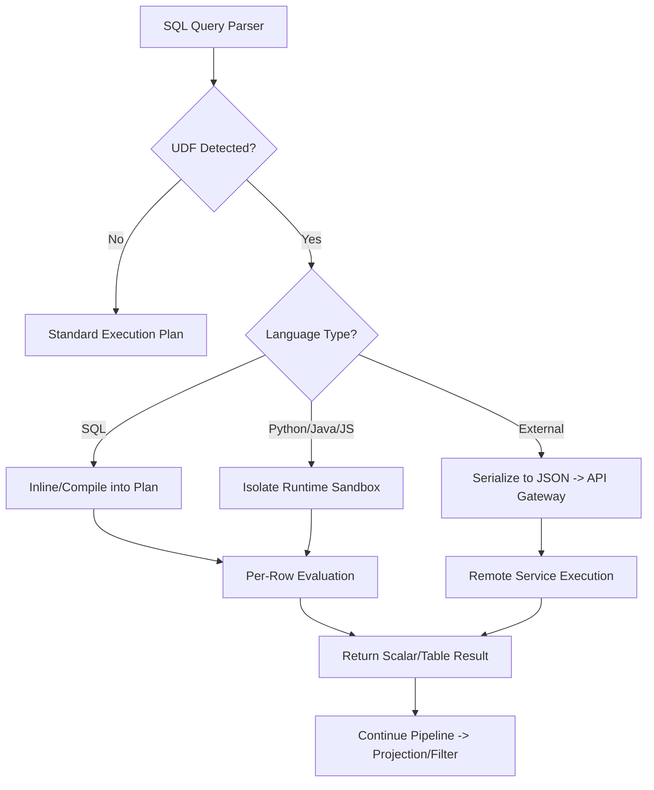

# 1. User-Defined Functions (UDFs) in Snowflake: Execution Model and Implementation Patterns
This document covers Snowflake's UDF architecture, language runtimes, execution behavior, and security boundaries for scalar and table-valued custom logic in simple to understand language.

# 2. Overview
User-Defined Functions extend Snowflake's native SQL engine with custom computation logic written in SQL, JavaScript, Java, Python, or Scala.  
- They exist to encapsulate reusable transformation rules, implement domain-specific calculations, or expose external services within standard `SELECT` statements. UDFs operate as stateless, row-scoped or batch-scoped operators within the query execution pipeline.  
- They do not modify persistent state, write to tables, or maintain context between invocations.  
- The feature targets engineers building reusable transformation libraries, analysts requiring custom calculations, and SnowPro Advanced candidates tested on volatility semantics, caching behavior, security contexts, and execution isolation boundaries.

# 3. SQL Object Summary

| Object/Feature | Type | Purpose | Source Objects/Inputs | Output/Behavior | Invocation |
|----------------|------|---------|----------------------|-----------------|------------|
| SQL UDF | Scalar Function | Inline reusable SQL logic | Column values, literals, expressions | Single scalar value per row | `SELECT udf_name(arg1, arg2)` |
| Scripting UDF (Python/Java/JS) | Scalar Function | Execute complex or library-dependent logic | Typed parameters, external packages | Single scalar value per row/batch | `SELECT py_udf(col)` |
| UDTF (Table-Returning) | Table Function | Return multiple rows per input | Input parameters, arrays, JSON | Variable row set per invocation | `SELECT * FROM TABLE(udtf_name(col))` |
| External Function | Remote Callout | Invoke HTTP/HTTPS endpoints | Row context serialized to JSON | Remote service response mapped to columns | `SELECT ext_udf(col)` |

# 4. Architecture
UDFs execute within Snowflake's query processing layer. SQL UDFs are inlined or compiled into the execution plan. Scripting UDFs run in isolated language runtimes (Python, Java, JavaScript) within the warehouse compute nodes. External functions route through a secure API gateway to remote services. All UDFs are stateless and evaluated per row or per batch, depending on the language handler signature.

# 5. Data Flow / Process Flow
1. **Compilation & Resolution**: Query compiler validates UDF signature, resolves data types, and checks volatility/security context.
2. **Parameter Binding**: Input values are bound per row. For `RETURNS NULL ON NULL INPUT`, null propagation short-circuits execution.
3. **Handler Invocation**: 
   - SQL UDFs: Logic evaluated inline.
   - Scripting UDFs: Batch of rows passed to runtime handler (vectorized or row-wise).
   - External UDFs: Rows serialized, batched, and sent over HTTPS.
4. **Result Return**: Handler returns typed values. UDTFs may return multiple rows per input.
5. **Pipeline Continuation**: Results feed into subsequent filters, joins, or aggregations. Result cache eligibility evaluated based on volatility flag.

Row count remains stable for scalar UDFs. UDTFs expand cardinality based on handler logic. State does not persist across micro-partitions or query executions.

# 6. Logical Breakdown

| Component | Responsibility | Inputs | Outputs | Dependencies | Failure Modes |
|-----------|----------------|--------|---------|--------------|---------------|
| Signature Resolver | Validates argument count, types, return type | Query AST, UDF metadata | Typed execution node | System catalog, privilege check | Type mismatch, missing function, privilege denial |
| Volatility Evaluator | Determines caching eligibility | `VOLATILE`, `IMMUTABLE`, `STABLE` flag | Cache enable/disable directive | Result cache subsystem | Unintended cache miss or stale result reuse |
| Language Runtime Sandbox | Executes non-SQL handlers | Input batch, package dependencies | Return values, exceptions | Python/Java/JS engine, memory/CPU limits | Timeout, OOM, package import failure |
| External Gateway Router | Manages HTTP callout lifecycle | Serialized JSON payload, API integration | Remote response, HTTP status | Network rules, secrets, rate limits | Connection timeout, auth failure, payload size limit |
| Null Propagation Controller | Handles null input strategy | `CALLED ON NULL INPUT` vs `RETURNS NULL ON NULL INPUT` | Short-circuit NULL or handler execution | Input column nullability | Unhandled null in handler causes runtime exception |

# 7. Data Model
UDFs do not produce persistent entities. They define a functional contract:
- **Input Grain**: 1:1 with source rows (scalar) or 1:N (UDTF)
- **Output Grain**: Matches input grain (scalar) or expands (UDTF)
- **State**: Strictly stateless. No cross-row or cross-query memory.
- **Null Handling**: Defaults to `RETURNS NULL ON NULL INPUT`. Null inputs bypass handler execution unless explicitly overridden.
- **Return Type Constraints**: Must map to valid Snowflake data types. JSON/ARRAY/OBJECT types supported. Structured return types require explicit casting or parsing.

# 8. Business Logic (Execution Logic)
- **Volatility Semantics**: 
  - `IMMUTABLE`: Returns same output for same inputs. Eligible for result caching and compile-time optimization.
  - `STABLE`: Returns same output for same inputs within a single statement. Not cacheable across queries.
  - `VOLATILE`: May return different outputs. Disables result caching. Default for UDFs reading system time or random values.
- **Security Context**: `SECURITY DEFINER` (default) executes with creator's privileges. `SECURITY INVOKER` executes with caller's privileges. Exam trap: `INVOKER` requires caller to hold privileges on all objects referenced inside the UDF.
- **Statelessness Constraint**: UDFs cannot write to tables, call stored procedures, or maintain session state. Persistent logic requires external services or Snowflake Streams/Tasks.
- **Execution Parallelism**: UDFs execute across all warehouse nodes and partitions. Resource consumption scales linearly with row count and handler complexity.
- **Exam Trap**: UDFs are not stored procedures. They cannot perform DDL/DML, manage transactions, or use `CALL` semantics. Misclassification is a frequent exam error.

# 9. Transformations

| Source Input | Target Output | Rule/Logic | Execution Meaning | Impact |
|--------------|---------------|------------|-------------------|--------|
| `VOLATILE` UDF in `SELECT` | Uncached scalar result | Volatility flag evaluated | Prevents result cache reuse | Increases warehouse compute, disables plan reuse |
| SQL UDF wrapping filter predicate | `WHERE udf(col) = value` | Function evaluation precedes filter | Prevents micro-partition pruning if `col` is clustering key | Forces full table scan; rewrite as native predicate |
| Python UDF with vectorized handler | Batch `pandas.Series` input/output | Row batching enabled | Reduces per-row overhead | Improves CPU efficiency, increases memory footprint per node |
| UDTF with `RETURNS TABLE` | Expanded row set | 1:N cardinality mapping | Enables lateral joins, array unpivoting | Increases intermediate result size; requires memory management |

# 10. Parameters / Variables / Configuration

| Name | Type | Purpose | Allowed Values/Format | Default | Where Used | Effect |
|------|------|---------|----------------------|---------|------------|--------|
| `VOLATILE` / `IMMUTABLE` / `STABLE` | Function Property | Control result caching eligibility | Keyword | `VOLATILE` (implicit for most non-deterministic) | `CREATE FUNCTION` | Determines cache behavior and optimizer assumptions |
| `RETURNS NULL ON NULL INPUT` | Function Property | Short-circuit on null arguments | Keyword | Default | `CREATE FUNCTION` | Skips handler execution if any input is NULL |
| `CALLED ON NULL INPUT` | Function Property | Pass nulls to handler | Keyword | Not default | `CREATE FUNCTION` | Requires explicit null handling inside logic |
| `SECURITY DEFINER` / `INVOKER` | Function Property | Define execution privilege context | Keyword | `DEFINER` | `CREATE FUNCTION` | Controls object access validation and data visibility |
| `RUNTIME_VERSION` | Python/Java Property | Lock language runtime | Semantic version (`'3.10'`, `'11'`) | Account default | `CREATE FUNCTION` | Ensures package compatibility and deterministic execution |
| `PACKAGES` | Python/Java Property | Import external libraries | Array of strings (`['numpy==1.24', 'pandas']`) | None | `CREATE FUNCTION` | Increases sandbox initialization time; must be allowlisted |
| `HANDLER` | Scripting Property | Specify entry point | Class.method or function name | N/A | `CREATE FUNCTION` | Maps Snowflake call to runtime code |

# 11. APIs / Interfaces
- **Management**: `CREATE [OR REPLACE] FUNCTION`, `ALTER FUNCTION`, `DROP FUNCTION`, `DESCRIBE FUNCTION`, `SHOW FUNCTIONS`
- **System Views**: `INFORMATION_SCHEMA.FUNCTIONS`, `ACCOUNT_USAGE.FUNCTIONS` (metadata, ownership, creation time)
- **Invocation**: Embedded in `SELECT`, `WHERE`, `JOIN`, `GROUP BY`, or `QUALIFY` clauses
- **Error Behavior**: Syntax errors caught at compile time. Runtime errors (timeout, OOM, type mismatch) abort query and log to `QUERY_HISTORY`. External function errors return HTTP status codes mapped to Snowflake error codes.

# 12. Execution / Deployment
- **Deployment**: Created via SQL DDL. Versioning handled via `OR REPLACE` or schema-scoped naming. No native rollback; requires manual recreation.
- **Execution Trigger**: Invoked per query. No scheduled or event-driven execution. Dependent on query compilation and warehouse availability.
- **Batch vs Row**: SQL and JavaScript UDFs execute row-by-row. Python and Java UDFs support batch processing when handler signature accepts `pandas.DataFrame` or `int[]` arrays.
- **Environment Consistency**: Deterministic behavior requires locked `RUNTIME_VERSION`, explicit `PACKAGES`, and absence of `VOLATILE` system calls (e.g., `CURRENT_TIMESTAMP()` inside UDF body).

# 13. Observability
- **Query History**: `QUERY_HISTORY` shows UDF execution time under `COMPILATION_TIME` and `EXECUTION_TIME`. Errors surface in `ERROR_CODE` and `ERROR_MESSAGE`.
- **Cache Hit Rate**: Monitor `RESULT_REUSED` column in `QUERY_HISTORY`. `VOLATILE` UDFs consistently show `FALSE`.
- **Resource Monitoring**: Warehouse metrics (`ACTIVE_RUN_STATEMENT_COUNT`, `AVG_RUNNING_PERCENTAGE`) spike for CPU-heavy UDFs. Python/Java sandboxes log initialization overhead.
- **External Function Telemetry**: API gateway logs track payload size, latency, and HTTP status. Network rule violations appear as `NETWORK_RULE_ACCESS_DENIED`.

# 14. Failure Handling & Recovery

| Failure Scenario | Symptom | Detection | Fallback | Recovery |
|------------------|---------|-----------|----------|----------|
| Runtime Timeout | Query aborts with `Execution timeout` | `QUERY_HISTORY` error message | Reduce row batch size, optimize logic | Increase warehouse size, refactor to vectorized handler, or add early-exit conditions |
| Memory Exhaustion (OOM) | `Handler ran out of memory` | `QUERY_HISTORY` error, warehouse memory metrics | Process smaller batches, avoid loading full datasets | Use incremental logic, reduce package size, or switch to SQL UDF |
| Null Input Unhandled | Unexpected NULL propagation or exception | Output validation, null count spike | Switch to `RETURNS NULL ON NULL INPUT` or add null checks | Update function definition, handle nulls explicitly in code |
| External HTTP Failure | `Network timeout` or `4xx/5xx` | `QUERY_HISTORY`, API gateway logs | Return default value via `COALESCE` | Implement retry logic in remote service, adjust timeout, or cache responses externally |
| Privilege Denial (`INVOKER`) | `Insufficient privileges` | Compile/runtime error | Switch to `DEFINER` if appropriate | Grant caller required object privileges or refactor to `DEFINER` with secure data access |

# 15. Security & Access Control
- **Execution Context**: `SECURITY DEFINER` isolates caller from underlying object privileges. `SECURITY INVOKER` enforces caller-level access validation.
- **Data Egress Control**: External functions require explicit `API_INTEGRATION` and `NETWORK_RULE` allowlists. Payloads are encrypted in transit.
- **Sandbox Isolation**: Python/Java/JS runtimes run in restricted environments. No filesystem access, no outbound HTTP except via external functions, no native OS calls.
- **Masking Policy Interaction**: Dynamic data masking evaluates before UDF invocation. Masked columns pass masked values to handlers, preventing raw data exposure.
- **Exam Note**: `SECURITY INVOKER` UDFs referencing tables require the querying role to hold `SELECT` on those tables. `DEFINER` UDFs use the creator's role.

# 16. Performance / Scalability Considerations
- **Row vs Batch Overhead**: Row-wise execution incurs interpreter overhead per row. Vectorized Python/Java handlers process batches, reducing overhead by 5-10x but increasing memory pressure.
- **Result Caching**: `VOLATILE` or non-deterministic UDFs disable result cache. Repeated executions consume full compute. Mark deterministic UDFs as `IMMUTABLE`.
- **Pruning Bypass**: Wrapping a clustering key in a UDF within `WHERE` prevents micro-partition pruning. Rewrite as `WHERE col = value` and apply UDF in projection.
- **Warehouse Scaling**: CPU-bound UDFs benefit from multi-cluster warehouses. Memory-bound UDFs require larger node sizes (`LARGE+`) to accommodate sandbox overhead.
- **External Function Latency**: Network round-trip and serialization costs dominate. Batch size limits (default ~16KB per row, configurable) and rate limits throttle throughput.

# 17. Assumptions & Constraints
- UDFs are strictly stateless. Cross-row state requires external storage or session variables passed explicitly.
- `VOLATILE` is the implicit default for most non-SQL UDFs unless explicitly declared `IMMUTABLE` or `STABLE`.
- Snowflake does not guarantee execution order. UDFs must not rely on row sequence or side effects.
- Python/Java package dependencies are isolated per UDF. Conflicting versions across UDFs require separate function definitions or virtual environment packaging.
- External functions cannot access Snowflake internal metadata or system variables directly. All context must be passed as parameters.
- SnowPro Advanced trap: Candidates often confuse UDFs with Stored Procedures. UDFs return values inline; Stored Procedures execute control flow and can perform DML/DDL.

# 18. Future Enhancements
- Introduce native vectorized execution for JavaScript and SQL UDFs to reduce interpreter overhead.
- Add compile-time static analysis for volatility classification to auto-tag `IMMUTABLE` candidates.
- Implement UDF-specific memory quotas and graceful degradation instead of hard OOM failures.
- Extend external function error context to include retry hints and payload diagnostics in `QUERY_HISTORY`.
- Support declarative dependency resolution for Python packages via managed environment manifests, reducing sandbox initialization latency.
