# 1. User-Defined Table Functions (UDTFs) in Snowflake: Architecture and Execution Patterns
Documentation of Snowflake UDTF mechanics, partitioned execution, cardinality expansion behavior, and integration with lateral query pipelines.

# 2. Overview
User-Defined Table Functions extend Snowflake's SQL engine by returning a multi-row, multi-column result set per invocation. They exist to transform single input rows into structured tabular outputs, enabling array unpivoting, JSON flattening, delimited string splitting, and time-series generation without external staging. UDTFs execute as parallel, stateless (or partition-local stateful) operators within the query execution plan, integrated via implicit lateral joins. The feature targets data engineers building reusable transformation pipelines, analysts requiring set-returning logic, and SnowPro Advanced candidates tested on invocation syntax, partition optimization, cardinality management, and execution boundaries.

# 3. SQL Object Summary

| Object/Feature | Type | Purpose | Source Objects/Inputs | Output/Behavior | Invocation |
|----------------|------|---------|----------------------|-----------------|------------|
| SQL UDTF | Table-Returning Function | Inline multi-row generation from input | Column values, literals | Variable rows per input row | `SELECT * FROM TABLE(udtf_name(col))` |
| Scripting UDTF (Python/Java) | Table-Returning Function | Complex parsing, library-dependent expansion | Typed parameters, batched partitions | Tabular result set with defined schema | `SELECT * FROM TABLE(py_udtf(col))` |
| External UDTF | Remote Table Function | Call external APIs for row expansion | Serialized row context | Remote response mapped to columns | `SELECT * FROM TABLE(ext_udtf(col))` |
| `FLATTEN()` | System Table Function | Native array/object unpivoting | VARIANT, ARRAY, OBJECT columns | Rows per array element | `SELECT * FROM TABLE(FLATTEN(col))` |

# 4. Architecture
UDTFs are compiled into the query execution plan as lateral operators. The query optimizer assigns input rows to warehouse compute nodes. When `PARTITION BY` is defined, rows are grouped by partition key before handler invocation. The handler processes each partition independently, emitting rows that are appended to the lateral output stream. No cross-partition state is shared unless explicitly managed via external storage.

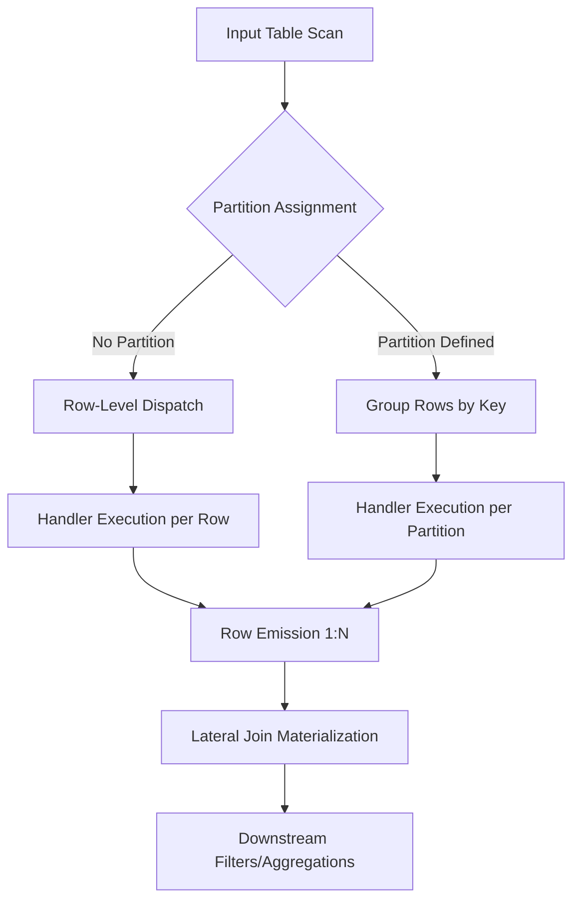
```mermaid
flowchart TD
    A[Input Table Scan] --> B{Partition Assignment}
    B -->|No Partition| C[Row-Level Dispatch]
    B -->|Partition Defined| D[Group Rows by Key]
    C --> E[Handler Execution per Row]
    D --> F[Handler Execution per Partition]
    E --> G[Row Emission 1:N]
    F --> G
    G --> H[Lateral Join Materialization]
    H --> I[Downstream Filters/Aggregations]
```

# 5. Data Flow / Process Flow
1. **Input Resolution**: Query parser binds input columns/literals to UDTF signature.
2. **Partition Routing**: If `PARTITION BY` exists, Snowflake hashes or distributes rows by partition key to minimize network shuffle.
3. **Handler Invocation**: 
   - SQL UDTFs: Evaluated inline per row.
   - Scripting UDTFs: Batched `pandas.DataFrame` or row array passed to handler. Partition boundaries align with batch boundaries.
   - External UDTFs: Rows serialized and sent via API gateway in configurable batch sizes.
4. **Row Emission**: Handler yields typed rows matching `RETURNS TABLE(...)` schema. Row count scales multiplicatively.
5. **Lateral Materialization**: Emitted rows are appended to the base query stream. Filters, joins, and aggregations execute post-expansion.
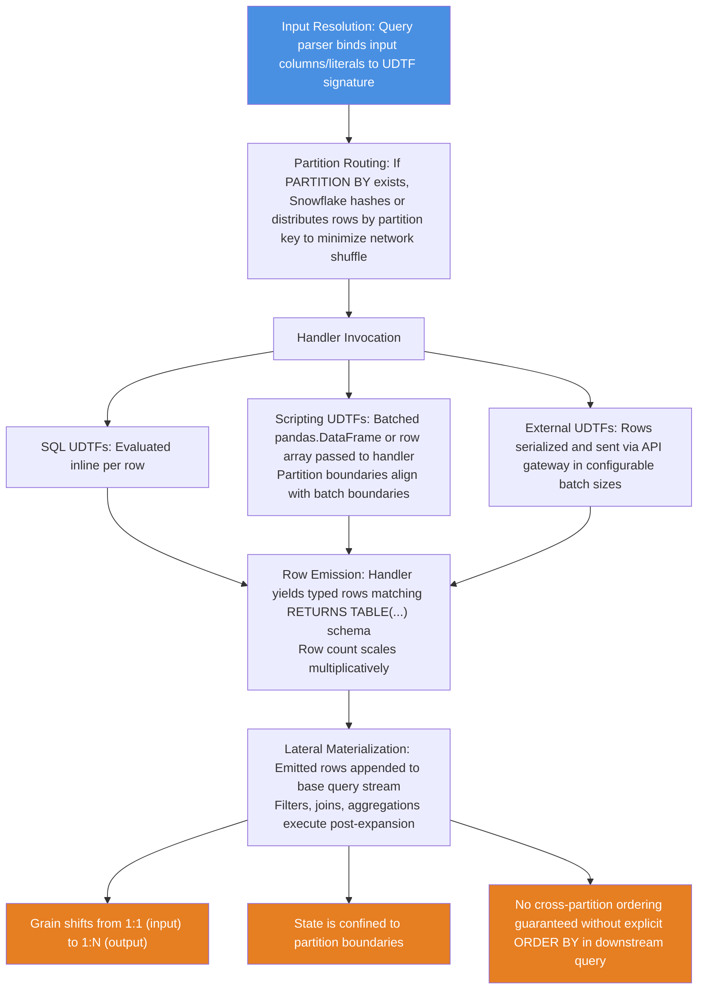
```mermaid
flowchart TD
    A["Input Resolution: Query parser binds input columns/literals to UDTF signature"]
    A --> B["Partition Routing: If PARTITION BY exists, Snowflake hashes or distributes rows by partition key to minimize network shuffle"]

    B --> C["Handler Invocation"]

    C --> D["SQL UDTFs: Evaluated inline per row"]
    C --> E["Scripting UDTFs: Batched pandas.DataFrame or row array passed to handler\nPartition boundaries align with batch boundaries"]
    C --> F["External UDTFs: Rows serialized and sent via API gateway in configurable batch sizes"]

    D --> G["Row Emission: Handler yields typed rows matching RETURNS TABLE(...) schema\nRow count scales multiplicatively"]
    E --> G
    F --> G

    G --> H["Lateral Materialization: Emitted rows appended to base query stream\nFilters, joins, aggregations execute post-expansion"]

    H --> I["Grain shifts from 1:1 (input) to 1:N (output)"]
    H --> J["State is confined to partition boundaries"]
    H --> K["No cross-partition ordering guaranteed without explicit ORDER BY in downstream query"]

    style A fill:#4a90e2,color:#fff
    style I fill:#e67e22,color:#fff
    style J fill:#e67e22,color:#fff
    style K fill:#e67e22,color:#fff
```

Grain shifts from 1:1 (input) to 1:N (output). State is confined to partition boundaries. No cross-partition ordering is guaranteed without explicit `ORDER BY` in downstream query.

# 6. Logical Breakdown

| Component | Responsibility | Inputs | Outputs | Dependencies | Failure Modes |
|-----------|----------------|--------|---------|--------------|---------------|
| Schema Validator | Enforces `RETURNS TABLE` contract | Handler output types, column count | Typed projection node | Function metadata catalog | Type mismatch, missing columns, nullability violation |
| Partition Router | Groups input rows for stateful processing | `PARTITION BY` keys, input rows | Partition-bounded batches | Hash distribution algorithm | Partition skew, memory exhaustion on hot partitions |
| Batch Dispatcher | Serializes and routes batches to runtimes | Partition groups, memory limits | Handler invocation context | Python/Java engine, network rules | OOM, timeout, serialization failure |
| Lateral Join Resolver | Appends UDTF output to base query stream | Emitted rows, base table row context | Expanded result set | Query optimizer, join executor | Implicit cross-join if misapplied, cardinality explosion |
| Null Propagation Controller | Handles null input strategy | Input nulls, `RETURNS NULL ON NULL INPUT` flag | Short-circuit or handler pass-through | Input nullability metadata | Unhandled nulls in handler, unexpected empty output |

# 7. Data Model
UDTFs define a transient, query-scoped output schema. They do not persist data.
- **Input Grain**: 1 row per base table record
- **Output Grain**: N rows per input record (cardinality determined by handler logic)
- **Schema Contract**: Explicitly defined via `RETURNS TABLE(col1 type1, col2 type2, ...)`
- **Null Handling**: Defaults to `RETURNS NULL ON NULL INPUT`. Null inputs yield zero output rows unless overridden.
- **Key Behavior**: Output rows inherit implicit lateral join context. Base table columns are available in output scope but repeat per emitted row.

# 8. Business Logic (Execution Logic)
- **Partitioning Semantics**: `PARTITION BY` enables partition-local state. Handlers receive all rows for a partition in a single invocation, allowing running totals, deduplication, or sliding window calculations within the partition.
- **Lateral Join Binding**: UDTFs implicitly execute as `LATERAL` joins. Base row context is available to the handler. Misuse (e.g., omitting base row correlation) can produce implicit cross-joins if the UDTF ignores input parameters.
- **Determinism & Caching**: UDTFs are `VOLATILE` by default. Result caching is disabled. Mark `IMMUTABLE` only if output strictly depends on inputs and contains no system calls or randomness.
- **Exam-Relevant Defaults**: UDTFs require `TABLE()` wrapper. Omission causes compilation error. `RETURNS TABLE` schema must match handler output exactly. UDTFs cannot perform DML/DDL or maintain session state.
- **Cardinality Risk**: Output row count is unbounded. Aggregations or joins downstream must account for multiplicative expansion to avoid memory spill or timeout.

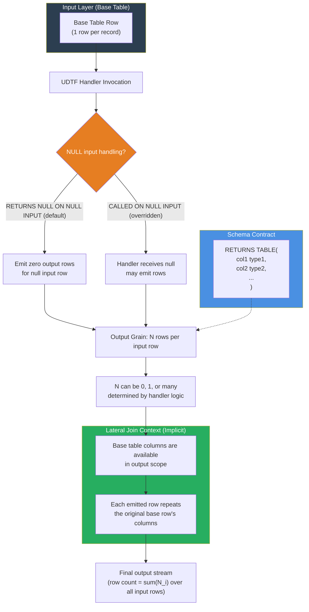
```mermaid
flowchart TD
    subgraph InputLayer["Input Layer (Base Table)"]
        A["Base Table Row\n(1 row per record)"]
    end

    A --> B["UDTF Handler Invocation"]

    subgraph SchemaContract["Schema Contract"]
        C["RETURNS TABLE(\n  col1 type1,\n  col2 type2,\n  ...\n)"]
    end

    B --> D{"NULL input handling?"}
    D -->|"RETURNS NULL ON NULL INPUT (default)"| E["Emit zero output rows\nfor null input row"]
    D -->|"CALLED ON NULL INPUT (overridden)"| F["Handler receives null\nmay emit rows"]

    E --> G["Output Grain: N rows per input row"]
    F --> G

    C -.-> G

    G --> H["N can be 0, 1, or many\ndetermined by handler logic"]

    subgraph LateralContext["Lateral Join Context (Implicit)"]
        I["Base table columns are available\nin output scope"]
        J["Each emitted row repeats\nthe original base row's columns"]
    end

    H --> I
    I --> J

    J --> K["Final output stream\n(row count = sum(N_i) over all input rows)"]

    style InputLayer fill:#2c3e50,color:#fff
    style SchemaContract fill:#4a90e2,color:#fff
    style LateralContext fill:#27ae60,color:#fff
    style D fill:#e67e22,color:#fff
```
# 9. Transformations

| Source Input | Target Output | Rule/Logic | Execution Meaning | Impact |
|--------------|---------------|------------|-------------------|--------|
| JSON array in `VARIANT` | 1 row per array element | Array iteration, type casting, null filtering | Unpivots nested structure into tabular format | Enables relational querying; increases row count linearly with array size |
| Delimited string | Multiple typed columns | String split, regex extraction, validation | Parses flat string into structured attributes | Replaces `SPLIT_TO_TABLE`; allows custom validation logic |
| Date range parameters | Sequential date rows | Loop/generate logic, boundary enforcement | Produces calendar or timeline series | Eliminates CTE recursion; constant memory if partitioned |
| Partitioned transaction log | Deduplicated or windowed state | Sort by timestamp, apply `ROW_NUMBER()` logic, yield valid rows | Maintains state within partition boundary | Reduces downstream `QUALIFY` complexity; requires partition alignment |

# 10. Parameters / Variables / Configuration

| Name | Type | Purpose | Allowed Values/Format | Default | Where Used | Effect |
|------|------|---------|----------------------|---------|------------|--------|
| `RETURNS TABLE(...)` | Function Clause | Define output schema | Column names + Snowflake types | N/A | `CREATE FUNCTION` | Enforces type contract; mismatch aborts query |
| `PARTITION BY` | Function Clause | Group rows before handler invocation | Column list or expression | None | `CREATE FUNCTION` | Enables partition-local state; reduces network shuffle |
| `ORDER BY` (in handler) | Handler Signature | Guarantee row sequence within partition | Handler-defined sort | None | Python/Java handler code | Enables deterministic stateful processing; requires partition alignment |
| `VOLATILE` / `IMMUTABLE` | Function Property | Control caching eligibility | Keyword | `VOLATILE` | `CREATE FUNCTION` | Determines result reuse; `IMMUTABLE` enables optimization |
| `LANGUAGE` | Function Property | Specify runtime engine | `SQL`, `PYTHON`, `JAVA`, `JAVASCRIPT` | `SQL` | `CREATE FUNCTION` | Determines sandbox, batch mode, and memory limits |
| `HANDLER` | Scripting Property | Map entry point | `Class.method` or `function_name` | N/A | `CREATE FUNCTION` | Routes Snowflake invocation to runtime code |

# 11. APIs / Interfaces
- **Management**: `CREATE [OR REPLACE] FUNCTION ... RETURNS TABLE(...)`, `ALTER FUNCTION`, `DROP FUNCTION`, `SHOW FUNCTIONS`
- **System Views**: `INFORMATION_SCHEMA.FUNCTIONS`, `ACCOUNT_USAGE.FUNCTIONS` (metadata, volatility, language)
- **Invocation**: `SELECT * FROM TABLE(udtf_name(arg1, arg2))` required. Cannot be used in scalar context.
- **Error Behavior**: Schema mismatches, partition skew, and handler exceptions surface in `QUERY_HISTORY`. Compilation errors occur at parse time.

# 12. Execution / Deployment
- **Execution Mode**: Parallel across warehouse nodes. Partitions distributed via consistent hashing.
- **Batch Processing**: Python/Java handlers receive batched inputs per partition. Row-wise execution for SQL/JS.
- **Deployment**: Created via SQL DDL. Versioning via `OR REPLACE` or schema scoping. No native rollback.
- **Orchestration**: Invoked inline within queries. No scheduled execution. Dependent on warehouse availability and query compilation.
- **Environment Consistency**: Deterministic output requires locked `RUNTIME_VERSION`, explicit `PACKAGES`, and absence of volatile system calls.

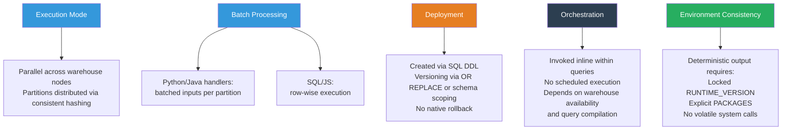
```mermaid
flowchart TD
    A["Execution Mode"] --> B["Parallel across warehouse nodes\nPartitions distributed via consistent hashing"]

    C["Batch Processing"] --> D["Python/Java handlers:\nbatched inputs per partition"]
    C --> E["SQL/JS:\nrow-wise execution"]

    F["Deployment"] --> G["Created via SQL DDL\nVersioning via OR REPLACE or schema scoping\nNo native rollback"]

    H["Orchestration"] --> I["Invoked inline within queries\nNo scheduled execution\nDepends on warehouse availability\nand query compilation"]

    J["Environment Consistency"] --> K["Deterministic output requires:\nLocked RUNTIME_VERSION\nExplicit PACKAGES\nNo volatile system calls"]

    style A fill:#3498db,color:#fff
    style C fill:#3498db,color:#fff
    style F fill:#e67e22,color:#fff
    style H fill:#2c3e50,color:#fff
    style J fill:#27ae60,color:#fff
```
# 13. Observability
- **Query History**: `QUERY_HISTORY` tracks execution time, bytes spilled, and error codes. UDTF expansion visible in row count differential between input and output.
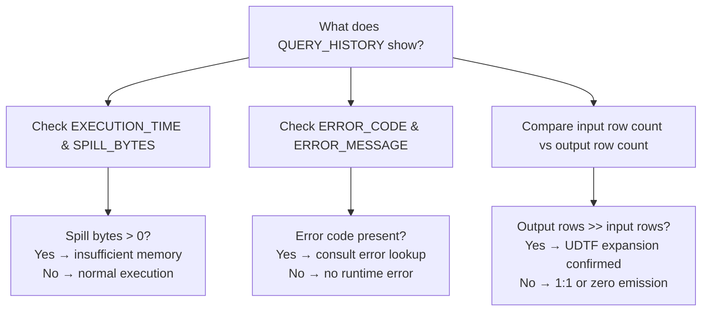
```mermaid
flowchart TD
    Q1["What does QUERY_HISTORY show?"]

    Q1 --> R1["Check EXECUTION_TIME & SPILL_BYTES"]
    Q1 --> R2["Check ERROR_CODE & ERROR_MESSAGE"]
    Q1 --> R3["Compare input row count vs output row count"]

    R1 --> A1["Spill bytes > 0?\nYes → insufficient memory\nNo → normal execution"]
    R2 --> A2["Error code present?\nYes → consult error lookup\nNo → no runtime error"]
    R3 --> A3["Output rows >> input rows?\nYes → UDTF expansion confirmed\nNo → 1:1 or zero emission"]
```
- **Partition Skew Detection**: Monitor `MAX_PARTITION_SIZE` vs `AVG_PARTITION_SIZE` in warehouse metrics. High skew indicates hot partition keys.
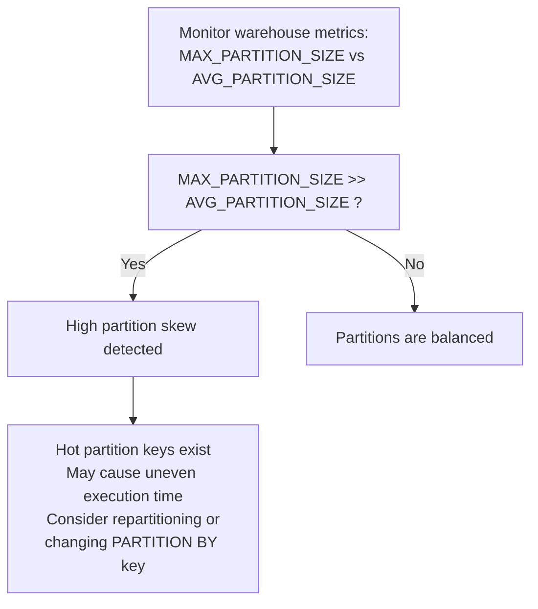
```mermaid
flowchart TD
    Q2["Monitor warehouse metrics:\nMAX_PARTITION_SIZE vs AVG_PARTITION_SIZE"]

    Q2 --> C1["MAX_PARTITION_SIZE >> AVG_PARTITION_SIZE ?"]
    C1 -->|Yes| D1["High partition skew detected"]
    C1 -->|No| D2["Partitions are balanced"]

    D1 --> E1["Hot partition keys exist\nMay cause uneven execution time\nConsider repartitioning or\nchanging PARTITION BY key"]
```
- **Memory/CPU Pressure**: UDTF handlers consume sandbox memory. `QUERY_HISTORY` `SPILL_BYTES` and `EXECUTION_TIME` spikes indicate OOM or timeout risk.
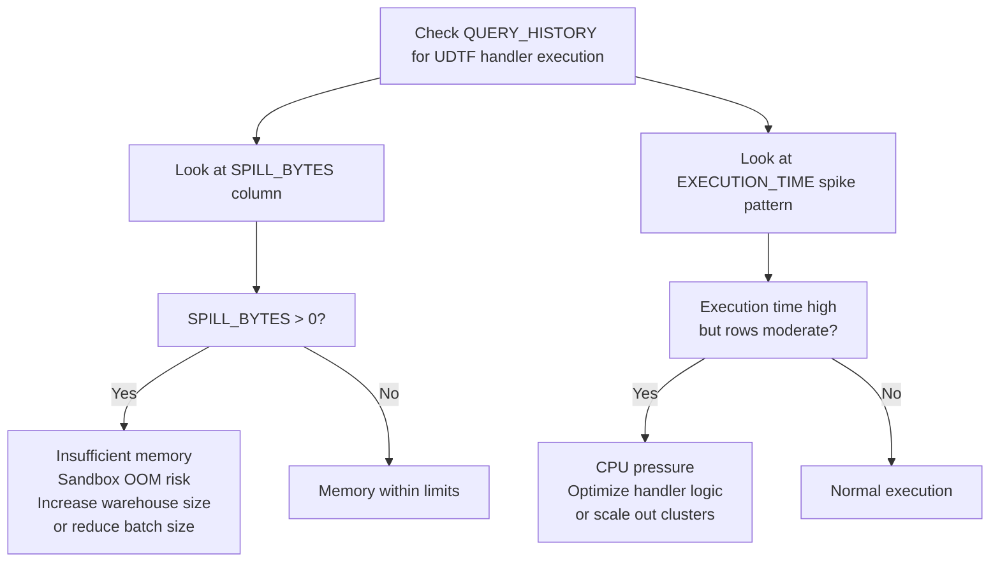
```mermaid
flowchart TD
    Q3["Check QUERY_HISTORY for UDTF handler execution"]

    Q3 --> M1["Look at SPILL_BYTES column"]
    Q3 --> M2["Look at EXECUTION_TIME spike pattern"]

    M1 --> N1["SPILL_BYTES > 0?"]
    N1 -->|Yes| O1["Insufficient memory\nSandbox OOM risk\nIncrease warehouse size\nor reduce batch size"]
    N1 -->|No| O2["Memory within limits"]

    M2 --> P1["Execution time high\nbut rows moderate?"]
    P1 -->|Yes| P2["CPU pressure\nOptimize handler logic\nor scale out clusters"]
    P1 -->|No| P3["Normal execution"]
```
- **Cache Monitoring**: `RESULT_REUSED` flag remains `FALSE` for `VOLATILE` UDTFs. Explicit `IMMUTABLE` tagging enables cache eligibility.
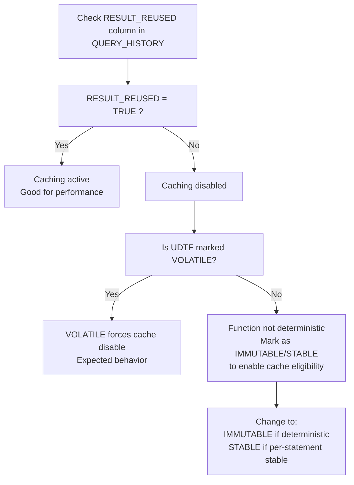
```mermaid
flowchart TD
    Q4["Check RESULT_REUSED column in QUERY_HISTORY"]

    Q4 --> T1["RESULT_REUSED = TRUE ?"]
    T1 -->|Yes| U1["Caching active\nGood for performance"]
    T1 -->|No| U2["Caching disabled"]

    U2 --> V1["Is UDTF marked VOLATILE?"]
    V1 -->|Yes| W1["VOLATILE forces cache disable\nExpected behavior"]
    V1 -->|No| W2["Function not deterministic\nMark as IMMUTABLE/STABLE\nto enable cache eligibility"]

    W2 --> X1["Change to:\nIMMUTABLE if deterministic\nSTABLE if per-statement stable"]
```
# 14. Failure Handling & Recovery

| Failure Scenario | Symptom | Detection | Fallback | Recovery |
|------------------|---------|-----------|----------|----------|
| Cardinality Explosion | Query timeout, memory spill | Output row count exceeds expectation | Filter base table before UDTF call | Implement early-exit logic in handler, enforce partition size limits |
| Partition Skew | Hot node, timeout, OOM | Warehouse metrics show skewed load | Remove `PARTITION BY` if unnecessary | Redefine partition key for uniform distribution, add bucketing logic |
| Schema Mismatch | `Invalid return type` error | `QUERY_HISTORY` error message | Align `RETURNS TABLE` with handler output | Update function definition or refactor handler to match contract |
| Null Input Unhandled | Zero output rows for valid base record | Downstream left join nulls | Switch to `CALLED ON NULL INPUT` or add null checks | Modify function definition, handle nulls explicitly in handler |
| External API Throttling | `HTTP 429` or timeout | `QUERY_HISTORY`, API gateway logs | Return empty set via `COALESCE` | Implement backoff, reduce batch size, or cache responses externally |

# 15. Security & Access Control
- **Execution Context**: `SECURITY DEFINER` (default) uses creator privileges. `SECURITY INVOKER` validates caller privileges against all referenced objects.
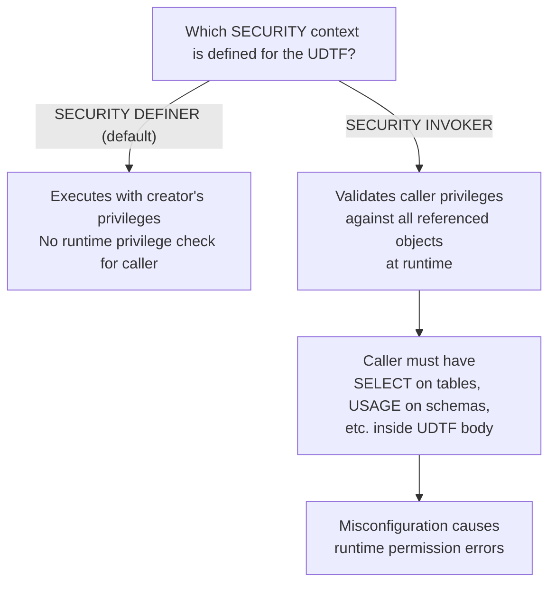
```mermaid
flowchart TD
    Q1["Which SECURITY context is defined for the UDTF?"]

    Q1 -->|"SECURITY DEFINER (default)"| A1["Executes with creator's privileges\nNo runtime privilege check for caller"]
    Q1 -->|"SECURITY INVOKER"| A2["Validates caller privileges\nagainst all referenced objects\nat runtime"]

    A2 --> B1["Caller must have\nSELECT on tables, USAGE on schemas,\netc. inside UDTF body"]
    B1 --> C1["Misconfiguration causes\nruntime permission errors"]
```
- **Data Masking**: Dynamic data masking evaluates before UDTF invocation. Masked values pass to handler, preserving compliance boundaries.
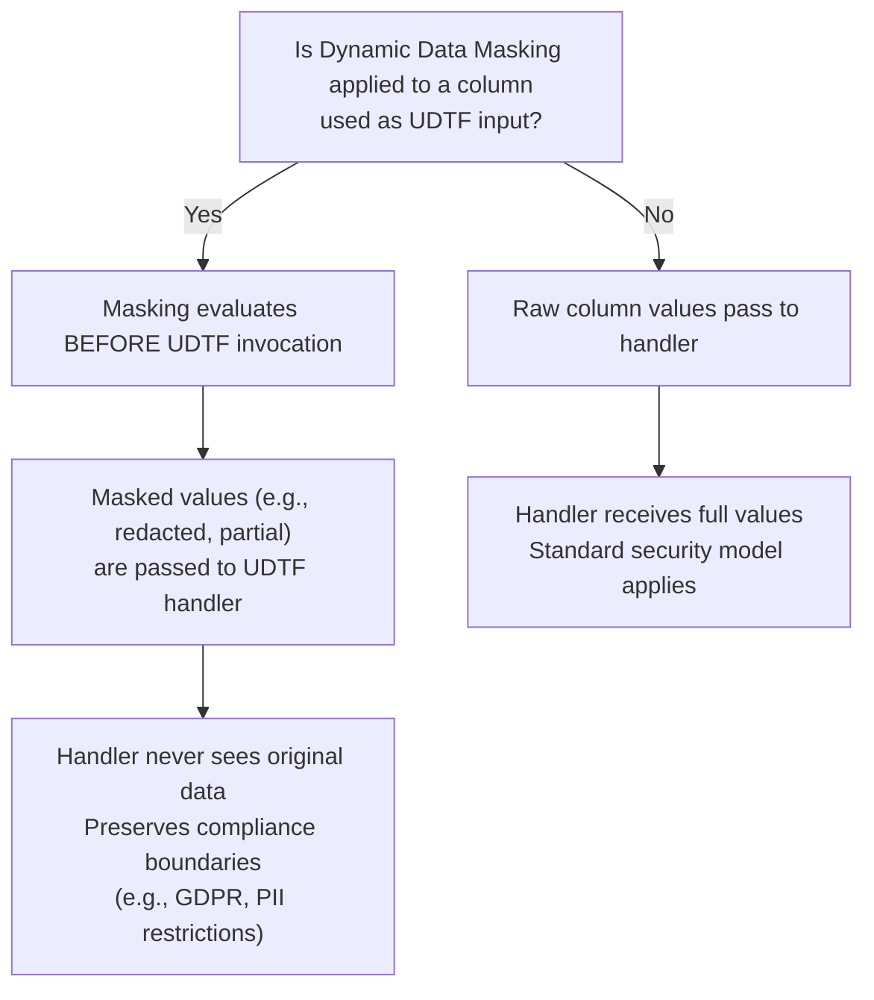
```mermaid
flowchart TD
    Q2["Is Dynamic Data Masking applied to a column\nused as UDTF input?"]

    Q2 -->|Yes| D1["Masking evaluates BEFORE UDTF invocation"]
    Q2 -->|No| D2["Raw column values pass to handler"]

    D1 --> E1["Masked values (e.g., redacted, partial)\nare passed to UDTF handler"]
    E1 --> F1["Handler never sees original data\nPreserves compliance boundaries\n(e.g., GDPR, PII restrictions)"]
    D2 --> F2["Handler receives full values\nStandard security model applies"]
```
- **Network Rules**: External UDTFs require `API_INTEGRATION` and `NETWORK_RULE` allowlists. Outbound traffic restricted to approved endpoints.
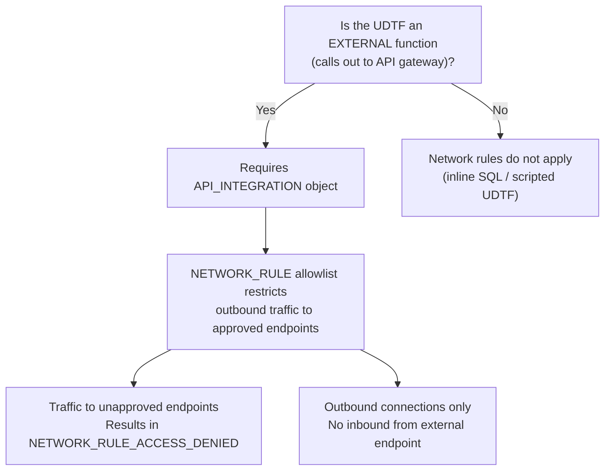
```mermaid
flowchart TD
    Q3["Is the UDTF an EXTERNAL function\n(calls out to API gateway)?"]

    Q3 -->|Yes| G1["Requires API_INTEGRATION object"]
    Q3 -->|No| G2["Network rules do not apply\n(inline SQL / scripted UDTF)"]

    G1 --> H1["NETWORK_RULE allowlist restricts\noutbound traffic to approved endpoints"]
    H1 --> I1["Traffic to unapproved endpoints\nResults in NETWORK_RULE_ACCESS_DENIED"]
    H1 --> J1["Outbound connections only\nNo inbound from external endpoint"]
```
- **Sandbox Isolation**: Python/Java runtimes operate in restricted environments. No filesystem, no native OS calls, no persistent state.
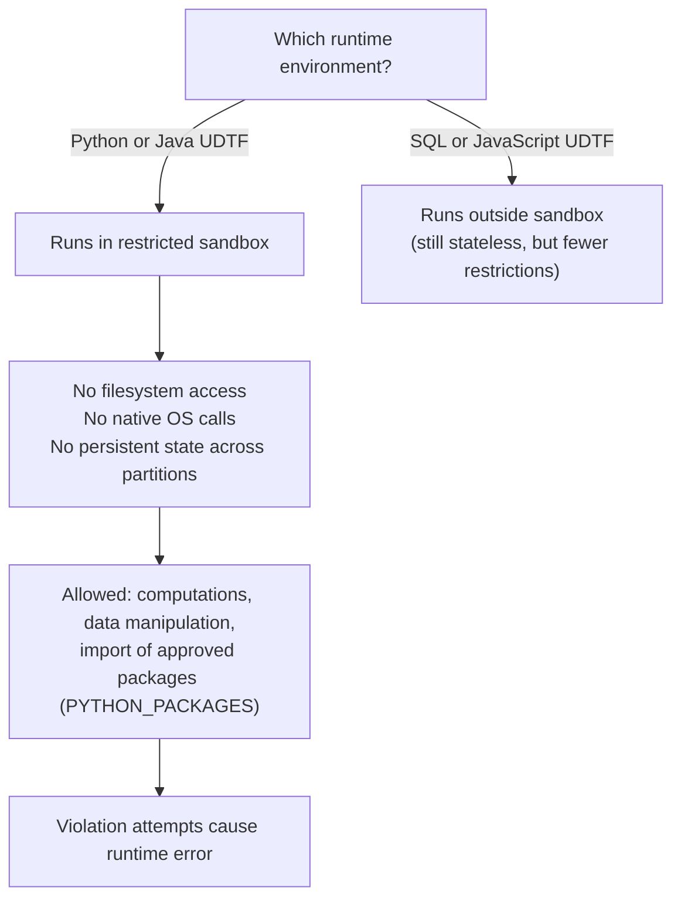
```mermaid
flowchart TD
    Q4["Which runtime environment?"]

    Q4 -->|"Python or Java UDTF"| K1["Runs in restricted sandbox"]
    Q4 -->|"SQL or JavaScript UDTF"| K2["Runs outside sandbox\n(still stateless, but fewer restrictions)"]

    K1 --> L1["No filesystem access\nNo native OS calls\nNo persistent state across partitions"]
    L1 --> M1["Allowed: computations, data manipulation,\nimport of approved packages (PYTHON_PACKAGES)"]
    M1 --> N1["Violation attempts cause runtime error"]
```
- **Exam Note**: `SECURITY INVOKER` requires the querying role to hold privileges on all objects referenced inside the UDTF. Misconfiguration causes runtime permission errors.
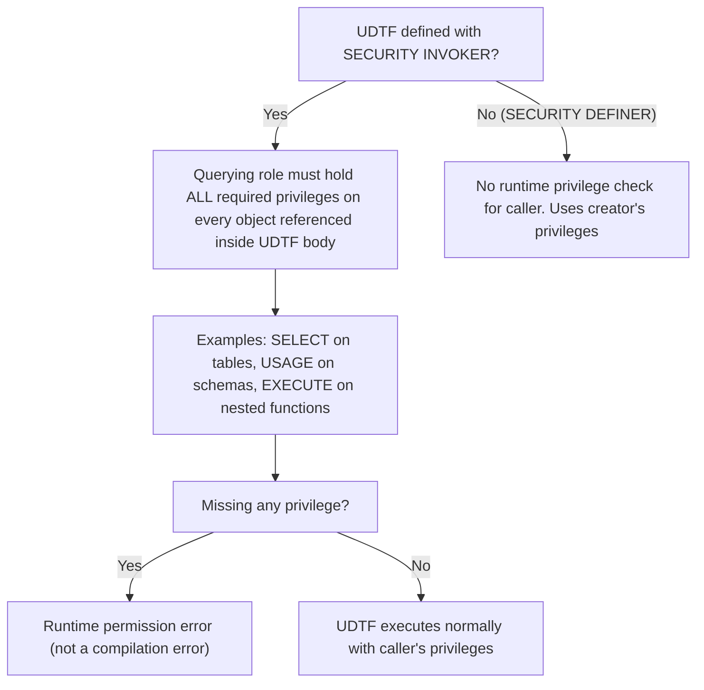
```mermaid
flowchart TD
    Q5["UDTF defined with SECURITY INVOKER?"]

    Q5 -->|"Yes"| O1["Querying role must hold ALL required privileges on every object referenced inside UDTF body"]
    O1 --> P1["Examples: SELECT on tables, USAGE on schemas, EXECUTE on nested functions"]
    P1 --> Q6["Missing any privilege?"]
    Q6 -->|"Yes"| R1["Runtime permission error (not a compilation error)"]
    Q6 -->|"No"| S1["UDTF executes normally with caller's privileges"]

    Q5 -->|"No (SECURITY DEFINER)"| T1["No runtime privilege check for caller. Uses creator's privileges"]
```

# 16. Performance / Scalability Considerations
- **Lateral Join Overhead**: UDTFs execute after base table filtering. Push predicates to the base table before UDTF invocation to reduce input row count.
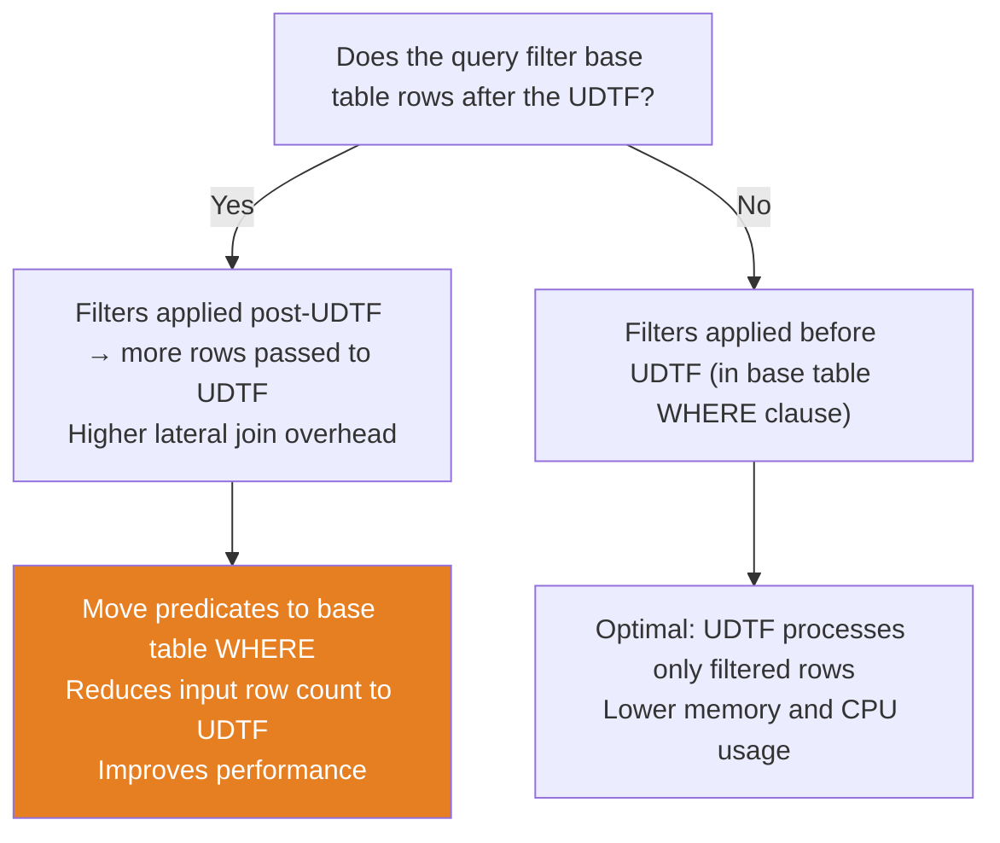
```mermaid
flowchart TD
    Q1["Does the query filter base table rows after the UDTF?"]

    Q1 -->|Yes| A1["Filters applied post-UDTF → more rows passed to UDTF\nHigher lateral join overhead"]
    Q1 -->|No| B1["Filters applied before UDTF (in base table WHERE clause)"]

    A1 --> C1["Move predicates to base table WHERE\nReduces input row count to UDTF\nImproves performance"]
    B1 --> D1["Optimal: UDTF processes only filtered rows\nLower memory and CPU usage"]

    style C1 fill:#e67e22,color:#fff
```
- **Partition Optimization**: `PARTITION BY` reduces network shuffle but increases memory pressure per node. Balance partition cardinality with handler complexity.
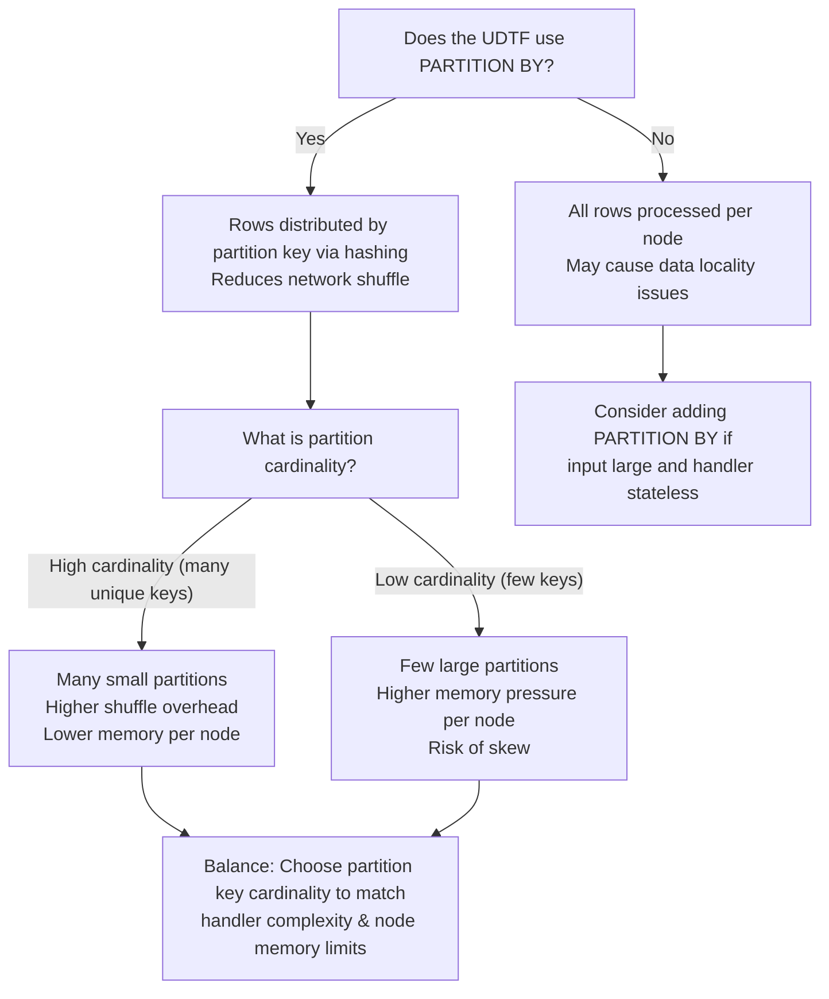
```mermaid
flowchart TD
    Q2["Does the UDTF use PARTITION BY?"]

    Q2 -->|Yes| A2["Rows distributed by partition key via hashing\nReduces network shuffle"]
    Q2 -->|No| B2["All rows processed per node\nMay cause data locality issues"]

    A2 --> C2["What is partition cardinality?"]
    C2 -->|"High cardinality (many unique keys)"| D2["Many small partitions\nHigher shuffle overhead\nLower memory per node"]
    C2 -->|"Low cardinality (few keys)"| E2["Few large partitions\nHigher memory pressure per node\nRisk of skew"]

    D2 --> F2["Balance: Choose partition key cardinality to match\nhandler complexity & node memory limits"]
    E2 --> F2
    B2 --> G2["Consider adding PARTITION BY if\ninput large and handler stateless"]
```
- **Result Caching**: `VOLATILE` disables caching. Mark deterministic UDTFs as `IMMUTABLE` to enable result reuse and reduce compute.
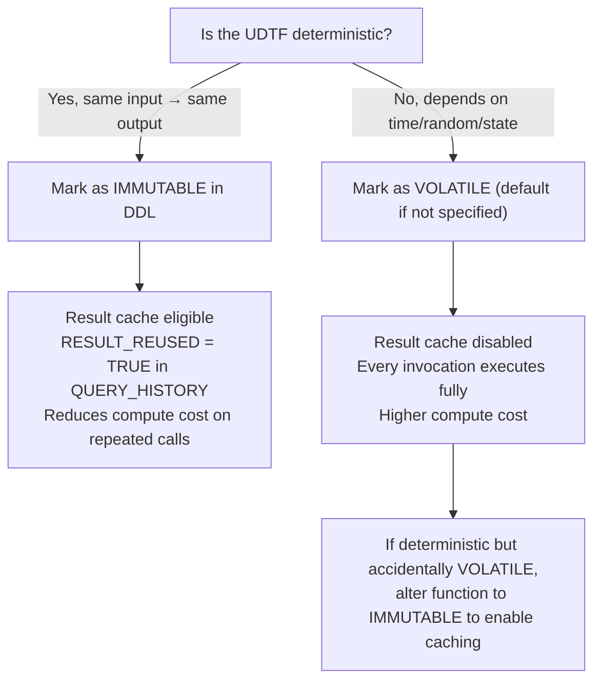
```mermaid
flowchart TD
    Q3["Is the UDTF deterministic?"]

    Q3 -->|"Yes, same input → same output"| A3["Mark as IMMUTABLE in DDL"]
    Q3 -->|"No, depends on time/random/state"| B3["Mark as VOLATILE (default if not specified)"]

    A3 --> C3["Result cache eligible\nRESULT_REUSED = TRUE in QUERY_HISTORY\nReduces compute cost on repeated calls"]
    B3 --> D3["Result cache disabled\nEvery invocation executes fully\nHigher compute cost"]

    D3 --> E3["If deterministic but accidentally VOLATILE,\nalter function to IMMUTABLE to enable caching"]
```
- **Warehouse Scaling**: CPU-bound UDTFs scale with multi-cluster warehouses. Memory-bound UDTFs require larger node sizes to accommodate batch processing.
- **Pruning Interaction**: UDTFs in `WHERE` clauses prevent micro-partition pruning. Move filtering logic to the base query or post-UDTF stage.
- **Exam Trap**: Candidates assume UDTFs improve join performance. UDTFs expand cardinality and shift cost to compute. Use only when native functions (`FLATTEN`, `SPLIT_TO_TABLE`) are insufficient.

# 17. Assumptions & Constraints
- UDTFs require `TABLE()` invocation syntax. Omission causes compilation failure.
- `PARTITION BY` guarantees row grouping within a single handler invocation. Cross-partition state requires external storage or session variables passed explicitly.
- Output schema must match `RETURNS TABLE` exactly. Implicit type coercion is not applied.
- Snowflake does not enforce execution order across partitions. Parallel execution is guaranteed; deterministic ordering requires downstream `ORDER BY`.
- Python/Java UDTFs operate in sandboxed runtimes. External package dependencies must be explicitly listed and version-locked.
- SnowPro Advanced trap: UDTFs are not scalar functions. They cannot be used in `SELECT col, udtf()` without `TABLE()` wrapper. They expand row count and disable certain optimizations.

# 18. Future Enhancements
- Introduce native vectorized UDTF execution for SQL and JavaScript to reduce interpreter overhead per partition.
- Add compile-time cardinality estimation to flag unbounded expansion patterns before query execution.
- Implement partition-aware memory quotas with graceful degradation instead of hard OOM termination.
- Extend `EXPLAIN` output to show UDTF expansion ratios and partition distribution statistics pre-execution.
- Support declarative state sharing across partitions via managed context tables for distributed window calculations.
