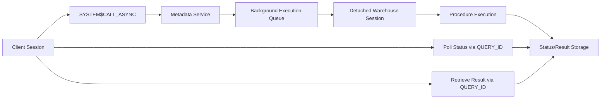

# 1. Asynchronous Stored Procedure Execution in Snowflake
Documentation of Snowflake's asynchronous stored procedure invocation pattern, background execution lifecycle, status polling mechanics, and result retrieval architecture.

# 2. Overview
Asynchronous stored procedure execution enables long-running data transformation, orchestration, or administrative logic to run in the background without blocking the client session. It exists to decouple pipeline initiation from completion, allowing clients to submit work, poll for status, and retrieve results independently. The feature targets data engineers building non-blocking ETL/ELT workflows, orchestration frameworks requiring fire-and-forget execution, and SnowPro Advanced candidates tested on async lifecycle management, session isolation boundaries, and result retrieval semantics. Execution occurs on a specified or inherited warehouse, inherits caller role at invocation time, and operates in a detached session context.

# 3. SQL Object Summary

| Object/Feature | Type | Purpose | Source Objects/Inputs | Output/Behavior | Invocation |
|----------------|------|---------|----------------------|-----------------|------------|
| `SYSTEM$CALL_ASYNC` | System Function | Initiate background SP execution | Procedure call string, optional warehouse name | `QUERY_ID` (VARCHAR) | `SELECT SYSTEM$CALL_ASYNC('CALL proc_name(args)', 'WH_NAME')` |
| `SYSTEM$GET_ASYNC_QUERY_STATUS` | System Function | Poll execution state and error metadata | `QUERY_ID` | JSON object with status, timestamps, error details | `SELECT SYSTEM$GET_ASYNC_QUERY_STATUS('query_id')` |
| `SYSTEM$GET_ASYNC_QUERY_RESULT` | System Function | Retrieve SP return data | `QUERY_ID` | Tabular result set or JSON array matching SP return type | `SELECT * FROM TABLE(SYSTEM$GET_ASYNC_QUERY_RESULT('query_id'))` |

# 4. Architecture
Async execution decouples invocation from runtime. The client session submits a call request, which the metadata service queues for background execution. A detached compute session runs the procedure on the target warehouse. Status and result metadata are persisted in Snowflake's query tracking subsystem. The client polls for completion using the returned `QUERY_ID`.

# 5. Data Flow / Process Flow
1. **Invocation**: Client executes `SYSTEM$CALL_ASYNC` with procedure call string and optional warehouse. System validates privileges, captures role/session context, and queues execution.
2. **Session Detachment**: Metadata returns `QUERY_ID` immediately. Client session is unblocked. Background session initializes with captured role, warehouse, and account-level parameters.
3. **Background Execution**: Procedure runs on target warehouse. Session variables from caller are NOT inherited. Temporary objects created by caller are invisible.
4. **State Persistence**: Execution state (`QUEUED`, `RUNNING`, `COMPLETED`, `FAILED`) and timestamps are written to query tracking metadata. Errors are captured, not raised in caller session.
5. **Polling & Retrieval**: Client calls status function repeatedly. Upon `COMPLETED`, result function is invoked to fetch return data. Results expire according to standard query result cache retention.

Row count and grain are determined by the procedure's internal logic. Async execution does not alter base tables unless explicitly coded in the procedure.

# 6. Logical Breakdown

| Component | Responsibility | Inputs | Outputs | Dependencies | Failure Modes |
|-----------|----------------|--------|---------|--------------|---------------|
| Call Dispatcher | Validate syntax, capture context, queue execution | Procedure call string, warehouse name, caller role | `QUERY_ID`, queue entry | Role privileges, warehouse availability | Invalid call syntax, missing warehouse, privilege denial |
| Background Executor | Run procedure in detached session | Captured role, warehouse, procedure definition | Execution logs, return value, error state | Compute resources, SP logic | Timeout, OOM, unhandled exception, external service failure |
| Status Tracker | Maintain execution state lifecycle | Query metadata, executor signals | JSON status object with state, timestamps | Query history subsystem | Metadata delay, status function timeout |
| Result Retriever | Fetch and serialize SP output | `QUERY_ID`, result cache reference | Tabular or JSON result set | Result retention policy, cache state | Expired cache, failed execution (no result), schema mismatch |
| Context Isolator | Enforce session boundary rules | Caller session state, background session init | Clean execution environment | Session management service | Unexpected session variable leakage, temp table access errors |

# 7. Data Model (State Model)
Async execution produces transient metadata and optional result sets.
- **Grain**: 1:1 per `QUERY_ID`. Each async call maps to a single background execution.
- **States**: `QUEUED` → `RUNNING` → `COMPLETED` or `FAILED`. Terminal states are immutable.
- **Result Schema**: Matches the procedure's `RETURNS` clause. If procedure returns no value, result set is empty.
- **Null/Empty Handling**: Failed executions return status JSON with error fields. Result retrieval on failed state returns empty or error-raising behavior depending on function implementation.
- **Persistence**: Status metadata persists per account query retention policy. Results expire based on result cache retention (default 24 hours for successful queries).

# 8. Business Logic (Execution Logic)
- **Invocation Rule**: `SYSTEM$CALL_ASYNC` accepts a valid `CALL` statement as a string. Warehouse name is optional; defaults to caller's current warehouse at invocation time.
- **Session Isolation**: Background session inherits role and account/session parameters. It does NOT inherit runtime session variables, temporary tables, or transaction state. Exam trap: Candidates assume `SET` variables or `TEMPORARY` tables from caller are visible in async execution. They are not.
- **Error Containment**: Runtime errors are captured in status metadata. They do not propagate to the calling session. Polling is required to detect failures.
- **Result Lifecycle**: Results are stored in the result cache subsystem. They must be retrieved before expiration. Repeated retrieval is allowed within the retention window.
- **Exam-Relevant Defaults**: Async execution does not support interactive I/O or `RESULTSET` streaming. Procedures must be fully self-contained. `SYSTEM$CALL_ASYNC` returns immediately regardless of procedure runtime. Status polling requires explicit loop or task orchestration.

# 9. Transformations

| Source Input | Target Output | Rule/Logic | Execution Meaning | Impact |
|--------------|---------------|------------|-------------------|--------|
| Procedure call string | Background execution context | String parsing, privilege validation, warehouse routing | Decouples invocation from runtime | Client unblocked; execution queued |
| Execution state changes | Status JSON | State machine transitions with timestamps | Enables polling logic | Requires client-side loop or external scheduler |
| Procedure return value | Cached result set | Serialization into result cache format | Preserves output for later retrieval | Dependent on cache retention; must fetch explicitly |
| Runtime exception | Error metadata in status | Exception capture, stack trace truncation | Prevents caller session failure | Shifts error handling to post-execution polling |

# 10. Parameters / Variables / Configuration

| Name | Type | Purpose | Allowed Values/Format | Default | Where Used | Effect |
|------|------|---------|----------------------|---------|------------|--------|
| `SYSTEM$CALL_ASYNC` | System Function | Initiate async execution | `CALL proc_name(args)` string, optional warehouse name | Caller's current warehouse | Client SQL | Returns `QUERY_ID`, queues background run |
| `SYSTEM$GET_ASYNC_QUERY_STATUS` | System Function | Poll execution state | `QUERY_ID` (VARCHAR) | N/A | Client/Orchestrator SQL | Returns JSON with status, error, timestamps |
| `SYSTEM$GET_ASYNC_QUERY_RESULT` | System Function | Retrieve output | `QUERY_ID` (VARCHAR) | N/A | Client/Orchestrator SQL | Returns result set; fails if expired or not completed |
| `RESULT_CACHE_EXPIRATION` | Account Parameter | Control result retention | Interval (hours) | 24 hours (configurable) | Account settings | Determines window for async result retrieval |
| `WAREHOUSE` | Execution Context | Target compute resource | Warehouse name | Caller's current session warehouse | `SYSTEM$CALL_ASYNC` argument | Routes background execution; overrides session default |

# 11. APIs / Interfaces
- **Invocation**: `SELECT SYSTEM$CALL_ASYNC('<call_statement>', '<warehouse>')`
- **Status Polling**: `SELECT SYSTEM$GET_ASYNC_QUERY_STATUS('<query_id>')` returns JSON
- **Result Retrieval**: `SELECT * FROM TABLE(SYSTEM$GET_ASYNC_QUERY_RESULT('<query_id>'))`
- **Error Behavior**: Invalid `QUERY_ID` or expired result raises runtime error. Failed execution status must be checked before result retrieval.
- **Consumers**: Orchestration tools (Airflow, dbt), custom scripts, Snowflake Tasks with polling loops, BI data refresh wrappers.

# 12. Execution / Deployment
- **Execution Mode**: Background, detached session. Non-blocking to client.
- **Batch/Incremental**: Determined by procedure logic. Async wrapper does not alter internal data flow.
- **Orchestration**: Requires explicit polling loop, external scheduler, or Snowflake Task chain to monitor status and trigger downstream steps.
- **Environment Consistency**: Behavior is deterministic across environments provided role privileges, warehouse availability, and account parameters align.
- **Runtime Assumptions**: Target warehouse must be active or auto-suspend/auto-resume enabled. Suspended warehouses delay `QUEUED` → `RUNNING` transition.

# 13. Observability
- **Query History**: `QUERY_HISTORY` tracks async background execution under separate `QUERY_ID`. Caller session shows only `SYSTEM$CALL_ASYNC` invocation.
- **Status Tracking**: Poll status function at intervals (e.g., 5-15 seconds). Avoid sub-second polling to prevent metadata service throttling.
- **Result Validation**: Verify `status = 'COMPLETED'` before calling result function. Check `error_code` and `error_message` in status JSON for failures.
- **Cost Attribution**: Background execution compute costs attributed to target warehouse. Caller session incurs minimal cost for invocation and polling.
- **Monitoring Pattern**: Log `QUERY_ID` immediately. Track status transitions. Archive results before cache expiration.

# 14. Failure Handling & Recovery

| Failure Scenario | Symptom | Detection | Fallback | Recovery |
|------------------|---------|-----------|----------|----------|
| Warehouse Suspended/Unavailable | Status remains `QUEUED` indefinitely | Status polling shows no state transition | Resume warehouse or specify alternate | Execute `ALTER WAREHOUSE RESUME`, or re-invoke with active warehouse |
| Procedure Runtime Error | Status transitions to `FAILED` | `SYSTEM$GET_ASYNC_QUERY_STATUS` returns error JSON | Log error, skip result retrieval | Fix procedure logic, handle exceptions internally, or re-invoke with corrected inputs |
| Result Cache Expiration | `GET_ASYNC_QUERY_RESULT` raises error | Status shows `COMPLETED` but result retrieval fails | Redesign pipeline to fetch results immediately | Increase `RESULT_CACHE_EXPIRATION`, or persist results to table within procedure |
| Invalid `QUERY_ID` | Status/result functions raise syntax/lookup error | Immediate function error | Validate `QUERY_ID` format, ensure correct capture | Store `QUERY_ID` in persistent table upon `CALL_ASYNC` return |
| Polling Throttling/Timeout | Metadata service delays or client timeout | High latency in status function response | Implement exponential backoff, reduce poll frequency | Align polling interval to procedure expected runtime; use event-driven architecture if available |

# 15. Security & Access Control
- **Privilege Validation**: Caller must hold `USAGE` on target warehouse and `EXECUTE` on the stored procedure. Privileges are evaluated at `CALL_ASYNC` time.
- **Role Inheritance**: Background session executes with caller's role. No privilege escalation occurs. If caller lacks `SELECT` on objects referenced in procedure, execution fails.
- **Data Isolation**: Background session cannot access caller's temporary objects or session-specific variables. Row access policies and masking policies evaluate normally within the async context.
- **Exam Note**: Async execution does not bypass security boundaries. All object access is validated against the inherited role. Failed privilege checks are captured in status metadata, not caller session.

# 16. Performance / Scalability Considerations
- **Non-Blocking Client**: Eliminates connection timeout risk for long-running procedures. Shifts latency to polling overhead.
- **Warehouse Routing**: Background execution consumes target warehouse compute. Multi-cluster warehouses distribute load; single warehouses may queue concurrent async calls.
- **Polling Efficiency**: Frequent polling increases metadata service load and client compute. Recommended interval: 5-30 seconds based on expected procedure duration.
- **Result Cache Limits**: Large result sets consume cache storage and may exceed serialization limits. Persist critical results to permanent tables within the procedure instead of relying on async result retrieval.
- **Exam Trap**: Candidates assume async execution improves procedure runtime. It does not. It only decouples client blocking from execution duration. Compute cost and runtime remain unchanged.

# 17. Assumptions & Constraints
- Async execution requires explicit polling or external orchestration. No native event/callback mechanism is provided.
- Background session inherits role and account parameters. It does NOT inherit `SET` variables, `TEMPORARY` tables, or transaction context.
- Result retrieval is bound by result cache retention. Default is 24 hours; configurable at account level.
- Procedures executed asynchronously must be fully self-contained. Interactive prompts, result streaming, or external session-dependent logic will fail.
- `SYSTEM$CALL_ASYNC` validates syntax and privileges immediately. Runtime errors occur only in background execution and must be retrieved via status function.
- SnowPro Advanced trap: Async execution does not guarantee execution order if multiple procedures are submitted. Queue ordering depends on warehouse availability and system load.

# 18. Future Enhancements
- Introduce native event-driven completion notifications (e.g., Snowpipe-style webhooks or notification integrations) to eliminate polling overhead.
- Add `RESULT_TABLE` clause to persist async procedure output directly to a named table, bypassing result cache expiration limits.
- Implement queue priority controls to route critical async executions to dedicated compute clusters or override standard scheduling.
- Extend status JSON to include execution metrics (rows processed, bytes scanned, compute credits) for pipeline telemetry without additional query history joins.
- Support structured error classification in status metadata to enable automated retry routing based on error type (transient vs permanent).
