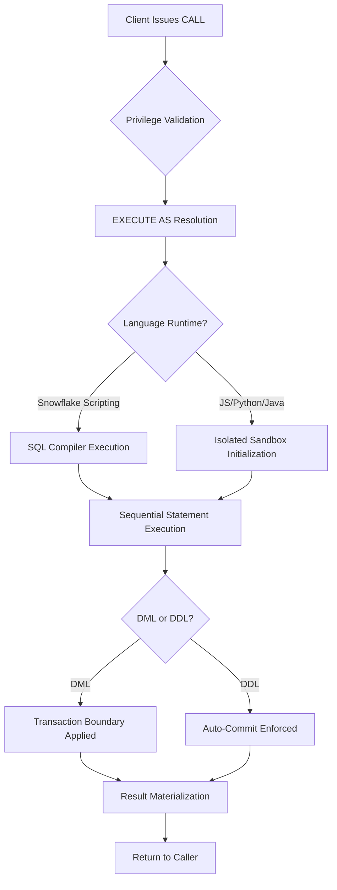

# 1. Stored Procedures in Snowflake: Procedural Execution and Control Flow
Documentation of Snowflake stored procedure architecture, language runtime isolation, privilege execution models, transaction boundaries, and invocation mechanics for governed data workflows.

# 2. Overview
Stored procedures encapsulate multi-step procedural logic, control flow, and data modification routines within Snowflake. They support JavaScript, Python, Java, Scala, and Snowflake Scripting (SQL-based). They exist to orchestrate ETL/ELT pipelines, enforce complex data validation, manage DDL/DML transactions, and replace external scripting for governed data operations. Unlike UDFs, stored procedures can perform stateful operations, execute DDL, control transaction boundaries, and return complex result sets or scalar values. The feature targets data engineers building transformation orchestration, analytics developers implementing business logic, and SnowPro Advanced candidates tested on execution context, privilege boundaries, transaction semantics, and language runtime constraints.

# 3. SQL Object Summary

| Object/Feature | Type | Purpose | Source Objects/Inputs | Output/Behavior | Invocation |
|----------------|------|---------|----------------------|-----------------|------------|
| Standard Stored Procedure | Server-Side Routine | Execute procedural logic, DML/DDL, control flow | Parameters, session context, target warehouse | Scalar value, table, or `RESULTSET` | `CALL proc_name(args)` |
| Snowflake Scripting Procedure | SQL-Native Routine | Inline procedural execution without external runtime | SQL statements, variables, cursors | Scalar, table, or `RESULTSET` | `CALL proc_name(args)` |
| Language Sandbox Handler | Runtime Environment | Execute JavaScript/Python/Java/Scala logic | Serialized inputs, package dependencies | Typed return value or error | Managed by Snowflake execution engine |

# 4. Architecture
Stored procedures execute within Snowflake's query processing layer but route to isolated runtime environments based on the declared language. Snowflake Scripting executes natively within the SQL compiler. JavaScript, Python, Java, and Scala procedures run in restricted sandboxes with memory, CPU, and network boundaries. Privilege evaluation occurs at invocation time based on `EXECUTE AS` context. Transaction management follows Snowflake's standard DML rules with DDL auto-commit behavior.

# 5. Data Flow / Process Flow
1. **Invocation & Parsing**: Compiler validates `CALL` syntax, resolves procedure metadata, and checks `EXECUTE` privilege.
2. **Context Binding**: Session role, warehouse, and account parameters are captured. `EXECUTE AS` determines privilege scope for subsequent statements.
3. **Runtime Initialization**: 
   - Scripting: Execution plan compiled inline.
   - External Languages: Sandbox allocated, packages loaded, memory limits enforced.
4. **Procedural Execution**: Statements execute sequentially. Control flow (`IF`, `FOR`, `WHILE`, `TRY/CATCH`) directs logic. DML applies to target tables.
5. **Transaction Management**: DML follows standard transaction rules (explicit `BEGIN`/`COMMIT` in Scripting, auto-commit otherwise). DDL auto-commits immediately, breaking outer transaction scope.
6. **Result Return**: Scalar, tabular, or `RESULTSET` output serialized and returned. `CALL` cannot be embedded in `SELECT`. Execution completes; sandbox/resources released.

Grain: 1:1 per invocation. State does not persist across calls unless explicitly written to permanent/temporary tables.

# 6. Logical Breakdown

| Component | Responsibility | Inputs | Outputs | Dependencies | Failure Modes |
|-----------|----------------|--------|---------|--------------|---------------|
| Privilege Context Resolver | Enforce `EXECUTE AS CALLER/OWNER` | Caller role, procedure owner role, object grants | Validated execution context | RBAC subsystem | `INSUFFICIENT_PRIVILEGES` at runtime or compile time |
| Language Runtime Manager | Allocate sandbox, load dependencies, enforce limits | Procedure code, `PACKAGES`, `RUNTIME_VERSION` | Initialized execution environment | Compute nodes, memory/CPU quotas | OOM, timeout, package import failure |
| Transaction Controller | Manage DML boundaries, handle DDL auto-commit | DML/DDL statements, explicit transaction blocks | Committed/rolled back state, transaction logs | Storage layer, write-ahead log | DDL breaks explicit transaction, unhandled exception triggers rollback |
| Control Flow Evaluator | Execute conditional/iterative logic | Boolean expressions, loop counters, cursor state | Branch/iteration direction | Parser, execution engine | Infinite loop timeout, cursor exhaustion |
| Result Serializer | Format return value for client consumption | Scalar, table, or `RESULTSET` | Typed output payload | Client driver, result cache | Large `RESULTSET` exceeds memory, unclosed cursor leaks |

# 7. Data Model (State Model)
Stored procedures do not define persistent entities. They manage transient execution state and transactional boundaries.
- **Execution Grain**: 1:1 per `CALL`. Each invocation is independent.
- **Variable Scope**: Local to procedure execution. Session variables accessible via `CURRENT_SESSION()` or explicit parameter passing.
- **Cursor/RESULTSET Lifecycle**: Must be explicitly consumed or closed. Unclosed cursors release resources at procedure termination but may impact intermediate memory.
- **Transaction Scope**: DML supports explicit transaction blocks in Snowflake Scripting. DDL auto-commits immediately, invalidating active transactions. External language procedures default to auto-commit per statement unless explicit transaction APIs are used.
- **Null Handling**: Inherits standard SQL null propagation. Procedures must explicitly handle null parameters or use `CALLED ON NULL INPUT` / `RETURNS NULL ON NULL INPUT`.

# 8. Business Logic (Execution Logic)
- **Privilege Execution Model**: `EXECUTE AS CALLER` (default) validates object access using the caller's role at each statement execution. `EXECUTE AS OWNER` uses the procedure creator's role, enabling controlled privilege elevation. Exam trap: Candidates often assume `OWNER` grants blanket access; it only covers objects the creator already possesses.
- **Control Flow & Error Handling**: `TRY...CATCH` blocks capture runtime exceptions. Unhandled exceptions trigger automatic rollback of uncommitted DML within the procedure. `SQLCODE`/`SQLERRM` (Scripting) or language-native exceptions provide diagnostic context.
- **DDL vs DML Transaction Behavior**: DDL statements (`CREATE`, `ALTER`, `DROP`) auto-commit immediately. They cannot be wrapped in `BEGIN...ROLLBACK`. Mixing DDL and DML in a single transaction requires careful sequencing or acceptance of partial commit states.
- **Invocation Constraint**: Stored procedures cannot be called within `SELECT`, `WHERE`, or `JOIN` clauses. They must be invoked via standalone `CALL` statement or assigned to a variable via `CALL ... INTO`.
- **Exam-Relevant Defaults**: `EXECUTE AS CALLER` is default. `LANGUAGE` defaults to `SQL` for Scripting or specified external language. DDL auto-commit breaks transaction atomicity. `RESULTSET` must be consumed or closed explicitly in external languages.

# 9. Transformations

| Source Input | Target Output | Rule/Logic | Execution Meaning | Impact |
|--------------|---------------|------------|-------------------|--------|
| Parameter assignment | Local variable state | Type coercion, null validation | Initializes execution context | Ensures deterministic logic flow; prevents runtime type errors |
| DML statement execution | Table row modification | `INSERT`, `UPDATE`, `DELETE`, `MERGE` within transaction | Applies business logic to persistent storage | Counts as row operations; consumes write credits; subject to locking |
| Cursor iteration | Row-by-row processing | `FETCH`, `WHILE`, or loop constructs | Enables procedural row transformation | High CPU overhead; prefer set-based operations or bulk `INSERT`/`MERGE` |
| Exception capture | Graceful degradation or logging | `TRY...CATCH`, error variable assignment | Prevents pipeline abort on recoverable errors | Enables idempotent retry, audit trail population |

# 10. Parameters / Variables / Configuration

| Name | Type | Purpose | Allowed Values/Format | Default | Where Used | Effect |
|------|------|---------|----------------------|---------|------------|--------|
| `EXECUTE AS CALLER` / `OWNER` | Procedure Property | Define privilege evaluation context | Keyword | `CALLER` | `CREATE PROCEDURE` | Controls object access validation and security boundary |
| `LANGUAGE` | Procedure Property | Specify execution runtime | `SQL`, `JAVASCRIPT`, `PYTHON`, `JAVA`, `SCALA` | `SQL` | `CREATE PROCEDURE` | Determines sandbox allocation, syntax rules, package support |
| `PACKAGES` | Python/Java Property | Import external libraries | Array of versioned strings | None | `CREATE PROCEDURE` | Increases initialization time; must be allowlisted |
| `RUNTIME_VERSION` | Python/Java Property | Lock language engine version | Semantic version (`'3.10'`, `'11'`) | Account default | `CREATE PROCEDURE` | Ensures deterministic execution and package compatibility |
| `CALLED ON NULL INPUT` | Procedure Property | Pass nulls to handler | Keyword | `RETURNS NULL ON NULL INPUT` | `CREATE PROCEDURE` | Requires explicit null handling inside logic |
| `RETURNS` | Procedure Clause | Define output type | `TABLE(...)`, `RESULTSET`, scalar type, or `VOID` | `VOID` | `CREATE PROCEDURE` | Enforces contract with caller; affects serialization |

# 11. APIs / Interfaces
- **Management**: `CREATE PROCEDURE`, `ALTER PROCEDURE`, `DROP PROCEDURE`, `DESCRIBE PROCEDURE`, `SHOW PROCEDURES`
- **Invocation**: `CALL proc_name(args)`, `CALL proc_name(args) INTO var_name`
- **System Views**: `INFORMATION_SCHEMA.PROCEDURES`, `ACCOUNT_USAGE.PROCEDURES` (metadata, owner, creation timestamp, language)
- **Execution Context**: `CURRENT_ROLE()`, `CURRENT_WAREHOUSE()`, `SYSTEM$CURRENT_TRANSACTION()` available within procedure scope
- **Error Behavior**: Compilation errors at creation time. Runtime errors captured in `QUERY_HISTORY` with `ERROR_CODE`/`ERROR_MESSAGE`. Unhandled exceptions abort procedure and rollback uncommitted DML.

# 12. Execution / Deployment
- **Execution Mode**: Synchronous by default. Client session blocks until procedure completes or times out.
- **Orchestration**: Invoked via `CALL`, scheduled via Snowflake Tasks, or triggered by external orchestrators (Airflow, dbt, custom scripts).
- **Deployment**: Version controlled via `CREATE OR REPLACE PROCEDURE`. No native rollback; requires recreation or schema-scoped versioning.
- **Environment Consistency**: Deterministic behavior requires locked `RUNTIME_VERSION`, explicit `PACKAGES`, and consistent `EXECUTE AS` context. Warehouse sizing affects concurrent procedure throughput.

# 13. Observability
- **Query History**: `QUERY_HISTORY` tracks `CALL` invocation. Internal DML/DDL statements appear as child queries linked via `QUERY_ID`.
- **Execution Logging**: `TRY...CATCH` blocks should explicitly log errors to audit tables. Snowflake does not auto-log procedural debug output.
- **Cost Attribution**: Compute costs attributed to target warehouse. DML operations consume write credits; DDL operations consume DDL credits.
- **State Validation**: Monitor `ROWS_INSERTED`, `ROWS_UPDATED`, `ROWS_DELETED` in `QUERY_HISTORY` to verify procedure impact. Track transaction rollback frequency for stability metrics.

# 14. Failure Handling & Recovery

| Failure Scenario | Symptom | Detection | Fallback | Recovery |
|------------------|---------|-----------|----------|----------|
| Unhandled Runtime Exception | Procedure aborts, uncommitted DML rolled back | `QUERY_HISTORY` error, client error response | Return partial success indicator or error code to caller | Implement `TRY...CATCH`, log failure, design idempotent retry logic |
| DDL Auto-Commit Breaks Transaction | Mixed DML/DDL leaves partial state | Audit table mismatch, inconsistent row counts | Separate DDL and DML into distinct procedures | Reorder execution, isolate schema changes, or use feature flags |
| Privilege Gap (`EXECUTE AS CALLER`) | `INSUFFICIENT_PRIVILEGES` during execution | Runtime error in `QUERY_HISTORY` | Grant caller required object privileges | Switch to `EXECUTE AS OWNER` if security policy permits, or adjust role grants |
| Warehouse Timeout/Resource Exhaustion | `Execution timeout` or `Out of memory` | `QUERY_HISTORY` error, warehouse metrics | Increase timeout threshold, scale warehouse | Optimize procedural logic, reduce cursor usage, implement batch processing |
| Large `RESULTSET` Overflow | Memory limit exceeded, procedure fails | `Out of memory` error, driver timeout | Limit result size, stream to stage or table | Persist results incrementally, avoid full materialization in memory |

# 15. Security & Access Control
- **Privilege Boundaries**: `EXECUTE AS CALLER` enforces least-privilege access. `EXECUTE AS OWNER` enables controlled privilege elevation but requires strict code review to prevent unintended data exposure.
- **Data Masking & RLS**: Policies evaluate normally during DML/SELECT execution within procedures. Masked columns return masked values; RLS filters rows before procedure logic processes them.
- **Network & External Integrations**: Procedures calling external APIs or cloud storage require `NETWORK_RULE` and `API_INTEGRATION` allowlists. Outbound traffic is restricted to approved endpoints.
- **Exam Note**: `EXECUTE AS CALLER` is default. Candidates assuming owner privilege elevation by default misconfigure security boundaries. Procedures cannot bypass row access policies or dynamic data masking.

# 16. Performance / Scalability Considerations
- **Runtime Overhead**: Snowflake Scripting executes with minimal overhead. JavaScript/Python/Java incur sandbox initialization and serialization costs per invocation. Pre-warm runtimes for high-frequency calls.
- **Set-Based vs Row-Based Logic**: Cursor iteration and row-by-row processing scale poorly on large datasets. Prefer bulk `INSERT`/`MERGE`, set transformations, or temporary staging tables.
- **Transaction Logging**: Frequent small DML operations generate high write-ahead log volume. Batch operations reduce logging overhead and improve throughput.
- **Warehouse Concurrency**: Multiple concurrent `CALL` executions share warehouse compute. Multi-cluster warehouses distribute load; single warehouses queue calls under resource pressure.
- **Exam Trap**: Candidates assume stored procedures improve query performance. SPs execute procedural logic; they do not optimize scanning or pruning. Performance depends on warehouse size, transaction batching, and set-based design.

# 17. Assumptions & Constraints
- Stored procedures are stateless across invocations. Persistent state requires explicit table writes or session parameter passing.
- `EXECUTE AS CALLER` is default. `OWNER` context must be explicitly declared.
- DDL statements auto-commit immediately and cannot be rolled back. Mixing DDL and DML in a single transaction requires architectural separation.
- `CALL` cannot be embedded in `SELECT`, `WHERE`, or `JOIN` clauses. It is a standalone statement.
- `RESULTSET` objects must be explicitly consumed or closed in external language procedures. Unclosed resources release at termination but impact memory efficiency.
- SnowPro Advanced trap: Candidates confuse stored procedures with UDFs. UDFs are for inline transformations in `SELECT`; SPs are for procedural workflows, DML/DDL, and transaction control. SPs cannot return inline values to a `SELECT` clause.

# 18. Future Enhancements
- Introduce native debugging and step-through profiling for stored procedures to reduce development iteration cycles.
- Add transaction savepoint support to enable partial rollback within complex procedural workflows.
- Implement pre-warmed language runtimes to reduce sandbox initialization latency for high-frequency procedure calls.
- Extend structured logging to automatically route `TRY...CATCH` diagnostics to `ACCOUNT_USAGE` for centralized observability.
- Support declarative retry policies with exponential backoff for transient failures (e.g., warehouse timeout, external API throttling).
