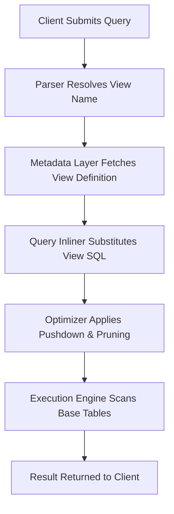

# 1. Regular Views in Snowflake: Metadata-Backed Query Abstraction
Documentation of standard view architecture, query inlining mechanics, privilege evaluation, and execution behavior in Snowflake.

# 2. Overview
Regular views are named SQL query definitions stored exclusively as metadata. They do not persist data, precompute results, or alter underlying storage. When queried, the view definition is substituted into the outer statement, compiled, and executed against source tables. Views exist to abstract complex joins, standardize business logic, enforce consistent column aliases, and provide logical data modeling without storage overhead. The feature targets data engineers building semantic layers, BI developers querying governed datasets, and SnowPro Advanced candidates tested on view inlining behavior, privilege inheritance, result caching interaction, and pruning implications.

# 3. SQL Object Summary

| Object/Feature | Type | Purpose | Source Objects/Inputs | Output/Behavior | Invocation |
|----------------|------|---------|----------------------|-----------------|------------|
| Regular View | Metadata Object / Logical Table | Reusable query abstraction, schema simplification | Underlying tables, joins, filters, aggregations | Dynamic result set compiled at query time | `SELECT * FROM view_name` |
| View Dependency Tracker | System Metadata | Resolve object lineage and refresh impact | View DDL, referenced objects | Dependency graph | `OBJECT_DEPENDENCIES`, `VIEWS` system views |

# 4. Architecture
Views are resolved at query compilation time. The Snowflake optimizer retrieves the view definition from the metadata layer, substitutes it into the outer query, applies predicate pushdown and join reordering, and generates an execution plan against base tables. No intermediate data is stored. Caching applies to the final compiled query text, not the view object.

# 5. Data Flow / Process Flow
1. **Name Resolution**: Query compiler identifies the view reference and validates object existence and privileges.
2. **Definition Retrieval**: Metadata service fetches the `SELECT` statement stored during `CREATE VIEW`.
3. **Query Inlining**: View SQL is substituted into the outer query. Aliases, `WHERE` clauses, and `JOIN` conditions are merged.
4. **Optimization**: Optimizer evaluates combined predicates for micro-partition pruning, join reordering, and expression simplification.
5. **Execution**: Engine scans underlying tables, applies filters, computes projections, and returns rows.
6. **Caching Evaluation**: Result cache eligibility is determined by the final compiled query text, session parameters, and warehouse context.

Row count and grain are inherited from the underlying query logic. Views do not alter base table storage or clustering.

# 6. Logical Breakdown

| Component | Responsibility | Inputs | Outputs | Dependencies | Failure Modes |
|-----------|----------------|--------|---------|--------------|---------------|
| Metadata Registry | Stores view DDL and ownership | `CREATE VIEW` statement | View object in schema catalog | System metadata service | Invalid syntax, duplicate name, privilege gap |
| Query Inliner | Substitutes view definition into outer query | View SQL, outer query AST | Combined query tree | Parser, expression resolver | Deeply nested views exceed compilation limits |
| Privilege Evaluator | Validates access rights | Caller role, view owner role, base table privileges | Allow/deny execution | RBAC subsystem, `SECURITY` flag | `INSUFFICIENT_PRIVILEGES` on invoker/definer mismatch |
| Optimizer Pruner | Applies filters to underlying tables | Combined predicates, clustering metadata | Pruned micro-partition list | Table statistics, clustering keys | Function-wrapped predicates block pruning |
| Result Cache Matcher | Checks for reusable execution results | Final query text, session state, warehouse ID | Cache hit/miss decision | Result cache subsystem | Parameter changes or `VOLATILE` logic invalidate cache |

# 7. Data Model
Views do not define persistent entities. They expose a logical schema derived from the underlying query.
- **Input Grain**: Defined by base table joins and aggregations in the view definition.
- **Output Grain**: 1:1 with the view's logical projection. No independent grain exists.
- **Keys**: No primary or foreign keys enforced. Relational integrity depends on underlying tables.
- **Null Handling**: Inherits null propagation from source expressions and join types (`INNER`, `LEFT`, etc.).
- **Schema Drift**: Altering base table columns (rename, drop) breaks view compilation unless the view explicitly aliases or omits the affected column.

# 8. Business Logic (Execution Logic)
- **Abstraction Rule**: Views encapsulate reusable SQL. Business logic changes require `CREATE OR REPLACE VIEW`. DDL does not trigger data refresh.
- **Security Context**: `SECURITY DEFINER` (default) executes with the view creator's privileges. `SECURITY INVOKER` executes with the querying role's privileges. Exam trap: `DEFINER` hides underlying object privileges from the caller; `INVOKER` requires direct `SELECT` access to all referenced tables.
- **Caching Behavior**: Views do not cache data. Result cache applies only if the fully inlined query matches a prior execution exactly, including session parameters and warehouse size.
- **Pruning Interaction**: Predicates in the outer query combine with view predicates. If the view applies a function to a clustered column, pruning is disabled for that column.
- **Exam-Relevant Defaults**: Views are purely logical. They never improve performance by default. They inherit base table storage costs. `COPY GRANTS` preserves existing privileges on `OR REPLACE`.

# 9. Transformations

| Source Input | Target Output | Rule/Logic | Execution Meaning | Impact |
|--------------|---------------|------------|-------------------|--------|
| Outer `WHERE` + View `WHERE` | Combined predicate tree | `AND` merging, constant folding | Enables single-pass filter evaluation | Preserves pruning if predicates are sargable; blocks if non-deterministic |
| View `JOIN` + Outer `SELECT` columns | Flattened projection | Column alias substitution, unused join elimination | Reduces intermediate result size | Optimizer drops unreferenced joins; view complexity no longer equals execution cost |
| Aggregation in View + Outer `WHERE` | Pre-aggregate then filter | `GROUP BY` pushed before outer filter if safe | Prevents double aggregation | Outer filter on aggregated columns works; filter on pre-aggregate rows may require rewrite |
| `CASE` logic in View | Conditional projection | Evaluated per row during scan | Standardizes categorical mappings | Adds CPU overhead; prevents predicate pushdown on mapped values |

# 10. Parameters / Variables / Configuration

| Name | Type | Purpose | Allowed Values/Format | Default | Where Used | Effect |
|------|------|---------|----------------------|---------|------------|--------|
| `CREATE [OR REPLACE] VIEW` | DDL Command | Define or overwrite logical abstraction | Valid SQL `SELECT` statement | N/A | Schema DDL | Stores metadata; replaces existing view if `OR REPLACE` used |
| `SECURITY DEFINER` / `INVOKER` | View Property | Control privilege evaluation context | Keyword | `DEFINER` | `CREATE VIEW` | Determines whether creator or caller privileges are enforced |
| `COPY GRANTS` | DDL Option | Preserve existing privileges on replace | Keyword | None | `CREATE OR REPLACE VIEW` | Maintains role assignments across DDL updates |
| `COMMENT` | View Property | Document business purpose or logic | String literal | Null | `CREATE VIEW` / `ALTER VIEW` | Visible in `SHOW VIEWS` and metadata catalogs |

# 11. APIs / Interfaces
- **Management**: `CREATE VIEW`, `CREATE OR REPLACE VIEW`, `ALTER VIEW`, `DROP VIEW`, `DESCRIBE VIEW`, `SHOW VIEWS`
- **System Views**: `INFORMATION_SCHEMA.VIEWS`, `ACCOUNT_USAGE.VIEWS` (DDL text, owner, creation timestamp, comment)
- **Dependency Tracking**: `OBJECT_DEPENDENCIES`, `ACCESS_HISTORY` (maps view consumption to underlying table scans)
- **Error Behavior**: Compilation errors occur if referenced objects are missing, privileges are revoked, or SQL syntax is invalid. Runtime errors surface from underlying table scans or join failures.

# 12. Execution / Deployment
- **Deployment**: Defined via SQL DDL. Stored in account metadata. No physical data movement.
- **Execution Trigger**: Invoked inline within `SELECT` statements. No scheduled or event-driven refresh.
- **Orchestration**: Version controlled via infrastructure-as-code or CI/CD pipelines. Replacement does not invalidate dependent queries unless schema breaks.
- **Environment Consistency**: Behavior is deterministic across DEV/TEST/PROD provided underlying table schemas, clustering keys, and session parameters align.

# 13. Observability
- **Query History**: `QUERY_HISTORY` shows `COMPILATION_TIME` increase for deeply nested views. `EXECUTION_TIME` reflects underlying table scan performance.
- **Access Tracking**: `ACCESS_HISTORY` logs view consumption frequency and maps to base table reads. High view usage with low cache hit rate indicates optimization opportunity.
- **Dependency Validation**: `OBJECT_DEPENDENCIES` identifies downstream impact before `ALTER TABLE` or `DROP` operations.
- **Cost Attribution**: Compute costs attribute to the querying warehouse. Storage costs attribute to base tables only. Views contribute zero storage.

# 14. Failure Handling & Recovery

| Failure Scenario | Symptom | Detection | Fallback | Recovery |
|------------------|---------|-----------|----------|----------|
| Underlying Table Dropped | `Object does not exist` compilation error | `QUERY_HISTORY` error, metadata validation | Query base tables directly or use backup view | Recreate table, update view DDL, or use deferred schema validation patterns |
| Privilege Revocation on Base Table | `Insufficient privileges` at runtime | Query failure logs | Grant role `SELECT` on underlying tables | Re-apply `SECURITY DEFINER` or grant required privileges to invoker |
| Schema Drift (Column Rename/Drop) | `Invalid column` error during inlining | DDL validation failure | Update view definition to match new schema | `CREATE OR REPLACE VIEW` with corrected column references |
| Complex View Compilation Timeout | Query aborts during optimization | `COMPILATION_TIME` spike, timeout error | Split view into simpler CTEs or materialized layers | Refactor nested logic, add explicit indexes/clustering, or use materialized alternatives |
| Unintended Predicate Pushdown Failure | Full table scan despite filter | `EXPLAIN` shows low pruning ratio | Rewrite outer query to filter base columns directly | Restructure view to expose filterable columns, avoid function wrapping on clustered keys |

# 15. Security & Access Control
- **Privilege Model**: `GRANT USAGE` on schema and `SELECT` on view required. Base table privileges checked based on `SECURITY` flag.
- **Row-Level Security & Masking**: Policies evaluate after view inlining. RLS applies to base tables first; view predicates are layered afterward. Masking policies transform column values during projection.
- **Secure Views**: `CREATE SECURE VIEW` prevents query text exposure in `ACCESS_HISTORY` and restricts certain optimization rewrites. Regular views expose definition in metadata.
- **Exam Note**: `SECURITY DEFINER` does not bypass object-level grants for the owner; the owner must already hold required privileges. `INVOKER` shifts validation to the querying role.

# 16. Performance / Scalability Considerations
- **Optimizer Inlining Limits**: Excessive view nesting (>10 levels) or complex `UNION ALL` chains may hit compilation boundaries. Flattening into CTEs or materialized tables improves plan generation.
- **Predicate Pushdown**: Views do not block pushdown if predicates reference raw columns. Wrapping columns in functions (`UPPER(col)`, `DATE_TRUNC()`) disables micro-partition pruning.
- **Result Caching**: Cache eligibility depends on exact query text. Views with `CURRENT_TIMESTAMP()`, `RANDOM()`, or session-dependent logic invalidate caching.
- **Join Elimination**: Snowflake optimizer drops unreferenced joins from view definitions if outer query does not select those columns. View complexity does not equal execution overhead.
- **Warehouse Scaling**: Views do not change compute requirements. They shift logical complexity to the optimizer. Large underlying tables require appropriately sized warehouses regardless of view abstraction.

# 17. Assumptions & Constraints
- Views store zero data. All storage costs belong to underlying tables. Views only consume metadata quota.
- View inlining is aggressive but bounded. Extremely complex definitions may degrade compilation performance or prevent join elimination.
- `SECURITY DEFINER` is the default. Candidates assuming `INVOKER` for governance often misconfigure access patterns.
- Result caching does not apply to the view object. It applies to the final compiled query. Session parameter changes invalidate cache.
- Views do not enforce constraints. Data quality depends on underlying table design and ETL logic.
- SnowPro Advanced trap: Views do not improve query performance. They provide logical abstraction. Performance depends on underlying table clustering, pruning, and warehouse size.

# 18. Future Enhancements
- Introduce view dependency impact analysis during DDL to flag breaking changes before deployment.
- Add compilation plan caching for frequently accessed complex views to reduce `COMPILATION_TIME`.
- Support declarative predicate indexing hints to guide optimizer pushdown through nested view layers.
- Implement incremental view validation to detect schema drift in underlying tables before query execution.
- Extend `EXPLAIN` to surface inlining boundaries, showing exactly where view predicates merge with outer filters.
