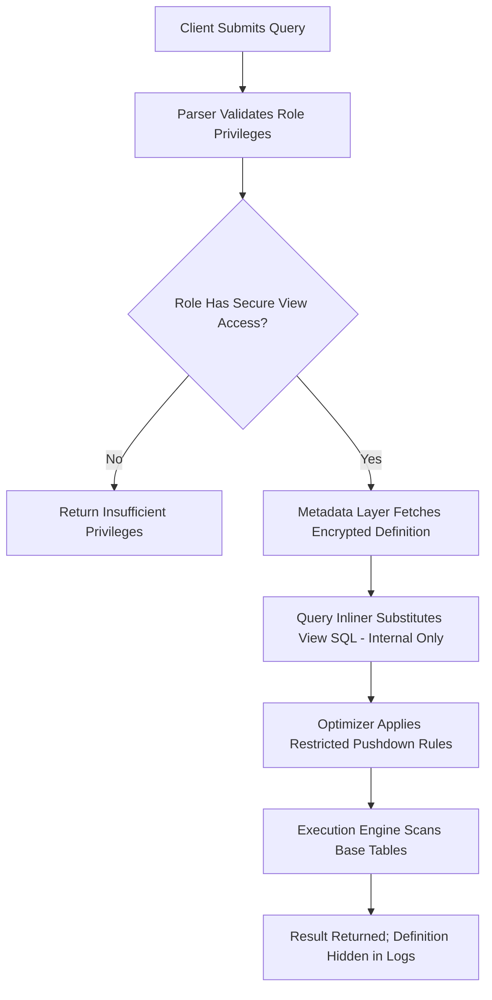

# 1. Secure Views in Snowflake: Security-Enforced Query Abstraction
Documentation of secure view architecture, query text obfuscation, optimization boundaries, and privilege evaluation for sensitive data access patterns.

# 2. Overview
Secure views are a specialized variant of regular views that restrict visibility of the view definition, limit certain query optimizations, and enforce strict privilege evaluation to protect sensitive data access patterns. They exist to enable governed data sharing, PII abstraction, multi-tenant isolation, and compliance-driven query auditing without exposing underlying table structures or business logic. Unlike regular views, secure views prevent query text exposure in `ACCESS_HISTORY`, restrict predicate pushdown in specific scenarios, and enforce `SECURITY DEFINER` semantics by default. The feature targets security architects designing compliant data products, data engineers building multi-tenant consumption layers, and SnowPro Advanced candidates tested on secure view constraints, privilege inheritance, and optimization tradeoffs.

# 3. SQL Object Summary

| Object/Feature | Type | Purpose | Source Objects/Inputs | Output/Behavior | Invocation |
|----------------|------|---------|----------------------|-----------------|------------|
| Secure View | Metadata Object / Security Boundary | Hide query logic, enforce access isolation, protect sensitive transformations | Underlying tables, joins, filters, masking policies | Dynamic result set with obfuscated execution plan | `SELECT * FROM secure_view_name` |
| Secure View Metadata Guard | System Security Feature | Prevent definition exposure in system views | View DDL, ownership context | Redacted `VIEW_DEFINITION` in metadata queries | `SHOW SECURE VIEWS`, `INFORMATION_SCHEMA.VIEWS` |

# 4. Architecture
Secure views operate as a security boundary within Snowflake's query compilation pipeline. The view definition is stored in encrypted metadata and only accessible to roles with explicit `OWNERSHIP` or `SECURE VIEW` privileges. During query compilation, the definition is inlined for execution but excluded from query history, access logs, and optimization diagnostics visible to non-privileged roles. Predicate pushdown and join reordering are restricted when they could expose underlying table structures or bypass row-level security policies.

# 5. Data Flow / Process Flow
1. **Privilege Validation**: Query compiler verifies caller role holds `SELECT` on the secure view and that the view owner holds required privileges on underlying objects.
2. **Encrypted Definition Retrieval**: Metadata service fetches the view DDL from encrypted storage; definition is never exposed to caller session.
3. **Restricted Inlining**: View SQL is substituted internally for execution. Query text visible to caller shows only the secure view reference, not expanded logic.
4. **Optimization Constraints**: Optimizer applies conservative pushdown rules to prevent leakage of underlying table structures or bypass of row-level security.
5. **Execution**: Engine scans base tables, applies filters, computes projections. Sensitive columns may be masked or filtered per policy.
6. **Audit Logging**: `ACCESS_HISTORY` logs the secure view access but redacts the expanded query text and underlying table references for non-owner roles.

Row count and grain match the view definition. Secure views do not alter base table storage or clustering. Execution behavior is functionally identical to regular views for authorized callers; differences are limited to metadata visibility and optimization boundaries.

# 6. Logical Breakdown

| Component | Responsibility | Inputs | Outputs | Dependencies | Failure Modes |
|-----------|----------------|--------|---------|--------------|---------------|
| Encrypted Metadata Store | Protect view DDL from unauthorized access | `CREATE SECURE VIEW` statement | Encrypted view definition in system catalog | Key management service, RBAC | Key rotation failure, metadata corruption |
| Privilege Chain Validator | Enforce `SECURITY DEFINER` execution context | Caller role, view owner role, base table grants | Allow/deny compilation | RBAC subsystem, ownership hierarchy | Circular privilege dependencies, revoked grants |
| Restricted Optimizer | Apply conservative pushdown to prevent leakage | Combined predicates, secure view flag | Pruned plan with guarded transformations | Table statistics, clustering metadata | Overly conservative pruning reduces performance |
| Query Text Redactor | Obfuscate expanded SQL in logs and history | Compiled query tree, caller role | Redacted query text in `QUERY_HISTORY` | Audit logging subsystem | Redaction gaps expose sensitive logic |
| Policy Enforcement Layer | Apply masking/RLS after view inlining | Row-level security policies, masking policies | Filtered/masked result set | Policy catalog, session context | Policy evaluation order conflicts with view logic |

# 7. Data Model
Secure views do not define persistent entities. They expose a logical schema with enforced access boundaries.
- **Input Grain**: Defined by base table joins and aggregations in the secure view definition.
- **Output Grain**: 1:1 with the view's logical projection. No independent grain exists.
- **Keys**: No primary or foreign keys enforced. Relational integrity depends on underlying tables.
- **Null Handling**: Inherits null propagation from source expressions and join types.
- **Schema Drift**: Altering base table columns breaks secure view compilation unless the view explicitly aliases or omits the affected column. Ownership privileges required to update definition.

# 8. Business Logic (Execution Logic)
- **Abstraction with Obfuscation**: Secure views encapsulate reusable SQL while hiding implementation details. Business logic changes require `CREATE OR REPLACE SECURE VIEW` by an owner role.
- **Mandatory Security Context**: Secure views always execute with `SECURITY DEFINER` semantics. Caller privileges are not evaluated against underlying tables. Exam trap: Secure views cannot use `SECURITY INVOKER`; attempting to set it causes compilation error.
- **Caching Behavior**: Result cache applies only if the fully inlined query matches a prior execution exactly. However, cache keys include the secure view reference, not expanded text, limiting cross-session reuse for non-owners.
- **Pruning Interaction**: Predicate pushdown is restricted when it could reveal underlying table structures. Filters on secure view columns may not push to base tables if the view applies conditional logic or joins that could leak access patterns.
- **Exam-Relevant Defaults**: Secure views cannot be cloned. They do not inherit grants via `COPY GRANTS` unless explicitly re-granted. `SHOW VIEWS` displays secure views but redacts `VIEW_DEFINITION` for non-owners.

# 9. Transformations

| Source Input | Target Output | Rule/Logic | Execution Meaning | Impact |
|--------------|---------------|------------|-------------------|--------|
| Outer `WHERE` + Secure View `WHERE` | Guarded predicate merge | `AND` merging with leakage prevention | Enables filtering while protecting underlying structure | May disable pruning on sensitive columns; requires explicit exposure design |
| Secure View `JOIN` + Row-Level Security | Policy-aware join resolution | RLS evaluated after view inlining | Prevents bypass of tenant isolation via view logic | Adds evaluation overhead; requires careful policy ordering |
| Masking Policy + Secure View Projection | Layered data protection | Masking applied post-view projection | Ensures sensitive values never exposed, even via view logic | Double-protection pattern; masking cannot be overridden by view aliasing |
| Conditional Logic (`CASE`) in Secure View | Obfuscated branching | Branch evaluation hidden from query logs | Standardizes categorical mappings without exposing rules | Adds CPU overhead; prevents external auditing of business logic |

# 10. Parameters / Variables / Configuration

| Name | Type | Purpose | Allowed Values/Format | Default | Where Used | Effect |
|------|------|---------|----------------------|---------|------------|--------|
| `CREATE [OR REPLACE] SECURE VIEW` | DDL Command | Define security-enforced logical abstraction | Valid SQL `SELECT` statement | N/A | Schema DDL | Stores encrypted metadata; enforces `DEFINER` context |
| `SECURITY DEFINER` | View Property | Mandatory execution context for secure views | Keyword (implicit) | Always `DEFINER` | `CREATE SECURE VIEW` | Cannot be overridden; ensures owner-controlled access |
| `COPY GRANTS` | DDL Option | Preserve existing privileges on replace | Keyword | None | `CREATE OR REPLACE SECURE VIEW` | Maintains role assignments; does not expose definition |
| `COMMENT` | View Property | Document business purpose (visible to owners) | String literal | Null | `CREATE VIEW` / `ALTER VIEW` | Visible only to roles with `OWNERSHIP` or explicit metadata access |
| `ALLOW_WRITES` | Secure View Property (Snowflake Share) | Control write-through in data sharing contexts | `TRUE`/`FALSE` | `FALSE` | `CREATE SECURE VIEW` in share | Prevents downstream consumers from modifying source data via view |

# 11. APIs / Interfaces
- **Management**: `CREATE SECURE VIEW`, `CREATE OR REPLACE SECURE VIEW`, `ALTER VIEW ... SET SECURE`, `DROP VIEW`, `DESCRIBE VIEW`
- **System Views**: `INFORMATION_SCHEMA.VIEWS` (redacted `VIEW_DEFINITION` for secure views), `ACCOUNT_USAGE.VIEWS` (owner-only visibility)
- **Dependency Tracking**: `OBJECT_DEPENDENCIES` shows secure view dependencies but redacts underlying object names for non-owners
- **Error Behavior**: Compilation errors occur if referenced objects are missing or privileges are revoked. Error messages do not expose underlying table names or view logic to non-privileged roles.

# 12. Execution / Deployment
- **Deployment**: Defined via SQL DDL with `SECURE` keyword. Stored in encrypted metadata. No physical data movement.
- **Execution Trigger**: Invoked inline within `SELECT` statements. No scheduled or event-driven refresh.
- **Orchestration**: Version controlled via infrastructure-as-code. Replacement requires owner privileges; dependent queries unaffected unless schema breaks.
- **Environment Consistency**: Behavior is deterministic across environments provided underlying schemas and privilege hierarchies align. Secure view definitions do not replicate automatically; must be deployed per account.

# 13. Observability
- **Query History**: `QUERY_HISTORY` shows execution time and row counts but redacts expanded SQL text for secure views when queried by non-owner roles.
- **Access Tracking**: `ACCESS_HISTORY` logs secure view access events but omits underlying table references and view logic for non-privileged roles. Owners see full lineage.
- **Dependency Validation**: `OBJECT_DEPENDENCIES` requires `OWNERSHIP` to view secure view dependencies. Non-owners see only the secure view name.
- **Cost Attribution**: Compute costs attribute to the querying warehouse. Storage costs attribute to base tables only. Secure views contribute zero storage but add metadata encryption overhead.

# 14. Failure Handling & Recovery

| Failure Scenario | Symptom | Detection | Fallback | Recovery |
|------------------|---------|-----------|----------|----------|
| Underlying Table Dropped | `Object does not exist` compilation error | `QUERY_HISTORY` error (redacted for non-owners) | Owner queries metadata to diagnose; non-owners see generic error | Owner recreates table or updates secure view DDL |
| Privilege Revocation on Base Table | Silent query failure or empty results | Owner sees `INSUFFICIENT_PRIVILEGES`; non-owners see generic error | Grant owner role required privileges on underlying tables | Re-apply grants to view owner; verify `DEFINER` chain |
| Schema Drift (Column Rename/Drop) | Compilation error during inlining | Owner sees specific error; non-owners see generic failure | Owner updates secure view definition via `OR REPLACE` | `CREATE OR REPLACE SECURE VIEW` with corrected references |
| Overly Restrictive Pushdown | Full table scan despite filter | `EXPLAIN` shows low pruning (owner-only visibility) | Rewrite secure view to expose filterable columns explicitly | Restructure view logic to allow safe predicate pushdown |
| Cache Miss for Repeated Queries | Higher compute cost than expected | `RESULT_REUSED = FALSE` in `QUERY_HISTORY` (owner view) | Accept compute cost for security boundary; consider materialized alternative | Use `MATERIALIZED VIEW` with secure access patterns if performance critical |

# 15. Security & Access Control
- **Privilege Model**: `GRANT USAGE` on schema and `SELECT` on secure view required. Underlying table privileges validated only against view owner role, not caller.
- **Row-Level Security & Masking**: Policies evaluate after secure view inlining. RLS applies to base tables first; secure view predicates are layered afterward. Masking policies transform column values during final projection.
- **Metadata Protection**: `VIEW_DEFINITION` in `INFORMATION_SCHEMA.VIEWS` returns `NULL` for secure views when queried by non-owner roles. `SHOW SECURE VIEWS` requires explicit privilege.
- **Data Sharing**: Secure views can be included in Snowflake shares. Consumers see only the result set, not the definition or underlying objects. `ALLOW_WRITES = FALSE` prevents modification attempts.
- **Exam Note**: Secure views cannot be converted to regular views without recreation. `ALTER VIEW ... UNSET SECURE` is not supported. Candidates assuming reversible security boundaries often misdesign access patterns.

# 16. Performance / Scalability Considerations
- **Optimizer Restrictions**: Conservative pushdown may increase scan volume. Secure views on large, clustered tables require explicit filter exposure design to maintain pruning efficiency.
- **Result Caching**: Cache eligibility depends on exact query text. Secure views with session-dependent logic or non-deterministic functions invalidate caching. Cache keys include secure view reference, limiting cross-role reuse.
- **Compilation Overhead**: Encrypted metadata retrieval and privilege chain validation add marginal compilation time. Negligible for most workloads; measurable for high-frequency, low-latency queries.
- **Join Elimination**: Snowflake optimizer may skip join elimination for secure views if elimination could expose underlying table access patterns. View complexity may persist in execution plan.
- **Warehouse Scaling**: Secure views do not change compute requirements. They add security boundary overhead. Large underlying tables require appropriately sized warehouses regardless of view abstraction.

# 17. Assumptions & Constraints
- Secure views store zero data. All storage costs belong to underlying tables. Views only consume encrypted metadata quota.
- Secure views always execute as `SECURITY DEFINER`. `SECURITY INVOKER` is not supported and causes compilation error.
- Query text redaction applies to `QUERY_HISTORY`, `ACCESS_HISTORY`, and system view metadata. Owners with `OWNERSHIP` privilege see full details.
- Secure views cannot be cloned via `CLONE` command. Recreation required for environment promotion.
- Predicate pushdown restrictions are conservative by design. Performance tuning requires owner-level `EXPLAIN` analysis and explicit logic restructuring.
- SnowPro Advanced trap: Candidates assume secure views improve performance via caching. Secure views prioritize security over optimization. Performance depends on underlying table design, not view security boundary.

# 18. Future Enhancements
- Introduce selective predicate pushdown hints to allow owners to explicitly mark safe filters for optimization without exposing underlying structure.
- Add secure view dependency impact analysis during DDL to flag breaking changes before deployment, visible only to owner roles.
- Support encrypted parameterization for secure views to enable dynamic filtering without exposing filter logic in query text.
- Implement incremental secure view validation to detect schema drift in underlying tables before query execution, with owner-only alerts.
- Extend `EXPLAIN` to surface secure view optimization boundaries for owner roles, showing exactly where pushdown was restricted and why.
