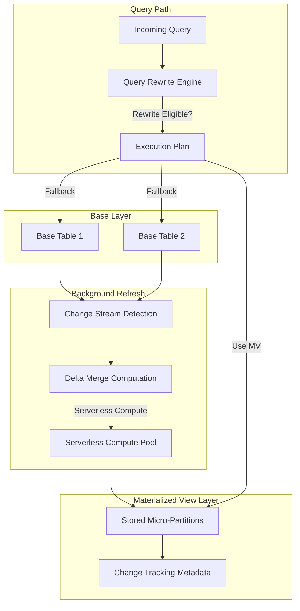

# 1. Materialized Views in Snowflake: Pre-Computed Result Sets with Automatic Refresh
Documentation of Snowflake materialized view architecture, incremental refresh mechanics, query rewrite behavior, and cost/performance tradeoffs for governed acceleration patterns.

# 2. Overview
Materialized views are database objects that store the result of a query as physical micro-partitions, automatically refreshed when underlying base tables change. They exist to accelerate repeated aggregation, filtering, or join patterns without requiring manual ETL or external caching layers. Unlike regular views, materialized views consume storage and incur background refresh compute costs. Unlike dynamic tables, materialized views use Snowflake-managed incremental refresh with deterministic rewrite rules and stricter SQL pattern limitations. The feature targets data architects building query acceleration layers, analytics engineers optimizing BI workloads, and SnowPro Advanced candidates tested on refresh semantics, query rewrite eligibility, edition requirements, and SQL pattern constraints.

# 3. SQL Object Summary

| Object/Feature | Type | Purpose | Source Objects/Inputs | Output/Behavior | Invocation |
|----------------|------|---------|----------------------|-----------------|------------|
| Materialized View | Physical Table Object with Auto-Refresh | Pre-compute and maintain query results for repeated access | Base tables, joins, aggregations, filters | Stored micro-partitions refreshed incrementally | `CREATE MATERIALIZED VIEW ... AS SELECT ...` |
| Query Rewrite Engine | Optimizer Subsystem | Automatically redirect base table queries to materialized view | Query AST, MV metadata, cost statistics | Transparent substitution of MV for base table scan | Automatic during compilation; no query modification required |
| Change Tracking Integrator | Background Service | Detect and propagate base table changes to MV | Base table change streams, MV definition | Incremental refresh job scheduling | Automatic; managed by Snowflake serverless compute |

# 4. Architecture
Materialized views are stored as physical micro-partitions with associated change tracking metadata. When base tables are modified, Snowflake's background services detect changes via internal change streams, compute delta rows, and apply incremental merges to the materialized view storage. The query optimizer evaluates incoming queries against registered materialized views and may rewrite the execution plan to use the pre-computed result if rewrite rules are satisfied and cost estimates favor the MV.

# 5. Data Flow / Process Flow

**Materialized View Creation:**
1. **DDL Parsing**: Compiler validates `SELECT` statement against MV SQL pattern restrictions.
2. **Initial Materialization**: Full query execution writes result to micro-partitions.
3. **Change Tracking Registration**: Internal streams registered on all referenced base tables.
4. **Metadata Publication**: MV registered in optimizer catalog for rewrite evaluation.

**Incremental Refresh Cycle:**
1. **Change Detection**: Background service polls change streams for base table modifications.
2. **Delta Computation**: Affected rows identified; MV query logic re-evaluated for changed keys.
3. **Merge Application**: `MERGE`-style upsert applies inserts, updates, deletes to MV storage.
4. **Statistics Update**: Micro-partition metadata and clustering information refreshed.

**Query Execution with Rewrite:**
1. **Query Parsing**: Incoming query references base tables or MV directly.
2. **Rewrite Evaluation**: Optimizer checks MV eligibility: pattern match, freshness, cost threshold.
3. **Plan Substitution**: If eligible, MV micro-partitions replace base table scan in execution plan.
4. **Result Assembly**: Data read from MV storage; additional filters/aggregations applied if needed.

Row count in MV matches the defining query's grain. Refresh is asynchronous; staleness window depends on change volume and serverless compute availability.

# 6. Logical Breakdown

| Component | Responsibility | Inputs | Outputs | Dependencies | Failure Modes |
|-----------|----------------|--------|---------|--------------|---------------|
| SQL Pattern Validator | Enforce MV-compatible query structure | `SELECT` AST, function catalog | Allow/deny compilation | MV SQL restriction rules | Unsupported join type, non-deterministic function, subquery violation |
| Initial Materialization Engine | Compute full result set for first load | Base table data, query logic | Micro-partitions with MV grain | Warehouse compute, storage quota | Large initial load timeout, storage quota exceeded |
| Change Stream Registrar | Track modifications on source tables | Base table OIDs, MV dependency graph | Registered change streams | System change tracking service | Stream registration failure, permission gap |
| Delta Merge Scheduler | Compute and apply incremental changes | Change events, MV definition | Updated micro-partitions | Serverless compute pool, merge logic | Merge conflict, stale statistics, compute quota exhaustion |
| Query Rewrite Evaluator | Determine MV substitution eligibility | Query AST, MV metadata, cost stats | Rewrite decision (yes/no) | Optimizer cost model, freshness threshold | Overly conservative rewrite, missed acceleration opportunity |

# 7. Data Model
Materialized views define a persistent, query-optimized dataset.
- **Grain**: Explicitly defined by the `SELECT` statement (e.g., `GROUP BY date, category` produces one row per date-category combination).
- **Storage**: Physical micro-partitions stored in Snowflake's columnar format; compressed and clustered automatically.
- **Clustering**: Automatically derived from `GROUP BY` columns or explicit `CLUSTER BY` clause. Cannot be altered post-creation without recreation.
- **Keys**: No primary/foreign key enforcement. Uniqueness depends on query logic (e.g., `GROUP BY` guarantees one row per group).
- **Null Handling**: Inherits from source expressions. `GROUP BY` treats `NULL` as a distinct group value.
- **Schema Evolution**: Adding columns to base tables does not propagate to MV. MV must be recreated to include new fields.

# 8. Business Logic (Execution Logic)
- **Rewrite Eligibility Rules**: Optimizer rewrites queries to use MV only if: (1) query references all MV base tables, (2) query predicates are compatible with MV filters, (3) query aggregations are derivable from MV pre-aggregations, (4) MV freshness is within acceptable threshold.
- **Refresh Semantics**: Incremental, asynchronous, serverless-managed. No `TARGET_LAG` parameter (distinct from Dynamic Tables). Refresh latency depends on change volume and system load.
- **SQL Pattern Restrictions**: MV `SELECT` cannot contain: non-deterministic functions (`RANDOM()`, `CURRENT_TIMESTAMP()`), outer joins (in most cases), subqueries in `SELECT` or `WHERE`, `QUALIFY`, `SAMPLE`, `CONNECT BY`, or user-defined functions (with limited exceptions). Exam trap: Candidates often assume MV supports any query pattern; restrictions are strict and edition-gated.
- **Cost Model**: Storage cost for MV micro-partitions + compute cost for refresh (charged to owner's account via serverless pool). Query cost reduced when rewrite succeeds.
- **Exam-Relevant Defaults**: Materialized views require Enterprise edition or higher. Query rewrite is automatic but not guaranteed; `/*+ USE_MV(mv_name) */` hint can force usage (non-standard, vendor-specific). MVs do not support `SECURE` keyword; use secure views over MVs for combined security/acceleration.

# 9. Transformations

| Source Input | Target Output | Rule/Logic | Execution Meaning | Impact |
|--------------|---------------|------------|-------------------|--------|
| Base table `INSERT` | MV row `INSERT` | Change stream detects new key; MV query evaluated for new row | Incremental addition to pre-computed result | Low-latency refresh for append-only workloads |
| Base table `UPDATE` | MV row `UPDATE` or `DELETE+INSERT` | Changed key re-evaluated; old value removed, new value inserted | Maintains MV consistency with source | Merge overhead proportional to change cardinality |
| Base table `DELETE` | MV row `DELETE` | Change stream flags removal; corresponding MV row deleted | Prevents stale results in accelerated layer | Delete propagation latency depends on refresh cycle |
| Aggregated MV + Outer Query Filter | Partial aggregation reuse | Optimizer pushes outer filter into MV scan if compatible | Avoids full MV scan; applies residual filtering | Requires predicate compatibility; may fall back to base tables |

# 10. Parameters / Variables / Configuration

| Name | Type | Purpose | Allowed Values/Format | Default | Where Used | Effect |
|------|------|---------|----------------------|---------|------------|--------|
| `CREATE MATERIALIZED VIEW` | DDL Command | Define pre-computed result with auto-refresh | SQL `SELECT` meeting MV restrictions | N/A | Schema DDL | Registers MV for incremental refresh and query rewrite |
| `CLUSTER BY` | MV Option | Define micro-partition sorting for pruning | Column list from `SELECT` output | Automatic from `GROUP BY` | `CREATE MATERIALIZED VIEW` | Affects refresh merge performance and query pruning |
| `COPY GRANTS` | DDL Option | Preserve privileges on replacement | Keyword | None | `CREATE OR REPLACE MATERIALIZED VIEW` | Maintains role assignments across DDL updates |
| `AUTO_REFRESH` | MV Property | Enable/disable background refresh | `TRUE`/`FALSE` | `TRUE` | `ALTER MATERIALIZED VIEW` | `FALSE` suspends refresh; MV becomes stale until resumed |
| `QUERY_REWRITE_ENABLED` | Account Parameter | Global toggle for MV rewrite optimization | `TRUE`/`FALSE` | `TRUE` | Account configuration | Disables all MV rewrites when `FALSE`; useful for debugging |

# 11. APIs / Interfaces
- **Management**: `CREATE MATERIALIZED VIEW`, `ALTER MATERIALIZED VIEW [SUSPEND/RESUME]`, `DROP MATERIALIZED VIEW`, `DESCRIBE MATERIALIZED VIEW`, `SHOW MATERIALIZED VIEWS`
- **System Views**: `INFORMATION_SCHEMA.MATERIALIZED_VIEWS`, `ACCOUNT_USAGE.MATERIALIZED_VIEWS` (refresh status, last refreshed timestamp, row count)
- **Refresh Monitoring**: `MATERIALIZED_VIEW_REFRESH_HISTORY` (refresh duration, rows processed, status)
- **Query Rewrite Diagnostics**: `EXPLAIN` output shows `MaterializedViewRewrite` node when MV substitution occurs
- **Error Behavior**: Compilation errors for unsupported SQL patterns. Refresh failures logged to `QUERY_HISTORY` with owner role context.

# 12. Execution / Deployment
- **Deployment**: Defined via SQL DDL. Initial materialization executes synchronously on creating warehouse. Subsequent refreshes use serverless compute pool.
- **Refresh Trigger**: Asynchronous, event-driven via change streams. No fixed schedule; refresh latency depends on change volume and system concurrency.
- **Suspension/Resumption**: `ALTER MATERIALIZED VIEW SUSPEND` halts refresh; MV serves stale data. `RESUME` re-enables incremental updates.
- **Environment Strategy**: MVs do not clone with `CLONE` command. Recreation required for environment promotion. Definition and data must be deployed separately.
- **Runtime Assumptions**: Base table schema must remain stable. Adding/dropping columns referenced by MV breaks refresh and requires recreation.

# 13. Observability
- **Refresh History**: `MATERIALIZED_VIEW_REFRESH_HISTORY` shows refresh frequency, duration, rows processed, and failure reasons.
- **Query Rewrite Tracking**: `QUERY_HISTORY` `QUERY_TEXT` shows original query; `EXPLAIN` reveals `MaterializedViewRewrite` node when substitution occurs.
- **Staleness Monitoring**: `LAST_REFRESH_TIME` in `ACCOUNT_USAGE.MATERIALIZED_VIEWS` compared to base table `LAST_DML_TIME` estimates freshness gap.
- **Cost Attribution**: Storage costs appear in `TABLE_STORAGE_METRICS` for MV object. Refresh compute costs attributed to owner account via serverless pool metrics.
- **Rewrite Hit Rate**: Custom query against `QUERY_HISTORY` counting `MaterializedViewRewrite` events vs base table scans measures acceleration effectiveness.

# 14. Failure Handling & Recovery

| Failure Scenario | Symptom | Detection | Fallback | Recovery |
|------------------|---------|-----------|----------|----------|
| Unsupported SQL Pattern | `Materialized view definition is not supported` compilation error | DDL failure, error message | Rewrite query to comply with MV restrictions or use regular view | Refactor `SELECT` to remove prohibited functions/joins; test with `EXPLAIN` |
| Refresh Failure (Merge Conflict) | MV staleness, `REFRESH_FAILED` status | `MATERIALIZED_VIEW_REFRESH_HISTORY` error entry | Query falls back to base tables; no acceleration | Resume MV after resolving source data issues; recreate if corruption suspected |
| Base Table Schema Drift | Refresh errors, MV invalidation | `QUERY_HISTORY` compilation errors on refresh | Suspend MV; queries use base tables directly | Recreate MV with updated column references; validate pattern compatibility |
| Query Rewrite Miss | Expected acceleration not observed | `EXPLAIN` shows no `MaterializedViewRewrite` node | Query executes against base tables; higher compute cost | Verify query pattern matches MV; check `QUERY_REWRITE_ENABLED`; add compatible predicates |
| Storage Quota Exhaustion | MV creation or refresh fails | `Insufficient storage` error | Reduce MV grain (more aggregation) or prune historical data | Increase storage allocation; archive old MV partitions; redesign grain |

# 15. Security & Access Control
- **Privilege Model**: `SELECT` on MV grants access to pre-computed results. Underlying table privileges not required for MV query (owner's privileges used for refresh).
- **Row-Level Security & Masking**: Policies defined on base tables evaluate during MV refresh, not query time. MV stores already-filtered/masked results. Exam trap: RLS on base tables does not dynamically apply to MV queries; MV reflects owner's view of data at refresh time.
- **Data Sharing**: Materialized views can be shared via Snowflake Data Sharing if owned by a role with share privileges. Consumers see only the MV result, not base tables or refresh logic.
- **Secure View Combination**: To combine acceleration with security, create a secure view on top of a materialized view: `CREATE SECURE VIEW secure_mv AS SELECT * FROM mv_name`.
- **Exam Note**: MV refresh executes with owner privileges. Caller querying MV does not need base table access. This is a frequent exam scenario testing privilege boundary understanding.

# 16. Performance / Scalability Considerations
- **Refresh Cost vs Query Savings**: Incremental refresh compute cost must be justified by repeated query acceleration. High-churn base tables with low query frequency may not benefit.
- **Clustering and Pruning**: MV micro-partitions automatically cluster on `GROUP BY` columns. Queries filtering on these columns achieve high pruning efficiency. Non-clustered filters may require full MV scan.
- **Rewrite Overhead**: Optimizer evaluation for rewrite eligibility adds marginal compilation time. Negligible for most workloads; measurable for high-frequency, low-latency queries.
- **Storage Amplification**: MV storage is additional to base tables. Highly granular MVs (e.g., no aggregation) may approach base table size with minimal acceleration benefit.
- **Concurrency Limits**: Serverless refresh pool has account-level concurrency limits. High-churn environments with many MVs may experience refresh queuing and increased staleness.
- **Exam Trap**: Candidates assume MV always improves performance. MV adds storage cost and refresh overhead. Benefit depends on query pattern repeatability, change volume, and rewrite eligibility.

# 17. Assumptions & Constraints
- Materialized views require Enterprise edition or higher. This is an exam-critical licensing constraint.
- SQL pattern restrictions are strict: no non-deterministic functions, limited join support, no subqueries in prohibited positions. Candidates often overestimate MV flexibility.
- Refresh is asynchronous and serverless-managed. No `TARGET_LAG` guarantee (unlike Dynamic Tables). Staleness window is variable.
- Query rewrite is automatic but not guaranteed. Optimizer cost model may prefer base tables for selective queries.
- MVs cannot be secure views. Security boundary requires separate secure view layer.
- Schema changes to base tables do not propagate to MV. Recreation required for structural updates.
- SnowPro Advanced trap: MV refresh uses serverless compute, not the creating warehouse. Cost attribution is to the account, not a specific warehouse.

# 18. Future Enhancements
- Introduce configurable refresh SLA parameters (similar to Dynamic Tables' `TARGET_LAG`) to balance freshness vs cost for business-critical MVs.
- Add rewrite diagnostics view to expose why a query was not rewritten to use an eligible MV, aiding optimization tuning.
- Support incremental schema evolution for MVs to add new columns from base tables without full recreation.
- Implement MV-aware clustering recommendations based on actual query filter patterns in `QUERY_HISTORY`.
- Extend `EXPLAIN` to show freshness metrics and estimated staleness when MV rewrite is considered, helping users understand acceleration tradeoffs.
