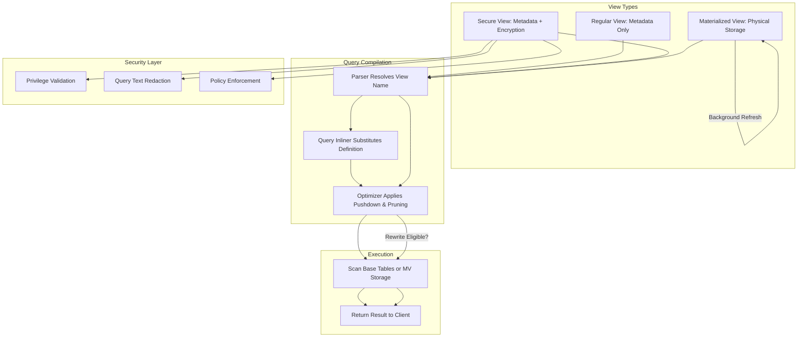
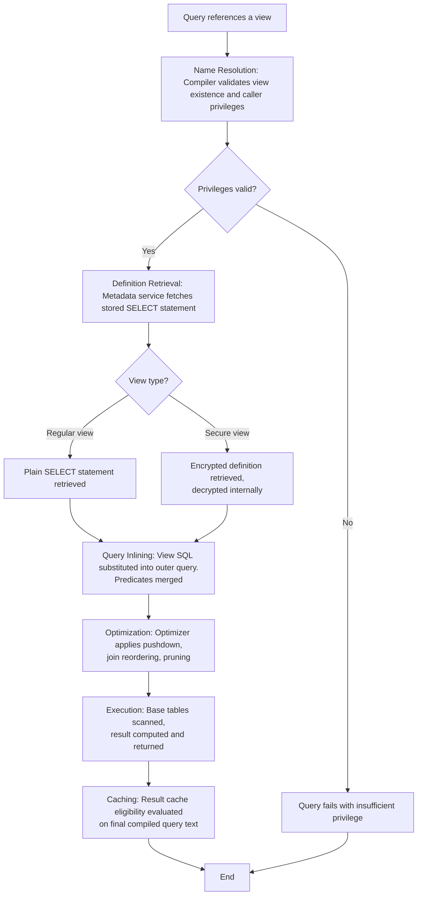
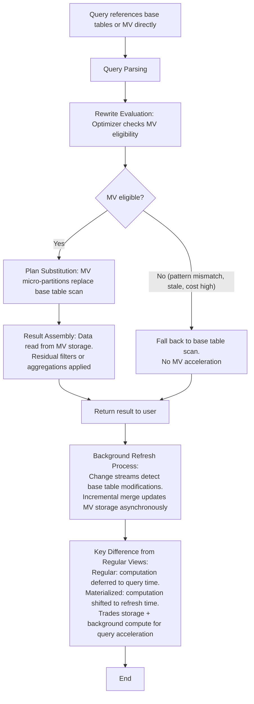
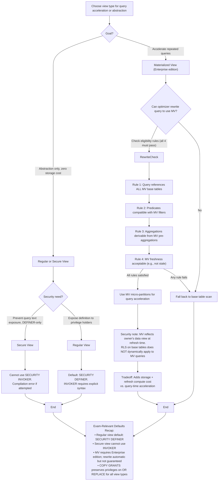
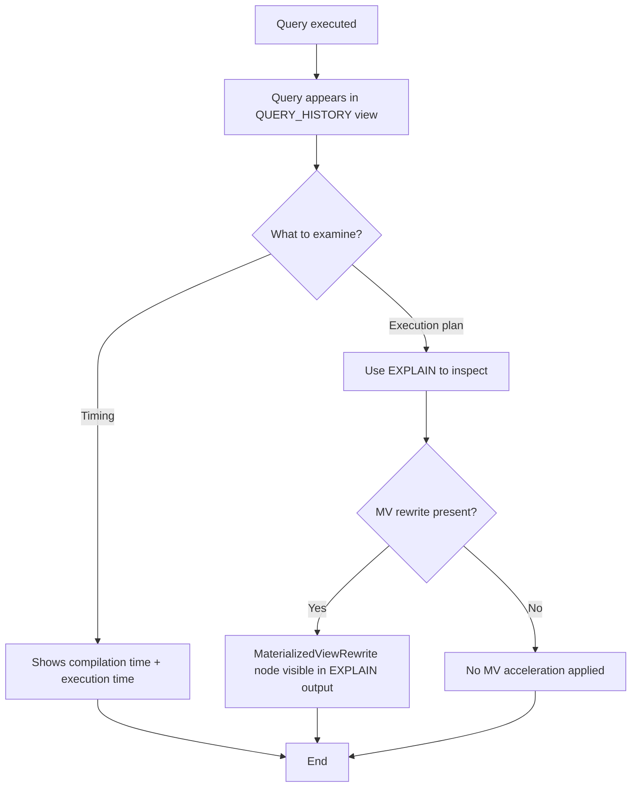

# 1. Views in Snowflake: Logical Abstraction and Physical Acceleration Patterns
Comparative documentation of regular, secure, and materialized view types, their execution models, security boundaries, and selection criteria for governed data consumption in Snowflake.

# 2. Overview
Views in Snowflake are named query definitions that abstract underlying data structures for consumption, governance, or performance optimization. Three distinct view types serve different architectural purposes: **Regular Views** provide zero-storage logical abstraction with query inlining; **Secure Views** add metadata obfuscation and strict privilege boundaries for compliance and multi-tenant isolation; **Materialized Views** pre-compute and maintain physical result sets for repeated query acceleration. The choice between view types depends on query pattern frequency, security requirements, freshness tolerance, and cost constraints. This documentation targets data architects designing consumption layers, security engineers implementing governed access, and SnowPro Advanced candidates tested on view mechanics, rewrite behavior, and edition-gated features.

# 3. SQL Object Summary

| Object/Feature | Type | Purpose | Source Objects/Inputs | Output/Behavior | Invocation |
|----------------|------|---------|----------------------|-----------------|------------|
| Regular View | Metadata-Only Logical Object | Reusable query abstraction, schema simplification | Tables, joins, filters, aggregations | Dynamic result compiled at query time | `SELECT * FROM view_name` |
| Secure View | Metadata-Only Logical Object with Security Boundary | Hide query logic, enforce access isolation, protect sensitive transformations | Tables, joins, filters, masking policies | Dynamic result with obfuscated execution plan | `SELECT * FROM secure_view_name` |
| Materialized View | Physical Table Object with Auto-Refresh | Pre-compute and maintain query results for repeated access | Tables, joins, aggregations, filters | Stored micro-partitions refreshed incrementally | `SELECT * FROM mv_name` or base table query with rewrite |

# 4. Architecture
All view types integrate into Snowflake's query compilation pipeline but differ in storage, security, and optimization behavior. Regular and secure views are metadata-only; their definitions are inlined during compilation. Materialized views store physical data and participate in query rewrite. Secure views add encryption and redaction layers to metadata access.

# 5. Data Flow / Process Flow

**Regular/Secure View Execution:**
1. **Name Resolution**: Compiler validates view existence and caller privileges.
2. **Definition Retrieval**: Metadata service fetches stored `SELECT` statement (encrypted for secure views).
3. **Query Inlining**: View SQL substituted into outer query; predicates merged.
4. **Optimization**: Optimizer applies pushdown, join reordering, pruning.
5. **Execution**: Base tables scanned; result computed and returned.
6. **Caching**: Result cache eligibility evaluated on final compiled query text.

**Materialized View Execution:**
1. **Query Parsing**: Incoming query references base tables or MV directly.
2. **Rewrite Evaluation**: Optimizer checks MV eligibility: pattern match, freshness, cost.
3. **Plan Substitution**: If eligible, MV micro-partitions replace base table scan.
4. **Result Assembly**: Data read from MV storage; residual filters/aggregations applied.
5. **Background Refresh**: Change streams detect base table modifications; incremental merge updates MV storage asynchronously.

**Key Difference**: Regular/secure views defer all computation to query time. Materialized views shift computation to refresh time, trading storage and background compute for query-time acceleration.

# 6. Logical Breakdown

| Component | Regular View | Secure View | Materialized View |
|-----------|-------------|-------------|------------------|
| **Storage** | None (metadata only) | None (metadata only, encrypted) | Physical micro-partitions |
| **Query Inlining** | Yes, full substitution | Yes, internal-only substitution | Optional via rewrite engine |
| **Security Context** | `DEFINER` (default) or `INVOKER` | Always `DEFINER`; `INVOKER` not supported | Always `DEFINER` for refresh |
| **Metadata Visibility** | `VIEW_DEFINITION` visible to privilege holders | `VIEW_DEFINITION` redacted for non-owners | MV definition visible; storage metrics exposed |
| **Refresh Behavior** | N/A (computed at query time) | N/A (computed at query time) | Incremental, asynchronous, serverless-managed |
| **Query Rewrite** | Not applicable | Not applicable | Automatic if pattern matches and cost favors |
| **SQL Pattern Restrictions** | None (any valid `SELECT`) | None (any valid `SELECT`) | Strict: no non-deterministic functions, limited joins, no subqueries in prohibited positions |
| **Edition Requirement** | All editions | All editions | Enterprise or higher |
| **Cloning Support** | Yes (`CLONE` command) | Yes (`CLONE` command) | No (recreation required) |

# 7. Data Model
Views do not define independent entities but expose logical or physical schemas derived from underlying queries.

| View Type | Input Grain | Output Grain | Persistence | Schema Evolution |
|-----------|------------|--------------|------------|-----------------|
| Regular View | Defined by base query | 1:1 with view projection | None (metadata only) | Base table changes may break compilation |
| Secure View | Defined by base query | 1:1 with view projection | None (encrypted metadata) | Same as regular; ownership required for updates |
| Materialized View | Defined by base query | 1:1 with view projection | Physical micro-partitions | Base table schema changes require MV recreation |

**Grain Consistency**: All view types preserve the grain of their defining `SELECT` statement. Aggregations, joins, and filters in the view definition determine output cardinality.

# 8. Business Logic (Execution Logic)
- **Abstraction vs Acceleration Tradeoff**: Regular/secure views provide logical abstraction with zero storage cost but no performance benefit. Materialized views add storage and refresh cost to accelerate repeated queries.
- **Security Boundary Enforcement**: Secure views prevent query text exposure and enforce `DEFINER`-only execution. Regular views expose definition to privilege holders. Materialized views reflect owner's data view at refresh time; RLS on base tables does not dynamically apply to MV queries.
- **Rewrite Eligibility Rules (MV Only)**: Optimizer rewrites queries to use MV only if: (1) query references all MV base tables, (2) predicates are compatible with MV filters, (3) aggregations are derivable from MV pre-aggregations, (4) MV freshness is acceptable.
- **Exam-Relevant Defaults**: 
  - Regular views default to `SECURITY DEFINER`; `INVOKER` requires explicit syntax.
  - Secure views cannot use `SECURITY INVOKER`; compilation error if attempted.
  - Materialized views require Enterprise edition; query rewrite is automatic but not guaranteed.
  - `COPY GRANTS` preserves privileges on `OR REPLACE` for all view types.

# 9. Transformations

| Source Input | Target Output | Rule/Logic | Execution Meaning | Impact |
|--------------|---------------|------------|-------------------|--------|
| Outer `WHERE` + View `WHERE` | Combined predicate tree | `AND` merging, constant folding | Enables single-pass filter evaluation | Preserves pruning if predicates are sargable |
| View `JOIN` + Outer `SELECT` columns | Flattened projection | Column alias substitution, unused join elimination | Reduces intermediate result size | Optimizer drops unreferenced joins |
| Aggregated MV + Outer Query Filter | Partial aggregation reuse | Optimizer pushes outer filter into MV scan if compatible | Avoids full MV scan; applies residual filtering | Requires predicate compatibility |
| Secure View + Masking Policy | Layered data protection | Masking applied post-view projection | Ensures sensitive values never exposed | Double-protection pattern; masking cannot be overridden |

# 10. Parameters / Variables / Configuration

| Name | Type | Purpose | Allowed Values/Format | Default | Where Used | Effect |
|------|------|---------|----------------------|---------|------------|--------|
| `CREATE [OR REPLACE] [SECURE] [MATERIALIZED] VIEW` | DDL Command | Define view type and behavior | Valid SQL `SELECT` statement | N/A | Schema DDL | Determines storage, security, and refresh behavior |
| `SECURITY DEFINER` / `INVOKER` | View Property | Control privilege evaluation context | Keyword | `DEFINER` | `CREATE VIEW` | `INVOKER` not supported for secure views |
| `CLUSTER BY` | MV Option | Define micro-partition sorting for pruning | Column list from `SELECT` output | Automatic from `GROUP BY` | `CREATE MATERIALIZED VIEW` | Affects refresh merge performance and query pruning |
| `AUTO_REFRESH` | MV Property | Enable/disable background refresh | `TRUE`/`FALSE` | `TRUE` | `ALTER MATERIALIZED VIEW` | `FALSE` suspends refresh; MV serves stale data |
| `QUERY_REWRITE_ENABLED` | Account Parameter | Global toggle for MV rewrite optimization | `TRUE`/`FALSE` | `TRUE` | Account configuration | Disables all MV rewrites when `FALSE` |
| `COPY GRANTS` | DDL Option | Preserve existing privileges on replace | Keyword | None | `CREATE OR REPLACE VIEW` | Maintains role assignments across DDL updates |

# 11. APIs / Interfaces
- **Management**: `CREATE VIEW`, `CREATE SECURE VIEW`, `CREATE MATERIALIZED VIEW`, `ALTER VIEW`, `DROP VIEW`, `DESCRIBE VIEW`, `SHOW VIEWS`
- **System Views**: 
  - `INFORMATION_SCHEMA.VIEWS`: Regular and secure view metadata (definition redacted for secure views)
  - `ACCOUNT_USAGE.VIEWS`: Owner-auditable view metadata
  - `ACCOUNT_USAGE.MATERIALIZED_VIEWS`: MV refresh status, row count, last refreshed timestamp
- **Dependency Tracking**: `OBJECT_DEPENDENCIES`, `ACCESS_HISTORY` map view consumption to underlying table scans
- **Error Behavior**: Compilation errors for invalid SQL, missing objects, or privilege gaps. MV-specific errors for unsupported patterns or refresh failures.

# 12. Execution / Deployment
- **Deployment**: All view types defined via SQL DDL. Regular/secure views store metadata only; materialized views execute initial materialization synchronously.
- **Execution Trigger**: Regular/secure views invoked inline within `SELECT` statements. Materialized views queried directly or via automatic rewrite.
- **Refresh Mechanism**: Only materialized views support background refresh via change streams and serverless compute. Regular/secure views compute at query time.
- **Environment Strategy**: Regular/secure views clone via `CLONE` command. Materialized views require recreation for environment promotion.
- **Runtime Assumptions**: Base table schema stability required for all view types. Materialized views additionally require pattern compatibility for rewrite eligibility.

# 13. Observability
- **Query History**: `QUERY_HISTORY` shows compilation and execution time. MV rewrite visible via `MaterializedViewRewrite` node in `EXPLAIN`.

- **Access Tracking**: `ACCESS_HISTORY` logs view consumption. Secure views redact underlying table references for non-owners.
- **Refresh Monitoring (MV Only)**: `MATERIALIZED_VIEW_REFRESH_HISTORY` shows refresh duration, rows processed, and status.
- **Cost Attribution**: 
  - Regular/secure views: Compute cost to querying warehouse; zero storage cost.
  - Materialized views: Compute cost for refresh (serverless pool) + storage cost for micro-partitions + reduced query compute when rewrite succeeds.
- **Rewrite Hit Rate**: Custom query against `QUERY_HISTORY` counting `MaterializedViewRewrite` events measures MV acceleration effectiveness.

# 14. Failure Handling & Recovery

| Failure Scenario | Regular View | Secure View | Materialized View |
|------------------|-------------|-------------|------------------|
| Underlying Table Dropped | Compilation error; fix by recreating table or updating view | Same as regular; error messages redacted for non-owners | Refresh fails; MV serves stale data; recreate MV after table restoration |
| Privilege Revocation | Query fails if caller lacks `SELECT` on view or base tables (depending on `SECURITY` flag) | Query fails if owner lacks privileges on base tables; caller needs only view `SELECT` | Refresh fails if owner lacks privileges; query may still succeed using stale MV data |
| Schema Drift (Column Rename/Drop) | Compilation error; update view definition | Same as regular; requires owner privileges to update | Refresh error; MV invalidation; recreate MV with updated references |
| Query Performance Degradation | Optimize base table clustering, push filters earlier | Same as regular; cannot optimize secure view logic directly | Tune MV clustering, verify rewrite eligibility, consider suspension if refresh cost exceeds benefit |
| Refresh Failure (MV Only) | N/A | N/A | Check `MATERIALIZED_VIEW_REFRESH_HISTORY`; resolve source data issues; resume or recreate MV |

# 15. Security & Access Control
- **Privilege Model**: 
  - Regular views: Caller needs `SELECT` on view; base table privileges checked based on `SECURITY` flag.
  - Secure views: Caller needs `SELECT` on view only; base table privileges validated against owner role.
  - Materialized views: Caller needs `SELECT` on MV; refresh executes with owner privileges.
- **Row-Level Security & Masking**: Policies evaluate after view inlining for regular/secure views. For materialized views, policies evaluate during refresh; MV stores already-filtered results.
- **Metadata Protection**: Secure views redact `VIEW_DEFINITION` in system views for non-owners. Regular views expose definition to privilege holders. Materialized views expose definition and storage metrics.
- **Data Sharing**: All view types can be shared via Snowflake Data Sharing. Secure views and materialized views are common patterns for governed data products.
- **Exam Note**: Secure views cannot be converted to regular views without recreation. Materialized views require Enterprise edition. `SECURITY INVOKER` is not supported for secure views.

# 16. Performance / Scalability Considerations
- **Regular/Secure Views**: 
  - Zero storage cost; compute cost shifts entirely to query time.
  - Query inlining enables optimizer pushdown and join elimination.
  - Complex nested views may increase compilation time; flatten into CTEs if needed.
- **Materialized Views**:
  - Storage cost for pre-computed results + background refresh compute.
  - Query acceleration when rewrite succeeds; fallback to base tables when ineligible.
  - Refresh latency asynchronous; staleness window depends on change volume and system load.
- **Pruning Interaction**: All view types preserve pruning if predicates reference raw, untransformed clustering keys. Function-wrapped columns disable pruning.
- **Result Caching**: Regular/secure views enable caching if compiled query text matches prior execution. Materialized views cache independently; rewrite eligibility does not guarantee cache hit.
- **Exam Trap**: Candidates assume views improve performance by default. Only materialized views accelerate queries; regular/secure views provide abstraction only. Performance depends on underlying table design and query pattern alignment.

# 17. Assumptions & Constraints
- Regular and secure views store zero data. All storage costs belong to underlying tables.
- Secure views always execute as `SECURITY DEFINER`; `INVOKER` is not supported.
- Materialized views require Enterprise edition or higher. This is an exam-critical licensing constraint.
- Materialized view SQL pattern restrictions are strict: no non-deterministic functions, limited join support, no prohibited subqueries.
- Query rewrite for materialized views is automatic but not guaranteed; optimizer cost model may prefer base tables.
- Schema changes to base tables do not propagate to any view type; recreation or `OR REPLACE` required for structural updates.
- SnowPro Advanced trap: Materialized view refresh uses serverless compute, not the creating warehouse. Cost attribution is to the account, not a specific warehouse.

# 18. Future Enhancements
- Introduce hybrid view types that combine secure metadata boundaries with materialized storage for governed acceleration.
- Add rewrite diagnostics view to expose why a query was not rewritten to use an eligible materialized view.
- Support incremental schema evolution for materialized views to add new columns from base tables without full recreation.
- Implement view-aware clustering recommendations based on actual query filter patterns in `QUERY_HISTORY`.
- Extend `EXPLAIN` to surface secure view optimization boundaries and materialized view freshness metrics for owner roles.
