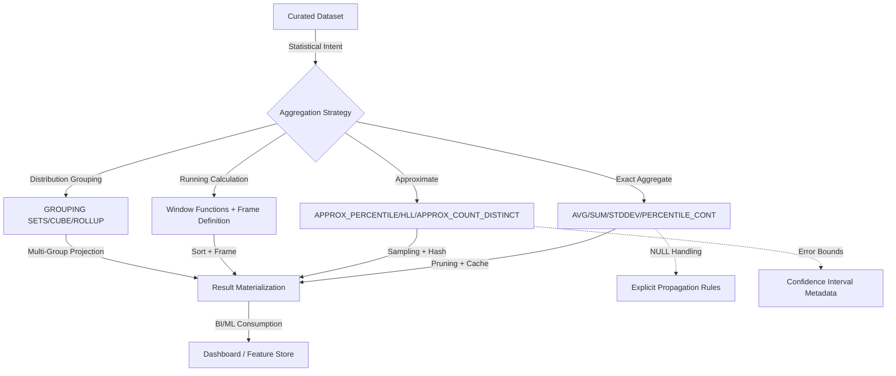

# Descriptive Analysis

# 1. Title
SnowPro Advanced: Descriptive Analysis & Statistical Aggregation Architecture

# 2. Overview
- **What it does**: Defines the deterministic execution of statistical functions, distribution analysis, window-based running calculations, and approximate aggregation primitives for exploratory data analysis within Snowflake.
- **Why it exists**: Descriptive statistics (central tendency, dispersion, correlation, percentiles) are foundational to data validation, anomaly detection, and business insight. Misapplied aggregation, incorrect NULL handling, or unbounded window frames produce mathematically invalid results, silent precision loss, or unbounded compute cost. Explicit statistical patterns ensure reproducible analysis, correct distribution modeling, and efficient execution at scale.
- **Where it fits**: Operates between curated staging layers and downstream consumption (BI dashboards, ML feature engineering, executive reporting). Governs how raw metrics are summarized, how distributions are characterized, and how statistical boundaries are enforced.
- **Intended consumer**: Analytics engineers, data analysts, data scientists, BI developers, and SnowPro Advanced candidates evaluating statistical function semantics, approximate aggregation tradeoffs, window frame mechanics, and NULL propagation rules.

# 3. SQL Object Summary
| Field | Value |
|-------|-------|
| Object Scope | Descriptive Statistical Analysis & Aggregation Framework |
| Type | Aggregate Functions, Window Functions, Approximate Statistics, GROUP BY Extensions |
| Purpose | Compute central tendency, dispersion, correlation, percentiles, and distribution metrics with deterministic precision and scalable execution |
| Source Objects | Curated fact tables, validated dimensions, time-series datasets, sampled subsets |
| Output Object | Statistical summaries, distribution profiles, running metrics, approximate aggregates, BI-ready metrics |
| Execution Mode | Batch aggregation, windowed computation, approximate sampling, incremental statistical updates |

# 4. Architecture
Descriptive analysis in Snowflake leverages a layered execution model: exact aggregates for small/medium datasets, approximate functions for large-scale distribution estimation, and window functions for running calculations. The architecture routes queries through optimized aggregation pipelines, with pruning and caching applied where deterministic.

# 5. Data Flow / Process Flow
| Step | Input | Transformation | Output | Purpose |
|------|-------|----------------|--------|---------|
| 1. Statistical Intent Resolution | Analytical query, metric definitions | Function selection (exact vs approximate), NULL policy, frame definition | Execution plan with aggregation strategy | Align business question to optimal statistical primitive |
| 2. Data Pruning & Sampling | Filtered dataset, clustering keys, sample clause | Micro-partition elimination, Bernoulli/systematic sampling | Reduced row set for aggregation | Minimize scanned data while preserving distribution fidelity |
| 3. Aggregation Execution | Pruned/sampled rows, grouping keys | Exact aggregate computation, approximate sketch building, window sort | Statistical metrics, distribution sketches, running values | Compute central tendency, dispersion, correlation, or percentile estimates |
| 4. NULL & Precision Handling | Intermediate aggregates, NULL patterns | Explicit NULL propagation, precision rounding, type casting | Final statistical values with documented NULL semantics | Ensure mathematically valid results, prevent silent data loss |
| 5. Result Projection & Caching | Final metrics, query context | Column aliasing, confidence interval annotation, cache key generation | BI-ready result set, cache entry | Deliver deterministic output, enable subsequent cache hits for identical analysis |

# 6. Logical Breakdown of the SQL
| Component | Responsibility | Inputs | Outputs | Dependencies | Failure Modes / Risks |
|-----------|----------------|--------|---------|--------------|-----------------------|
| Exact Aggregate Functions | Central tendency & dispersion | Numeric columns, grouping keys, NULL handling flags | `AVG`, `SUM`, `STDDEV`, `VAR`, `CORR`, `COVAR_POP` | Valid numeric types, sufficient row count | `AVG` ignores NULLs; `STDDEV` returns NULL for <2 rows; precision loss on large sums |
| Approximate Statistical Functions | Large-scale distribution estimation | Columns, error tolerance parameters | `APPROX_PERCENTILE`, `APPROX_COUNT_DISTINCT`, `HLL_ACCUMULATE` | Large dataset (>1M rows), acceptable error margin | Approximation error up to ±1-2%; not suitable for exact financial reporting |
| Window Functions | Running calculations & peer-group stats | Partition keys, order clauses, frame definitions | `AVG() OVER()`, `PERCENT_RANK`, `CUME_DIST`, running totals | Deterministic ordering, memory for sort | Unbounded frames increase memory; non-deterministic `ORDER BY` breaks rank consistency |
| GROUP BY Extensions | Multi-dimensional aggregation | Grouping columns, aggregation functions | `GROUPING SETS`, `CUBE`, `ROLLUP` projections | Stable grouping keys, memory for combinatorial expansion | Combinatorial explosion on high-cardinality groups; `GROUPING_ID` required for interpretation |
| NULL Propagation Logic | Controls missing value impact | Aggregate functions, `IGNORE NULLS`/`RESPECT NULLS` flags | NULL-aware statistical results | Explicit NULL policy per metric | Default `IGNORE NULLS` masks data quality issues; `RESPECT NULLS` propagates gaps |
| Sampling Strategy | Reduces compute for exploratory analysis | `TABLESAMPLE` clause, seed values, sampling method | Representative subset for statistical estimation | Large base table, acceptable confidence interval | Bernoulli sampling may skew rare events; systematic sampling requires sorted input |

# 7. Data Model
| Entity | Role | Important Fields | Grain | Relationships | Keys | Null Handling |
|--------|------|------------------|-------|---------------|------|---------------|
| `STATISTICAL_METRIC_REGISTRY` | Definition of analytical metrics | `METRIC_NAME`, `AGGREGATION_TYPE`, `NULL_POLICY`, `PRECISION_SCALE`, `CONFIDENCE_LEVEL` | 1 row = 1 statistical metric definition | Maps to curated tables, BI semantic layer | `METRIC_ID` | `NULL_POLICY` dictates propagation: `IGNORE`, `RESPECT`, or `COALESCE` |
| `DISTRIBUTION_PROFILE` | Output of descriptive analysis | `GROUP_KEY`, `METRIC_NAME`, `VALUE`, `SAMPLE_SIZE`, `CONFIDENCE_INTERVAL`, `COMPUTED_TS` | 1 row = 1 metric per group | Feeds dashboards, ML feature stores, alerting thresholds | Composite: `GROUP_KEY` + `METRIC_NAME` + `COMPUTED_TS` | `VALUE` NULL if insufficient data; `CONFIDENCE_INTERVAL` NULL for exact aggregates |
| `WINDOW_STATE_TRACKER` | Running calculation state | `PARTITION_KEY`, `ORDER_KEY`, `FRAME_BOUNDARY`, `RUNNING_VALUE`, `ROW_NUMBER` | 1 row = 1 window evaluation point | Supports incremental running stats, anomaly detection | `PARTITION_KEY` + `ORDER_KEY` | NULL on first row of partition; frame boundaries define valid range |

**Output Grain**: Determined by grouping strategy. Exact aggregates = 1 row per `GROUP BY` key. Approximate functions = 1 row per estimation context. Window functions = 1 row per input row (unless `QUALIFY` filters). Grain mismatch between statistical output and consumption layer causes misaligned dashboards or ML feature drift.

# 8. Business Logic
| Rule | Effect | Implementation Pattern | Edge Case |
|------|--------|------------------------|-----------|
| **NULL Propagation Policy** | Controls missing value impact on aggregates | `AVG(col)` ignores NULLs; `AVG(COALESCE(col, 0))` treats as zero | Business logic determines whether NULL = missing or zero; misalignment skews averages |
| **Approximate vs Exact Selection** | Balances precision vs compute cost | `APPROX_PERCENTILE(col, 0.95)` for >10M rows; `PERCENTILE_CONT(0.95)` for exact | Approximate functions have ±1-2% error; unsuitable for financial close or regulatory reporting |
| **Window Frame Definition** | Determines running calculation scope | `ROWS BETWEEN UNBOUNDED PRECEDING AND CURRENT ROW` vs `RANGE` semantics | `RANGE` includes peer values; `ROWS` is physical offset. Misselection changes running total logic |
| **GROUPING SETS Interpretation** | Enables multi-dimensional rollup | `GROUPING_ID(col1, col2)` to distinguish subtotal rows | Without `GROUPING_ID`, subtotal rows indistinguishable from detail; causes double-counting in BI |
| **Sampling Representativeness** | Ensures statistical validity of subsets | `TABLESAMPLE BERNOULLI (10) SEED (42)` for reproducibility | Small samples (<1% of population) may miss rare events; requires confidence interval annotation |
| **Precision Rounding** | Controls decimal display vs storage | `ROUND(AVG(col), 2)` for display; store full precision for downstream | Premature rounding accumulates error in nested aggregates; round only at presentation layer |

# 9. Transformations
| Source | Derived | Formula / Rule | Business Meaning | Impact |
|--------|---------|----------------|------------------|--------|
| Raw numeric column | Central tendency metrics | `AVG(col)`, `MEDIAN(col)`, `PERCENTILE_CONT(0.5) WITHIN GROUP (ORDER BY col)` | Typical value estimation for business KPIs | `MEDIAN` requires sort; `PERCENTILE_CONT` interpolates; both ignore NULLs by default |
| Paired numeric columns | Correlation & covariance | `CORR(x, y)`, `COVAR_POP(x, y)`, `REGR_SLOPE(y, x)` | Relationship strength for predictive modeling | Requires paired non-NULL values; returns NULL if <2 valid pairs |
| Large categorical column | Distinct count estimation | `APPROX_COUNT_DISTINCT(col)`, `HLL_ACCUMULATE(col)` | Cardinality estimation for user/session analytics | ±1-2% error; 100-1000x faster than exact `COUNT(DISTINCT)` on large datasets |
| Time-series metric | Running aggregation | `SUM(metric) OVER(PARTITION BY id ORDER BY ts ROWS UNBOUNDED PRECEDING)` | Cumulative totals for trend analysis | Frame definition critical: `ROWS` vs `RANGE` changes inclusion logic |
| Multi-dimensional grouping | Rollup/subtotal metrics | `GROUP BY ROLLUP(region, category)`, `GROUPING_ID(region, category)` | Hierarchical business reporting | `GROUPING_ID` distinguishes detail vs subtotal; required for correct BI interpretation |

# 10. Parameters / Variables / Macros
| Name | Type | Purpose | Allowed Format | Default | Usage | Effect on Output |
|------|------|---------|----------------|---------|-------|------------------|
| `NULL_POLICY` | Enum | Controls NULL handling in aggregates | `IGNORE`, `RESPECT`, `COALESCE_ZERO` | `IGNORE` | Metric definition | `IGNORE` skips NULLs; `RESPECT` propagates; `COALESCE_ZERO` treats as zero |
| `APPROXIMATION_ERROR_TOLERANCE` | Float | Acceptable error margin for approximate functions | 0.001–0.05 (0.1%–5%) | 0.01 (1%) | `APPROX_PERCENTILE`, `HLL` functions | Tighter tolerance increases compute; looser tolerance risks business-invalid results |
| `WINDOW_FRAME_TYPE` | Enum | Defines running calculation boundary | `ROWS`, `RANGE`, `GROUPS` | `ROWS` | Window function definition | `ROWS` = physical offset; `RANGE` = value-based; `GROUPS` = peer-group |
| `SAMPLING_METHOD` | Enum | Subset selection strategy | `BERNOULLI`, `SYSTEM`, `BLOCK` | `BERNOULLI` | `TABLESAMPLE` clause | `BERNOULLI` = random row; `SYSTEM` = block-level; `BLOCK` = micro-partition |
| `CONFIDENCE_LEVEL` | Float | Statistical confidence for intervals | 0.90, 0.95, 0.99 | 0.95 | Approximate function output annotation | Higher confidence widens interval; affects decision thresholds |
| `PRECISION_ROUNDING` | Integer | Decimal places for presentation | 0–10 | 2 | Final projection `ROUND()` | Premature rounding accumulates error; apply only at BI layer |

# 11. APIs / Interfaces
| Interface | Invocation Method | Input Structure | Output Structure | Error Behavior | Consumers |
|-----------|-------------------|-----------------|------------------|----------------|-----------|
| Aggregate Functions (`AVG`, `STDDEV`, etc.) | SQL | Numeric column, optional `DISTINCT`/`FILTER` | Scalar statistical value | Returns NULL on insufficient data; type mismatch raises error | BI dashboards, analytical queries, validation pipelines |
| Approximate Functions (`APPROX_PERCENTILE`, etc.) | SQL | Column, error tolerance parameter | Approximate scalar value | Fails on non-numeric input; returns NULL on empty set | Large-scale analytics, exploratory analysis, feature engineering |
| Window Functions (`OVER`, `QUALIFY`) | SQL | Partition/order clauses, frame definition | Row-level statistical value | Syntax error on misplaced clause; memory spill on large partitions | Running totals, peer-group ranking, time-series analysis |
| GROUP BY Extensions (`ROLLUP`, `CUBE`) | SQL | Grouping columns, aggregate functions | Multi-level aggregated rows | Combinatorial explosion on high-cardinality groups | Executive reporting, multi-dimensional dashboards |
| `TABLESAMPLE` Clause | SQL | Sampling percentage, method, seed | Representative subset | Returns empty if sample size <1 row; seed ensures reproducibility | Exploratory analysis, model training subsets, performance testing |

# 12. Execution / Deployment
- **Manual vs Scheduled**: Descriptive analysis runs ad-hoc via BI tools or scheduled via `TASK` for metric refresh. Approximate functions favored for large-scale scheduled jobs.
- **Batch vs Incremental**: Exact aggregates require full dataset scan. Running window calculations can incrementally update if ordered and bounded. Approximate sketches support merge operations for incremental estimation.
- **Orchestration**: CI/CD validates statistical metric definitions, enforces NULL policies, and blocks deployments on ambiguous aggregation logic. Airflow/Dagster manage warehouse scaling for heavy statistical jobs.
- **Upstream Dependencies**: Data quality (NULL patterns), clustering on grouping keys, warehouse memory for window sorts, retention policies for historical distributions.
- **Environment Behavior**: Dev/test use exact aggregates on sampled data. Prod uses approximate functions for large datasets, explicit NULL policies, and confidence interval annotation.
- **Runtime Assumptions**: Aggregate functions ignore NULLs by default. Window functions require deterministic `ORDER BY` for reproducible results. Approximate functions have bounded error but are non-deterministic across executions.

# 13. Observability
| Metric | Implementation | Detection Method | Operational Threshold |
|--------|----------------|------------------|------------------------|
| Aggregate NULL ratio | `COUNT(*) - COUNT(col) / COUNT(*)` per metric | Validation query per batch | >5% NULLs = upstream data quality issue; requires NULL policy review |
| Approximation error drift | Compare `APPROX_PERCENTILE` vs `PERCENTILE_CONT` on sample | A/B testing query | >2% deviation = tighten error tolerance or switch to exact for critical metrics |
| Window sort memory usage | `QUERY_HISTORY.SPILLED_BYTES` for window operators | Profile UI, alerting | >1GB spill = reduce partition size, narrow frame, or pre-aggregate |
| GROUP BY combinatorial explosion | `COUNT(DISTINCT GROUPING_ID(...))` vs input cardinality | Query planning analysis | >10x expansion = reduce grouping dimensions or use materialized subtotals |
| Sampling representativeness | Compare sample distribution vs population KS-test | Statistical validation query | p-value <0.05 = sample not representative; increase sample size or adjust method |

# 14. Failure Handling & Recovery
| Failure Scenario | What Breaks | Detection | Fallback Behavior | Recovery Approach |
|------------------|-------------|-----------|-------------------|-------------------|
| NULL propagation mismatch | Aggregates produce invalid business metrics | Metric value deviates from expected range | Dashboard shows incorrect KPIs; ML features drift | Enforce explicit `NULL_POLICY` in metric registry; add validation assertions |
| Approximate function error exceeds tolerance | Business decisions based on inaccurate percentiles | A/B test shows >2% deviation from exact | Regulatory/reporting violations; incorrect anomaly thresholds | Switch to exact aggregate for critical metrics; increase sample size for approximation |
| Window frame misdefinition | Running totals include/exclude wrong rows | Row-level comparison vs expected cumulative logic | Trend analysis shows artificial jumps/drops | Validate frame type (`ROWS` vs `RANGE`); add `QUALIFY` for post-window filtering |
| GROUPING SETS interpretation error | Subtotal rows double-counted in BI | `GROUPING_ID` not used; BI aggregates subtotals again | Executive reports show inflated metrics | Enforce `GROUPING_ID` in all multi-dimensional queries; document interpretation rules |
| Sampling bias on rare events | Exploratory analysis misses outliers | Sample distribution KS-test fails | Anomaly detection fails; model training biased | Increase sample size; use stratified sampling; annotate confidence intervals |
| Memory spill during window sort | Query timeout or degraded performance | `SPILLED_BYTES` spike, long `TOTAL_ELAPSED_TIME` | Analysis delayed; warehouse credits wasted | Narrow window frame; pre-filter partitions; scale warehouse or use incremental approach |

# 15. Security & Access Control
| Control | Implementation | Effect |
|---------|----------------|--------|
| Metric-level access control | `ROW ACCESS POLICY` on statistical output tables | Restricts sensitive aggregates (e.g., salary averages) by role/domain |
| Dynamic data masking on aggregates | `MASKING POLICY` applied to statistical columns | Redacts precise values for unauthorized roles; shows rounded/approximate |
| Approximate function governance | Restrict `APPROX_*` usage to approved analytical roles | Prevents approximate results in financial/regulatory reporting |
| Sampling privilege separation | Limit `TABLESAMPLE` to data science roles | Prevents unauthorized subset extraction that may bypass RLS |
| Audit logging | `ACCESS_HISTORY` + `QUERY_HISTORY` tracking statistical queries | Traces who computed which metrics, when, and with what parameters |

# 16. Performance / Scalability Considerations
| Bottleneck | Cause | Tradeoff | Mitigation |
|------------|-------|----------|------------|
| Large exact aggregate scans | `AVG`/`STDDEV` on unpruned large tables | Full micro-partition scan, high credit consumption | Pre-aggregate to summary tables; use clustering on grouping keys; apply search optimization |
| Window sort memory pressure | Unbounded `OVER` clauses on high-cardinality partitions | Remote spill, query timeout, degraded performance | Narrow frame definition; pre-filter partitions; use `QUALIFY` to reduce output rows |
| Approximate function overhead | `APPROX_PERCENTILE` with tight error tolerance | Increased compute for sketch building, marginal accuracy gain | Use default 1% tolerance; switch to exact only for critical metrics |
| GROUP BY combinatorial explosion | `CUBE` on 4+ high-cardinality dimensions | Exponential row expansion, memory pressure | Use `ROLLUP` for hierarchical needs; materialize common subtotals; limit dimensions |
| NULL-heavy aggregation | Columns with >50% NULLs | Wasted compute scanning NULLs; misleading averages | Pre-filter NULLs; use `COALESCE` with business-appropriate defaults; document NULL policy |
| Non-sargable statistical filters | `WHERE STDDEV(col) > threshold` in outer query | Disables pruning; forces full scan before aggregation | Pre-compute statistical thresholds; filter on base columns; use materialized statistical views |

# 17. Assumptions & Constraints
- **Aggregate functions ignore NULLs by default**: `AVG`, `SUM`, `STDDEV` exclude NULL values. Business logic must explicitly handle NULL = missing vs NULL = zero via `COALESCE`.
- **Approximate functions have bounded error**: `APPROX_PERCENTILE`, `APPROX_COUNT_DISTINCT` guarantee ±1-2% error but are non-deterministic across executions. Not suitable for exact financial reporting.
- **Window frames require deterministic ordering**: `ORDER BY` in window functions must be deterministic for reproducible results. Non-deterministic ordering (e.g., `ORDER BY RANDOM()`) breaks running calculations.
- **GROUPING SETS require interpretation metadata**: `GROUPING_ID` is mandatory to distinguish detail rows from subtotals in `ROLLUP`/`CUBE` output. Without it, BI tools may double-count.
- **Sampling is not representative by default**: `TABLESAMPLE` uses Bernoulli random selection. Rare events may be missed; stratified sampling requires manual implementation.
- **Precision is preserved until projection**: Snowflake maintains full numeric precision through aggregation. Rounding should occur only at presentation layer to avoid cumulative error.
- **Exam trap assumptions**: SnowPro Advanced tests NULL handling in aggregates, approximate function error bounds, window frame semantics (`ROWS` vs `RANGE`), `GROUPING_ID` interpretation, sampling representativeness limits, and precision propagation rules. Memorize defaults and statistical semantics.

# 18. Future Enhancements
- **Automate NULL policy enforcement**: Embed `NULL_POLICY` definitions in metric registry; validate queries against policy in CI/CD; block deployments with ambiguous NULL handling.
- **Implement adaptive approximation selection**: Build query planner hint that auto-selects `APPROX_*` vs exact based on row count, error tolerance, and metric criticality.
- **Standardize window frame contracts**: Enforce explicit `ROWS`/`RANGE` specification in all window functions; lint queries during development; document business meaning of frame type.
- **Integrate statistical validation gates**: Add automated KS-tests, confidence interval checks, and representativeness validation to exploratory analysis pipelines.
- **Materialize common statistical aggregates**: Pre-compute frequently accessed metrics (daily averages, rolling std dev) into summary tables; refresh incrementally via `MERGE`.
- **Harden approximate function governance**: Restrict `APPROX_*` usage to approved analytical roles; require confidence interval annotation in output; audit usage in regulatory contexts.
