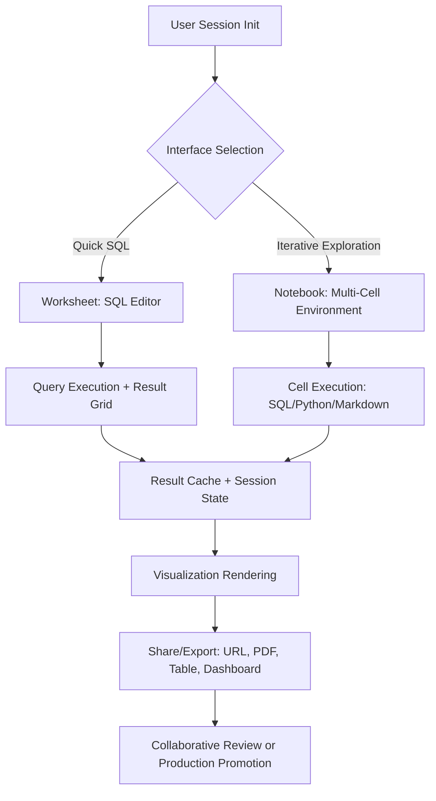

# 1. Title
Exploratory Ad-Hoc Analysis Using Snowflake Notebooks and Worksheets

# 2. Overview
This pattern defines the procedural architecture for conducting iterative, hypothesis-driven data exploration using Snowflake's native Notebooks and Worksheets interfaces. It exists to enable rapid data profiling, descriptive statistics computation, and visual discovery without requiring external tooling or pipeline commitments. The pattern operates in the interactive analysis layer, leveraging Snowflake's unified compute context, session state management, and result caching. It is consumed by data analysts, data scientists, exploratory engineers, and SnowPro Advanced candidates evaluating session isolation, result persistence, and collaborative sharing boundaries.

# 3. SQL Object Summary
| Object/Pattern | Type | Purpose | Source Objects/Inputs | Output Objects/Behavior | Execution Mode |
|----------------|------|---------|------------------------|--------------------------|----------------|
| Exploratory Analysis Session | Interactive Workflow Pattern | Enable iterative query execution, result visualization, and narrative documentation | Tables, views, stages, Python libraries, SQL scripts | Transient result sets, visualizations, notebook cells, shared URLs | Synchronous, user-driven execution with optional result caching |

# 4. Architecture
Snowflake Notebooks and Worksheets share a unified execution engine but differ in interface capabilities. Worksheets provide a SQL-only, lightweight environment for quick queries and result inspection. Notebooks extend this with multi-language support (SQL, Python, Markdown), cell-based execution, variable persistence, and rich output rendering. Both leverage the same warehouse, session context, and result cache, enabling seamless transition between exploratory and production workflows.

# 5. Data Flow / Process Flow
1. **Session Initialization & Context Binding**
   - Input: User credentials, role, warehouse assignment, database/schema context
   - Transformation: Session object created with isolated compute context and result cache
   - Output: Active worksheet or notebook with bound warehouse and default namespace
   - Purpose: Establish execution environment with appropriate privileges and resource allocation

2. **Query/Code Authoring & Execution**
   - Input: SQL statements, Python code, or Markdown cells
   - Transformation: Parser routes SQL to Snowflake engine, Python to Snowpark runtime; results captured in session state
   - Output: Result set (tabular), visualization object, or rendered Markdown
   - Purpose: Enable iterative hypothesis testing with immediate feedback

3. **Result Inspection & Iteration**
   - Input: Executed cell output, variable references, filter controls
   - Transformation: User refines query logic, adjusts parameters, or adds new cells based on observed results
   - Output: Updated result set, new visualizations, or documented insights
   - Purpose: Support exploratory loop: observe → hypothesize → test → refine

4. **Collaboration & Promotion**
   - Input: Completed notebook/worksheet, sharing permissions, target destination
   - Transformation: Content exported as shareable URL, PDF, or promoted to production table/view
   - Output: Shared artifact or persistent database object
   - Purpose: Transition insights from exploration to consumption or operationalization

# 6. Logical Breakdown
| Component | Responsibility | Inputs | Outputs | Dependencies | Failure Modes / Risks |
|-----------|----------------|--------|---------|--------------|------------------------|
| `session_manager` | Establish isolated execution context | User role, warehouse, database/schema | Session object with cache, variables, cursor | Role privileges; warehouse availability | Session timeout or warehouse suspend interrupts workflow |
| `query_router` | Dispatch code to appropriate engine | SQL/Python/Markdown cell content | Executed result + metadata | Syntax validity; library availability | Python cell fails if Snowpark library not enabled |
| `result_cache` | Store and reuse query outputs | Query hash, result set, TTL | Cached result for identical subsequent query | Result cache enabled; query determinism | Non-deterministic functions (`RANDOM()`) bypass cache |
| `visualization_engine` | Render tabular results as charts | Result set, chart type, axis mapping | Interactive chart object | Result cardinality within render limits | Large result sets (>10K rows) truncate or fail to render |
| `sharing_service` | Generate shareable artifacts | Notebook/worksheet content, permissions | Public URL, PDF export, or promoted object | Share privilege; target object permissions | Shared URL expires or access revoked breaks downstream references |

# 7. Data Model (State Model)
| Object | Role | Important Fields | Grain | Relationships | Null Handling |
|--------|------|------------------|-------|---------------|---------------|
| `session_context` | Runtime execution state | `session_id`, `role`, `warehouse`, `current_database`, `result_cache_ttl` | Per user session | Links to executed queries, cached results | `result_cache_ttl` defaults to 24h; `NULL` if caching disabled |
| `notebook_cell` | Executable unit of work | `cell_id`, `cell_type`, `code_content`, `execution_order`, `output_payload` | Per cell per notebook | Ordered sequence within notebook; references session variables | `output_payload` is `NULL` pre-execution or on error |
| `exploratory_result` | Transient analysis output | `result_id`, `query_hash`, `row_count`, `column_schema`, `cache_expiry` | Per unique query execution | Linked to session; may be promoted to persistent table | Schema inferred at execution; `NULL` values preserved from source |
| `shared_artifact` | Collaborative output | `artifact_id`, `share_url`, `expiry_timestamp`, `access_role` | Per share operation | References source notebook/worksheet; independent of source edits | `expiry_timestamp` may be `NULL` for non-expiring shares |

Output Grain: One session context per user connection. One cell record per notebook cell execution. One result record per unique query hash within cache TTL. One share record per explicit sharing action.

# 8. Business Logic (Execution Logic)
- **Session Isolation Rules**: Each worksheet/notebook session is isolated. Variables, cursors, and temporary objects do not persist across sessions unless explicitly saved to database.
- **Result Caching Semantics**: Identical query text with identical session context (role, warehouse, database) returns cached result within TTL (default 24h). Non-deterministic functions (`CURRENT_TIMESTAMP()`, `RANDOM()`) or session parameters bypass cache.
- **Cell Execution Order**: Notebook cells execute sequentially by default. Dependencies between cells require explicit execution order; out-of-order execution may reference undefined variables.
- **Visualization Limits**: Charts render up to 10,000 rows by default. Larger result sets require aggregation or sampling before visualization.
- **Sharing Permissions**: Shared URLs grant `SELECT` access to underlying query results, not source tables. Recipients must have appropriate role privileges to view shared content.
- **Promotion Workflow**: Results promoted to production via `CREATE TABLE AS` or `CREATE VIEW AS` inherit source query semantics but lose session-specific context (e.g., temporary UDFs).
- **Exam-Relevant Defaults**: Result cache TTL is 24h unless overridden by `RESULT_CACHE_ACTIVE` session parameter. Worksheets do not support Python or Markdown. Notebooks require `CREATE NOTEBOOK` privilege. Shared URLs expire after 30 days by default unless configured otherwise. `CURRENT_ROLE()` and `CURRENT_WAREHOUSE()` reflect session context, not object ownership.

# 9. Transformations (State Transitions)
| Source State | Derived State | Rule / Evaluation Logic | Meaning | Impact |
|--------------|---------------|-------------------------|---------|--------|
| `raw_query_text` | `cached_result` | Query hash matches existing cache entry + TTL valid | Reuse prior computation without re-execution | Reduces warehouse credits; may return stale data if source changed |
| `python_cell_code` | `snowpark_dataframe` | Snowpark translator converts Python to Snowflake-optimized query | Enables Pythonic data manipulation with pushdown to engine | Maintains performance; requires Snowpark library enabled |
| `tabular_result` | `visual_chart` | Chart engine samples/aggregates result per axis mapping | Converts raw data to visual insight | Large results truncated; aggregation may obscure outliers |
| `exploratory_insight` | `promoted_object` | `CREATE TABLE AS (exploratory_query)` | Persists transient result to durable schema | Loses session context; requires explicit schema definition |
| `notebook_content` | `shared_url` | Content serialized + access token generated | Enables collaborative review without source access | URL expiry or permission revocation breaks access |

# 10. Parameters / Variables / Configuration
| Name | Type | Purpose | Allowed Values | Default | Where Used | Effect |
|------|------|---------|----------------|---------|------------|--------|
| `RESULT_CACHE_ACTIVE` | Session Parameter | Enable/disable result caching | `TRUE`, `FALSE` | `TRUE` | Query execution | `FALSE` forces re-execution; increases credits but ensures freshness |
| `STATEMENT_TIMEOUT_IN_SECONDS` | Session Parameter | Limit query execution duration | 0 (unlimited) to 172800 (48h) | 172800 | Query execution | Prevents runaway exploratory queries from consuming excessive credits |
| `PYTHON_RUNTIME_VERSION` | Notebook Setting | Specify Python interpreter version | `3.8`, `3.9`, `3.10`, `3.11` | Account default | Notebook cell execution | Library compatibility depends on runtime version |
| `SHARE_URL_EXPIRY_DAYS` | Object Parameter | Control shared artifact lifespan | 1–365 days | 30 | Share configuration | Shorter expiry improves security; longer expiry aids collaboration |
| `VISUALIZATION_ROW_LIMIT` | UI Setting | Cap rows rendered in charts | 1,000–100,000 | 10,000 | Chart rendering | Higher limits increase browser memory usage; may cause timeout |

# 11. APIs / Interfaces
| Interface | Invocation Method | Input Structure | Output Structure | Error Behavior | Consumers |
|-----------|-------------------|-----------------|------------------|----------------|-----------|
| Worksheet SQL Editor | UI / REST API | SQL text, session context | Result grid + query metrics | Fails on syntax errors or privilege violations | Analysts, ad-hoc query authors |
| Notebook Cell Execution | UI / REST API | Cell content (SQL/Python/Markdown), execution order | Cell output + variable state | Fails on runtime errors; partial state preserved | Data scientists, exploratory engineers |
| `SYSTEM$RESULT_CACHE_INFO(query_hash)` | SQL Function | Query hash or text | Cache status, TTL remaining, size bytes | Returns `NULL` if caching disabled or query not cached | Performance analysts validating cache hits |
| Share URL Generation | UI / API | Notebook/worksheet ID, expiry, role filter | Public URL + access token | Fails if insufficient `SHARE` privilege | Collaborators, stakeholders |
| Promote to Table/View | SQL DDL | `CREATE TABLE/VIEW AS (notebook_query)` | Persistent database object | Fails on schema mismatch or privilege violation | Engineers operationalizing insights |

# 12. Execution / Deployment
- Executed interactively via Snowsight UI or programmatically via REST API for automated exploration workflows.
- Session state persists for duration of connection or until timeout; notebooks save cell state to account storage for later resume.
- Upstream dependency: Source objects must be accessible to user role; warehouse must be running or auto-resume enabled.
- Environment behavior: Dev/test warehouses may use smaller sizes for cost control; production exploration may require larger warehouses for complex profiling.
- Runtime assumption: Exploratory queries may scan large volumes; implement row limits or sampling to control credit consumption.

# 13. Observability
- Track cache efficiency: `SELECT SYSTEM$RESULT_CACHE_INFO('query_hash');` monitors hit rate and TTL status.
- Monitor session resource usage: `ACCOUNT_USAGE.QUERY_HISTORY` filtered on `SESSION_ID` shows credits consumed per exploration session.
- Validate visualization performance: Browser dev tools or Snowsight telemetry track chart render time vs result cardinality.
- Alert on long-running exploratory queries: Resource monitor triggers alert when `STATEMENT_TIMEOUT_IN_SECONDS` threshold approached.
- Implement usage audit: Log notebook shares and promotions via custom audit table to track insight propagation.

# 14. Failure Handling & Recovery
- **Session timeout during long execution**: Query aborts mid-execution. Detection: "Session expired" error. Recovery: Increase `STATEMENT_TIMEOUT_IN_SECONDS`, save intermediate results to table, or break query into smaller cells.
- **Result cache staleness**: Cached result does not reflect source data changes. Detection: Row count or value mismatch vs direct query. Recovery: Disable cache via `RESULT_CACHE_ACTIVE = FALSE` for critical freshness, or manually invalidate via query modification.
- **Python library import failure**: Notebook cell fails due to missing Snowpark package. Detection: ImportError in cell output. Recovery: Enable Snowpark library at account level or switch to SQL-only cell.
- **Visualization render timeout**: Browser hangs on large result set. Detection: UI freeze or "render failed" message. Recovery: Apply `LIMIT`, aggregate before charting, or export to CSV for external tool.
- **Shared URL access denied**: Recipient cannot view shared content. Detection: 403 error on URL access. Recovery: Grant recipient role `USAGE` on shared object or extend share permissions.

# 15. Security & Access Control
- Worksheets and Notebooks inherit standard RBAC: user must have `USAGE` on warehouse, `SELECT` on source objects.
- Notebook Python cells execute with same privileges as SQL; Snowpark operations cannot escalate beyond session role.
- Shared URLs grant access to query results only, not underlying tables. Recipients cannot modify source or view unshared columns.
- Dynamic Data Masking and Row Access Policies evaluate at query execution; masked values appear in exploratory results per policy.
- Audit sharing actions via `ACCOUNT_USAGE.SHARE_HISTORY` (if available) or custom logging to track insight distribution.

# 16. Performance / Scalability Considerations
- Exploratory queries without `LIMIT` or sampling may scan entire tables, consuming significant credits. Always apply row limits during initial profiling.
- Result cache reduces redundant execution but may return stale data. Balance freshness needs against credit savings.
- Python cells in Notebooks incur translation overhead to Snowpark; complex Pandas-style operations may not push down efficiently. Prefer SQL for large-scale transformations.
- Visualization rendering is client-side; large result sets increase browser memory usage and may cause timeout. Aggregate or sample before charting.
- Concurrent exploratory sessions on same warehouse may cause queueing. Use multi-cluster warehouses or dedicated exploration warehouse for team workflows.
- Exam trap: Result cache requires identical query text and session context. Changing whitespace, comments, or session parameters invalidates cache. `CURRENT_TIMESTAMP()` and `RANDOM()` always bypass cache.

# 17. Assumptions & Constraints
- Assumes user has appropriate privileges for source objects and warehouse. Missing privileges cause immediate execution failure.
- Assumes exploratory intent does not require production-grade data quality checks. Results may include unvalidated or incomplete data.
- Notebook cell execution is sequential by default; parallel execution requires explicit asynchronous patterns not natively supported.
- Shared URLs are time-bound and permission-scoped; they do not provide permanent access or version control.
- Result cache TTL is 24h by default; longer retention requires account-level configuration and increases storage cost.
- Python runtime in Notebooks is managed by Snowflake; custom library installation requires account admin approval and may not be available in all regions.
- Exam trap: Worksheets support SQL only; Python and Markdown require Notebooks. `CREATE NOTEBOOK` privilege is separate from `CREATE WAREHOUSE` or `CREATE TABLE`. Shared URL expiry defaults to 30 days unless explicitly configured.

# 18. Future Enhancements
- Implement automated insight suggestion: Analyze exploratory query patterns to recommend aggregations, filters, or visualizations based on data distribution.
- Integrate version control for notebooks: Git-backed notebook storage with diff history and branch promotion workflows for collaborative development.
- Add adaptive sampling: Automatically apply `TABLESAMPLE` or `LIMIT` to large result sets during visualization to prevent browser timeout.
- Develop cache-aware query authoring: UI hints indicate when query modifications will invalidate result cache, helping users balance freshness vs cost.
- Enable cross-session variable sharing: Allow teams to share intermediate DataFrames or temporary tables across notebook sessions without promoting to permanent schema.
