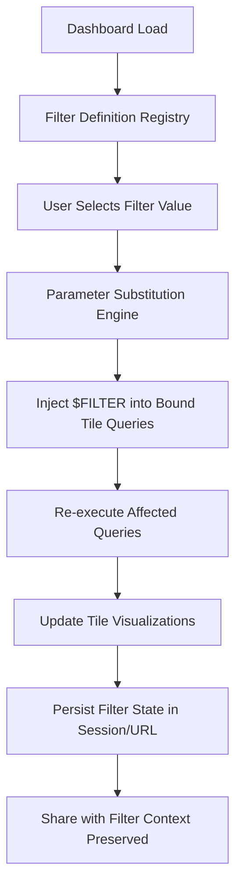

# 1. Title
Creating Reusable Filters for Snowsight Dashboards

# 2. Overview
This pattern defines the procedural architecture for defining, binding, and propagating dashboard-level filter parameters across multiple tiles in Snowsight. It exists to enable consistent, user-driven data segmentation without duplicating filter logic in each tile query, reduce maintenance overhead, and support interactive exploration of large datasets. The pattern operates at the dashboard composition and query parameterization layer, executed at query time when users interact with filter controls. It is consumed by dashboard authors, analytics engineers, business analysts, and SnowPro Advanced candidates evaluating parameter substitution mechanics, query propagation behavior, and sharing boundaries.

# 3. SQL Object Summary
| Object/Pattern | Type | Purpose | Source Objects/Inputs | Output Objects/Behavior | Execution Mode |
|----------------|------|---------|------------------------|--------------------------|----------------|
| Reusable Dashboard Filter | UI Configuration / Query Parameter Pattern | Define once, apply to multiple tiles; enable interactive filtering without query duplication | Dashboard tile queries, column references, filter type definitions | Parameterized queries with `$FILTER_NAME` substitution; filtered result sets per tile | Synchronous, user-triggered at dashboard interaction time |

# 4. Architecture
Reusable filters operate as dashboard-level parameters that inject values into tile queries at execution time. When a user selects a filter value, Snowsight substitutes the parameter placeholder (`$FILTER_NAME`) in each bound tile's query, then re-executes affected queries against Snowflake. Filter state persists in the dashboard session and can be encoded in share URLs for collaborative review.

# 5. Data Flow / Process Flow
1. **Filter Definition & Registration**
   - Input: Filter name, data type, source column, allowed values, default value
   - Transformation: Dashboard metadata stores filter schema and binding map
   - Output: Registered filter available for tile binding
   - Purpose: Centralize filter logic for consistent application across tiles

2. **Tile Query Parameterization**
   - Input: SQL query with `$FILTER_NAME` placeholder, filter binding configuration
   - Transformation: Query parser validates placeholder syntax and type compatibility
   - Output: Parameterized query ready for runtime substitution
   - Purpose: Decouple filter UI from query logic; enable reuse without duplication

3. **User Interaction & Substitution**
   - Input: User-selected filter value(s), active dashboard session
   - Transformation: Substitution engine replaces `$FILTER_NAME` with quoted literal or `IN` clause
   - Output: Executable query with concrete filter predicate
   - Purpose: Apply user intent to underlying data without manual query editing

4. **Query Execution & Result Propagation**
   - Input: Substituted query, warehouse context, source table state
   - Transformation: Snowflake executes query with injected predicate; pruning applied if sargable
   - Output: Filtered result set rendered in tile visualization
   - Purpose: Deliver responsive, segmented insights with minimal latency

5. **State Persistence & Sharing**
   - Input: Active filter values, dashboard ID, user permissions
   - Transformation: Filter state serialized into session storage or URL query parameters
   - Output: Shareable URL with pre-applied filter context
   - Purpose: Enable collaborative review with consistent data segmentation

# 6. Logical Breakdown
| Component | Responsibility | Inputs | Outputs | Dependencies | Failure Modes / Risks |
|-----------|----------------|--------|---------|--------------|------------------------|
| `filter_registry` | Store filter definitions and bindings | Filter name, type, source column, allowed values, default | Registered filter metadata | Dashboard edit privileges; valid column references | Invalid column or type mismatch blocks filter creation |
| `query_parameterizer` | Validate and prepare tile queries for substitution | SQL text, `$FILTER_NAME` placeholders, filter type | Parameterized query with validated syntax | Query parseability; placeholder naming consistency | Missing or malformed placeholders cause substitution failures |
| `substitution_engine` | Inject user values into queries at runtime | Filter value(s), parameterized query, data type rules | Executable SQL with concrete predicate | Type-safe quoting; `IN` clause expansion for multi-select | SQL injection risk if substitution logic mishandles escaping |
| `execution_coordinator` | Trigger re-execution of bound tiles | Substituted queries, warehouse assignment | Updated tile results + execution metrics | Warehouse availability; query completion | Long-running queries block dashboard responsiveness |
| `state_serializer` | Persist filter context for session/sharing | Active filter values, dashboard ID, user role | Session storage entry or shareable URL | URL encoding; permission validation | Expired URLs or revoked permissions break shared access |

# 7. Data Model (State Model)
| Object | Role | Important Fields | Grain | Relationships | Null Handling |
|--------|------|------------------|-------|---------------|---------------|
| `dashboard_filter_def` | Filter configuration metadata | `filter_id`, `filter_name`, `data_type`, `source_column`, `allowed_values`, `default_value`, `is_multi_select` | Per filter per dashboard | Bound to one or more tile queries via `tile_filter_binding` | `allowed_values` is `NULL` for free-text filters; `default_value` may be `NULL` for optional filters |
| `tile_filter_binding` | Mapping between filters and tile queries | `binding_id`, `tile_id`, `filter_id`, `query_placeholder`, `binding_logic` | Per binding per tile | References `dashboard_filter_def` and tile query metadata | `binding_logic` defaults to `AND` append; `NULL` if not customized |
| `filter_execution_state` | Runtime filter application record | `execution_id`, `dashboard_id`, `filter_values`, `substituted_queries`, `execution_timestamp` | Per filter interaction per session | Links to user session and query history | `filter_values` stored as `VARIANT` to support multi-type values |

Output Grain: One filter definition per dashboard. One binding record per filter-tile pair. One execution state record per user interaction.

# 8. Business Logic (Execution Logic)
- **Filter Type Rules**: Text filters use `=` or `LIKE` with quoted literals. Number filters use numeric comparison operators. Date filters accept ISO format or relative expressions (`LAST_30_DAYS`). Boolean filters map to `TRUE`/`FALSE` literals. Multi-select filters expand to `IN (val1, val2, ...)`.
- **Substitution Semantics**: `$FILTER_NAME` is replaced with properly quoted literal(s). Single-select: `'$VALUE'`. Multi-select: `('VAL1', 'VAL2')`. Null or empty selection may omit predicate entirely if filter is optional.
- **Predicate Injection Logic**: Filters append to existing `WHERE` clause via `AND`. If tile query lacks `WHERE`, filter creates one. Filters do not override or replace existing predicates.
- **Case Sensitivity**: Filter matching follows source column collation. Case-insensitive columns require `ILIKE` or explicit `LOWER()` in source query; filters do not auto-apply case normalization.
- **Allowed Values Enforcement**: Predefined `allowed_values` restrict user selection to valid options. Free-text filters bypass this but risk invalid predicate generation if user input mismatches column domain.
- **Default Value Behavior**: If filter has `default_value` and user has not interacted, default is applied at dashboard load. Optional filters with no default and no user selection omit predicate.
- **Exam-Relevant Defaults**: Filter substitution occurs at query execution time, not dashboard load. Filters respect underlying table pruning if predicate is sargable. Multi-select filters use `IN` clause logic; order of values does not affect result. Shared URLs encode filter state as query parameters; expiry defaults to 30 days. Filters do not bypass Row Access Policies or Dynamic Data Masking.

# 9. Transformations (State Transitions)
| Source State | Derived State | Rule / Evaluation Logic | Meaning | Impact |
|--------------|---------------|-------------------------|---------|--------|
| `raw_tile_query` | `parameterized_query` | Replace `WHERE col = 'literal'` with `WHERE col = $FILTER_NAME` | Decouples filter logic from query text | Enables single filter definition to drive multiple tiles |
| `user_selection` + `parameterized_query` | `substituted_query` | `$FILTER_NAME` → `'selected_value'` or `('V1','V2')` | Injects concrete predicate at runtime | Query re-executes with user-driven segmentation |
| `substituted_query` + `source_data` | `filtered_result` | Snowflake evaluates predicate with pruning if sargable | Returns only matching rows per filter | Performance depends on predicate selectivity and clustering |
| `filtered_result` + `tile_config` | `rendered_visualization` | Chart engine maps result columns to visual encoding | Displays segmented insight to user | Large result sets may truncate or require aggregation |
| `active_filters` + `dashboard_context` | `shareable_url` | Serialize filter state into URL query parameters | Encodes dashboard state for collaboration | URL expiry or permission changes break access |

# 10. Parameters / Variables / Configuration
| Name | Type | Purpose | Allowed Values | Default | Where Used | Effect |
|------|------|---------|----------------|---------|------------|--------|
| `$FILTER_NAME` | Query Placeholder | Reference dashboard filter in tile SQL | Valid identifier matching filter definition | N/A | Tile query text | Triggers substitution at runtime; case-sensitive match required |
| `filter_type` | Filter Configuration | Define input control and substitution behavior | `TEXT`, `NUMBER`, `DATE`, `BOOLEAN`, `MULTI_SELECT` | `TEXT` | Filter definition UI | Determines quoting style and `IN` clause expansion |
| `allowed_values` | Filter Configuration | Restrict user selection to valid domain | Array of literals matching column type | `NULL` (free-text) | Filter definition | Prevents invalid predicate generation; improves UX |
| `default_value` | Filter Configuration | Pre-apply filter at dashboard load | Single literal matching filter type | `NULL` (no default) | Filter definition | Optional filters with no default omit predicate if unselected |
| `is_optional` | Filter Configuration | Allow filter to be unselected without error | `TRUE`, `FALSE` | `FALSE` | Filter definition | Optional filters omit predicate when no value selected |
| `binding_logic` | Tile Binding Configuration | Control how filter combines with existing predicates | `AND`, `OR` | `AND` | Tile-filter binding | `OR` logic may expand result set unexpectedly; use cautiously |

# 11. APIs / Interfaces
| Interface | Invocation Method | Input Structure | Output Structure | Error Behavior | Consumers |
|-----------|-------------------|-----------------|------------------|----------------|-----------|
| Dashboard Filter UI | Snowsight Visual Editor | Filter name, type, source column, allowed values | Registered filter available for binding | Fails on invalid column reference or type mismatch | Dashboard authors, analysts |
| Tile Query Editor | Snowsight SQL Pane | SQL text with `$FILTER_NAME` placeholder | Parameterized query saved to tile metadata | Fails on syntax errors or undefined placeholder | Query authors, engineers |
| Filter Substitution Runtime | Internal Engine | User selection, parameterized query, type rules | Executable SQL with concrete predicate | Fails on type mismatch or SQL generation error | Dashboard consumers (transparent) |
| Share URL Generator | UI / API | Dashboard ID, active filters, expiry | Public URL with encoded filter state | Fails if insufficient `SHARE` privilege | Collaborators, stakeholders |
| `SYSTEM$DASHBOARD_FILTER_INFO` | Not Natively Available | N/A | N/A | N/A | N/A |

# 12. Execution / Deployment
- Filters execute synchronously when users interact with dashboard controls; no background scheduling.
- Substitution and query re-execution occur per tile; tiles update independently based on execution time.
- Upstream dependency: Source tables must be accessible to dashboard viewer role; warehouse must be running or auto-resume enabled.
- Environment behavior: Dev/test dashboards may use smaller warehouses; production dashboards require appropriately sized warehouses for responsive filtering.
- Runtime assumption: Filter predicates are sargable to leverage pruning; non-sargable filters cause full table scans on large datasets.

# 13. Observability
- Track filter usage: Monitor which filters are most frequently adjusted via dashboard telemetry (if available) or custom audit logging.
- Validate pruning effectiveness: Compare `PARTITIONS_SCANNED` in `QUERY_HISTORY` for filtered vs unfiltered executions of same tile query.
- Monitor execution latency: Alert when filter-driven query re-execution exceeds threshold (e.g., >10s) indicating potential performance issues.
- Audit sharing activity: Log share URL generation and access attempts to track dashboard distribution.
- Implement reconciliation: Compare row counts pre/post filter application to validate expected segmentation; flag anomalies.

# 14. Failure Handling & Recovery
- **Invalid placeholder syntax**: `$FILTER-NAME` with hyphen fails substitution. Detection: Tile shows "Query error" on filter interaction. Recovery: Use valid identifier syntax (`$FILTER_NAME`); validate placeholders during dashboard authoring.
- **Type mismatch between filter and column**: Text filter bound to numeric column causes cast error. Detection: Query fails with "numeric value expected". Recovery: Align filter type with source column; use explicit `CAST` in tile query if conversion is intentional.
- **Non-sargable filter predicate bypasses pruning**: Filter on `DATE_TRUNC('day', ts) = $FILTER` scans all partitions. Detection: High `PARTITIONS_SCANNED` in Query Profile. Recovery: Rewrite tile query to use sargable predicate (`ts >= $START AND ts < $END`) or add derived clustered column.
- **Multi-select filter generates oversized `IN` clause**: Hundreds of values exceed query length limits. Detection: Query fails with "statement too long". Recovery: Implement server-side grouping or switch to temporary table join pattern for large selections.
- **Shared URL expires or permissions revoked**: Recipient cannot access filtered dashboard. Detection: 403 error or "Dashboard not found". Recovery: Regenerate share URL with extended expiry; grant recipient appropriate role privileges.

# 15. Security & Access Control
- Filters inherit standard RBAC: dashboard viewers must have `SELECT` on source objects and `USAGE` on warehouse.
- Row Access Policies and Dynamic Data Masking evaluate after filter substitution; filters cannot bypass policy-enforced restrictions.
- Shared URLs grant access to query results only, not underlying tables. Recipients cannot view unshared columns or modify source data.
- Filter `allowed_values` can enforce domain restrictions but do not replace database-level constraints or validation.
- Audit filter interactions via custom logging if compliance requires tracking user-driven data segmentation.

# 16. Performance / Scalability Considerations
- Filter predicates must be sargable to leverage micro-partition pruning. Function-wrapped columns or type mismatches cause full scans.
- Multi-select filters with many values generate large `IN` clauses; consider temporary table joins for >100 values.
- Tiles with complex queries may experience latency when re-executed; implement result caching or pre-aggregation for frequently filtered dimensions.
- Concurrent filter interactions by multiple users on same dashboard may cause warehouse queueing; use multi-cluster warehouses for high-concurrency dashboards.
- Filter state serialization in URLs has length limits; excessive filter values may truncate or fail to encode.
- Exam trap: Filters append via `AND` logic by default; they do not replace existing `WHERE` clauses. Case sensitivity follows source column collation, not filter UI settings. Shared URL expiry defaults to 30 days unless explicitly configured.

# 17. Assumptions & Constraints
- Assumes source columns referenced by filters are stable and consistently populated. Schema drift breaks filter binding.
- Assumes filter predicates are sargable for performance. Non-sargable filters degrade to full scans regardless of clustering.
- `$FILTER_NAME` placeholder matching is case-sensitive. `$Filter` and `$FILTER` are distinct identifiers.
- Multi-select filters use `IN` clause logic; order of values does not affect query result or pruning.
- Filter substitution occurs at query execution time, not dashboard load. Changing filter values triggers re-execution of bound tiles.
- Shared URLs encode filter state but do not preserve dashboard layout changes or tile-level customizations.
- Exam trap: Filters do not override existing `WHERE` clauses; they append via `AND`. `allowed_values` restrict UI selection but do not enforce database-level constraints. `default_value` applies only at initial load; user interaction overrides it permanently for session.

# 18. Future Enhancements
- Implement filter dependency graphs: Allow filters to dynamically update allowed values based on selections in other filters (cascading filters).
- Add filter performance analytics: Dashboard UI shows estimated impact of filter selection on query cost before execution.
- Develop server-side filter caching: Pre-compute common filter combinations to reduce re-execution latency for frequent segments.
- Integrate filter templates: Reusable filter definitions that can be imported across dashboards to standardize segmentation logic.
- Enable filter-driven data export: Allow users to export filtered results directly to CSV, Excel, or Snowflake table without manual query editing.
