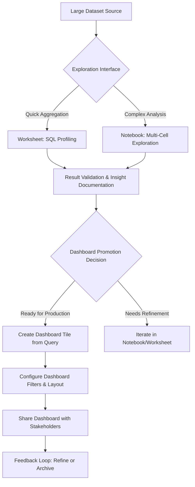

# 1. Title
Exploratory Ad-Hoc Analysis for Dashboard Summarization Using Snowflake Notebooks and Worksheets

# 2. Overview
This pattern defines the procedural architecture for conducting iterative, hypothesis-driven data exploration within Snowflake Notebooks and Worksheets to inform the creation of Snowsight dashboards that summarize large datasets. It exists to bridge the gap between raw data discovery and production dashboard deployment, enabling analysts to profile distributions, validate aggregation logic, and prototype visualizations before committing to dashboard tiles. The pattern operates in the interactive analysis layer, leveraging Snowflake's unified compute context, session state management, and result caching. It is consumed by dashboard authors, analytics engineers, business analysts, and SnowPro Advanced candidates evaluating session isolation, result persistence, dashboard promotion workflows, and collaborative sharing boundaries.

# 3. SQL Object Summary
| Object/Pattern | Type | Purpose | Source Objects/Inputs | Output Objects/Behavior | Execution Mode |
|----------------|------|---------|------------------------|--------------------------|----------------|
| Dashboard-Focused Exploratory Session | Interactive Workflow Pattern | Enable rapid data profiling, aggregation validation, and visualization prototyping for dashboard consumption | Tables, views, stages, Python libraries, SQL scripts, dashboard tile templates | Transient result sets, prototype visualizations, documented insights, promoted dashboard objects | Synchronous, user-driven execution with optional result caching and dashboard promotion |

# 4. Architecture
Snowflake Notebooks and Worksheets serve as the exploration layer feeding dashboard creation. Worksheets provide SQL-only, lightweight querying for quick aggregation validation. Notebooks extend this with multi-language support (SQL, Python, Markdown), enabling complex profiling, statistical analysis, and narrative documentation. Both interfaces share the same warehouse, session context, and result cache, allowing seamless transition from exploration to dashboard tile deployment. The architecture implements a promotion pipeline: exploratory query → validated aggregation → dashboard tile → shared dashboard.

# 5. Data Flow / Process Flow
1. **Session Initialization & Context Binding**
   - Input: User credentials, role, warehouse assignment, database/schema context
   - Transformation: Session object created with isolated compute context, result cache, and dashboard promotion privileges
   - Output: Active worksheet or notebook bound to target dashboard schema
   - Purpose: Establish execution environment with appropriate privileges for both exploration and dashboard deployment

2. **Data Profiling & Aggregation Prototyping**
   - Input: Large dataset reference, exploratory SQL/Python code
   - Transformation: Execute profiling queries (`COUNT`, `DISTINCT`, `MIN/MAX`, `PERCENTILE`), validate aggregation logic, sample large tables
   - Output: Statistical summaries, distribution charts, aggregation validation results
   - Purpose: Understand data characteristics and validate that aggregations produce expected results before dashboard deployment

3. **Visualization Prototyping & Dashboard Tile Mapping**
   - Input: Validated aggregation results, chart type specifications
   - Transformation: Render prototype visualizations in Notebook/Worksheet; map query output to dashboard tile schema
   - Output: Prototype chart + tile configuration metadata (query, axes, filters)
   - Purpose: Ensure visualizations render correctly and performantly before committing to dashboard

4. **Promotion to Dashboard & Filter Integration**
   - Input: Validated tile query, filter requirements, dashboard layout spec
   - Transformation: Create dashboard tile from exploratory query; bind reusable filters; configure refresh behavior
   - Output: Production dashboard tile with parameterized query and filter bindings
   - Purpose: Transition validated exploration into shareable, interactive dashboard component

5. **Collaboration & Iterative Refinement**
   - Input: Shared dashboard URL, stakeholder feedback, updated exploration notes
   - Transformation: Capture feedback in Notebook Markdown; refine query logic; re-promote updated tile
   - Output: Updated dashboard with documented change rationale
   - Purpose: Maintain audit trail of dashboard evolution and enable rapid iteration based on user feedback

# 6. Logical Breakdown
| Component | Responsibility | Inputs | Outputs | Dependencies | Failure Modes / Risks |
|-----------|----------------|--------|---------|--------------|------------------------|
| `session_manager` | Establish isolated execution context with dashboard promotion rights | User role, warehouse, database/schema, dashboard target | Session object with cache, variables, dashboard promotion context | Role privileges; warehouse availability; dashboard edit permissions | Session timeout interrupts promotion workflow; missing privileges block tile creation |
| `profiling_engine` | Execute data characterization queries on large datasets | Table reference, profiling functions, sampling parameters | Statistical summaries, distribution metrics, null/quality flags | Source table accessibility; warehouse sizing for large scans | Unbounded profiling queries consume excessive credits; sampling bias misrepresents data |
| `aggregation_validator` | Verify aggregation logic produces expected results | Exploratory aggregation query, expected business rules | Validation pass/fail + diagnostic metrics | Business rule documentation; test data availability | Aggregation logic mismatch causes dashboard to display incorrect metrics |
| `visualization_prototyper` | Render charts and map to dashboard tile schema | Result set, chart type, axis mapping, dashboard tile template | Prototype visualization + tile configuration JSON | Result cardinality within render limits; dashboard schema compatibility | Large result sets fail to render; tile mapping errors break dashboard deployment |
| `dashboard_promoter` | Promote validated query to production dashboard tile | Validated query, tile config, filter bindings, dashboard ID | Created/updated dashboard tile with parameterized query | Dashboard edit privileges; query determinism; filter compatibility | Promotion fails if query contains session-specific objects or non-deterministic functions |
| `feedback_loop_manager` | Capture stakeholder feedback and track iteration | Dashboard share URL, feedback form, Notebook Markdown cells | Documented change rationale + updated tile version | Notebook sharing permissions; dashboard versioning | Feedback not captured leads to undocumented dashboard changes |

# 7. Data Model (State Model)
| Object | Role | Important Fields | Grain | Relationships | Null Handling |
|--------|------|------------------|-------|---------------|---------------|
| `exploration_session` | Runtime context for dashboard-focused analysis | `session_id`, `role`, `warehouse`, `target_dashboard_id`, `result_cache_ttl` | Per user session | Links to executed queries, cached results, promoted tiles | `target_dashboard_id` is `NULL` for pure exploration; set when promoting to dashboard |
| `profiling_result` | Transient data characterization output | `result_id`, `table_name`, `metric_type`, `metric_value`, `sample_size`, `computed_at` | Per metric per table per session | Linked to session; may be referenced in dashboard tile documentation | `sample_size` is `NULL` for full-table scans; `metric_value` preserves `NULL` from source |
| `dashboard_tile_template` | Prototype configuration for promotion | `template_id`, `query_text`, `chart_type`, `axis_mapping`, `filter_bindings`, `refresh_config` | Per tile prototype | References exploration session; becomes dashboard tile upon promotion | `filter_bindings` is `NULL` if tile does not use dashboard filters |
| `promoted_tile` | Production dashboard component | `tile_id`, `dashboard_id`, `query_hash`, `last_promoted_at`, `promotion_version` | Per tile per dashboard | Traces back to exploration session via `query_hash`; independent after promotion | `promotion_version` increments with each re-promotion; `NULL` for initial creation |
| `feedback_record` | Stakeholder input on dashboard content | `feedback_id`, `dashboard_id`, `tile_id`, `feedback_text`, `resolution_status`, `linked_notebook_cell` | Per feedback item per dashboard | Links to dashboard tile and optional Notebook cell for context | `linked_notebook_cell` is `NULL` if feedback not tied to specific exploration step |

Output Grain: One session context per user connection. One profiling result per metric computation. One tile template per prototype. One promoted tile per dashboard component. One feedback record per stakeholder comment.

# 8. Business Logic (Execution Logic)
- **Profiling Scope Rules**: Use `TABLESAMPLE` or `LIMIT` for initial exploration of large datasets; validate findings on full dataset before dashboard promotion. Document sampling methodology in Notebook Markdown for auditability.
- **Aggregation Validation Logic**: Compare exploratory aggregation results against known benchmarks or business rules. Flag discrepancies >5% for investigation before promotion. Use `QUALIFY` or window functions to validate row-level logic before aggregation.
- **Visualization Rendering Limits**: Charts render up to 10,000 rows in Notebooks/Worksheets; dashboard tiles may have different limits. Aggregate or sample before visualization to ensure consistent rendering across environments.
- **Promotion Eligibility Criteria**: Queries eligible for dashboard promotion must: (1) be deterministic (no `RANDOM()`, `CURRENT_TIMESTAMP()` without parameterization), (2) reference only persistent objects (no temporary tables or session UDFs), (3) include explicit `ORDER BY` if tile requires sorted output, (4) use sargable predicates if filtering large tables.
- **Filter Binding Semantics**: Dashboard filters bind to tile queries via `$FILTER_NAME` substitution. Exploratory queries must use placeholder syntax to enable filter integration. Test filter interactions in Notebook before promotion.
- **Refresh Behavior Configuration**: Dashboard tiles can be configured for on-demand, scheduled, or event-driven refresh. Exploratory queries should avoid non-deterministic functions if scheduled refresh is required.
- **Exam-Relevant Defaults**: Result cache TTL is 24h unless overridden by `RESULT_CACHE_ACTIVE` session parameter. Dashboard promotion requires `CREATE DASHBOARD` or `ALTER DASHBOARD` privilege. Shared dashboard URLs expire after 30 days by default. Filters append via `AND` logic; they do not replace existing `WHERE` clauses. `CURRENT_ROLE()` and `CURRENT_WAREHOUSE()` reflect session context at execution time, not promotion time.

# 9. Transformations (State Transitions)
| Source State | Derived State | Rule / Evaluation Logic | Meaning | Impact |
|--------------|---------------|-------------------------|---------|--------|
| `raw_large_table` | `sampled_profiling_result` | `SELECT COUNT(*), APPROX_PERCENTILE(col, 0.5) FROM table TABLESAMPLE (10 PERCENT)` | Characterize data distribution without full scan | Reduces exploration cost; document sampling for dashboard validation |
| `exploratory_aggregation` | `validated_metric` | Compare result against business rule threshold; flag if deviation >5% | Ensure aggregation logic produces expected output before dashboard deployment | Prevents incorrect metrics in production dashboards |
| `prototype_chart` | `dashboard_tile_config` | Map Notebook chart axes to dashboard tile schema; inject `$FILTER` placeholders | Enable filter integration and consistent rendering in dashboard | Tile renders identically to prototype; filters function as designed |
| `parameterized_query` + `dashboard_context` | `promoted_tile` | `CREATE DASHBOARD TILE AS (query_with_placeholders)` with filter bindings | Persist validated exploration to production dashboard | Tile inherits query logic; filter state managed at dashboard level |
| `stakeholder_feedback` + `notebook_context` | `documented_iteration` | Link feedback to specific Notebook cell; update query logic; re-promote tile | Maintain audit trail of dashboard evolution | Enables reproducible dashboard updates; reduces regression risk |

# 10. Parameters / Variables / Configuration
| Name | Type | Purpose | Allowed Values | Default | Where Used | Effect |
|------|------|---------|----------------|---------|------------|--------|
| `RESULT_CACHE_ACTIVE` | Session Parameter | Enable/disable result caching for exploratory queries | `TRUE`, `FALSE` | `TRUE` | Query execution | `FALSE` forces re-execution; ensures freshness but increases credits |
| `STATEMENT_TIMEOUT_IN_SECONDS` | Session Parameter | Limit exploratory query duration to prevent runaway credit consumption | 0 (unlimited) to 172800 (48h) | 172800 | Query execution | Prevents long-running profiling queries from blocking dashboard work |
| `DASHBOARD_REFRESH_MODE` | Tile Configuration | Control how dashboard tile updates data | `ON_DEMAND`, `SCHEDULED`, `EVENT_DRIVEN` | `ON_DEMAND` | Dashboard tile settings | `SCHEDULED` requires deterministic query; `EVENT_DRIVEN` requires stream integration |
| `FILTER_BINDING_SYNTAX` | Query Placeholder | Reference dashboard filter in tile query | `$FILTER_NAME` (case-sensitive identifier) | N/A | Tile query text | Triggers substitution at dashboard runtime; must match filter definition exactly |
| `VISUALIZATION_ROW_LIMIT` | UI Setting | Cap rows rendered in Notebook/Worksheet charts | 1,000–100,000 | 10,000 | Chart rendering | Higher limits increase browser memory usage; may cause timeout |
| `PROMOTION_VALIDATION_STRICTNESS` | Account Setting | Enforce query determinism checks before dashboard promotion | `STRICT`, `LENIENT` | `STRICT` | Dashboard promotion workflow | `STRICT` blocks non-deterministic queries; `LENIENT` allows with warning |

# 11. APIs / Interfaces
| Interface | Invocation Method | Input Structure | Output Structure | Error Behavior | Consumers |
|-----------|-------------------|-----------------|------------------|----------------|-----------|
| Worksheet SQL Editor | Snowsight UI / REST API | SQL text, session context, optional dashboard target | Result grid + query metrics + promotion option | Fails on syntax errors or privilege violations | Analysts prototyping dashboard aggregations |
| Notebook Cell Execution | Snowsight UI / REST API | Cell content (SQL/Python/Markdown), execution order, dashboard context | Cell output + variable state + tile promotion option | Fails on runtime errors; partial state preserved | Data scientists validating complex aggregations |
| Dashboard Tile Creator | Snowsight Dashboard UI | Validated query, chart type, filter bindings, refresh config | Created/updated dashboard tile | Fails if query non-deterministic or filter binding invalid | Dashboard authors promoting exploratory work |
| `SYSTEM$RESULT_CACHE_INFO(query_hash)` | SQL Function | Query hash or text | Cache status, TTL remaining, size bytes | Returns `NULL` if caching disabled or query not cached | Performance analysts validating cache hits during exploration |
| Share Dashboard URL | UI / API | Dashboard ID, active filters, expiry, role filter | Public URL with encoded filter state | Fails if insufficient `SHARE` privilege | Stakeholders reviewing dashboard prototypes |

# 12. Execution / Deployment
- Executed interactively via Snowsight UI; promotion to dashboard occurs via point-and-click workflow or REST API for automated deployment pipelines.
- Session state persists for duration of connection or until timeout; Notebooks save cell state to account storage for later resume and dashboard promotion.
- Upstream dependency: Source objects must be accessible to user role; warehouse must be running or auto-resume enabled; dashboard must exist with edit permissions.
- Environment behavior: Dev/test warehouses may use smaller sizes for cost control during exploration; production dashboard tiles may require larger warehouses for responsive filtering.
- Runtime assumption: Exploratory queries may scan large volumes; implement row limits or sampling to control credit consumption before promotion.

# 13. Observability
- Track exploration-to-promotion conversion: Monitor ratio of exploratory queries that result in dashboard tiles to measure workflow efficiency.
- Validate aggregation consistency: Compare `BYTES_SCANNED` and `EXECUTION_TIME` for same query in Notebook vs dashboard tile to detect environment drift.
- Monitor dashboard tile performance: Use `ACCOUNT_USAGE.QUERY_HISTORY` filtered on dashboard tile query hashes to identify tiles causing high credit consumption.
- Alert on promotion failures: Log and alert when deterministic validation blocks dashboard promotion, indicating need for query refactoring.
- Implement feedback tracking: Custom audit table logs stakeholder feedback linked to dashboard tiles and Notebook cells to measure iteration velocity.

# 14. Failure Handling & Recovery
- **Session timeout during long profiling query**: Query aborts mid-execution. Detection: "Session expired" error. Recovery: Increase `STATEMENT_TIMEOUT_IN_SECONDS`, save intermediate results to table, or break query into smaller cells with explicit checkpoints.
- **Non-deterministic query blocks dashboard promotion**: Query contains `RANDOM()` or `CURRENT_TIMESTAMP()` without parameterization. Detection: Promotion fails with "non-deterministic query" error. Recovery: Replace with parameterized equivalents or move non-deterministic logic to upstream ETL.
- **Filter binding mismatch breaks dashboard tile**: `$FILTER_NAME` placeholder does not match dashboard filter definition. Detection: Tile shows "Query error" when filter is adjusted. Recovery: Align placeholder name with filter definition; validate bindings in Notebook before promotion.
- **Large result set fails to render in prototype chart**: Browser memory exhaustion on >10K row visualization. Detection: UI freeze or "render failed" message. Recovery: Apply `LIMIT`, aggregate before charting, or export to CSV for external tool validation.
- **Stakeholder feedback not linked to exploration context**: Dashboard updated without documenting rationale. Detection: Audit trail shows tile change with no linked Notebook cell. Recovery: Enforce workflow policy requiring feedback documentation in Notebook before re-promotion.

# 15. Security & Access Control
- Worksheets and Notebooks inherit standard RBAC: user must have `USAGE` on warehouse, `SELECT` on source objects, and `CREATE DASHBOARD` or `ALTER DASHBOARD` for promotion.
- Notebook Python cells execute with same privileges as SQL; Snowpark operations cannot escalate beyond session role.
- Dashboard sharing grants access to query results only, not underlying tables. Recipients cannot modify source or view unshared columns.
- Dynamic Data Masking and Row Access Policies evaluate at query execution; masked values appear in both exploratory results and dashboard tiles per policy.
- Audit promotion actions via custom logging to track which exploratory queries became production dashboard tiles.

# 16. Performance / Scalability Considerations
- Exploratory queries without `LIMIT` or sampling may scan entire large tables, consuming significant credits. Always apply row limits during initial profiling; validate on full dataset only after logic is confirmed.
- Result cache reduces redundant execution during exploration but may return stale data. Balance freshness needs against credit savings; disable cache via `RESULT_CACHE_ACTIVE = FALSE` for critical validation steps.
- Python cells in Notebooks incur translation overhead to Snowpark; complex Pandas-style operations may not push down efficiently. Prefer SQL for large-scale aggregations destined for dashboard tiles.
- Visualization rendering is client-side; large result sets increase browser memory usage and may cause timeout. Aggregate or sample before charting in both Notebook and dashboard contexts.
- Dashboard tiles with complex queries may experience latency when filters are applied; implement result caching at tile level or pre-aggregation for frequently filtered dimensions.
- Exam trap: Result cache requires identical query text and session context. Changing whitespace, comments, or session parameters invalidates cache. `CURRENT_TIMESTAMP()` and `RANDOM()` always bypass cache. Dashboard promotion requires deterministic queries; non-deterministic functions block promotion unless parameterized.

# 17. Assumptions & Constraints
- Assumes user has appropriate privileges for source objects, warehouse, and dashboard promotion. Missing privileges cause immediate failure at promotion step.
- Assumes exploratory intent does not require production-grade data quality checks. Results may include unvalidated or incomplete data; validation is explicit step before promotion.
- Notebook cell execution is sequential by default; parallel execution requires explicit asynchronous patterns not natively supported in Snowsight.
- Dashboard promotion creates a copy of query logic; subsequent changes to Notebook do not auto-update dashboard tile. Re-promotion required for updates.
- Result cache TTL is 24h by default; longer retention requires account-level configuration and increases storage cost.
- Python runtime in Notebooks is managed by Snowflake; custom library installation requires account admin approval and may not be available in all regions.
- Exam trap: Worksheets support SQL only; Python and Markdown require Notebooks. `CREATE DASHBOARD` privilege is separate from `CREATE NOTEBOOK` or `CREATE TABLE`. Shared dashboard URL expiry defaults to 30 days unless explicitly configured. Filters append via `AND` logic; they do not replace existing `WHERE` clauses.

# 18. Future Enhancements
- Implement one-click promotion from Notebook cell to dashboard tile: UI button that validates query determinism, suggests filter bindings, and creates tile with documented lineage.
- Add automatic sampling recommendations: Analyze table size and suggest `TABLESAMPLE` percentage for initial exploration to balance cost vs representativeness.
- Develop dashboard tile versioning: Track promotion history with diff view between Notebook query and production tile query to simplify rollback and audit.
- Integrate feedback directly into Notebook workflow: Stakeholder comments on dashboard tiles appear as Markdown cells in linked Notebook for seamless iteration.
- Enable cross-dashboard filter synchronization: Allow filters defined in one dashboard to be reused in others, with exploration Notebooks documenting filter logic and validation.
