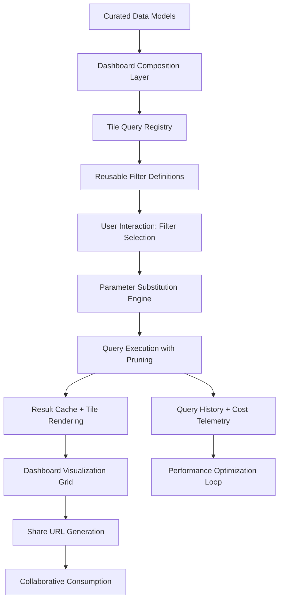

# 1. Title
Summarizing Large Datasets Using Snowsight Dashboards in Snowflake

# 2. Overview
This pattern defines the procedural architecture for designing, building, and deploying Snowsight dashboards that summarize large-scale datasets through interactive visualizations, parameterized queries, and reusable filter controls. It exists to enable business stakeholders to explore aggregated insights without writing SQL, reduce redundant query execution through result caching and tile optimization, and maintain a single source of truth for key metrics across an organization. The pattern operates at the consumption layer, bridging curated data models with end-user analytics. It is consumed by dashboard authors, analytics engineers, business analysts, and SnowPro Advanced candidates evaluating dashboard architecture, query parameterization mechanics, result caching behavior, and sharing permission boundaries.

# 3. SQL Object Summary
| Object/Pattern | Type | Purpose | Source Objects/Inputs | Output Objects/Behavior | Execution Mode |
|----------------|------|---------|------------------------|--------------------------|----------------|
| Snowsight Dashboard Summarization | UI Composition / Query Orchestration Pattern | Aggregate, visualize, and interactively filter large datasets through a unified dashboard interface | Curated tables/views, parameterized SQL queries, filter definitions, visualization specs | Interactive dashboard with tiles, reusable filters, cached results, shareable URLs | Synchronous (user interaction) with asynchronous tile refresh options |

# 4. Architecture
Snowsight dashboards operate as a composition layer atop Snowflake's execution engine. Dashboard tiles contain parameterized SQL queries that execute against source objects when users interact with filters or refresh controls. The architecture implements a multi-tier caching strategy: result cache for identical queries, dashboard-level cache for tile outputs, and browser-level cache for rendered visualizations. Reusable filters inject predicates into tile queries at runtime via `$FILTER_NAME` substitution. Sharing mechanisms encode dashboard state into time-bound URLs with role-based access controls.

# 5. Data Flow / Process Flow
1. **Dashboard Composition & Tile Registration**
   - Input: Validated SQL queries, visualization specs, filter bindings, refresh configuration
   - Transformation: Dashboard metadata stores tile definitions, query hashes, and dependency graph
   - Output: Registered dashboard with executable tile registry
   - Purpose: Establish reusable, parameterized visualization components

2. **Filter Definition & Binding**
   - Input: Filter name, data type, source column, allowed values, default behavior
   - Transformation: Filter metadata registered and bound to tile queries via `$FILTER_NAME` placeholders
   - Output: Reusable filter available across dashboard tiles
   - Purpose: Enable consistent segmentation without query duplication

3. **User Interaction & Query Substitution**
   - Input: User-selected filter values, dashboard session context
   - Transformation: Substitution engine injects concrete predicates into bound tile queries
   - Output: Executable SQL with user-driven filter conditions
   - Purpose: Apply interactive segmentation without manual query editing

4. **Execution & Result Caching**
   - Input: Substituted queries, warehouse assignment, source table state
   - Transformation: Snowflake executes queries with pruning; results cached by query hash
   - Output: Filtered result sets rendered as tile visualizations
   - Purpose: Deliver responsive insights with minimized redundant compute

5. **Sharing & Collaborative Review**
   - Input: Active dashboard state, filter selections, user permissions
   - Transformation: Filter state and dashboard layout serialized into shareable URL
   - Output: Time-bound URL with encoded context for stakeholder access
   - Purpose: Enable collaborative review with consistent data segmentation

# 6. Logical Breakdown
| Component | Responsibility | Inputs | Outputs | Dependencies | Failure Modes / Risks |
|-----------|----------------|--------|---------|--------------|------------------------|
| `dashboard_composer` | Register tiles, filters, and layout configuration | SQL queries, chart specs, filter bindings, refresh config | Dashboard metadata with executable tile registry | Valid query syntax; source object accessibility; dashboard privileges | Invalid query or missing privilege blocks dashboard creation |
| `filter_registry` | Define and manage reusable filter parameters | Filter name, type, source column, allowed values, default | Registered filter available for tile binding | Column existence; type compatibility; naming consistency | Type mismatch or invalid column reference breaks substitution |
| `substitution_engine` | Inject filter values into tile queries at runtime | User selection, `$FILTER_NAME` placeholders, type rules | Executable SQL with concrete predicates | Placeholder syntax validity; type-safe quoting logic | SQL injection risk if escaping logic fails; malformed predicates cause query errors |
| `execution_orchestrator` | Coordinate tile query execution and caching | Substituted queries, warehouse context, cache settings | Rendered tile visualizations + execution telemetry | Warehouse availability; query completion; cache configuration | Long-running queries block dashboard responsiveness; cache misses increase latency |
| `sharing_service` | Generate and manage shareable dashboard URLs | Dashboard ID, active filters, expiry, role filters | Public URL with encoded state + access token | Share privileges; URL encoding; permission validation | Expired URLs or revoked permissions break collaborative access |

# 7. Data Model (State Model)
| Object | Role | Important Fields | Grain | Relationships | Null Handling |
|--------|------|------------------|-------|---------------|---------------|
| `dashboard_definition` | Top-level dashboard metadata | `dashboard_id`, `name`, `owner_role`, `created_at`, `last_modified`, `share_config` | Per dashboard | Contains multiple `tile_definition` and `filter_definition` records | `share_config` is `NULL` if dashboard not shared |
| `tile_definition` | Individual visualization component | `tile_id`, `dashboard_id`, `query_text`, `chart_type`, `refresh_mode`, `cache_enabled` | Per tile per dashboard | References source objects; bound to zero or more `filter_definition` records | `cache_enabled` defaults to `TRUE`; `NULL` if not explicitly set |
| `filter_definition` | Reusable parameter for interactive filtering | `filter_id`, `dashboard_id`, `filter_name`, `data_type`, `source_column`, `allowed_values`, `default_value`, `is_optional` | Per filter per dashboard | Bound to one or more `tile_definition` records via `tile_filter_binding` | `allowed_values` is `NULL` for free-text filters; `default_value` may be `NULL` |
| `tile_filter_binding` | Mapping between filters and tile queries | `binding_id`, `tile_id`, `filter_id`, `query_placeholder`, `binding_logic` | Per binding per tile | References `tile_definition` and `filter_definition` | `binding_logic` defaults to `AND`; `NULL` if not customized |
| `dashboard_execution_log` | Runtime telemetry for dashboard tiles | `log_id`, `tile_id`, `query_hash`, `execution_time_ms`, `bytes_scanned`, `partitions_scanned`, `cache_hit`, `executed_at` | Per tile execution per session | Links to `tile_definition` and `ACCOUNT_USAGE.QUERY_HISTORY` | `cache_hit` is `FALSE` if query not cached; `partitions_scanned` is `NULL` for non-table queries |

Output Grain: One dashboard definition per dashboard. One tile definition per visualization component. One filter definition per reusable parameter. One execution log record per tile query execution.

# 8. Business Logic (Execution Logic)
- **Tile Query Requirements**: Queries must be deterministic for scheduled refresh (no `RANDOM()`, `CURRENT_TIMESTAMP()` without parameterization). Explicit `ORDER BY` required if tile rendering depends on row order. Sargable predicates recommended for large-table filtering to leverage pruning.
- **Filter Substitution Rules**: `$FILTER_NAME` replaced with properly quoted literal(s). Single-select: `'$VALUE'`. Multi-select: `('VAL1', 'VAL2')`. Optional filters with no selection omit predicate entirely. Substitution appends via `AND`; does not replace existing `WHERE` clauses.
- **Caching Behavior**: Result cache keyed by query hash + session context (role, warehouse, database). TTL defaults to 24h. Non-deterministic functions bypass cache. Dashboard-level tile cache may store rendered outputs separately from query result cache.
- **Refresh Modes**: `ON_DEMAND` executes query when user interacts. `SCHEDULED` refreshes at configured interval using background warehouse. `EVENT_DRIVEN` triggers on stream/CDC event. Scheduled refresh requires deterministic query and dedicated warehouse.
- **Sharing Permissions**: Shared URLs grant `SELECT` access to query results, not underlying tables. Recipients must have appropriate role privileges. URL expiry defaults to 30 days; configurable at share time. Row Access Policies and Dynamic Data Masking evaluate at query execution.
- **Exam-Relevant Defaults**: `$FILTER_NAME` placeholder matching is case-sensitive. Filters append via `AND` logic by default. Result cache TTL is 24h unless overridden by `RESULT_CACHE_ACTIVE` session parameter. Shared URL expiry defaults to 30 days. `CURRENT_ROLE()` reflects executing user's role, not dashboard owner. Dashboard promotion requires `CREATE DASHBOARD` or `ALTER DASHBOARD` privilege.

# 9. Transformations (State Transitions)
| Source State | Derived State | Rule / Evaluation Logic | Meaning | Impact |
|--------------|---------------|-------------------------|---------|--------|
| `raw_curated_query` | `parameterized_tile_query` | Replace `WHERE col = 'literal'` with `WHERE col = $FILTER_NAME` | Decouples filter logic from query text for reuse | Single filter definition drives multiple tiles; reduces maintenance |
| `user_filter_selection` + `parameterized_query` | `substituted_executable_query` | `$FILTER_NAME` → `'selected_value'` or `('V1','V2')` with type-safe quoting | Injects concrete predicate at runtime based on user intent | Query re-executes with user-driven segmentation; pruning applied if sargable |
| `executed_query_result` + `cache_key` | `cached_result_entry` | Store result set keyed by query hash + session context + TTL | Enable reuse of identical query results without re-execution | Reduces warehouse credits; may return stale data if source changed |
| `cached_result` + `chart_spec` | `rendered_tile_visualization` | Map result columns to visual encoding per chart type configuration | Display aggregated insight in dashboard grid | Large result sets may truncate; aggregation may obscure outliers |
| `dashboard_state` + `share_config` | `encoded_share_url` | Serialize filter values, layout, permissions into URL query parameters + access token | Enable collaborative review with consistent context | URL expiry or permission revocation breaks access; state not persisted in source |

# 10. Parameters / Variables / Configuration
| Name | Type | Purpose | Allowed Values | Default | Where Used | Effect |
|------|------|---------|----------------|---------|------------|--------|
| `$FILTER_NAME` | Query Placeholder | Reference dashboard filter in tile SQL | Valid identifier matching filter definition (case-sensitive) | N/A | Tile query text | Triggers runtime substitution; must exactly match filter name |
| `RESULT_CACHE_ACTIVE` | Session Parameter | Enable/disable result caching for dashboard queries | `TRUE`, `FALSE` | `TRUE` | Query execution | `FALSE` forces re-execution; ensures freshness but increases credits |
| `DASHBOARD_REFRESH_MODE` | Tile Configuration | Control how dashboard tile updates data | `ON_DEMAND`, `SCHEDULED`, `EVENT_DRIVEN` | `ON_DEMAND` | Dashboard tile settings | `SCHEDULED` requires deterministic query; `EVENT_DRIVEN` requires stream integration |
| `FILTER_BINDING_SYNTAX` | Query Placeholder | Reference dashboard filter in tile query | `$FILTER_NAME` (case-sensitive identifier) | N/A | Tile query text | Triggers substitution at dashboard runtime; must match filter definition exactly |
| `SHARE_URL_EXPIRY_DAYS` | Share Configuration | Control shared dashboard URL lifespan | 1–365 days | 30 | Share settings | Shorter expiry improves security; longer expiry aids collaboration |
| `VISUALIZATION_ROW_LIMIT` | UI Setting | Cap rows rendered in dashboard charts | 1,000–100,000 | 10,000 | Chart rendering | Higher limits increase browser memory usage; may cause timeout |
| `STATEMENT_TIMEOUT_IN_SECONDS` | Session Parameter | Limit dashboard query execution duration | 0 (unlimited) to 172800 (48h) | 172800 | Query execution | Prevents runaway queries from consuming excessive credits |

# 11. APIs / Interfaces
| Interface | Invocation Method | Input Structure | Output Structure | Error Behavior | Consumers |
|-----------|-------------------|-----------------|------------------|----------------|-----------|
| Dashboard Composer UI | Snowsight Visual Editor | Tile queries, chart specs, filter bindings, refresh config | Registered dashboard with executable tiles | Fails on invalid query syntax or missing privileges | Dashboard authors, analytics engineers |
| Filter Definition UI | Snowsight Dashboard Settings | Filter name, type, source column, allowed values, default | Registered reusable filter | Fails on invalid column reference or type mismatch | Dashboard authors, analysts |
| Tile Query Editor | Snowsight SQL Pane | SQL text with `$FILTER_NAME` placeholders | Parameterized query saved to tile metadata | Fails on syntax errors or undefined placeholder | Query authors, engineers |
| Share Dashboard URL | UI / REST API | Dashboard ID, active filters, expiry, role filter | Public URL with encoded state + access token | Fails if insufficient `SHARE` privilege | Stakeholders, collaborators |
| `SYSTEM$RESULT_CACHE_INFO(query_hash)` | SQL Function | Query hash or text | Cache status, TTL remaining, size bytes | Returns `NULL` if caching disabled or query not cached | Performance analysts validating cache hits |
| `ACCOUNT_USAGE.QUERY_HISTORY` | System View | Filter on `QUERY_ID`, `WAREHOUSE_NAME` | Query telemetry rows | Requires `ACCOUNTADMIN` or `VIEW SERVER STATE` | Cost auditors, performance engineers |

# 12. Execution / Deployment
- Dashboards execute synchronously when users interact with filters or refresh controls; scheduled tiles execute asynchronously via background warehouse.
- Tile queries execute independently; slow tiles do not block rendering of other tiles.
- Upstream dependency: Source objects must be accessible to dashboard viewer role; warehouse must be running or auto-resume enabled.
- Environment behavior: Dev/test dashboards may use smaller warehouses; production dashboards require appropriately sized warehouses for responsive filtering.
- Runtime assumption: Filter predicates are sargable to leverage pruning; non-sargable filters cause full table scans on large datasets.

# 13. Observability
- Track tile execution performance: Monitor `ACCOUNT_USAGE.QUERY_HISTORY` filtered on dashboard tile query hashes to identify high-cost or slow-running tiles.
- Validate cache efficiency: Query `SYSTEM$RESULT_CACHE_INFO` for tile queries to measure hit rate and TTL status.
- Monitor filter usage: Track which filters are most frequently adjusted via dashboard telemetry or custom audit logging.
- Alert on execution latency: Resource monitor triggers alert when tile query execution exceeds threshold (e.g., >10s) indicating potential performance issues.
- Implement cost attribution: Tag dashboard queries with custom labels to allocate warehouse credits to specific dashboard consumers or business units.

# 14. Failure Handling & Recovery
- **Invalid placeholder syntax**: `$FILTER-NAME` with hyphen fails substitution. Detection: Tile shows "Query error" on filter interaction. Recovery: Use valid identifier syntax (`$FILTER_NAME`); validate placeholders during dashboard authoring.
- **Type mismatch between filter and column**: Text filter bound to numeric column causes cast error. Detection: Query fails with "numeric value expected". Recovery: Align filter type with source column; use explicit `CAST` in tile query if conversion is intentional.
- **Non-sargable filter predicate bypasses pruning**: Filter on `DATE_TRUNC('day', ts) = $FILTER` scans all partitions. Detection: High `PARTITIONS_SCANNED` in Query Profile. Recovery: Rewrite tile query to use sargable predicate (`ts >= $START AND ts < $END`) or add derived clustered column.
- **Scheduled refresh fails due to non-deterministic query**: Tile with `RANDOM()` or `CURRENT_TIMESTAMP()` fails scheduled execution. Detection: Refresh history shows "non-deterministic query" error. Recovery: Replace with parameterized equivalents or move non-deterministic logic to upstream ETL.
- **Shared URL expires or permissions revoked**: Recipient cannot access dashboard. Detection: 403 error or "Dashboard not found". Recovery: Regenerate share URL with extended expiry; grant recipient appropriate role privileges.

# 15. Security & Access Control
- Dashboards inherit standard RBAC: viewers must have `SELECT` on source objects and `USAGE` on warehouse; authors require `CREATE DASHBOARD` or `ALTER DASHBOARD`.
- Row Access Policies and Dynamic Data Masking evaluate after filter substitution; filters cannot bypass policy-enforced restrictions.
- Shared URLs grant access to query results only, not underlying tables. Recipients cannot view unshared columns or modify source data.
- Filter `allowed_values` can enforce domain restrictions but do not replace database-level constraints or validation.
- Audit dashboard access and query execution via `ACCOUNT_USAGE.QUERY_HISTORY` and custom logging for compliance tracking.

# 16. Performance / Scalability Considerations
- Filter predicates must be sargable to leverage micro-partition pruning. Function-wrapped columns or type mismatches cause full scans regardless of clustering.
- Multi-select filters with many values generate large `IN` clauses; consider temporary table joins for >100 values to avoid query length limits.
- Tiles with complex aggregations on large tables may experience latency; implement result caching, pre-aggregation, or dynamic tables for frequently accessed metrics.
- Concurrent dashboard interactions by multiple users may cause warehouse queueing; use multi-cluster warehouses or dedicated analytics warehouse for high-concurrency dashboards.
- Result cache reduces redundant execution but may return stale data. Balance freshness needs against credit savings; disable cache via `RESULT_CACHE_ACTIVE = FALSE` for critical real-time metrics.
- Visualization rendering is client-side; large result sets increase browser memory usage. Aggregate or sample before charting; enforce `VISUALIZATION_ROW_LIMIT` to prevent timeout.
- Exam trap: Result cache requires identical query text and session context. Changing whitespace, comments, or session parameters invalidates cache. `CURRENT_TIMESTAMP()` and `RANDOM()` always bypass cache. Filters append via `AND` logic; they do not replace existing `WHERE` clauses.

# 17. Assumptions & Constraints
- Assumes source columns referenced by filters are stable and consistently populated. Schema drift breaks filter binding and query execution.
- Assumes filter predicates are sargable for performance. Non-sargable filters degrade to full scans regardless of clustering or warehouse size.
- `$FILTER_NAME` placeholder matching is case-sensitive. `$Filter` and `$FILTER` are distinct identifiers; mismatch causes substitution failure.
- Multi-select filters use `IN` clause logic; order of values does not affect query result or pruning efficiency.
- Result cache TTL is 24h by default; longer retention requires account-level configuration and increases storage cost.
- Scheduled refresh requires deterministic queries; non-deterministic functions (`RANDOM()`, `CURRENT_TIMESTAMP()`) block scheduled execution unless parameterized.
- Shared URLs encode filter state but do not preserve dashboard layout changes or tile-level customizations made after URL generation.
- Exam trap: Filters do not override existing `WHERE` clauses; they append via `AND`. `allowed_values` restrict UI selection but do not enforce database-level constraints. `default_value` applies only at initial load; user interaction overrides it permanently for session. `CURRENT_ROLE()` reflects executing user's role, not dashboard owner.

# 18. Future Enhancements
- Implement cascading filter dependencies: Allow filters to dynamically update allowed values based on selections in other filters for guided exploration.
- Add tile-level performance analytics: Dashboard UI shows estimated cost and pruning efficiency for each tile before execution to guide optimization.
- Develop server-side tile caching: Pre-compute common filter combinations to reduce re-execution latency for frequently accessed dashboard segments.
- Integrate dashboard templates: Reusable dashboard definitions with pre-configured tiles and filters that can be imported across workspaces to standardize reporting.
- Enable dashboard-driven data export: Allow users to export filtered tile results directly to CSV, Excel, or Snowflake table without manual query editing.
- Add automated alerting on metric thresholds: Dashboard tiles trigger Snowflake Alerts when aggregated values exceed business-defined bounds, enabling proactive monitoring.
