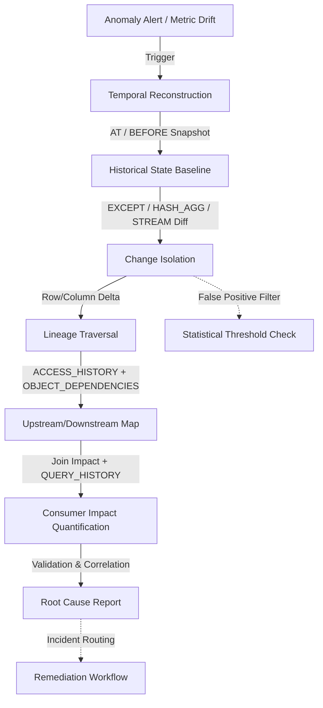

# Diagnostic Analysis

# 1. Title
SnowPro Advanced: Diagnostic Analysis & Root Cause Investigation Architecture

# 2. Overview
- **What it does**: Defines deterministic patterns for isolating data deviations, tracing upstream changes, reconstructing historical states, quantifying downstream impact, and validating causal relationships within Snowflake environments.
- **Why it exists**: Metric drift, pipeline failures, and schema anomalies require forensic investigation, not guesswork. Without structured diagnostic primitives, teams misattribute causality, waste compute on unbounded scans, and fail to isolate the exact modification triggering downstream breaks.
- **Where it fits**: Operates across operational telemetry, curated datasets, metadata catalogs, and Time Travel boundaries. Bridges alerting systems with forensic querying, lineage tracing, and impact quantification.
- **Intended consumer**: Data reliability engineers, analytics engineers, platform architects, incident responders, and SnowPro Advanced candidates evaluating forensic query mechanics, lineage resolution, temporal reconstruction, and impact analysis boundaries.

# 3. SQL Object Summary
| Field | Value |
|-------|-------|
| Object Scope | Diagnostic Analysis & Forensic Investigation Framework |
| Type | Temporal Comparison Queries, Lineage Traversal, Change Detection, Impact Mapping |
| Purpose | Isolate root causes, trace data deviations, quantify metric drift, enable deterministic state reconstruction |
| Source Objects | Curated tables, `ACCOUNT_USAGE`, `ACCESS_HISTORY`, `STREAM` metadata, `OBJECT_DEPENDENCIES`, Time Travel snapshots |
| Output Object | Deviation reports, impact propagation maps, root cause candidates, forensic audit trails |
| Execution Mode | Ad-hoc forensic queries, scheduled drift detection, point-in-time reconstruction (`AT`/`BEFORE`), incremental CDC comparison |

# 4. Architecture
Diagnostic analysis follows a sequential investigation pipeline: anomaly detection triggers temporal reconstruction, which feeds lineage traversal and change isolation. Impact quantification maps the deviation to downstream consumers, while forensic validation confirms causality.

# 5. Data Flow / Process Flow
| Step | Input | Transformation | Output | Purpose |
|------|-------|----------------|--------|---------|
| 1. Anomaly Trigger | Alerting system, threshold breach, manual flag | Query parameter binding, target object resolution | Investigation scope definition | Establish boundaries before forensic execution |
| 2. Temporal Reconstruction | Target table, timestamp/offset, Time Travel window | `SELECT ... AT(TIMESTAMP => ...)` or `BEFORE(STATEMENT => ...)` | Historical state snapshot | Establish baseline state prior to deviation |
| 3. Change Isolation | Current state vs historical snapshot | `EXCEPT`, `HASH_AGG` comparison, `STREAM` delta extraction | Modified/added/deleted rows & columns | Pinpoint exact data modification triggering anomaly |
| 4. Lineage Resolution | Affected object, dependency metadata | `ACCESS_HISTORY` JSON flattening + `OBJECT_DEPENDENCIES` recursion | Directed upstream/downstream graph | Identify propagation path and cross-table dependencies |
| 5. Impact Quantification | Change delta, consumer query history | `QUERY_HISTORY` join, grant audit, affected row/metric count | Business impact score, affected consumer list | Prioritize remediation, communicate blast radius |

# 6. Logical Breakdown of the SQL
| Component | Responsibility | Inputs | Outputs | Dependencies | Failure Modes / Risks |
|-----------|----------------|--------|---------|--------------|-----------------------|
| Time Travel Reconstruction | State rollback to exact point | Table name, timestamp/statement ID, offset | Historical row set | `DATA_RETENTION_TIME_IN_DAYS` > 0, valid offset | Expired window returns error; incomplete if DDL altered schema |
| Change Detection (`EXCEPT`/`HASH_AGG`) | Row/column delta identification | Current table, historical snapshot, join keys | Modified rows, unchanged rows, deleted rows | Exact schema match, stable primary/surrogate keys | Column reorder breaks `EXCEPT`; hash collisions mask changes (negligible but non-zero) |
| Lineage Graph Traversal | Dependency mapping across objects | `ACCESS_HISTORY`, `OBJECT_DEPENDENCIES`, target object | Parent/child object list, query IDs, column mappings | 365-day retention, static dependency resolution | Dynamic SQL/UDFs break lineage; circular view chains cause infinite recursion |
| Impact Scoring | Downstream consumer exposure measurement | Delta rows, `QUERY_HISTORY`, `GRANTS`, BI dashboard mappings | Affected query count, user list, metric deviation | Role grants audit, query tagging consistency | Untagged queries invisible to impact analysis; overcounts cached results |
| Statistical Deviation Validation | False positive filtering | Current vs historical metric distributions | Z-score, percentile delta, confidence flag | Representative sample size, stable grain | Small baselines amplify variance; seasonal shifts trigger false alerts |

# 7. Data Model
| Entity | Role | Important Fields | Grain | Relationships | Keys | Null Handling |
|--------|------|------------------|-------|---------------|------|---------------|
| `FORENSIC_SNAPSHOT` | Historical state capture | `TABLE_NAME`, `SNAPSHOT_TS`, `ROW_COUNT`, `HASH_SUM`, `SCHEMA_VERSION` | 1 row = 1 table state at point-in-time | Baseline for `EXCEPT`/delta comparison | `TABLE_NAME` + `SNAPSHOT_TS` | `NULL` if Time Travel expired or table dropped |
| `CHANGE_DELTA_LOG` | Row/column modification record | `KEY_HASH`, `DELTA_TYPE` (INSERT/UPDATE/DELETE), `CHANGED_COLUMNS`, `PREV_VALUE`, `CURR_VALUE` | 1 row = 1 changed column/value pair | Maps to `FORENSIC_SNAPSHOT`, feeds impact analysis | `KEY_HASH` + `COLUMN_NAME` + `DELTA_TS` | `PREV_VALUE` null on insert; `CURR_VALUE` null on delete |
| `LINEAGE_IMPACT_MAP` | Dependency & propagation graph | `SOURCE_OBJECT`, `TARGET_OBJECT`, `QUERY_ID`, `COLUMN_PATH`, `IMPACT_WEIGHT` | 1 row = 1 dependency edge | References `OBJECT_DEPENDENCIES`, `ACCESS_HISTORY` | Composite: `SOURCE_OBJECT` + `TARGET_OBJECT` + `COLUMN_PATH` | `COLUMN_PATH` null for object-level-only dependencies |
| `DIAGNOSTIC_REPORT` | Root cause & impact summary | `INCIDENT_ID`, `ROOT_CAUSE_CANDIDATE`, `CONFIDENCE_SCORE`, `AFFECTED_CONSUMERS`, `REMEDIATION_STATUS` | 1 row = 1 investigation instance | Aggregates delta, lineage, impact metrics | `INCIDENT_ID` | `ROOT_CAUSE_CANDIDATE` null if multi-cause ambiguity |

**Output Grain**: Fixed at investigation instance level. `CHANGE_DELTA_LOG` = column-level change. `LINEAGE_IMPACT_MAP` = dependency edge. `DIAGNOSTIC_REPORT` = 1:1 with incident. Grain mismatch between delta extraction and impact scoring inflates or deflates blast radius.

# 8. Business Logic
| Rule | Effect | Implementation Pattern | Edge Case |
|------|--------|------------------------|-----------|
| **Temporal Boundary Alignment** | Ensures baseline matches deviation onset | `BEFORE(STATEMENT => 'query_id')` vs fixed timestamp | DDL statements reset Time Travel metadata; use `BEFORE` with last known good query ID |
| **Change Isolation Precision** | Distinguishes data vs schema changes | `EXCEPT` for data diff, `INFORMATION_SCHEMA.COLUMNS` diff for schema | `EXCEPT` ignores column order; requires explicit column projection for accuracy |
| **Lineage Depth Control** | Prevents graph explosion on wide dependency chains | Recursive CTE with `MAX_RECURSION` or `ARRAY_LENGTH` cap | Shallow depth misses indirect consumers; deep depth times out on complex DAGs |
| **Impact Weighting** | Prioritizes high-value downstream breaks | Score = `QUERY_FREQUENCY * USER_COUNT * METRIC_CRITICALITY` | Uncached vs cached queries misweighted; requires `RESULT_SOURCE` filter |
| **False Positive Suppression** | Filters expected variance from noise | `ABS(current - baseline) / NULLIF(baseline, 0) < threshold` OR seasonality flag | Threshold too tight triggers alert fatigue; too loose misses real breaks |
| **Deterministic Replay** | Validates fix without re-introducing break | Run transformation on isolated clone using `CREATE ... CLONE` | Clone inherits Time Travel window; may not capture exact production state if retention expired |

# 9. Transformations
| Source | Derived | Formula / Rule | Business Meaning | Impact |
|--------|---------|----------------|------------------|--------|
| Current vs historical rows | Delta flag set | `EXCEPT` + `INTERSECT`, or `HASH_AGG` comparison | Isolates exact records modified during incident window | Eliminates manual row-by-row inspection; scales to millions of rows |
| Raw lineage JSON | Resolved column path | `GET_PATH(DIRECT_OBJECTS_ACCESSED, 'columnName')` + `CONCAT` with schema/db | Maps query impact to specific columns | Enables precise blast radius calculation; breaks if JSON schema changes |
| Query execution metrics | Impact score | `COUNT(DISTINCT QUERY_ID) * AVG(ROWS_PRODUCED) * CRITICALITY_FLAG` | Quantifies downstream business disruption | Drives incident priority; requires consistent `QUERY_TAG` enforcement |
| Distribution metrics | Deviation score | `Z_SCORE = (current_val - mean) / NULLIF(stddev, 0)` | Flags statistical anomalies vs historical baseline | High Z-score = likely data break; requires minimum sample size (n>30) |
| Time Travel snapshot | Baseline hash | `HASH_AGG(*) OVER()` or `MD5(CONCAT_WS('|', col1...))` | Compact state representation for rapid comparison | Reduces storage vs full snapshot copy; collision risk negligible but non-zero |

# 10. Parameters / Variables / Macros
| Name | Type | Purpose | Allowed Format | Default | Usage | Effect on Output |
|------|------|---------|----------------|---------|-------|------------------|
| `TIME_TRAVEL_BOUNDARY` | String | State reconstruction point | Timestamp, offset, or statement ID | `CURRENT_TIMESTAMP` | `AT`/`BEFORE` clause | Determines baseline accuracy; invalid ID returns error |
| `LINEAGE_MAX_DEPTH` | Integer | Dependency traversal limit | 1–10 | 3 | Recursive CTE / lineage query | Caps graph size; higher values risk timeout, lower values miss indirect impacts |
| `DEVIATION_THRESHOLD` | Float | Statistical anomaly cutoff | Z-score (2.0–3.0) or % variance | 2.5 | Deviation validation logic | Lower threshold = more false positives; higher = missed real breaks |
| `IMPACT_WINDOW` | Integer | Query history lookback for consumers | Days (1–365) | 7 | `QUERY_HISTORY` join | Short window misses infrequent consumers; long window includes stale queries |
| `SCHEMA_STRICT_MODE` | Boolean | Enforce exact column matching for diff | `TRUE` / `FALSE` | `FALSE` | Change detection logic | `TRUE` fails on column add/drop; `FALSE` compares intersection only |
| `FALSE_POSITIVE_FILTER` | Enum | Exclude expected variance | `SEASONAL`, `MAINTENANCE`, `BACKFILL`, `NONE` | `NONE` | Incident routing | Tags skip alerting; misclassification hides real issues |

# 11. APIs / Interfaces
| Interface | Invocation Method | Input Structure | Output Structure | Error Behavior | Consumers |
|-----------|-------------------|-----------------|------------------|----------------|-----------|
| `AT` / `BEFORE` Time Travel Syntax | SQL | Table, timestamp/statement/offset | Historical row set | `Time travel data expired` if outside retention | Forensic reconstruction, baseline establishment |
| `EXCEPT` / `INTERSECT` | SQL | Two queries with identical column sets | Delta or common rows | Fails if column count/order/types mismatch | Change isolation, row-level diff |
| `ACCESS_HISTORY` | SQL | Time range, object filters | Column-level query lineage | JSON structure changes in future releases; requires version-aware parsing | Lineage tracing, impact mapping |
| `OBJECT_DEPENDENCIES` | SQL | Object type/name filters | Static dependency edges | Misses dynamic SQL, temp tables, external functions | Dependency graph building, upstream tracing |
| `ACCOUNT_USAGE.QUERY_HISTORY` | SQL | Date range, warehouse, tag filters | Execution metrics, status, cache source | 14-day retention; requires `MONITOR` role | Impact quantification, consumer tracking |

# 12. Execution / Deployment
- **Manual vs Scheduled**: Forensic queries run ad-hoc during incidents. Drift detection runs scheduled via `TASK`. Impact analysis runs post-incident for audit.
- **Batch vs On-Demand**: Time Travel reconstruction is on-demand. Change detection runs batch on isolated snapshots. Lineage traversal runs on-demand with cached dependency graphs.
- **Orchestration**: Incident management tools trigger diagnostic workflows via webhooks. `TASK` schedules run drift detection queries. CI/CD validates diagnostic query syntax against staging.
- **Upstream Dependencies**: Time Travel retention validity, `ACCESS_HISTORY` availability, `QUERY_HISTORY` completeness, role privileges, stable object naming.
- **Environment Behavior**: Dev/test use shortened retention, mock alerts, and manual triggers. Prod enforces strict `MONITOR` role separation, automated impact routing, and retention alignment with SLA.
- **Runtime Assumptions**: `AT`/`BEFORE` operates at statement/transaction boundary, not row-level. `ACCESS_HISTORY` truncates at 365 days. `EXCEPT` requires exact schema alignment. Diagnostic queries inherit caller role privileges.

# 13. Observability
| Metric | Implementation | Detection Method | Operational Threshold |
|--------|----------------|------------------|------------------------|
| Investigation latency | `TOTAL_ELAPSED_TIME` from alert trigger to `DIAGNOSTIC_REPORT` insertion | Incident management system | >30 min for critical metrics = pipeline or privilege bottleneck |
| Lineage completeness | `% of queries with resolved DIRECT_OBJECTS_ACCESSED` in impact window | `ACCESS_HISTORY` vs `QUERY_HISTORY` join | <60% = dynamic SQL/UDF dominance; impact map incomplete |
| False positive rate | `COUNT(alerts) WHERE root_cause = 'EXPECTED_VARIANCE' / TOTAL_ALERTS` | Diagnostic report aggregation | >25% = threshold misaligned; requires recalibration or seasonality filter |
| Time Travel utilization | `COUNT(AT/BEFORE queries) / TOTAL_DIAGNOSTIC_QUERIES` | `QUERY_HISTORY` parsing | <50% = teams using alternative baselines; increases manual error risk |
| Change detection accuracy | `VALIDATED_DELTA_ROWS / TOTAL_REPORTED_DELTA_ROWS` | Post-incident audit comparison | <90% = schema drift or `EXCEPT` column mismatch; requires strict mode |

# 14. Failure Handling & Recovery
| Failure Scenario | What Breaks | Detection | Fallback Behavior | Recovery Approach |
|------------------|-------------|-----------|-------------------|-------------------|
| Time Travel window expired | Historical baseline unavailable | `AT`/`BEFORE` query returns `expired` error | No point-in-time comparison possible | Restore from external backup/data lake, or use last known good snapshot table |
| Incomplete lineage due to dynamic SQL | Impact map misses downstream consumers | `ACCESS_HISTORY` returns null/empty for critical queries | Underestimated blast radius | Instrument application to log resolved queries; use `OBJECT_DEPENDENCIES` as static fallback |
| False positive spike | Alert fatigue, wasted investigation cycles | Diagnostic reports show high `EXPECTED_VARIANCE` ratio | Teams ignore alerts, miss real breaks | Recalibrate `DEVIATION_THRESHOLD`, add seasonality/maintenance filters, validate grain |
| Lineage traversal timeout | Recursive CTE or graph scan exceeds limit | Query killed with timeout or memory spill | Investigation stalls, partial map returned | Cap `LINEAGE_MAX_DEPTH`, cache dependency graph, use iterative chunking |
| Ambiguous multi-cause root | Multiple upstream changes correlate with deviation | `ROOT_CAUSE_CANDIDATE` null or multiple flags | Incident resolution delayed | Run isolation tests on zero-copy clones, replay transformations sequentially |
| Schema drift breaks `EXCEPT` | Column add/drop/reorder invalidates diff logic | `EXCEPT` fails or returns full table mismatch | Change isolation inaccurate | Switch to key-based join + column intersection comparison, enable `SCHEMA_STRICT_MODE=FALSE` |

# 15. Security & Access Control
| Control | Implementation | Effect |
|---------|----------------|--------|
| Role-based forensic access | `GRANT MONITOR ON ACCOUNT TO ROLE DIAGNOSTICS_ROLE` | Restricts `ACCESS_HISTORY`/`QUERY_HISTORY` to authorized investigators |
| Time Travel privilege separation | `UNDROP` and `CLONE` restricted to `ACCOUNTADMIN`/`SYSADMIN` | Prevents unauthorized state reconstruction or data duplication |
| Sensitive data masking in diagnostics | `DYNAMIC DATA MASKING` applied to forensic query results | Hides PII during investigation; preserves audit trail for authorized roles |
| Impact report scoping | `ROW ACCESS POLICY` on `DIAGNOSTIC_REPORT` by business unit | Limits blast radius visibility to affected domain owners |
| Audit logging | `ACCESS_HISTORY` + `DIAGNOSTIC_REPORT` join | Tracks who investigated what, when, and which data was accessed |

# 16. Performance / Scalability Considerations
| Bottleneck | Cause | Tradeoff | Mitigation |
|------------|-------|----------|------------|
| Large `ACCESS_HISTORY` scans | Unfiltered time range, wide JSON parsing | High compute, slow lineage resolution | Filter by object name, parse only relevant JSON paths, cache dependency graph |
| Recursive lineage traversal | Deep DAG, high object count, no cycle detection | Stack overflow, timeout, memory pressure | Implement `MAX_RECURSION` cap, use iterative BFS, pre-compute static edges |
| Full table `EXCEPT` comparison | Unbounded row sets, missing join keys | Full scan of both tables, high spill risk | Compare only primary/surrogate keys + hash of business columns, not full rows |
| Time Travel metadata lookup | DDL history fragmentation, frequent schema changes | Slow snapshot resolution, stale metadata | Use `BEFORE(STATEMENT)` instead of timestamp, consolidate DDL operations |
| High-cardinality impact joins | `QUERY_HISTORY` joined to large consumer registry | Join explosion, cache bypass | Pre-filter by `QUERY_TAG`, use semi-joins (`EXISTS`), aggregate before join |
| Non-sargable diagnostic filters | `WHERE DATE(QUERY_START_TIME) = ...` | Disables pruning, full metadata scan | Filter on native `TIMESTAMP` type, use range predicates, add search optimization |

# 17. Assumptions & Constraints
- **No concrete SQL provided**: Documentation reflects canonical diagnostic patterns for SnowPro Advanced. Exact behavior depends on retention settings, lineage completeness, and privilege configuration.
- **Time Travel retention is fixed**: Standard = 1 day, Enterprise+ = up to 90 days. Expired data cannot be reconstructed natively. Fail-Safe is internal-only, non-queryable.
- **`ACCESS_HISTORY` tracks static column references only**: Dynamic SQL, prepared statements, and UDFs break lineage resolution. 365-day retention enforced.
- **`EXCEPT` requires identical schema**: Column count, order, and types must match. Schema drift invalidates row-level diff without explicit projection alignment.
- **Lineage is directional and acyclic**: `OBJECT_DEPENDENCIES` does not resolve circular view chains. Recursive queries must implement depth limits.
- **Diagnostic queries inherit caller privileges**: `ACCESS_HISTORY`, `QUERY_HISTORY`, and Time Travel access require explicit role grants. No elevation occurs automatically.
- **Exam trap assumptions**: SnowPro Advanced tests Time Travel boundary syntax (`AT` vs `BEFORE`), `ACCESS_HISTORY` retention limits, `EXCEPT` schema requirements, lineage static vs dynamic resolution, impact scoring mechanics, false positive filtering, and privilege separation for forensic access. Memorize defaults and query boundaries.

# 18. Future Enhancements
- **Cache static lineage graphs**: Materialize `OBJECT_DEPENDENCIES` + resolved `ACCESS_HISTORY` into dedicated tables. Refresh daily. Cuts recursive query latency during incidents.
- **Automate delta hashing contracts**: Replace full `EXCEPT` with key-based join + `HASH_AGG` on business columns. Reduces compute, scales to billion-row tables.
- **Integrate incident management routing**: Pipe `DIAGNOSTIC_REPORT` to PagerDuty/ServiceNow via webhooks. Auto-attach impact scope, root cause candidate, and remediation playbook.
- **Harden seasonality filtering**: Embed time-series decomposition into deviation validation. Flag expected cyclical variance automatically. Reduces alert fatigue.
- **Standardize zero-copy diagnostic clones**: Enforce `CREATE TABLE ... CLONE` for safe replay testing. Isolate investigation from production, preserve Time Travel context.
- **Implement impact scoring automation**: Map `QUERY_TAG` + `WAREHOUSE` + `USER` to business criticality weights. Replace manual blast radius estimation with deterministic scoring.
