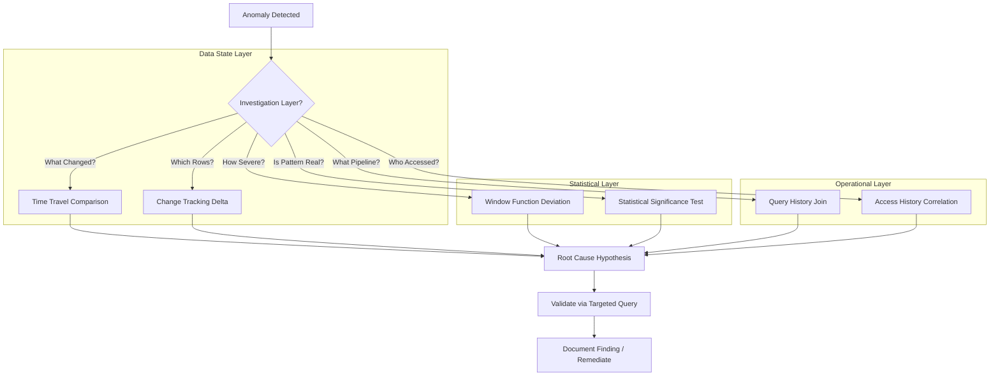

# 1. Diagnostic Analysis: Root Cause Investigation of Anomalies in Historical Data
Documentation of Snowflake patterns, system views, and analytical techniques for identifying, isolating, and explaining deviations, trends, or unexpected patterns in historical datasets.

# 2. Overview
Diagnostic analysis in Snowflake is the systematic process of investigating anomalies—unexpected spikes, drops, distribution shifts, or pattern breaks—in historical data to determine root causes. It exists to enable data teams to distinguish between data quality issues, pipeline failures, business event impacts, and statistical noise. The feature leverages Snowflake's time travel, change tracking, query history, and analytical SQL primitives to support reproducible, auditable investigations. The intended consumers are data engineers debugging pipeline regressions, analysts explaining business metric volatility, and SnowPro Advanced candidates tested on historical comparison patterns, system view utilization, and statistical function application.

# 3. SQL Object Summary

| Object/Feature | Type | Purpose | Source Objects/Inputs | Output/Behavior | Invocation |
|----------------|------|---------|----------------------|-----------------|------------|
| Time Travel Query | Historical Data Access | Compare current state to prior point-in-time | Table name, timestamp or offset | Row-level snapshot as of specified time | `SELECT * FROM table AT(OFFSET => -3600)` |
| Change Tracking Metadata | System-Managed Delta Log | Identify inserted, updated, deleted rows | Table with `CHANGE_TRACKING = TRUE` | Row-level change events with metadata | `SELECT * FROM TABLE(CHANGES(table => 't', mode => 'delta'))` |
| Statistical Deviation Function | Analytical SQL Pattern | Quantify anomaly severity via z-score, percentile, or IQR | Metric column, window definition | Anomaly score or flag per row | `SELECT ..., (value - AVG(value) OVER (...)) / STDDEV(value) OVER (...) AS z_score` |
| Query/Access History Join | Operational Diagnostics | Correlate data anomalies with pipeline or user activity | `ACCOUNT_USAGE.QUERY_HISTORY`, `ACCESS_HISTORY` | Timeline of executions impacting target objects | `JOIN` on `OBJECT_NAME`, `QUERY_TEXT`, `START_TIME` |
| Temporal Comparison CTE | Investigative Query Pattern | Compare metric across time windows (WoW, MoM, same-day prior week) | Fact table with date dimension | Period-over-period delta, percent change | CTE with self-join or window function |

# 4. Architecture
Diagnostic analysis operates across three layers: (1) data state comparison using time travel or change tracking, (2) statistical evaluation using window functions or aggregate comparisons, and (3) operational correlation using system views. Investigations typically begin with anomaly detection (what changed), proceed to temporal isolation (when did it change), then to root cause attribution (why did it change).

# 5. Data Flow / Process Flow
1. **Anomaly Signal**: Threshold alert, visual dashboard spike, or stakeholder report triggers investigation.
2. **Temporal Scope Definition**: Analyst identifies relevant time window (e.g., last 24 hours, same day prior week).
3. **Baseline Comparison**: 
   - Time travel: Query table at prior timestamp to isolate row-level differences.
   - Change tracking: Pull delta events for affected table within investigation window.
   - Statistical: Compute deviation metrics (z-score, percentile rank) against rolling baseline.
4. **Operational Correlation**: Join anomaly timeline with `QUERY_HISTORY` to identify pipeline executions, DDL changes, or large data loads coinciding with deviation.
5. **Hypothesis Validation**: Construct targeted query to test root cause (e.g., filter by source system, join to dimension for attribute-level drill-down).
6. **Attribution & Documentation**: Record finding in incident log; implement guardrail (data quality check, alert threshold adjustment) if warranted.

Row count may expand during drill-down (e.g., aggregating to daily then expanding to transactional). Grain shifts from summary anomaly to detailed attribution.

# 6. Logical Breakdown

| Component | Responsibility | Inputs | Outputs | Dependencies | Failure Modes |
|-----------|----------------|--------|---------|--------------|---------------|
| Time Travel Resolver | Retrieve historical table state | Table name, timestamp/offset, retention window | Snapshot result set | Time travel retention (0-90 days), object existence | Retention exceeded, table dropped, offset ambiguity |
| Change Tracking Scanner | Extract row-level delta events | Table with `CHANGE_TRACKING=TRUE`, time bounds | `CHANGE_TYPE`, `ROW_ID`, `TIMESTAMP` rows | Change tracking enabled, metadata consistency | Tracking disabled, metadata lag, high-churn table overflow |
| Statistical Deviation Calculator | Compute anomaly severity metric | Metric column, partition/window definition | Z-score, percentile, IQR flag per row | Sufficient baseline data, non-null values | Insufficient sample size, skewed distribution, null propagation |
| Operational Timeline Joiner | Correlate data changes with pipeline activity | `QUERY_HISTORY`, `ACCESS_HISTORY`, target object name | Execution events filtered by relevance | Account usage view latency (up to 45 min), object name matching | View latency delays correlation, case-sensitive name mismatch |
| Drill-Down Query Composer | Isolate attribute-level contributors | Anomalous metric, dimension hierarchy, filter predicates | Granular breakdown of anomaly drivers | Dimensional model integrity, filter selectivity | Join explosion, missing dimension keys, over-filtering |

# 7. Data Model (State Model)
Diagnostic analysis does not define persistent entities but operates on transient investigative state.

| Entity | Role | Key Fields | Grain | Relationships | Null Handling |
|--------|------|-----------|-------|--------------|---------------|
| `BASELINE_METRIC` (CTE) | Reference distribution for comparison | `date_key`, `metric_value`, `window_stats` | One row per time bucket (e.g., day) | Self-referential for lag/lead comparisons | Null buckets excluded from statistical calculation |
| `ANOMALY_CANDIDATE` (CTE) | Flagged deviations requiring investigation | `timestamp`, `metric_value`, `z_score`, `is_anomaly` | One row per flagged observation | Joined to dimensions for attribution | Z-score NULL if baseline stddev = 0 |
| `PIPELINE_EVENT` (from `QUERY_HISTORY`) | Operational activity timeline | `query_id`, `start_time`, `query_text`, `rows_produced` | One row per executed statement | Joined to target tables via `OBJECT_DEPENDENCIES` | `QUERY_TEXT` truncated; use `QUERY_HISTORY` with `TEXT` column |
| `CHANGE_DELTA` (from `CHANGES()`) | Row-level modification log | `ROW_ID`, `CHANGE_TYPE`, `CHANGE_TIMESTAMP`, `stream_column` | One row per modified record | Linked to base table via primary/key surrogate | `ROW_ID` is internal; not portable across clones |

**Grain Consistency**: Diagnostic queries must explicitly define comparison grain (e.g., daily aggregate vs transactional). Mixing grains without proper grouping causes misattribution.

# 8. Business Logic (Execution Logic)
- **Anomaly Definition Rules**: 
  - Threshold-based: `metric > baseline + N*stddev` or `metric < percentile_5`.
  - Pattern-based: Break in seasonality detected via residual analysis.
  - Volume-based: Row count deviation > X% from rolling average.
- **Temporal Comparison Logic**: 
  - WoW (Week-over-Week): Compare same weekday to control for day-of-week effects.
  - MoM (Month-over-Month): Use `DATE_TRUNC('month')` with lag window.
  - Same-hour prior day: Critical for intraday anomaly detection.
- **Statistical Significance**: Z-score > |3| or percentile < 1%/ > 99% commonly flags anomalies. Exam trap: Small sample sizes invalidate z-score assumptions; use non-parametric methods (IQR) when n < 30.
- **Operational Correlation**: Join `QUERY_HISTORY` on `START_TIME` within ±15 min of anomaly timestamp. Filter `QUERY_TEXT` for keywords (`INSERT`, `MERGE`, `COPY INTO`) to identify data-loading events.
- **Exam-Relevant Defaults**: Time travel retention defaults to 1 day (Standard) or up to 90 days (Enterprise). `ACCOUNT_USAGE` views have ~45 minute latency. Change tracking must be explicitly enabled per table.

# 9. Transformations

| Source Input | Target Output | Rule/Logic | Execution Meaning | Impact |
|--------------|---------------|------------|-------------------|--------|
| Raw metric time series | Anomaly-flagged dataset | `CASE WHEN ABS(z_score) > 3 THEN TRUE ELSE FALSE END` | Isolates statistically significant deviations | Enables focused investigation; reduces noise |
| Table at T0 vs T1 (Time Travel) | Row-level delta | `EXCEPT` or `MINUS` set operation, or `CHANGES()` function | Identifies inserted/updated/deleted records | Pinpoints data changes; requires change tracking for efficiency |
| `QUERY_HISTORY` + target table | Pipeline impact timeline | `JOIN` on `OBJECT_NAME` AND time window overlap | Correlates executions with data anomalies | Attributes anomalies to specific jobs; view latency requires buffer |
| Dimensional drill-down | Attribute-level contribution | `GROUP BY` dimension attributes with metric aggregation | Decomposes aggregate anomaly into component drivers | Reveals root cause (e.g., single region, product line); may expand row count |

# 10. Parameters / Variables / Configuration

| Name | Type | Purpose | Allowed Values/Format | Default | Where Used | Effect |
|------|------|---------|----------------------|---------|------------|--------|
| `DATA_RETENTION_TIME_IN_DAYS` | Table/Account Parameter | Control time travel retention window | Integer 0-90 | 1 (Standard), up to 90 (Enterprise) | `CREATE TABLE`, account config | Determines how far back historical comparisons can reach |
| `CHANGE_TRACKING` | Table Property | Enable row-level delta logging | `TRUE`/`FALSE` | `FALSE` | `CREATE TABLE`, `ALTER TABLE` | Required for efficient `CHANGES()` queries; adds metadata overhead |
| `ANOMALY_THRESHOLD` | Analytical Parameter | Define deviation cutoff for flagging | Numeric (z-score, percentile, absolute) | Context-dependent | Investigative query `WHERE` clause | Controls false positive/negative tradeoff |
| `CORRELATION_WINDOW` | Analytical Parameter | Time buffer for operational event matching | Interval string (`'15 minutes'`, `'1 hour'`) | `'15 minutes'` | `QUERY_HISTORY` join predicate | Wider window increases recall but reduces precision |
| `BASELINE_WINDOW` | Analytical Parameter | Define reference period for statistical comparison | Integer (days) or dynamic (`'same day prior week'`) | 7-30 days | Window function `OVER` clause | Longer windows smooth noise but may miss recent shifts |

# 11. APIs / Interfaces
- **Time Travel**: `AT(TIMESTAMP => ...)`, `AT(OFFSET => ...)`, `BEFORE(STATEMENT => ...)` syntax in `FROM` clause
- **Change Tracking**: `TABLE(CHANGES(table => 'name', mode => 'delta|append', ...))` table function
- **System Views**: 
  - `ACCOUNT_USAGE.QUERY_HISTORY`: Execution metadata, timing, row counts
  - `ACCOUNT_USAGE.ACCESS_HISTORY`: Object-level access patterns
  - `INFORMATION_SCHEMA.TABLE_STORAGE_METRICS`: Size changes over time
- **Statistical Functions**: `STDDEV()`, `PERCENTILE_CONT()`, `APPROX_PERCENTILE()`, `CORR()` for deviation and correlation analysis
- **Error Behavior**: Time travel beyond retention raises `Time travel data is not available`. Change tracking on disabled table raises `Change tracking is not enabled`.

# 12. Execution / Deployment
- **Execution Mode**: Ad-hoc investigative queries run synchronously. Complex diagnostics may be scripted as stored procedures or scheduled as tasks for recurring anomaly review.
- **Batch vs Incremental**: Time travel and change tracking support incremental investigation (scan only changed rows). Statistical baselines may require full scan of historical window.
- **Orchestration**: Diagnostic workflows often triggered by alerting systems (e.g., metric threshold breach). Snowflake Tasks can automate routine anomaly scans.
- **Environment Strategy**: Investigation typically occurs in PROD or PROD-clone environments. Time travel and change tracking must be enabled in target environment.
- **Runtime Assumptions**: `ACCOUNT_USAGE` views have eventual consistency (~45 min latency). Real-time diagnostics require direct `QUERY_HISTORY` access or custom telemetry.

# 13. Observability
- **Anomaly Detection Logging**: Store flagged anomalies in audit table with timestamp, metric, z-score, and investigation status for trend analysis.
- **Investigation Tracking**: Log root cause findings, remediation actions, and false positive markers to improve future detection rules.
- **System View Monitoring**: Track `ACCOUNT_USAGE` view refresh latency; adjust correlation windows accordingly.
- **Query Performance**: Diagnostic queries scanning large historical windows benefit from clustering on date/timestamp columns. Monitor `BYTES_SCANNED` in `QUERY_HISTORY`.
- **Alert Feedback Loop**: Measure precision/recall of anomaly rules by comparing flagged events to confirmed incidents. Tune thresholds iteratively.

# 14. Failure Handling & Recovery

| Failure Scenario | Symptom | Detection | Fallback | Recovery |
|------------------|---------|-----------|----------|----------|
| Time Travel Retention Exceeded | `Time travel data is not available` error | Query compilation failure | Use change tracking delta or baseline table snapshot | Increase retention policy for critical tables; implement archival pattern |
| Change Tracking Disabled | `CHANGES()` function fails or returns empty | Function error, unexpected zero delta | Fall back to full table `EXCEPT` comparison (costly) | Enable `CHANGE_TRACKING` on critical tables; document requirement |
| Insufficient Baseline Data | Statistical functions return NULL or unstable metrics | Z-score NULL, stddev = 0 | Use absolute threshold or non-parametric IQR method | Ensure minimum baseline window; handle cold-start scenarios explicitly |
| `ACCOUNT_USAGE` View Latency | Operational correlation misses recent events | Query shows no matching pipeline executions | Query `INFORMATION_SCHEMA.QUERY_HISTORY` (shorter retention, lower latency) | Buffer correlation window by 45+ minutes; document latency assumption |
| Join Explosion in Drill-Down | Query timeout or memory spill | `QUERY_HISTORY` shows high `SPILL_BYTES` | Pre-aggregate to higher grain, add selective filters | Optimize dimension keys, ensure clustering on join columns, limit drill depth |

# 15. Security & Access Control
- **Time Travel Access**: Requires `SELECT` privilege on table at current time. Historical data inherits same access controls; no separate permission model.
- **Change Tracking Metadata**: `CHANGES()` function respects row access policies and masking policies. Sensitive columns remain masked in delta output.
- **System View Access**: `ACCOUNT_USAGE` views require `ORGANIZATION ADMIN` or granted `SELECT` on `ACCOUNT_USAGE` schema. `INFORMATION_SCHEMA` views require object-level privileges.
- **Diagnostic Data Handling**: Investigation results may contain sensitive attributes. Store findings in governed audit tables with appropriate retention and access policies.
- **Exam Note**: Time travel does not bypass row access policies. A user who cannot see a row currently cannot see it via time travel. Change tracking output is filtered by the caller's privileges.

# 16. Performance / Scalability Considerations
- **Time Travel Scan Cost**: Querying historical state scans micro-partitions as of the target timestamp. Clustering on timestamp or date columns enables pruning.
- **Change Tracking Efficiency**: `CHANGES()` function reads lightweight metadata, not full table data. Far more efficient than full-table `EXCEPT` for high-churn tables.
- **Statistical Window Overhead**: Window functions computing `STDDEV` or `PERCENTILE` over large partitions incur sort/shuffle cost. Pre-aggregate to daily grain before deviation calculation when possible.
- **System View Join Scale**: `QUERY_HISTORY` contains millions of rows. Always filter by `START_TIME` and `OBJECT_NAME` before joining to avoid full scan.
- **Drill-Down Cardinality Risk**: Expanding from aggregate anomaly to transactional detail can increase row count 100-1000x. Apply selective filters early; use `LIMIT` for exploratory analysis.
- **Exam Trap**: Candidates assume time travel is free. It consumes compute credits proportional to data scanned. Change tracking adds minimal storage overhead but requires explicit enablement.

# 17. Assumptions & Constraints
- Time travel retention is configurable per table but capped at 90 days (Enterprise). Investigations beyond this window require archival tables or external history.
- Change tracking must be explicitly enabled via `ALTER TABLE ... SET CHANGE_TRACKING = TRUE`. It is not retroactive; only tracks changes after enablement.
- `ACCOUNT_USAGE` views have ~45 minute latency. Real-time operational correlation requires alternative telemetry or direct query history access.
- Statistical anomaly detection assumes stationary distributions. Structural business changes (new product launch, pricing change) invalidate historical baselines; require re-baselining logic.
- Diagnostic queries are read-only. They do not modify data but may consume significant compute if scanning large historical windows.
- SnowPro Advanced trap: Time travel syntax requires `AT` or `BEFORE` clause in `FROM`, not `WHERE`. `CHANGES()` function requires `TABLE()` wrapper. Misplaced clauses cause compilation errors.

# 18. Future Enhancements
- Introduce native anomaly detection functions (e.g., `ANOMALY_SCORE(metric, baseline_window)`) to standardize statistical deviation calculation.
- Add automated root cause suggestion engine leveraging `QUERY_HISTORY` and `ACCESS_HISTORY` to propose likely pipeline or user-activity correlations.
- Implement incremental baseline maintenance via dynamic tables to keep statistical references fresh without full recomputation.
- Extend change tracking to include column-level change metadata, enabling attribute-specific anomaly attribution without full row comparison.
- Support diagnostic query templates as reusable stored procedures or Snowflake Native Apps to accelerate common investigation patterns (WoW comparison, pipeline correlation, drill-down).
