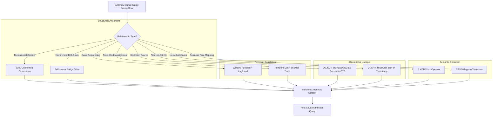

# 1. Collect Related Data in Snowflake: Contextual Enrichment Patterns for Diagnostic Analysis
Documentation of Snowflake techniques for gathering associated, contextual, or linked data during root cause investigations, anomaly attribution, and historical pattern analysis.

# 2. Overview
Collecting related data is the systematic process of enriching an anomaly signal or investigative target with contextual attributes, upstream dependencies, downstream impacts, and temporal correlations to enable root cause attribution. It exists to transform isolated metric deviations into explainable events by joining dimensional context, traversing object dependencies, correlating pipeline activity, and navigating semi-structured payloads. The feature targets data engineers debugging pipeline regressions, analysts explaining business metric volatility, and SnowPro Advanced candidates tested on join cardinality management, dependency traversal patterns, and system view integration for diagnostic workflows.

# 3. SQL Object Summary

| Object/Feature | Type | Purpose | Source Objects/Inputs | Output/Behavior | Invocation |
|----------------|------|---------|----------------------|-----------------|------------|
| Dimensional Enrichment Join | SQL Pattern | Add descriptive context to anomaly records | Fact table, conformed dimension tables | Expanded row with attribute-level drill-down | `JOIN dim_table ON fact.dim_key = dim.dim_key` |
| Temporal Correlation Join | SQL Pattern | Align events across time windows or sequences | Event tables, time dimension, lag/lead windows | Time-aligned dataset for pattern detection | `JOIN ... ON date_trunc(...) = date_trunc(...)` |
| Dependency Graph Traversal | System View Pattern | Map object lineage and upstream/downstream impact | `OBJECT_DEPENDENCIES`, `ACCESS_HISTORY` | Lineage chain showing data flow relationships | Recursive CTE or iterative join on dependency views |
| Semi-Structured Navigation | SQL Pattern | Extract nested attributes from VARIANT columns | Source table with `VARIANT`/`ARRAY`/`OBJECT` | Flattened rows with extracted key-value pairs | `FLATTEN()`, `:` operator, `TRY_CAST` |
| Change Data Integration | CDC Pattern | Correlate anomalies with source system modifications | Streams, `CHANGES()` function, audit tables | Row-level delta events with metadata context | `SELECT * FROM TABLE(CHANGES(...)) JOIN source ON ...` |

# 4. Architecture
Collecting related data operates across four relationship dimensions: (1) **structural** (foreign keys, dimensional hierarchies), (2) **temporal** (event sequencing, time-window alignment), (3) **operational** (pipeline dependencies, query lineage), and (4) **semantic** (nested JSON attributes, business rule mappings). Diagnostic workflows typically start with a narrow anomaly signal and iteratively expand context through controlled joins, avoiding cardinality explosion while preserving investigative precision.

# 5. Data Flow / Process Flow
1. **Signal Isolation**: Investigator identifies target anomaly (e.g., metric spike, row count deviation, failed validation).
2. **Context Definition**: Determine which relationship dimensions are relevant: dimensional attributes, temporal neighbors, pipeline dependencies, or nested payload fields.
3. **Controlled Expansion**: 
   - Structural: Join dimension tables using foreign keys; apply selective filters to limit cardinality.
   - Temporal: Use window functions or self-joins to align prior/subsequent events; define correlation window explicitly.
   - Operational: Query `OBJECT_DEPENDENCIES` recursively to trace upstream sources; join `QUERY_HISTORY` on timestamp overlap.
   - Semantic: Apply `FLATTEN()` or `:` operator to extract nested keys; validate extracted types with `TRY_CAST`.
4. **Cardinality Management**: Apply `QUALIFY`, `ROW_NUMBER()`, or aggregation to collapse one-to-many expansions where appropriate.
5. **Attribution Query**: Filter enriched dataset to isolate contributing factors (e.g., single region, specific pipeline, attribute value).
6. **Validation & Documentation**: Confirm hypothesis with targeted query; log findings and enrichment pattern for reuse.

Row count may expand during structural or semantic enrichment. Grain shifts from anomaly-level to attribute-level or event-level depending on join strategy.

# 6. Logical Breakdown

| Component | Responsibility | Inputs | Outputs | Dependencies | Failure Modes |
|-----------|----------------|--------|---------|--------------|---------------|
| Foreign Key Resolver | Enrich anomaly with dimensional attributes | Fact table, dimension keys, conformed dimensions | Expanded rows with descriptive context | Referential integrity, dimension availability | Orphaned keys cause left join nulls; missing dimensions block enrichment |
| Temporal Aligner | Correlate events across time boundaries | Event timestamps, window definition, lag/lead offset | Time-aligned dataset for sequence analysis | Consistent timestamp granularity, timezone handling | Timezone mismatch, irregular intervals break alignment logic |
| Dependency Traverser | Map upstream/downstream object lineage | Target object name, `OBJECT_DEPENDENCIES` view | Recursive lineage chain showing data flow | View latency (~45 min), object naming consistency | Circular dependencies cause infinite recursion; view latency misses recent changes |
| Semi-Structured Extractor | Parse nested JSON/array payloads | `VARIANT` column, target key path, expected type | Flattened rows with typed extracted values | Key existence, type consistency, null handling | Missing keys return NULL; type mismatch causes `TRY_CAST` null; array explosion increases cardinality |
| Cardinality Controller | Prevent join-induced row explosion | One-to-many join results, deduplication logic | Collapsed or filtered result set at target grain | Business rule for aggregation/selection, window function ordering | Over-aggregation loses detail; under-filtering causes memory spill |

# 7. Data Model (State Model)
Collecting related data produces transient investigative datasets. Grain and schema depend on enrichment strategy.

| Entity | Role | Key Fields | Grain | Relationships | Null Handling |
|--------|------|-----------|-------|--------------|---------------|
| `ANOMALY_BASE` (CTE) | Starting point for enrichment | `anomaly_id`, `timestamp`, `metric_value`, `object_name` | One row per flagged anomaly | Self-referential for temporal joins | Null metrics excluded from analysis |
| `DIM_CONTEXT` (Joined) | Descriptive attributes for attribution | `dim_key`, `attribute_1`, `hierarchy_level`, `valid_from/to` | One row per dimension member (SCD-aware) | Many-to-one from fact; hierarchical self-join | SCD Type 2: use `BETWEEN valid_from AND valid_to` to avoid nulls |
| `TEMPORAL_NEIGHBOR` (Windowed) | Prior/subsequent events for pattern detection | `event_id`, `lag_value`, `lead_value`, `time_delta` | One row per event with contextual neighbors | Self-join on time window; partitioned by entity | First/last events have NULL lag/lead; handle explicitly |
| `LINEAGE_CHAIN` (Recursive CTE) | Upstream/downstream dependency path | `object_name`, `referenced_object`, `dependency_type`, `depth` | One row per dependency edge | Recursive join on `OBJECT_DEPENDENCIES` | Circular references require `MAX_RECURSION` guard |
| `EXTRACTED_PAYLOAD` (Flattened) | Semi-structured attributes for semantic analysis | `base_id`, `key_path`, `extracted_value`, `value_type` | One row per extracted key-value pair | Lateral join to base table; array index tracking | Missing keys return NULL; use `TRY_CAST` for type safety |

**Grain Consistency**: Diagnostic enrichment must explicitly declare target grain. Joining one-to-many relationships without aggregation or filtering expands grain; document this shift to avoid misinterpretation.

# 8. Business Logic (Execution Logic)
- **Join Strategy Rules**: 
  - Use `INNER JOIN` when anomaly attribution requires confirmed dimensional context.
  - Use `LEFT JOIN` when preserving anomaly records with missing context is critical.
  - Apply `QUALIFY ROW_NUMBER() OVER (PARTITION BY ... ORDER BY ...)` to collapse one-to-many expansions to single representative row.
- **Temporal Correlation Logic**: 
  - Define correlation window explicitly: `WHERE ABS(EXTRACT(EPOCH FROM (t1.ts - t2.ts))) <= 900` for ±15 minute alignment.
  - Use `DATE_TRUNC` for bucketed alignment (hourly, daily) to control granularity.
  - Account for timezone: store timestamps in UTC; convert to business timezone only for presentation.
- **Dependency Traversal Bounds**: 
  - Limit recursive CTE depth: `WHERE depth <= 5` to prevent infinite loops on circular dependencies.
  - Filter `OBJECT_DEPENDENCIES` by `referenced_object_name` early to reduce scan volume.
  - Account for `ACCOUNT_USAGE` view latency: buffer correlation windows by 45+ minutes.
- **Semi-Structured Extraction Safety**: 
  - Always use `:` operator with `TRY_CAST` for type conversion: `TRY_CAST(payload:amount AS NUMBER)`.
  - Handle missing keys explicitly: `CASE WHEN payload:key IS NULL THEN 'UNKNOWN' ELSE payload:key::STRING END`.
  - Limit `FLATTEN()` array expansion with `LIMIT` or pre-filter conditions to avoid memory overflow.
- **Exam-Relevant Defaults**: `OBJECT_DEPENDENCIES` has ~45 minute latency. `FLATTEN()` returns one row per array element by default. Recursive CTEs require explicit termination condition. Time travel syntax requires `AT`/`BEFORE` in `FROM`, not `WHERE`.

# 9. Transformations

| Source Input | Target Output | Rule/Logic | Execution Meaning | Impact |
|--------------|---------------|------------|-------------------|--------|
| Anomaly ID + Dimension Key | Enriched attribute row | `JOIN dim ON fact.dim_key = dim.dim_key AND CURRENT_DATE() BETWEEN valid_from AND valid_to` | Adds SCD-aware contextual attributes | Enables attribute-level drill-down; may expand row count if SCD Type 2 not filtered |
| Event timestamp + correlation window | Temporal neighbor dataset | `SELF-Join ON DATE_TRUNC('hour', t1.ts) = DATE_TRUNC('hour', t2.ts) AND t1.id != t2.id` | Aligns events within same time bucket for pattern detection | Identifies co-occurring anomalies; requires careful partitioning to avoid cross-entity noise |
| Target object name + recursive CTE | Lineage dependency chain | `WITH RECURSIVE cte AS (SELECT ... UNION ALL SELECT ... FROM cte JOIN OBJECT_DEPENDENCIES ...) SELECT * FROM cte WHERE depth <= 5` | Traces upstream sources or downstream consumers | Attributes anomaly to pipeline or source system; view latency requires buffer |
| VARIANT payload + key path | Typed extracted value | `TRY_CAST(payload:metrics.revenue AS NUMBER)` | Converts nested JSON to queryable scalar | Enables filtering/aggregation on semi-structured fields; NULL on missing key or type mismatch |
| One-to-many join result + QUALIFY | Collapsed representative row | `QUALIFY ROW_NUMBER() OVER (PARTITION BY anomaly_id ORDER BY priority DESC) = 1` | Selects single context row per anomaly when multiple matches exist | Prevents cardinality explosion; requires explicit priority logic to avoid arbitrary selection |

# 10. Parameters / Variables / Configuration

| Name | Type | Purpose | Allowed Values/Format | Default | Where Used | Effect |
|------|------|---------|----------------------|---------|------------|--------|
| `CORRELATION_WINDOW` | Analytical Parameter | Define temporal alignment tolerance | Interval string (`'15 minutes'`, `'1 hour'`) | `'15 minutes'` | Temporal join `WHERE` clause | Wider window increases recall but reduces precision |
| `MAX_DEPENDENCY_DEPTH` | Analytical Parameter | Limit recursive lineage traversal | Integer 1-10 | `5` | Recursive CTE termination condition | Prevents infinite loops; may truncate deep lineage chains |
| `EXTRACTION_PATH` | Semi-Structured Parameter | Specify JSON key path for extraction | String with `:` notation (`'metrics:revenue'`) | N/A | `FLATTEN()` or `:` operator | Determines which nested attribute is extracted; case-sensitive |
| `JOIN_CARDINALITY_LIMIT` | Analytical Parameter | Guard against unbounded row expansion | Integer row count threshold | Context-dependent | `QUALIFY` or `LIMIT` clause | Prevents memory spill; may truncate valid results if set too low |
| `SCD_VALIDITY_COLUMN` | Dimensional Parameter | Define SCD Type 2 temporal filter column | Column name (`valid_from`, `end_date`) | `valid_from` | Dimensional join predicate | Ensures correct historical attribute resolution; mismatch causes misattribution |

# 11. APIs / Interfaces
- **Dimensional Join**: Standard `JOIN` syntax with foreign key predicates; SCD-aware joins require temporal validity filters.
- **Temporal Alignment**: Window functions (`LAG`, `LEAD`, `FIRST_VALUE`), self-joins with `DATE_TRUNC`, or `INTERVAL` arithmetic.
- **Dependency Traversal**: `OBJECT_DEPENDENCIES`, `ACCESS_HISTORY`, `QUERY_HISTORY` system views; recursive CTE syntax for graph traversal.
- **Semi-Structured Navigation**: `:` operator for key access, `FLATTEN()` table function for array/object expansion, `TRY_CAST` for type safety.
- **Change Data Integration**: `CHANGES()` table function, Streams with `OFFSET`/`APPEND_ONLY` modes, audit table joins.
- **Error Behavior**: Missing join keys produce NULLs (left join) or exclude rows (inner join). Invalid JSON paths return NULL. Recursive CTEs without termination cause compilation error.

# 12. Execution / Deployment
- **Execution Mode**: Ad-hoc investigative queries run synchronously. Complex enrichment patterns may be encapsulated in stored procedures or materialized as diagnostic views.
- **Batch vs Incremental**: Dimensional and temporal joins typically scan full historical windows. Dependency traversal and change data integration support incremental patterns via filtered predicates.
- **Orchestration**: Diagnostic enrichment workflows often triggered by anomaly alerts. Snowflake Tasks can automate routine context collection for high-priority metrics.
- **Environment Strategy**: Enrichment queries typically run in PROD or PROD-clone environments. System view access (`ACCOUNT_USAGE`) requires appropriate role grants.
- **Runtime Assumptions**: Dimensional tables are conformed and SCD-managed. Timestamps are stored in UTC. Semi-structured schemas are documented or discoverable via sampling.

# 13. Observability
- **Enrichment Logging**: Track which context dimensions were collected per investigation to identify reusable patterns and gaps.
- **Cardinality Monitoring**: Log row count before/after each join stage to detect unexpected expansion; alert on thresholds exceeded.
- **System View Freshness**: Monitor `ACCOUNT_USAGE` view refresh latency; adjust correlation windows or fall back to `INFORMATION_SCHEMA` for recent activity.
- **Query Performance**: Enrichment queries scanning large dimension tables or recursive dependencies benefit from clustering on join keys. Monitor `BYTES_SCANNED` and `SPILL_BYTES` in `QUERY_HISTORY`.
- **Attribution Validation**: Measure precision of root cause hypotheses by comparing enriched findings to confirmed incident resolutions; refine join logic iteratively.

# 14. Failure Handling & Recovery

| Failure Scenario | Symptom | Detection | Fallback | Recovery |
|------------------|---------|-----------|----------|----------|
| Missing Dimension Key | Anomaly records lose contextual attributes | Left join produces NULL in critical dimension columns | Log null count; proceed with partial context | Backfill missing dimension records; implement referential integrity checks in ETL |
| Temporal Misalignment | Correlated events appear unrelated | Timezone mismatch or granularity mismatch in join predicate | Convert all timestamps to UTC; use `DATE_TRUNC` for bucketed alignment | Standardize timestamp handling across source systems; document timezone assumptions |
| Recursive CTE Infinite Loop | Query hangs or exceeds recursion limit | Compilation error or timeout | Add explicit `WHERE depth <= N` termination | Review dependency graph for circular references; implement cycle detection |
| Semi-Structured Key Absence | Extracted values all NULL | `TRY_CAST` returns NULL for all rows | Sample source data to verify key existence; use `IS_OBJECT`/`IS_ARRAY` guards | Update extraction path; implement schema validation in ingestion pipeline |
| Join Cardinality Explosion | Query timeout or memory spill | `QUERY_HISTORY` shows high `SPILL_BYTES`, row count exceeds expectation | Apply `QUALIFY` or pre-aggregation to limit expansion | Add selective filters early; cluster join keys; redesign enrichment strategy to batch in stages |

# 15. Security & Access Control
- **Join Privilege Requirements**: Caller must hold `SELECT` on all tables/views referenced in enrichment joins. Missing privileges cause compilation or runtime errors.
- **Row Access Policies**: Policies evaluate during join execution. Anomaly records may be filtered if caller lacks access to dimension attributes, potentially obscuring root cause.
- **Semi-Structured Masking**: Dynamic data masking applies to extracted values. Masked JSON keys return masked results via `:` operator, preserving compliance boundaries.
- **System View Access**: `OBJECT_DEPENDENCIES` and `ACCESS_HISTORY` require `SELECT` on `ACCOUNT_USAGE` schema or `ORGANIZATION ADMIN` role. Grant minimally required access for diagnostic roles.
- **Exam Note**: Enrichment joins do not bypass security boundaries. A user who cannot see a dimension row cannot enrich anomalies with its attributes, even via left join.

# 16. Performance / Scalability Considerations
- **Join Pruning**: Cluster dimension tables on foreign key columns to enable micro-partition pruning during enrichment joins. Avoid function-wrapped join predicates.
- **Recursive CTE Cost**: Each recursion level scans `OBJECT_DEPENDENCIES`. Limit depth and filter early by `referenced_object_name` to reduce scan volume.
- **Semi-Structured Overhead**: `FLATTEN()` and `:` operator incur parsing cost per row. Extract only required keys; avoid `SELECT *` on `VARIANT` columns.
- **Cardinality Management**: One-to-many joins expand row count multiplicatively. Apply `QUALIFY`, aggregation, or selective filtering before downstream operations to control memory pressure.
- **System View Latency**: `ACCOUNT_USAGE` views have ~45 minute eventual consistency. For real-time diagnostics, use `INFORMATION_SCHEMA` views (shorter retention) or custom telemetry tables.
- **Exam Trap**: Candidates assume enrichment joins always improve diagnostic accuracy. Uncontrolled cardinality expansion or missing context can obscure root cause. Always validate enrichment impact on result interpretability.

# 17. Assumptions & Constraints
- Dimensional tables are conformed, SCD-managed, and available in the investigation environment. Missing dimensions block structural enrichment.
- Timestamps are stored consistently (UTC recommended) with sufficient granularity for intended correlation window.
- `OBJECT_DEPENDENCIES` reflects object lineage accurately but has ~45 minute latency. Recent pipeline changes may not appear immediately.
- Semi-structured schemas are stable or versioned. Key path changes break extraction logic; implement schema validation or flexible parsing.
- Diagnostic enrichment queries are read-only. They do not modify source data but may consume significant compute if scanning large tables or deep recursion.
- SnowPro Advanced trap: `FLATTEN()` returns one row per array element by default. Unbounded arrays can cause cardinality explosion. Always apply `LIMIT` or pre-filter conditions. Recursive CTEs require explicit termination; omission causes compilation error.

# 18. Future Enhancements
- Introduce native diagnostic enrichment functions (e.g., `ENRICH_ANOMALY(anomaly_id, context_dimensions)`) to standardize common join patterns and cardinality guards.
- Add automated lineage suggestion engine leveraging `OBJECT_DEPENDENCIES` and query history to propose likely upstream sources for anomaly attribution.
- Implement incremental context caching via dynamic tables to keep frequently accessed dimensional or temporal correlations fresh without recomputation.
- Extend semi-structured extraction to include schema inference and type validation, reducing `TRY_CAST` nulls from key path mismatches.
- Support diagnostic enrichment templates as reusable stored procedures or Snowflake Native Apps to accelerate common investigation patterns (dimensional drill-down, temporal correlation, dependency tracing).
