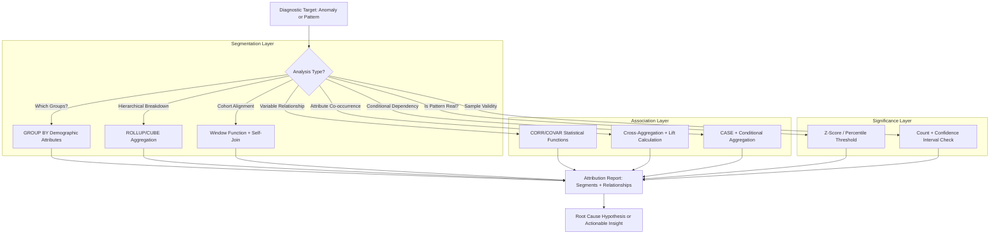

# 1. Identify Demographics and Relationships in Snowflake: Segment Attribution and Relational Pattern Discovery
Documentation of Snowflake SQL patterns, statistical functions, and analytical techniques for isolating demographic segments, discovering attribute relationships, and quantifying associative drivers during diagnostic analysis.

# 2. Overview
Identifying demographics and relationships is the analytical process of decomposing anomalies or patterns into attributable population segments (demographics) and quantifying associations between variables (relationships) to explain observed behavior. It exists to transform aggregate metric deviations into actionable insights by revealing which customer cohorts, geographic regions, product categories, or operational dimensions drive variance, and how attributes correlate, co-occur, or conditionally influence outcomes. The feature targets data analysts investigating business metric volatility, data scientists building attribution models, and SnowPro Advanced candidates tested on aggregation patterns, statistical function application, and privacy-aware demographic analysis within Snowflake's execution model.

# 3. SQL Object Summary

| Object/Feature | Type | Purpose | Source Objects/Inputs | Output/Behavior | Invocation |
|----------------|------|---------|----------------------|-----------------|------------|
| Demographic Segmentation Query | Aggregation Pattern | Group metrics by categorical attributes for cohort comparison | Fact table, dimension tables, attribute columns | Aggregated metrics per demographic segment | `GROUP BY` with `ROLLUP`/`CUBE` for hierarchical breakdown |
| Correlation Analysis Function | Statistical SQL Function | Quantify linear relationship strength between numeric variables | Two or more numeric columns, optional grouping | Correlation coefficient (Pearson/Spearman), covariance | `CORR(x, y)`, `COVAR_POP(x, y)`, `REGR_SLOPE(y, x)` |
| Cohort Comparison Window | Analytical Pattern | Compare behavior across time-based or attribute-based cohorts | Event table with timestamp, cohort definition logic | Cohort-aligned metrics with retention or progression analysis | Window functions + self-join on cohort key |
| Association Rule Mining Pattern | Conditional Aggregation | Identify frequently co-occurring attribute combinations | Transactional or event data with categorical attributes | Support, confidence, lift metrics for attribute pairs | Self-join or cross-aggregation with filtering |
| Demographic Significance Test | Statistical Inference Pattern | Determine if segment differences are statistically meaningful | Segment-level metrics, baseline distribution | P-value, confidence interval, significance flag | `APPROX_PERCENTILE`, `STDDEV`, manual z-test logic |

# 4. Architecture
Demographic and relationship identification operates across three analytical layers: (1) **segmentation** (grouping by categorical attributes), (2) **association** (quantifying variable relationships), and (3) **significance testing** (validating observed patterns against statistical expectations). Snowflake's columnar storage and parallel execution enable efficient aggregation across high-cardinality demographic dimensions. Statistical functions execute as vectorized operations within the query engine, avoiding external export for basic inference.

# 5. Data Flow / Process Flow
1. **Target Definition**: Analyst specifies anomaly metric, time window, and candidate demographic dimensions (e.g., region, customer tier, product line).
2. **Segmentation Execution**: 
   - Apply `GROUP BY` on demographic attributes to compute segment-level metrics.
   - Use `ROLLUP` or `CUBE` for hierarchical or cross-dimensional aggregation.
   - Apply `QUALIFY` or filtering to focus on segments with meaningful sample sizes.
3. **Relationship Quantification**:
   - For numeric variables: Compute `CORR()`, `COVAR_POP()`, or regression metrics (`REGR_SLOPE`, `REGR_R2`).
   - For categorical attributes: Compute co-occurrence counts, support, confidence, and lift via self-join or cross-aggregation.
4. **Significance Validation**:
   - Calculate segment-level z-scores against population baseline.
   - Apply percentile thresholds or confidence intervals to flag statistically meaningful deviations.
   - Filter out segments with insufficient sample size (e.g., `COUNT(*) < 30`).
5. **Attribution Synthesis**: Rank segments by contribution to anomaly magnitude; highlight strongest correlations or associations.
6. **Output & Documentation**: Return structured result set with segment metrics, relationship coefficients, and significance flags; log analysis parameters for reproducibility.

Row count contracts during aggregation (many-to-few) but may expand during association mining (cross-product of attribute values). Grain shifts from transactional to segment-level or pair-level depending on analysis stage.

# 6. Logical Breakdown

| Component | Responsibility | Inputs | Outputs | Dependencies | Failure Modes |
|-----------|----------------|--------|---------|--------------|---------------|
| Demographic Grouping Engine | Aggregate metrics by categorical attributes | Fact table, dimension keys, attribute columns | Segment-level aggregated metrics | Dimensional model integrity, attribute cardinality | High-cardinality attributes cause memory pressure; NULL values create ambiguous segments |
| Hierarchical Aggregator | Compute rollup/cube totals for multi-level breakdown | Grouping columns, aggregation functions | Multi-grain result set with subtotals | `ROLLUP`/`CUBE` syntax support, memory for grouping sets | Excessive grouping sets cause compilation or runtime error |
| Correlation Calculator | Quantify linear relationship between numeric variables | Two numeric columns, optional partitioning | Pearson correlation coefficient, covariance | Sufficient non-null pairs, non-constant variance | Constant values return NULL; outliers skew correlation; small samples produce unstable estimates |
| Association Miner | Identify frequent attribute co-occurrences | Categorical attribute pairs, transaction grain | Support, confidence, lift metrics for pairs | Transactional grain clarity, attribute value standardization | Cross-product explosion on high-cardinality attributes; sparse data yields unreliable lift |
| Significance Validator | Test if segment differences exceed random expectation | Segment metric, population baseline, sample size | P-value approximation, significance flag | Baseline distribution assumptions, sample size thresholds | Non-normal distributions invalidate z-test; multiple comparisons increase false discovery rate |

# 7. Data Model (State Model)
Demographic and relationship analysis produces transient analytical datasets with explicit grain definitions.

| Entity | Role | Key Fields | Grain | Relationships | Null Handling |
|--------|------|-----------|-------|--------------|---------------|
| `SEGMENT_METRIC` (Aggregated) | Demographic cohort performance | `segment_key`, `attribute_values`, `metric_sum`, `metric_avg`, `row_count` | One row per unique demographic combination | Self-referential for hierarchical rollup | NULL attributes grouped together; document if intentional or data quality issue |
| `CORRELATION_PAIR` (Statistical) | Variable relationship strength | `var_x`, `var_y`, `corr_coeff`, `covariance`, `sample_size` | One row per analyzed variable pair | Joined to metadata for variable descriptions | Pairs with <2 non-null observations return NULL coefficients |
| `ASSOCIATION_RULE` (Mining) | Attribute co-occurrence pattern | `antecedent`, `consequent`, `support`, `confidence`, `lift` | One row per attribute pair rule | Filtered by minimum support/confidence thresholds | Sparse combinations yield zero support; exclude from output or flag as insufficient |
| `SIGNIFICANCE_FLAG` (Inference) | Statistical validity indicator | `segment_key`, `z_score`, `p_value_approx`, `is_significant` | One row per tested segment | Joined to `SEGMENT_METRIC` for attribution | Small samples (`n < 30`) flag as "insufficient power" rather than computing unreliable p-values |

**Grain Consistency**: Explicitly document grain at each analysis stage. Aggregation contracts grain (transactional → segment). Association mining may expand grain (segment → attribute pair). Significance testing operates at segment grain.

# 8. Business Logic (Execution Logic)
- **Segmentation Rules**: 
  - Include only segments with `COUNT(*) >= N` (e.g., N=30) to ensure statistical reliability.
  - Handle NULL attribute values explicitly: `COALESCE(attribute, 'UNKNOWN')` or exclude via `WHERE attribute IS NOT NULL`.
  - Use `ROLLUP(region, category)` for hierarchical subtotals; use `CUBE(region, category)` for all cross-combinations.
- **Correlation Interpretation**: 
  - `CORR(x, y)` returns Pearson coefficient in [-1, 1]. Values > |0.7| indicate strong linear relationship; > |0.3| moderate.
  - Correlation does not imply causation. Always contextualize with business logic and temporal ordering.
  - Exam trap: `CORR()` ignores NULL pairs; ensure sufficient non-null observations before interpreting results.
- **Association Mining Thresholds**: 
  - Support: Minimum co-occurrence frequency (e.g., `COUNT(*) / total_transactions >= 0.01`).
  - Confidence: Conditional probability `P(consequent | antecedent) >= 0.5`.
  - Lift: `confidence / P(consequent)`; values > 1.0 indicate positive association.
- **Significance Testing Approximations**: 
  - Z-score: `(segment_avg - population_avg) / (population_stddev / SQRT(segment_n))`.
  - Flag significant if `ABS(z_score) > 1.96` (approx. 95% confidence) AND `segment_n >= 30`.
  - For multiple comparisons, apply Bonferroni correction: divide alpha by number of tested segments.
- **Exam-Relevant Defaults**: `GROUP BY` treats NULL as a distinct group. `CORR()` returns NULL if either input is constant or has <2 non-null pairs. `ROLLUP` generates 2^n - 1 grouping sets for n columns; monitor compilation limits.

# 9. Transformations

| Source Input | Target Output | Rule/Logic | Execution Meaning | Impact |
|--------------|---------------|------------|-------------------|--------|
| Transactional rows + demographic attributes | Segment-level aggregates | `GROUP BY region, tier WITH ROLLUP` | Computes metrics per cohort and subtotals | Enables hierarchical drill-down; row count contracts to number of unique combinations |
| Two numeric columns + partition key | Correlation coefficient per group | `CORR(revenue, sessions) OVER (PARTITION BY region)` | Quantifies relationship strength within each demographic segment | Reveals if correlation varies by cohort; requires sufficient non-null pairs per partition |
| Categorical attribute pairs + transaction grain | Association rule metrics | Self-join on transaction_id, aggregate co-occurrence counts | Computes support, confidence, lift for attribute combinations | Identifies frequent itemsets; cross-product risk requires pre-filtering on attribute cardinality |
| Segment metric + population baseline | Significance flag | `CASE WHEN ABS(z_score) > 1.96 AND sample_size >= 30 THEN 'SIGNIFICANT' END` | Flags segments with statistically meaningful deviations | Focuses investigation on non-random patterns; requires accurate baseline estimation |
| High-cardinality attribute + grouping | Bucketed demographic segments | `CASE WHEN age < 18 THEN 'minor' WHEN age < 35 THEN 'young_adult' ... END` | Reduces cardinality for stable aggregation | Prevents sparse segments; requires business-logic alignment for bucket boundaries |

# 10. Parameters / Variables / Configuration

| Name | Type | Purpose | Allowed Values/Format | Default | Where Used | Effect |
|------|------|---------|----------------------|---------|------------|--------|
| `MIN_SEGMENT_SIZE` | Analytical Parameter | Filter out statistically unreliable segments | Integer count threshold | `30` | `HAVING COUNT(*) >= ...` clause | Prevents over-interpretation of small samples; may exclude niche but important segments |
| `CORRELATION_THRESHOLD` | Analytical Parameter | Flag strong variable relationships for review | Float in [0, 1] for absolute value | `0.7` | `WHERE ABS(CORR(...)) >= ...` | Focuses attention on meaningful associations; may miss moderate but actionable relationships |
| `ASSOCIATION_MIN_SUPPORT` | Mining Parameter | Minimum co-occurrence frequency for rule validity | Float in [0, 1] or integer count | `0.01` (1%) | `HAVING COUNT(*) / total >= ...` | Filters noise from sparse attribute combinations; higher values reduce output volume |
| `SIGNIFICANCE_ALPHA` | Statistical Parameter | Confidence threshold for significance flagging | Float in (0, 1) | `0.05` | Z-score comparison logic | Lower alpha reduces false positives but increases false negatives; document choice |
| `NULL_HANDLING_MODE` | Demographic Parameter | Control treatment of missing attribute values | `'EXCLUDE'`, `'UNKNOWN_GROUP'`, `'IMPUTE'` | `'UNKNOWN_GROUP'` | `COALESCE` or `WHERE` logic in grouping | Affects segment composition; `'EXCLUDE'` reduces sample size, `'UNKNOWN_GROUP'` may obscure root cause |

# 11. APIs / Interfaces
- **Aggregation**: Standard `GROUP BY`, `ROLLUP`, `CUBE`, `GROUPING_SETS` syntax; `GROUPING_ID()` for subtotal identification.
- **Statistical Functions**: `CORR(x, y)`, `COVAR_POP(x, y)`, `COVAR_SAMP(x, y)`, `REGR_SLOPE(y, x)`, `REGR_R2(y, x)`, `STDDEV()`, `VAR_SAMP()`.
- **Percentile & Distribution**: `PERCENTILE_CONT()`, `PERCENTILE_DISC()`, `APPROX_PERCENTILE()` for significance testing and baseline estimation.
- **Conditional Logic**: `CASE` expressions for bucketing, significance flagging, and association rule construction.
- **System Views**: `ACCOUNT_USAGE.ACCESS_HISTORY` for user demographic patterns; `INFORMATION_SCHEMA.COLUMNS` for attribute metadata.
- **Error Behavior**: `CORR()` returns NULL for constant inputs or insufficient non-null pairs. `GROUP BY` with high-cardinality attributes may exceed memory limits; monitor `SPILL_BYTES`.

# 12. Execution / Deployment
- **Execution Mode**: Ad-hoc analytical queries run synchronously. Complex demographic mining may be scripted as stored procedures or scheduled as tasks for recurring cohort analysis.
- **Batch vs Incremental**: Aggregation typically scans full historical windows. Correlation and association patterns may be computed incrementally if source data is append-only and segment definitions are stable.
- **Orchestration**: Demographic analysis workflows often triggered by anomaly alerts or scheduled business reviews. Snowflake Tasks can automate routine segment reporting.
- **Environment Strategy**: Analysis typically occurs in PROD or PROD-clone environments. Sensitive demographic attributes require masking or row access policies in non-production environments.
- **Runtime Assumptions**: Demographic attributes are conformed and consistently populated. Statistical functions assume approximate normality for z-test approximations; document deviations.

# 13. Observability
- **Segment Coverage Logging**: Track which demographic dimensions were analyzed and segment counts per dimension to identify data gaps or coverage bias.
- **Statistical Validity Monitoring**: Log sample sizes, correlation confidence intervals, and significance test assumptions to flag potentially unreliable findings.
- **Query Performance**: Aggregation queries on high-cardinality demographic attributes benefit from clustering on grouping columns. Monitor `BYTES_SCANNED` and `SPILL_BYTES` in `QUERY_HISTORY`.
- **Attribution Tracking**: Record which segments or relationships were flagged as significant and later confirmed as root causes to refine thresholds and reduce false positives.
- **Privacy Compliance Auditing**: Log access to sensitive demographic attributes (e.g., age, location) to ensure compliance with data governance policies.

# 14. Failure Handling & Recovery

| Failure Scenario | Symptom | Detection | Fallback | Recovery |
|------------------|---------|-----------|----------|----------|
| High-Cardinality Attribute Explosion | Query timeout or memory spill | `QUERY_HISTORY` shows high `SPILL_BYTES`, compilation error on grouping sets | Reduce cardinality via bucketing or pre-aggregation; exclude low-frequency values | Implement attribute value standardization in ETL; use `APPROX_TOP_K` for frequent value sampling |
| Insufficient Sample Size per Segment | Statistical functions return NULL or unstable metrics | `COUNT(*) < 30` in segment output, correlation NULL | Aggregate to higher grain (e.g., region instead of zip code); flag as "insufficient data" | Adjust segmentation strategy; collect more historical data; implement Bayesian shrinkage for small samples |
| Correlation Misinterpretation | Strong correlation flagged but no causal relationship | Business review reveals confounding variable or reverse causality | Document correlation as observational only; require temporal or experimental validation | Incorporate causal inference techniques (e.g., Granger causality, instrumental variables) where feasible |
| Multiple Comparisons False Discovery | Many segments flagged significant by chance | High proportion of flagged segments with small effect sizes | Apply Bonferroni or Benjamini-Hochberg correction; raise significance threshold | Pre-register hypotheses; limit tested segments to business-prioritized dimensions |
| Sensitive Attribute Exposure | Demographic analysis reveals PII or protected class patterns | Governance audit flags attribute usage | Apply dynamic data masking or row access policies; aggregate to less granular level | Implement privacy-preserving analytics (differential privacy, k-anonymity) for sensitive demographic analysis |

# 15. Security & Access Control
- **Attribute-Level Privacy**: Dynamic data masking applies to sensitive demographic columns (e.g., age, income bracket). Masked values propagate through aggregation, potentially biasing segment metrics.
- **Row Access Policies**: Policies may restrict visibility of certain demographic segments (e.g., region-based access). Analysis results reflect only visible data; document coverage limitations.
- **Aggregation Privacy Risk**: Small segment sizes may enable re-identification. Enforce `MIN_SEGMENT_SIZE` thresholds and suppress output for segments below privacy thresholds.
- **System View Access**: `ACCESS_HISTORY` and `OBJECT_DEPENDENCIES` require `SELECT` on `ACCOUNT_USAGE` schema. Grant minimally required access for diagnostic roles.
- **Exam Note**: Masking policies evaluate before aggregation. A masked demographic attribute will group all masked values together, potentially creating an artificial "UNKNOWN" segment. Document this behavior in analysis outputs.

# 16. Performance / Scalability Considerations
- **Aggregation Pruning**: Cluster fact tables on frequently grouped demographic attributes to enable micro-partition pruning during `GROUP BY`. Avoid function-wrapped grouping columns.
- **High-Cardinality Mitigation**: Use `APPROX_TOP_K` or pre-bucketing to reduce distinct values before aggregation. `ROLLUP`/`CUBE` generate exponential grouping sets; limit columns to 3-4 for stability.
- **Statistical Function Cost**: `CORR()` and regression functions require two-pass aggregation (mean, then covariance). Partitioning by high-cardinality keys increases shuffle cost; pre-filter to relevant segments.
- **Association Mining Scale**: Cross-aggregation of categorical attributes has O(n²) complexity in attribute cardinality. Pre-filter attributes by frequency; use `SAMPLE` for exploratory analysis.
- **Memory Management**: Large `GROUP BY` operations may spill to remote storage. Monitor `SPILL_BYTES`; increase warehouse size or break analysis into staged CTEs if spilling exceeds 20% of scanned bytes.
- **Exam Trap**: Candidates assume `CORR()` is computationally free. It requires full scan of both columns and two-pass aggregation. For large tables, pre-aggregate to daily grain before correlation calculation.

# 17. Assumptions & Constraints
- Demographic attributes are consistently populated and conformed across source systems. Missing or inconsistent values create ambiguous segments; document null handling strategy.
- Statistical significance approximations (z-test) assume approximate normality and independent observations. Time-series or clustered data violate independence; use appropriate corrections.
- Correlation measures linear relationships only. Non-linear associations require alternative techniques (e.g., mutual information, binning + chi-square) not natively supported in Snowflake SQL.
- Association rule mining assumes transactional grain clarity. Ambiguous grain (e.g., session vs. user) invalidates support/confidence calculations.
- Privacy regulations may restrict analysis of protected demographic attributes (age, race, gender). Implement governance review before executing sensitive demographic queries.
- SnowPro Advanced trap: `ROLLUP(a, b)` generates grouping sets `(a, b)`, `(a)`, `()`—not `(b)` alone. `CUBE(a, b)` generates all four combinations. Misunderstanding grouping set output leads to misinterpretation of subtotals.

# 18. Future Enhancements
- Introduce native causal inference functions (e.g., `GRANGER_CAUSALITY(x, y, lag)`) to distinguish correlation from predictive temporal relationships.
- Add privacy-preserving aggregation primitives (e.g., `APPROX_COUNT_DISTINCT_WITH_PRIVACY()`) to enable demographic analysis on sensitive attributes with differential privacy guarantees.
- Implement automated segment suggestion engine leveraging attribute cardinality and anomaly variance to propose high-impact demographic dimensions for investigation.
- Extend association mining to support sequential pattern discovery (e.g., "customers who bought X then Y within 7 days") using window-aware aggregation.
- Support demographic analysis templates as reusable stored procedures or Snowflake Native Apps to standardize segmentation, correlation, and significance testing patterns across teams.
