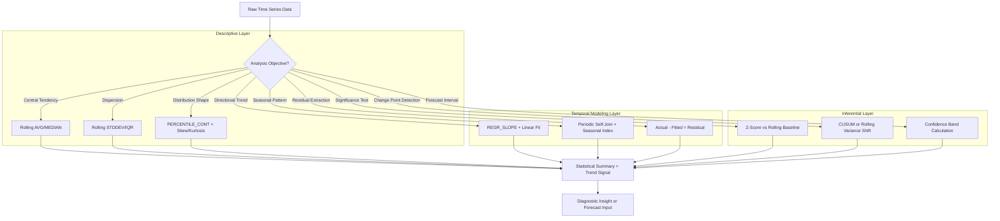

# 1. Analyze Statistics and Trends in Snowflake: Time Series Aggregation and Statistical Pattern Detection
Documentation of Snowflake SQL patterns, statistical functions, and analytical techniques for computing descriptive statistics, detecting temporal trends, and quantifying directional changes in historical data for diagnostic and forecasting purposes.

# 2. Overview
Analyzing statistics and trends is the process of applying descriptive and inferential statistical methods to time-ordered data to quantify central tendency, dispersion, directional movement, and structural breaks. It exists to transform raw historical observations into interpretable signals—identifying growth trajectories, seasonal cycles, volatility shifts, and inflection points that inform business decisions or trigger investigative workflows. The feature targets data analysts building diagnostic dashboards, data scientists prototyping forecasting models, and SnowPro Advanced candidates tested on window function semantics, statistical function behavior, and time series optimization patterns within Snowflake's execution engine.

# 3. SQL Object Summary

| Object/Feature | Type | Purpose | Source Objects/Inputs | Output/Behavior | Invocation |
|----------------|------|---------|----------------------|-----------------|------------|
| Moving Aggregate Window | Analytical SQL Pattern | Smooth short-term noise to reveal underlying trend | Time-ordered metric column, window frame definition | Rolling mean, sum, or count per time point | `AVG(metric) OVER (ORDER BY date ROWS BETWEEN 6 PRECEDING AND CURRENT ROW)` |
| Statistical Trend Function | Built-in Statistical SQL | Quantify linear relationship between time and metric | Timestamp column, numeric metric column | Regression coefficients (slope, intercept, R²) | `REGR_SLOPE(metric, UNIX_TIMESTAMP(date))`, `REGR_R2(...)` |
| Percentile Distribution Analyzer | Statistical Aggregation | Characterize metric distribution and identify outliers | Numeric column, optional partitioning | Percentile ranks, IQR bounds, outlier flags | `PERCENTILE_CONT(0.95) WITHIN GROUP (ORDER BY metric)` |
| Seasonal Decomposition Pattern | Analytical SQL Pattern | Separate trend, seasonal, and residual components | Time series with known periodicity | Detrended series, seasonal indices, residual variance | Self-join on periodic offset + residual calculation |
| Change Point Detector | Statistical Inference Pattern | Identify structural breaks in trend or variance | Ordered metric series, significance threshold | Flagged timestamps where statistical properties shift | Cumulative sum (CUSUM) logic or rolling z-score comparison |

# 4. Architecture
Statistical and trend analysis operates across three computational layers: (1) **descriptive aggregation** (central tendency, dispersion), (2) **temporal modeling** (trend estimation, seasonality extraction), and (3) **inferential validation** (significance testing, change detection). Snowflake's columnar storage enables efficient scan of time-ordered data; window functions execute as vectorized operations within the query engine; statistical functions leverage parallel aggregation across micro-partitions.

# 5. Data Flow / Process Flow
1. **Temporal Ordering**: Ensure input data is sorted by timestamp using `ORDER BY` in window functions or explicit `CLUSTER BY` on time columns for pruning efficiency.
2. **Descriptive Aggregation**: 
   - Compute rolling statistics using window frames: `ROWS BETWEEN N PRECEDING AND CURRENT ROW` or `RANGE BETWEEN INTERVAL '7 days' PRECEDING AND CURRENT ROW`.
   - Apply `AVG()`, `MEDIAN()`, `STDDEV()`, `PERCENTILE_CONT()` within window scope.
3. **Trend Estimation**:
   - Convert timestamp to numeric for regression: `UNIX_TIMESTAMP(date)` or `DATEDIFF(day, base_date, date)`.
   - Apply `REGR_SLOPE(y, x)`, `REGR_INTERCEPT(y, x)`, `REGR_R2(y, x)` over partitioned windows.
4. **Seasonal Decomposition** (if periodicity known):
   - Self-join on periodic offset (e.g., same weekday prior week) to compute seasonal factor.
   - Subtract seasonal component from raw metric to isolate trend + residual.
5. **Residual Analysis**:
   - Compute residual = actual - fitted (from trend model).
   - Flag outliers where `ABS(residual) > N * rolling_stddev`.
6. **Change Point Detection**:
   - Apply CUSUM logic: cumulative sum of deviations from mean.
   - Flag timestamp where cumulative deviation exceeds threshold.
7. **Output Synthesis**: Return structured result with original metric, trend component, seasonal factor, residual, and significance flags.

Row count remains stable for window-based analysis (1:1 input-to-output). Aggregation to higher time grain (e.g., daily → weekly) contracts row count.

# 6. Logical Breakdown

| Component | Responsibility | Inputs | Outputs | Dependencies | Failure Modes |
|-----------|----------------|--------|---------|--------------|---------------|
| Time Order Enforcer | Guarantee chronological evaluation | Timestamp column, timezone context | Sorted dataset or window frame | Consistent timestamp granularity, UTC storage | Timezone mismatch causes misaligned windows; irregular intervals break frame logic |
| Rolling Statistic Calculator | Compute moving aggregates | Metric column, window frame definition | Rolling mean, stddev, percentile per row | Sufficient history in window, non-null values | Window with all NULLs returns NULL; small windows produce unstable estimates |
| Linear Trend Estimator | Fit linear model to time series | Numeric time index, metric values | Slope, intercept, R² per partition | Non-constant metric variance, sufficient observations | Constant metric returns NULL slope; outliers skew regression; small samples produce unstable R² |
| Seasonal Factor Extractor | Isolate periodic pattern | Time series with known period (e.g., 7 days) | Seasonal index per period position | Stable seasonality, minimal trend contamination | Changing seasonality invalidates fixed-period assumption; trend leakage biases seasonal factor |
| Residual Outlier Flag | Identify deviations from expected | Fitted values, actual values, rolling stddev | Outlier flag, residual magnitude | Accurate trend model, stable variance estimate | Model misspecification causes false outliers; heteroskedasticity invalidates fixed threshold |
| Change Point Detector | Identify structural breaks | Ordered residuals or metric, significance threshold | Flagged timestamps with shift evidence | Stationary baseline assumption, sufficient pre/post data | Multiple testing increases false discovery; gradual shifts may not trigger threshold |

# 7. Data Model (State Model)
Statistical trend analysis produces transient analytical datasets with explicit temporal grain.

| Entity | Role | Key Fields | Grain | Relationships | Null Handling |
|--------|------|-----------|-------|--------------|---------------|
| `TIME_SERIES_BASE` (Input) | Raw observations for analysis | `timestamp`, `metric_value`, `partition_key` | One row per observation interval | Self-referential for lag/lead windows | NULL metrics excluded from statistical calculations; document exclusion logic |
| `ROLLING_STATS` (Windowed) | Smoothed descriptive metrics | `timestamp`, `rolling_avg`, `rolling_stddev`, `window_size` | One row per input timestamp (1:1) | Joined to base for residual calculation | Initial rows with insufficient history return NULL; handle via `COALESCE` or forward-fill |
| `TREND_MODEL` (Regression) | Linear trend parameters | `partition_key`, `slope`, `intercept`, `r_squared`, `observation_count` | One row per analyzed partition/group | Applied to base via `slope * time_index + intercept` | Partitions with <2 non-null pairs return NULL coefficients; flag as "insufficient data" |
| `SEASONAL_INDEX` (Decomposed) | Periodic adjustment factor | `period_position` (e.g., day-of-week), `seasonal_factor` | One row per position in seasonal cycle | Multiplied/divided from base metric for detrending | Sparse periods return unstable factors; apply smoothing or borrow from adjacent periods |
| `RESIDUAL_SIGNAL` (Diagnostic) | Anomaly detection input | `timestamp`, `actual`, `fitted`, `residual`, `is_outlier` | One row per input timestamp | Filtered for investigative workflows or alerting | Residual NULL if fitted NULL; outlier logic must handle NULL fitted explicitly |

**Grain Consistency**: Window functions preserve input grain (1:1). Aggregation to higher time grain (e.g., `DATE_TRUNC('week', timestamp)`) contracts grain. Document grain explicitly in output to prevent misinterpretation.

# 8. Business Logic (Execution Logic)
- **Window Frame Selection**: 
  - Use `ROWS` frame for fixed-count windows (e.g., last 7 observations) regardless of time gaps.
  - Use `RANGE` frame with `INTERVAL` for time-based windows (e.g., last 7 days) that handle irregular timestamps.
  - Exam trap: `RANGE` requires ordered numeric or temporal column; `ROWS` works with any orderable column.
- **Trend Interpretation Rules**:
  - `REGR_SLOPE > 0` indicates upward trend; `< 0` downward. Magnitude depends on time unit scaling.
  - `REGR_R2` in [0, 1]; values > 0.7 suggest strong linear fit; < 0.3 indicate weak or non-linear relationship.
  - Always visualize trend line against raw data; statistical fit does not guarantee business relevance.
- **Seasonal Decomposition Logic**:
  - For additive seasonality: `seasonal_factor = AVG(metric - trend) GROUP BY period_position`.
  - For multiplicative seasonality: `seasonal_factor = AVG(metric / trend) GROUP BY period_position`.
  - Detrended series = `metric - trend - seasonal_factor` (additive) or `metric / (trend * seasonal_factor)` (multiplicative).
- **Outlier Detection Thresholds**:
  - Z-score method: `ABS(residual / rolling_stddev) > 3` flags ~0.3% of normal distribution as outliers.
  - IQR method: `residual < Q1 - 1.5*IQR OR residual > Q3 + 1.5*IQR` for non-parametric detection.
  - Document chosen method; z-score assumes approximate normality of residuals.
- **Exam-Relevant Defaults**: `REGR_*` functions ignore NULL pairs. Window functions with `ORDER BY` but no frame clause default to `RANGE BETWEEN UNBOUNDED PRECEDING AND CURRENT ROW`. `PERCENTILE_CONT` requires `WITHIN GROUP (ORDER BY ...)`. Time travel syntax requires `AT`/`BEFORE` in `FROM`, not `WHERE`.

# 9. Transformations

| Source Input | Target Output | Rule/Logic | Execution Meaning | Impact |
|--------------|---------------|------------|-------------------|--------|
| Raw metric + time index | Linear trend line | `REGR_SLOPE(metric, time_index) OVER (PARTITION BY group)` | Estimates directional change rate per group | Enables trend comparison across segments; requires sufficient non-null pairs |
| Time series + periodic offset | Seasonal factor | `AVG(metric) OVER (PARTITION BY DAYOFWEEK(timestamp))` | Computes average value per day-of-week for weekly seasonality | Isolates recurring pattern; assumes stable seasonality over analysis window |
| Fitted trend + actual metric | Residual series | `actual - (slope * time_index + intercept)` | Quantifies deviation from expected trend | Enables anomaly detection; residual distribution informs threshold selection |
| Rolling stddev + residual | Outlier flag | `CASE WHEN ABS(residual) > 3 * rolling_stddev THEN TRUE END` | Flags statistically unusual observations | Focuses investigation on non-random deviations; threshold choice balances false positives/negatives |
| Cumulative residual sum | Change point signal | `SUM(residual) OVER (ORDER BY timestamp)` with threshold comparison | Detects sustained shifts in metric behavior | Identifies structural breaks; requires tuning of cumulative threshold |

# 10. Parameters / Variables / Configuration

| Name | Type | Purpose | Allowed Values/Format | Default | Where Used | Effect |
|------|------|---------|----------------------|---------|------------|--------|
| `WINDOW_SIZE` | Analytical Parameter | Define rolling aggregation span | Integer (ROWS) or INTERVAL string (RANGE) | `7` (days or rows) | Window frame clause | Larger windows smooth more noise but lag trend detection; smaller windows react faster but increase volatility |
| `TREND_SIGNIFICANCE_THRESHOLD` | Statistical Parameter | Minimum R² to consider trend meaningful | Float in [0, 1] | `0.3` | `WHERE REGR_R2 >= ...` clause | Filters weak or spurious trends; may exclude emerging but low-signal patterns |
| `OUTLIER_METHOD` | Detection Parameter | Choose statistical approach for anomaly flagging | `'Z_SCORE'`, `'IQR'`, `'MAD'` | `'Z_SCORE'` | CASE logic in residual analysis | Z-score assumes normality; IQR is non-parametric; MAD is robust to extreme outliers |
| `SEASONAL_PERIOD` | Decomposition Parameter | Specify known cycle length for seasonality | Integer (e.g., 7 for weekly, 12 for monthly) | Context-dependent | `PARTITION BY` or modulo logic in seasonal extraction | Incorrect period assumption biases seasonal factor; validate via autocorrelation if uncertain |
| `CHANGE_POINT_ALPHA` | Inference Parameter | Significance threshold for structural break detection | Float in (0, 1) | `0.05` | CUSUM or variance shift logic | Lower alpha reduces false positives but may miss gradual shifts; document choice for reproducibility |

# 11. APIs / Interfaces
- **Window Functions**: `AVG()`, `SUM()`, `STDDEV()`, `PERCENTILE_CONT()`, `LAG()`, `LEAD()` with `OVER (PARTITION BY ... ORDER BY ... [frame_clause])`.
- **Regression Functions**: `REGR_SLOPE(y, x)`, `REGR_INTERCEPT(y, x)`, `REGR_R2(y, x)`, `REGR_COUNT(y, x)`, `COVAR_POP(x, y)`, `CORR(x, y)`.
- **Percentile & Distribution**: `PERCENTILE_CONT(p) WITHIN GROUP (ORDER BY expr)`, `PERCENTILE_DISC(p) WITHIN GROUP (ORDER BY expr)`, `APPROX_PERCENTILE(expr, p)`.
- **Time Conversion**: `UNIX_TIMESTAMP(date)`, `EXTRACT(EPOCH FROM ...)`, `DATEDIFF(unit, start, end)` for numeric time indexing.
- **System Views**: `ACCOUNT_USAGE.QUERY_HISTORY` for trend analysis of compute usage; `INFORMATION_SCHEMA.TABLE_STORAGE_METRICS` for storage growth trends.
- **Error Behavior**: `REGR_*` returns NULL for constant inputs or <2 non-null pairs. Window functions with invalid frame clauses cause compilation error. `PERCENTILE_CONT` requires explicit `WITHIN GROUP`.

# 12. Execution / Deployment
- **Execution Mode**: Ad-hoc analytical queries run synchronously. Complex trend analysis may be scripted as stored procedures or scheduled as tasks for recurring statistical reporting.
- **Batch vs Incremental**: Rolling statistics can be computed incrementally if new data is append-only and window boundaries align with ingestion cadence. Regression and decomposition typically require full historical scan.
- **Orchestration**: Trend analysis workflows often triggered by dashboard refresh or anomaly alert. Snowflake Tasks can automate daily/weekly statistical summary generation.
- **Environment Strategy**: Analysis typically occurs in PROD or PROD-clone environments. Ensure clustering on timestamp columns for pruning efficiency in large time series.
- **Runtime Assumptions**: Timestamps are stored in UTC with consistent granularity. Metric distributions are approximately stationary within analysis windows unless modeling structural breaks.

# 13. Observability
- **Trend Stability Logging**: Track regression R² and slope volatility over time to detect when linear assumptions break down and model retraining is needed.
- **Window Performance Monitoring**: Log `BYTES_SCANNED` and `SPILL_BYTES` for rolling window queries; high spill indicates memory pressure from large window frames or high-cardinality partitions.
- **Outlier Detection Precision**: Measure false positive rate by comparing flagged outliers to confirmed incidents; adjust thresholds or switch methods (Z-score → IQR) iteratively.
- **Seasonal Model Validation**: Compare forecasted seasonal patterns to actuals in holdout periods; recompute seasonal indices when business cycles change.
- **Query Result Caching**: Statistical queries with deterministic logic and stable parameters are cache-eligible. Monitor `RESULT_REUSED` in `QUERY_HISTORY` to optimize repeated dashboard loads.

# 14. Failure Handling & Recovery

| Failure Scenario | Symptom | Detection | Fallback | Recovery |
|------------------|---------|-----------|----------|----------|
| Insufficient History for Window | Rolling statistics return NULL for early rows | Output shows NULL in `rolling_avg` for initial timestamps | Forward-fill initial values or exclude early rows via `WHERE timestamp >= min_valid` | Ensure minimum data retention; document warm-up period in analysis outputs |
| Non-Linear Trend Misfit | Low R² despite visible pattern | `REGR_R2 < 0.3` but visual inspection shows curvature | Apply polynomial regression via derived columns (`time_index²`) or switch to non-parametric smoothing | Implement piecewise linear regression or leverage external ML for complex trend shapes |
| Seasonality Assumption Violation | Detrended series still shows periodic pattern | Autocorrelation of residuals shows significant periodic peaks | Re-estimate seasonal period via spectral analysis; allow time-varying seasonal factors | Implement dynamic seasonal decomposition (e.g., STL) via external integration if native SQL insufficient |
| Heteroskedastic Residuals | Outlier threshold flags too many/few points | Residual variance changes over time; fixed threshold misfires | Use rolling stddev for adaptive threshold; switch to IQR method for distribution-free detection | Model variance explicitly (e.g., GARCH) if volatility clustering is business-relevant |
| Change Point False Alarm | Threshold triggered by random fluctuation | Frequent flags with no confirmed business event | Raise significance threshold; require sustained deviation over multiple periods | Implement Bayesian change point detection or require multi-metric confirmation before alerting |

# 15. Security & Access Control
- **Metric Sensitivity**: Dynamic data masking applies to sensitive metric columns before statistical calculation. Masked values propagate through aggregations, potentially biasing trend estimates.
- **Row Access Policies**: Policies may restrict visibility of certain time periods or segments. Trend analysis reflects only visible data; document coverage limitations in outputs.
- **Aggregation Privacy Risk**: Small partition sizes in regression may enable re-identification. Enforce minimum observation counts per group before computing statistics.
- **System View Access**: Trend analysis of operational metrics via `ACCOUNT_USAGE` views requires `SELECT` on `ACCOUNT_USAGE` schema. Grant minimally required access for analytical roles.
- **Exam Note**: Masking policies evaluate before aggregation. A masked metric will produce biased statistical estimates; document this limitation when analyzing sensitive data.

# 16. Performance / Scalability Considerations
- **Time Column Clustering**: Cluster large time series tables on timestamp or date columns to enable micro-partition pruning for time-bounded queries. Avoid function-wrapped time predicates.
- **Window Frame Cost**: Rolling statistics with large `ROWS` frames or wide `RANGE` intervals increase memory pressure. Monitor `SPILL_BYTES`; break analysis into staged CTEs if spilling exceeds 20% of scanned bytes.
- **Regression Function Overhead**: `REGR_*` functions require two-pass aggregation (mean, then covariance). Partitioning by high-cardinality keys increases shuffle cost; pre-filter to relevant groups.
- **Percentile Computation**: `PERCENTILE_CONT` requires sorting within partition; expensive for large windows. Use `APPROX_PERCENTILE` for exploratory analysis where exact precision is not critical.
- **Result Caching Eligibility**: Statistical queries with deterministic logic, stable parameters, and no volatile functions (`CURRENT_TIMESTAMP()`, `RANDOM()`) are cache-eligible. Mark reusable trend queries with consistent parameters to maximize cache hit rate.
- **Exam Trap**: Candidates assume window functions are free. They require sorting and frame maintenance per partition. For large tables, pre-aggregate to daily grain before computing rolling 30-day statistics to reduce row count.

# 17. Assumptions & Constraints
- Time series data is ordered and complete within analysis window. Gaps in timestamps may break `RANGE` frame logic; use `ROWS` frame or impute missing periods explicitly.
- Statistical functions assume independent observations. Autocorrelated time series violate independence; adjust significance thresholds or use time-series-specific methods.
- Linear regression (`REGR_*`) models only linear relationships. Non-linear trends require polynomial features or external modeling; Snowflake SQL does not natively support non-linear regression.
- Seasonal decomposition assumes stable periodicity. Changing business cycles (e.g., new product launch) invalidate fixed-period assumptions; require re-estimation or adaptive methods.
- Outlier detection thresholds are heuristic. No universal threshold fits all contexts; document chosen method and rationale for reproducibility.
- SnowPro Advanced trap: Window functions with `ORDER BY` but no explicit frame clause default to `RANGE BETWEEN UNBOUNDED PRECEDING AND CURRENT ROW`, not `ROWS`. This can produce unexpected results for non-continuous time indexes.

# 18. Future Enhancements
- Introduce native time series functions (e.g., `MOVING_AVERAGE(metric, window_spec)`, `DETECT_SEASONALITY(metric, timestamp)`) to simplify common trend analysis patterns.
- Add automated change point detection with adaptive thresholds leveraging historical variance patterns to reduce manual tuning.
- Implement incremental regression updates to avoid full recomputation when new data arrives, enabling real-time trend monitoring at scale.
- Extend statistical functions to support robust regression methods (e.g., Huber loss) resistant to outlier influence without manual pre-filtering.
- Support trend analysis templates as reusable stored procedures or Snowflake Native Apps to standardize rolling statistics, decomposition, and anomaly detection across teams.
