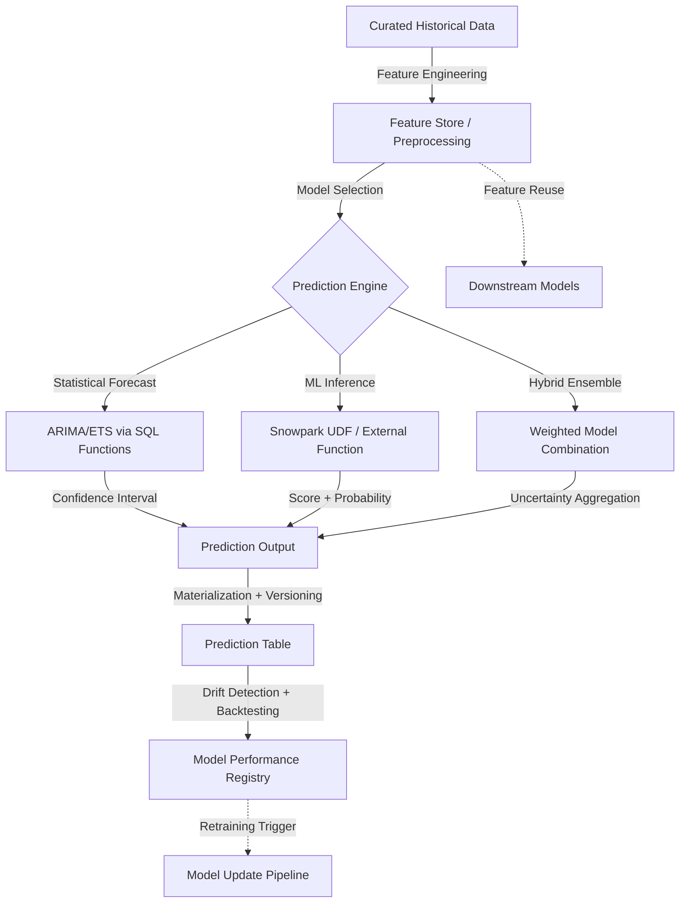

# Forecasting Predictive

# 1. Title
SnowPro Advanced: Forecasting & Predictive Analytics Architecture

# 2. Overview
- **What it does**: Defines deterministic patterns for time-series forecasting, statistical modeling, machine learning inference, and probabilistic prediction generation within Snowflake's execution environment.
- **Why it exists**: Predictive analytics require reproducible feature engineering, model versioning, inference isolation, and uncertainty quantification. Ad-hoc forecasting produces non-deterministic outputs, silent model drift, and unvalidated predictions that corrupt downstream decisions. Explicit predictive architecture ensures auditability, reproducibility, and scalable inference.
- **Where it fits**: Operates between curated historical data and decision-support layers (BI dashboards, automated alerting, recommendation engines). Bridges statistical computation, ML model serving, and business logic for forward-looking insights.
- **Intended consumer**: Data scientists, analytics engineers, ML platform architects, forecasting analysts, and SnowPro Advanced candidates evaluating model integration patterns, feature store design, inference optimization, and prediction governance.

# 3. SQL Object Summary
| Field | Value |
|-------|-------|
| Object Scope | Forecasting & Predictive Analytics Execution Framework |
| Type | Statistical Forecast Functions, ML Model UDFs, Feature Engineering Pipelines, Prediction Storage |
| Purpose | Generate deterministic forecasts, serve ML inferences, quantify prediction uncertainty, enable model versioning |
| Source Objects | Time-series fact tables, feature stores, trained model artifacts, external ML endpoints, historical baselines |
| Output Object | Forecast tables, prediction scores, confidence intervals, model performance metrics, drift alerts |
| Execution Mode | Batch forecasting, real-time inference, incremental model updates, scheduled backtesting |

# 4. Architecture
Predictive analytics in Snowflake separates feature computation, model execution, and prediction storage. Statistical forecasts run inline via SQL functions; ML models execute via Snowpark handlers or external API proxies. Predictions are materialized with metadata for versioning, uncertainty tracking, and drift detection.

# 5. Data Flow / Process Flow
| Step | Input | Transformation | Output | Purpose |
|------|-------|----------------|--------|---------|
| 1. Feature Preparation | Historical metrics, dimension attributes, lag features | Window functions, aggregations, encoding, normalization | Feature matrix with deterministic ordering | Establish reproducible input for model inference |
| 2. Model Selection & Binding | Feature schema, model registry, version pin | Model artifact resolution, parameter loading, handler binding | Executable prediction function | Ensure consistent model version across inference runs |
| 3. Inference Execution | Feature rows, model handler, compute context | Statistical forecast calculation, ML score generation, probability estimation | Prediction values, confidence bounds, metadata | Generate forward-looking outputs with quantified uncertainty |
| 4. Prediction Materialization | Raw predictions, version metadata, uncertainty metrics | Type casting, null handling, version tagging, audit fields | Structured prediction table with lineage | Enable downstream consumption, version tracking, and drift comparison |
| 5. Validation & Drift Detection | New predictions vs actuals, historical performance | MAE/RMSE calculation, distribution comparison, threshold evaluation | Drift flags, performance metrics, retraining signals | Maintain model reliability, trigger updates when accuracy degrades |

# 6. Logical Breakdown of the SQL
| Component | Responsibility | Inputs | Outputs | Dependencies | Failure Modes / Risks |
|-----------|----------------|--------|---------|--------------|-----------------------|
| Feature Engineering CTEs | Lag/lead creation, rolling aggregates, encoding | Time-series facts, dimension keys, window definitions | Normalized feature columns | Deterministic ordering, stable grain | Non-deterministic `ORDER BY` breaks lag features; timezone shifts misalign windows |
| Statistical Forecast Functions | Time-series projection (ARIMA, exponential smoothing) | Historical values, seasonality parameters, forecast horizon | Point forecast + confidence interval | Sufficient history length, stable variance | Insufficient data returns NULL; structural breaks invalidate assumptions |
| ML Model UDF (Snowpark) | Batch inference via Python/Java handler | Feature DataFrame, model artifact, hyperparameters | Prediction scores, class probabilities | Model version compatibility, dependency packaging | Version mismatch crashes handler; large batches cause memory spill |
| External Function Inference | Third-party ML API integration | Serialized payload, API endpoint, auth config | Prediction response mapped to SQL types | API availability, rate limits, network latency | Timeout on slow API; payload truncation loses feature fidelity |
| Prediction Materialization | Structured storage with versioning | Raw predictions, model version, uncertainty metrics | Versioned prediction table with audit fields | Schema stability, retention policy | Missing version tag breaks rollback; unbounded growth inflates storage |
| Drift Detection Logic | Model performance monitoring | Predictions vs actuals, historical baseline metrics | Drift score, alert flag, retraining recommendation | Timely actuals availability, stable evaluation window | Delayed actuals mask drift; noisy baselines trigger false alerts |

# 7. Data Model
| Entity | Role | Important Fields | Grain | Relationships | Keys | Null Handling |
|--------|------|------------------|-------|---------------|------|---------------|
| `FEATURE_STORE` | Reusable predictor variables | `FEATURE_NAME`, `ENTITY_KEY`, `EVENT_TS`, `VALUE`, `COMPUTATION_LOGIC` | 1 row = 1 feature value per entity/time | Feeds multiple models; versioned for reproducibility | `ENTITY_KEY` + `FEATURE_NAME` + `EVENT_TS` | `NULL` = missing feature; imputation logic applied at inference |
| `MODEL_REGISTRY` | Trained artifact metadata | `MODEL_ID`, `VERSION`, `TRAINING_DATA_HASH`, `HYPERPARAMETERS`, `PERFORMANCE_METRICS` | 1 row = 1 model version | Referenced by inference UDFs; tracked for rollback | `MODEL_ID` + `VERSION` | `NULL` on deprecated versions; retained for audit |
| `PREDICTION_OUTPUT` | Forecast/inference results | `ENTITY_KEY`, `PREDICTION_TS`, `PREDICTED_VALUE`, `CONFIDENCE_LOWER`, `CONFIDENCE_UPPER`, `MODEL_VERSION` | 1 row = 1 prediction per entity/horizon | Consumed by BI, alerting, downstream models | `ENTITY_KEY` + `PREDICTION_TS` + `MODEL_VERSION` | `CONFIDENCE_*` NULL for point-only forecasts; documented per model |
| `MODEL_PERFORMANCE_LOG` | Drift detection & validation | `MODEL_VERSION`, `EVALUATION_TS`, `MAE`, `RMSE`, `DRIFT_SCORE`, `RETRAIN_FLAG` | 1 row = 1 evaluation instance | Triggers retraining; informs model selection | `MODEL_VERSION` + `EVALUATION_TS` | `DRIFT_SCORE` NULL if actuals unavailable; evaluation deferred |

**Output Grain**: Explicitly defined per prediction type. Time-series forecast = 1 row per entity per forecast horizon. Classification inference = 1 row per entity per scoring event. Grain mismatch between feature store and prediction output causes misaligned joins or duplicate scoring.

# 8. Business Logic
| Rule | Effect | Implementation Pattern | Edge Case |
|------|--------|------------------------|-----------|
| **Deterministic Feature Ordering** | Ensures reproducible lag/lead calculations | `ORDER BY entity_key, event_ts ASC` in window functions | Timezone mismatches shift lag alignment; enforce UTC at ingestion |
| **Model Version Pinning** | Prevents silent inference changes | `WHERE model_version = 'v2.3.1'` in UDF call | Unpinned models auto-upgrade; breaks reproducibility for audit |
| **Uncertainty Propagation** | Quantifies prediction reliability | `CONFIDENCE_LOWER/UPPER` via statistical interval or bootstrap | Wide intervals flag low-confidence predictions; business rules may suppress action |
| **Drift Thresholding** | Triggers retraining on performance decay | `ABS(current_mae - baseline_mae) / baseline_mae > 0.15` | Noisy baselines cause false triggers; require minimum evaluation window |
| **Fallback Prediction Logic** | Handles model failure gracefully | `COALESCE(ml_prediction, statistical_forecast, historical_mean)` | Cascade fallbacks may degrade accuracy; document fallback hierarchy |
| **Backtesting Validation** | Validates model before production | Train/test split on historical data, walk-forward validation | Look-ahead bias if test data leaks into training; enforce temporal isolation |

# 9. Transformations
| Source | Derived | Formula / Rule | Business Meaning | Impact |
|--------|---------|----------------|------------------|--------|
| Raw time-series metric | Lag/lead features | `LAG(value, 7) OVER(PARTITION BY entity ORDER BY ts)`, `LEAD(value, 1)` | Captures temporal dependency for forecasting | Enables ARIMA/ML models; requires deterministic ordering |
| Categorical dimension | One-hot/embedding features | `CASE WHEN category = 'A' THEN 1 ELSE 0 END`, or Snowpark embedding lookup | Encodes non-numeric predictors for ML inference | Increases feature dimensionality; manage via feature store |
| Historical predictions | Drift detection metric | `MAE = AVG(ABS(predicted - actual))`, `DRIFT = KS_TEST(pred_dist, actual_dist)` | Quantifies model degradation over time | Triggers retraining; requires timely actuals ingestion |
| Model scores + uncertainty | Actionable prediction flag | `CASE WHEN confidence_width < threshold THEN predicted_value ELSE NULL END` | Suppresses low-confidence predictions from automation | Reduces false positives; may increase manual review load |
| Ensemble model outputs | Weighted final prediction | `0.6 * ml_score + 0.4 * statistical_forecast` | Combines strengths of multiple modeling approaches | Requires calibration of weights; validate via backtesting |

# 10. Parameters / Variables / Macros
| Name | Type | Purpose | Allowed Format | Default | Usage | Effect on Output |
|------|------|---------|----------------|---------|-------|------------------|
| `FORECAST_HORIZON` | Integer | Number of future periods to predict | 1–365 (days/weeks) | 30 | Statistical forecast function | Longer horizons increase uncertainty; confidence intervals widen |
| `MODEL_VERSION` | String | Pin inference to specific trained artifact | Semantic version (`v2.3.1`) | Latest | UDF/External function call | Ensures reproducibility; prevents silent model upgrades |
| `CONFIDENCE_LEVEL` | Float | Statistical interval width for forecasts | 0.80, 0.90, 0.95 | 0.95 | Forecast function parameter | Higher confidence = wider intervals; may suppress actionable predictions |
| `DRIFT_THRESHOLD` | Float | Performance decay trigger for retraining | 0.10–0.30 (10–30% MAE increase) | 0.15 | Drift detection logic | Lower threshold = more frequent retraining; higher risks stale models |
| `FALLBACK_STRATEGY` | Enum | Behavior when primary model fails | `STATISTICAL`, `HISTORICAL_MEAN`, `NULL` | `STATISTICAL` | Prediction materialization | Determines output continuity vs accuracy tradeoff |
| `BACKTEST_WINDOW` | Integer | Historical period for model validation | Days/weeks (30–365) | 90 | Model evaluation pipeline | Shorter windows risk overfitting; longer windows delay detection of concept drift |

# 11. APIs / Interfaces
| Interface | Invocation Method | Input Structure | Output Structure | Error Behavior | Consumers |
|-----------|-------------------|-----------------|------------------|----------------|-----------|
| Statistical Forecast UDF | SQL | Time-series array, horizon, confidence level | `PREDICTED_VALUE`, `CONFIDENCE_LOWER`, `CONFIDENCE_UPPER` | Returns NULL on insufficient history; type mismatch raises error | BI dashboards, alerting rules, planning tools |
| Snowpark ML UDF | SQL/Python | Feature DataFrame, model version, hyperparameters | Prediction score, class probabilities, metadata | Handler crash on version mismatch; memory spill on large batches | Real-time scoring, batch inference pipelines |
| External Function ML API | SQL | Serialized payload, endpoint config | Mapped prediction fields, confidence metrics | HTTP timeout/error returns NULL; requires retry logic in handler | Third-party model integration, specialized ML services |
| `MODEL_REGISTRY` Table | SQL | Model filters, version tags | Artifact metadata, performance metrics, training hash | Returns empty if no access; requires `USAGE` on schema | Model governance, audit trails, rollback operations |
| `PREDICTION_OUTPUT` Table | SQL | Entity/time filters, model version | Forecast values, confidence intervals, version tags | NULL predictions if model failed; documented per fallback strategy | Downstream automation, BI consumption, drift monitoring |

# 12. Execution / Deployment
- **Manual vs Scheduled**: Forecasting runs scheduled via `TASK` for regular horizons. Real-time inference triggered by application events via UDF/external function.
- **Batch vs Real-time**: Batch forecasting processes entire entity sets nightly. Real-time inference scores individual requests via Snowpark UDF or API proxy.
- **Orchestration**: CI/CD validates model version compatibility, feature schema contracts, and fallback logic. Airflow/Dagster manages retraining triggers, backtesting workflows, and prediction refresh cadence.
- **Upstream Dependencies**: Feature store freshness, model artifact availability, actuals ingestion latency, warehouse compute capacity, external API uptime.
- **Environment Behavior**: Dev/test use sampled data, mock model endpoints, and disabled drift alerts. Prod enforces version pinning, confidence interval annotation, and automated retraining triggers.
- **Runtime Assumptions**: Statistical forecasts require minimum history length (e.g., 2x seasonality). ML UDFs inherit warehouse memory limits. External functions add network latency; implement client-side caching where appropriate.

# 13. Observability
| Metric | Implementation | Detection Method | Operational Threshold |
|--------|----------------|------------------|------------------------|
| Prediction latency | `TOTAL_ELAPSED_TIME` for inference UDFs | Query profile, alerting system | >2x baseline = handler degradation or external API slowdown |
| Model drift score | `ABS(current_mae - baseline_mae) / baseline_mae` | `MODEL_PERFORMANCE_LOG` aggregation | >0.15 sustained = trigger retraining workflow |
| Confidence interval width | `AVG(confidence_upper - confidence_lower)` per model | Prediction table analysis | Widening intervals = increasing uncertainty; may suppress automation |
| Fallback invocation rate | `COUNT(*) WHERE fallback_used = TRUE / TOTAL_PREDICTIONS` | Prediction audit query | >10% = primary model instability; requires root cause analysis |
| Feature freshness lag | `CURRENT_TIMESTAMP - MAX(feature_ts)` per entity | Feature store monitoring | >2x expected interval = upstream pipeline stall; predictions use stale inputs |

# 14. Failure Handling & Recovery
| Failure Scenario | What Breaks | Detection | Fallback Behavior | Recovery Approach |
|------------------|-------------|-----------|-------------------|-------------------|
| Model version mismatch | UDF crashes on artifact load | Error log contains `ModelNotFoundError` or version conflict | Prediction returns NULL; fallback strategy invoked | Pin model version in registry; validate compatibility in CI/CD before deploy |
| External API timeout | Inference stalls, query times out | `QUERY_HISTORY` shows long duration or HTTP error | Fallback to statistical forecast or historical mean | Implement retry logic with exponential backoff; cache recent predictions |
| Insufficient history for forecast | Statistical function returns NULL | Prediction table shows NULL for new entities | Fallback to global mean or rule-based estimate | Document minimum history requirements; pre-warm new entities with proxy features |
| Feature schema drift | UDF receives unexpected column | Handler crashes on missing feature; type mismatch error | Prediction fails; fallback invoked if configured | Enforce feature store contracts; validate schema in preprocessing CTE |
| Drift detection false positive | Noisy baseline triggers unnecessary retraining | `MODEL_PERFORMANCE_LOG` shows spike then reversion | Wasted compute on retraining; model version churn | Require sustained drift over multiple evaluation windows; smooth metrics with moving average |
| Prediction materialization failure | Version tag missing, schema mismatch | Insert fails with constraint error; partial batch loaded | Downstream consumers receive incomplete forecasts | Validate prediction schema pre-insert; use transactional `MERGE` with error isolation |

# 15. Security & Access Control
| Control | Implementation | Effect |
|---------|----------------|--------|
| Model artifact access | `GRANT READ ON MODEL_REGISTRY TO ROLE DATA_SCIENCE` | Restricts model version deployment to authorized roles |
| Prediction output masking | `DYNAMIC DATA MASKING` on sensitive predictions (e.g., credit scores) | Redacts high-stakes outputs from unauthorized BI consumers |
| Feature store row-level security | `ROW ACCESS POLICY` on `FEATURE_STORE` by business unit | Prevents cross-domain feature leakage in multi-tenant environments |
| External function credential isolation | API integration with IAM role, no SQL-exposed secrets | Protects third-party ML API keys from query text logging |
| Audit logging | `ACCESS_HISTORY` + `PREDICTION_OUTPUT` join | Tracks who generated which predictions, with which model version, when |

# 16. Performance / Scalability Considerations
| Bottleneck | Cause | Tradeoff | Mitigation |
|------------|-------|----------|------------|
| Large feature matrix scans | Unpruned joins on high-cardinality entity keys | Full table scan, high memory pressure | Cluster feature store on `ENTITY_KEY + EVENT_TS`; pre-filter before inference |
| Snowpark UDF memory spill | Batch inference exceeds warehouse memory | Remote disk spill, query timeout | Limit batch size via `LIMIT`/`OFFSET`; scale warehouse; use vectorized handlers |
| External function latency | Network round-trip per inference call | Query idle time, credit waste | Batch payloads in handler; implement client-side caching for repeated entities |
| Statistical forecast compute | ARIMA/ETS on long time-series per entity | CPU-bound, serial processing | Pre-aggregate to coarser grain; parallelize via warehouse scaling; cache seasonal components |
| Prediction table growth | Unbounded storage from frequent forecasts | Increased scan latency, cost | Implement tiered retention; archive old predictions to external stage; partition by `PREDICTION_TS` |
| Non-sargable feature filters | `WHERE DATE(feature_ts) = ...` in preprocessing | Disables pruning, forces full feature scan | Filter on native `TIMESTAMP` type; add clustering on time columns |

# 17. Assumptions & Constraints
- **Statistical forecasts require minimum history**: ARIMA/ETS functions need sufficient observations (e.g., 2x seasonality period) to produce valid outputs. Insufficient data returns NULL.
- **ML UDFs are stateless per invocation**: Snowpark handlers cannot retain model state between calls. Model artifacts must be loaded per execution or cached via warehouse memory.
- **External functions add network latency**: Each inference call incurs round-trip time. Batch payloads reduce overhead but increase payload size and timeout risk.
- **Confidence intervals are model-dependent**: Statistical forecasts provide parametric intervals; ML models require bootstrap or quantile regression for uncertainty estimation. Not all models output calibrated intervals.
- **Drift detection requires timely actuals**: Performance metrics cannot be computed until ground truth is available. Delayed actuals mask degradation; design evaluation windows accordingly.
- **Prediction versioning is manual**: Snowflake does not auto-version prediction outputs. Explicit `MODEL_VERSION` tagging is required for reproducibility and rollback.
- **Exam trap assumptions**: SnowPro Advanced tests forecast function history requirements, ML UDF statelessness guarantees, external function proxy architecture, confidence interval interpretation, drift detection mechanics, feature store grain alignment, and prediction versioning contracts. Memorize defaults and inference boundaries.

# 18. Future Enhancements
- **Automate feature store versioning**: Embed schema hash and computation logic version in `FEATURE_STORE`. Validate inference compatibility pre-execution; block deployments on breaking changes.
- **Implement incremental model updates**: Support online learning patterns where models update on new data without full retraining. Reduce retraining latency, maintain freshness.
- **Standardize uncertainty calibration**: Require all predictive models to output calibrated confidence intervals. Enable consistent downstream decision rules based on prediction reliability.
- **Integrate automated backtesting pipelines**: Schedule walk-forward validation on historical data. Flag models with degraded out-of-sample performance before production promotion.
- **Harden fallback strategy contracts**: Document and test fallback hierarchies (`ML → Statistical → Historical`). Ensure graceful degradation without silent accuracy loss.
- **Optimize batch inference via vectorization**: Replace row-by-row UDF calls with Snowpark DataFrame batch handlers. Reduce context-switching overhead, improve warehouse utilization for large-scale scoring.
