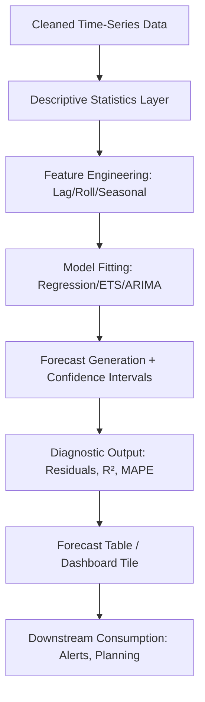

# 1. Title
Using Statistics and Built-In Functions for Forecasting and Predictive Analysis in Snowflake

# 2. Overview
This pattern defines the procedural architecture for applying statistical computations and built-in analytical functions to enable forecasting, trend detection, and predictive modeling within Snowflake. It exists to eliminate data movement to external tools, leverage Snowflake's distributed compute for scalable statistical evaluation, and provide deterministic, auditable forecasting logic for production pipelines. The pattern operates in the analytical computation layer, executed after data cleaning and aggregation but before final prediction output. It is consumed by data scientists, analytics engineers, business analysts building forecast dashboards, and SnowPro Advanced candidates evaluating statistical function semantics, NULL handling in aggregations, and optimizer behavior for analytical expressions.

# 3. SQL Object Summary
| Object/Pattern | Type | Purpose | Source Objects/Inputs | Output Objects/Behavior | Execution Mode |
|----------------|------|---------|------------------------|--------------------------|----------------|
| Statistical Forecasting Pipeline | SQL Function Pattern / Analytical Workflow | Compute descriptive statistics, fit predictive models, generate forecasts using built-in functions | Cleaned time-series tables, aggregated metrics, feature datasets | Forecast values, confidence intervals, model diagnostics, residual metrics | Synchronous query execution or scheduled via `TASK` |

# 4. Architecture
The architecture implements a layered statistical computation pipeline. Raw time-series data enters a descriptive statistics layer for baseline characterization. A feature engineering layer derives lag, rolling, and seasonal components. A modeling layer applies built-in regression, exponential smoothing, or ARIMA-like functions via SQL or Snowpark ML. Results are projected with confidence intervals and diagnostic metrics. The pipeline supports both inline forecasting via SQL and batch model training via Snowpark ML procedures.

# 5. Data Flow / Process Flow
1. **Descriptive Statistics Computation**
   - Input: Time-series dataset with timestamp and metric columns
   - Transformation: `AVG`, `STDDEV`, `VAR`, `PERCENTILE_CONT`, `CORR` evaluated per time window
   - Output: Baseline statistics for trend and volatility characterization
   - Purpose: Establish data distribution properties before modeling

2. **Feature Engineering for Temporal Patterns**
   - Input: Descriptive outputs, timestamp column
   - Transformation: `LAG`, `LEAD`, windowed `AVG`/`SUM`, `DATE_TRUNC` for seasonality, `DATEDIFF` for time deltas
   - Output: Derived features: lagged values, rolling averages, seasonal flags
   - Purpose: Enable models to capture autocorrelation and periodic patterns

3. **Model Fitting via Built-In Functions**
   - Input: Engineered features, target metric
   - Transformation: `REGR_*` functions for linear regression, `FORECAST` (if available), or Snowpark ML `fit()` procedures
   - Output: Model coefficients, fitted values, goodness-of-fit metrics
   - Purpose: Quantify relationships and generate predictive equations

4. **Forecast Generation with Uncertainty Bounds**
   - Input: Fitted model, future time horizon
   - Transformation: Apply model equation to future timestamps; compute confidence intervals via `STDDEV` of residuals
   - Output: Point forecasts + upper/lower bounds per future period
   - Purpose: Deliver actionable predictions with quantified uncertainty

5. **Diagnostic Validation & Output Projection**
   - Input: Forecast results, actuals for backtesting period
   - Transformation: Compute `MAPE`, `RMSE`, residual analysis via `CASE` logic
   - Output: Forecast table with diagnostics, ready for dashboard or alerting
   - Purpose: Enable model monitoring and stakeholder trust in predictions

# 6. Logical Breakdown
| Component | Responsibility | Inputs | Outputs | Dependencies | Failure Modes / Risks |
|-----------|----------------|--------|---------|--------------|------------------------|
| `descriptive_stats_engine` | Compute baseline distribution metrics | Time-series metric column, grouping keys | `AVG`, `STDDEV`, `PERCENTILE`, `CORR` per group | Non-NULL values; sufficient row count per group | Insufficient data causes `NULL` statistics; outliers skew `AVG`/`STDDEV` |
| `temporal_feature_builder` | Derive lag, rolling, seasonal features | Timestamp column, metric, window specifications | Lagged values, rolling aggregates, seasonal indicators | Deterministic timestamp ordering; consistent grain | Non-deterministic `ORDER BY` produces unstable features; missing timestamps break lag logic |
| `model_fitter` | Apply regression or exponential smoothing | Features, target metric, model type | Coefficients, fitted values, R², p-values | Linear relationship assumption for `REGR_*`; no multicollinearity | Violated assumptions produce misleading coefficients; `NULL` inputs propagate silently |
| `forecast_generator` | Project future values with confidence bounds | Fitted model, future timestamps, residual `STDDEV` | Point forecast + upper/lower bounds per period | Residuals approximately normal for valid intervals | Non-normal residuals invalidate confidence intervals; extrapolation beyond training range increases error |
| `diagnostic_evaluator` | Validate forecast accuracy | Forecast outputs, actuals for holdout period | `MAPE`, `RMSE`, residual plots via aggregation | Holdout data availability; consistent metric definitions | Overfitting masks poor generalization; small holdout sets produce noisy diagnostics |

# 7. Data Model (State Model)
| Object | Role | Important Fields | Grain | Relationships | Null Handling |
|--------|------|------------------|-------|---------------|---------------|
| `time_series_source` | Input dataset for forecasting | `timestamp`, `metric_value`, `dimension_keys`, `source_id` | Per observation per entity | Parent to forecast output | `NULL` metric values excluded from `AVG`/`STDDEV`; included in `COUNT(*)` |
| `forecast_output` | Predictive results for consumption | `forecast_timestamp`, `point_estimate`, `lower_bound`, `upper_bound`, `model_version`, `computed_at` | Per future period per entity | Child of source; traceable via `model_version` | Bounds may be `NULL` if residual `STDDEV` cannot be computed |
| `model_diagnostics` | Quality metrics for model monitoring | `model_version`, `r_squared`, `mape`, `rmse`, `residual_stddev`, `evaluated_at` | Per model evaluation run | Links to `forecast_output` via `model_version` | Diagnostics `NULL` if holdout data unavailable or insufficient |

Output Grain: One forecast row per future timestamp per entity. One diagnostic record per model evaluation. Source grain preserved through feature engineering unless explicitly aggregated.

# 8. Business Logic (Execution Logic)
- **Statistical Function Semantics**: `AVG`, `STDDEV`, `VAR` ignore `NULL` values; result is `NULL` if all inputs are `NULL`. `PERCENTILE_CONT` uses linear interpolation; `PERCENTILE_DISC` returns actual observed value. `CORR` computes Pearson correlation; requires at least two non-`NULL` pairs.
- **Regression Function Behavior**: `REGR_SLOPE`, `REGR_INTERCEPT`, `REGR_R2` evaluate linear relationships. All `REGR_*` functions ignore rows where either argument is `NULL`. `REGR_R2` returns `NULL` if variance of dependent variable is zero.
- **Window Function Integration**: `LAG(metric) OVER (ORDER BY timestamp)` enables autoregressive features. Frame clauses (`ROWS BETWEEN`) control rolling window scope. `IGNORE NULLS` modifier skips missing values in offset functions.
- **Confidence Interval Logic**: Bounds computed as `point_estimate ± (z_score * residual_stddev)`. Default z_score = 1.96 for 95% interval. Assumes residuals approximately normal; document violation if skewed.
- **Seasonality Handling**: `DATE_TRUNC('month', timestamp)` or `EXTRACT('DOW' FROM timestamp)` derives seasonal features. Multiple seasonalities require composite feature engineering.
- **NULL Propagation Rules**: Statistical functions exclude `NULL` inputs but return `NULL` if insufficient non-`NULL` values remain. Forecast outputs inherit `NULL` from missing coefficients or undefined future timestamps.
- **Exam-Relevant Defaults**: `REGR_*` functions require at least two non-`NULL` pairs; otherwise return `NULL`. `PERCENTILE_CONT` interpolation may produce values not present in source. `STDDEV` uses sample standard deviation (n-1 denominator) by default. `CORR` returns `NULL` if either variable has zero variance. Window functions without explicit frame default to `RANGE BETWEEN UNBOUNDED PRECEDING AND CURRENT ROW` when `ORDER BY` is present.

# 9. Transformations (State Transitions)
| Source State | Derived State | Rule / Evaluation Logic | Meaning | Impact |
|--------------|---------------|-------------------------|---------|--------|
| `raw_metric` | `descriptive_summary` | `AVG(metric)`, `STDDEV(metric)`, `PERCENTILE_CONT(0.5) WITHIN GROUP (ORDER BY metric)` | Characterize central tendency and dispersion | Baseline for anomaly detection and model initialization |
| `timestamped_data` | `lagged_features` | `LAG(metric, 1) OVER (PARTITION BY entity ORDER BY timestamp)` | Capture autocorrelation for autoregressive modeling | Enables time-series forecasting; requires deterministic sort |
| `features + target` | `regression_coefficients` | `REGR_SLOPE(target, feature)`, `REGR_R2(target, feature)` | Quantify linear relationship strength | Coefficients drive forecast equation; R² indicates explanatory power |
| `fitted_model + future_timestamps` | `point_forecast` | `intercept + slope * future_feature_value` | Project expected value for future period | Core prediction output; uncertainty not yet quantified |
| `residuals + z_score` | `confidence_bounds` | `point_forecast ± (1.96 * STDDEV(residuals))` | Estimate range of plausible outcomes | Enables risk-aware decision making; assumes normal residuals |

# 10. Parameters / Variables / Configuration
| Name | Type | Purpose | Allowed Values | Default | Where Used | Effect |
|------|------|---------|----------------|---------|------------|--------|
| `CONFIDENCE_LEVEL` | Session Parameter | Control z-score for interval calculation | 0.90, 0.95, 0.99 | 0.95 | Forecast generation | Higher confidence widens intervals; reduces false negatives but increases false positives |
| `FORECAST_HORIZON` | Custom Parameter | Define number of future periods to predict | Integer ≥ 1 | 1 | Forecast loop or recursive CTE | Longer horizons increase extrapolation error; document uncertainty growth |
| `SEASONAL_PERIOD` | Custom Parameter | Specify seasonal cycle length for feature engineering | Integer (e.g., 7 for weekly, 12 for monthly) | None (must be explicit) | `DATE_TRUNC` or modulo feature logic | Incorrect period misaligns seasonal features; degrades model fit |
| `IGNORE_NULLS_IN_LAG` | Function Modifier | Control `LAG`/`LEAD` behavior with missing values | `IGNORE NULLS`, default honors `NULLs` | Honors `NULLs` | Window function specification | `IGNORE NULLS` skips gaps; may shift temporal alignment unexpectedly |
| `USE_SAMPLE_STDDEV` | Session Parameter | Select denominator for standard deviation | `TRUE` (n-1), `FALSE` (n) | `TRUE` | `STDDEV`, `VAR` functions | Sample vs population stddev affects confidence interval width |

# 11. APIs / Interfaces
| Interface | Invocation Method | Input Structure | Output Structure | Error Behavior | Consumers |
|-----------|-------------------|-----------------|------------------|----------------|-----------|
| `REGR_*` functions | SQL Aggregate | `REGR_SLOPE(y, x)`, `REGR_R2(y, x)` | Scalar coefficient or fit metric | Returns `NULL` if <2 non-`NULL` pairs or zero variance | Regression modeling in SQL |
| `PERCENTILE_CONT`/`DISC` | SQL Aggregate | `PERCENTILE_CONT(0.9) WITHIN GROUP (ORDER BY col)` | Interpolated or observed percentile | Fails if `ORDER BY` missing; returns `NULL` if no rows | Distribution analysis, threshold setting |
| `LAG`/`LEAD` with `IGNORE NULLS` | SQL Window | `LAG(col, n, default) IGNORE NULLS OVER (...)` | Offset value or default | Returns `default` or `NULL` at boundaries; `IGNORE NULLS` unsupported in some contexts | Autoregressive feature engineering |
| Snowpark ML `fit()` | Python API | `model.fit(df, target_col)` | Trained model object | Fails on non-numeric target or insufficient data | Advanced modeling beyond SQL functions |
| `SYSTEM$FORECAST` | Not Natively Available | N/A | N/A | N/A | N/A |

# 12. Execution / Deployment
- Executed via scheduled `TASK` for batch forecasting or interactive SQL for ad-hoc analysis.
- Snowpark ML procedures require Python runtime and warehouse with Snowpark library enabled.
- Upstream dependency: Cleaned, type-resolved time-series data with consistent timestamp grain.
- Environment behavior: Dev/test may use shorter `FORECAST_HORIZON` for rapid iteration; production mandates backtesting diagnostics before deployment.
- Runtime assumption: Linear models assume stationarity; non-stationary series require differencing or transformation prior to `REGR_*` evaluation.

# 13. Observability
- Track model drift: Monitor `R²` and `MAPE` trends in `model_diagnostics` over time; alert on degradation >10% from baseline.
- Validate forecast calibration: Compare actuals vs predicted bounds; flag periods where actual falls outside 95% interval more than 5% of the time.
- Monitor compute cost: Query `ACCOUNT_USAGE.QUERY_HISTORY` for statistical function-heavy queries; high `BYTES_SCANNED` may indicate missing pruning on time filters.
- Audit feature stability: Track distribution of lag/rolling features; sudden shifts may indicate upstream data quality issues.
- Implement backtesting automation: Scheduled job holds out recent periods, generates forecasts, and logs `MAPE`/`RMSE` for model comparison.

# 14. Failure Handling & Recovery
- **Insufficient non-NULL pairs for regression**: `REGR_*` returns `NULL`. Detection: Forecast output shows `NULL` coefficients. Recovery: Increase training window, impute missing values, or switch to model tolerant of sparsity.
- **Non-stationary series breaks linear assumptions**: Trend or seasonality causes biased forecasts. Detection: Residuals show autocorrelation or pattern; `MAPE` degrades over time. Recovery: Apply differencing (`metric - LAG(metric)`), add seasonal features, or use exponential smoothing.
- **Confidence intervals too narrow due to non-normal residuals**: Actuals fall outside bounds more frequently than expected. Detection: Backtesting shows >5% of actuals outside 95% interval. Recovery: Use empirical percentiles of residuals instead of normal assumption; document limitation.
- **Window function misalignment from `IGNORE NULLS`**: Lag features shift unexpectedly when gaps exist. Detection: Forecast accuracy drops after data quality incident. Recovery: Explicitly handle missing timestamps via imputation or exclude gaps via `WHERE` clause before feature engineering.
- **Snowpark ML library not enabled**: Python cell fails with import error. Detection: `ModuleNotFoundError` in Notebook. Recovery: Enable Snowpark at account level or fallback to SQL-only `REGR_*` functions for linear models.

# 15. Security & Access Control
- Statistical functions inherit `SELECT` privileges on referenced columns; no additional permissions required.
- Snowpark ML procedures execute with session role privileges; cannot escalate beyond granted access.
- Forecast outputs may contain sensitive projections; apply `ROW ACCESS POLICY` if entity-level forecasts could expose competitive information.
- Model diagnostics should be restricted to data science roles; business consumers receive only point forecasts and bounds.
- Audit model retraining events via custom logging to track when forecast logic changes.

# 16. Performance / Scalability Considerations
- `REGR_*` and `CORR` require full table scans unless filtered by time; apply `WHERE timestamp >= ...` to enable pruning on clustered time columns.
- Window functions with large partitions (e.g., unbounded `OVER (PARTITION BY entity)`) cause memory spill; cluster source tables on entity + timestamp to align micro-partitions with window boundaries.
- `PERCENTILE_CONT` requires sorting; expensive on high-cardinality groups. Use `APPROX_PERCENTILE` for large datasets when ±1–2% error is acceptable.
- Recursive CTEs for multi-step forecasting scale poorly beyond ~100 periods; prefer set-based generation of future timestamps joined to model coefficients.
- Snowpark ML model training scales with data volume; use `TABLESAMPLE` for prototyping, full data for production fits.
- Exam trap: `REGR_*` functions ignore `NULL` pairs but do not impute; ensure upstream cleaning handles missing values. `STDDEV` uses sample formula (n-1) by default; population stddev requires manual calculation. `PERCENTILE_CONT` may return values not present in source due to interpolation.

# 17. Assumptions & Constraints
- Assumes time-series data has consistent timestamp grain; mixed frequencies require resampling before feature engineering.
- Assumes linear relationships for `REGR_*` functions; non-linear patterns require polynomial features or non-SQL modeling.
- Assumes residuals are approximately normal for valid confidence intervals; document violation if skewed or heavy-tailed.
- `LAG`/`LEAD` require deterministic `ORDER BY`; ties without unique sort key produce non-deterministic feature values.
- `PERCENTILE_CONT` interpolation may produce values outside observed range; validate business logic accepts interpolated results.
- Snowpark ML functions require Python runtime and library enablement; not available in all Snowflake editions or regions.
- Exam trap: `REGR_R2` returns `NULL` if dependent variable has zero variance. `CORR` requires at least two non-`NULL` pairs. `STDDEV` of a single non-`NULL` value returns `NULL`. Window functions without explicit frame default to `RANGE` when `ORDER BY` is present, which may produce unexpected running calculations.

# 18. Future Enhancements
- Integrate Snowflake Native Forecasting functions (if released) to replace manual `REGR_*` + interval logic with optimized, maintained implementations.
- Implement automated stationarity testing via `ADF`-like logic in Snowpark to flag series requiring differencing before modeling.
- Add ensemble forecasting: Combine multiple model outputs (linear, exponential, seasonal) via weighted average to improve robustness.
- Develop feature importance reporting: Use `REGR_*` coefficients and permutation tests to document driver contributions for stakeholder transparency.
- Enable real-time forecast updates: Use Snowflake Streams to trigger incremental model retraining when new data arrives, reducing forecast latency.
